# Docker

## 虚拟机(VM)和容器

- 虚拟机允许多应用能够稳定、安全地同时运行在一个服务器中的技术，但是最大的缺点就是依赖其专用的操作系统(OS)，OS会占用额外的CPU、RAM和存储，而且安装在OS上的应用，进行迁移难度和成本都很高。

- 容器模型其实跟虚拟机模型相似，其主要的区别在于，运行在相同宿主机上的容器是共享一个操作系统的。

## 概念

Docker是容器模型中的一种具体的实现产品，是一个运行在Windows或Linux上的软件。

### 镜像

镜像是一堆静态文件。比如虚拟机本质是许多文件，可以把这些文件看成虚拟机镜像，整体移动文件，即是移动虚拟机。

- 虚拟机镜像安装的是操作系统，操作系统上可以安装各种应用。

- Docker镜像是应用和支撑应用所必须的环境，比如web镜像是一个web应用和支撑web应用的环境如tomcat、jdk、mysql等。

### 容器

可以把容器看装镜像的盒子，容器彼此之间相互隔离、互不可见，可以运行里边的镜像里的应用。镜像的静态文件在容器中动态运行。

> 镜像：是静态的，里边有应用，是没有运行起来的应用。好比Java的类。
>
> 容器：是动态的，是镜像跑起来，运行起来后的概念，镜像在怎么跑起来，靠Docker引擎。好比类实例化后的对象。

### 仓库

镜像仓库服务器存放着多个仓库。每个仓库存放某一类镜像，通过不同的标签( tag)来进行区分。

根据所存储的镜像公开分享与否，Docker 仓库可以分为公开仓库(Public) 和私有仓库(Private) 两种形式。

## Docker引擎

> *通过Docker引擎下载镜像，启动镜像(基于镜像生成一个容器实例)*
>
> 宿主机：安装Docker引擎的计算机主机，虚拟机里面安装Docker则虚拟机即是宿主机。
>
> 虚拟机：在虚拟机引擎里安装的操作系统。
>
> 物理机：在物理计算机上安装的操作系统。

### 概念

- Docker引擎是用于运行和编排容器的基础设施工具(之后安装的服务，其他产品运行在服务上)。Docker引擎是是容器最核心的东西，其他产品基于Docker引擎的核心功能进行集成。
- 2017 年第一季度以前，Docker 版本号遵循**大版本号.小版本号的格式**。采用新格式前的最后一个版本是Docker 1.13。从2017年第一季度开始，Docker 版本号遵循YY.MM-xx格式，例如，2018 年6月第一次发布的社区版本为18.06.0-CE。

### 安装

- Windows安装

  - 下载地址：`https://hub.docker.com/editions/community/docker-ce-desktop-windows/`
  - 需要运行在一个安装了64位Windows 10操作系统的计算机上，通过启动一个独立的引擎来提供Docker环境。
  - 安装Docker的计算机要求在BIOS开启硬件虚拟化支持，Windows系统需要开启Hyper-v服务
  
- Linux安装

  ```sh
  #安装Docker CE
  yum -y install docker-ce docker-ce-cli containerd.io
  #启动Docker
  systemctl start docker
  systemctl status docker
  #测试安装
  docker version
  ```

  Docker服务启动时实际上是调用了dockerd命令来启动Docker服务，dockerd是管理后台进程，默认的配置文件为`/etc/docker/daemon.json`

  ```sh
  #-D：开启Debug模式
  #-H：设置监听端口
  $ dockerd -D -H tcp://127.0.0.1:2376
  
  #也可以修改Docker配置文件/etc/docker/daemon.json，随着dockerd启动而生效：
  {
  "debug": true,
  "hosts": {"tcp://127.0.0.1:2376"}
  }
  
  #查看Docker服务的日志信息
  在RedHat系统上日志文件为/var/log/messages,
  在Ubuntu或CentOS系统上可以执行命令
  $ journalctl -u docker.service
  
  #查看Docker信息
  $ docker info 
  ```

## Docker镜像

### 下载获取

默认从官方(docker.hub.com)的仓库Docker Hub上下载镜像，可以把Docker的默认配置改为从国内的阿里云镜像仓库里获取镜像

**镜像加速器配置**

可以加速下载

> 1. 访问阿里云地址：dev.aliyun.com
>
> 2. 注册阿里云账号
>
> 3. 找到镜像加速器，拿到专属自己的镜像加速地址   [https://ycq9id5i.mirror.aliyuncs.com](https://ycq9id5i.mirror.aliyuncs.com)    
>
>    将说明中的配置，配置到Docker引擎的配置文件/etc/docker/daemon.json
>
>    {
>
>    ​	 "registry-mirrors": ["https://ycq9id5i.mirror.aliyuncs.com"]
>
>    }
>
>    //可选网易：http://hub-mirror.c.163.com
>
> 4. 让上面的配置文件生效，重新加载一下：systemctl daemon-reload
>
> 5. 重启docker：systemctl restart docker

**下载放置地址**

Linux Docker 主机本地镜像仓库通常位于`/var/lib/docker/`

Windows Docker主机则是`C:\ProgramData\docker\windowsfilter`

**下载的镜像文件结构**

是以层的结构组成的：

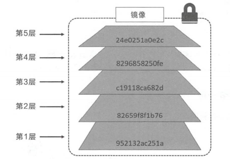

> 可以共享，不同的镜像，如果有相同的部分层文件，他们不同的镜像之间会共享相同的层，只需要下载和保存不同的层就可以了，这样就节省了大量的存储空间。

### 镜像命令

#### 下载

```sh
$ docker [image] pull [可选的选项参数] 镜像仓库名称:tag标记

#tag标记不写，默认latest，latest标签意味着该镜像的内容会跟踪最新版本的变更而变化，内容是不稳定的
#镜像的仓库名称中还应该添加仓库地址，默认使用的是官方Docker Hub 服务，该前缀可以忽略
#可选的选项参数
-a/--all-tags=true | false: 是否获取仓库中的所有镜像，默认为否
--disable-content-trust: 取消镜像的内容校验，默认为真


$ docker pull redis:6.0.5
$ docker image pull redis:6.0.5
$ docker pull registry.hub.docker.com/redis:6.0.5
$ docker pull hub.c.163.com/public/redis:2.8.4 #网易云的镜像源

#pull后镜像就从远程仓库中，下载到本地了，下载后就可以用来构建容器，运行起来
$ docker run -it redis:6.0.5
```


#### 查看

```sh
#列出本地主机上已有镜像的基本信息
$ docker images
$ docker image ls
REPOSITORY    TAG     IMAGE ID           CREATED       SIZE
ubuntu        18.04   452a96d81c30    	2 weeks ago    79.6MB

#-a或--all=“true“列出所有(包括临时文件)镜像文件，默认为false
$ docker images -a

#只显示镜像ID
$ docker images -q

#-f或--filter可以用来过滤
#只显示没有被使用的镜像
$ docker images -f  "dangling=true"

#根据repository名称和tag模糊过滤
$ docker images --filter reference='busy*:*libc'

#默认是false会截断过长的信息，比如IMAGE ID
$ docker images --no-trunc=true
```

```sh
#添加镜像标签(类似快捷方式)
$ docker tag ubuntu:latest myubuntu:latest 
```

```sh
#查看详细信息
$ docker image inspect redis:6.0.5 

#-f用来指定获取其中一项内容
$ docker image inspect -f {{".RepoDigests"}}  redis:6.0.5 	#获取镜像的RepoDigests
```

```sh
# -f或--filter搜索Docker Hub官方仓库中的镜像
#搜索官方提供的带redis关键字的镜像
$ docker search --filter=is-official=true redis

#搜收藏数量大于等于90的redis的镜像
$ docker search --filter=stars=90 redis
```

#### 删除清理

```sh
#通过标签删除镜像，当一个镜像有多个标签时，只会删除当前标签
$ docker image  rm redis:latest
$ docker rmi redis:latest

#通过镜像ID删除镜像，当一个镜像有多个标签时删除失败
$ docker rmi 452a96d81c30
#-f，-force强制删除，才能删除成功
$ docker rmi 452a96d81c30 -f
```

```sh
#清理镜像，使用Docker一段时间后，系统中可能会遗留一些临时的镜像文件，以及一些没有被使用的镜像需要清理
#自动清理临时的遗留镜像文件层，最后会提示释放的存储空间
$ docker image prune -f
Total reclaimed space: 1.4 GB

-a, -all:删除所有无用镜像，不光是临时镜像;
-filter filter: 只清理符合给定过滤器的镜像;
-f，-force:强制删除镜像，而不进行提示确认。
```

#### 创建

```sh
#在现有容器的基础上创建新镜像
docker [container] commit [options]  containerid  [repository[:tag]]

#-a，--author="":作者信息;
#-C，--change=[] :提交的时候执行Dockerfile指令,包括CMD | ENTRYPOINT |ENV | EXPOSE |LABEL | ONBUILD |USER | VOLUME WORKDIR 等;
#-m，--message="":提交消息;
#-p，--pause=true:提交时暂停容器运行。

$ docker container commit -a "zhonghao" -m "创建新镜像测试" 98da88460690 contest:1
sha256:cd53befffef838231ed906fc0053a5c15dc97e2abece5fa926edb14d1255a0bf  #返回新创建的镜像的ID:
```

##### docker build

命令用于使用 Dockerfile 创建镜像。 

```sh
#使用当前目录的 Dockerfile 创建镜像，标签为 runoob/ubuntu:v1
$ docker build -t runoob/ubuntu:v1 .

#-f 指定 Dockerfile 文件的位置
$ docker build -f /path/to/a/Dockerfile .
```


#### 导出载入

```sh
# -o、-output导出本地的hello-world:latest镜像为文件hhh.tar
$ docker [image] save -o hhh.tar hello-world:latest

#-i、-input从文件hhh.tar导人镜像到本地镜像库
$ docker load -i hhh.tar
$ docker load < hhh.tar
```

#### 上传

上传到公共的或者私有的镜像仓库

**使用阿里云**

构建自己的网络上的镜像仓库，进入到阿里云的官网：dev.aliyun.com查看操作指南

```sh
#将本地的镜像添加新的标签，标签路径可在阿里云账号上获取
$ docker tag hello_world:lastest registry.cn-hangzhou.aliyuncs.com/mypro/repodemo:hello001
#上传镜像到阿里云仓库
$ docker push registry.cn-hangzhou.aliyuncs.com/mypro/repodemo:hello001
```

**创建本地私有仓库**

```sh
#下载安装本地镜像   
$ docker run -d -p 5000:5000 --restart=always --name registry2 registry:2

#5000:5000宿主机端口:容器端口
#--restart=alwarys 标识当docker daemon启动的时候一起启动私库容器
#--name registry2容器名称
#registry:2指的是私库镜像标签：tag

#将镜像上传到docker私服
$ docker tag centos:7 localhost:5000/centos:7
$ docker push localhost:5000/centos

#获取私有仓库镜像
$ docker pull 127.0.0.1:5000/centos:7
$ docker pull localhost:5000/centos:7
$ docker pull 192.168.17.128:5000/centos:7
```

> 用ip地址，https和http不匹配报错的话尝试：
>
> 在/etc/docker下的daemon.json
>
> {
>
> "insecure-registries":["192.168.17.128:5000"]
>
> }
>
> 
>
> 修改了配置文件后重启docker
>
> systemctl daemon-reload
>
> systemctl restart docker

```sh
#查看私服镜像所有仓库
$ curl http://localhost:5000/v2/_catalog

#查看仓库中镜像的所有标签列表
$ curl http://localhost:5000/v2/centos/tags/list
```

## Docker容器

同一个宿主机上的容器依赖同一个操作系统，但是每个容器又可以看成独立的微型操作系统


容器是整个Docker技术栈的核心，命令选项主要包括如下几大类:与容器运行模式相关、与容器环境配置相关、与容器资源限制和安全保护相关：

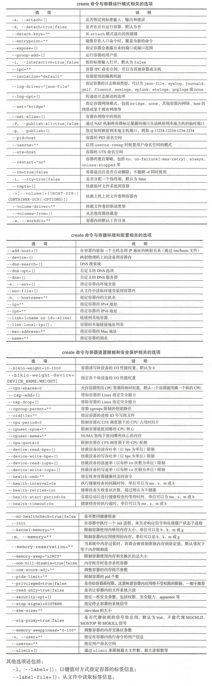

### 创建和运行

#### 新建和启动

```sh
#新建的容器处于停止状态
$ docker [container] create centos:7
```

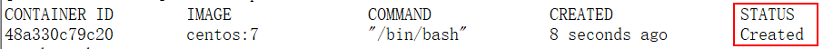

```sh
# 启动
$ docker start  48a330c79c20
```

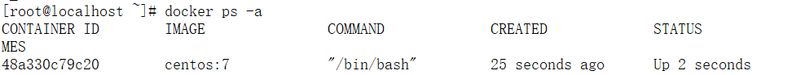

#### run命令

可以在宿主机里，用一条命令实现：创建、启动容器并调用容器的命令，并且体现-it参数的交互模式启动容器的效果

```sh
$ docker run -it  centos:7  [/bin/bash]

#其中，-t选项让Docker分配一个伪终端并绑定到容器的标准输入上, -i则让容器的标准输入保持打开。-it不可少，少了，容器就会走一个生命周期后终止。

#这样子创建的容器是交互式的，命令执行之后直接进入伪终端，可以通过保持开启的容器的标准输入，从终端输入命令进去到容器里去；命令在容器里执行的结果，也可以通过伪终端，显示出来。
#终端既是访问入口，比如远程链接工具使用ssh访问linux服务器，使用的就是bash终端输入
```


##### 运行流程和启动命令

```sh
$ docker run -it  centos:7  [/bin/bash]
```

**运行流程：**

> 1. 创建容器
>
> 2. 启动容器，保持标准输入和开启伪终端
>
> 3. 执行容器中/bin/bash命令，启动容器里的bash终端
>
> 创建容器，启动容器里的bash终端，并且保持标准输入和开启伪终端，就可以以交互式的模式运行起容器


```sh
#下面的命令输出一个"Hello World"，之后容器自动终止:
$ docker run  centos:7 /bin/echo 'Hello world'
Hello world
```

**运行流程：**

> 当利用docker [container] run 来创建并启动容器时，Docker 在后台运行的标准操作包括:
>
> 1. 检查本地是否存在指定的镜像，不存在就从公有仓库下载;
> 2. 利用镜像创建一个容器，并启动该容器;
> 3. 分配一个文件系统给容器，并在只读的镜像层外面挂载一层可读写层;
> 4. 从宿主主机配置的网桥接口中桥接一个虚拟接口到容器中去;
> 5. 从网桥的地址池配置一个 IP地址给容器;
> 6. 执行用户指定的应用程序;
> 7. 执行完毕后容器被自动终止。


```sh
#tomcat容器启动默认运行命令为catalina.sh，centos容器启动命令为bin/bash
$ docker run  tomcat:8 [catalina.sh]
```

#### 守护态运行

```sh
#下面的命令会让Docker容器在后台以守护态(Daemonized)形式运行，容器启动后会返回一个唯一的id
$ docker run -d centos:7 /bin/sh -c "while true; do echo hello world; sleep 1;done"
ce554267d7a4c34eef c92c5517051dc37b918b588736d0823e4c846596b04d83

#-d也是走一个生命周期结束，加上-c执行命令，命令终止之前不会退出
#可以同时使用-dit容器以后台方式运行，不进入伪终端并且会以交互模式运行不会终止
```

### 停止

#### 退出伪终端

- exit：停止运行中的容器，再退出伪终端，实质上是退出/bin/bash这个终端进程
- 快捷键：ctrl+p+q，不停止容器实例的运行，退出伪终端

#### 暂停

```sh
#--rm默认为false终止后不会删除容器，加上之后为true
$ docker run --name test --rm -it centos:7
$ docker pause test

$ docker unpause test
```

#### 终止

```sh
#该命令会首先向容器发送SIGTERM信号，等待一段超时时间后(默认为10秒)，再发送SIGKILL信号来终止容器
$ docker stop test

#直接发送 SIGKILL信号来强行终止容器
$ docker kill test
```

```sh
#重启
$ docker restart test
```

### 删除

```sh
#删除处于终止或退出状态的容器
$ docker [container]  rm test

#-f, -- force=false: 强行终止并删除一个运行中的容器;
#-l，--link=false: 删除容器的连接，但保留容器;
#-v， --volumes=false:删除容器挂载的数据卷
```

```sh
#批量删除所有容器，将括号中命令的返回值作为参数
$ docker rm $(docker ps -aq)

$ docker kill $(docker ps -q) 
```

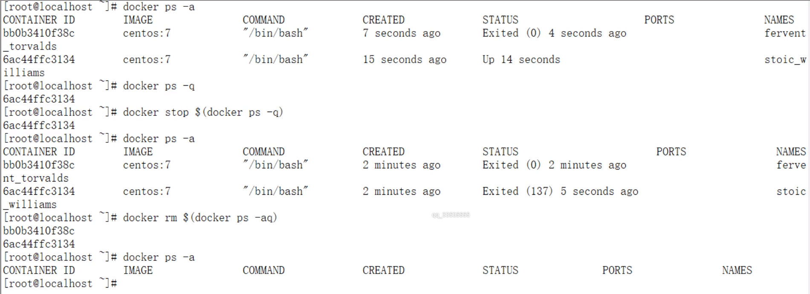

### 进入

```sh
#当多个窗口同时attach到同一个容器的时候，所有窗口都会同步显示；当某个窗口因命令阻塞时，其他窗口也无法执行操作了。
$ docker attach  243c32535da7
root@243c32535da7:
```

```sh
#进入到刚创建的容器中，并启动一个bash:
$ docker exec -it  243c32535da7  /bin/bash
root@243c32535da7:/#

#-d, --detach: 在容器中后台执行命令;
#-i : 打开标准输人接受用户输人命令，默认值为false
#-t，--tty=true | false: 分配伪终端，默认值为false;
```


### 导入导出

**导出**

```sh
#导出一个已经创建的容器到一个文件，不管此时这个容器是否处于运行状态，通过-o选项来指定导出的tar文件名
$ docker export  -o test.tar  xxxxxx

#生成的文件是容器快照，可以转移到其他机器上使用
```

*docker  commit命令是将运行中的容器，生成镜像文件，然后转移到其他机器上使用docker  load命令载入*

**docker  commit和docker export命令的主要区别总结：**

- docker export不管容器运行是否都可以导出，docker  commit只有运行中的容器才可以使用。

- docker export生成的容器快照文件将丟弃所有的历史记录和元数据信息(即仅保存容器当时的快照状态)，docker  commit生成的镜像存储文件将保存完整记录，体积更大。元数据信息即容器基于的镜像相关信息，如镜像相关标签和tag。

**导入**

```sh
#将导出的test.tar 文件导人到本地镜像库中变成镜像
$ docker import  test.tar  
$ docker tag xxxxx   ctos:7
```

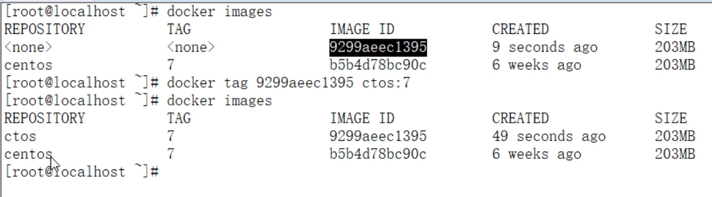

```sh
#导出的容器快照文件，会丢失元数据信息，所以，我们在基于导入的镜像创建新容器的时候，docker run命令，不能省略后面的子命令。对于centos镜像来讲子命令:/bin/bash
```

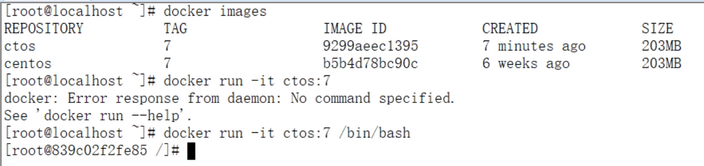


### 查看

#### 查看日志输出

```sh
#-t，-timestamps:显示时间戳信息;
#-f, -follow: 持续保持输出;
#-tail string:输出最近的若干日志;

$ docker logs  容器id
$ docker logs -t -f --tail 3  容器id	#显示历史记录尾部3行之后持续输出
```

#### 查看容器

```sh
#查看当前运行的容器信息，-a查看所有容器信息
$ docker ps 

$ docker container ls
```

#### 查看详情

```sh
#查看某容器的具体信息，会以json格式返回包括容器Id、创建时间、路径、状态、镜像、配置等在内的各项信息:
$ docker container  inspect  test
```

#### 查看容器内进程

```sh
#这个子命令类似于Linux系统中的top命令，会打印出容器内的进程信息，包括PID、用户、时间、命令等。
$ docker top test
PID       USER    TIME    COMMAND
573 0     0       0:00      /portainer
```

#### 查看统计信息

```sh
#查看当前运行中容器的系统资源使用统计，会显示CPU、内存、存储、网络等使用情况的统计信息。
$ docker  [container]  stats   bc5c38e70b5f
CONTAINER ID     NAME                 CPU %           MEM USAGE / LIMIT   MEM %            NET I/O     BLOCK I/O         PIDS
bc5c38e70b5f     heuristic_yalow     0.00%           404KiB / 7.777GiB   0.00%            656B / 0B   0B / 0B           1

#-a, -all:输出所有容器统计信息，默认仅在运行中;
#-no-stream:不持续输出，默认会自动更新持续实时结果;
#-no- trunc:不截断输出信息。
```

### Other

#### 复制文件到容器和复制文件到宿主机

```sh
#支持在容器和主机之间复制文件
$ docker [container]  cp [OPTIONS] CONTAINER:SRC_PATH   DEST_ PATH

$ docker cp a42d7bf373b9:/opt/redis/cipher /home/temp/
#-a, -archive: 打包模式，复制文件会带有原始的uid/gid信息;
#-L，-follow-link :跟随软连接。当原路径为软连接时，默认只复制链接信息，使用该选项会复制链接的目标内容。

#在宿主机运行命令,将宿主机本地的路径data复制到test容器的/tmp路径下
$ docker cp  data/  test:/tmp/
```

```sh
# 将主机/www/runoob目录拷贝到容器96f7f14e99ab的/www目录下。
$ docker cp /www/runoob 96f7f14e99ab:/www/

# 将主机/www/runoob目录拷贝到容器96f7f14e99ab中，目录重命名为www。
$ docker cp /www/runoob 96f7f14e99ab:/www

# 将容器96f7f14e99ab的/www目录拷贝到主机的/tmp目录中。
$ docker cp  96f7f14e99ab:/www /tmp/
```


#### 查看变更

```sh
#查看容器内文件系统的变更
#查看test容器内的数据修改
$ docker container diff  test
```

## 数据管理

- 在容器内创建数据卷，并且把本地的目录或文件挂载到容器内的数据卷中。

- 使用数据卷容器，使得容器和容器之间共享数据，并实现数据的备份和恢复。

### 数据卷

数据卷(Data Volumes)是一个在容器内的特殊目录，这个目录和宿主机里的某个目录有特殊的映射关系

- 数据卷可以在容器之间共享和重用，容器间传递数据将变得高效与方便;
- 对数据卷内数据的修改会立马生效，无论是容器内操作还是宿主机本地操作;
- 对数据卷的更新不会影响镜像，解耦开应用和数据;
- 数据卷会一直存在，直到没有容器使用，可以安全地卸载它。

#### 创建

```sh
$ docker volume create [-d  local]  test   

#使用-d参数可以指定不同的驱动，本地卷是内置的local驱动，本地卷只能被所在节点(这里所在节点是本地)的容器使用，第三方驱动可以通过插件方式接入
```

**卷插件：**

- 块存储：相对性能更高，适用于对小块数据的随机访问负载。
- 文件存储：包括 NFS 和 SMB 协议的系统，同样在高性能场景下表现优异。
- 对象存储：适用于较大且长期存储的、很少变更的二进制数据存储。通常对象存储是根据内容寻址，并且性能较低。

> 使用 local 驱动创建的卷在 Docker 主机上均有其专属目录，
>
> 在 Linux 中位于 `/var/lib/docker/volumes` 目录下，
>
> 在 Windows 中位于`C:\ProgramData\Docker\volumes` 目录下。

```sh
#查看本地卷，只能查看volumes/目录下的数据卷，也就是说只能查看普通数据卷，无法查看bind绑定数据卷
$ docker volume ls

#查看详情
$ docker volume inspect test
#Driver 和 Scope 都是 local。这意味着卷使用默认 local 驱动创建，只能用于当前 Docker 主机上的容器。
#Mountpoint 属性说明卷位于 Docker 主机上的位置。
```

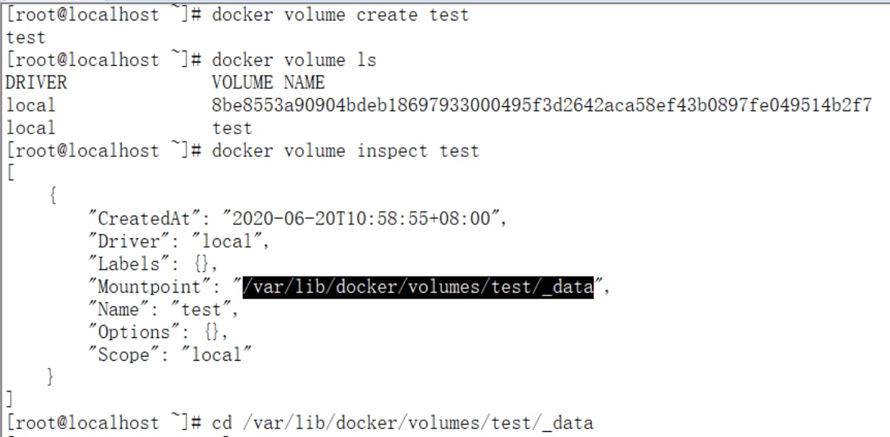


#### 删除

```sh
#删除未装入到容器或者服务的所有卷
$ docker volume prune

#删除指定卷
$ docker volume rm test

#两种删除命令都不能删除正在被容器或者服务使用的卷
```

```sh
#删除正在被使用的数据卷，可以和最后一个和该数据卷绑定的容器删除，一起删除
$ docker [container] rm -v  xxxid
```

#### 使用

使用run命令+--mount选项来使用数据卷

**--mount选项支持三种类型的数据卷，包括:**

- volume:普通数据卷，映射到主机/var/lib/docker/volumes路径下; 
- bind:绑定数据卷，映射到主机指定路径下;
- tmpfs:临时数据卷，只存在于内存中。

```sh
#使用centos:7镜像创建一个centos容器，并创建一个数据卷挂载到容器的/test目录:
$ docker container run -dit --name centos  --mount  type=volume,source=testvolume, destination=/test  centos:7 #source指定数据卷名称
$ docker container run -dit --name centos1  --mount  type=bind,source=/root/abc,destination=/test centos:7 #数据卷名称随机


#宿主机目录：容器目录，宿主机目录省略时默认使用volumn数据卷，不省略即为bind写法
$ docker container run -dit --name centos2  -v  /root/abc:/test/  centos:7 

#本地目录的路径必须是绝对路径，容器内路径可以为相对路径。如果目录不存在，Docker会自动创建。
```

```sh
#Docker挂载数据卷的默认权限是读写(rw), 用户也可以通过ro指定为只读，加了:ro之后，容器内对所挂载数据卷内的数据就无法修改了
$ docker container run -dit --name centos3  -v  /root/abc:/test:ro  centos:7
```

**注意：**

- 同一个目录可以和多个容器建立关联

- 推荐挂载文件所在的目录到容器内进行同步，挂载的时候也是可以把一个文件同步到容器，但是使用文件编辑工具，可能会造成文件inode的改变，可能会导致报错。

### 数据卷容器

数据卷容器也是一个容器，但是它的目的是专门提供数据卷给其他容器挂载，可以实现在多个容器之间共享一些持续更新的数据。

```sh
#首先创建一个容器dbdata,并让宿主机创建一个数据卷挂载到centos容器里的目录/dbdata:
$ docker run -it -v /dbdata --name dbdata centos:7   

#然后，可以在其他容器中使用--volumes-from来挂载dbdata容器中的数据卷
#例如创建db1和db2两个容器，并从dbdata容器挂载数据卷:
$ docker run -it --volumes-from dbdata --name db1 centos:7   
$ docker run -it --volumes-from dbdata --name db2 centos:7   

#容器db1和db2都挂载同一个数据卷到相同的/dbdata目录，三个容器任何一方在该目录下的写人，其他容器都可以看到，容器dbdata即称为数据卷容器
```

如果删除了挂载的容器某一个(包括dbdata、db1和db2 )，数据卷并不会被自动删除，必须在删除最后一个还挂载着它的容器时显式使用`docker rm -v` 命令来指定同时删除关联的数据卷

#### 备份

```sh
$ docker  run --volumes-from dbdata -v  $(pwd):/backup --name worker centos:7  tar  cvf  /backup/backup.tar /dbdata

#docker run --name worker centos:7 利用centos:7镜像创建了一个容器worker
#--volumes-from dbdata -v $(pwd):/backup 指定多个数据卷
	#使用--volumes-from dbdata 参数来让worker容器挂载dbdata容器的数据卷
	#使用-v $(pwd):/backup参数来挂载本地的当前目录到worker容器的/backup目录。
#worker容器启动后，使用tar cvf /backup/backup.tar /dbdata命令将/dbdata下内容打包为容器内的/backup/backup.tar

#dbdata中/dbdata-->worker中/dbdata-->worker中/backup-->本地的当前目录
```

#### 恢复

```sh
$ docker run --volumes-from dbdata -v $(pwd):/backup --name newworker  centos:7  tar xvf  /backup/backup.tar -C /

#本地的当前目录backup.tar-->newworker中/backup/backup.tar-解压到newworker根目录，之前把/dbdata打包->newworker中/dbdata-->dbdata中/dbdata
```


## 服务访问

**为了满足服务访问的基本需求，Docker提供的两个功能**

- 一个是允许映射容器内应用的服务端口到本地宿主主机;
- 另一个是互联机制实现多个容器间便捷互访，多个容器中应用进行快速交互。

### 端口映射

从外部访问容器中运行的应用，需要通过-P或-p参数来指定端口映射。

```sh
#小p后面跟着： 宿主机端口号：容器里的应用使用的端口号
$ docker run -d -p 8081:8080 tomcat:8.0.52

#大P表示： 宿主机端口号取随机：容器里的应用使用的端口号
$ docker run -d -P tomcat:8.0.52
#查看随机分配的端口号
$ docker ps
```

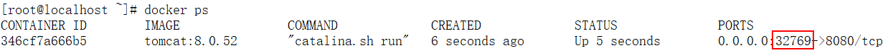


```sh
$ docker run -d -p 8084:8080 -p 8082:8080  tomcat:8.0.52     #可以设置多组小p，映射多对端口号
$ docker run -d -p 192.168.17.128:8083:8080 tomcat:8.0.52          #宿主机的端口号前还可以加上ip地址
$ docker run -d -p 192.168.17.128::8080 --name tomcat5 tomcat:8.0.52       #宿主机的端口号还可不写，表示宿主机端口号随机
$ docker run -d -p 192.168.17.128:8085:8080/udp tomcat:8.0.52          #默认是tcp协议，还可改为udp协议
```


```sh
#查看端口配置
$ docker port 346cf7a666b5
8080/tcp -> 0.0.0.0:32769

#创建出来的容器是有自己的内部网络和IP地址
$ docker [container] inspect 346cf7a666b5
```

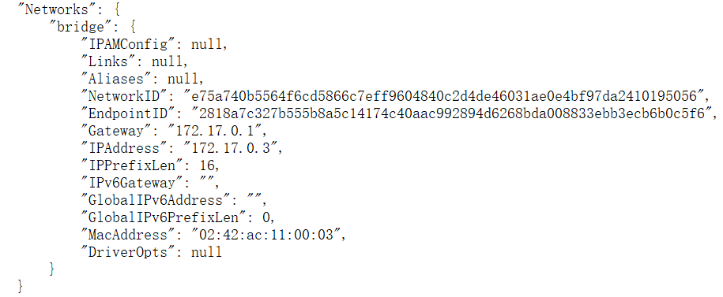

### 容器互联

- 在两个互联的容器之间直接创建连接关系，让多个容器中的应用进行快速交互，不需要通过宿主机

- 相当于在两个互联的容器之间创建了一个虚机通道，而且不用映射它们的端口到宿主主机上。

```sh
#先创建一个新的数据库容器db
$ docker run --name db  -e MYSQL_ROOT_PASSWORD=admin  -d mysql:5.7 

#然后创建一个新的web容器，并将它连接到db容器
$  docker run -d -p 80:8080 --name web --link db:db  tomcat:8.0.52
#此时，db容器和web容器建立互联关系

#使用--link参数可以让容器之间安全地进行交互，--link参数的格式为--link name:alias，其中name是要链接的容器的名称，alias是要链接的容器的别名
```

#### 查看链接信息

- 查看web容器环境变量
- 查看web容器/etc/hosts文件

```sh
#进入到web容器
$ docker  exec -it web /bin/bash
#使用env命令来查看web容器的环境变量
$ env
```

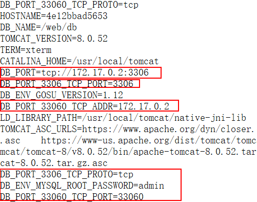

```sh
$ cat /etc/hosts
```

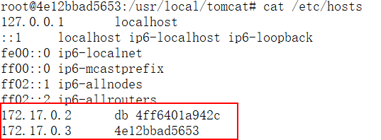

```sh
$ ping db
$ ping 172.17.0.2
```

**可以链接多个子容器到父容器，比如可以链接多个web到同一个db容器上**


