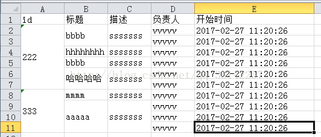
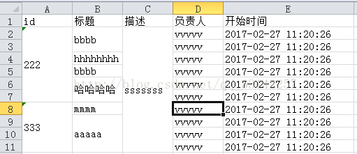
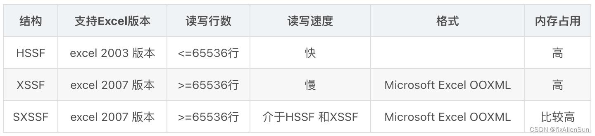
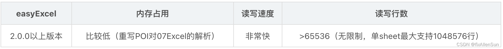

# Excel

## POI

### 行合并





```java
/*	本行和上一行不同，上一行以上合并
	本行和上一行相同	
		前一列不同，上一行以上合并
		
	本行是最后一行，本行和以上合并(经过以上处理，默认条件为本行和上一行相同，前一列相同)
*/
import cn.yoho.perf.common.model.PoiModel;
import com.beust.jcommander.internal.Maps;
import com.google.common.collect.Lists;
import org.apache.poi.ss.usermodel.Cell;
import org.apache.poi.ss.usermodel.Row;
import org.apache.poi.ss.usermodel.Sheet;
import org.apache.poi.ss.usermodel.Workbook;
import org.apache.poi.ss.util.CellRangeAddress;
import org.apache.poi.xssf.usermodel.XSSFWorkbook;
 
import java.io.File;
import java.io.FileOutputStream;
import java.io.IOException;
import java.util.*;
 
/**
 * Created by zelei.fan on 2017/3/14.
 */
public class Test{
 
    /**
     * @param title 标题集合 tilte的长度应该与list中的model的属性个数一致
     * @param maps 内容集合
     * @param mergeIndex 合并单元格的列
     */
    public static String createExcel(String[] title, Map<String/*sheet名*/, List<Map<String/*对应title的值*/, String>>> maps, int[] mergeIndex){
        if (title.length==0){
            return null;
        }
        /*初始化excel模板*/
        Workbook workbook = new XSSFWorkbook();
        Sheet sheet = null;
        int n = 0;
        /*循环sheet页*/
        for(Map.Entry<String, List<Map<String/*对应title的值*/, String>>> entry : maps.entrySet()){
            /*实例化sheet对象并且设置sheet名称，book对象*/
            try {
                sheet = workbook.createSheet();
                workbook.setSheetName(n, entry.getKey());
                workbook.setSelectedTab(0);
            }catch (Exception e){
                e.printStackTrace();
            }
            /*初始化head，填值标题行（第一行）*/
            Row row0 = sheet.createRow(0);
            for(int i = 0; i<title.length; i++){
                /*创建单元格，指定类型*/
                Cell cell_1 = row0.createCell(i, Cell.CELL_TYPE_STRING);
                cell_1.setCellValue(title[i]);
            }
            /*得到当前sheet下的数据集合*/
            List<Map<String/*对应title的值*/, String>> list = entry.getValue();
            /*遍历该数据集合*/
            List<PoiModel> poiModels = Lists.newArrayList();
            if(null!=workbook){
                Iterator iterator = list.iterator();
                int index = 1;/*这里1是从excel的第二行开始，第一行已经塞入标题了*/
                while (iterator.hasNext()){
                    Row row = sheet.createRow(index);
                    /*取得当前这行的map，该map中以key，value的形式存着这一行值*/
                    Map<String, String> map = (Map<String, String>)iterator.next();
                    /*循环列数，给当前行塞值*/
                    for(int i = 0; i<title.length; i++){
                        String old = "";
                        /*old存的是上一行统一位置的单元的值，第一行是最上一行了，所以从第二行开始记*/
                        if(index > 1){
                            old = poiModels.get(i)==null?"":poiModels.get(i).getContent();
                        }
                        /*循环需要合并的列*/
                        for(int j = 0; j < mergeIndex.length; j++){
                            if(index == 1){
                                /*记录第一行的开始行和开始列*/
                                PoiModel poiModel = new PoiModel();
                                poiModel.setOldContent(map.get(title[i]));
                                poiModel.setContent(map.get(title[i]));
                                poiModel.setRowIndex(1);
                                poiModel.setCellIndex(i);
                                poiModels.add(poiModel);
                                break;
                            }else if(i > 0 && mergeIndex[j] == i){/*这边i>0也是因为第一列已经是最前一列了，只能从第二列开始*/
                                /*当前同一列的内容与上一行同一列不同时，把那以上的合并, 或者在当前元素一样的情况下，前一列的元素并不一样，这种情况也合并*/
                                /*如果不需要考虑当前行与上一行内容相同，但是它们的前一列内容不一样则不合并的情况，把下面条件中||poiModels.get(i).getContent().equals(map.get(title[i])) && !poiModels.get(i - 1).getOldContent().equals(map.get(title[i-1]))去掉就行*/
                                if(!poiModels.get(i).getContent().equals(map.get(title[i])) || poiModels.get(i).getContent().equals(map.get(title[i])) && !poiModels.get(i - 1).getOldContent().equals(map.get(title[i-1]))){
                                    if(index > poiModels.get(i).getRowIndex()+1){
                                        /*当前行的当前列与上一行的当前列的内容不一致时，则把当前行以上的合并*/
                                        CellRangeAddress cra=new CellRangeAddress(poiModels.get(i).getRowIndex()/*从第二行开始*/, index - 1/*到第几行*/, poiModels.get(i).getCellIndex()/*从某一列开始*/, poiModels.get(i).getCellIndex()/*到第几列*/);
                                        //在sheet里增加合并单元格
                                        sheet.addMergedRegion(cra);
                                        /*重新记录该列的内容为当前内容，行标记改为当前行标记，列标记则为当前列*/
                                        poiModels.get(i).setContent(map.get(title[i]));
                                        poiModels.get(i).setRowIndex(index);
                                        poiModels.get(i).setCellIndex(i);
                                    }
                                }
                            }
                            /*处理第一列的情况*/
                            if(mergeIndex[j] == i && i == 0 && !poiModels.get(i).getContent().equals(map.get(title[i]))){
                                if(index > poiModels.get(i).getRowIndex()+1){
                                    /*当前行的当前列与上一行的当前列的内容不一致时，则把当前行以上的合并*/
                                    CellRangeAddress cra=new CellRangeAddress(poiModels.get(i).getRowIndex()/*从第二行开始*/, index - 1/*到第几行*/, poiModels.get(i).getCellIndex()/*从某一列开始*/, poiModels.get(i).getCellIndex()/*到第几列*/);
                                    //在sheet里增加合并单元格
                                    sheet.addMergedRegion(cra);
                                    /*重新记录该列的内容为当前内容，行标记改为当前行标记*/
                                    poiModels.get(i).setContent(map.get(title[i]));
                                    poiModels.get(i).setRowIndex(index);
                                    poiModels.get(i).setCellIndex(i);
                                }
                            }
 
                            /*最后一行没有后续的行与之比较，所有当到最后一行时则直接合并对应列的相同内容*/
                            if(mergeIndex[j] == i && index == list.size()){
                                if(index > poiModels.get(i).getRowIndex()+1){
                                    CellRangeAddress cra=new CellRangeAddress(poiModels.get(i).getRowIndex()/*从第二行开始*/, index/*到第几行*/, poiModels.get(i).getCellIndex()/*从某一列开始*/, poiModels.get(i).getCellIndex()/*到第几列*/);
                                    //在sheet里增加合并单元格
                                    sheet.addMergedRegion(cra);
                                }
                                
                            }
                        }
                        Cell cell = row.createCell(i, Cell.CELL_TYPE_STRING);
                        cell.setCellValue(map.get(title[i]));
                        /*在每一个单元格处理完成后，把这个单元格内容设置为old内容*/
                        poiModels.get(i).setOldContent(old);
                    }
                    index++;
                }
            }
            n++;
        }
        /*生成临时文件*/
        FileOutputStream out = null;
        String localPath = null;
        File tempFile = null;
        String fileName = String.valueOf(new Date().getTime()/1000);
        try {
            tempFile = File.createTempFile(fileName, ".xlsx");
            localPath = tempFile.getAbsolutePath();
            out = new FileOutputStream(localPath);
            workbook.write(out);
        }catch (IOException e){
            e.printStackTrace();
        }finally {
            try {
                out.flush();
                out.close();
            }catch (IOException e){
                e.printStackTrace();
            }
        }
        return localPath;
    }
 
    public static void main(String[] args) throws IOException{
        /*此处标题的数组则对应excel的标题*/
        String[] title = {"id","标题","描述","负责人","开始时间"};
        List<Map<String, String>> list = Lists.newArrayList();
        /*这边是制造一些数据，注意每个list中map的key要和标题数组中的元素一致*/
        for(int i = 0; i<10; i++){
            HashMap<String, String> map = com.google.common.collect.Maps.newHashMap();
            if(i > 5){
                if(i<7){
                    map.put("id","333");
                    map.put("标题","mmmm");
                }else {
                    map.put("id","333");
                    map.put("标题","aaaaa");
                }
            }else if (i >3){
                map.put("id","222");
                map.put("标题","哈哈哈哈");
            }else if (i>1 && i<3){
                map.put("id","222");
                map.put("标题","hhhhhhhh");
            }else {
                map.put("id","222");
                map.put("标题","bbbb");
            }
            map.put("描述","sssssss");
            map.put("负责人","vvvvv");
            map.put("开始时间","2017-02-27 11:20:26");
            list.add(map);
        }
        Map<String/*此处的key为每个sheet的名称，一个excel中可能有多个sheet页*/, List<Map<String/*此处key对应每一列的标题*/, String>>/*该list为每个sheet页的数据*/> map = Maps.newHashMap();
        map.put("测试合并数据", list);
        System.out.println(createExcel(title, map, new int[]{0,1,2}/*此处数组为需要合并的列，可能有的需求是只需要某些列里面相同内容合并*/));
    }
 
}
```

```java
@Data
public class PoiModel {
    private String content;
    private String oldContent;
    private int rowIndex;
    private int cellIndex;
}
```

参考：[java--poi生成excel动态合并内容相同的行](https://blog.csdn.net/qq_33142257/article/details/64929145)

### 设置列宽自适应

```java
public void autoSizeColumn(int column, boolean useMergedCells);
```

第一个列标参数外，还有第二个useMergedCells的布尔值参数。它的意思是，在进行列宽自适应时，要不要考虑计算已经进行合并的单元格里面的数据，不设置的话默认是false。


## EasyExcel

来源：

[【EasyExcel&Hutool】excel表格的导入和导出，csv文件的导入导出](https://blog.csdn.net/weixin_44823875/article/details/133161604)

[EasyExcel初相识：万字吃透EasyExcel核心API，从此报表处理不再喊难！](https://juejin.cn/post/7405158045662576640#heading-11)

### 原理

**POI：**



**阿里EasyExcel：**



- excel的2003版本（xls后缀）和2007版本（xlsx后缀）存在兼容性的问题！03最多只能有65536行！而07最多只能有1048576行！

- 大文件写HSSF：最多只能处理65536行，否则会抛出异常。过程中写入缓存，不操作磁盘，最后一次性写入磁盘，速度块。

- 大文件写XSSF：写数据时速度非常慢，非常消耗内存，也会发生内存溢出，如100万条。可以写较大的数据量，如20万条。

- 大文件写SXSSF：可以写非常大的数据量，如100万条甚至更多条，写数据速度快，占用更少内存。过程中会产生临时文件，需要清理临时文件，默认由100条记录会被保存在内存中，如果超过这个数量，则最前面的数据被写入临时文件。如果想自定义内存中数据的数量，可以使用new SXSSFWorkbook(数量)。

- easyExcel如何解决内存溢出的问题？

  EasyExcel 能大大减少占用内存的主要原因是在解析 Excel 时没有将文件数据一次性全部加载到内存中，而是从磁盘上一行行读取数据，逐个解析。

  EasyExcel 使用POI的sax模式一行一行解析，并将一行的解析结果以观察者的模式通知处理。
  

### 使用

```java
@NoArgsConstructor
@AllArgsConstructor
@Data
@Builder
public class UserModel {
    @ExcelProperty(value = "用户编号", index = 0)
    private Integer userId;
    @ExcelProperty(value = "姓名", index = 1)
    private String userName;
   // 性别添加了转换器, db中存入的是integer类型的枚举 0 , 1 ,2
    @ExcelProperty(value = "性别", index = 3, converter = GenderConverter.class)
    private Integer gender;
    @ExcelProperty(value = "工资", index = 4)
    @NumberFormat(value = "###.#")
    private Double salary;
    @ExcelProperty(value = "入职时间", index = 2)
    @DateTimeFormat(value = "yyyy年MM月dd日 HH时mm分ss秒")
    private Date hireDate;
    // lombok 会生成getter/setter方法
}
```

```java
/**
 * 类描述：性别字段的数据转换器
 * @Author wang_qz
 * @Date 2021/8/15 19:16
 * @Version 1.0
 */
public class GenderConverter implements Converter<Integer> {

    private static final String MALE = "男";
    private static final String FEMALE = "女";
    private static final String NONE = "未知";

    // Java数据类型 integer
    @Override
    public Class supportJavaTypeKey() {
        return Integer.class;
    }

    // Excel文件中单元格的数据类型  string
    @Override
    public CellDataTypeEnum supportExcelTypeKey() {
        return CellDataTypeEnum.STRING;
    }

    // 读取Excel文件时将string转换为integer
    @Override
    public Integer convertToJavaData(CellData cellData, ExcelContentProperty contentProperty, GlobalConfiguration globalConfiguration) 
       throws Exception {
        String value = cellData.getStringValue();
        if (Objects.equals(FEMALE, value)) {
            return 0; // 0-女
        } else if (Objects.equals(MALE, value)) {
            return 1; // 1-男
        }
        return 2; // 2-未知
    }

    // 写入Excel文件时将integer转换为string
    @Override
    public CellData convertToExcelData(Integer value, ExcelContentProperty contentProperty, GlobalConfiguration globalConfiguration) throws Exception {
        if (value == 1) {
            return new CellData(MALE);
        } else if (value == 0) {
            return new CellData(FEMALE);
        }
        return new CellData(NONE); // 不男不女
    }
}
```

#### 导出

```java
@Test
public void testWriteExcel() {
    String filename = "D:\\study\\excel\\user1.xlsx";
    // 向Excel中写入数据 也可以通过 head(Class<?>) 指定数据模板
    EasyExcel.write(filename, User.class)
            .sheet("用户信息")
            .doWrite(getUserData());
}

// 写到同一个Excel的不同Sheet中
@Test
public void testWriteExcel() {
    String filename = "D:\\study\\excel\\user8.xlsx";
    // 创建ExcelWriter对象
    ExcelWriter excelWriter = EasyExcel.write(filename, User.class).build();
    // 向Excel的不同Sheet重复写入数据
    for (int i = 0; i < 2; i++) {
        // 创建Sheet对象
        WriteSheet writeSheet = EasyExcel.writerSheet("用户信息" + i).build();
        excelWriter.write(getUserData(), writeSheet);
    }
    // 关闭流
    excelWriter.finish();
}

// 根据user模板构建数据
private List<User> getUserData() {
    List<User> users = new ArrayList<>();
    for (int i = 1; i <= 10; i++) {
        User user = User.builder()
                .userId(i)
                .userName("admin" + i)
                .gender(i % 2 == 0 ? "男" : "女")
                .salary(i * 1000.00)
                .hireDate(new Date())
                .build();
        users.add(user);
    }
    return users;
}
```

```java
/**
 * 使用EasyExcel操作excel文件上传/下载
 */
@Controller
@RequestMapping(value = "/xlsx")
public class EasyExcelController {
    @RequestMapping(value = "/downloadExcel")
    public void downloadExcel(HttpServletRequest request, 
                              HttpServletResponse response) throws Exception {
        // 设置响应头
        response.setContentType("application/vnd.ms-excel");
        response.setCharacterEncoding("utf-8");
        // 设置防止中文名乱码
        String filename = URLEncoder.encode("员工信息", "utf-8");
        // 文件下载方式(附件下载还是在当前浏览器打开)
        response.setHeader("Content-disposition", "attachment;filename=" + 
                           filename + ".xlsx");
        // 构建写入到excel文件的数据
        List<UserExcel> userExcels = new ArrayList<>();
        ...
        // 写入数据到excel
        EasyExcel.write(response.getOutputStream(), UserExcel.class)
                .sheet("用户信息")
                .doWrite(userExcels);
    }
}
```


#### 读取

```java
@Test
public void testReadExcel() {
    // 读取的excel文件路径
    String filename = "D:\\study\\excel\\read.xlsx";
    // 读取excel
    EasyExcel.read(filename, DemoData.class, new AnalysisEventListener<DemoData>() {
        // 每解析一行数据,该方法会被调用一次
        @Override
        public void invoke(DemoData demoData, AnalysisContext analysisContext) {
            System.out.println("解析数据为:" + demoData.toString());
        }
        // 全部解析完成被调用
        @Override
        public void doAfterAllAnalysed(AnalysisContext analysisContext) {
            System.out.println("解析完成...");
            // 可以将解析的数据保存到数据库
        }
    }).sheet("sheetName").doRead();
}

@Test
public void testReadExcel2() {
    // 读取的excel文件路径
    String filename = "D:\\study\\excel\\read.xlsx";
    // 创建一个数据格式来装读取到的数据
    Class<DemoData> head = DemoData.class;
    // 创建ExcelReader对象
    ExcelReader excelReader = EasyExcel.read(filename, head, new AnalysisEventListener<DemoData>() {
        // 每解析一行数据,该方法会被调用一次
        @Override
        public void invoke(DemoData demoData, AnalysisContext analysisContext) {
            System.out.println("解析数据为:" + demoData.toString());
        }
        // 全部解析完成被调用
        @Override
        public void doAfterAllAnalysed(AnalysisContext analysisContext) {
            System.out.println("解析完成...");
            // 可以将解析的数据保存到数据库
        }
    }).build();
    // 创建sheet对象,并读取Excel的第一个sheet(下标从0开始), 也可以根据sheet名称获取
    ReadSheet sheet = EasyExcel.readSheet(0).build();
    // 读取sheet表格数据, 参数是可变参数,可以读取多个sheet
    excelReader.read(sheet);
    // 需要自己关闭流操作,在读取文件时会创建临时文件,如果不关闭,会损耗磁盘,严重的磁盘爆掉
    excelReader.finish();
}
```

```java
public class UserListener extends AnalysisEventListener<User> {
    private IUserService userService;
    private List<User> userList = new ArrayList<>();

    public UserListener() {
    }

    public UserListener(IUserService userService) {
        this.userService = userService;
    }
    
     /**
     * 批处理阈值2000
     */
    private static final int BATCH_COUNT = 2000;

    //  一行行读取excel内容，然后用MybatisPlus的方法进行导入
    @Override
    public void invoke(User user, AnalysisContext analysisContext) {
    	userList.add(user);
        if (userList.size() >= BATCH_COUNT) {
            userService.insertBatch(userList);
            userList.clear();
        }
    }

    //  读取表头内容，导出可用到
    @Override
    public void invokeHeadMap(Map<Integer, String> headMap, AnalysisContext context) {
        System.out.println("表头：" + headMap);
    }

    //  读取完成之后进行的操作
    @Override
    public void doAfterAllAnalysed(AnalysisContext analysisContext) {
       userService.insertBatch(userList);
    }
}
```


```java
/**
 * 类描述：easyexcel工具类
 */
public class EasyExcelUtils<T> {

    /**
     * 获取读取Excel的监听器对象
     * 为了解耦及减少每个数据模型bean都要创建一个监听器的臃肿, 使用泛型指定数据模型类型
     * 使用jdk8新特性中的函数式接口 Consumer
     * 可以实现任何数据模型bean的数据解析, 不用重复定义监听器
     * @param consumer 处理解析数据的函数, 一般可以是数据入库逻辑的函数
     * @param threshold 阈值,达到阈值就处理一次存储的数据
     * @param <T> 数据模型泛型
     * @return 返回监听器
     */
    public static <T> AnalysisEventListener<T> getReadListener(Consumer<List<T>> consumer, int threshold) {
        return new AnalysisEventListener<T>() {
            /**
             * 存储解析的数据 T t
             */
            List<T> dataList = new LinkedList<>(); 

            /**
             * 每解析一行数据事件调度中心都会通知到这个方法, 订阅者1
             * @param data 解析的每行数据
             * @param context
             */
            @Override
            public void invoke(T data, AnalysisContext context) {
                dataList.add(data);
                // 达到阈值就处理一次存储的数据
                if (dataList.size() >= threshold) {
                    consumer.accept(dataList);
                    dataList.clear();
                }
            }

            /**
             * excel文件解析完成后,事件调度中心会通知到该方法, 订阅者2
             * @param context
             */
            @Override
            public void doAfterAllAnalysed(AnalysisContext context) {
                // 最后阈值外的数据做处理
                if (dataList.size() > 0) {
                    consumer.accept(dataList);
                }
            }
        };

    }

    /**
     * 获取读取Excel的监听器对象, 不指定阈值, 默认阈值为 2000
     * @param consumer
     * @param <T>
     * @return
     */
    public static <T> AnalysisEventListener<T> getReadListener(Consumer<List<T>> 
                                                               consumer) {
        return getReadListener(consumer, 2000);
    }
}


// --------------- 读取Excel的代码 ---------------
/**
 * 采用解耦的自定义监听器读取Excel, 可以实现任何数据模型bean的读取
 */
@Test
public void testReadExcelN() {
    // 读取的excel文件路径
    String filename = "D:\\study\\excel\\user1.xlsx";
    // 读取excel
    EasyExcel.read(filename, UserModel.class, 	
                   EasyExcelUtils.getReadListener(dataProcess()))
            .doReadAll(); // 读取全部sheet
}

/**
 *  传给监听器的是一个处理解析数据的函数, 当调用consumer的accept方法时就会调用传递的函数逻辑
 *  这里传递的函数是对解析结果集的遍历打印操作, 也可以是数据入库操作
 * @return
 */
public Consumer<List<UserModel>> dataProcess() {
    Consumer<List<UserModel>> consumer = users -> users.forEach(System.out::println);
    return consumer;
}
```


#### 导入导出CSV文件

CSV文件通常是指逗号分隔值（Comma-Separated Values）文件，是一种常见的电子表格文件格式。其基本格式是一行代表一条记录，每个字段之间用逗号进行分隔，通常使用纯文本文件存储。CSV文件的格式简单且易于阅读，且不需要使用特殊的软件即可打开，可以用txt软件打开也可以使用Excel软件打开，因此在实际应用中非常方便。

```java
/**
 * @DESCRIPTION: 读取csv格式的文件数据
 */
@RestController
@RequestMapping("/api/csv")
public class CsvController {
    /**
     * 读取传入的csv  文本的内容可以存入数据库
     */
    @PostMapping("/upload")
    public ResponseEntity<?> uploadCsv(@RequestParam("file") MultipartFile file) {
        if (file.isEmpty()) {
            return ResponseEntity.badRequest().body("文件不能为空");
        }
        //判断csv文件类型是不是csv文件
        String contentType = file.getContentType();
        String originalFilename = file.getOriginalFilename();
        boolean isCsv = ("text/csv".equals(contentType))
                || (originalFilename != null && originalFilename.endsWith(".csv"));
        if (!isCsv) {
            return ResponseEntity.badRequest().body("文件必须是CSV格式");
        }
        //判断csv文件格式内容是否有误
        boolean csvFormatValid = checkCscUtils.isCsvFormatValid(file);
        if (csvFormatValid) {
            List<User> userList = new CopyOnWriteArrayList<>();
            try {
                EasyExcel.read(file.getInputStream(), User.class,
                                new PageReadListener<User>(userList::addAll))
                        .excelType(ExcelTypeEnum.CSV)
                        .sheet()
                        .doRead();
            } catch (IOException e) {
                e.printStackTrace();
                return ResponseEntity.status(500).body("文件读取出错");
            }
            // 处理userList
            ...
            return ResponseEntity.ok(userList);
        }
        return ResponseEntity.status(500).body("文件格式出错");
    }
 
    /**
     * 使用 easyExcel  导出一个csv 格式，但是版本可能与poi 版本冲突
     */
    @GetMapping("/exportCsv")
    public ResponseEntity<?> exportCsv(HttpServletResponse response) throws IOException {
        // 设置响应头
        response.setContentType("text/csv;charset=utf-8");
        response.setCharacterEncoding("utf-8");
        String fileName = URLEncoder.encode("export_" + LocalDateTime.now().format(DateTimeFormatter.ofPattern("yyyyMMddHHmmss")) + ".csv");
        // 设置文件头：最后一个参数是设置下载文件名
    	response.setHeader("Content-Disposition","attachment;fileName=" + new String(fileName.getBytes(StandardCharsets.UTF_8),StandardCharsets.ISO_8859_1));
        List<Student> userList = getStudents();
        // 使用EasyExcel导出CSV文件response.getOutputStream()
        try {
            EasyExcel.write(response.getOutputStream(), Student.class)
                    .excelType(ExcelTypeEnum.CSV)
                    .sheet("我的学生")
                    .doWrite(userList);
        } catch (IOException e) {
            throw new RuntimeException(e);
        }
        return ResponseEntity.status(200).body("文件导出成功");
    }
    
    private static List<Student> getStudents() {
        // 创建数据列表
        List<Student> userList = new CopyOnWriteArrayList<>();
        // 添加数据（示例）
        userList.add(new Student("1", "John Doe", "25"));
        userList.add(new Student("2", "Jane Smith", "30"));
        userList.add(new Student("3", "Mike Johnson", "35"));
        return userList;
    }
}
```

也可以使用hutool工具导入导出csv格式文档。


### 案例

##### 导出多个Excel文件打包成ZIP文件

**来源：**

[SpringBoot中大量数据导出方案：使用EasyExcel并行导出多个excel文件并压缩zip后下载](https://blog.csdn.net/xiyang_1990/article/details/143207833)

```java
/*

通过CompletableFuture和ThreadPoolTaskExecutor，将销售订单的导出任务分配给多个线程并行执行，显著提高了处理大量订单时的性能。

使用Lists.partition方法将订单列表分割成多个子列表，每个子列表由一个线程处理，这里每5个订单一个线程。
*/

@Slf4j
@Service
public class SalesOrderExportService {

    @Autowired
    @Qualifier("threadPoolTask")
    private ThreadPoolTaskExecutor threadPoolTaskExecutor;

    @Resource
    private OrderManager OrderManager;


    public void salesOrderExport(RequestDto req, HttpServletResponse response) {

        // 获取导出数据,每个SalesOrder实例需要分别导出到一个excel文件
        List<SalesOrder> orderDataList = OrderManager.getOrder(req.getUserCode());
        // 略...校验数据

        InputStream zipFileInputStream = null;
        Path tempZipFilePath = null;
        Path tempDir = null;
        // 获取导出模板
        try (InputStream templateInputStream = this.getClass().getClassLoader().getResourceAsStream("template/order_template.xlsx");
             ByteArrayOutputStream outputStream = new ByteArrayOutputStream();) {

            if (Objects.isNull(templateInputStream)) {
                throw new RuntimeException("获取模版文件异常");
            }
            // 多线程服用一个文件流
            IOUtils.copy(templateInputStream, outputStream);

            // 创建临时excel文件导出目录,用于将多个excel导出到此目录下
            Path tmpDirRef = (tempDir = Files.createTempDirectory(req.userCode() + "dir_prefix"));

            // 每5个salesOrder一个线程并行导出到excel文件中
            CompletableFuture[] salesOrderCf = Lists.partition(orderDataList, 5).stream()
                    .map(orderDataSubList -> CompletableFuture
                            .supplyAsync(() -> orderDataSubList.stream()
                                    .map(orderData -> this.exportExcelToFile(tmpDirRef, outputStream, orderData))
                                    .collect(Collectors.toList()), threadPoolTaskExecutor)
                            .exceptionally(e -> {
                                throw new RuntimeException(e);
                            }))
                    .toArray(CompletableFuture[]::new);

            // 等待所有excel文件导出完成
            CompletableFuture.allOf(salesOrderCf).get(3, TimeUnit.MINUTES);

            // 创建临时zip文件
            tempZipFilePath = Files.createTempFile(req.userCode() + TMP_ZIP_DIR_PRE, ".zip");

            // 将excel目录下的所有文件压缩到zip文件中,zipUtil有很多工具包都有
            ZipUtil.zip(tempDir.toString(), tempZipFilePath.toString());

            response.setContentType("application/octet-stream;charset=UTF-8");
            response.setHeader("Content-Disposition", "attachment;filename=" + URLEncoder.encode(tempZipFilePath.toFile().getName(), "utf-8"));

            // 写zip文件流到response
            zipFileInputStream = Files.newInputStream(tempZipFilePath);
            IOUtils.copy(zipFileInputStream, response.getOutputStream());
        } catch (Exception e) {
            log.error("salesOrderExport,异常:", e);
            throw new RuntimeException("导出异常,请稍后重拾");
        } finally {
            try {
                // 关闭流
                if (Objects.nonNull(zipFileInputStream)) {
                    zipFileInputStream.close();
                }
                // 删除临时文件及目录
                if (Objects.nonNull(tempDir)) {
                    Files.walkFileTree(tempDir, new SimpleFileVisitor<Path>() {
                        @Override
                        public FileVisitResult visitFile(Path file, BasicFileAttributes attrs) throws IOException {
                            Files.deleteIfExists(file);
                            return FileVisitResult.CONTINUE;
                        }

                        @Override
                        public FileVisitResult postVisitDirectory(Path dir, IOException exc) throws IOException {
                            Files.deleteIfExists(dir);
                            return FileVisitResult.CONTINUE;
                        }
                    });
                }
                if (Objects.nonNull(tempZipFilePath)) {
                    Files.deleteIfExists(tempZipFilePath);
                }
            } catch (Exception e) {
                log.error("salesOrderExport, 关闭文件流失败:", e);
            }
        }
    }
}
```

##### 导出一个Excel文件多个sheet页

[SpringBoot+EasyExcel轻松实现300万数据快速导出！](https://zhuanlan.zhihu.com/p/5615456543)

```java
// 导出逻辑代码
public void dataExport300w(HttpServletResponse response) {
    {
        OutputStream outputStream = null;
        try {
            long startTime = System.currentTimeMillis();
            System.out.println("导出开始时间:" + startTime);

            outputStream = response.getOutputStream();
            ExcelWriter writer = new ExcelWriter(outputStream, ExcelTypeEnum.XLSX);
            String fileName = new String(("excel100w").getBytes(), "UTF-8");

            //title
            Table table = new Table(1);
            List<List<String>> titles = new ArrayList<List<String>>();
            titles.add(Arrays.asList("onlineseqid"));
            titles.add(Arrays.asList("businessid"));
            titles.add(Arrays.asList("becifno"));
            titles.add(Arrays.asList("ivisresult"));
            titles.add(Arrays.asList("createdby"));
            titles.add(Arrays.asList("createddate"));
            titles.add(Arrays.asList("updateby"));
            titles.add(Arrays.asList("updateddate"));
            titles.add(Arrays.asList("risklevel"));
            table.setHead(titles);

            //模拟统计查询的数据数量这里模拟100w
            int count = 3000001;
            //记录总数:实际中需要根据查询条件进行统计即可
            Integer totalCount = actResultLogMapper.findActResultLogByCondations(count);
            //每一个Sheet存放100w条数据
            Integer sheetDataRows = ExcelConstants.PER_SHEET_ROW_COUNT;
            //每次写入的数据量20w
            Integer writeDataRows = ExcelConstants.PER_WRITE_ROW_COUNT;
            //计算需要的Sheet数量
            Integer sheetNum = totalCount % sheetDataRows == 0 ? (totalCount / sheetDataRows) : (totalCount / sheetDataRows + 1);
            //计算一般情况下每一个Sheet需要写入的次数(一般情况不包含最后一个sheet,因为最后一个sheet不确定会写入多少条数据)
            Integer oneSheetWriteCount = sheetDataRows / writeDataRows;
            //计算最后一个sheet需要写入的次数
            Integer lastSheetWriteCount = totalCount % sheetDataRows == 0 ? oneSheetWriteCount : (totalCount % sheetDataRows % writeDataRows == 0 ? (totalCount / sheetDataRows / writeDataRows) : (totalCount / sheetDataRows / writeDataRows + 1));

            //开始分批查询分次写入
            //注意这次的循环就需要进行嵌套循环了,外层循环是Sheet数目,内层循环是写入次数
            List<List<String>> dataList = new ArrayList<>();
            for (int i = 0; i < sheetNum; i++) {
                //创建Sheet
                Sheet sheet = new Sheet(i, 0);
                sheet.setSheetName("测试Sheet1" + i);
                //循环写入次数: j的自增条件是当不是最后一个Sheet的时候写入次数为正常的每个Sheet写入的次数,如果是最后一个就需要使用计算的次数lastSheetWriteCount
                for (int j = 0; j < (i != sheetNum - 1 ? oneSheetWriteCount : lastSheetWriteCount); j++) {
                    //集合复用,便于GC清理
                    dataList.clear();
                    //分页查询一次20w
                    PageHelper.startPage(j + 1 + oneSheetWriteCount * i, writeDataRows);
                    List<ActResultLog> reslultList = actResultLogMapper.findByPage100w();
                    if (!CollectionUtils.isEmpty(reslultList)) {
                        reslultList.forEach(item -> {
                            dataList.add(Arrays.asList(item.getOnlineseqid(), item.getBusinessid(), item.getBecifno(), item.getIvisresult(), item.getCreatedby(), Calendar.getInstance().getTime().toString(), item.getUpdateby(), Calendar.getInstance().getTime().toString(), item.getRisklevel()));
                        });
                    }
                    //写数据
                    writer.write0(dataList, sheet, table);
                }
            }

            // 下载EXCEL
            response.setHeader("Content-Disposition", "attachment;filename=" + new String((fileName).getBytes("gb2312"), "ISO-8859-1") + ".xlsx");
            response.setContentType("multipart/form-data");
            response.setCharacterEncoding("utf-8");
            writer.finish();
            outputStream.flush();
            //导出时间结束
            long endTime = System.currentTimeMillis();
            System.out.println("导出结束时间:" + endTime + "ms");
            System.out.println("导出所用时间:" + (endTime - startTime) / 1000 + "秒");
        } catch (FileNotFoundException e) {
            e.printStackTrace();
        } catch (IOException e) {
            e.printStackTrace();
        } finally {
            if (outputStream != null) {
                try {
                    outputStream.close();
                } catch (Exception e) {
                    e.printStackTrace();
                }
            }
        }
    }
}
```

##### 导入Excel文件

```java
// EasyExcel的读取Excel数据的API
@Test
public void import2DBFromExcel10wTest() {
    String fileName = "D:\\StudyWorkspace\\JavaWorkspace\\java_project_workspace\\idea_projects\\SpringBootProjects\\easyexcel\\exportFile\\excel300w.xlsx";
    //记录开始读取Excel时间,也是导入程序开始时间
    long startReadTime = System.currentTimeMillis();
    System.out.println("------开始读取Excel的Sheet时间(包括导入数据过程):" + startReadTime + "ms------");
    //读取所有Sheet的数据.每次读完一个Sheet就会调用这个方法
    EasyExcel.read(fileName, new EasyExceGeneralDatalListener(actResultLogService2)).doReadAll();
    long endReadTime = System.currentTimeMillis();
    System.out.println("------结束读取Excel的Sheet时间(包括导入数据过程):" + endReadTime + "ms------");
}
// 事件监听
public class EasyExceGeneralDatalListener extends AnalysisEventListener<Map<Integer, String>> {
    /**
     * 处理业务逻辑的Service,也可以是Mapper
     */
    private ActResultLogService2 actResultLogService2;

    /**
     * 用于存储读取的数据
     */
    private List<Map<Integer, String>> dataList = new ArrayList<Map<Integer, String>>();

    public EasyExceGeneralDatalListener() {
    }
    
    public EasyExceGeneralDatalListener(ActResultLogService2 actResultLogService2) {
        this.actResultLogService2 = actResultLogService2;
    }
    
    @Override
    public void invoke(Map<Integer, String> data, AnalysisContext context) {
        //数据add进入集合
        dataList.add(data);
        //size是否为100000条:这里其实就是分批.当数据等于10w的时候执行一次插入
        if (dataList.size() >= ExcelConstants.GENERAL_ONCE_SAVE_TO_DB_ROWS) {
            //存入数据库:数据小于1w条使用Mybatis的批量插入即可;
            saveData();
            //清理集合便于GC回收
            dataList.clear();
        }
    }

    /**
     * 保存数据到DB
     *
     * @param
     * @MethodName: saveData
     * @return: void
     */
    private void saveData() {
        actResultLogService2.import2DBFromExcel10w(dataList);
        dataList.clear();
    }
    
    /**
     * Excel中所有数据解析完毕会调用此方法
     *
     * @param: context
     * @MethodName: doAfterAllAnalysed
     * @return: void
     */
    @Override
    public void doAfterAllAnalysed(AnalysisContext context) {
        saveData();
        dataList.clear();
    }
}
```

