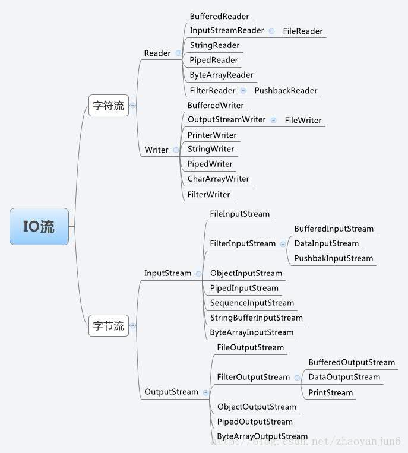

# IO

### 流分类




DataInputStream 类，支持按照基本数据类型（int、boolean、long 等）来读取数据。


```java
public class BufferedInputStream extends InputStream {
    protected volatile InputStream in;
    protected BufferedInputStream(InputStream in) {
        this.in = in;
    }
    // f()函数不需要增强，只是重新调用一下InputStream in对象的f()
    public void f() {
        in.f();
    }
}
```

BufferedInputStream、DataInputStream继承自 FilterInputStream，BufferedInputStream类本质是功能增强，需要将最终读取数据的任务，委托给传递进来的 InputStream 对象来完成。

如上所示，InputStream 是一个抽象类而非接口，而且它的大部分函数（比如 read()、available()）都有默认实现，但是为了实现委托，每次对不需要增加缓存功能的函数也要重新调用。

为了避免代码重复，Java IO 抽象出了一个装饰器父类 FilterInputStream，InputStream 的所有的装饰器类（BufferedInputStream、DataInputStream）都继承自这个装饰器父类。这样，装饰器类只需要实现它需要增强的方法就可以了，其他方法继承装饰器父类的默认实现。


