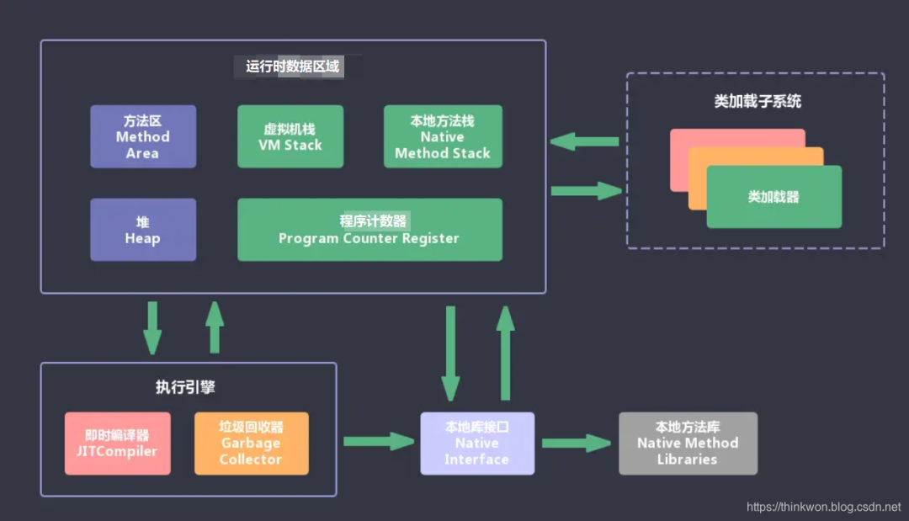
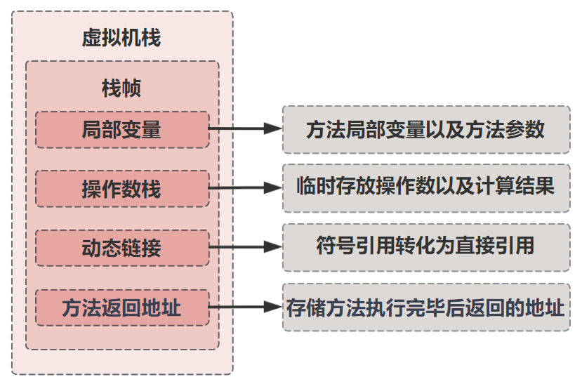
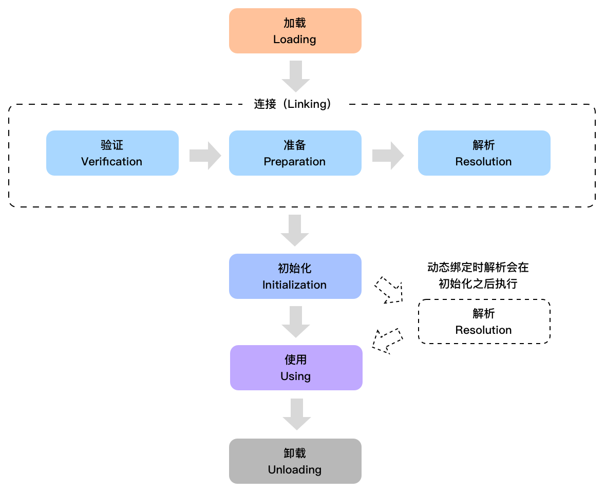
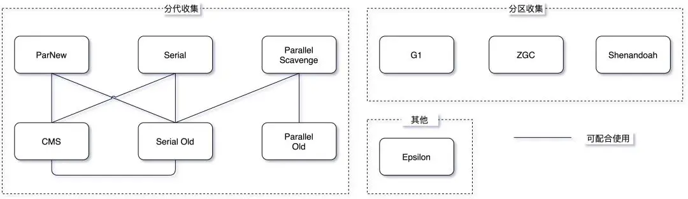

# JVM

## 结构组成



JVM包含两个子系统和两个组件，两个子系统为**Class loader(类装载)、Execution engine(执行引擎)**；两个组件为**Runtime data area(运行时数据区)**、Native Interface(本地接口)。

- Class loader(类装载)：根据给定的全限定名类名(如：java.lang.Object)来装载class文件到运行时数据区中的方法区。
- Execution engine（执行引擎）：执行字节码中的指令。
- Native Interface(本地接口)：与native libraries交互，是与其它编程语言交互的接口。
- Runtime data area(运行时数据区域)：这就是我们常说的JVM的内存。

**作用** ：

1. 通常情况下，我们只需要安装不同版本的 JDK（Java Development Kit，Java 开发工具包）就行了，它里面包含了 JRE（Java Runtime Environment，Java 运行时环境），而 JRE 又包含了 JVM。

2. 首先通过编译器把 Java 代码转换成字节码

3. 类加载器（ClassLoader）再把字节码加载到内存中，将其放在运行时数据区（Runtime data area）内，而字节码文件只是 JVM 的一套指令集规范，并不能直接交给底层操作系统去执行

4. 需要特定的解释器执行引擎（Execution Engine），将字节码翻译成机器码，再交由 CPU 去执行。常见的执行方式有两种，一种是解释执行，对字节码逐条解释执行；一种是 JIT，也就是即时编译，它会在运行时将热点代码优化（如内联、循环展开、分支预测优化等）并缓存起来，下次再执行的时候直接使用缓存起来的机器码，而不需要再次解释执行。这样就可以提高程序的执行效率。

   **热点代码：**JVM 中有一个阈值，当方法或者代码块的在一定时间内的调用次数超过这个阈值时就会被认定为热点代码，然后编译存入 codeCache 中。当下次执行时，再遇到这段代码，就会从 codeCache 中直接读取机器码，然后执行，以此来提升程序运行的性能。

5. 执行过程中需要调用其他语言的本地库接口（Native Interface），即操作系统接口，来实现整个程序的功能。

## 运行时数据区


### 虚拟机和本地内存

- **虚拟机内存**：Java会从系统内存（CPU Regisers、CPU Cache Memory、RAM Main Memory）中申请大块的堆内存、和栈区（虚拟机栈、本地方法栈、程序计数器），申请的这部分称为工作内存，是经过虚拟化了的，称为虚拟机内存。
- **本地内存**：剩下的内存称为本地内存，本地内存中有部分可以借助工具（JNI 或者 JNA）直接访问，这部分内存称为直接内存，本地内存中的还有一部分内存划给了元空间（方法区），但是这部分内存不受XX:MaxDirectMemorySize参数限制。直接内存和元空间（方法区）是并列关系，都是在本地内存中。

简单来说虚拟机内存分为堆内存和非堆内存，本地内存分为直接内存和元空间。

引用：[JVM中的内存关系](https://www.wangt.cc//2022/01/jvm中的内存关系/)

### 虚拟机内存

#### 堆内存

所有类实例（通过new的方式创建的对象）的内存均从堆处分配。堆是在 Java 虚拟机启动时创建的。垃圾回收器的自动内存管理系统主要是对堆区的内存进行回收的。

**Heap Space堆区分为新生代和老年代，新生代分为Eden和Survivor区。**

**新生代：**

- eden（伊甸区）

  大多数情况下，对象会在新生代 Eden 区中进行分配，当 Eden 区没有足够空间进行分配时，JVM 会发起一次 Minor GC，通过 Minor GC 之后，Eden 区中绝大部分对象会被回收，而那些无需回收的存活对象，将会进到 Survivor 的 From 区，如果 From 区不够，则直接进入 To 区。

- s0、s1区(Survivor区)

  同一时刻，所有对象只会存在s0或s1区域。如果对象在eden出生并经过第一次Minor GC后仍然存活，并且能被s0容纳的话，将被移动到s0空间，并且对象年龄设为1。根据GC回收的复制算法，再进行一次回收后，s0区域会出现分片的内存空间，不利于后续对象的存储，浪费内存空间，此时会将s0区域的对象按内存空间顺序整理后拷贝到s1空间，然后s0空间重置为空，此时的s1就变回原来的from s0区域，而s0变回原来的to s1区域，对象在s0和s1区中每经过一次Minor GC，年龄就增加1岁，当它的年龄增加到一定程度（默认15岁），就会被晋升到老年代。

**老年代(tenured区)：**

老年代占据着 2/3 的堆内存空间，只有在 Major GC 的时候才会进行清理，每次 GC 都会触发“Stop-The-World”。内存越大，STW 的时间也越长，所以内存也不仅仅是越大就越好。

##### 内存分配原则

-  对象优先在 Eden 分配

  大多数情况下，对象在新生代的 `Eden` 区中进行分配，当 `Eden` 区没有足够空间时，虚拟机将进行一次 Minor GC。

- 大对象直接进入**老年代**

  大对象指需要大量连续内存空间的对象，这部分对象不管是不是“朝生夕死”，都会直接进到老年代。这样做主要是为了避免在 Eden 区及 2 个 Survivor 区之间发生大量的内存复制。

  可以通过 `-XX:PretenureSizeThreshold` 参数设置直接分配大对象到老年代的阈值。如果对象的大小超过这个阈值，它将直接在老年代中分配。如果想将阈值设置为 1MB（1024KB），可以这样设置：`-XX:PretenureSizeThreshold=1048576`

- 长期存活的对象将进入**老年代**

  虚拟机给每个对象定义了一个对象年龄（Age）计数器。正常情况下对象会不断的在 Survivor 的 From 区与 To 区之间移动，对象在 Survivor 区中每经历一次 Minor GC，年龄就增加 1 岁。当年龄增加到 15 岁时，这时候就会被转移到老年代。

  可以用 `-XX:PretenureSizeThreshold=10` 来设置年龄。

- 动态年龄判断的对象进入**老年代**

  如果在 Survivor 空间中相同年龄的所有对象大小的总和大于 Survivor 空间的一半，那么年龄大于或等于该年龄的对象就可以直接进入老年代，而无需等待年龄到达 `-XX:MaxTenuringThreshold` 设置的值

  JVM 并不强制要求对象年龄必须到 15 岁才会放入老年区，JVM 会检查每个年龄段的对象大小，并估算它们在 Survivor 空间中所占的总体积。JVM 会选择一个最小的年龄，如果 Survivor 空间中该年龄段的对象总大小超过了 Survivor 空间的一半，那么该年龄段及以上年龄段的所有对象都会在下一次垃圾回收时被晋升到老年代。
  
  比如 Survivor 是 100M，Hello1 和 Hello2 都是 3 岁，且总和超过了 50M，Hello3 是 4 岁，这个时候，这三个对象都将到老年代。

- 空间分配担保

  HandlePromotionFailure 的作用，当设置为 true 时（默认值），JVM 会尝试继续 Minor GC，即使老年代空间不足以容纳所有需要晋升的对象。JVM 会尝试清理更多的老年代空间或者采用其他措施来应对空间不足的情况。避免因为老年代空间不足而过早触发 Full GC（全堆回收）。Full GC 通常比 Minor GC 更耗时，会导致更长时间的停顿。

  [存活的对象会放入另外一个 Survivor 空间，如果这些存活的对象比 Survivor 空间还大呢？](https://javabetter.cn/jvm/whereis-the-object.html#%E7%A9%BA%E9%97%B4%E5%88%86%E9%85%8D%E6%8B%85%E4%BF%9D) 

  在发生 Minor GC 之前，虚拟机必须先检查老年代最大可用的连续空间是否大于新生代所有对象的总空间，如果条件成立，那么这一次的 Minor GC 可以确认是安全的。

  如果不成立，虚拟机会查看 `-XX:HandlePromotionFailure` 的值是否允许担保失败，如果允许那么就会继续检查老年代最大可用的连续空间是否大于历次晋升到老年代对象的平均大小，如果大于，将尝试着进行一次 Minor GC；如果小于或者 `-XX:HandlePromotionFailure` 的值设置不允许冒险，那么就要改为进行一次 Full GC 。

#### 栈内存

**虚拟机栈(Stack)**



- 虚拟机栈线程私有，每个线程都有自己独立的虚拟机栈，创建一个线程的同时会创建一个栈。

- 虚拟机栈是用于描述java方法执行的内存模型。 每当一个方法被调用时，JVM 会为该方法创建一个栈帧，并在方法执行完毕后销毁。栈帧存储了方法的局部变量表、操作数栈、动态链接和方法返回地址等信息。每一个方法从调用至执行完成的过程，都对应着一个栈帧在虚拟机栈里从入栈到出栈的过程。

  一个线程中方法的调用链可能会很长，很多方法都同时处于执行状态。对于JVM执行引擎来说，在在活动线程中，只有位于JVM虚拟机栈栈顶的元素才是有效的，即称为当前栈帧，与这个栈帧相关连的方法称为当前方法，定义这个方法的类叫做当前类。

  栈帧的局部变量表的大小和操作数栈的最大深度在编译时就已确定。栈空间不足时可能引发 `StackOverflowError`。

**本地方法栈(Native Stack)**

本地方法栈的功能和特点类似于虚拟机栈，均具有线程隔离的特点以及都能抛出StackOverflowError和OutOfMemoryError异常。不同的是，本地方法栈服务的对象是JVM执行的native方法，而虚拟机栈服务的是JVM执行的java方法。 

#### 程序计数器（Program Counter Register）

当前线程所执行的字节码指令的行号指示器，字节码解释器的工作是通过改变这个计数器的值，来选取下一条需要执行的字节码指令，分支、循环、跳转、异常处理、线程恢复等基础功能，都需要依赖这个计数器来完成；

**程序计数器是线程私有的**。在 JVM 中，多线程是通过**线程轮流切换**来获得 CPU 执行时间的，因此，在任一具体时刻，一个 CPU 的内核只会执行一条线程中的指令，因此，为了线程切换后能恢复到正确的执行位置，每个线程都需要有一个独立的程序计数器，并且不能互相干扰，否则就会影响到程序的正常执行次序。

### 本地内存

#### 元空间

存储已被 JVM 加载的类信息、常量、静态变量以及即时编译器编译后的代码。

java8中，取消永久代，类加载时把类的元数据放到本地内存(native heap)中，这一块区域就叫Metaspace，中文名叫元空间。元空间可以垃圾回收。默认情况下，元空间的大小仅受本地内存限制。

java8之前，方法区，即永久代(PermGen)在虚拟机内存中，方法区和堆相互隔离。永久代的对象在full GC时会进行垃圾收集。

java8之前，常量池保存在方法区，java8保存在元空间，但是在java1.7及以后字符串常量池从常量池中拆分，之后一直放在堆内存中。

- 常量池，它是字节码文件的资源仓库，在运行时期间，JVM 会将字节码文件中的常量池加载到内存中，存放在运行时常量池中。
  - 字面量（Literal），有点类似 Java 中的常量概念，比如文本字符串，final 常量等。
  - 符号引用（Symbolic References），属于编译原理方面的概念，包括 3 种：
    - 类和接口的全限定名（Fully Qualified Name）
    - 字段的名称和描述符（Descriptor）
    - 方法的名称和描述符
- 运行时常量池是方法区的一部分，用于存放编译期生成的各种字面量和符号引用。
- 字符串常量池存储字符串字面量的引用，以避免字符串的重复创建。

参考：[Metaspace 之一：Metaspace整体介绍（永久代被替换原因、元空间特点、元空间内存查看分析方法）](https://www.cnblogs.com/duanxz/p/3520829.html)


#### 直接内存

NIO的Buffer提供了一个可以不经过JVM内存直接访问**系统物理内存**的类——DirectBuffer。 DirectBuffer类继承自ByteBuffer，但和普通的ByteBuffer不同。

```java
ByteBuffer有两种类型，一种是直接缓冲区，另一种是非直接缓冲区。直接缓冲区使用内存中的直接内存区域，直接分配在物理内存中，并不占用堆空间，其可申请的最大内存受操作系统限制,可以避免在用户空间和内核空间之间进行数据复制，因此在进行网络IO或文件IO等操作时，可以提高数据传输的效率。非直接缓冲区仍在JVM堆上分配内存，其最大内存受到最大堆内存的限制；

创建直接缓冲区
ByteBuffer buffer = ByteBuffer.allocateDirect(1024);

创建非直接缓冲区
ByteBuffer buf = ByteBuffer.allocate(1024);
```

```java
// 源码
public static ByteBuffer allocateDirect(int capacity) {
    return new DirectByteBuffer(capacity);
}

public static ByteBuffer allocate(int capacity) {
    if (capacity < 0)
        throw new IllegalArgumentException();
    return new HeapByteBuffer(capacity, capacity);
}
```

直接内存可以使用 -XX:MaxDirectMemorySize 配置 


**类指针压缩空间（Compressed Class Pointer Space）**

64位平台上默认打开。压缩指针，指的是在 64 位的机器上，使用 32 位的指针来访问数据（堆中的对象或 Metaspace 中的元数据）的一种方式。如果开启了指针压缩，则CompressedClassSpace分配在MaxMetaspaceSize里头，即MaxMetaspaceSize=Compressed Class Space Size + Metaspace area (excluding the Compressed Class Space) Size

参考：[Java 内存分区之什么是 CCS区 Compressed Class Space 类压缩空间](https://www.pianshen.com/article/90131581146/)

**GC**

参考：[Java程序配置内存大小，gc参数配置-以tomcat为例](https://blog.csdn.net/loophome/article/details/87911711)


## 内存分配参数


一个Java8进程最大占用的物理内存为：

Max Memory = eden + survivor + old + String Constant Pool + Code cache + compressed class space + Metaspace + Thread stack(*thread num) + Direct + Mapped + JVM + Native Memory，可以使用JDK自带工具查看。

配置JVM内存的参数：      

### 堆区

- **-Xms** ：表示java虚拟机堆区内存初始内存分配的大小,通常为操作系统可用内存的1/64大小即可,但仍需按照实际情况进行分配。
- **-Xmx**：表示java虚拟机堆区内存可被分配的最大上限,通常为操作系统可用内存的1/4大小。但是开发过程中,通常会将 -Xms 与 -Xmx	两个参数的配置相同的值,其目的是为了能够在java垃圾回收机制清理完堆区后不需要重新分隔计算堆区的大小而浪费资源。
- **-XX:newSize**：表示新生代初始内存的大小,应该小于 -Xms的值;
- **-XX:MaxnewSize**：表示新生代可被分配的内存的最大上限;当然这个值应该小于 -Xmx的值;
- **-Xmn**：至于这个参数则是对 -XX:newSize、-XX:MaxnewSize两个参数的同时配置,也就是说如果通过-Xmn来配置新生代的内存大小,那么-XX:newSize = -XX:MaxnewSize = -Xmn,虽然会很方便,但需要注意的是这个参数是在JDK1.4版本以后才使用的。Sun官方推荐配置为整个堆的3/8
- **-XX:NewRatio=4**：设置新生代和老年代的内存比例为 1:4；一般设置为2
- **-XX:SurvivorRatio**：设置新生代中Eden和Survivor的比例(默认值为8，即Eden:FromSpace:ToSpace，默认比例8:1:1，假如值为4表示：Eden:S0:S1 = 4:3:3)

### 非堆区

- **-XX:PermSize**：表示非堆区初始内存分配大小,其缩写为permanent size(持久化内存)，默认是物理内存的1/64;

- **-XX:MaxPermSize**：表示对永久代分配的内存的最大上限,默认是物理内存的1/4。

- **-XX:MetaspaceSize**：元空间默认大小

- **-XX:MaxMetaspaceSize**：元空间最大大小

- **-Xss**：每个线程栈内存最大深度大小，JDK5.0以后每个线程堆栈大小为1M，以前每个线程堆栈大小为256K。更具应用的线程所需内存大小进行调整。在相同物理内存下，减小这个值能生成更多的线程。但是操作系统对一个进程内的线程数还是有限制的，不能无限生成，经验值在3000~5000左右。

  参考：[JVM常用基础参数-栈内存Xss讲解](https://blog.csdn.net/longgeqiaojie304/article/details/93972700)


- **-XX:+UseCompressedOops** 允许对象指针压缩。 

- **-XX:+UseCompressedClassPointers** 允许类指针压缩。 

  它们默认都是开启的，可以手动关闭它们。 如果不允许类指针压缩，那么将没有 compressed class space 这个空间，并且-XX:CompressedClassSpaceSize 这个参数无效。 -XX:-UseCompressedClassPointers 需要搭配 -XX:+UseCompressedOops，但是反过来不是，也就是说我们可以只压缩对象指针，不压缩类指针。在对象指针压缩基础上进行类指针压缩。

### 实际配置

```sh
# tomcat
JAVA_OPTS="$JAVA_OPTS -server -XX:+UseParallelGC -XX:ParallelGCThreads=8 -XX:NewRatio=16 -XX:+UseAdaptiveSizePolicy"
JAVA_OPTS="$JAVA_OPTS -Xms4096m -Xmx4096m -Xmn2048m -Xss128k -XX:PermSize=128m -XX:MaxPermSize=384m -Djava.net.preferIPv4Stack=true"
JAVA_OPTS="$JAVA_OPTS -Xloggc:gc.txt"
JAVA_OPTS="$JAVA_OPTS -XX:+HeapDumpOnOutOfMemoryError"
```

```sh
# 启用能够执行优化的编译器, 显著提高服务器的性能，但使用能够执行优化的编译器时，服务器的预备时间将会较长。生产环境的服务器强烈推荐设置此参数。
-server 

# 内存溢出时自动生成HeapDump，-XX:HeapDumpPath=具体的路径
JAVA_OPTS="$JAVA_OPTS -XX:+HeapDumpOnOutOfMemoryError"


# 可用来设置年轻代为并发收集【多CPU】，如果你的服务器有多个CPU，你可以开启此参数；
-XX:+UseParNewGC 
# 选择垃圾收集器为并行收集器。此配置仅对年轻代有效。
-XX:+UseParallelGC
# -XX:+UseParallelGC 前提下的线程数，增加并行度，即：同时多少个线程一起进行垃圾回收。此值最好配置与处理器数目相等。
-XX:ParallelGCThreads 

# 对老年代并行垃圾回收器。
-XX:+UseParallelOldGC
# 指定使用的垃圾收集器，这里使用CMS收集器
-XX:+UseConcMarkSweepGC


# 打开gc日志
JAVA_OPTS="$JAVA_OPTS -Xloggc:gc.txt"

#打开gc日志的详细信息、时间戳
#-XX:+PrintGC：开启打印gc信息   -XX:+PrintGCDetails打印详细的GC日志   -XX:PrintGCTimeStamps打印 GC 时间
JAVA_OPTS="-XX:+PrintGCDetails -XX:+PrintGCTimeStamps -XX:+PrintGCApplicationStoppedTime -XX:+PrintGCApplicationConcurrentTime"

# 每次永久存储区满了后一般GC 算法在做扩展分配内存前都会触发一次FULL GC，除非设置了-Xnoclassgc（不进行GC）.
-Xnoclassgc 
```


```sh
# springboot
$ nohup java -jar -XX:MetaspaceSize=128m -XX:MaxMetaspaceSize=128m -Xms1024m -Xmx1024m -Xmn256m -Xss256k -XX:SurvivorRatio=8 -XX:+UseConcMarkSweepGC /jar包路径 &
```

```sh
-XX:CompileCommand=exclude,org.springframework.core.ResolvableType::forMethodParameter	指定JIT编译时需要排除的类或方法
-XX:GCLogFileSize=10485760	指定GC日志文件最大大小
-XX:+HeapDumpOnOutOfMemoryError	发生内存溢出错误时，自动生成堆转储文件
-XX:HeapDumpPath=/home/uap/pcm/tomcat/logs/OutOfMemoryError.log	指定堆转储文件的保存路径
-XX:InitialHeapSize=1073741824	指定JVM初始堆大小
-XX:MaxGCPauceMillis=200	最大GC暂停时间
-XX:MaxHeapSize=8589934592	JVM堆最大大小
-XX:MaxMetaspaceFreeRatio=80	元空间最大空闲比例
-XX:MaxMetaspaceSize=2147483648	元空间最大大小
-XX:MetaspaceSize=1073741824	元空间初始大小
-XX:MinMetaspaceFreeRatio=50	元空间最小空闲比例
-XX:NewRatio=4	新生代和老年代比例
-XX:NumberOfGCLogFiles=10	GC日志文件数量
-XX:+PrintGC	打印GC日志
-XX:+PrintGCDateStamps	GC日志中打印日期时间戳
-XX:+PrintGCDetails	打印GC详细信息
-XX:+PrintGCTimeStamps	GC日志中打印时间戳
-XX:+UseCompressedClassPointers	启用压缩的类指针
-XX:+UseCompressedOops	启动压缩的普通对象指针
-XX:+UseG1GC	使用G1垃圾收集器
-XX:+UseGCLogFileRotation	启用GC日志文件轮换
```

[JVM垃圾回收器常见参数设置及优化](https://blog.csdn.net/wwwvipp/article/details/122487925)

## 类加载

### 类加载过程

Java代码从编码完成到运行，包含两个步骤：

编译：把写好的java文件通过javac命令编译成字节码（.class文件）。

运行：把字节码文件交给JVM执行。

类加载的过程就是JVM把.class文件中类信息加载进内存，并解析生成class对象的过程。这个过程主要为3步：加载、链接、初始化，而链接可以分为3小步：验证、准备、解析，每个过程主要过程如下： 



#### 流程详解

**加载**

由类加载器（ClassLoader）执行的。将class字节码文件从不同数据源通过不同类加载器载入 jvm内存 中，数据源包括 zip 压缩包，网络，运行时计算生成，其他文件生成，数据库等。

**链接**

1. 验证：验证字节码信息是否符合 jvm 规范；验证包括对于**文件格式**的验证，比如常量中是否有不被支持的常量？文件中是否有不规范的或者附加的其他信息？对于**元数据的验证**，比如该类是否继承了被final修饰的类？类中的字段，方法是否与父类冲突？是否出现了不合理的重载；对于**字节码的验证**，保证程序语义的合理性，比如要保证类型转换的合理性。对于**符号引用的验证**，比如校验符号引用中通过全限定名是否能够找到对应的类？校验符号引用中的访问性（private，public等）是否可被当前类访问？

2. 准备：对类变量（也称为静态变量，`static` 关键字修饰的）分配内存并初始化，对应数据类型的默认初始值，如 0、0L、null、false 等。初值不是代码中的初始化的值而是根据不同变量设置默认值，其中引用类型为null。

   需要注意的是，`static final` 修饰的变量被称作为常量，和类变量不同。常量一旦赋值就不会改变了，所以`public static final String abc = "123"` 在准备阶段的值为 123 而不是 `null`。

3. 解析：将常量池中的符号引用转换为直接引用。符号引用可以理解为一个标识，而直接引用直接指向内存中的地址；也可以在初始化之后再开始，来支持 java 的运行时绑定。例如调用hello()方法，替换为方法的内存地址。

   - **符号引用**以一组符号（任何形式的字面量，只要在使用时能够无歧义的定位到目标即可）来描述所引用的目标。在编译时，Java 类并不知道所引用的类的实际地址，因此只能使用符号引用来代替。比如 `com.Wanger` 类引用了 `com.Chenmo` 类，编译时 Wanger 类并不知道 Chenmo 类的实际内存地址，因此只能使用符号 `com.Chenmo`。

     - **定义**：包含了类、字段、方法、接口等多种符号的全限定名。
     - **特点**：在编译时生成，存储在编译后的字节码文件的常量池中。
     - **独立性**：不依赖于具体的内存地址，提供了更好的灵活性。

   - **直接引用**通过对符号引用进行解析，找到引用的实际内存地址。

     - **定义**：直接指向目标的指针、相对偏移量或者能间接定位到目标的句柄。
     - **特点**：在运行时生成，依赖于具体的内存布局。
     - **效率**：由于直接指向了内存地址或者偏移量，所以通过直接引用访问对象的效率较高。

   - 如果不涉及动态加载，那么一个符号的解析结果是可以缓存的，这样可以避免多次解析同一个符号，因为第一次解析成功后面多次解析也必然成功，第一次解析异常后面重新解析也会是同样的结果。

     如果使用了动态加载，前面使用动态加载解析过的符号后面重新解析结果可能会不同。使用动态加载时解析过程发生在在程序执行到这条指令的时候，动态加载时解析会在初始化后执行。

   - 整个解析阶段主要做了下面几个工作：

     - 类或接口的解析
     - 类方法解析
     - 接口方法解析
     - 字段解析

**初始化**

在初始化阶段，类变量将被赋值为代码期望赋的值。换句话说，初始化阶段是执行类构造器方法。

不要在 static 块中抛出异常，否则会导致类初始化失败，抛 ExceptionInInitializerError 异常，进而导致其他异常。

#### other

**懒加载**

所有的类都是在对其第一次使用时，动态加载到 JVM 中的。因此 java 程序在它开始运行之前并非被完全加载，其各个类都是在必需时才加载的。

**初始化时机（类加载时机）**

- JVM 启动时，先初始化用户指定的主类
- 初始化一个类的子类（会首先初始化子类的父类）
- 访问类的静态变量或静态方法
- 创建类实例
- 反射调用类

访问final修饰的静态变量时，不会触发类加载，因为在编译期已经将此常量放在常量池了。

特点：JVM 会加锁来保证类初始化只进行一次，可以用来实现单例模式

[静态方法什么时候执行](https://blog.csdn.net/weixin_39983051/article/details/111361114)

### 类加载器

#### 类加载器的隔离问题

每个类装载器都有一个自己的命名空间用来保存已装载的类。当一个类装载器装载一个类时，它会通过保存在命名空间里的类全局限定名进行搜索来检测这个类是否已经被加载了。

JVM 对类唯一的识别是 ClassLoader id + PackageName + ClassName，所以一个运行程序中是有可能存在两个包名和类名完全一致的类的。并且如果这两个类不是由一个 ClassLoader 加载，是无法将一个类的实例强转为另外一个类的，这就是 ClassLoader 隔离性。

为了解决类加载器的隔离问题，JVM引入了双亲委派机制。

#### classloader的层次结构


- 启动类加载器 (BootstrapClassLoader)

  查找 jre 核心库，加载jre/lib/rt.jar中的所有class

- 扩展类加载器 (ExtClassLoader)

  查找 jre/lib/ext 扩展包

- 应用程序类加载器 (AppClassLoader)

  查找环境变量 CLASSPATH 目录

- 自定义类加载器 (UserDefineClassLoader)

  查找用户定义的目录

#### 双亲委派机制

双亲委派机制的核心有两点：第一，自底向上检查类是否已加载；其二，自顶向下尝试加载类。 

类加载器通常有四类：启动类加载器、拓展类加载器、应用程序类加载器和自定义类加载器。

暂且不考虑自定义类加载器，JDK自带类加载器具体执行过程如下：

第一：当AppClassLoader加载一个class时，会把类加载请求委派给父类加载器ExtClassLoader去完成；

第二：当ExtClassLoader加载一个class时，会把类加载请求委派给BootStrapClassLoader去完成；

第三：如果BootStrapClassLoader加载失败（例如在%JAVA_HOME%/jre/lib里未查找到该class），会使用ExtClassLoader来尝试加载；

第四：如果ExtClassLoader也加载失败，则会使用AppClassLoader来加载，如果AppClassLoader也加载失败，则会报出异常ClassNotFoundException。

#### ClassLoader的双亲委派实现

ClassLoader通过loadClass()方法实现了双亲委托机制，用于类的动态加载。

该方法的源码如下：

```java
protected Class<?> loadClass(String name, boolean resolve) throws ClassNotFoundException {
    synchronized (getClassLoadingLock(name)) {
        // First, check if the class has already been loaded
        Class<?> c = findLoadedClass(name); //查询是否加载过
        if (c == null) {
            long t0 = System.nanoTime();
            try {
                if (parent != null) {
                    c = parent.loadClass(name, false); //没有加载过而且有上级就委派给上级
                } else {
                    c = findBootstrapClassOrNull(name); //没有上级就交给顶级类加载器
                }
            } catch (ClassNotFoundException e) {
                // ClassNotFoundException thrown if class not found
                // from the non-null parent class loader
            }

            if (c == null) {
                // If still not found, then invoke findClass in order
                // to find the class.
                long t1 = System.nanoTime();
                c = findClass(name);

                // this is the defining class loader; record the stats
                sun.misc.PerfCounter.getParentDelegationTime().addTime(t1 - t0);
                sun.misc.PerfCounter.getFindClassTime().addElapsedTimeFrom(t1);
                sun.misc.PerfCounter.getFindClasses().increment();
            }
        }
        if (resolve) {
            resolveClass(c);
        }
        return c;
    }
}

```

双亲是层级关系的称呼方式，层级关系并不是继承的关系，而是组合，每个类加载器都有parent字段来定义上级。 loadClass方法本身是一个递归向上调用的过程，上述代码中从parent.loadClass的调用就可以看出。

在执行其他操作之前，首先通过findLoadedClass方法从最底端的类加载器开始检查是否已经加载指定的类。如果已经加载，则根据resolve参数决定是否要执行连接过程，并返回Class对象。

而Jar包冲突往往发生在这里，当第一个同名的类被加载之后，在这一步检查时就会直接返回，不会再加载真正需要的类。那么，程序用到该类时就会抛出找不到类，或找不到类方法的异常。

#### 对象初始化顺序

**基于代码层面的对象初始化顺序解释描述**

普通类：（静态变量和静态代码块只和出现顺序有关，普通变量和普通代码块也之和出现顺序有关）

1. 静态变量
2. 静态代码块
3. 普通变量
4. 普通代码块
5. 构造函数

继承的子类：（静态——父类——子类）

1. 父类静态变量
2. 父类静态代码块
3. 子类静态变量
4. 子类静态代码块
5. 父类普通变量
6. 父类普通代码块
7. 父类构造函数
8. 子类普通变量
9. 子类普通代码块
10. 子类构造函数

类初始化顺序：父类静态，子类静态，父类代码块、父类构造，子类代码块，子类构造。

**题目**


```java
结果：
count1=1
count2=0
```

分析：

1. SingleTon.getInstance()，调用静态方法，触发SingleTon类加载。
2. SingleTon类加载初始化，按顺序初始化静态变量。
3. 先执行private static SingleTon singleTon = new SingleTon(); ，调用构造器后，count1，count2均为1；
4. 按顺序执行 public static int count1; 没有赋值，所以count1依旧为1；
5. 按顺序执行 public static int count2 = 0;所以count2变为0.

### 类文件结构和字节码指令

> 类文件结构=.class文件的结构=Class文件结构，这三个说法都是一个意思，.class是从文件后缀名的角度来说的，Class是从Java类的角度来说的，类文件结构就是 Class 的中文译名。

- class 文件是一串连续的二进制，由 0 和 1 组成，但我们仍然可以借助一些工具来看清楚它的真面目。
- class 文件的内容通常可以分为下面这几部分，魔数、版本号、常量池、访问标记、类索引、父类索引、接口索引、字段表、方法表、属性表。
- 常量池包含了类、接口、字段和方法的符号引用，以及字符串字面量和数值常量。
- 访问标记用于识别类或接口的访问信息，比如说是不是 public | private | protected，是不是 static，是不是 final 等。
- 类索引、父类索引和接口索引用来确定类的继承关系。
- 字段表用来存储字段的信息，包括字段名，字段的参数，字段的签名。
- 方法表用来存储方法的信息，包括方法名，方法的参数，方法的签名。
- 属性表用来存储属性的信息，包括字段的初始值，方法的字节码指令等。

有了 Java 虚拟机的帮助，我们编写的 Java 源代码不必再根据不同平台编译成对应的机器码了，只需要生成一份字节码，然后再将字节码文件交由运行在不同平台上的 Java 虚拟机读取后执行就可以了。

**javap** 是 JDK 自带的一个命令行工具，主要用于反编译类文件（.class 文件），即将编译后的 .class 文件转换回更易于理解的形式。虽然它不会生成原始的 Java 源代码，但它可以显示类的结构，包括构造方法、方法、字段等。

在 class 文件的同级目录下输入命令 `javap -v -p Main.class` 来查看一下输出的内容（-v 显示附加信息，如局部变量表、操作码等；-p 显示所有类和成员，包括私有的。

```sh
# 查看部分字节码指令
$ javap -c -s -v -l ReorderExample.class
```

**指令集架构**，而指令集架构又分为两种，一种是基于栈的，一种是基于寄存器的。基于栈的优点是可移植性更好、指令更短、实现起来简单，但不能随机访问栈中的元素，完成相同功能所需要的指令数也比寄存器的要多，需要频繁的入栈和出栈。基于寄存器的优点是速度快，有利于程序运行速度的优化，但操作数需要显式指定，指令也比较长。

Java 的**字节码指令**由操作码和操作数组成，包括算术指令、类型转换指令、对象的创建和访问指令、方法调用和返回指令、操作数栈管理指令、控制转移指令、异常处理时的字节码指令、synchronized 的字节码指令等。：

- 操作码（Opcode）：一个字节长度（0-255，意味着指令集的操作码总数不可能超过 256 条），代表着某种特定的操作含义。
- 操作数（Operands）：零个或者多个，紧跟在操作码之后，代表此操作需要的参数。

synchronized 的字节码指令：`monitorenter / monitorexit` 这两个指令用于同步块的开始和结束。`monitorenter` 指令用于获取对象的监视器锁，`monitorexit` 指令用于释放锁。

### Jar包的加载顺序

在同一目录下的jar包，JVM是按照jar包的先后顺序进行加载，一旦一个全路径名相同的类被加载之后，后面再有相同的类便不会进行加载了。而Jar包被加载的顺序直接决定了类加载的顺序。

决定Jar包加载顺序通常有以下因素：

- 第一，Jar包所处的加载路径。也就是加载该Jar包的类加载器在JVM类加载器树结构中所处层级。上面讲到的四类类加载器加载的Jar包的路径是有不同的优先级的。
- 第二，文件系统的文件加载顺序。因Tomcat、Resin等容器的ClassLoader获取加载路径下的文件列表时是不排序的，这就依赖于底层文件系统返回的顺序，当不同环境之间的文件系统不一致时，就会出现有的环境没问题，有的环境出现冲突。

#### Tomcat启动时Jar包和类的加载顺序

最后，梳理一下Tomcat启动时，对Jar包和类的加载顺序，其中包含上面提到的不同种类的类加载器默认加载的目录：

- $java_home/lib 目录下的java核心api；
- $java_home/lib/ext 目录下的java扩展jar包；
- java -classpath/-Djava.class.path所指的目录下的类与jar包；
- $CATALINA_HOME/common目录下按照文件夹的顺序从上往下依次加载；
- $CATALINA_HOME/server目录下按照文件夹的顺序从上往下依次加载；
- $CATALINA_BASE/shared目录下按照文件夹的顺序从上往下依次加载；
- 项目路径/WEB-INF/classes下的class文件；
- 项目路径/WEB-INF/lib下的jar文件；

上述目录中，同一文件夹下的Jar包，按照顺序从上到下一次加载。如果一个class文件已经被加载到JVM中，后面相同的class文件就不会被加载了。

##### Tomcat如何打破双亲委派机制


**如何打破双亲委派机制：**自定义ClassLoader，重写loadClass方法（只要不依次往上交给父加载器进行加载，就算是打破双亲委派机制）

**打破双亲委派机制案例：Tomcat**

- 为了Web应用程序类之间隔离，为每个应用程序创建WebAppClassLoader类加载器
- 为了Web应用程序类之间共享，把ShareClassLoader作为WebAppClassLoader的父类加载器，如果WebAppClassLoader加载器找不到，则尝试用ShareClassLoader进行加载
- 为了Tomcat本身与Web应用程序类隔离，用CatalinaClassLoader类加载器进行隔离，CatalinaClassLoader加载Tomcat本身的类
- 为了Tomcat与Web应用程序类共享，用CommonClassLoader作为CatalinaClassLoader和ShareClassLoader的父类加载器
- ShareClassLoader、CatalinaClassLoader、CommonClassLoader的目录可以在Tomcat的catalina.properties进行配置
- 每个web应用程序都有自己专用的WebappClassLoader，优先加载/web-inf/lib下的jar中的class文件，webappClassLoader没有遵循类加载的双亲委派机制，但是使用webappClassLoader的load加载类会进行过滤，如果有些类被过滤掉还是通过双亲委派机制优先从父加载器中加载类。commonLoader、catalinaLoader、sharedLoader遵循双亲委派机制。

**线程上下文加载器：**由于类加载的规则，很可能导致父加载器加载时依赖子加载器的类，导致无法加载成功（BootStrap+ClassLoader无法加载第三方库的类），所以存在「线程上下文加载器」来进行加载。该类加载器保存在线程私有数据里，只要是同一个线程，一旦设置了线程上下文加载器，在线程后续执行过程中就能把这个类加载器取出来用。

[WebAppClassLoader类加载机制](https://blog.csdn.net/qq924862077/article/details/78417398)

#### Jar包冲突的通常表现

Jar包冲突往往是很诡异的事情，也很难排查，但也会有一些共性的表现。

- 抛出java.lang.ClassNotFoundException：典型异常，主要是依赖中没有该类。导致原因有两方面：第一，的确没有引入该类；第二，由于Jar包冲突，Maven仲裁机制选择了错误的版本，导致加载的Jar包中没有该类。
- 抛出java.lang.NoSuchMethodError：找不到特定的方法。Jar包冲突，导致选择了错误的依赖版本，该依赖版本中的类对不存在该方法，或该方法已经被升级。
- 抛出java.lang.NoClassDefFoundError，java.lang.LinkageError等，原因同上。
- 没有异常但预期结果不同：加载了错误的版本，不同的版本底层实现不同，导致预期结果不一致。

[Maven Jar包冲突？看看高手是怎么解决的](https://ost.51cto.com/posts/16325)

### 自定义类加载器

#### 如何解决Jar包冲突

目前市面上主流解决动态加载Jar包冲突的方法.

- 利用类似于OSGI这样的重框架来解决这类问题，但是这类框架太重太复杂，难以掌握，并且会加重项目的复杂度.
- 利用蚂蚁金服公司开源贡献的SOFAArk,基于 Java 实现的轻量级类隔离容器.
- 自定义类加载器来实现类隔离,例如Tomcat和Flink的实现,自定义类加载器并打破了双亲委派模型.因为Java虚拟机不仅要看类的全名是否相同，还要看加载此类的类加载器是否一样。只有两者都相同的情况，才认为两个类是相同的。所以会出现相同类名的实例共存的情况.便达到了类相互隔离的作用

#### 动态加载Jar包流程

1. 自定义类加载器.
2. 将jar文件加载到内存中.
3. 自定义ClassLoader将jar文件中的类加载到JVM.
4. 通过反射获取到需要调用的类并进行实例化.
5. 通过反射获取方法入参对象.
6. 通过类的实例对象就可以调用这个Jar中的方法

#### 解决问题的思路

- 通过自定义类加载器加载依赖了不兼容的jar及其他依赖的jar，用不同的类加载器实例加载相关的类并创建对象.
- 打破类加载器的双亲委派机制，单独创建出的类加载器要优先自己加载，加载不到则再委派给Parent类加载器进行加载.
- 通过动态监听的方式监听Jar是否被替换从而达到热插拔的效果,这里不做实现,具体可参考Tomcat更新Jsp的方式,每当监听到Jsp文件被修改,便重新加载该Jsp文件.

#### 实现案例一

```java
package cn.gq.jdsk;

import java.io.*;
import java.net.URL;
import java.net.URLClassLoader;
import java.util.ArrayList;
import java.util.List;
import java.util.jar.JarEntry;
import java.util.jar.JarFile;

/**
 * @author chiangtaol
 * @date 2021-10-19
 * @describe
 */
/**
 * 提供Jar隔离的加载机制，会把传入的路径、及其子路径、以及路径中的jar文件加入到class path。
 * 破坏双亲委派机制，改为逆向
 * */
public class JarLoader extends URLClassLoader {
    private static ThreadLocal<URL[]> threadLocal = new ThreadLocal<>();
    private URL[] allUrl;
    public JarLoader(String[] paths) {
        this(paths, JarLoader.class.getClassLoader());
    }

    public JarLoader(String[] paths, ClassLoader parent) {
        super(getURLs(paths), parent);
        //暂时先这样
        allUrl = threadLocal.get();
    }

    private static URL[] getURLs(String[] paths) {
        if (null == paths || 0 == paths.length) {
            throw new RuntimeException("jar包路径不能为空.");
        }

        List<String> dirs = new ArrayList<String>();
        for (String path : paths) {
            dirs.add(path);
            JarLoader.collectDirs(path, dirs);
        }

        List<URL> urls = new ArrayList<URL>();
        for (String path : dirs) {
            urls.addAll(doGetURLs(path));
        }
        URL[] urls1 = urls.toArray(new URL[0]);
        threadLocal.set(urls1);
        return urls1;
    }

    private static void collectDirs(String path, List<String> collector) {
        if (null == path || "".equalsIgnoreCase(path)) {
            return;
        }

        File current = new File(path);
        if (!current.exists() || !current.isDirectory()) {
            return;
        }

        for (File child : current.listFiles()) {
            if (!child.isDirectory()) {
                continue;
            }

            collector.add(child.getAbsolutePath());
            collectDirs(child.getAbsolutePath(), collector);
        }
    }

    private static List<URL> doGetURLs(final String path) {
        if (null == path || "".equalsIgnoreCase(path)) {
            throw new RuntimeException("jar包路径不能为空.");
        }
        File jarPath = new File(path);

        if (!jarPath.exists() || !jarPath.isDirectory()) {
            throw new RuntimeException("jar包路径必须存在且为目录.");
        }

        /* set filter */
        FileFilter jarFilter = new FileFilter() {
            @Override
            public boolean accept(File pathname) {
                return pathname.getName().endsWith(".jar");
            }
        };

        /* iterate all jar */
        File[] allJars = new File(path).listFiles(jarFilter);
        List<URL> jarURLs = new ArrayList<URL>(allJars.length);

        for (int i = 0; i < allJars.length; i++) {
            try {
                jarURLs.add(allJars[i].toURI().toURL());
            } catch (Exception e) {
                throw new RuntimeException("系统加载jar包出错", e);
            }
        }
        return jarURLs;
    }
    //破坏双亲委派模型,采用逆向双亲委派
    @Override
    public Class<?> loadClass(String name) throws ClassNotFoundException {
        if (allUrl != null) {
            String classPath = name.replace(".", "/");
            classPath = classPath.concat(".class");
            for (URL url : allUrl) {
                byte[] data = null;
                ByteArrayOutputStream baos = new ByteArrayOutputStream();
                InputStream is = null;
                try {
                    File file = new File(url.toURI());
                    if (file != null && file.exists()) {
                        JarFile jarFile = new JarFile(file);
                        if (jarFile != null) {
                            JarEntry jarEntry = jarFile.getJarEntry(classPath);
                            if (jarEntry != null) {
                                is = jarFile.getInputStream(jarEntry);
                                int c = 0;
                                while (-1 != (c = is.read())) {
                                    baos.write(c);
                                }
                                data = baos.toByteArray();
                                return this.defineClass(name, data, 0, data.length);
                            }
                        }
                    }
                } catch (Exception e) {
                    e.printStackTrace();
                } finally {
                    try {
                        if (is != null) {
                            is.close();
                        }
                        baos.close();
                    } catch (IOException e) {
                        e.printStackTrace();
                    }
                }
            }
        }
        return super.loadClass(name);
    }
}
```

```java
package cn.gq.jdsk;

/**
 * @author chiangtaol
 * @date 2021-10-19
 * @describe
 */
/**
 *
 * 为避免jar冲突，比如hbase可能有多个版本的读写依赖jar包
 * 就需要脱离当前classLoader去加载这些jar包，执行完成后，又退回到原来classLoader上继续执行接下来的代码
 */
public final class ClassLoaderSwapper {
    private ClassLoader storeClassLoader = null;

    private ClassLoaderSwapper() {
    }

    public static ClassLoaderSwapper newCurrentThreadClassLoaderSwapper() {
        return new ClassLoaderSwapper();
    }

    /**
     * 保存当前classLoader，并将当前线程的classLoader设置为所给classLoader
     *
     * @param
     * @return
     */
    public ClassLoader setCurrentThreadClassLoader(ClassLoader classLoader) {
        this.storeClassLoader = Thread.currentThread().getContextClassLoader();
        Thread.currentThread().setContextClassLoader(classLoader);
        return this.storeClassLoader;
    }

    /**
     * 将当前线程的类加载器设置为保存的类加载
     * @return
     */
    public ClassLoader restoreCurrentThreadClassLoader() {
        ClassLoader classLoader = Thread.currentThread()
            .getContextClassLoader();
        Thread.currentThread().setContextClassLoader(this.storeClassLoader);
        return classLoader;
    }
}
```

```java
@Test
public void classloader() throws Exception{
    String jar1 = "/Users/chiangtaol/Downloads/test/jd/jar1"; //自己定义的测试jar包，不同版本打印内容不同
    String jar2 = "/Users/chiangtaol/Downloads/test/jd/jar2";

    JarLoader jarLoader = new JarLoader(new String[]{jar1});
    ClassLoaderSwapper classLoaderSwapper = ClassLoaderSwapper.newCurrentThreadClassLoaderSwapper();
    classLoaderSwapper.setCurrentThreadClassLoader(jarLoader);
    Class<?> aClass = Thread.currentThread().getContextClassLoader().loadClass("cn.tnt.bean.TestClass");
    classLoaderSwapper.restoreCurrentThreadClassLoader();
    Object o = aClass.newInstance();
    Method isEmptyMethod = aClass.getDeclaredMethod("hello");
    Object invoke = isEmptyMethod.invoke(o);
    System.out.println(invoke);

    JarLoader jarLoader2 = new JarLoader(new String[]{jar2});
    ClassLoaderSwapper classLoaderSwapper2 = ClassLoaderSwapper.newCurrentThreadClassLoaderSwapper();
    classLoaderSwapper2.setCurrentThreadClassLoader(jarLoader2);
    Class<?> aClass2 = Thread.currentThread().getContextClassLoader().loadClass("cn.tnt.bean.TestClass");
    classLoaderSwapper.restoreCurrentThreadClassLoader();
    Object o2 = aClass2.newInstance();
    Method isEmptyMethod2 = aClass2.getDeclaredMethod("hello");
    Object invoke2 = isEmptyMethod2.invoke(o2);
    System.out.println(invoke2);
}
```

#### 实现案例二

```java
public class ChildFirstClassLoader extends URLClassLoader {

    static {
        ClassLoader.registerAsParallelCapable();
    }

    protected ChildFirstClassLoader(URL[] urls, ClassLoader parent) {
        super(urls, parent);
    }

    /**
     * 重写loadClass方法，部分类加载破坏双亲委派模型，（优先加载子类）。
     *
     * @param name
     * @param resolve
     * @return
     * @throws ClassNotFoundException
     */
    @Override
    protected Class<?> loadClass(String name, boolean resolve) throws ClassNotFoundException {
        synchronized (getClassLoadingLock(name)) {
            // First, check if the class has already been loaded
            Class<?> c = findLoadedClass(name);

            if (c != null) {
                if (resolve) {
                    resolveClass(c);
                }
                return c;
            }
            try {
                c = findClass(name);
                if (c != null) {
                    System.out.println("loaded from child, name=" + name);
                    if (resolve) {
                        resolveClass(c);
                    }
                    return c;
                }
            } catch (ClassNotFoundException e) {
                // Ignore
            }


            try {
                if (getParent() != null) {
                    c = super.loadClass(name, resolve);
                    if (c != null) {
                        System.out.println("loaded from parent, name=" + name);
                        if (resolve) {
                            resolveClass(c);
                        }
                        return c;
                    }
                }
            } catch (ClassNotFoundException e) {
                // Ignore
            }
            try {
                c = findSystemClass(name);
                if (c != null) {
                    System.out.println("loaded from system, name=" + name);
                    if (resolve) {
                        resolveClass(c);
                    }
                    return c;
                }
            } catch (ClassNotFoundException e) {
                // Ignore
            }
            throw new ClassNotFoundException(name);
        }
    }

    @Override
    public URL getResource(String name) {
        // first, try and find it via the URLClassloader
        URL urlClassLoaderResource = findResource(name);

        if (urlClassLoaderResource != null) {
            return urlClassLoaderResource;
        }
        // delegate to super
        return super.getResource(name);
    }

    @Override
    public Enumeration<URL> getResources(String name) throws IOException {
        // first get resources from URLClassloader
        Enumeration<URL> urlClassLoaderResources = findResources(name);

        final List<URL> result = new ArrayList<>();

        while (urlClassLoaderResources.hasMoreElements()) {
            result.add(urlClassLoaderResources.nextElement());
        }

        // get parent urls
        Enumeration<URL> parentResources = getParent().getResources(name);

        while (parentResources.hasMoreElements()) {
            result.add(parentResources.nextElement());
        }

        return new Enumeration<URL>() {
            Iterator<URL> iter = result.iterator();

            public boolean hasMoreElements() {
                return iter.hasNext();
            }

            public URL nextElement() {
                return iter.next();
            }
        };
    }
}
```

```java
public class ClassContainer {

    private ChildFirstClassLoader childFirstClassLoader;

    public ClassContainer() {
    }

    public ClassContainer(ClassLoader classLoader, String jarPath) {
        if (jarPath == null || jarPath.length() == 0) {
            return;
        }
        final URL[] urls = new URL[1];
        try {
            urls[0] = new File(jarPath).toURI().toURL();
            this.childFirstClassLoader = new ChildFirstClassLoader(urls, classLoader);

        } catch (MalformedURLException e) {
            throw new DelegateCreateException("can not create classloader delegate", e);
        }
    }

    public Class<?> getClass(String name) throws ClassNotFoundException {
        return childFirstClassLoader.loadClass(name);
    }

    public ClassLoader getClassLoader () {
        return childFirstClassLoader;
    }

}
```

```java
public class ThreadContextClassLoaderSwapper {

    private static final ThreadLocal<ClassLoader> classLoader = new ThreadLocal<>();

    // 替换线程上下文类加载器会指定的类加载器，并备份当前的线程上下文类加载器
    public static void replace(ClassLoader newClassLoader) {
        System.out.println("newClassLoader "+newClassLoader);
        System.out.println("Thread.currentThread().getContextClassLoader() "+Thread.currentThread().getContextClassLoader());
        classLoader.set(Thread.currentThread().getContextClassLoader());
        Thread.currentThread().setContextClassLoader(newClassLoader);
    }

    // 还原线程上下文类加载器
    public static void restore() {
        if (classLoader.get() == null) {
            return;
        }
        Thread.currentThread().setContextClassLoader(classLoader.get());
        classLoader.set(null);
    }
}
```

```java
private void childFirstClassLoader() throws ClassNotFoundException, IllegalAccessException, InstantiationException, NoSuchMethodException, InvocationTargetException, InterruptedException {
    ClassContainer container = new ClassContainer(getClass().getClassLoader(), "F:\\develop\\workspace\\1.0-SNAPSHOT-all.jar");
    ThreadContextClassLoaderSwapper.replace(container.getClassLoader());
    Object o = container.getClass("com.MyTest").newInstance();
    Method method = o.getClass().getMethod("test");
    Object invoke = method.invoke(o);
    ThreadContextClassLoaderSwapper.restore();
    System.out.println(invoke);
}

```

#### 实现三

```java
protected Class<?> loadClass(String name, boolean resolve) throws ClassNotFoundException {
    synchronized (getClassLoadingLock(name)) {
        Class<?> clazz = findLoadedClass(name);

        if (clazz != null) {
        	return clazz;
        }
        try {
        	clazz = findClass(name);
        } catch (ClassNotFoundException e) {
        	clazz = super.loadClass(name, resolve);
        }
        if (resolve) {
        	resolveClass(clazz);
        }
        return clazz;
    }
}


ClassLoader oldClassLoader = Thread.currentThread().getContextClassLoader();
CustomClassLoaderLocal classLoader = new CustomClassLoaderLocal(Thread.currentThread().getContextClassLoader().getParent());
Thread.currentThread().setContextClassLoader(classLoader);

try{
    Class<?> clazz = classLoader.loadClass("com.test.Util");
    Method method = clazz.getMethod(testMethod(...));
    String invoke = method.invoke(...);
}catch(ClassNotFoundException e) {
    
} finally {
    Thread.currentThread().setContextClassLoader(oldClassLoader);
}
```

## 垃圾回收

### 垃圾识别

不会被访问到的对象是垃圾 

#### GC root 可达性分析

GC root原理：当一个对象到GC Roots不可达时，在下一个垃圾回收周期中尝试回收该对象。通过 GC Roots 作为起点，然后向下搜索，搜索走过的路径被称为 Reference Chain（引用链），当一个对象到 GC Roots 之间没有任何引用相连时，即从 GC Roots 到该对象节点不可达，则证明该对象是需要垃圾收集的。

Java中可以作为GC Roots的对象：

- 在虚拟机栈（栈帧中的本地变量表）中引用的对象，譬如各个线程被调用的方法堆栈中使用到的**参数、局部变量、临时变量**等；
- 在本地方法栈中的 JNI（Native 方法）引用的对象；
- 在方法区（元空间）中类静态变量引用的对象，譬如 Java 类中引用类型的静态变量；
- 在方法区（元空间）中常量引用的对象，譬如字符串常量池（String Table）里的引用；

#### 引用计数法

引用计数算法（Reachability Counting）是通过在对象头中分配一个空间来保存该对象被引用的次数（Reference Count）。

如果该对象被其它对象引用，则它的引用计数加 1，如果删除对该对象的引用，那么它的引用计数就减 1，当该对象的引用计数为 0 时，那么该对象就会被回收。它有一个缺点不能解决循环引用的问题；


### 垃圾回收算法

- 标记-清除(sweep) 算法：将垃圾对象所占据的内存标记为空闲内存，然后存在一个空闲列表(free list)中。当需要创建对象时，从空闲列表中寻找空闲内存，分配给新创建的对象。缺点：效率不高，无法清除垃圾碎片。
- 复制(copy)算法：将内存分为两个部分，并分别用 from 和 to 指针来维护。每次只在 from 指向的内存中分配内存，当发生垃圾回收时，将 from 指向区域中存活的对象复制到 to 指向的内存区域，然后将 from 指针和 to 指针互换位置。缺点：内存使用率不高，只有原来的一半。
- 标记-整理算法：标记无用对象，让所有存活的对象都向一端移动，在连续的空间内顺序分配，然后直接清除掉端边界以外的内存。
- 分代算法：根据对象存活周期的不同将内存划分为几块，一般是新生代和老年代，**新生代基本采用复制算法，老年代采用标记整理算法**。

gc 主要的回收的内存区域有堆区和方法区

### 垃圾回收器

垃圾收集算法是内存回收的方法论，那么垃圾收集器就是内存回收的具体实现。

有7种作用于不同分代的收集器，其中用于回收新生代的收集器包括Serial、Par	New、Parallel Scavenge，回收老年代的收集器包括Serial Old、Parallel Old、CMS，还有用于回收整个Java堆的G1收集器。

在较早的Java版本中，例如JDK 1.7和JDK 1.8，默认的垃圾收集器通常是Parallel Scavenge（新生代）+Parallel Old（老年代）。而在JDK 1.9及之后的版本中，默认的垃圾收集器变为了G1垃圾收集器。

不同收集器之间的连线表示它们可以搭配使用。



#### 分代收集器

> Serial、ParNew、Parallel Scavenge是Java虚拟机中的三种垃圾收集器，它们的区别如下：
>
> 1. Serial收集器 (复制算法)：新生代单线程收集器
>
>    它只使用一个线程进行垃圾收集，因此它的收集效率较低。
>
>    Serial收集器适用于小型应用程序和客户端应用程序，因为它的暂停时间较短。
>
> 2. ParNew收集器 (复制算法)：新生代并行收集器，实际上是Serial收集器的多线程版本
>
>    收集效率比Serial收集器高，在多核CPU环境下有着比Serial更好的表现
>
>    通常与CMS（Concurrent Mark Sweep）收集器配合使用。
>
> 3. Parallel Scavenge收集器 (复制算法)：新生代并行收集器，追求高吞吐量，高效利用 CPU。
>
>    ParallelGC的主要目标是提高垃圾收集的**吞吐量**（吞吐量 = 用户线程时间/(用户线程时间+GC线程时间)），即在给定时间内完成尽可能多的工作。为了提高吞吐量，Parallel收集器会尽可能地减少垃圾回收的次数和持续时间，从而降低对应用程序性能的影响。
>
>    适用于大型应用程序和服务器应用程序。
>
> 总之，Serial收集器适用于小型应用程序和客户端应用程序，ParNew收集器适用于多核服务器应用程序，Parallel Scavenge收集器适用于大型应用程序和服务器应用程序。

> Serial Old、Parallel Old和CMS是Java虚拟机（JVM）中用于垃圾回收的不同算法。它们的主要区别在于垃圾回收的方式和效率。
>
> 1. Serial Old（标记-整理算法）：老年代单线程收集器，Serial收集器的老年代版本；
>
>    在进行垃圾回收时，它会停止应用程序的所有线程，直到垃圾回收完成。
>
>    它适用于小型应用程序和单核处理器，因为它的效率较低。
>
> 2. Parallel Old（标记-整理算法）：老年代并行收集器，吞吐量优先，Parallel Scavenge收集器的老年代版本；
>
>    它适用于大型应用程序和多核处理器，因为它可以充分利用多核处理器的并行能力。
>
> 3. CMS（Concurrent Mark Sweep，标记-清除算法）：老年代并行收集器，以牺牲吞吐量为代价来获得最短回收停顿时间，第一个关注 GC 停顿时间（STW 的时间）的垃圾收集器。之前的垃圾收集器，要么是串行的垃圾回收方式，要么只关注系统吞吐量。
>
>    使用的是标记-清除的算法实现的，所以在 gc 的时候会产生大量的内存碎片，当剩余内存不能满足程序运行要求时，系统将会出现 Concurrent Mode Failure，临时 CMS 会采用 Serial Old 回收器进行垃圾清除，此时的性能将会被降低。
>
>    JDK 1.5 时引入，JDK9 被标记弃用，JDK14 被移除。
>
> 总结来说，Serial Old适用于小型应用程序和单核处理器，Parallel Old适用于大型应用程序和多核处理器，而CMS适用于对停顿时间要求较高的应用程序。选择哪种算法取决于应用程序的特点和性能需求。

#### 分区收集器

##### G1

> G1(Garbage First)收集器 (标记-整理算法)：Java堆并行收集器，目标是在停顿和延迟可控的情况下尽可能提高吞吐量。
>
> 年轻代的垃圾回收（Minor GC）使用复制算法，老年代的垃圾回收时，G1 使用标记-整理算法。
>
> 把内存划分为多个 Region，每个区域都可以是 Eden 区、Survivor 区、Old 区、Humongous 区，每个 Region 的大小可以通过 **-XX:G1HeapRegionSize** 设置，大小为1~32M。
>
> G1 有专门分配大对象的 Region 叫 Humongous 区，而不是让大对象直接进入老年代的 Region 中。在 G1 中，大对象的判定规则就是一个大对象超过了一个 Region 大小的 50%，比如每个 Region 是 2M，只要一个对象超过了 1M，就会被放入 Humongous 中，而且一个大对象如果太大，可能会横跨多个 Region 来存放。
>
> G1 可以以**增量**方式执行垃圾回收，这意味着它不需要一次性回收整个堆空间，G1 会根据各个区域的垃圾回收情况来决定下一次垃圾回收的区域。G1 垃圾回收器可以**并行**回收垃圾，这意味着它可以利用多个 CPU 来加速垃圾回收的速度
>
> G1 在进行回收的时候会在后台维护一个优先级列表，每次根据用户设定允许的收集停顿时间优先回收收益最大的 Region。

**G1中主要存在3种gc算法：**

Young GC：选定所有年轻代里的Region。G1是通过调整年轻代大小，控制年轻代Region数量来控制YGC的开销。

Mixed GC：选定所有年轻代里的Region，外加根据global concurrent marking统计得出收集收益高的部分老年代Region，在用户指定的停顿时间目标范围内尽可能选择收益高的老年代Region回收，G1就是通过控制回收老年代Region数量来控制Mixed GC的开销的。

FullGC：Serial Old GC

**在G1中有关键的3个参数：**

**-XX:InitiatingHeapOccupancyPercent：**默认值45，超过这个值，开始触发全局标记，进而触发mixed gc，注意这个值表示的是：老年区已使用空间/整个堆空间，高并发应用可以调低了一些，也就是提高了GC的频率，但是避免了垃圾对象过多，一次垃圾回收耗时过长的问题

**-XX:G1NewSizePercent：**默认值5%，新生代最小值

**-XX:G1MaxNewSizePercent：**默认值60%，新生代最大值

##### ZGC

> ZGC
>
> ZGC（The Z Garbage Collector）是 JDK11 推出的一款低延迟垃圾收集器，适用于大内存低延迟服务的内存管理和回收，停顿时间远胜于 G1 和 CMS。

#### Minor GC

特点：发生次数多，采用时间短，回收掉大量对象

收集器：serial, Parallel Scavenge, Parallel New.均采用复制算法. Serial是单线程,Parallel New可以看成Serial多线程版本. Parallel Scanvenge和Parallel New类似，但更注重吞吐率，且不能与CMS一起使用

#### Full GC

特点：发生次数少，耗时长

收集器：Serial Old(整理), Parallel Old(整理), CMS(清除). Serial Old是单线程的，Parallel Old可以看成Serial Old的多线程版本.  CMS是并发收集器，除了初始标记和重新标记操作需要Stop the world，其它时间可以与应用程序一起并发执行


**Full GC 触发条件**

老年代空间不足；

老年代被写满；

通过minor GC进入老年代的平均大小大于老年代的可用内存；

方法区(Metaspace)空间不足；


### 引用类型

- 强引用：发生 gc 的时候不会被回收。
- 软引用：有用但不是必须的对象，在发生内存溢出之前会被回收。
- 弱引用：有用但不是必须的对象，在下一次GC时会被回收。
- 虚引用（幽灵引用/幻影引用）：无法通过虚引用获得对象，用 PhantomReference 实现虚引用，虚引用的用途是在 gc 时返回一个通知。

#### 详解

**strong reference**

Object c = new Car(); //只要c还指向car object, car object就不会被回收，只要强引用还存在，垃圾收集器永远不会回收掉被引用的对象。

**soft reference** 

当系统内存不足时， soft reference指向的object才会被回收。

有些还有用但并非必需的对象。在系统将要发生内存溢出异常之前，将会把这些对象列进回收范围进行二次回收，如果这次回收还没有足够的内存，才会抛出内存溢出异常。 

**weak reference**

描述非必需对象。被弱引用关联的对象只能生存到下一次垃圾回收之前，垃圾收集器工作之后，无论当前内存是否足够，都会回收掉只被弱引用关联的对象。 

`WeakReference<Car> weakCar = new WeakReference<Car>(car);`

当一个对象仅仅被 weak reference 指向, 而没有任何其他 strong reference 指向的时候, 如果GC运行, 那么这个对象就会被回收。当要获得 weak reference 引用的 object 时, 首先需要判断它是否已经被回收     :`if(weakCar.get()!=null)`。

另外， java提供了一个ReferenceQueue来保存这些所指向的对象已经被回收的reference。

**PhantomReference**

无用对象，这个引用存在的唯一目的就是在这个对象被收集器回收时收到一个系统通知，被虚引用关联的对象，和其生存时间完全没关系。 

## springboot内存优化

application.properties

```properties
#没有连接超时时间的配置
server.port=8081			#端口号
server.tomcat.max-threads=200	#最大线程数
server.tomcat.min-spare-threads=10	#最大空闲连接数
server.tomcat.max-connections=500	#最大连接数
server.tomcat.uri-encoding=UTF-8	#编码方式
server.tomcat.max-http-post-size=0		#post提交数据最大大小，设置为0不限制
server.tomcat.max-http-header-size=0 	#请求响应头最大大小
```

或者配置类

```java
@Component
public class TomcatConfig extends TomcatEmbeddedServletContainerFactory{
    public EmbeddedServletContainer getEmbeddedServletContainer(ServletContextInitializer... initializers){
        //设置端口
        this.setPort(8081);
        return super.getEmbeddedServletContainer(initializers);
    }

    protected void customizeConnector(Connector connector){
        super.customizeConnector(connector);
        Http11NioProtocol protocol = (Http11NioProtocol)connector.getProtocolHandler();
        //设置最大连接数
        protocol.setMaxConnections(200);
        //设置最大线程数
        protocol.setMaxThreads(300);
        //连接超时时间
        protocol.setConnectionTimeout(10000);
    }
}
```


## 开发工具

### IDEA

设置Java程序运行内存edit Configuation-->VM options

### Eclipse

eclipse.ini文件，参数中-vmargs的意思是设置JVM参数，如-vmargs -Xms1024M -Xmx1024M -XX:PermSize=1024M -XX:MaxPermSize=1024M

## 内存异常

### 常见内存异常

- `java.lang.OutOfMemoryError: Java heap space`: 堆内存不足。可能为内存泄漏、堆配置过小或配置不合理。可通过-Xms, -Xmx配置。
- `java.lang.OutOfMemoryError: PermGen`: JDK1.7以前，“space“: 永久代(方法区)空间不足。一般为加载类型过多(加载过多的class文件)引起。可通过-XX:PermSize和-XX:MaxPermSize配置，也可以查看是否使用 -noclassgc 参数，JDK1.8之后为 `java.lang.OutOfMemoryError: Metaspace` 。
- `StackOverFlowError`: 栈空间不足。一般为递归调用引起。通过-Xss配置。
- `java.lang.OutOfMemoryError`: 可能为直接内存溢出。一般为通过 NIO 或 JNI 不断分配内存导致。通过 -XX:MaxDirectMemorySize配置。
- 本地线程资源不足
  `Exception in thread <thread>/Caused by java.lang.OutOfMemoryError: unable to create new native thread `
- 本地内存溢出：
  `Exception in thread “main” java.lang.OutOfMemoryError: request <size> bytes for <reason>. Out of swap space?
  Exception in thread "main" java.lang.OutOfMemoryError: <reason>
  <stack trace>(Native method)`

### 虚拟机栈的内存异常

- 虚拟机栈的StackOverflowError

  若单个线程请求的栈深度大于虚拟机允许的深度，则会抛出StackOverflowError

  JVM会为每个线程的虚拟机栈分配一定的内存大小（-Xss参数），因此虚拟机栈能够容纳的栈帧数量是有限的，若栈帧不断进栈而不出栈，最终会导致当前线程虚拟机栈的内存空间耗尽。比如一个无结束条件的递归函数调用。

- 虚拟机栈的OutOfMemoryError

  不同于StackOverflowError，OutOfMemoryError指的是当整个虚拟机栈内存耗尽，并且无法再申请到新的内存时抛出的异常。

  JVM未提供设置整个虚拟机栈占用内存的配置参数。虚拟机栈的最大内存大致上等于“JVM进程能占用的最大内存”。当虚拟机栈能够使用最大内存被耗尽后，便会抛出OutOfMemoryError，可以通过不断开启新的线程来模拟这种异常。


### 内存泄露和内存溢出

- 内存泄漏（memory leak）：是指程序在申请内存后，**无法释放**已申请的内存空间，导致系统无法及时回收内存并且分配给其他进程使用。比如使用 JDBC 没有及时关闭结果集 Statement 和声明的对象 ResultSet 、连接 Connection。

- 内存溢出 （out of memory）：指程序**申请内存**时，没有足够的内存供申请者使用，导致数据无法正常存储到内存中。

关系：内存泄露不是内存溢出，但会加快内存溢出的发生。

由于系统中的内存是有限的，如果过度占用资源而不及时释放，最后会导致内存不足，从而无法给所需要存储的数据提供足够的内存，从而导致内存溢出。导致内存溢出也可能是由于在给数据分配大小时没有根据实际要求分配，最后导致分配的内存无法满足数据的需求，从而导致内存溢出。比如给你个int类型的存储数据大小的空间，但是却存储一个long类型的数据，这样就会导致内存溢出。

[如何打破双亲委派机制](https://blog.csdn.net/cy973071263/article/details/104129163)


## JDK工具

### 命令行

- jps：查看本机java进程信息
- jstack：打印线程的栈信息，制作 线程dump文件
- jmap：打印内存映射信息，制作 堆dump文件
- jstat：性能监控工具，可以查看gc和类加载情况
- jhat：内存分析工具，用于解析堆dump文件，解析Java堆转储文件,并启动一个 web server，可以直接访问。
- jconsole：简易的JVM可视化工具，可以连接远程linux服务器对内存线程等监视管理。
- jvisualvm：功能更强大的JVM可视化工具，可以在线dump内存堆栈，也可以提供后处理工具。
- javap：查看字节码
- jinfo：查看jvm系统参数，可以动态设置参数

这些工具都在JAVA_HOME/bin目录下，执行命令的jdk版本和所监控的jvm的jdk版本需要一致，否则会报错。

**JAVA Dump：** 

JAVA Dump就是虚拟机运行时的快照，将虚拟机运行时的状态和信息保存到文件中，包括：

线程dump（thread dump）：包含所有线程的运行状态，纯文本格式

堆dump（heap dump）：包含所有堆对象的状态，二进制格式

#### jps：查看虚拟机进程

```sh
# jps
9033 Bootstrap(启动的 Tomcat)
4284 Jps
12318 jar
```

| 选项列表 | 描述                                             |
| -------- | ------------------------------------------------ |
| -q       | 只输出进程 ID，忽略主类信息                      |
| -l       | 输出主类全名，或者执行 JAR 包则输出路径          |
| -m       | 输出虚拟机进程启动时传递给主类 main() 方法的参数 |
| -v       | 输出虚拟机进程启动时的 JVM 参数                  |

#### jstat：查看 JVM 运行时信息

```sh
./jstat -gcutil 37783 2s 6000
```


- `-class`：监视类装载、卸载数量、总空间以及类装载所耗费的时间。

  命令 `jstat -class -t 75952 1000 2` 会输出进程 75952 的类装载信息，每秒统计一次，一共输出两次。

- `-gc`：监视 Java 堆状况，包括 Eden 区、2 个 Survivor 区、老年代等容量、已用空间、GC 时间合计等信息。

  命令 `jstat -gc 75952 1000 2` 会输出进程 75952 的 GC 信息，每秒统计一次，一共输出两次。

- `-compiler`：监视 JIT 编译器编译过的方法、耗时等信息。

  命令 `jstat -compiler 75952 1000 2` 会输出进程 75952 的编译信息，每秒统计一次，一共输出两次。

| **选项列表**      | **描述**                                                     |
| ----------------- | ------------------------------------------------------------ |
| -class            | 监视类加载、卸载数量、总空间以及类装载所耗费时长             |
| -gc               | 监视 Java 堆情况，包括 Eden 区、2 个 Survivor 区、老年代、元空间等，容量、已用空间、垃圾收集时间合计等信息 |
| -gccapacity       | 监视内容与-gc 基本一致，但输出主要关注 Java 堆各个区域使用到的最大、最小空间 |
| -gcutil           | 监视内容与-gc 基本相同，但输出主要关注已使用空间占总空间的百分比 |
| -gccause          | 与 -gcutil 功能一样，但是会额外输出导致上一次垃圾收集产生的原因 |
| -gcnew            | 监视新生代垃圾收集情况                                       |
| -gcnewcapacity    | 监视内容与 -gcnew 基本相同，输出主要关注使用到的最大、最小空间 |
| -gcold            | 监视老年代垃圾收集情况                                       |
| -gcoldcapacity    | 监视内容与 -gcold 基本相同，输出主要关注使用到的最大、最小空间 |
| -compiler         | 输出即时编译器编译过的方法、耗时等信息                       |
| -printcompilation | 输出已经被即时编译的方法                                     |

#### jinfo：查看虚拟机配置

命令 `jinfo -flags 88952` 会输出进程 88952 的 JVM 参数信息。

#### jmap：导出堆快照

jmap 命令用于生成堆转储快照（一般称为 heap dump 或 dump 文件）。堆转储包含了 JVM 堆中所有对象的信息，包括类、属性、引用等。还可以查看堆的空间使用率、当前用的是哪种垃圾收集器等。

命令 `jmap -histo 10025` 会输出进程 10025 的堆内存中所有对象的数量和占用内存大小的汇总信息，按照内存使用量排序。

命令 `jmap -dump:format=b,file=heap.hprof 10025` 会输出进程 10025 的堆快照信息，保存到文件 heap.hprof 中。format：文件格式，这里是 b，表示二进制格式。

| **选项**       | **描述**                                                     |
| -------------- | ------------------------------------------------------------ |
| -dump          | 生成 Java 堆转储快照。                                       |
| -finalizerinfo | 显示在 F-Queue 中等待 Finalizer 线程执行 finalize 方法的对象。Linux 平台 |
| -heap          | 显示 Java 堆详细信息，比如：用了哪种回收器、参数配置、分代情况。Linux 平台 |
| -histo         | 显示堆中对象统计信息，包括类、实例数量、合计容量             |
| -F             | 当虚拟机进程对 -dump 选项没有响应式，可以强制生成快照。Linux 平台 |

```sh
# 打印当前对象的个数和大小
$ jmap -histo <java_pid>
# 打印的信息分别是：序列号、对象的数量、这些对象的内存占用大小、这些对象所属的类的全限定名，如果是内部类，类名的开头会加上*

# 打印当前存活对象的个数和大小,此命令会触发一次full gc
$ jmap -histo:live <java_pid>

# 查看对象数最多的对象
$ jmap -histo PID|sort -k 2 -g -r|less

# 查看占用内存最多的最象
$ jmap -histo PID|sort -k 3 -g -r|less
```


```sh
# 查看堆使用情况 jmap -heap pid
$ jmap -heap 9033
Attaching to process ID 9033, please wait...
Debugger attached successfully.
Server compiler detected.
JVM version is 25.112-b15

using thread-local object allocation.
Parallel GC with 2 thread(s)

Heap Configuration:
   MinHeapFreeRatio         = 0
   MaxHeapFreeRatio         = 100
   MaxHeapSize              = 134217728 (128.0MB)
   NewSize                  = 44564480 (42.5MB)
   MaxNewSize               = 44564480 (42.5MB)
   OldSize                  = 89653248 (85.5MB)
   NewRatio                 = 2
   SurvivorRatio            = 8
   MetaspaceSize            = 134217728 (128.0MB)
   CompressedClassSpaceSize = 1073741824 (1024.0MB)
   MaxMetaspaceSize         = 134217728 (128.0MB)
   G1HeapRegionSize         = 0 (0.0MB)

Heap Usage:
PS Young Generation
Eden Space:
   capacity = 40370176 (38.5MB)
   used     = 1921656 (1.8326339721679688MB)
   free     = 38448520 (36.66736602783203MB)
   4.760088239397321% used
From Space:
   capacity = 2097152 (2.0MB)
   used     = 360448 (0.34375MB)
   free     = 1736704 (1.65625MB)
   17.1875% used
To Space:
   capacity = 2097152 (2.0MB)
   used     = 0 (0.0MB)
   free     = 2097152 (2.0MB)
   0.0% used
PS Old Generation
   capacity = 89653248 (85.5MB)
   used     = 49846600 (47.53742218017578MB)
   free     = 39806648 (37.96257781982422MB)
   55.599324187340095% used

24752 interned Strings occupying 2413552 bytes.

# 获取内存信息
$ jmap -heap:format=b <java_pid>

# 将内存使用的详细情况输出到文件
$ jmap -dump:format=b,file=heapdump PID

# 将存活对象输出到文件
$ jmap -dump:live,format=b,file= heapdump PID
```

#### jstack：跟踪Java堆栈

jstack是java虚拟机自带的一种堆栈跟踪工具。jstack用于生成java虚拟机当前时刻的线程快照。线程快照是当前java虚拟机内每一条线程正在执行的方法堆栈的集合。

性能压测过程中cpu出现波动、过高、过低等情况，需要截取jstack文件看下cpu在做什么。生成线程快照的主要目的是定位线程出现长时间停顿的原因，如线程间死锁、死循环、请求外部资源导致的长时间等待等。

```sh
1.top命令查看系统使用信息，找出消耗最大的进程，如进程id为24152

2.查找该进程内最耗费CPU的线程,可以使用如下命令：
   top -Hp 24152  
   如最耗费性能的线程pid为24937

3.获取线程id 24937的十六进制值
  $ printf "%x\n" 24937
  6169

4.查看堆栈信息
4.1使用jstack来输出线程id 24937的堆栈信息，根据线程id的十六进制值grep
   $ jstack 24152 | grep –A50 6169
4.2导出进程快照
   $ jstack -l 24152 > ./24152.stack
   $ cat 24152.stack | grep '6169' -C 10
```

| **选项** | **描述**                                       |
| -------- | ---------------------------------------------- |
| -F       | 当正常输出的请求不被响应时，强制输出线程堆栈   |
| -l       | 除了堆栈外，显示关于锁的附加信息               |
| -m       | 如果调用的是本地方法的话，可以显示 c/c++的堆栈 |


**堆栈状态**

死锁，Deadlock（重点关注）

执行中，Runnable（重点关注）

等待资源，Waiting on condition（重点关注）

等待监控器检查资源，Waiting on monitor

暂停，Suspended

对象等待中，Object.wait()

阻塞，Blocked（重点关注）

停止，Parked


Deadlock：死锁线程，一般指多个线程调用间，进入相互资源占用，导致一直等待无法释放的情况。

Runnable：一般指该线程正在执行状态中，该线程占用了资源，正在处理某个请求，有可能正在传递SQL到数据库执行，有可能在对某个文件操作，有可能进行数据类型等转换。

Waiting on condition：等待资源，如果堆栈信息明确是应用代码，则证明该线程正在等待资源，一般是大量读取某资源，且该资源采用了资源锁的情况下，线程进入等待状态，等待资源的读取。又或者，正在等待其他线程的执行等。

Blocked：线程阻塞，是指当前线程执行过程中，所需要的资源长时间等待却一直未能获取到，被容器的线程管理器标识为阻塞状态，可以理解为等待资源超时的线程。


#### jcmd：多功能命令

jcmd 是一个多功能命令，可以用于收集堆转储、生成 JVM 和 Java 应用程序的性能数据，以及动态更改某些 Java 运行时参数。

使用 `jcmd -l` 列出当前的所有 Java 应用，和 jps 类似

使用 `jcmd 10025 VM.flags` 查看进程 10025 的 JVM 参数，相当于 `jinfo -flags 10025`

使用 `jcmd 10025 Thread.print` 查看进程 10025 的线程信息，相当于 `jstack 10025`

| 选项                        | 描述                                                        | 补充         |
| --------------------------- | ----------------------------------------------------------- | ------------ |
| help                        | 打印帮助信息，示例：jcmd help []                            | 无           |
| ManagementAgent.stop        | 停止 JMX Agent                                              | 无           |
| ManagementAgent.start_local | 开启本地 JMX Agent                                          | 无           |
| ManagementAgent.start       | 开启 JMX Agent                                              | 无           |
| Thread.print                | 参数-l 打印 java.util.concurrent 锁信息，相当于：jstack     | 无           |
| PerfCounter.print           | 相当于：jstat -J-Djstat.showUnsupported=true -snap          | 无           |
| GC.class_histogram          | 相当于：jmap -histo                                         | 无           |
| GC.heap_dump                | 相当于：jmap -dump:format=b,file=xxx.bin                    | 无           |
| GC.run_finalization         | 相当于：System.runFinalization()                            | 无           |
| GC.run                      | 相当于：System.gc()                                         | 无           |
| VM.uptime                   | 参数-date 打印当前时间，VM 启动到现在的时候，以秒为单位显示 | 无           |
| VM.flags                    | 参数-all 输出全部，相当于：jinfo -flags , jinfo -flag       | 无           |
| VM.system_properties        | 相当于：jinfo -sysprops                                     | 无           |
| VM.command_line             | 相当于：jinfo -sysprops                                     | grep command |
| VM.version                  | 相当于：jinfo -sysprops                                     | grep version |

```sh
/*		
    需要在启动Java程序时开启NMT(Native Memory Tracker ，是一个本地内存跟踪工具)
    off 默认配置
    summary 只收集汇总信息
    detail 收集每次调用的信息
    注意，根据Java官方文档，开启NMT会有5%－10%的性能损耗；
*/
-XX:NativeMemoryTracking=[off | summary | detail]
 
#如果想JVM退出时打印退出时的内存使用情况，可以通过如下配置项:
-XX:+UnlockDiagnosticVMOptions -XX:+PrintNMTStatistics
 
$ java -Xmx8g -Xms8g - -XX:+UseG1GC -XX:NativeMemoryTracking=detail -jar /home/pgcp/pgcp-0.0.1-SNAPSHOT.jar
```

```sh
$ jcmd 9033  VM.native_memory
9033:

Native Memory Tracking:

Total: reserved=1284481KB, committed=236913KB
			#堆内存
-                 Java Heap (reserved=131072KB, committed=131072KB)
                        (mmap: reserved=131072KB, committed=131072KB)
    		#类加载信息
-                     Class (reserved=1100460KB, committed=58156KB)
                        (classes #9943)
                        (malloc=4780KB #13763)
                        (mmap: reserved=1095680KB, committed=53376KB)
    		#线程栈
-                    Thread (reserved=10726KB, committed=10726KB)
                        (thread #24)
                        (stack: reserved=10560KB, committed=10560KB)
                        (malloc=75KB #119)
                        (arena=91KB #46)
    		#代码缓存
-                      Code (reserved=10639KB, committed=5375KB)
                        (malloc=239KB #851)
                        (mmap: reserved=10400KB, committed=5136KB)
    		#垃圾回收
-                        GC (reserved=8265KB, committed=8265KB)
                        (malloc=3469KB #243)
                        (mmap: reserved=4796KB, committed=4796KB)
    		#编译器
-                  Compiler (reserved=152KB, committed=152KB)
                        (malloc=22KB #159)
                        (arena=130KB #2)
    		#内部
-                  Internal (reserved=7595KB, committed=7595KB)
                        (malloc=7563KB #13970)
                        (mmap: reserved=32KB, committed=32KB)
    		#符号
-                    Symbol (reserved=13018KB, committed=13018KB)
                        (malloc=11124KB #111613)
                        (arena=1894KB #1)
    		#nmt
-    Native Memory Tracking (reserved=2367KB, committed=2367KB)
                        (malloc=134KB #2113)
                        (tracking overhead=2234KB)

-               Arena Chunk (reserved=186KB, committed=186KB)
                        (malloc=186KB)

reserved
reserved memory是指JVM通过mmaped PROT_NONE申请的虚拟地址空间，在页表中已经存在了记录(entries)，保证了其他进程不会被占用。

committed
committed memory是操作系统实际分配的内存（malloc/mmap）,mmaped PROT_READ | PROT_WRITE，相当于程序实际申请的可用内存。
committed申请的内存并不是说直接占用了物理内存，由于操作系统的内存管理是惰性的，对于已申请的内存虽然会分配地址空间，
但并不会直接占用物理内存，真正使用的时候才会映射到实际的物理内存。所以committed > res也是很可能的。
 
used
表示当前使用的内存量(以字节为单位)
```

### 可视化

#### JConsole 

JConsole（Java Monitoring and Management Console），是一款基于 JMX（Java Manage-ment Extensions）的可视化监视管理工具。

> JMX 的全称是 Java Management Extensions，翻译过来就是 Java 管理扩展，既是 Java 管理系统中的一个标准，一个规范，也是一个接口，一个框架。JConsole 就相当于是 JMX 的一个实现类。

JConsole 可以用来监视 Java 应用程序的运行状态，包括内存使用、线程状态、类加载、GC 等，还可以进行一些基本的性能分析。


#### VisualVM

VisualVM（All-in-One Java Troubleshooting Tool）是 Oracle 提供的功能最强大的运行监视和故障处理程序之一， 它除了支持常规的运行监视、故障处理等功能外，还能用于性能分析（Profiling）。同时因为 VisualVM 是基于 NetBeans 平台的开发工具，所以它还支持通过插件来进行功能的拓展。VisualVM 的主要功能如下：

1）显示虚拟机进程及其配置信息、环境信息（与 jps、jinfo 功能类似）；

2）监视应用程序的处理器、垃圾收集、堆、方法区以及线程的信息（与 jstat、jstack 功能类似）；

3）dump以及分析堆转储快照（与 jmap、jhat 功能类似）；

4）方法级的程序运行性能分析，找出被调用最多、运行时间最长的方法；

5）离线程序快照：可以收集程序的运行时配置、线程 dump、内存 dump 等信息来建立快照。


#### 配置

监控远程主机上的进程，需要进行 JMX 的相关配置，根据连接时是否需要用户名和密码，可以分为以下两种配置方式：

```sh
# 不使用安全凭证
-Dcom.sun.management.jmxremote.authenticate=false 
-Dcom.sun.management.jmxremote.ssl=false 
-Djava.rmi.server.hostname=IP地址
-Dcom.sun.management.jmxremote.port=PORT端口 
```

```sh
# 使用安全凭证
-Dcom.sun.management.jmxremote.ssl=false 
-Dcom.sun.management.jmxremote.authenticate=true 
-Djava.rmi.server.hostname=IP地址
-Dcom.sun.management.jmxremote.port=PORT端口 
-Dcom.sun.management.jmxremote.access.file=/usr/local/jmxremote.access 
-Dcom.sun.management.jmxremote.password.file=/usr/local/jmxremote.password 

# 其中 jmxremote.access  的内容为admin readwrite ，其中 admin 为用户名，readwrite 表示可读可写，也可以设置为 readonly（只读）。jmxremote.password 的内容为admin 123456，其中 admin 为用户名，123456 为密码
# 两个文件创建好后，还需要赋予其执行和用户权限
```

```sh
# 在tomcat/bin/catalina.sh文件中添加
declare -x CATALINA_OPTS=“-Dcom.sun.management.jmxremote.port=PORT端口 -Dcom.sun.management.jmxremote.authenticate=false -Dcom.sun.management.jmxremote.ssl=false -Djava.rmi.server.hostname=IP地址" 
```


## 操作系统工具

操作系统为我们提供的命令行工具，来完成性能监控的监测。比如说 top、vmstat、iostat、netstat 等等。

#### top：显示系统整体资源使用情况

#### vmstat：监控内存和 CPU

#### iostat：监控 IO 使用

iostat 用于统计 CPU 使用信息和磁盘的 IO 信息。

基本用法如下：

```
iostat [options] [interval [count]]
```

- `[options]`：提供不同的输出选项。-c 显示 CPU 使用情况，-d 显示磁盘使用情况，-x 显示扩展统计信息等。
- `[interval]`：报告之间的延迟时间（秒）。
- `[count]`：显示报告的次数。

```sh
# 查看磁盘 I/O 统计信息，每 2 秒更新一次
$ iostat -dx 2
Linux 3.10.0-1160.118.1.el7.x86_64 (wangjin)    08/31/2024      _x86_64_        (2 CPU)

Device:         rrqm/s   wrqm/s     r/s     w/s    rkB/s    wkB/s avgrq-sz avgqu-sz   await r_await w_await  svctm  %util
sda               0.01     0.58    3.23    0.74   223.41    21.23   123.29     0.03    7.94    9.42    1.52   1.96   0.78
scd0              0.00     0.00    0.00    0.00     0.10     0.00    72.41     0.00    7.10    7.10    0.00   7.03   0.00
dm-0              0.00     0.00    3.18    0.82   220.25    19.01   119.78     0.03    7.91    9.54    1.59   1.93   0.77
dm-1              0.00     0.00    0.02    0.51     0.26     2.02     8.66     0.00    1.04    3.44    0.94   0.12   0.01

Device:         rrqm/s   wrqm/s     r/s     w/s    rkB/s    wkB/s avgrq-sz avgqu-sz   await r_await w_await  svctm  %util
sda               0.00     0.00    0.00    0.00     0.00     0.00     0.00     0.00    0.00    0.00    0.00   0.00   0.00
scd0              0.00     0.00    0.00    0.00     0.00     0.00     0.00     0.00    0.00    0.00    0.00   0.00   0.00
dm-0              0.00     0.00    0.00    0.00     0.00     0.00     0.00     0.00    0.00    0.00    0.00   0.00   0.00
dm-1              0.00     0.00    0.00    0.00     0.00     0.00     0.00     0.00    0.00    0.00    0.00   0.00   0.00

磁盘 I/O 统计：
tps（Transfers Per Second）：每秒传输次数。
kB_read/s：每秒读取的千字节数。
kB_wrtn/s：每秒写入的千字节数。
kB_read 和 kB_wrtn：分别是读取和写入的总千字节数。

如果使用 -x 选项，会显示更详细的统计信息，例如：
%util：表示磁盘的繁忙程度。
await：I/O 请求的平均等待时间（毫秒）。
svctm：服务时间，即完成一个 I/O 请求所需的平均时间。
```


#### netstat：监控网络使用

## 第三方工具

第三方的性能监控工具。

- **「MAT」**

Java 堆内存分析工具。

- **「GChisto」**

GC 日志分析工具。

- **「GCViewer」**

`GC` 日志分析工具。

- **「JProfiler」**

商用的性能分析利器。

- **「arthas」**

阿里开源诊断工具。

- **「async-profiler」**

Java 应用性能分析工具，开源、火焰图、跨平台。


### Arthas

Arthas 是阿里开源的一款线上 Java 诊断神器，通过全局的视角可以查看应用程序的内存、GC、线程等状态信息，并且能够在不修改代码的情况下，对业务问题进行诊断，包括查看方法的参数调用、执行时间、异常堆栈等信息，大大提升了生产环境中问题排查的效率。

**Linux 安装**

```sh
# 获取 arthas-boot.jar
$ curl -O https://arthas.aliyun.com/arthas-boot.jar
# 执行如下命令，Arthas 会列出可以进行监控的 Java 进程
$ java -jar arthas-boot.jar

# 输入序号，然后回车，Arthas 就会连接到进程上，并输出带有 Arthas 的日志，进入 Arthas 的命令交互界面。
```


**Arthas 常用命令**

Arthas 提供了非常多的命令供我们使用，比如说和 JVM 相关的：

- `dashboard`：查看 JVM 的实时数据，包括 CPU、内存、GC、线程等信息。
- `jvm`：查看 JVM 的信息，包括 JVM 参数、类加载器、类信息、线程信息等。
- `sysprop`：查看和修改 JVM 的系统属性。
- `vmoption`：查看和修改 JVM 的启动参数。
- `heapdump`：生成堆内存快照，类似于 jmap 命令。

比如说和类加载相关的：

- `sc`：查看类的信息，包括类的结构、方法、字段等。
- `sm`：查看方法的信息，包括方法的参数、返回值、异常等。

比如说和方法调用相关的：

- `tt`：统计方法的调用次数和耗时。
- `trace`：跟踪方法的调用过程，包括方法的参数、返回值、异常等。
- `monitor`：监控方法的调用过程。

#### vmtool

主要用于查看Java虚拟机（JVM）中内存对象的实例及其属性值。

- `--action` 指定vmtool要执行的动作。目前最常用的动作是`getInstances`，用于获取类的实例信息。如：`--action getInstances`

- `--className` 指定要查询的类的全路径名。如：`--className com.example.Person`

- `--express` 通过OGNL表达式来指定要查询的实例的具体属性或方法。如：`--express 'instances[0].name'` 表示查询第一个实例的`name`属性。

  **注意**：表达式中的`instances`是一个数组，包含了所有找到的实例。你可以通过索引（如`instances[0]`）来访问特定的实例。

- `-c` 或 `--classLoaderHash` 指定要查询的类的类加载器的Hash值。在存在多个相同名称的类（由不同类加载器加载）时，这个参数非常有用。如：`-c 12345678`

  **获取方式**：通常，你可以通过`sc -d 类名`命令来查询类的类加载器Hash值。

- `--limit` 限制查询结果的数量，避免获取超大数据时对JVM造成压力。如：`--limit 10` 表示只返回前10个实例。

  **默认值**：通常是10，但具体可能因Arthas版本和JVM环境而异。

- `-x` 或 `--expand` 指定查询结果的展开层次，以便更详细地查看对象的内部结构。如：`-x 3` 表示将结果展开到第三层。

  **默认值**：通常是1，但具体可能因Arthas版本和JVM环境而异。

- 其他参数
  - **`--forceGc`**：强制进行垃圾收集，这不是`getInstances`动作的直接参数，但vmtool命令也支持此操作，用于优化JVM的内存使用。
  - **`--interruptThread`**：中断指定的线程，这同样不是`getInstances`的直接参数，但展示了vmtool命令的多功能性。

```sh
# 假设类加载器Hash值为7637f22，WebApplicationContext的实例为第一个实例  
$ vmtool --action getInstances -c 7637f22 --className org.springframework.web.context.WebApplicationContext --express 'instances[0].getBean("gisqAuthenticationSuccessHandler").needUpdatePwdTime'

# 这个命令会获取WebApplicationContext的第一个实例，并调用其getBean方法获取名为gisqAuthenticationSuccessHandler的Bean，然后访问该Bean的needUpdatePwdTime属性。
```

#### trace

允许开发者在不影响系统运行的情况下，动态地追踪指定方法的执行情况，包括调用链、耗时、线程信息等。以下是trace命令的一些主要参数详解

### 基本用法

trace命令的基本用法是：`trace <类名> <方法名> [条件表达式]`。

- `<类名>`: 需要追踪的类名，必须是全限定名（即包含包名的类名）。
- `<方法名>`: 需要追踪的方法名。
- `[条件表达式]`: 可选参数，用于过滤条件，只有满足条件的调用才会被追踪。

1. **-n/--count**: 指定追踪的次数，即追踪方法执行的次数，默认为无限次。例如，`-n 10`表示追踪10次方法执行。
2. **-d/--duration**: 指定追踪的时间间隔，单位为毫秒，默认为1000ms（即1秒）。通过此参数可以限制在特定时间间隔内追踪方法的执行。例如，`-d 2000`表示指定2秒的时间间隔。
3. **-e/--exception**: 是否追踪抛出的异常，默认不追踪。通过此参数可以开启对异常信息的追踪。例如，`-e true`表示追踪抛出的异常。
4. **-s/--statistic**: 是否显示统计信息，默认不显示。通过此参数可以开启统计信息的显示，帮助开发者了解方法调用的总体情况。例如，`-s true`表示显示统计信息。
5. **-p/--print**: 是否打印方法参数和返回值，默认不打印。通过此参数可以开启对方法参数和返回值的打印。例如，`-p true`表示打印方法参数和返回值。
6. **-r/--regex**: 是否使用正则表达式匹配方法名，默认不使用。通过此参数可以开启正则表达式匹配，以便更灵活地指定要追踪的方法名。例如，`-r true`表示使用正则表达式匹配方法名。
7. **--skipJDKMethod**: 是否跳过JDK自带方法的追踪。默认情况下，trace命令会追踪所有方法的调用，包括JDK自带的方法。如果只想关注自定义方法的调用情况，可以使用此参数跳过JDK自带方法的追踪。

```sh
$ trace com.huawei.ssf.iptrace.cmcclogquery.resultupload.mloguserupload.service.impl.MfLogUserRealTimeFeedBackServiceImpl sendRequest -v -n 5 --skipJDKMethod false '1==1'

# '1==1' 是一个总是为真的表达式，将无条件地追踪所有sendRequest方法的调用。
# -v：通常用于增加命令的详细程度或输出更多的调试信息
# --skipJDKMethod：设置为false，即使是被JDK内部方法调用的sendRequest方法也会被追踪。
# -n 5：指定了只追踪前5次方法调用。
```


参考：

[java命令--jhat命令使用](https://www.cnblogs.com/baihuitestsoftware/articles/6406271.html)

[JConsole连接远程linux服务器配置](https://www.cnblogs.com/zluckiy/p/10309495.html)

[JVM 性能监控工具之命令行篇](https://javabetter.cn/jvm/console-tools.html)

[阿里开源的 Java 诊断神器 Arthas](https://javabetter.cn/jvm/arthas.html)