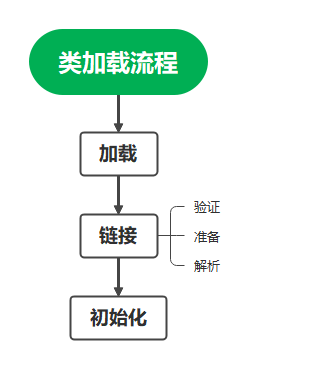
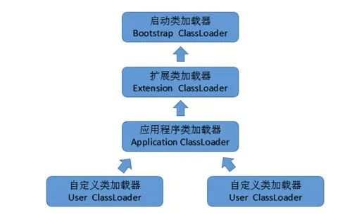
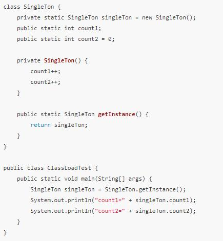
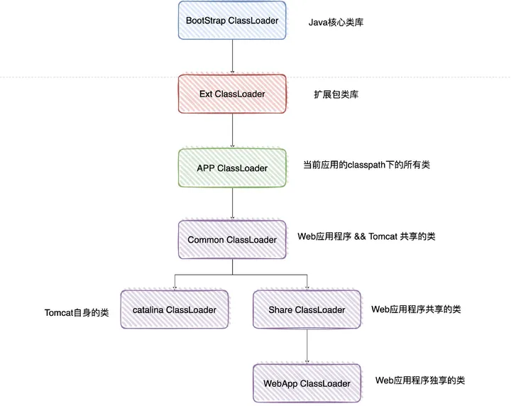

# JVM

## 内存结构

Java会从系统内存（CPU Regisers、CPU Cache Memory、RAM Main Memory）中申请大块的堆内存、和栈区（虚拟机栈、本地方法栈、程序计数器），申请的这部分称为工作内存，是经过虚拟化了的，称为虚拟机内存。剩下的内存统一称为堆外内存。

​      堆外内存又称本地内存，本地内存中有部分可以借助工具（JNI 或者 JNA）直接访问，这部分内存称为直接内存，本地内存中的还有一部分内存划给了元空间（方法区），但是这部分内存不受XX:MaxDirectMemorySize参数限制，不知道为什么说元空间使用的是直接内存。猜测这种说法是错误的，正确的说法可能是元空间使用的本地内存而非直接内存，本地内存不等于直接内存。直接内存和元空间（方法区）是并列关系，都是在本地内存中。不知道怎样去验证这种猜测的准确性。

简单来说虚拟机内存分为堆内存和栈内存，堆外内存又称本地内存分为直接内存和元空间。

引用：[JVM中的内存关系](https://www.wangt.cc//2022/01/jvm中的内存关系/)


JVM按照其存储数据的内容将所需内存分配为堆区与非堆区两个部分：所谓堆区即为通过new的方式创建的对象(类实例)所占用的内存空间;非堆区即为代码、常量、外部访问(如文件访问流所占资源)等。然而虽然java的垃圾回收机制主要是对堆区的内存进行回收的。


一个Java8进程最大占用的物理内存为：

Max Memory = eden + survivor + old + String Constant Pool + Code cache + compressed class space + Metaspace + Thread stack(*thread num) + Direct + Mapped + JVM + Native Memory，可以使用JDK自带工具查看。

### 堆区

**堆内存**：Java 虚拟机具有一个堆，堆是运行时数据区域，所有类实例和数组的内存均从此处分配。堆是在 Java 虚拟机启动时创建的。对象的堆内存由称为垃圾回收器的自动内存管理系统回收。 

Heap Space堆区分为新生代和老年代，新生代分为Eden和Survivor区。

**eden（伊甸区）**

大多数情况下，new出来的对象首先分配在eden区。当eden区没有足够空间进行分配时，虚拟机将发起一次MinorGC。GC回收一次后对象若还活着，则移到s0。

**s0、s1区(Survivor区)**

同一时刻，所有对象只会存在s0或s1区域。如果对象在eden出生并经过第一次Minor GC后仍然存活，并且能被s0容纳的话，将被移动到s0空间，并且对象年龄设为1。根据GC回收的复制算法，再进行一次回收后，s0区域会出现分片的内存空间，不利于后续对象的存储，浪费内存空间，此时会将s0区域的对象按内存空间顺序整理后拷贝到s1空间，然后s0空间重置为空，此时的s1就变回原来的from s0区域，而s0变回原来的to s1区域，对象在s0和s1区中每经过一次Minor GC，年龄就增加1岁，当它的年龄增加到一定程度（默认15岁），就会被晋升到老年代。

**老年代(tenured区)**

当老年代区域的内存满了，则会触发full GC，full GC会使程序暂停，所以要避免老年代区域的内存达到所配置的大小。

### 非堆区

非堆区包括永久代、栈内存等。

#### 永久代(permanent generation区)

1. java7之前

   **类数据、方法区和常量池**位于永久代(PermGen)，永久代和堆相互隔离，永久代的大小在启动JVM时可以设置一个固定值，不可变。

   Class在被 Load的时候被放入永久代，如果项目会LOAD很多CLASS的话,就很可能出现PermGen space错误，这种错误常见在web服务器对JSP进行pre compile的时候。JVM运行时会用到多少持久代的空间取决于应用程序用到了多少类，如果JVM发现有的类已经不再需要了，它会去回收（卸载）这些类，将它们的空间释放出来给其它类使用。

   永久代的对象在full GC时会进行垃圾收集。

2. java7中，static变量从永久代移到堆中；

3. java8中，取消永久代，把类的元数据放到本地化的堆内存(native heap)中，这一块区域就叫Metaspace，中文名叫元空间。元空间可以垃圾回收。元空间与永久代之间最大的区别在于：元空间并不在虚拟机中，而是使用本地内存。因此，默认情况下，元空间的大小仅受本地内存限制。

参考：[Metaspace 之一：Metaspace整体介绍（永久代被替换原因、元空间特点、元空间内存查看分析方法）](https://www.cnblogs.com/duanxz/p/3520829.html)

#### 栈内存

##### 虚拟机栈(Stack)

- 虚拟机栈线程私有，每个线程都有自己独立的虚拟机栈，创建一个线程的同时会创建一个栈
- 虚拟机栈是用于描述java方法执行的内存模型。 每个java方法在执行时，会创建一个“栈帧”。
- 通常说的“栈内存”，确切的说，指的是虚拟机栈的栈帧中的局部变量表，因为这里存放了一个方法的所有局部变量。 

###### 栈帧

栈帧的大小在程序代码编译时确定。

栈帧(Stack Frame)是用于支持虚拟机进行方法调用和方法执行的数据结构。栈帧存储了方法的局部变量表、操作数栈、动态链接和方法返回地址等信息。每一个方法从调用至执行完成的过程，都对应着一个栈帧在虚拟机栈里从入栈到出栈的过程。

一个线程中方法的调用链可能会很长，很多方法都同时处于执行状态。对于JVM执行引擎来说，在在活动线程中，只有位于JVM虚拟机栈栈顶的元素才是有效的，即称为当前栈帧，与这个栈帧相关连的方法称为当前方法，定义这个方法的类叫做当前类。

##### 本地方法栈(Native Stack)

本地方法栈的功能和特点类似于虚拟机栈，均具有线程隔离的特点以及都能抛出StackOverflowError和OutOfMemoryError异常。不同的是，本地方法栈服务的对象是JVM执行的native方法，而虚拟机栈服务的是JVM执行的java方法。 

#### 直接内存

NIO的Buffer提供了一个可以不经过JVM内存直接访问**系统物理内存**的类——DirectBuffer。 

DirectBuffer类继承自ByteBuffer，但和普通的ByteBuffer不同，普通的ByteBuffer仍在JVM堆上分配内存，其最大内存受到最大堆内存的限制；而DirectBuffer直接分配在物理内存中，并不占用堆空间，其可申请的最大内存受操作系统限制。

直接内存的单次分配和读写操作比普通Buffer快，但它的创建、销毁比普通Buffer慢。因此直接内存使用于需要大内存空间且频繁访问的场合，不适用于频繁申请释放内存的场合。

比如 Java8 使用元空间：元空间主要存储加载的类信息，这些数据只会在程序启动时直接分配足够的直接内存，可以减少程序的启动时间，运行期一般不会频繁加载新的类，故运行期不需要频繁分配内存。堆内存主要存放的是运行时对象，需要频繁的创建与销毁。 

直接内存可以使用 -XX:MaxDirectMemorySize 配置 


**类指针压缩空间（Compressed Class Pointer Space）**

64位平台上默认打开。压缩指针，指的是在 64 位的机器上，使用 32 位的指针来访问数据（堆中的对象或 Metaspace 中的元数据）的一种方式。如果开启了指针压缩，则CompressedClassSpace分配在MaxMetaspaceSize里头，即MaxMetaspaceSize=Compressed Class Space Size + Metaspace area (excluding the Compressed Class Space) Size

参考：[Java 内存分区之什么是 CCS区 Compressed Class Space 类压缩空间](https://www.pianshen.com/article/90131581146/)

**GC**

参考：[Java程序配置内存大小，gc参数配置-以tomcat为例](https://blog.csdn.net/loophome/article/details/87911711)


## 内存分配

```sh
#nohup java -jar -XX:MetaspaceSize=128m -XX:MaxMetaspaceSize=128m -Xms1024m -Xmx1024m -Xmn256m -Xss256k -XX:SurvivorRatio=8 -XX:+UseConcMarkSweepGC /jar包路径 &
```

对java虚拟机运行时的内存分配的不得当会导致内存溢出，比如说OutOfMemoryError等，按照需求配置java虚拟机运行时的所需的内存——通过参数配置的形式实现参数分配自定义化。

配置JVM内存的参数：      

### 堆区

- **-Xms** ：表示java虚拟机堆区内存初始内存分配的大小,通常为操作系统可用内存的1/64大小即可,但仍需按照实际情况进行分配。
- **-Xmx**：表示java虚拟机堆区内存可被分配的最大上限,通常为操作系统可用内存的1/4大小。但是开发过程中,通常会将 -Xms 与 -Xmx	两个参数的配置相同的值,其目的是为了能够在java垃圾回收机制清理完堆区后不需要重新分隔计算堆区的大小而浪费资源。
- **-XX:newSize**：表示新生代初始内存的大小,应该小于 -Xms的值;
- **-XX:MaxnewSize**：表示新生代可被分配的内存的最大上限;当然这个值应该小于 -Xmx的值;
- **-Xmn**：至于这个参数则是对 -XX:newSize、-XX:MaxnewSize两个参数的同时配置,也就是说如果通过-Xmn来配置新生代的内存大小,那么-XX:newSize = -XX:MaxnewSize = -Xmn,虽然会很方便,但需要注意的是这个参数是在JDK1.4版本以后才使用的。Sun官方推荐配置为整个堆的3/8
- **-XX:NewRatio=4**：设置新生代和老年代的内存比例为 1:4；
- **-XX:SurvivorRatio**：设置新生代中Eden和Survivor的比例(默认值为8，即Eden:FromSpace:ToSpace，默认比例8:1:1，假如值为4表示：Eden:S0:S1 = 4:3:3)
- **-XX:MaxTenuringThreshold**：设置对象晋升老年代的年龄阈值，默认15

### 非堆区

- **-XX:PermSize**：表示非堆区初始内存分配大小,其缩写为permanent size(持久化内存)，默认是物理内存的1/64;

- **-XX:MaxPermSize**：表示对永久代分配的内存的最大上限,默认是物理内存的1/4。

- **-XX:MetaspaceSize**：元空间默认大小

- **-XX:MaxMetaspaceSize**：元空间最大大小

- **-Xss**：每个线程栈内存最大深度大小，JDK5.0以后每个线程堆栈大小为1M，以前每个线程堆栈大小为256K。更具应用的线程所需内存大小进行调整。在相同物理内存下，减小这个值能生成更多的线程。但是操作系统对一个进程内的线程数还是有限制的，不能无限生成，经验值在3000~5000左右。

  参考：[JVM常用基础参数-栈内存Xss讲解](https://blog.csdn.net/longgeqiaojie304/article/details/93972700)

- **-XX:+UseConcMarkSweepGC**：指定使用的垃圾收集器，这里使用CMS收集器
- **-XX:+PrintGCDetails**：打印详细的GC日志
- **-XX:ParallelGCThreads**：Gc线程数


- **-XX:+UseCompressedOops** 允许对象指针压缩。 

- **-XX:+UseCompressedClassPointers** 允许类指针压缩。 

  它们默认都是开启的，可以手动关闭它们。 如果不允许类指针压缩，那么将没有 compressed class space 这个空间，并且-XX:CompressedClassSpaceSize 这个参数无效。 -XX:-UseCompressedClassPointers 需要搭配 -XX:+UseCompressedOops，但是反过来不是，也就是说我们可以只压缩对象指针，不压缩类指针。在对象指针压缩基础上进行类指针压缩。


## 内存监控

### JDK自带的工具

这些工具都在JAVA_HOME/bin目录下，执行命令的jdk版本和所监控的jvm的jdk版本需要一致，否则会报错。

jps：用来显示本地的java进程，以及进程号，进程启动的路径等。

```sh
# jps
9033 Bootstrap(启动的 Tomcat)
4284 Jps
12318 jar
```

#### jmap

观察运行中的JVM 物理内存的占用情况，包括Heap size , Perm size

```sh
# 打印当前对象的个数和大小
$ jmap -histo <java_pid>

# 打印当前存活对象的个数和大小,此命令会触发一次full gc
$ jmap -histo:live <java_pid>
```


```sh
$ jmap -heap 9033
Attaching to process ID 9033, please wait...
Debugger attached successfully.
Server compiler detected.
JVM version is 25.112-b15

using thread-local object allocation.
Parallel GC with 2 thread(s)

Heap Configuration:
   MinHeapFreeRatio         = 0
   MaxHeapFreeRatio         = 100
   MaxHeapSize              = 134217728 (128.0MB)
   NewSize                  = 44564480 (42.5MB)
   MaxNewSize               = 44564480 (42.5MB)
   OldSize                  = 89653248 (85.5MB)
   NewRatio                 = 2
   SurvivorRatio            = 8
   MetaspaceSize            = 134217728 (128.0MB)
   CompressedClassSpaceSize = 1073741824 (1024.0MB)
   MaxMetaspaceSize         = 134217728 (128.0MB)
   G1HeapRegionSize         = 0 (0.0MB)

Heap Usage:
PS Young Generation
Eden Space:
   capacity = 40370176 (38.5MB)
   used     = 1921656 (1.8326339721679688MB)
   free     = 38448520 (36.66736602783203MB)
   4.760088239397321% used
From Space:
   capacity = 2097152 (2.0MB)
   used     = 360448 (0.34375MB)
   free     = 1736704 (1.65625MB)
   17.1875% used
To Space:
   capacity = 2097152 (2.0MB)
   used     = 0 (0.0MB)
   free     = 2097152 (2.0MB)
   0.0% used
PS Old Generation
   capacity = 89653248 (85.5MB)
   used     = 49846600 (47.53742218017578MB)
   free     = 39806648 (37.96257781982422MB)
   55.599324187340095% used

24752 interned Strings occupying 2413552 bytes.

# 获取内存信息
$ jmap -heap:format=b <java_pid>
在启动时增加-XX:+HeapDumpOnOutOfMemoryError -XX:HeapDumpPath="具体的路径"，当系统OutOfMemory之后，会将内存信息收集下来。

$ jmap -dump:live,format=b,file=aaa <java_pid>
```

#### jcmd

打印java进程的基本类、线程、VM信息

```sh
/*		
    需要在启动Java程序时开启NMT(Native Memory Tracker ，是一个本地内存跟踪工具)
    off 默认配置
    summary 只收集汇总信息
    detail 收集每次调用的信息
    注意，根据Java官方文档，开启NMT会有5%－10%的性能损耗；
*/
-XX:NativeMemoryTracking=[off | summary | detail]
 
#如果想JVM退出时打印退出时的内存使用情况，可以通过如下配置项:
-XX:+UnlockDiagnosticVMOptions -XX:+PrintNMTStatistics
 
$ java -Xmx8g -Xms8g - -XX:+UseG1GC -XX:NativeMemoryTracking=detail -jar /home/pgcp/pgcp-0.0.1-SNAPSHOT.jar
```

```sh
$ jcmd 9033  VM.native_memory
9033:

Native Memory Tracking:

Total: reserved=1284481KB, committed=236913KB
			#堆内存
-                 Java Heap (reserved=131072KB, committed=131072KB)
                        (mmap: reserved=131072KB, committed=131072KB)
    		#类加载信息
-                     Class (reserved=1100460KB, committed=58156KB)
                        (classes #9943)
                        (malloc=4780KB #13763)
                        (mmap: reserved=1095680KB, committed=53376KB)
    		#线程栈
-                    Thread (reserved=10726KB, committed=10726KB)
                        (thread #24)
                        (stack: reserved=10560KB, committed=10560KB)
                        (malloc=75KB #119)
                        (arena=91KB #46)
    		#代码缓存
-                      Code (reserved=10639KB, committed=5375KB)
                        (malloc=239KB #851)
                        (mmap: reserved=10400KB, committed=5136KB)
    		#垃圾回收
-                        GC (reserved=8265KB, committed=8265KB)
                        (malloc=3469KB #243)
                        (mmap: reserved=4796KB, committed=4796KB)
    		#编译器
-                  Compiler (reserved=152KB, committed=152KB)
                        (malloc=22KB #159)
                        (arena=130KB #2)
    		#内部
-                  Internal (reserved=7595KB, committed=7595KB)
                        (malloc=7563KB #13970)
                        (mmap: reserved=32KB, committed=32KB)
    		#符号
-                    Symbol (reserved=13018KB, committed=13018KB)
                        (malloc=11124KB #111613)
                        (arena=1894KB #1)
    		#nmt
-    Native Memory Tracking (reserved=2367KB, committed=2367KB)
                        (malloc=134KB #2113)
                        (tracking overhead=2234KB)

-               Arena Chunk (reserved=186KB, committed=186KB)
                        (malloc=186KB)

reserved
reserved memory是指JVM通过mmaped PROT_NONE申请的虚拟地址空间，在页表中已经存在了记录(entries)，保证了其他进程不会被占用。

committed
committed memory是操作系统实际分配的内存（malloc/mmap）,mmaped PROT_READ | PROT_WRITE，相当于程序实际申请的可用内存。
committed申请的内存并不是说直接占用了物理内存，由于操作系统的内存管理是惰性的，对于已申请的内存虽然会分配地址空间，
但并不会直接占用物理内存，真正使用的时候才会映射到实际的物理内存。所以committed > res也是很可能的。
 
used
表示当前使用的内存量(以字节为单位)
```

#### jstat

```sh
# 查看gc情况
$ jstat -gc <pid> 
```

```
GC日志:
-XX:PrintGCTimeStamps：打印 GC 时间
-XX:PrintGCDetails ：打印 GC 日志；
-Xloggc: path：保存GC 日志路径。
jstat –gcutil: 显示垃圾收集信息
```


jhat 分析jmap等方法生成的dump堆文件，解析Java堆转储文件,并启动一个 web server，可以直接访问。

jinfo 查看jvm系统参数，可以动态设置参数

jstat 可以查看gc和类加载情况

jstack 查看线程堆栈情况

jconsole 可视化工具，可以连接远程linux服务器对内存线程等监视管理。

jvisualVM 傻瓜式工具，功能更强大，可以在线dump内存堆栈,也可以提供后处理工具。

Heap Analyzer工具

Heap Jmeter工具

在故障定位(尤其是out of memory)和性能分析的时候，会用到dump文件来帮助我们排除代码问题，常用的有heap dump和thread dump，heap dump记录内存信息的，thread dump是记录CPU信息的，可以使用jmap和jstack命令获取，使用jhat命令分析。

参考：

[java命令--jhat命令使用](https://www.cnblogs.com/baihuitestsoftware/articles/6406271.html)

[JConsole连接远程linux服务器配置](https://www.cnblogs.com/zluckiy/p/10309495.html)

## 垃圾回收

### 垃圾识别

不会被访问到的对象是垃圾 

#### GC root 可达性分析

**GC root原理**：通过对枚举GC root对象做引用可达性分析，即从GC roots对象开始，向下搜索，形成的路径称之为引用链（从GC Roots开始遍历对象，没有被遍历到的对象为垃圾 ）。如果一个对象到GC roots对象没有任何引用，没有形成引用链，那么该对象等待GC回收。 

**Java中可以作为GC Roots的对象**

1、虚拟机栈（javaStack）中引用的对象，也就是方法栈使用到的参数、局部变量、临时变量等。

2、方法区中的类静态属性引用的对象。

3、方法区中常量引用的对象。

4、本地方法栈中 JNI (Native方法)引用的对象。

#### 引用计数法

记录每个对象被引用的数量，当被引用的数量为0时，则标记为垃圾

缺点：无法处理循环引用的问题


### 垃圾回收算法

- 标记-清除(sweep) 算法：将垃圾对象所占据的内存标记为空闲内存，然后存在一个空闲列表(free list)中。当需要创建对象时，从空闲列表中寻找空闲内存，分配给新创建的对象。缺点：效率不高，无法清除垃圾碎片。
- 复制(copy)算法：将内存分为两个部分，并分别用 from 和 to 指针来维护。每次只在 from 指向的内存中分配内存，当发生垃圾回收时，将 from 指向区域中存活的对象复制到 to 指向的内存区域，然后将 from 指针和 to 指针互换位置。缺点：内存使用率不高，只有原来的一半。
- 标记-整理算法：标记无用对象，让所有存活的对象都向一端移动，在连续的空间内顺序分配，然后直接清除掉端边界以外的内存。
- 分代算法：根据对象存活周期的不同将内存划分为几块，一般是新生代和老年代，**新生代基本采用复制算法，老年代采用标记整理算法**。

gc 主要的回收的内存区域有堆区和方法区

### 垃圾回收器

垃圾收集算法是内存回收的方法论，那么垃圾收集器就是内存回收的具体实现。有7种作用于不同分代的收集器，其中用于回收新生代的收集器包括Serial、PraNew、Parallel Scavenge，回收老年代的收集器包括Serial Old、Parallel Old、CMS，还有用于回收整个Java堆的G1收集器。

#### Minor GC

特点：发生次数多，采用时间短，回收掉大量对象

收集器：serial, Parallel Scavenge, Parallel New.均采用复制算法. Serial是单线程,Parallel New可以看成Serial多线程版本. Parallel Scanvenge和Parallel New类似，但更注重吞吐率，且不能与CMS一起使用

#### Full GC

特点：发生次数少，耗时长

收集器：Serial Old(整理), Parallel Old(整理), CMS(清除). Serial Old是单线程的，Parallel Old可以看成Serial Old的多线程版本.  CMS是并发收集器，除了初始标记和重新标记操作需要Stop the world，其它时间可以与应用程序一起并发执行


**Full GC 触发条件**

老年代空间不足；

老年代被写满；

通过minor GC进入老年代的平均大小大于老年代的可用内存；

方法区(Metaspace)空间不足；


### 引用类型

- 强引用：发生 gc 的时候不会被回收。
- 软引用：有用但不是必须的对象，在发生内存溢出之前会被回收。
- 弱引用：有用但不是必须的对象，在下一次GC时会被回收。
- 虚引用（幽灵引用/幻影引用）：无法通过虚引用获得对象，用 PhantomReference 实现虚引用，虚引用的用途是在 gc 时返回一个通知。

#### 详解

##### strong reference

Object c = new Car(); //只要c还指向car object, car object就不会被回收，只要强引用还存在，垃圾收集器永远不会回收掉被引用的对象。

##### soft reference 

当系统内存不足时， soft reference指向的object才会被回收。

有些还有用但并非必需的对象。在系统将要发生内存溢出异常之前，将会把这些对象列进回收范围进行二次回收，如果这次回收还没有足够的内存，才会抛出内存溢出异常。 

##### weak reference

描述非必需对象。被弱引用关联的对象只能生存到下一次垃圾回收之前，垃圾收集器工作之后，无论当前内存是否足够，都会回收掉只被弱引用关联的对象。 

`WeakReference<Car> weakCar = new WeakReference<Car>(car);`

当一个对象仅仅被 weak reference 指向, 而没有任何其他 strong reference 指向的时候, 如果GC运行, 那么这个对象就会被回收。当要获得 weak reference 引用的 object 时, 首先需要判断它是否已经被回收     :`if(weakCar.get()!=null)`。

另外， java提供了一个ReferenceQueue来保存这些所指向的对象已经被回收的reference。

##### PhantomReference

无用对象，这个引用存在的唯一目的就是在这个对象被收集器回收时收到一个系统通知，被虚引用关联的对象，和其生存时间完全没关系。 

## springboot内存优化

application.properties

```properties
#没有连接超时时间的配置
server.port=8081			#端口号
server.tomcat.max-threads=200	#最大线程数
server.tomcat.min-spare-threads=10	#最大空闲连接数
server.tomcat.max-connections=500	#最大连接数
server.tomcat.uri-encoding=UTF-8	#编码方式
server.tomcat.max-http-post-size=0		#post提交数据最大大小，设置为0不限制
server.tomcat.max-http-header-size=0 	#请求响应头最大大小
```

或者配置类

```java
@Component
public class TomcatConfig extends TomcatEmbeddedServletContainerFactory{
    public EmbeddedServletContainer getEmbeddedServletContainer(ServletContextInitializer... initializers){
        //设置端口
        this.setPort(8081);
        return super.getEmbeddedServletContainer(initializers);
    }

    protected void customizeConnector(Connector connector){
        super.customizeConnector(connector);
        Http11NioProtocol protocol = (Http11NioProtocol)connector.getProtocolHandler();
        //设置最大连接数
        protocol.setMaxConnections(200);
        //设置最大线程数
        protocol.setMaxThreads(300);
        //连接超时时间
        protocol.setConnectionTimeout(10000);
    }
}
```


## 开发工具

### IDEA

设置Java程序运行内存edit Configuation-->VM options

### Eclipse

eclipse.ini文件，参数中-vmargs的意思是设置JVM参数，如-vmargs -Xms1024M -Xmx1024M -XX:PermSize=1024M -XX:MaxPermSize=1024M


## 类加载

### 类加载过程

Java代码从编码完成到运行，包含两个步骤：

编译：把写好的java文件通过javac命令编译成字节码（.class文件）。

运行：把字节码文件交给JVM执行。

类加载的过程就是JVM把.class文件中类信息加载进内存，并解析生成class对象的过程。这个过程主要为3步：加载、链接、初始化，而链接可以分为3小步：验证、准备、解析，每个过程主要过程如下： 



#### 流程详解

**加载**

由类加载器（ClassLoader）执行的。将class字节码文件从不同数据源通过不同类加载器载入 jvm内存 中，数据源包括 zip 压缩包，网络，运行时计算生成，其他文件生成，数据库等。

**链接**

1. 验证：验证字节码信息是否符合 jvm 规范；验证包括对于**文件格式**的验证，比如常量中是否有不被支持的常量？文件中是否有不规范的或者附加的其他信息？对于**元数据的验证**，比如该类是否继承了被final修饰的类？类中的字段，方法是否与父类冲突？是否出现了不合理的重载；对于**字节码的验证**，保证程序语义的合理性，比如要保证类型转换的合理性。对于**符号引用的验证**，比如校验符号引用中通过全限定名是否能够找到对应的类？校验符号引用中的访问性（private，public等）是否可被当前类访问？
2. 准备：为变量分配内存，并且赋予初值，初值不是代码中的初始化的值而是根据不同变量设置默认值，其中引用类型为null。
3. 解析：将常量池中的符号引用转换为直接引用。也可以在初始化之后再开始，来支持 java 的运行时绑定。例如调用hello()方法，替换为方法的内存地址。

**初始化**

对static修饰的变量或语句进行初始化，先初始化父类，后初始化子类；

不要在 static 块中抛出异常，否则会导致类初始化失败，抛 ExceptionInInitializerError 异常，进而导致其他异常。

#### other

**懒加载**

所有的类都是在对其第一次使用时，动态加载到 JVM 中的。因此 java 程序在它开始运行之前并非被完全加载，其各个类都是在必需时才加载的。

**初始化时机（类加载时机）**

- JVM 启动时，先初始化用户指定的主类
- 初始化一个类的子类（会首先初始化子类的父类）
- 访问类的静态变量或静态方法
- 创建类实例
- 反射调用类

访问final修饰的静态变量时，不会触发类加载，因为在编译期已经将此常量放在常量池了。

特点：JVM 会加锁来保证类初始化只进行一次，可以用来实现单例模式

[静态方法什么时候执行](https://blog.csdn.net/weixin_39983051/article/details/111361114)

### 类加载器

#### 类加载器的隔离问题

每个类装载器都有一个自己的命名空间用来保存已装载的类。当一个类装载器装载一个类时，它会通过保存在命名空间里的类全局限定名进行搜索来检测这个类是否已经被加载了。

JVM 对类唯一的识别是 ClassLoader id + PackageName + ClassName，所以一个运行程序中是有可能存在两个包名和类名完全一致的类的。并且如果这两个类不是由一个 ClassLoader 加载，是无法将一个类的实例强转为另外一个类的，这就是 ClassLoader 隔离性。

为了解决类加载器的隔离问题，JVM引入了双亲委派机制。

#### classloader的层次结构



- 启动类加载器 (BootstrapClassLoader)

  查找 jre 核心库，加载jre/lib/rt.jar中的所有class

- 扩展类加载器 (ExtClassLoader)

  查找 jre/lib/ext 扩展包

- 应用程序类加载器 (AppClassLoader)

  查找环境变量 CLASSPATH 目录

- 自定义类加载器 (UserDefineClassLoader)

  查找用户定义的目录

#### 双亲委派机制

双亲委派机制的核心有两点：第一，自底向上检查类是否已加载；其二，自顶向下尝试加载类。 

类加载器通常有四类：启动类加载器、拓展类加载器、应用程序类加载器和自定义类加载器。

暂且不考虑自定义类加载器，JDK自带类加载器具体执行过程如下：

第一：当AppClassLoader加载一个class时，会把类加载请求委派给父类加载器ExtClassLoader去完成；

第二：当ExtClassLoader加载一个class时，会把类加载请求委派给BootStrapClassLoader去完成；

第三：如果BootStrapClassLoader加载失败（例如在%JAVA_HOME%/jre/lib里未查找到该class），会使用ExtClassLoader来尝试加载；

第四：如果ExtClassLoader也加载失败，则会使用AppClassLoader来加载，如果AppClassLoader也加载失败，则会报出异常ClassNotFoundException。

#### ClassLoader的双亲委派实现

ClassLoader通过loadClass()方法实现了双亲委托机制，用于类的动态加载。

该方法的源码如下：

```java
protected Class<?> loadClass(String name, boolean resolve) throws ClassNotFoundException {
    synchronized (getClassLoadingLock(name)) {
        // First, check if the class has already been loaded
        Class<?> c = findLoadedClass(name); //查询是否加载过
        if (c == null) {
            long t0 = System.nanoTime();
            try {
                if (parent != null) {
                    c = parent.loadClass(name, false); //没有加载过而且有上级就委派给上级
                } else {
                    c = findBootstrapClassOrNull(name); //没有上级就交给顶级类加载器
                }
            } catch (ClassNotFoundException e) {
                // ClassNotFoundException thrown if class not found
                // from the non-null parent class loader
            }

            if (c == null) {
                // If still not found, then invoke findClass in order
                // to find the class.
                long t1 = System.nanoTime();
                c = findClass(name);

                // this is the defining class loader; record the stats
                sun.misc.PerfCounter.getParentDelegationTime().addTime(t1 - t0);
                sun.misc.PerfCounter.getFindClassTime().addElapsedTimeFrom(t1);
                sun.misc.PerfCounter.getFindClasses().increment();
            }
        }
        if (resolve) {
            resolveClass(c);
        }
        return c;
    }
}

```

双亲是层级关系的称呼方式，层级关系并不是继承的关系，而是组合，每个类加载器都有parent字段来定义上级。 loadClass方法本身是一个递归向上调用的过程，上述代码中从parent.loadClass的调用就可以看出。

在执行其他操作之前，首先通过findLoadedClass方法从最底端的类加载器开始检查是否已经加载指定的类。如果已经加载，则根据resolve参数决定是否要执行连接过程，并返回Class对象。

而Jar包冲突往往发生在这里，当第一个同名的类被加载之后，在这一步检查时就会直接返回，不会再加载真正需要的类。那么，程序用到该类时就会抛出找不到类，或找不到类方法的异常。

#### 对象初始化顺序

**基于代码层面的对象初始化顺序解释描述**

普通类：（静态变量和静态代码块只和出现顺序有关，普通变量和普通代码块也之和出现顺序有关）

1. 静态变量
2. 静态代码块
3. 普通变量
4. 普通代码块
5. 构造函数

继承的子类：（静态——父类——子类）

1. 父类静态变量
2. 父类静态代码块
3. 子类静态变量
4. 子类静态代码块
5. 父类普通变量
6. 父类普通代码块
7. 父类构造函数
8. 子类普通变量
9. 子类普通代码块
10. 子类构造函数

类初始化顺序：父类静态，子类静态，父类代码块、父类构造，子类代码块，子类构造。

**题目**




```java
结果：
count1=1
count2=0
```

分析：

1. SingleTon.getInstance()，调用静态方法，触发SingleTon类加载。
2. SingleTon类加载初始化，按顺序初始化静态变量。
3. 先执行private static SingleTon singleTon = new SingleTon(); ，调用构造器后，count1，count2均为1；
4. 按顺序执行 public static int count1; 没有赋值，所以count1依旧为1；
5. 按顺序执行 public static int count2 = 0;所以count2变为0.

### Jar包的加载顺序

在同一目录下的jar包，JVM是按照jar包的先后顺序进行加载，一旦一个全路径名相同的类被加载之后，后面再有相同的类便不会进行加载了。而Jar包被加载的顺序直接决定了类加载的顺序。

决定Jar包加载顺序通常有以下因素：

- 第一，Jar包所处的加载路径。也就是加载该Jar包的类加载器在JVM类加载器树结构中所处层级。上面讲到的四类类加载器加载的Jar包的路径是有不同的优先级的。
- 第二，文件系统的文件加载顺序。因Tomcat、Resin等容器的ClassLoader获取加载路径下的文件列表时是不排序的，这就依赖于底层文件系统返回的顺序，当不同环境之间的文件系统不一致时，就会出现有的环境没问题，有的环境出现冲突。

#### Tomcat启动时Jar包和类的加载顺序

最后，梳理一下Tomcat启动时，对Jar包和类的加载顺序，其中包含上面提到的不同种类的类加载器默认加载的目录：

- $java_home/lib 目录下的java核心api；
- $java_home/lib/ext 目录下的java扩展jar包；
- java -classpath/-Djava.class.path所指的目录下的类与jar包；
- $CATALINA_HOME/common目录下按照文件夹的顺序从上往下依次加载；
- $CATALINA_HOME/server目录下按照文件夹的顺序从上往下依次加载；
- $CATALINA_BASE/shared目录下按照文件夹的顺序从上往下依次加载；
- 项目路径/WEB-INF/classes下的class文件；
- 项目路径/WEB-INF/lib下的jar文件；

上述目录中，同一文件夹下的Jar包，按照顺序从上到下一次加载。如果一个class文件已经被加载到JVM中，后面相同的class文件就不会被加载了。

##### Tomcat如何打破双亲委派机制



**如何打破双亲委派机制：**自定义ClassLoader，重写loadClass方法（只要不依次往上交给父加载器进行加载，就算是打破双亲委派机制）

**打破双亲委派机制案例：Tomcat**

- 为了Web应用程序类之间隔离，为每个应用程序创建WebAppClassLoader类加载器
- 为了Web应用程序类之间共享，把ShareClassLoader作为WebAppClassLoader的父类加载器，如果WebAppClassLoader加载器找不到，则尝试用ShareClassLoader进行加载
- 为了Tomcat本身与Web应用程序类隔离，用CatalinaClassLoader类加载器进行隔离，CatalinaClassLoader加载Tomcat本身的类
- 为了Tomcat与Web应用程序类共享，用CommonClassLoader作为CatalinaClassLoader和ShareClassLoader的父类加载器
- ShareClassLoader、CatalinaClassLoader、CommonClassLoader的目录可以在Tomcat的catalina.properties进行配置
- 每个web应用程序都有自己专用的WebappClassLoader，优先加载/web-inf/lib下的jar中的class文件，webappClassLoader没有遵循类加载的双亲委派机制，但是使用webappClassLoader的load加载类会进行过滤，如果有些类被过滤掉还是通过双亲委派机制优先从父加载器中加载类。commonLoader、catalinaLoader、sharedLoader遵循双亲委派机制。

**线程上下文加载器：**由于类加载的规则，很可能导致父加载器加载时依赖子加载器的类，导致无法加载成功（BootStrap+ClassLoader无法加载第三方库的类），所以存在「线程上下文加载器」来进行加载。该类加载器保存在线程私有数据里，只要是同一个线程，一旦设置了线程上下文加载器，在线程后续执行过程中就能把这个类加载器取出来用。

[WebAppClassLoader类加载机制](https://blog.csdn.net/qq924862077/article/details/78417398)

#### Jar包冲突的通常表现

Jar包冲突往往是很诡异的事情，也很难排查，但也会有一些共性的表现。

- 抛出java.lang.ClassNotFoundException：典型异常，主要是依赖中没有该类。导致原因有两方面：第一，的确没有引入该类；第二，由于Jar包冲突，Maven仲裁机制选择了错误的版本，导致加载的Jar包中没有该类。
- 抛出java.lang.NoSuchMethodError：找不到特定的方法。Jar包冲突，导致选择了错误的依赖版本，该依赖版本中的类对不存在该方法，或该方法已经被升级。
- 抛出java.lang.NoClassDefFoundError，java.lang.LinkageError等，原因同上。
- 没有异常但预期结果不同：加载了错误的版本，不同的版本底层实现不同，导致预期结果不一致。

[Maven Jar包冲突？看看高手是怎么解决的](https://ost.51cto.com/posts/16325)

### 自定义类加载器

#### 如何解决Jar包冲突

目前市面上主流解决动态加载Jar包冲突的方法.

- 利用类似于OSGI这样的重框架来解决这类问题，但是这类框架太重太复杂，难以掌握，并且会加重项目的复杂度.
- 利用蚂蚁金服公司开源贡献的SOFAArk,基于 Java 实现的轻量级类隔离容器.
- 自定义类加载器来实现类隔离,例如Tomcat和Flink的实现,自定义类加载器并打破了双亲委派模型.因为Java虚拟机不仅要看类的全名是否相同，还要看加载此类的类加载器是否一样。只有两者都相同的情况，才认为两个类是相同的。所以会出现相同类名的实例共存的情况.便达到了类相互隔离的作用

#### 动态加载Jar包流程

1. 自定义类加载器.
2. 将jar文件加载到内存中.
3. 自定义ClassLoader将jar文件中的类加载到JVM.
4. 通过反射获取到需要调用的类并进行实例化.
5. 通过反射获取方法入参对象.
6. 通过类的实例对象就可以调用这个Jar中的方法

#### 解决问题的思路

- 通过自定义类加载器加载依赖了不兼容的jar及其他依赖的jar，用不同的类加载器实例加载相关的类并创建对象.
- 打破类加载器的双亲委派机制，单独创建出的类加载器要优先自己加载，加载不到则再委派给Parent类加载器进行加载.
- 通过动态监听的方式监听Jar是否被替换从而达到热插拔的效果,这里不做实现,具体可参考Tomcat更新Jsp的方式,每当监听到Jsp文件被修改,便重新加载该Jsp文件.

#### 实现案例一

```java
package cn.gq.jdsk;

import java.io.*;
import java.net.URL;
import java.net.URLClassLoader;
import java.util.ArrayList;
import java.util.List;
import java.util.jar.JarEntry;
import java.util.jar.JarFile;

/**
 * @author chiangtaol
 * @date 2021-10-19
 * @describe
 */
/**
 * 提供Jar隔离的加载机制，会把传入的路径、及其子路径、以及路径中的jar文件加入到class path。
 * 破坏双亲委派机制，改为逆向
 * */
public class JarLoader extends URLClassLoader {
    private static ThreadLocal<URL[]> threadLocal = new ThreadLocal<>();
    private URL[] allUrl;
    public JarLoader(String[] paths) {
        this(paths, JarLoader.class.getClassLoader());
    }

    public JarLoader(String[] paths, ClassLoader parent) {
        super(getURLs(paths), parent);
        //暂时先这样
        allUrl = threadLocal.get();
    }

    private static URL[] getURLs(String[] paths) {
        if (null == paths || 0 == paths.length) {
            throw new RuntimeException("jar包路径不能为空.");
        }

        List<String> dirs = new ArrayList<String>();
        for (String path : paths) {
            dirs.add(path);
            JarLoader.collectDirs(path, dirs);
        }

        List<URL> urls = new ArrayList<URL>();
        for (String path : dirs) {
            urls.addAll(doGetURLs(path));
        }
        URL[] urls1 = urls.toArray(new URL[0]);
        threadLocal.set(urls1);
        return urls1;
    }

    private static void collectDirs(String path, List<String> collector) {
        if (null == path || "".equalsIgnoreCase(path)) {
            return;
        }

        File current = new File(path);
        if (!current.exists() || !current.isDirectory()) {
            return;
        }

        for (File child : current.listFiles()) {
            if (!child.isDirectory()) {
                continue;
            }

            collector.add(child.getAbsolutePath());
            collectDirs(child.getAbsolutePath(), collector);
        }
    }

    private static List<URL> doGetURLs(final String path) {
        if (null == path || "".equalsIgnoreCase(path)) {
            throw new RuntimeException("jar包路径不能为空.");
        }
        File jarPath = new File(path);

        if (!jarPath.exists() || !jarPath.isDirectory()) {
            throw new RuntimeException("jar包路径必须存在且为目录.");
        }

        /* set filter */
        FileFilter jarFilter = new FileFilter() {
            @Override
            public boolean accept(File pathname) {
                return pathname.getName().endsWith(".jar");
            }
        };

        /* iterate all jar */
        File[] allJars = new File(path).listFiles(jarFilter);
        List<URL> jarURLs = new ArrayList<URL>(allJars.length);

        for (int i = 0; i < allJars.length; i++) {
            try {
                jarURLs.add(allJars[i].toURI().toURL());
            } catch (Exception e) {
                throw new RuntimeException("系统加载jar包出错", e);
            }
        }
        return jarURLs;
    }
    //破坏双亲委派模型,采用逆向双亲委派
    @Override
    public Class<?> loadClass(String name) throws ClassNotFoundException {
        if (allUrl != null) {
            String classPath = name.replace(".", "/");
            classPath = classPath.concat(".class");
            for (URL url : allUrl) {
                byte[] data = null;
                ByteArrayOutputStream baos = new ByteArrayOutputStream();
                InputStream is = null;
                try {
                    File file = new File(url.toURI());
                    if (file != null && file.exists()) {
                        JarFile jarFile = new JarFile(file);
                        if (jarFile != null) {
                            JarEntry jarEntry = jarFile.getJarEntry(classPath);
                            if (jarEntry != null) {
                                is = jarFile.getInputStream(jarEntry);
                                int c = 0;
                                while (-1 != (c = is.read())) {
                                    baos.write(c);
                                }
                                data = baos.toByteArray();
                                return this.defineClass(name, data, 0, data.length);
                            }
                        }
                    }
                } catch (Exception e) {
                    e.printStackTrace();
                } finally {
                    try {
                        if (is != null) {
                            is.close();
                        }
                        baos.close();
                    } catch (IOException e) {
                        e.printStackTrace();
                    }
                }
            }
        }
        return super.loadClass(name);
    }
}
```

```java
package cn.gq.jdsk;

/**
 * @author chiangtaol
 * @date 2021-10-19
 * @describe
 */
/**
 *
 * 为避免jar冲突，比如hbase可能有多个版本的读写依赖jar包
 * 就需要脱离当前classLoader去加载这些jar包，执行完成后，又退回到原来classLoader上继续执行接下来的代码
 */
public final class ClassLoaderSwapper {
    private ClassLoader storeClassLoader = null;

    private ClassLoaderSwapper() {
    }

    public static ClassLoaderSwapper newCurrentThreadClassLoaderSwapper() {
        return new ClassLoaderSwapper();
    }

    /**
     * 保存当前classLoader，并将当前线程的classLoader设置为所给classLoader
     *
     * @param
     * @return
     */
    public ClassLoader setCurrentThreadClassLoader(ClassLoader classLoader) {
        this.storeClassLoader = Thread.currentThread().getContextClassLoader();
        Thread.currentThread().setContextClassLoader(classLoader);
        return this.storeClassLoader;
    }

    /**
     * 将当前线程的类加载器设置为保存的类加载
     * @return
     */
    public ClassLoader restoreCurrentThreadClassLoader() {
        ClassLoader classLoader = Thread.currentThread()
            .getContextClassLoader();
        Thread.currentThread().setContextClassLoader(this.storeClassLoader);
        return classLoader;
    }
}
```

```java
@Test
public void classloader() throws Exception{
    String jar1 = "/Users/chiangtaol/Downloads/test/jd/jar1"; //自己定义的测试jar包，不同版本打印内容不同
    String jar2 = "/Users/chiangtaol/Downloads/test/jd/jar2";

    JarLoader jarLoader = new JarLoader(new String[]{jar1});
    ClassLoaderSwapper classLoaderSwapper = ClassLoaderSwapper.newCurrentThreadClassLoaderSwapper();
    classLoaderSwapper.setCurrentThreadClassLoader(jarLoader);
    Class<?> aClass = Thread.currentThread().getContextClassLoader().loadClass("cn.tnt.bean.TestClass");
    classLoaderSwapper.restoreCurrentThreadClassLoader();
    Object o = aClass.newInstance();
    Method isEmptyMethod = aClass.getDeclaredMethod("hello");
    Object invoke = isEmptyMethod.invoke(o);
    System.out.println(invoke);

    JarLoader jarLoader2 = new JarLoader(new String[]{jar2});
    ClassLoaderSwapper classLoaderSwapper2 = ClassLoaderSwapper.newCurrentThreadClassLoaderSwapper();
    classLoaderSwapper2.setCurrentThreadClassLoader(jarLoader2);
    Class<?> aClass2 = Thread.currentThread().getContextClassLoader().loadClass("cn.tnt.bean.TestClass");
    classLoaderSwapper.restoreCurrentThreadClassLoader();
    Object o2 = aClass2.newInstance();
    Method isEmptyMethod2 = aClass2.getDeclaredMethod("hello");
    Object invoke2 = isEmptyMethod2.invoke(o2);
    System.out.println(invoke2);
}
```

#### 实现案例二

```java
public class ChildFirstClassLoader extends URLClassLoader {

    static {
        ClassLoader.registerAsParallelCapable();
    }

    protected ChildFirstClassLoader(URL[] urls, ClassLoader parent) {
        super(urls, parent);
    }

    /**
     * 重写loadClass方法，部分类加载破坏双亲委派模型，（优先加载子类）。
     *
     * @param name
     * @param resolve
     * @return
     * @throws ClassNotFoundException
     */
    @Override
    protected Class<?> loadClass(String name, boolean resolve) throws ClassNotFoundException {
        synchronized (getClassLoadingLock(name)) {
            // First, check if the class has already been loaded
            Class<?> c = findLoadedClass(name);

            if (c != null) {
                if (resolve) {
                    resolveClass(c);
                }
                return c;
            }
            try {
                c = findClass(name);
                if (c != null) {
                    System.out.println("loaded from child, name=" + name);
                    if (resolve) {
                        resolveClass(c);
                    }
                    return c;
                }
            } catch (ClassNotFoundException e) {
                // Ignore
            }


            try {
                if (getParent() != null) {
                    c = super.loadClass(name, resolve);
                    if (c != null) {
                        System.out.println("loaded from parent, name=" + name);
                        if (resolve) {
                            resolveClass(c);
                        }
                        return c;
                    }
                }
            } catch (ClassNotFoundException e) {
                // Ignore
            }
            try {
                c = findSystemClass(name);
                if (c != null) {
                    System.out.println("loaded from system, name=" + name);
                    if (resolve) {
                        resolveClass(c);
                    }
                    return c;
                }
            } catch (ClassNotFoundException e) {
                // Ignore
            }
            throw new ClassNotFoundException(name);
        }
    }

    @Override
    public URL getResource(String name) {
        // first, try and find it via the URLClassloader
        URL urlClassLoaderResource = findResource(name);

        if (urlClassLoaderResource != null) {
            return urlClassLoaderResource;
        }
        // delegate to super
        return super.getResource(name);
    }

    @Override
    public Enumeration<URL> getResources(String name) throws IOException {
        // first get resources from URLClassloader
        Enumeration<URL> urlClassLoaderResources = findResources(name);

        final List<URL> result = new ArrayList<>();

        while (urlClassLoaderResources.hasMoreElements()) {
            result.add(urlClassLoaderResources.nextElement());
        }

        // get parent urls
        Enumeration<URL> parentResources = getParent().getResources(name);

        while (parentResources.hasMoreElements()) {
            result.add(parentResources.nextElement());
        }

        return new Enumeration<URL>() {
            Iterator<URL> iter = result.iterator();

            public boolean hasMoreElements() {
                return iter.hasNext();
            }

            public URL nextElement() {
                return iter.next();
            }
        };
    }
}
```

```java
public class ClassContainer {

    private ChildFirstClassLoader childFirstClassLoader;

    public ClassContainer() {
    }

    public ClassContainer(ClassLoader classLoader, String jarPath) {
        if (jarPath == null || jarPath.length() == 0) {
            return;
        }
        final URL[] urls = new URL[1];
        try {
            urls[0] = new File(jarPath).toURI().toURL();
            this.childFirstClassLoader = new ChildFirstClassLoader(urls, classLoader);

        } catch (MalformedURLException e) {
            throw new DelegateCreateException("can not create classloader delegate", e);
        }
    }

    public Class<?> getClass(String name) throws ClassNotFoundException {
        return childFirstClassLoader.loadClass(name);
    }

    public ClassLoader getClassLoader () {
        return childFirstClassLoader;
    }

}
```

```java
public class ThreadContextClassLoaderSwapper {

    private static final ThreadLocal<ClassLoader> classLoader = new ThreadLocal<>();

    // 替换线程上下文类加载器会指定的类加载器，并备份当前的线程上下文类加载器
    public static void replace(ClassLoader newClassLoader) {
        System.out.println("newClassLoader "+newClassLoader);
        System.out.println("Thread.currentThread().getContextClassLoader() "+Thread.currentThread().getContextClassLoader());
        classLoader.set(Thread.currentThread().getContextClassLoader());
        Thread.currentThread().setContextClassLoader(newClassLoader);
    }

    // 还原线程上下文类加载器
    public static void restore() {
        if (classLoader.get() == null) {
            return;
        }
        Thread.currentThread().setContextClassLoader(classLoader.get());
        classLoader.set(null);
    }
}
```

```java
private void childFirstClassLoader() throws ClassNotFoundException, IllegalAccessException, InstantiationException, NoSuchMethodException, InvocationTargetException, InterruptedException {
    ClassContainer container = new ClassContainer(getClass().getClassLoader(), "F:\\develop\\workspace\\1.0-SNAPSHOT-all.jar");
    ThreadContextClassLoaderSwapper.replace(container.getClassLoader());
    Object o = container.getClass("com.MyTest").newInstance();
    Method method = o.getClass().getMethod("test");
    Object invoke = method.invoke(o);
    ThreadContextClassLoaderSwapper.restore();
    System.out.println(invoke);
}

```


## 内存异常

### 常见内存异常

- `java.lang.OutOfMemoryError: Java heap space`: 堆内存不足。可能为内存泄漏、堆配置过小或配置不合理。可通过-Xms, -Xmx配置。

- `java.lang.OutOfMemoryError: PermGen`: JDK1.7以前，“space“: 永久代(方法区)空间不足。一般为加载类型过多(加载过多的class文件)引起。可通过-XX:PermSize和-XX:MaxPermSize配置，也可以查看是否使用 -noclassgc 参数，JDK1.8之后为 `java.lang.OutOfMemoryError: Metaspace` 。
- `StackOverFlowError`: 栈空间不足。一般为递归调用引起。通过-Xss配置。
- `java.lang.OutOfMemoryError`: 可能为直接内存溢出。一般为通过 NIO 或 JNI 不断分配内存导致。通过 -XX:MaxDirectMemorySize配置。

### 虚拟机栈的内存异常

- 虚拟机栈的StackOverflowError

  若单个线程请求的栈深度大于虚拟机允许的深度，则会抛出StackOverflowError

  JVM会为每个线程的虚拟机栈分配一定的内存大小（-Xss参数），因此虚拟机栈能够容纳的栈帧数量是有限的，若栈帧不断进栈而不出栈，最终会导致当前线程虚拟机栈的内存空间耗尽。比如一个无结束条件的递归函数调用。

- 虚拟机栈的OutOfMemoryError

  不同于StackOverflowError，OutOfMemoryError指的是当整个虚拟机栈内存耗尽，并且无法再申请到新的内存时抛出的异常。

  JVM未提供设置整个虚拟机栈占用内存的配置参数。虚拟机栈的最大内存大致上等于“JVM进程能占用的最大内存”。当虚拟机栈能够使用最大内存被耗尽后，便会抛出OutOfMemoryError，可以通过不断开启新的线程来模拟这种异常。


### 内存泄露和内存溢出

- 内存泄漏（memory leak）：是指程序在申请内存后，**无法释放**已申请的内存空间，导致系统无法及时回收内存并且分配给其他进程使用。

- 内存溢出 （out of memory）：指程序**申请内存**时，没有足够的内存供申请者使用，导致数据无法正常存储到内存中。

关系：内存泄露最终会导致内存溢出，由于系统中的内存是有限的，如果过度占用资源而不及时释放，最后会导致内存不足，从而无法给所需要存储的数据提供足够的内存，从而导致内存溢出。导致内存溢出也可能是由于在给数据分配大小时没有根据实际要求分配，最后导致分配的内存无法满足数据的需求，从而导致内存溢出。比如给你个int类型的存储数据大小的空间，但是却存储一个long类型的数据，这样就会导致内存溢出。

[如何打破双亲委派机制](https://blog.csdn.net/cy973071263/article/details/104129163)

