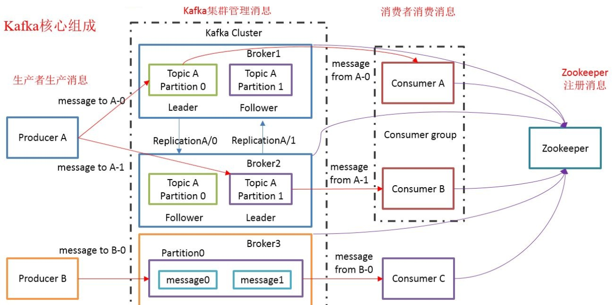

# Kafka

**Kafka是一个分布式的消息系统，消息队列MQ，保存消息的队列，是消息在传输过程中的容器。提供统一的、高吞吐量、低延迟的平台来处理实时数据流。**

## 消息系统

### 消息队列

- 消息Message：网络中的两台计算机或者两个通讯设备之间传递的数据，如：文本、音频、视频等。
- 队列Queue：一种特殊的线性表，特殊之处在于它只允许在首部删除元素（队首），在尾部添加元素（队尾）。
- 消息队列MQ：保存消息的队列，是消息在传输过程中的容器。主要提供生产和消费接口供外部调用，进行数据的存储和获取

### MQ分类

主要分为两类：点对点（Peer­to­Peer）、发布/订阅（Publish/Subscribe）

**共同点**：消息生产者(Producer)生产消息发送到队列中，然后消息消费者(Consumer)从队列中读取并消费消息

**不同点**：

- 点对点
  组成：消息队列(Queue)、发送者(Sender)、接收者(Receiver)
  一个生产者生产的消息只能有一个消费者，消息一旦被消费，消息就不在消息队列中了，如：打电话
  即发送到消息队列的消息能且只能被一个接收者接收
- 发布/订阅
  组成：消息队列(Queue)、发布者(Publisher)、订阅者(Subscriber)、主题(Topic)
  每个消息可以有多个消费者，彼此互不影响，如：我发布一个微博，关注我的人都能看到
  即发布到消息队列的消息能被多个接收者（订阅者）接收

### 常见消息系统

- ActiveMQ：历史悠久，实现了JMS（Java Message Service）规范，支持性较好，性能相对不高
- RabbitMQ：可靠性高、安全
- Kafka：分布式、高性能、跨语言
- RocketMQ：阿里开源的消息中间件，纯Java实现

## 概念

Kafka是一个分布式的发布/订阅消息系统，主要用于处理活跃的数据，如登录、浏览、点击、分享、喜欢等用户行为产生的数据。

特点：

- 高吞吐量
  可以满足每秒百万级别消息的生产和消费。
- 持久性
  有一套完善的消息存储机制，确保数据的高效安全的持久化。
- 分布式
  基于分布式的扩展和容错机制；
  Kafka的数据会复制到多台服务器上，当某一台发生故障失效时，生产者和消费者转而使用其它的机器。

### 初识




- Broker：kafka集群中包含多个kafka服务节点，每一个kafka服务节点就称为一个broker，Broker 负责接收和处理客户端发送过来的请求，以及对消息进行持久化，虽然多个 Broker 进程能够运行在同一台机器上，但更常见的做法是将 不同的 Broker 分散运行在不同的机器上。

- Topic：主题，发布订阅的对象，可以为每 个业务、每个应用甚至是每类数据都创建专属的主题

- Partition：分区，每个主题 Topic 划分成多个分区 Partition，每个分区是一组有序的消息日志，生产者生产的每条消息只会被发送到主题的一个分区中，生产者向分区写入消息，**每条消息在分区中的位置信息叫位移**

- Replication：副本，每个分区可以有多个副本，分布在不同的Broker上；定义了两类副本：领导者副本和追随者副本，每个分区只能有 1 个领 导者副本和 N-1 个追随者副本；

  会选出一个副本作为Leader，Leader对外提供服务，与客户端程序进行交互，所有的读写请求都会通过Leader完成；所有Follower只负责备份数据，不能与外界进行交互，Follower会自动的从Leader中复制数据，当Leader宕机后， 会从Follower中选出一个新的Leader继续提供服务，实现故障自动转移

- Message：消息，是通信的基本单位，每个消息都属于一个Partition

- Producer：消息的生产者，向主题发布消息的客户端应用程序，生产者程序通常持续不断地向一个或多个主题发送消息

- Consumer：消息的消费者，订阅主题消息的客户端应用程序，消费者也能够同时订阅多个主题的消息。

- Consumer Group：多个消费者实例共同组成一个组，组内的所有消费者协调在一起来消费订阅主题的所有分区。

- Coordinator：协调者，为 Consumer Group 服务，负责为 Group 执行 Rebalance 以及提供位移管理和组成员管理等。

- Zookeeper：协调kafka的正常运行，Kafka将元数据信息保存在Zookeeper中，但发送给Topic本身的消息数据并不存储在ZK中，而在存储在磁盘文件中


### 扩展

#### Coordinator

所有Broker在启动时，都会创建和开启相应的Coordinator组件，**所有Broker都有各自的Coordinator组件**

Consumer 端应用程序在提交位移时，其实是向 Coordinator 所在的 Broker 提交位移，同样地，当 Consumer 应用启动时，也是向 Coordinator 所在的 Broker 发送各种请求，然后由 Coordinator 负责执行消费者组的注册、成员管理记录等元数据管理操作。

Consumer Group 如何确定为它服务的 Coordinator 在哪台 Broker 上呢？

通过Kafka内部主题 __consumer_offsets 。

目前，Kafka 为某个 Consumer Group 确定 Coordinator 所在的 Broker 的算法有2个步骤。

- 第1步：确定由 __consumer_offsets 主题的哪个分区来保存该 Group 内实例的位移数据：`partitionId=Math.abs(groupId.hashCode() % offsetsTopicPartitionCount)`。
- 第2步：找出该分区 Leader 副本所在的 Broker ，该 Broker 即为对应的 Coordinator 。

> 首先，Kafka会计算该Group的 group.id 参数的哈希值。比如你有个Group的 group.id 设置成了 test-group ，那么它的 hashCode 值就应该是627841412。
>
> 其次，Kafka会计算 `__consumer_offsets` 的分区数，通常是50个分区，之后将刚才那个哈希值对分区数进行取模加求绝对值计算，即`abs(627841412 % 50) = 12`。此时，我们就知道了 `__consumer_offsets` 主题的分区12负责保存这个 Group 的数据。
>
> 有了分区号，我们只需要找出 __consumer_offsets 主题分区12的 Leader 副本在哪个 Broker上 就可以了，这个 Broker ，就是我们要找的 Coordinator。
>

反过来说，一个消费者组内所有消费者的位移数据都保存到 __consumer_offsets 主题的一个分区中，可以通过这个分区的领导者副本确认 Coordinator 所在的 Broker 。

#### 位移

- 消费者位移：Consumer Offset，消费者消费进度，每个消费者都有自己的消费者位移。

- 重平衡：Rebalance，消费者组内某个消费者实例挂掉后，其他消费者实例自动重新分配订阅主题分区的过程，Rebalance 是 Kafka 消费者端实现高可用的重要手段。

- AR（Assigned Replicas）：分区中的所有副本统称为AR。

  所有消息会先发送到 leader 副本，然后 follower 副本才能从 leader 中拉取消息进行同步。但是在同步期间，follower 对于 leader 而言会有一定程度的滞后，这个时候 follower 和 leader 并非完全同步状态

- OSR（Out Sync Replicas）：follower 副本与 leader 副本没有完全同步或滞后的副本集合

- ISR（In Sync Replicas）：AR 中的一个子集，ISR 中的副本都是与 leader 保持完全同步的副本，如果某个在 ISR 中的 follower 副本落后于 leader 副本太多，则会被从 ISR 中移除，否则如果完全同步，会从 OSR 中移至 ISR 集合。

  在默认情况下，当leader副本发生故障时，只有在ISR集合中的follower副本才有资格被选举为新leader，而OSR中的副本没有机会（可以通过`unclean.leader.election.enable`进行配置）

- HW（High Watermark）：高水位，它标识了一个特定的消息偏移量（offset），消费者只能拉取到这个水位 offset 之前的消息

  下图表示一个日志文件，这个日志文件中只有9条消息，第一条消息的offset（LogStartOffset）为0，最有一条消息的offset为8，offset为9的消息使用虚线表示的，代表下一条待写入的消息。

  日志文件的 HW 为6，表示消费者只能拉取offset在 0 到 5 之间的消息，offset为6的消息对消费者而言是不可见的。

  

- LEO（Log End Offset）：标识当前日志文件中下一条待写入的消息的offset

  上图中offset为9的位置即为当前日志文件的 LEO，LEO 的大小相当于当前日志分区中最后一条消息的offset值加1

  分区 ISR 集合中的每个副本都会维护自身的 LEO ，而 ISR 集合中最小的 LEO 即为分区的 HW，对消费者而言只能消费 HW 之前的消息

同步副本最小的 LEO 即为高水位

## 生产者

### 生产者分区

Kafka的消息组织方式实际上是三级结构：主题 - 分区 - 消息。

不同的分区能够被放置到不同节点的机器上，而数据的读写操作也都是针对分区这个粒度而进行的，这样每个节点的机器都能独立地执行各自分区的读写请求处理，并且，我们还可以通过添加新的节点机器来增加整体系统的吞吐量。其实分区的作用就是提供负载均衡的能力，或者说对数据进行分区的主要原因，就是为了实现系统的高伸缩性（Scalability）。

### 分区策略

**分区策略是决定生产者将消息发送到哪个分区的算法。**

Kafka为我们提供了默认的分区策略，同时它也支持你自定义分区策略。

#### 自定义分区策略

编写一个具体的类实现`org.apache.kafka.clients.producer.Partitioner`接口。

这个接口定义了两个方法：partition()和close()，通常只需要实现最重要的partition方法。

```java
int partition(String topic, Object key, byte[] keyBytes, Object value, byte[] valueBytes, Cluster cluster);
```

topic、key、keyBytes、value和valueBytes都属于消息数据，cluster则是集群信息（比如当前Kafka集群共有多少主题、多少Broker等）。利用这些信息对消息进行分区，计算出它要被发送到哪个分区中。

还需要显式地配置生产者端的参数 partitioner.class 为你自己实现类的Full Qualified Name，那么生产者程序就会按照你的代码逻辑对消息进行分区。

#### 轮询策略

也称Round-robin策略，即顺序分配。轮询策略是Kafka Java生产者API默认提供的分区策略。

比如一个主题下有3个分区，那么第一条消息被发送到分区0，第二条被发送到分区1，第三条被发送到分区2，以此类推。当生产第4条消息时又会重新开始，即将其分配到分区0

**「轮询策略有非常优秀的负载均衡表现，它总是能保证消息最大限度地被平均分配到所有分区上，故默认情况下它是最合理的分区策略，也是我们最常用的分区策略之一。」**

#### 随机策略

也称Randomness策略。所谓随机就是我们随意地将消息放置到任意一个分区上。

```java
// 实现随机策略的partition方法，先计算出该主题总的分区数，然后随机地返回一个小于它的正整数。
List partitions = cluster.partitionsForTopic(topic);
return ThreadLocalRandom.current().nextInt(partitions.size());
```

#### 按消息键保序策略

Kafka为每条消息定义消息键，简称为Key，它可以是一个有着明确业务含义的字符串，比如客户代码、部门编号或是业务ID等；也可以用来表征消息元数据。

一旦消息被定义了Key，那么你就可以保证同一个Key的所有消息都进入到相同的分区里面，由于每个分区下的消息处理都是有顺序的，故这个策略被称为按消息键保序策略

```java
List partitions = cluster.partitionsForTopic(topic);
return Math.abs(key.hashCode()) % partitions.size();
```

前面提到的Kafka默认分区策略实际上同时实现了两种策略：如果指定了Key，那么默认实现按消息键保序策略；如果没有指定Key，则使用轮询策略。

#### 其他分区策略

其实还有一种比较常见的，即所谓的基于地理位置的分区策略。

当然这种策略一般只针对那些大规模的Kafka集群，特别是跨城市、跨国家甚至是跨大洲的集群。

```java
// 根据 Broker 所在的 IP 地址实现定制化的分区策略，我们可以从所有分区中找出那些 Leader 副本在南方的所有分区，然后随机挑选一个进行消息发送
List partitions = cluster.partitionsForTopic(topic);
return partitions.stream().filter(p -> isSouth(p.leader().host())).map(PartitionInfo::partition).findAny().get();
```

### 压缩算法

#### 消息

Kafka的消息层次都分为两层：消息集合以及消息。Kafka通常不会直接操作具体的一条条消息，它总是在消息集合这个层面上进行写入操作。

一个消息集合中包含若干条日志项，而日志项才是真正封装消息的地方。Kafka底层的消息日志由一系列消息集合日志项组成。

#### V2版本

目前Kafka共有两大类消息格式，社区分别称之为V1版本和V2版本。V2版本是Kafka 0.11.0.0中正式引入的。V2版本主要是针对V1版本的一些弊端做了修正，比如：

- 把消息的公共部分抽取出来放到外层**消息集合**里面，这样就不用每条消息都保存这些信息了。

  原来在V1版本中，每条消息都需要执行CRC校验，但有些情况下消息的CRC值是会发生变化的。比如在Broker端可能会对消息时间戳字段进行更新，那么重新计算之后的CRC值也会相应更新；再比如Broker端在执行消息格式转换时（主要是为了兼容老版本客户端程序），也会带来CRC值的变化。鉴于这些情况，再对每条消息都执行CRC校验就有点没必要了，不仅浪费空间还耽误CPU时间，因此在V2版本中，消息的CRC校验工作就被移到了消息集合这一层。

- 保存压缩消息的方法

  V1版本中保存压缩消息的方法是把多条消息进行压缩然后保存到外层消息的消息体字段中；而V2版本的做法是对整个消息集合进行压缩，显然后者应该比前者有更好的压缩效果。

#### 压缩

在Kafka中，压缩可能发生在两个地方：生产者端和Broker端。

**何时启用压缩是比较合适的时机呢？**启用压缩的一个条件就是Producer程序运行机器上的CPU资源要很充足。除了CPU资源充足这一条件，如果你的环境中带宽资源有限，那么建议你开启压缩。

##### 生产者端

```java
// 如何构建一个开启GZIP的Producer对象
Properties props = new Properties(); 
props.put("bootstrap.servers", "localhost:9092"); 
props.put("acks", "all"); 
props.put("key.serializer", "org.apache.kafka.common.serialization.StringSerializer"); props.put("value.serializer", "org.apache.kafka.common.serialization.StringSerializer"); // 开启GZIP压缩 
props.put("compression.type", "gzip"); 
Producer producer = new KafkaProducer<>(props);
// props.put(“compression.type”, “gzip”) 表明该Producer的压缩算法使用的是GZIP。生产者程序中配置compression.type参数即表示启用指定类型的压缩算法。
```

这样Producer启动后生产的每个消息集合都是经GZIP压缩过的，故而能很好地节省网络传输带宽以及Kafka Broker端的磁盘占用。

##### Broker端

有两种例外情况就可能让Broker重新压缩消息：

- 情况一：Broker端指定了和Producer端不同的压缩算法。

  一旦你在Broker端设置了不同的`compression.type`值，就一定要小心了，因为可能会发生预料之外的压缩/解压缩操作，通常表现为Broker端CPU使用率飙升。

- 情况二：Broker端发生了消息格式转换。

  所谓的消息格式转换主要是为了兼容老版本的消费者程序。

  在一个生产环境中，Kafka集群中同时保存多种版本的消息格式非常常见。为了兼容老版本的格式，Broker端会对新版本消息执行向老版本格式的转换。这个过程中会涉及消息的解压缩和重新压缩。一般情况下这种消息格式转换对性能是有很大影响的，除了这里的压缩之外，它还让Kafka丧失了Zero Copy特性。

#### 解压缩

解压缩发生在消费者程序中，也就是说Producer发送压缩消息到Broker后，Broker照单全收并原样保存起来。当Consumer程序请求这部分消息时，Broker依然原样发送出去，当消息到达Consumer端后，由Consumer自行解压缩还原成之前的消息。

**基本过程：Producer端压缩、Broker端保持、Consumer端解压缩。**

注意：除了在Consumer端解压缩，Broker端也会进行解压缩。每个压缩过的消息集合在Broker端写入时都要发生解压缩操作，目的就是为了对消息执行各种验证。我们必须承认这种解压缩对Broker端性能是有一定影响的，特别是对CPU的使用率而言。

#### 压缩算法

对于Kafka而言，在吞吐量方面：LZ4 > Snappy > zstd和GZIP；而在压缩比方面，zstd > LZ4 > GZIP > Snappy。

具体到物理资源，使用Snappy算法占用的网络带宽最多，zstd最少；

在CPU使用率方面，各个算法表现得差不多，只是在压缩时Snappy算法使用的CPU较多一些，而在解压缩时GZIP算法则可能使用更多的CPU。

## 消费者组

### 概念

- 消费者组内有多个消费者或消费者实例，它们共享一个公共的ID，这个ID被称为Group ID。组内的所有消费者协调在一起来消费订阅主题的所有分区。

- 主题中的每个分区只能由同一个消费者组内的一个Consumer实例来消费，组内其他消费者实例不能消费该分区

  一个主题可以配置几个分区，生产者发送的消息分发到不同的分区中，消费者接收数据的时候是按照消费者组来接收的，Kafka确保每个分区的消息只能被同一个消费者组中的一个消费者消费，如果想要重复消费，那么需要其他的消费者组来消费，同时一个消费者可以消费多个分区。

- Kafka使用Consumer Group机制，同时实现了传统消息引擎系统的两大模型：
  - 如果所有实例都属于同一个Group，那么它实现的就是消息队列模型；
  - 如果所有实例分别属于不同的Group，那么它实现的就是发布/订阅模型。

**Consumer Group是Kafka提供的可扩展且具有容错性的消费者机制**。

### 特性

- Consumer Group下可以有一个或多个Consumer实例，这里的实例可以是一个单独的进程，也可以是同一进程下的线程。
- Group ID是一个字符串，在一个Kafka集群中，它标识唯一的一个Consumer Group。
- Consumer Group下所有实例订阅的主题的单个分区，只能分配给组内的某个Consumer实例消费，这个分区当然也可以被其他的Group消费。

当Consumer Group订阅了多个主题后，组内的每个实例不要求一定要订阅主题的所有分区，它只会消费部分分区中的消息。

Consumer Group之间彼此独立，互不影响，它们能够订阅相同的一组主题而互不干涉。

### 消费者实例

**实例个数**

一个Group下该有多少个Consumer实例呢？

**理想情况下，Consumer实例的数量应该等于该Group订阅主题的分区总数。**

假设一个Consumer Group订阅了3个主题，分别是A、B、C，它们的分区数依次是1、2、3，那么通常情况下，为该Group设置6个Consumer实例是比较理想的情形，因为它能最大限度地实现高伸缩性。

**位移Offset**

老版本的Consumer Group把位移保存在ZooKeeper中。Apache ZooKeeper是一个分布式的协调服务框架，Kafka重度依赖它实现各种各样的协调管理。将位移保存在ZooKeeper外部系统的做法，最显而易见的好处就是减少了Kafka Broker端的状态保存开销。不过，慢慢地发现了一个问题，即ZooKeeper这类元框架其实并不适合进行频繁的写更新，而Consumer Group的位移更新却是一个非常频繁的操作。这种大吞吐量的写操作会极大地拖慢ZooKeeper集群的性能。

于是，在新版本的Consumer Group中，Kafka社区重新设计了Consumer Group的位移管理方式，采用了将位移保存在Kafka内部主题的方法。这个内部主题就是 __consumer_offsets 。

### 消费者策略

**Round**

默认，也叫轮循，说的是对于同一组消费者来说，使用轮训分配的方式，决定消费者消费的分区


**Range**

决定消费方式是以分区总数除以消费者总数来决定，一般如果不能整除，往往是从头开始将剩余的分区分配开


**Sticky**

前面两个当同组内有新的消费者加入或者旧的消费者退出的时候，会从新开始决定消费者消费方式

Sticky，在同组中有新的新的消费者加入或者旧的消费者退出时，不会直接开始新的Range分配，而是保留现有消费者原来的消费策略，将退出的消费者所消费的分区平均分配给现有消费者，新增消费者同理，同其他现存消费者的消费策略中分离

### 重平衡

**（重平衡）Rebalance本质上是一种协议，规定了一个Consumer Group下的所有Consumer如何来分配订阅Topic的每个分区**。

比如某个Group下有20个Consumer实例，它订阅了一个具有100个分区的Topic。正常情况下，Kafka平均会为每个Consumer分配5个分区。这个分配的过程就叫Rebalance。

**Rebalance的触发条件**

- 组成员数发生变更。比如有新的 Consumer 实例加入组或者离开组，或是有 Consumer 实例崩溃被踢出组。
- 订阅主题数发生变更。Consumer Group 可以使用正则表达式的方式订阅主题，比如`consumer.subscribe(Pattern.compile(“t.*c”))`就表明该 Group 订阅所有以字母 t 开头、字母 c 结尾的主题，在 Consumer Group 的运行过程中，你新创建了一个满足这样条件的主题，那么该 Group 就会发生 Rebalance。
- 订阅主题的分区数发生变更。Kafka 当前只能允许增加主题的分区数，当分区数增加时，就会触发订阅该主题的所有 Group 开启 Rebalance。

Rebalance 发生时，Group 下所有的 Consumer 实例都会协调在一起共同参与。

**分配策略**

当前Kafka默认提供了3种分配策略，保证提供最公平的分配策略，即每个Consumer实例都能够得到较为平均的分区数。

比如一个Group内有10个Consumer实例，要消费100个分区，理想的分配策略自然是每个实例平均得到10个分区。这就叫**公平的分配策略**。

举个简单的例子来说明一下Consumer Group发生Rebalance的过程。假设目前某个Consumer Group下有两个Consumer，比如A和B，当第三个成员C加入时，Kafka会触发Rebalance，并根据默认的分配策略重新为A、B和C分配分区，Rebalance之后的分配依然是公平的，即每个Consumer实例都获得了2个分区的消费权。

在Rebalance过程中，所有Consumer实例都会停止消费，等待Rebalance完成，这是Rebalance为人诟病的一个方面。

目前Rebalance的设计是所有Consumer实例共同参与，全部重新分配所有分区。

**Coordinator会在什么情况下认为某个Consumer实例已挂从而要退组呢？**

当 Consumer Group 完成 Rebalance 之后，每个 Consumer 实例都会定期地向 Coordinator 发送**心跳请求**，表明它还存活着。如果某个 Consumer 实例不能及时地发送这些心跳请求，Coordinator 就会认为该 Consumer 已经死了，从而将其从 Group 中移除，然后开启新一轮 Rebalance。

- Consumer 端有个参数，`session.timeout.ms`。该参数的默认值是10秒，即如果 Coordinator 在10秒之内没有收到 Group 下某 Consumer 实例的心跳，它就会认为这个 Consumer 实例已经挂了。

- Consumer 还提供了控制发送心跳请求频率的参数，就是`heartbeat.interval.ms`。这个值设置得越小，Consumer 实例发送心跳请求的频率就越高。频繁地发送心跳请求会额外消耗带宽资源，但好处是能够更加快速地知晓当前是否开启 Rebalance，因为，目前 Coordinator 通知各个 Consumer 实例开启Rebalance 的方法，就是将`REBALANCE_NEEDED`标志封装进心跳请求的响应体中。

- 除了以上两个参数，Consumer 端还有一个参数，用于控制 Consumer 实际消费能力对 Rebalance 的影响，即`max.poll.interval.ms`参数。它限定了 Consumer 端应用程序两次调用 poll 方法的最大时间间隔。它的默认值是5分钟，表示你的 Consumer 程序如果在5分钟之内无法消费完 poll 方法返回的消息，那么 Consumer 会主动发起离开组的请求，Coordinator 也会开启新一轮 Rebalance。

**可避免Rebalance的配置**

- 第一类Rebalance是因为未能及时发送心跳，导致 Consumer 被踢出 Group 而引发的，因此可以设置 session.timeout.ms 和 heartbeat.interval.ms 的值。
  - 设置`session.timeout.ms` = 6s。
  - 设置`heartbeat.interval.ms` = 2s。

  要保证Consumer实例在被判定为dead之前，能够发送至少3轮的心跳请求，即`session.timeout.ms >= 3 * heartbeat.interval.ms`。

  将`session.timeout.ms`设置成6s主要是为了让Coordinator能够更快地定位已经挂掉的Consumer。

- 第二类Rebalance是Consumer消费时间过长导致的

  你要为你的业务处理逻辑留下充足的时间，这样Consumer就不会因为处理这些消息的时间太长而引发Rebalance了。

### ConsumerOffsets

`__consumer_offsets`的主要作用是**保存Kafka消费者的位移信息**。Kafka 将 Consumer 的位移数据作为一条条普通的 Kafka 消息，提交到`__consumer_offsets`中。它要求这个提交过程不仅要实现高持久性，还要支持高频的写操作。`__consumer_offsets`主题是**普通的Kafka主题**。它的消息格式是Kafka自己定义的，用户不能修改，也就是说你不能随意地向这个主题写消息，因为一旦你写入的消息不满足Kafka规定的格式，那么Kafka内部无法成功解析，就会造成Broker的崩溃。

**消息类型**

`__consumer_offsets`有3种消息格式：

- 用于保存 Consumer Group 信息的消息。
- 用于删除 Group 过期位移甚至是删除 Group 的消息。
- 保存了位移值。

第2种格式它有个专属的名字：tombstone 消息，即墓碑消息，也称 delete mark，它的主要特点是它的消息体是 null，即空消息体。

一旦某个 Consumer Group 下的所有 Consumer 实例都停止了，而且它们的位移数据都已被删除时，Kafka 会向`__consumer_offsets`主题的对应分区写入tombstone 消息，表明要彻底删除这个 Group 的信息。

**提交位移**

当 Kafka 集群中的**第一个 Consumer 程序启动时，Kafka 会自动创建位移主题**。默认该主题的分区数是50，副本数是3。

目前 Kafka Consumer 提交位移的方式有两种：自动提交位移和手动提交位移，详情见下个目录。

如果你选择的是自动提交位移，那么就可能存在一个问题：只要 Consumer 一直启动着，它就会无限期地向位移主题写入消息。假设Consumer当前消费到了某个主题的最新一条消息，位移是100，之后该主题没有任何新消息产生，故Consumer无消息可消费了，所以位移永远保持在100。由于是自动提交位移，位移主题中会不停地写入位移=100的消息。显然Kafka只需要保留这类消息中的最新一条就可以了，之前的消息都是可以删除的。

这就要求Kafka必须要有针对位移主题消息特点的消息删除策略，否则这种消息会越来越多，最终撑爆整个磁盘。

**Compact策略**

Kafka使用 Compact 策略来删除`__consumer_offsets`主题中的过期消息，避免该主题无限期膨胀。Compact的过程就是扫描日志的所有消息，剔除那些过期的消息，然后把剩下的消息整理在一起。

比如对于同一个Key的两条消息M1和M2，如果M1的发送时间早于M2，那么M1就是过期消息。

Compact过程如下图，图中位移为0、2和3的消息的Key都是K1，Compact之后，分区只需要保存位移为3的消息，因为它是最新发送的。


**Kafka提供了专门的后台线程定期地巡检待Compact的主题，看看是否存在满足条件的可删除数据**。

这个后台线程叫Log Cleaner。很多实际生产环境中都出现过位移主题无限膨胀占用过多磁盘空间的问题，如果你的环境中也有这个问题，建议你去检查一下Log Cleaner线程的状态，通常都是这个线程挂掉了导致的。

### 位移提交

假设一个分区中有10条消息，位移分别是0到9。某个Consumer应用已消费了5条消息，这就说明该Consumer消费了位移为0到4的5条消息，此时Consumer的位移是5，指向了下一条消息的位移。

因为Consumer能够同时消费多个分区的数据，所以位移的提交实际上是在分区粒度上进行的，即**Consumer需要为分配给它的每个分区提交各自的位移数据**。

**位移提交分为自动提交和手动提交；从Consumer端的角度来说，位移提交分为同步提交和异步提交**。

#### 自动提交

Consumer端参数`enable.auto.commit`，设置为 true 可以开启自动提交位移，默认值 true，即 Java Consumer 默认就是自动提交位移的。

如果启用了自动提交，Consumer 端参数：`auto.commit.interval.ms`，它的默认值是5秒，表明 Kafka 每5秒会为你自动提交一次位移。

```java
Properties props = new Properties();
props.put("bootstrap.servers", "localhost:9092");
props.put("group.id", "test");
props.put("enable.auto.commit", "true");
props.put("auto.commit.interval.ms", "2000");
props.put("key.deserializer", "org.apache.kafka.common.serialization.StringDeserializer");
props.put("value.deserializer", "org.apache.kafka.common.serialization.StringDeserializer");
KafkaConsumer consumer = new KafkaConsumer<>(props);
consumer.subscribe(Arrays.asList("foo", "bar"));
while (true) {
    ConsumerRecords records = consumer.poll(100);
    for (ConsumerRecord record : records)
        System.out.printf("offset = %d, key = %s, value = %s%n", record.offset(), record.key(), record.value());
}
```

自动提交 Kafka 会保证在开始调用 poll 方法时，提交上次 poll 返回的所有消息。从顺序上来说，poll 方法的逻辑是先提交上一批消息的位移，再处理下一批消息，因此它能保证不出现消费丢失的情况。

但自动提交位移的一个问题在于，**「它可能会出现重复消费」**。

#### 手动提交

开启手动提交位移的方法就是设置`enable.auto.commit为false`。还需要调用相应的API手动提交位移。

**同步操作**

**KafkaConsumer#commitSync()**

该方法会提交`KafkaConsumer#poll()`返回的最新位移。该方法会一直等待，直到位移被成功提交才会返回，如果提交过程中出现异常，该方法会将异常信息抛出。调用commitSync()时，Consumer程序会处于阻塞状态，直到远端的Broker返回提交结果，这个状态才会结束。

```java
while (true) {
    ConsumerRecords records = consumer.poll(Duration.ofSeconds(1));
    process(records); // 处理消息
    try {
        consumer.commitSync();
    } catch (CommitFailedException e) {
        handle(e); // 处理提交失败异常
    }
}
```

**异步操作**

**KafkaConsumer#commitAsync()**。

调用commitAsync()之后，它会立即返回，不会阻塞，Kafka还提供了回调函数（callback），供你实现提交之后的逻辑，比如记录日志或处理异常等。

```java
while (true) {
    ConsumerRecords records = consumer.poll(Duration.ofSeconds(1));
    process(records); // 处理消息
    consumer.commitAsync((offsets, exception) -> {
        if (exception != null)
            handle(exception);
    });
}
```

commitAsync的问题在于，出现问题时它不会自动重试。

**组合使用**

显然，如果是手动提交，我们需要将commitSync和commitAsync组合使用才能到达最理想的效果，原因有两个：

1. 我们可以利用commitSync的自动重试来规避那些瞬时错误，比如网络的瞬时抖动，Broker端GC等，因为这些问题都是短暂的，自动重试通常都会成功。
2. 我们不希望程序总处于阻塞状态，影响TPS。

```java
// 将两个API方法结合使用进行手动提交
try {
    while(true) {
        ConsumerRecords records = consumer.poll(Duration.ofSeconds(1));
        process(records); // 处理消息
        commitAysnc(); // 使用异步提交规避阻塞
    }
} catch(Exception e) {
    handle(e); // 处理异常
} finally {
    try {
        consumer.commitSync(); // 最后一次提交使用同步阻塞式提交
    } finally {
        consumer.close();
    }
}
```

#### 阶段提交

这样一个场景：你的poll方法返回的不是500条消息，而是5000条。那么，你肯定不想把这5000条消息都处理完之后再提交位移，因为一旦中间出现差错，之前处理的全部都要重来一遍。比如前面这个5000条消息的例子，你可能希望**每处理完100条消息就提交一次位移**，这样能够避免大批量的消息重新消费。

Kafka Consumer API为手动提交提供了这样的方法：commitSync(Map)和commitAsync(Map)。它们的参数是一个Map对象，键就是TopicPartition，即消费的分区，而值是一个OffsetAndMetadata对象，保存的主要是位移数据。

```java
// 以commitAsync为例，commitSync的调用方法和它是一样的
private Map offsets = new HashMap<>();
int count = 0;
……
while (true) {
    ConsumerRecords records = consumer.poll(Duration.ofSeconds(1));
    for (ConsumerRecord record: records) {
        process(record);  // 处理消息
        offsets.put(new TopicPartition(record.topic(), record.partition()), new OffsetAndMetadata(record.offset() + 1));
        if(count % 100 == 0) {
            consumer.commitAsync(offsets, null); // 回调处理逻辑是null
        }
        count++;
	}
}
```

先创建一个Map对象，用于保存Consumer消费处理过程中要提交的分区位移，之后开始逐条处理消息，并构造要提交的位移值。最后是做位移的提交。设置了一个计数器，每累计100条消息就统一提交一次位移。

与调用无参的commitAsync不同，这里调用了带Map对象参数的commitAsync进行细粒度的位移提交。这样，这段代码就能够实现每处理100条消息就提交一次位移，不用再受poll方法返回的消息总数的限制了。


## 安装

**步骤：**

1. 解压kafka_2.12­2.3.0.tgz

   ```sh
   cd ~/software
   tar -zxf kafka_2.12-2.3.0.tgz
   ```

2. 配置

   ```sh
   # 创建存放数据的文件夹
   cd kafka_2.12-2.3.0
   mkdir data
   # 修改kafka配置文件
   cd config
   vi server.properties
   	#listeners=PLAINTEXT://:9092 # kafka默认监听的端口号为9092
   	log.dirs=../data # 指定数据的存放目录
   	zookeeper.connect=localhost:2181 # zookeeper的连接信息
   ```

3. 启动zookeeper

   - 使用kafka内置zk

     ```sh
     cd ~/software/kafka_2.12-2.3.0/bin/
     ./zookeeper-server-start.sh ../config/zookeeper.properties
     ```

   - 使用外部zk(推荐)

     ```sh
     cd ~/software/zookeeper-3.4.13/bin/
     ./zkServer.sh start
     ```

4. 启动kafka

   ```sh
   ./kafka-server-start.sh ../config/server.properties & # &表示后台运行，也可使用-daemon选项
   jps # 查看进程，jps是jdk提供的用来查看所有java进程的命令
   ```

5. 创建Topic（主题）

   ```sh
   ./kafka-topics.sh \
   	--create \
   	--zookeeper localhost:2181 \
   	--replication-factor 1 \
   	--partitions 3 \
   	--topic hello
   ```

   ```sh
   # 查看Topic列表
   ./kafka-topics.sh --list --zookeeper localhost:2181 # __consumer_offsets是kafka的内部Topic
   # 查看某一个具体的Topic
   ./kafka-topics.sh --describe --zookeeper localhost:2181 --topic hello
   # 修改Topic：只能增加partition个数，不能减少，且不能修改replication-factor
   ./kafka-topics.sh --alter --zookeeper localhost:2181 --topic hello --partitions 5
   # 删除Topic (需要启用topic删除功能)
   ./kafka-topics.sh --delete --zookeeper localhost:2181 --topic hello
   ```

6. 启动kafka的Producer（生产者 ）

   ```sh
   ./kafka-console-producer.sh --broker-list localhost:9092 --topic hello
   ```

7. 启动kafka的Consumer（消费者）

   ```sh
   ./kafka-console-consumer.sh --bootstrap-server localhost:9092 --topic hello --from-beginning
   ```

8. 验证

   查看data数据存放目录：Topic的每个Partition对应一个目录，数据存储在目录下的00000000000000000000.log文件中

   查看zookeeper中的内容：get /brokers/topics/hello/partitions/0/state

### 配置文件

```properties
############################# Server Basics #############################
# broker的id，值为整数，且必须唯一，在一个集群中不能重复
broker.id=0

############################# Socket Server Settings #############################
# kafka默认监听的端口为9092
#listeners=PLAINTEXT://:9092
# 处理网络请求的线程数量，默认为3个
num.network.threads=3
# 执行磁盘IO操作的线程数量，默认为8个
num.io.threads=8
# socket服务发送数据的缓冲区大小，默认100KB
socket.send.buffer.bytes=102400
# socket服务接受数据的缓冲区大小，默认100KB
socket.receive.buffer.bytes=102400
# socket服务所能接受的一个请求的最大大小，默认为100M
socket.request.max.bytes=104857600

############################# Log Basics #############################
# kafka存储消息数据的目录
log.dirs=../data
# 每个topic默认的partition数量
num.partitions=1
# 在启动时恢复数据和关闭时刷新数据时每个数据目录的线程数量
num.recovery.threads.per.data.dir=1

############################# Log Flush Policy #############################
# 消息刷新到磁盘中的消息条数阈值
#log.flush.interval.messages=10000
# 消息刷新到磁盘中的最大时间间隔
#log.flush.interval.ms=1000

############################# Log Retention Policy #############################
# 日志保留小时数，超时会自动删除，默认为7天
log.retention.hours=168
# 日志保留大小，超出大小会自动删除，默认为1G
#log.retention.bytes=1073741824
# 日志分片策略，单个日志文件的大小最大为1G，超出后则创建一个新的日志文件
log.segment.bytes=1073741824
# 每隔多长时间检测数据是否达到删除条件
log.retention.check.interval.ms=300000

############################# Zookeeper #############################
# Zookeeper连接信息，如果是zookeeper集群，则以逗号隔开
zookeeper.connect=localhost:2181
# 连接zookeeper的超时时间
zookeeper.connection.timeout.ms=6000
# 是否可以删除topic，默认为false
delete.topic.enable=true
```

## 集群搭建

### 搭建zk集群

可以在一台主机上启动多个zk服务，配置使用不同的端口即可

**步骤：**

1. 拷贝多个zk目录
    zookeeper1、zookeeper2、zookeeper3

2. 分别配置每个zk

   ```sh
   vi zookeeper1/conf/zoo.cfg
       clientPort=2181
       server.1=192.168.2.153:6661:7771
       server.2=192.168.2.153:6662:7772
       server.3=192.168.2.153:6663:7773
   echo 1 > zookeeper1/data/myid
   
   vi zookeeper2/conf/zoo.cfg
       clientPort=2182
       server.1=192.168.2.153:6661:7771
       server.2=192.168.2.153:6662:7772
       server.3=192.168.2.153:6663:7773
   echo 2 > zookeeper2/data/myid
   
   vi zookeeper3/conf/zoo.cfg
       clientPort=2183
       server.1=192.168.2.153:6661:7771
       server.2=192.168.2.153:6662:7772
       server.3=192.168.2.153:6663:7773
   echo 3 > zookeeper3/data/myid
   ```

3. 启动zk集群

### 搭建Kafka集群

**步骤：**

1. 拷贝多个kafka目录
    kafka1、kafka2、kafka3

2. 分别配置每个kafka

   ```sh
   vi kafka1/config/server.properties
       broker.id=1
       listeners=PLAINTEXT://192.168.2.153:9091
       zookeeper.connect=192.168.2.153:2181,192.168.2.153:2182,192.168.2.153:2183
   
   vi kafka2/config/server.properties
       broker.id=2
       listeners=PLAINTEXT://192.168.2.153:9092
       zookeeper.connect=192.168.2.153:2181,192.168.2.153:2182,192.168.2.153:2183
   
   vi kafka3/config/server.properties
       broker.id=3
       listeners=PLAINTEXT://192.168.2.153:9093
       zookeeper.connect=192.168.2.153:2181,192.168.2.153:2182,192.168.2.153:2183
   ```

3. 启动kafka集群

4. 创建Topic

   ```sh
   ./kafka-topics.sh \
       --create \
       --zookeeper 192.168.7.40:2181,192.168.7.40:2182,192.168.7.40:2183 \
       --replication-factor 3 \
       --partitions 5 \
       --topic aaa
   ```

5. 生成数据/发布消息

   ```sh
   ./kafka-console-producer.sh --broker-list
   192.168.7.40:9091,192.168.7.40:9092,192.168.7.40:9093 --topic aaa
   ```

6. 消费数据/订阅消息

   ```sh
   ./kafka-console-consumer.sh --bootstrap-server
   192.168.7.40:9091,192.168.7.40:9092,192.168.7.40:9093 --topic aaa --from-beginning
   ```

## SpringBoot集成Kafka

SpringBoot提供了一个名为 spring­kafka 的starter，用于在Spring项目里快速集成kafka

**步骤：**

1. 创建SpringBoot项目
    勾选Spring Web Starter和Spring for Apache Kafka

2. 配置kafka，编辑application.yml文件

   ```yml
   spring:
     kafka:
       # kafka服务器地址(可以多个)
       bootstrap-servers: 192.168.7.40:9091,192.168.7.40:9092,192.168.7.40:9093
       producer:
   	  # 每次批量发送消息的数量
         batch-size: 65536
         buffer-memory: 524288
         # key/value的序列化
         key-serializer: org.apache.kafka.common.serialization.StringSerializer
         value-serializer: org.apache.kafka.common.serialization.StringSerializer
       consumer:
         # 指定一个默认的组名
         group-id: test
         # key/value的反序列化
         key-deserializer:
           org.apache.kafka.common.serialization.StringDeserializer
         value-deserializer:
           org.apache.kafka.common.serialization.StringDeserializer
   ```

3. 创建生产者

   ```java
   @RestController
   public class KafkaProducer {
       
       @Autowired
       private KafkaTemplate template;
           
       /**
       * 发送消息到Kafka
       * @param topic 主题
       * @param message 消息
       */
       @RequestMapping("/sendMsg")
       public String sendMsg(String topic, String message) {
           template.send(topic, message);
           return "success";
       }
   }
   ```

4. 创建消费者

   ```java
   @Component
   public class KafkaConsumer{
       /**
       * 订阅指定主题的消息
       * @param record 消息记录
       */
       @KafkaListener(topics = {"hello","world"})
       
       public void listen(ConsumerRecord record) {
           // System.out.println(record);
           System.out.println(record.topic()+","+record.value());
       }
   }
   ```

5. 测试
访问http://localhost:8080/sendMsg?topic=hello&message=aaaa


## 临时笔记

实时数据流

分区是消息日志

每条消息在分区中的位置信息叫位移

多个消费者实例可以属于同一个 `Group`，也可以属于不 同的 `Group`，主题中的每个分区都只会被group内的一个消费者实例消费

消费者Group确定Coordinator所在的Broker：groupId哈希确认主题的哪个分区来保存该Group数据，找出该分区Leader副本所在的Broker


