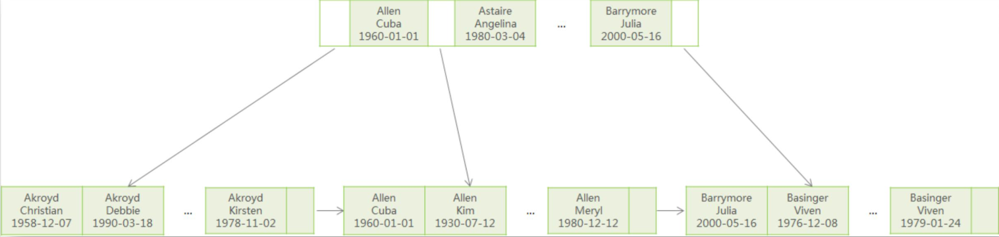

# MySQL

参考：

[MySQL教程：MySQL数据库学习宝典（从入门到精通）](http://c.biancheng.net/mysql/)

[MySQL数据库面试题（2020最新版）](https://thinkwon.blog.csdn.net/article/details/104778621)

## 三大范式

一范式就是属性不可分割

二范式就是要有主键,其他字段都依赖于主键

三范式就是要消除传递依赖,消除冗余,就是各种信息只在一个地方存储,不出现在多张表中

## 数据类型

### char

- char表示定长字符串，长度是固定的；

- 如果插入数据的长度小于char的固定长度时，则用空格填充；

- 因为长度固定，所以存取速度要比varchar快很多，甚至能快50%，但正因为其长度固定，所以会占据多余的空间，是空间换时间的做法；

- 对于char来说，最多能存放的字符个数为255，和编码无关；
- 空格表示占位不算一个字符；

**char(10)：** 10位固定字符串，不足补空格，最多10个字符

密码散列，盐，用户身份证号等固定长度的字符串应该使用char而不是varchar来存储，这样可以节省空间且提高检索效率。

### varchar

- varchar表示可变长字符串，长度是可变的；
- 插入的数据是多长，就按照多长来存储；
- varchar在存取方面与char相反，它存取慢，因为长度不固定，但正因如此，不占据多余的空间，是时间换空间的做法；
- 对于varchar来说，最多能存放的字符个数为65532；
- 空格也按一个字符存储；

**varchar(50)中50的涵义：**最多存放50个字符，varchar(50)和(200)存储hello所占空间一样，但后者在排序时会消耗更多内存，因为order by col采用fixed_length计算col长度(memory引擎也一样)。在早期 MySQL 版本中， 50 代表字节数，现在代表字符数。

### int

**int(20)中20的涵义:**  是指显示字符的长度，不是存储数据的大小。20表示最大显示宽度为20，但仍占4字节存储，存储范围不变；不影响内部存储，只是影响带 zerofill 定义的 int 时，前面补多少个 0，易于报表展示

### FLOAT和DOUBLE

- FLOAT类型数据可以存储至多8位十进制数，并在内存中占4字节。
- DOUBLE类型数据可以存储至多18位十进制数，并在内存中占8字节。

## 语句类型

SQL（Structure Query Language）结构化查询语言

- DQL（data query language）数据查询语言 select操作
- DML（data manipulation language）数据操作语言，主要是数据库增删改三种操作
- DDL（data defination language）数据库定义语言，主要是建表、删除表、修改表字段等操作
- DCL（data control language）数据库控制语言，如commit，revoke之类的

### 数据定义语言DDL

```java
create table score(
    id int not null auto_increment primary key, 
    name varchar(30) not null comment '学生姓名', 
    course varchar(50) comment '课程名称', 
    grade int comment '成绩' 
)engine=InnoDB default charset=utf8;
```

### 数据操作语言DML

```java
insert into score(name, course, grade) values('张三', '语文', 89);
```

#### drop、delete与truncate

三者都表示删除，但是三者有一些差别：

|          | Delete                                   | Truncate                       | Drop                                                 |
| -------- | ---------------------------------------- | ------------------------------ | ---------------------------------------------------- |
| 类型     | 属于DML                                  | 属于DDL                        | 属于DDL                                              |
| 回滚     | 可回滚                                   | 不可回滚                       | 不可回滚                                             |
| 删除内容 | 表结构还在，删除表的全部或者一部分数据行 | 表结构还在，删除表中的所有数据 | 从数据库中删除表，所有的数据行，索引和权限也会被删除 |
| 删除速度 | 删除速度慢，需要逐行删除                 | 删除速度快                     | 删除速度最快                                         |


因此，在不再需要一张表的时候，用drop；在想删除部分数据行时候，用delete；在保留表而删除所有数据的时候用truncate。

### 数据查询语言DQL

#### ORDER BY

字段是整型数字，存储时用了Integer，排序会按照数字大小排序，如：2、4、10、11、31；但是用varchar存储，排序会按照字符排序，如：10、11、2、31、4，这时如果需要按照数字大小排序，先对长度排序，再使用字符排序`OROUP BY LENGTH(num),num`。

**GROUP BY和HAVING的使用：**

**语法：**	

```java
//aggregate_function表示聚合函数
SELECT column_name, aggregate_function(column_name)
FROM table_name
WHERE column_name operator value
GROUP BY column_name1,column_name2,...
HAVING aggregate_function(column_name) operator value
```

**说明：**

1. group by可以对一列或多列进行分组

2. SELECT一般只能跟上分组字段和聚合函数
3. WHERE 关键字无法与聚合函数一起使用，HAVING 子句可以对分组后的各组数据进行筛选，也可以对聚合函数进行判断

#### group_concat

group_concat配合group by一起使用，用于将某一列的值按指定的分隔符进行拼接，MySQL默认的分隔符为逗号。

**语法**

```java
group_concat([distinct] column_name [order by column_name asc/desc ] [separator '分隔符'])
```

**实例**

```java
>select * from employee;
id name dept
1 张三 部门A
2 李洁 部门C
3 李小梅 部门A
4 欧阳辉 部门C
5 李芳 部门A

>select dept,group_concat(name) from employee group by dept;
dept group_concat(name)
部门A  张三,李小梅,李芳   
部门C  李洁,欧阳辉
```

#### distinct

distinct用于在查询中返回列的唯一不同值（去重复），支持单列或多列。

**语法**

```java
//DISTINCT直接放在SELECT后面且DISTINCT后面跟的所有列都会加入去重，此时当column_name1, column_name2,...有任何一个不一样都会查出一行数据
SELECT DISTINCT column_name1, column_name2,... FROM table_name;
```

#### 表连接

**语法**

```mysql
#where
SELECT table1.column, table2.column 
FROM table1, table2 
WHERE table1.column1 = table2.column2;
```

**分类**

- `内连接`：使用`where、 join、inner join`，只连接匹配的行

  - `自连接`：同一张表内的连接，相互连接的表在物理上同为一张表，但是逻辑上是多张表

    ```mysql
    SELECT * FROM A T1 INNER JOIN A T2 ON T1.id=T2.pid
    ```

- `外连接`：
  
  - `左外连接，left join`，包含左表的全部行（不管右表是否存在与之匹配的行），以及右表中全部匹配的行
  
  - `右外连接，right join`，包含右表的全部行（不管左表是否存在与之匹配的行），以及左表中全部匹配的行
  
  - `全外连接，full join`，包含左右两个表的全部行（不管在另一个表中是否存在与之匹配的行），
  
    - MySQL不支持全连接，但是可以使用`LEFT JOIN 和UNION和RIGHT JOIN`联合使用来替代
  
    ```mysql
    SELECT * FROM A LEFT JOIN B ON A.id=B.id UNION SELECT * FROM A RIGHT JOIN B ON A.id=B.id
    ```

- `交叉连接（cross join）`：没有用where子句的交叉连接将产生笛卡尔积，第一个表的行数乘以第二个表的行数等于笛卡尔积
  和结果集的大小。这种连接需要尽量避免。比如：

  ```mysql
  SELECT table1.column, table2.column FROM table1, table2;
  ```

- `联合查询（UNION与UNION ALL）`

  ```mysql
  SELECT * FROM A UNION SELECT * FROM B UNION ...
  ```

  - 就是把多个结果集集中在一起，UNION前的结果为基准，需要注意的是联合查询的列数要相等，相同的记录行会合并
  - union会自动压缩多个结果集合中的重复结果，而union all则将所有的结果全部显示出来，也就是union会去重，union all不会
  - 但是效率 UNION ALL 高于 UNION
  - Union在去重的同时会进行默认规则的排序

#### 子查询

一条SQL语句的查询结果做为另一条查询语句的条件或查询结果，其中多条SQL语句嵌套使用，内部的SQL查询语句称为子查询。

- **子查询in**

  ```mysql
  #子查询in语法
  SELECT column_name FROM table_name 
  WHERE column_name IN(
   SELECT column_name FROM table_name [WHERE]
  );
  ```

- **子查询exists**

  EXISTS是子查询中用于测试内部查询是否返回任何行的布尔运算符。**将主查询的数据放到子查询中做条件验证**，根据验证结果（TRUE 或 FALSE）来决定主查询的数据结果是否保留。
  
  ```mysql
  #where子句使用exists语法
  SELECT t1.* 
  FROM table_name1 t1
  WHERE EXISTS (SELECT * FROM table_name2 t2 WHERE t1.column_name=t2.column_name);
  ```
  
  ```mysql
  #查找有成绩的学生
  >select A.* from student A where exists(select * from score B where A.stu_id=B.stu_id);
  
  stu_id name address
   1     张三	贵州
   2     李四	陕西
  ```

- **mysql中 in 和 exists 区别**

  mysql中的in语句是把外表和内表作hash 连接，而exists语句是对外表作loop循环，每次loop循环再对内表进行查询。一直大家都认为exists比in语句的效率要高，这种说法其实是不准确的。这个是要区分环境的。

  - 如果查询的两个表大小相当，那么用in和exists差别不大。

  - 如果两个表中一个较小，一个是大表，则子查询表大的用exists，子查询表小的用in。

  - `not in 和not exists`：如果查询语句使用了not in，那么内外表都进行全表扫描，没有用到索引；而not extsts的子查询依然能用到表上的索引。所以无论那个表大，用not exists都比not in要快。

#### 分页

LIMIT 子句可以被用于强制 SELECT 语句返回指定的记录数。LIMIT 接受一个或两个数字参数。参数必须是一个整数常量。

```mysql
#如果给定两个参数，第一个参数指定第一个返回记录行的偏移量，第二个参数指定返回记录行的最大数目。初始记录行的偏移量是 0(而不是 1)
mysql> SELECT * FROM table LIMIT 5,10; # 检索记录行 6-15 

#为了检索从某一个偏移量到记录集的结束所有的记录行，可以指定第二个参数为 -1
mysql> SELECT * FROM table LIMIT 95,-1; # 检索记录行 96-last. 

#如果只给定一个参数，它表示返回最大的记录行数目
mysql> SELECT * FROM table LIMIT 5; #检索前 5 个记录行 
```

#### case when then

```sql
--简单case函数
case sex
  when '1' then '男'
  when '2' then '女’
  else '其他' end
  
--case搜索函数
case when sex = '1' then '男'
     when sex = '2' then '女'
     else '其他' end  
```

```sql
> select u.id,u.name,u.sex,
      (case u.sex
        when 1 then '男'
        when 2 then '女'
        else '空的'
        end
       )性别
    from users u;
 
id name                        sex	 性别
--------------------------------------------
1 张一                            	空的
2 张二                          1 	男
3 张三                            	空的
4 张四                            	空的
5 张五                          2 	女
6 张六                          1 	男
7 张七                          2 	女
8 张八                          1 	男

8 rows selected
```

```sql
> select
      sum(case u.sex when 1 then 1 else 0 end)男性,
      sum(case u.sex when 2 then 1 else 0 end)女性,
      sum(case when u.sex <>1 and u.sex<>2 then 1 else 0 end)性别为空
    from users u;
 
男性         女性       性别为空
---------- ---------- ----------
 3          2          0
```


### 数据控制语言DCL

#### 用户管理

```mysql
#创建用户，用户创建后没有任何权限
>CREATE USER '用户名' [@'主机名'] [IDENTIFIED BY '密码'];
#注意：MySQL的用户账号由两部分组成：用户名和主机名，即用户名@主机名，主机名可以是IP或机器名称,主机名为%表示允许任何地址的主机远程登录MySQL数据库。
#删除用户
>DROP USER '用户名' [@'主机名'];
#修改密码
>ALTER USER '用户名'@'主机名' IDENTIFIED BY '新密码';
```

#### 权限体系

MySQL的权限体系大致分为5个层级，全局层级、数据库层级、表层级、列层级和子程序层级。

- **全局层级** 适用于一个给定服务器中的所有数据库。这些权限存储在mysql.user表中。`GRANT ALL ON *.*`和`REVOKE ALL ON *.*`只授予和撤销全局权限。

- **数据库层级** 适用于一个给定数据库中的所有目标。这些权限存储在mysql.db和mysql.host表中。
  `GRANT ALL ON db_name.*`和`REVOKE ALL ON db_name.*`只授予和撤销数据库权限

- **表层级** 适用于一个给定表中的所有列。这些权限存储在mysql.talbes_priv表中。
  `GRANT ALL ON db_name.tbl_name`和`REVOKE ALL ON db_name.tbl_name`只授予和撤销表权限

- **列层级** 适用于一个给定表中的单一列。这些权限存储在mysql.columns_priv表中。当使用REVOKE时，您必须指定与被授权列相同的列

- **子程序层级** CREATE ROUTINE, ALTER ROUTINE, EXECUTE和GRANT权限适用于已存储的子程序。这些权限可以被授予为全局层级和数据库层级。而且，除了CREATE ROUTINE外，这些权限可以被授予为子程序层级，并存储在mysql.procs_priv表中。

MySQL的权限信息主要存储在以下几张表中，当用户连接数据库时，MySQL会根据这些表对用户
进行权限验证。

- **user** 用户权限表，记录账号、密码及全局性权限信息
- **db** 记录数据库相关权限
- **table_priv** 用户对某个表拥有的权限
- **column_priv** 用户对某表的某个列所拥有的权限
- **procs_priv** 用户对存储过程及存储函数的操作权限

#### 权限管理

```mysql
#授权
>grant all privileges on databaseName.tableName to '用户名' [@'主机名'] ;
#撤销授权
>revoke all privileges on databaseName.tableName from '用户名' [@'主机名'] ;
#刷新权限
>FLUSH PRIVILEGES;
#查看权限
>show grants for '用户名' [@'主机名'] ;
```

#### 权限列表

使用grant和revoke进行授权、撤销授权时，需要指定具体是哪些权限，这些权限大体可以分为3类，数据类、结构类和管理类。

- **数据** 	SELECT	INSERT	UPDATE	DELETE	FILE
- **结构**	CREATE	ALTER	INDEX	DROP	CREATE TEMPORARY TABLES	SHOW VIEW	CREATE ROUTINE	ALTER ROUTINE	EXECUTE	CREATE VIEW	EVENT	TRIGGER
- **管理**	USAGE	GRANT	SUPER	PROCESS	RELOAD	SHUTDOWN	SHOW DATABASES	LOCK TABLES	REFERENCES	REPUCATION CUENT	REPUCATION SLAVE	CREATE USER

#### 禁止root用户远程登录

```mysql
#保证用户表中不存在root@%用户即可
>use mysql;
>select user,host from user;
```

#### 忘记root密码

windows+mysql8

```sh
#关闭权限验证
mysqld --defaults-file="C:\ProgramData\MySQL\MySQL Server 8.0\my.ini" --console --skip-grant-tables --shared-memory
```

说明：参数--defaults-file的值为配置文件my.ini的完整路径。


MySQL关闭权限验证后，直接通过 mysql 命令即可连接到数据库，并可正常执行各类操作。

```mysql
#刷新权限
>FLUSH PRIVILEGES;
#修改root用户的密码
>ALTER USER 'root'@'localhost' IDENTIFIED BY '123456';
```

## SQL约束

- NOT NULL: 用于控制字段的内容一定不能为空（NULL）。
- UNIQUE: 控件字段内容不能重复，一个表允许有多个 Unique 约束。
- PRIMARY KEY: 也是用于控件字段内容不能重复，但它在一个表只允许出现一个。
- FOREIGN KEY: 用于预防破坏表之间连接的动作，也能防止非法数据插入外键列，因为它必须是它指向的那个表中的值之一。
- CHECK: 用于控制字段的值范围。

**注意：**

字段一般要求定义为`not null`，因为null值会占用更多的字节，且会在程序中造成很多与预期不符的情况。

## MySQL键

- 超键：在关系中能唯一标识元组的属性集称为关系模式的超键。一个属性可以为作为一个超键，多个属性组合在一起也可以作为一个超键。超键包含候选键和主键。
- 候选键：是最小超键，即没有冗余元素的超键。
- 主键：数据库表中对储存数据对象予以唯一和完整标识的数据列或属性的组合。一个数据列只能有一个主键，且主键的取值不能缺失，即不能为空（Null）。
- 外键：在一个表中存在的另一个表的主键称此表的外键。

### 主键

推荐使用自增ID，不要使用UUID。

因为在InnoDB存储引擎中，主键索引是作为聚簇索引存在的，也就是说，主键索引的B+树叶子节点上存储了主键索引以及全部的数据(按照顺序)，如果主键索引是自增ID，那么只需要不断向后排列即可，如果是UUID，由于到来的ID与原来的大小不确定，会造成非常多的数据插入，数据移动，然后导致产生很多的内存碎片，进而造成插入性能的下降。

总之，在数据量大一些的情况下，用自增主键性能会好一些。


### 外键和外键约束

#### 外键

表一的主键字段X在另外一张表二中存在，且不是主键，则字段X称为表二的外键；其中表一称为主键表(父表，主表)，表二称为外键表(从表，外表); 

如：字段depart_id就是学生表的外键，这里的外键表是学生表，主键表是院系表。

```mysql
#学生表
create table student(
    id int not null auto_increment primary key, 
    name varchar(30) not null comment '学生姓名',
    depart_id varchar(10) not null comment '院系ID'
)engine=InnoDB default charset=utf8;

#院系表
create table depart(
    id int not null auto_increment primary key, 
    name varchar(30) not null comment '院系名称'
)engine=InnoDB default charset=utf8;
```

#### 外键实现

**定义外键时，需要遵守下列规则：**

- 主表必须已经存在于数据库中，或者是当前正在创建的表。如果是后一种情况，则主表与从表是同一个表，这样的表称为自参照表，这种结构称为自参照完整性。
- 外键的取值要么取父表中字段对应的值，要么取NULL值;并且外键中列的数据类型必须和主表主键中对应列的数据类型相同。
- 主表中有多个主键时，外键中列的数目必须和主表的主键中列的数目相同。

##### 在创建表时设置外键约束

```mysql
[CONSTRAINT <外键名>]    FOREIGN KEY 字段名 [，字段名2，…]    REFERENCES <主表名> 主键列1 [，主键列2，…]
```

```mysql
#父表
create table parent(
　　id number primary key,
　　name varchar2(30),
);

#子表
create table child(
    id number primary key,
    name varchar2(30),
    #1、
    parent_id number,
    constraint child_fid_fk foreign key(parent_id) references parent(id)
    #2、也可以直接在字段上定义
    parent_id number constraint child_fid_fk references parent(id)
);
```

##### 在修改表时添加外键约束

前提是从表中外键列中的数据必须与主表中主键列中的数据一致或者是从表没有数据

```mysql
ALTER TABLE <数据表名> 
ADD CONSTRAINT <外键名> 
FOREIGN KEY(<列名>) REFERENCES <主表名> (<列名>);
```

```mysql
ALTER  TABLE child 
ADD  CONSTRAINT child_fid_fk 
FOREIGN  KEY (parent_id)  REFERENCES  parent(id);
```

##### 删除外键约束

外键一旦删除，就会解除主表和从表间的关联关系。

```mysql
ALTER TABLE <表名> 
DROP FOREIGN KEY <外键约束名>;
```

```mysql
ALTER  TABLE child 
DROP FOREIGN KEY child_fid_fk;
```

**注意：**

使用`casecade constraints`解除关联就可以删除父表

```mysql
drop table parent cascade constranints;
```

#### Mysql外键设置

##### on delete 规则

- `CASCADE`：级联删除，就是删除主键表的同时，外键表同时删除。

- `NO ACTION`(非活动，默认)、`RESTRICT`：约束/限制
  当取值为`No Action`或者`Restrict`时，则当在主键表中删除对应记录时，首先检查该记录是否有对应外键，如果有则不允许删除。（即外键表约束主键表）

  - `NO ACTION`和`RESTRICT`的区别：只有在及个别的情况下会导致区别，前者是在其他约束的动作之后执行，后者具有最高的优先权执行。

- `SET NULL`：级联置空

  当取值为Set Null时，则当在主键表中删除对应记录时，首先检查该记录是否有对应外键，如果有则设置子表中该外键值为null(外键表约束主键表，不过这就要求该外键允许取null)。

```mysql
create table child(
    id number primary key,
    name varchar2(30),
    #parent_id number constraint child_fid_fk references parent(id) on delete set null
    parent_id number constraint child_fid_fk references parent(id) on delete cascade
);
```

参考：[外键约束](https://www.cnblogs.com/cjaaron/p/9216839.html)

## 索引

索引是一种特殊的文件(InnoDB数据表上的索引是表空间的一个组成部分)，它们包含着对数据表里所有记录的引用指针。更通俗的说，索引就相当于目录。为了方便查找书中的内容，通过对内容建立索引形成目录。索引是一个文件，它是要占据物理空间的。

索引是一种数据结构。数据库索引，是数据库管理系统中一个排序的数据结构，以协助快速查询、更新数据库表中数据。索引的实现通常使用B树及其变种B+树。

### 优缺点

**索引的优点**

- 可以大大加快数据的检索速度，这也是创建索引的最主要的原因。
- 通过使用索引，可以在查询的过程中，使用优化隐藏器，提高系统的性能。

**索引的缺点**

- 时间方面：创建索引和维护索引要耗费时间，具体地，当对表中的数据进行增加、删除和修改的时候，索引也要动态的维护，会降低增/改/删的执行效率；
- 空间方面：索引需要占物理空间。

### 索引种类


- **普通索引** 最基本的索引，没有任何限制，仅加速查询。
- **唯一索引** 索引列的值必须唯一，但允许有空值。
- **主键索引** 一种特殊的唯一索引，不允许有空值。一般是在建表的同时自动创建主键索引。
- **复合索引** 两个或多个列上的索引被称作复合索引。
- **全文索引** 对文本内容进行分词索引。

### 索引使用

```mysql
1、创建索引
# 创建普通索引
>CREATE INDEX indexName ON tableName(columnName(length)); 
# 创建唯一索引
>CREATE UNIQUE INDEX indexName ON tableName(columnName(length)); 
# 创建复合索引
>CREATE INDEX indexName ON tableName(columnName1, columnName2, …);
#可以使用上述方法可对表增加普通索引或UNIQUE索引，但是，不能创建PRIMARY KEY索引

#使用ALTER TABLE命令去增加索引,可以用来创建普通索引、UNIQUE索引或PRIMARY KEY索引
>ALTER TABLE table_name ADD INDEX index_name (column_list);

2、删除索引
>DROP INDEX [indexName] ON tableName; 
#根据索引名删除普通索引、唯一索引、全文索引
>alter table 表名 drop KEY 索引名

3、查看索引
>SHOW INDEX FROM tableName;
```

```java
>create table tableName(
	a int,
    ...
    index indexName(columnName1, columnName2, …)
);

>show create table tableName\G;
CTEATE TABLE tableName(
	a int(11) DEFAULT NULL,
    ...
    KEY indexName(columnName1, columnName2, …)
)engine=InnoDB default charset=utf8;
```

### 建立索引注意点

- 选择区分度高的列建立索引
- 使用短索引，如果对长字符串列进行索引，应该指定一个前缀长度，这样能够节省大量索引空间
- 不要过度索引。索引需要额外的磁盘空间，并降低写操作的性能。在修改表内容的时候，索引会进行更新甚至重构，索引列越多，这个时间就会越长。所以只保持需要的索引有利于查询即可。
- 较频繁作为查询条件的字段才去创建索引，更新频繁字段不适合创建索引
- 定义有外键的数据列一定要建立索引。

### 索引查询效率

通常，通过索引查询数据比全表扫描要快。但是我们也必须注意到它的代价。

索引需要空间来存储，也需要定期维护， 每当有记录在表中增减或索引列被修改时，索引本身也会被修改。 这意味着每条记录的INSERT，DELETE，UPDATE将为此多付出4，5 次的磁盘I/O。 因为索引需要额外的存储空间和处理，那些不必要的索引反而会使查询反应时间变慢。使用索引查询不一定能提高查询性能，索引范围查询(INDEX RANGE SCAN)适用于两种情况:

- 基于一个范围的检索，一般查询返回结果集小于表中记录数的30%
- 基于非唯一性索引的检索

### MySQL索引原理之B+Tree

```java
CREATE [UNIQUE | FULLTEXT | SPATIAL] INDEX index_name
    [index_type]
    ON tbl_name (key_part,...)
    [index_option]
    [algorithm_option | lock_option] ...

key_part: {col_name [(length)] | (expr)} [ASC | DESC]

index_option: {
    KEY_BLOCK_SIZE [=] value
  | index_type
  | WITH PARSER parser_name
  | COMMENT 'string'
  | {VISIBLE | INVISIBLE}
  | ENGINE_ATTRIBUTE [=] 'string'
  | SECONDARY_ENGINE_ATTRIBUTE [=] 'string'
}

index_type:
    USING {BTREE | HASH}

algorithm_option:
    ALGORITHM [=] {DEFAULT | INPLACE | COPY}

lock_option:
    LOCK [=] {DEFAULT | NONE | SHARED | EXCLUSIVE}
```

参考：[MYSQL官网8.0文档](https://dev.mysql.com/doc/refman/8.0/en/create-index.html)

#### 索引类型

索引是存储引擎用于快速查找记录的一种数据结构，不同的存储引擎支持的索引类型不一样，MySQL中主要使用的索引结构类型是Hash和B+Tree。  

| 存储引擎    | 支持的索引类型 |
| ----------- | -------------- |
| InnoDB      | BTREE          |
| MyISAM      | BTREE          |
| MEMORY/HEAP | HASH, BTREE    |
| NDB         | HASH, BTREE    |

#### 哈希索引

哈希索引基于哈希表实现，它根据给定的哈希函数Hash(Key)和处理冲突（不同索引列值有相同的哈希值）方法将每一个索引列值都映射到一个固定长度的地址，哈希索引只存储哈希值和行指针。
【结论】
1）哈希索引只支持等值比较，包括=、in()、<=>，查询速度非常快。需求为单条记录查询的时候，可以选择哈希索引。
2）在hash索引中经过hash函数建立索引之后，索引的顺序与原顺序无法保持一致，不能支持范围查询。


#### 二叉查找树  

二叉查找树，也称之为二叉搜索树、二叉排序树，它的每个节点最多有两个子节点，左子树上的节点值均小于它的根节点值，右子树上的节点值均大于它的根节点值，左右子树也分别是二叉排序树

【结论】
1）二叉查找树可以做范围查询。
2）但是极端情况下，二叉树会退化成线性链表，二分查找也会退化成遍历查找。  


#### 红黑树

二叉查找树存在不平衡的问题，因此就有了自平衡二叉树，能够自动旋转和调整，让树始终处于平衡状态，常见的自平衡二叉树有红黑树和AVL树。红黑树是一种自平衡的二叉查找树。
【结论】
1）通过自平衡解决了二叉查找树有可能退化成线性链表的问题。
2）但是极端情况下，红黑树有“右倾”趋势，并没有真正解决树的平衡问题  


#### 平衡二叉树

平衡二叉树，又称AVL树，指的是左子树上的所有节点的值都比根节点的值小，而右子树上的所有节点的值都比根节点的值大，且左子树与右子树的高度差最大为1。
【结论】
1）AVL树从根本上解决了红黑树的“右倾”问题，查找效率得到提升，无极端低效情况。
2）数据库查询的瓶颈在磁盘I/O，数据量很大的情况下，AVL树的高度会很高，查询需要更多I/O。  


#### B-Tree

B-Tree，即B树（不要读成B减树），它是一种多路搜索树（多叉树），可以在平衡二叉树的基础上降低树的高度，从而提升查找效率。
【结论】

- B树通过多叉、一个节点可有多个值，有效地控制了树的高度，比平衡二叉树查询效率高。但是范围查询的效率仍然有待提升  
- B树中，键和值一起存放在内部节点和叶子节点


#### B+Tree

B+Tree是B树的变体，比B树有更广泛的应用。
【结论】

- B+Tree在叶子节点增加了有序链表，包含了所有节点，非常适合范围查询。非叶子节点存在部分冗余。  

- B+树中，内部节点都是键，没有值，叶子节点同时存放键和值


#### B树和B+树比较

- B树只适合随机检索，而B+树同时支持随机检索和顺序检索；
- B+树空间利用率更高，可减少I/O次数，磁盘读写代价更低。一般来说，索引本身也很大，不可能全部存储在内存中，因此索引往往以索引文件的形式存储的磁盘上。这样的话，索引查找过程中就要产生磁盘I/O消耗。B+树的内部结点并没有指向关键字具体信息的指针，只是作为索引使用，其内部结点比B树小，盘块能容纳的结点中关键字数量更多，一次性读入内存中可以查找的关键字也就越多，相对的，IO读写次数也就降低了。而IO读写次数是影响索引检索效率的最大因素；
- B+树的查询效率更加稳定。B树搜索有可能会在非叶子结点结束，越靠近根节点的记录查找时间越短，只要找到关键字即可确定记录的存在，其性能等价于在关键字全集内做一次二分查找。而在B+树中，顺序检索比较明显，随机检索时，任何关键字的查找都必须走一条从根节点到叶节点的路，所有关键字的查找路径长度相同，导致每一个关键字的查询效率相当。
- B-树在提高了磁盘IO性能的同时并没有解决元素遍历的效率低下的问题。B+树的叶子节点使用指针顺序连接在一起，只要遍历叶子节点就可以实现整棵树的遍历。而且在数据库中基于范围的查询是非常频繁的，而B树不支持这样的操作。
- 增删文件（节点）时，效率更高。因为B+树的叶子节点包含所有关键字，并以有序的链表结构存储，这样可很好提高增删效率。


参考：[数据结构在线模拟工具](https://www.cs.usfca.edu/~galles/visualization/Algorithms.html)

### MyISAM与InnoDB索引结构  

```java
//对两种引擎的表分别进行插入操作
insert into t_myisam(id, a, b) values(5, 2, 7);
insert into t_myisam(id, a, b) values(8, 11, 5);
insert into t_myisam(id, a, b) values(4, 9, 3);
insert into t_myisam(id, a, b) values(2, 5, 1);
insert into t_myisam(id, a, b) values(6, 0, 2);
insert into t_myisam(id, a, b) values(1, 4, 4);
insert into t_myisam(id, a, b) values(7, 3, 8);
insert into t_myisam(id, a, b) values(3, 6, 9);
//使用select * from table发现MyISAM中的数据会按照插入的顺序排序，InnoDB会按照主键顺序排序。
```


#### MyISAM的索引结构

MyISAM存储引擎使用B+Tree作为索引结构，叶子节点的data域存放的是数据记录的地址。因此索引检索会按照B+Tree的检索算法检索索引，如果指定的Key存在，则取出其data域的值（地址），然后根据地址读取相应的数据记录。

在MyISAM中，主索引和辅助索引（Secondary key）在结构上没有任何区别，只是主索引要求key是唯一的，而辅助索引的key可以重复。


#### InnoDB的索引结构

InnoDB存储引擎也使用B+Tree作为索引结构，索引的key是数据表的主键，叶子节点的data域保存了完整的数据记录。MyISAM索引文件和数据文件是分离的，索引文件仅保存数据记录的地址；InnoDB只有一个表数据文件，它本身就是主索引文件。  

其中主键索引data存放的是数据，辅助索引data存放的是主键。

**回表查询**：先定位主键值，再定位行记录，它的性能较扫一遍索引树更低。


#### 聚簇索引和非聚簇索引

- 聚簇索引：将数据存储与索引放到了一块，找到索引也就找到了数据，比如innodb的主键索引，在InnoDB中，只有主键索引是聚簇索引，如果没有主键，则挑选一个唯一键建立聚簇索引。如果没有唯一键，则隐式的生成一个键来建立聚簇索引。
- 非聚簇索引：将数据和索引分开存储，索引结构的叶子节点指向了数据的对应行，比如myisam的索引和innodb的辅助索引

当查询使用聚簇索引时，在对应的叶子节点，可以获取到整行数据，因此不用再次进行回表查询。使用非聚簇索引，如果查询语句所要求的字段是否全部命中了索引，也可以不用再进行回表查询，否则需要进行二次查询。换句话说，B+树在满足聚簇索引和覆盖索引的时候不需要回表查询数据。

举个简单的例子，假设我们在员工表的年龄上建立了索引，那么当进行`select age from employee where age < 20`的查询时，在索引的叶子节点上，已经包含了age信息，不会再次进行回表查询。


#### 复合索引的底层结构

假定，对people表创建复合索引(last_name, first_name, birthday) ，索引的多个值会按照定义索引时字段的顺序进行排序。

1. 复合索引先按照第一列 last_name 进行排序存储；当 last_name 相同时，则根据 first_name 进行排序；当 last_name 和 first_name 都相同时，则根据 birthday 进行排序。
2. 从图不难看出，该索引结构对于全值匹配、匹配最左前缀、匹配列前缀、匹配范围值、精确匹配某一列并范围匹配另外一列等类型的查询都是有效的。  




### 索引优化使用

不要想着为每个字段建立索引，因为优先使用索引的优势就在于其体积小。

#### 复合索引

##### 前导列特性

在MySQL中，如果创建了复合索引(name, salary, dept)，就相当于创建了(name, salary, dept)、(name, salary)和(name)三个索引，这被称为复合索引前导列特性，因此在创建复合索引时应该将最常用作查询条件的列放在最左边，依次递减。

```mysql
#未使用索引
>select * from employee where salary=8800;
>select * from employee where dept='部门A';
>select * from employee where salary=8800 and dept='部门A';
#使用索引
>select * from employee where name='liufeng';
>select * from employee where name='liufeng' and salary=8800;
>select * from employee where name='liufeng' and salary=8800 and dept='部门A';
>select * from employee where name='liufeng' and dept='部门A';#这里的name也使用了索引
```

##### 最左前缀匹配原则

- 顾名思义，就是最左优先，在创建多列索引时，要根据业务需求，where子句中使用最频繁的一列放在最左边。
- 最左前缀匹配原则，非常重要的原则，mysql会一直向右匹配直到遇到范围查询(>、<、between、like)就停止匹配，比如a = 1 and b = 2 and c > 3 and d = 4 如果建立(a,b,c,d)顺序的索引，d是用不到索引的，如果建立(a,b,d,c)的索引则都可以用到，a,b,d的顺序可以任意调整。
- =和in可以乱序，比如a = 1 and b = 2 and c = 3 建立(a,b,c)索引可以任意顺序，mysql的查询优化器会帮你优化成索引可以识别的形式

##### 查询索引列

覆盖索引中，select的数据列只从索引中就能得到，不用再扫描数据表，也就是只需扫描索引就可以得到查询结果。但是并非所有类型的索引都可以作为覆盖索引，覆盖索引必须要存储索引列的值。像哈希索引、空间索引、全文索引等并不会真正存储索引列的值。

当一个查询使用了覆盖索引，在查询分析器EXPLAIN的Extra列可以看到`“Using index”` 。

#### 前缀索引

语法：`index(field(10))`，使用字段值的前10个字符建立索引，默认是使用字段的全部内容建立索引。

前提：前缀的标识度高。比如密码就适合建立前缀索引，因为密码几乎各不相同。

实操的难度：在于前缀截取的长度。

我们可以利用`select count(*)/count(distinct left(password,prefixLen));`，通过从调整prefixLen的值（从1自增）查看不同前缀长度的一个平均匹配度，接近1时就可以了（表示一个密码的前prefixLen个字符几乎能确定唯一一条记录）


#### 降序索引

在MySQL 8.0之前，索引都是按升序创建的，虽然语法上支持DESC，但创建的仍然是升序索引。  

```java
>CREATE INDEX indexName ON tableName(columnName1 asc, columnName2 desc, …);
```

如果某个查询需要对多个列进行排序（有降序、也有升序），并且排序条件与索引列不一致，或没有对排序列创建索引，数据库都会进行额外的外部排序filesort，此时就可以考虑使用降序索引进行优化。  

```java
//当不存在a desc,b asc这样的索引，数据库就会进行额外排序，使用explain中Extra：Using filesort
>select * from tableName order by a desc,b asc\G;

//创建索引加快查询效率
>create table t1(
	a int,
	b int,
	index a_desc_b_asc(a desc, b asc)
);
```

#### join

对`join`语句匹配关系（`on`）涉及的字段建立索引能够提高效率

#### 排序和分组

确保`GROUP BY`和`ORDER BY`只有一个表中的列，这样MySQL才有可能使用索引

#### like '%xxx'不会使用索引  

B+Tree索引可以用于在表达式中对字段进行比较，如=、>、>=、<、<=和Between。索引同样也可以用在LIKE语句中，只要参数不是以通配符开头的字符串。  

```java
//如：
SELECT * FROM tbl_name WHERE key_col LIKE 'Patrick%';
SELECT * FROM tbl_name WHERE key_col LIKE 'Pat%_ck%';
```

下面的SELECT语句不会用到索引：  

```java
SELECT * FROM tbl_name WHERE key_col LIKE '%Patrick';
SELECT * FROM tbl_name WHERE key_col LIKE '%Patrick%';
```

索引是一种有序的数据结构，**会根据索引字段顺序进行排序**，当字段开头模糊匹配无法使用索引查找

```java
//特例
explain select name from tableName where name like '%龙%';
```

#### 列参与运算不会使用索引  

索引列作为表达式的一部分，或者将索引列作为函数的参数无法使用索引；

```java
//不会使用索引
#找出id=4的人
>select * from sql10_people where id+1=5;
#找出92年及之前生的人
>select * from sql10_people where year(birthday)<=1992;
```

```mysql
//会使用索引
#找出id=4的人
>select * from sql10_people where id=5-1;
#找出92年及之前生的人
>select * from sql10_people where birthday<=DATE_FORMAT('1992-12-31','%Y-%M-%d');
```

#### 隐式类型转换会导致索引失效  

```mysql
create table sql11_people(
    id int not null auto_increment primary key,
    name varchar(30) comment '姓名',
    phone varchar(15) comment '联系电话'
)engine=InnoDB default charset=utf8;
create index idx_11_phone on sql11_people(phone);
```

对于SQL中的值为数值的字符串，不加单引号MySQL也不会报错，但是存在隐式类型转换会导致索引失效  

```mysql
#标准写法（会使用索引）
select * from sql11_people where phone='18733334444';
#非标准写法（全表扫描，不推荐）
select * from sql11_people where phone=18733334444;
#对于int类型的值加了单引号，会走索引但不推荐
select * from sql11_people where id='5'
```

#### or条件会导致索引失效  

- 如果查询条件中使用了or，只要其中一个条件没有索引，其他条件（字段）有索引也不会使用 。or 和 and 不一样，添加复合索引 (id, name) 也不能解决问题 。
- 给or的每个字段单独添加索引或者使用union或union all解决这个问题。

```mysql
#当只有id有索引，name没有索引时
#不会使用索引
select * from sql_p where id='5' or name='张三';

#会使用id索引
select * from sql_p where id='5' 
union 
select * from sql_p where name='张三';
```

### 全文索引  

全文索引是搜索引擎的关键技术。

#### 倒排索引  

倒排索引通常也称之为反向索引，它是搜索引擎主要使用的索引方式。倒排索引是一种面向单词的索引机制，每个文档都可以用一系列单词来表示，可以很方便地通过单词找到对应的文档。  

- 正向索引：文档-->单词
- 倒排索引：单词-->文档  

```mysql
#对以下文档内容建索引，得到的结果如下图。
MySQL is the most popular relational database on the internet.
I like MySQL very much.
```


#### 全文索引的使用  

```mysql
CREATE TABLE ft_en(
    id INT UNSIGNED AUTO_INCREMENT NOT NULL PRIMARY KEY,
    title VARCHAR(200),
    body TEXT,
    FULLTEXT (title,body)
) ENGINE=InnoDB;


INSERT INTO ft_en(title,body) VALUES
('MySQL Tutorial','DBMS stands for DataBase ...'),
('How To Use MySQL Well','After you went through a ...'),
('Optimizing MySQL','In this tutorial we will show ...'),
('1001 MySQL Tricks','1. Never run mysqld as root. 2. ...'),
('MySQL vs. YourSQL','In the following database comparison ...'),
('MySQL Security','When configured properly, MySQL ...');


#如果建表时未创建全文索引，也可以使用create fulltext index创建
CREATE FULLTEXT INDEX ft_title_body ON ft_en(title,body);
```

##### 三种模式  

MySQL支持三种模式的全文检索，自然语言模式、布尔模式和查询扩展模式。  

- 自然语言模式  

```mysql
#将搜索字符串解释为自然人类语言，除双引号外，没有特殊的运算符
#未指定查询模式或指定为 IN NATURAL LANGUAGE MODE，都表示自然语言搜索
SELECT * FROM ft_en WHERE MATCH (title, body) AGAINST ('database');
```

```mysql
#score越大表示相关度越高
select *,MATCH (title, body) AGAINST ('database') as score from ft_en;
```


- 布尔模式  

```mysql
#使用特殊规则解释搜索字符串。该字符串包含要搜索的单词，还可以包含指定要求的运算符
#查询模式 IN BOOLEAN MODE 表示布尔搜索，+database -dbms表示有database没有dbms字样
SELECT * FROM ft_en WHERE MATCH (title, body) AGAINST ('+database -dbms' IN BOOLEAN MODE);
```

- 查询扩展模式  

```mysql
#是对自然语言搜索的修改。搜索字符串用于执行自然语言搜索，将搜索返回的最相关行中的单词添加到搜索字符串中，然后再次执行搜索
#IN NATURAL LANGUAGE MODE WITH QUERY EXPANSION 或 WITH QUERY EXPANSION
SELECT * FROM ft_en WHERE MATCH (title, body) AGAINST ('database' WITH QUERY EXPANSION);
```


**全文索引相关参数设置：**

```mysql
show variables like 'innodb_ft%';
```


#### 忽略的单词

在使用MySQL全文索引时，会发现有些单词检索不出结果，如for、how、in等，如：

```mysql
#查询结果为空
select * from ft_en where match(title,body) against('for');
```

主要原因有两个：

- InnoDB存储引擎默认只对长度>=3的单词建索引。查看参数设置： `SHOW VARIABLES LIKE 'innodb_ft%';`

- 使用了停用词。查看停用词表： `select * from information_schema.INNODB_FT_DEFAULT_STOPWORD;  `

#### 查看分词结果

```mysql
SET GLOBAL innodb_ft_aux_table="liufeng/ft_en";
SELECT * FROM INFORMATION_SCHEMA.INNODB_FT_INDEX_CACHE;
```


#### ngram全文解析器

MySQL内置的全文解析器使用空格确定单词的开始和结束，当涉及汉语、日语或韩文时，这明显不适用。为了解决这个问题，MySQL提供了ngarm全文解析器，支持MyISAM和InnoDB存储引擎。

ngram即n元分词，ngram解析器将文本序列标记为连续的n字符序列，例如，对于“我爱中国”：  

- n=1： '我', '爱', '中', '国'
- n=2： '我爱', '爱中', '中国'
- n=3： '我爱中', '爱中国'
- n=4： '我爱中国'  

默认ngram令牌大小为2，可以通过修改ngram_token_size来配置ngram令牌大小。  

```mysql
#在启动参数中设置
mysqld --ngram_token_size=2
#在配置文件中设置
[mysqld]
ngram_token_size=2
```

##### 使用ngram解析器创建全文索引  

```mysql
CREATE TABLE ft_zh(
    id INT UNSIGNED AUTO_INCREMENT NOT NULL PRIMARY KEY,
    title VARCHAR(200),
    body TEXT,
    FULLTEXT (title,body) WITH PARSER ngram
) ENGINE=InnoDB CHARACTER SET utf8mb4;

INSERT INTO ft_zh(title,body) VALUES ('MySQL基础入门', '主要讲解MySQL的基本使用。');
INSERT INTO ft_zh(title,body) VALUES ('MySQL高级进阶', '主要讲解查询优化、高可用等相关知识。');

#如果建表时未创建全文索引
CREATE FULLTEXT INDEX idx_ft_zh ON ft_zh(title, body) WITH PARSER ngram; 

#查看分词结果
SET GLOBAL innodb_ft_aux_table="liufeng/ft_zh";
SELECT * FROM INFORMATION_SCHEMA.INNODB_FT_INDEX_CACHE ORDER BY doc_id, position;

#查询数据
SELECT * FROM ft_zh WHERE MATCH (title, body) AGAINST('入门和进阶');
```

#### Sphinx  

Sphinx是一个免费、开源的全文搜索引擎，它的设计就着眼于与数据库的完美结合，有着类似于DBMS的特性，查询速度非常快，支持分布式检索，并且扩展性好。它可以高效利用内存和磁盘I/O，缓解大型操作的瓶颈，可以提供比数据库本身更专业的搜索功能。  

Sphinx可以在多个方面完善基于MySQL的应用程序，能弥补MySQL性能的不足，还提供了MySQL没有的功能，例如：

- Sphinx是快速、高效、可扩展的全文检索。
- Shinx的索引和检索的速度要明显快于MySQL，查询1GB的数据也只需要10~100ms。
- Sphinx可以对多个源表的混合数据创建索引，不限于单个表上的字段。
- Sphinx可以将多个索引的搜索结果进行动态整合。
- 除了能对文本列索引外，还支持其他数据类型，如整型、浮点型、时间戳等。
- 支持布尔、短语、相似词搜索。
- 支持关键词高亮显示。
- 支持生成文档摘要。
- … …  

**使用Sphinx的两种方式：**  

在实际应用中，可以通过两种方式整合Sphinx和MySQL。一种是松耦合方式，Sphinx对MySQL的查询结果进行索引，应用程序使用API进行检索；另一种是将Sphinx作为MySQL的插件。  


**中文分词算法：**  

- 基于词典  

  典型的机械分词，与词典进行比较，词典越大，分词的准确率越高。

  - 正向最大匹配
  - 逆向最大匹配
  - 双向最大匹配  

- 基于统计  

  上下文中相邻的字同时出现的次数越多，就越可能构成一个词。

  - N元模型
  - 隐马尔科夫模型 HMM  

- 基于规则（语义）  

  通过模拟人对句子的理解，达到识别词的效果，基本思想是语义分析，句法分析，利用句法信息和语义信息对文本进行分词。目前还不成熟  


### 百万级别或以上的数据如何删除

关于索引：由于索引需要额外的维护成本，因为索引文件是单独存在的文件,所以当我们对数据的增加,修改,删除,都会产生额外的对索引文件的操作,这些操作需要消耗额外的IO,会降低增/改/删的执行效率。所以，在我们删除数据库百万级别数据的时候，查询MySQL官方手册得知删除数据的速度和创建的索引数量是成反比的。

1. 所以我们想要删除百万数据的时候可以先删除索引（此时大概耗时三分多钟）
2. 然后删除其中无用数据（此过程需要不到两分钟）
3. 删除完成后重新创建索引(此时数据较少了)创建索引也非常快，约十分钟左右。
4. 与之前的直接删除绝对是要快速很多，更别说万一删除中断,一切删除会回滚。那更是坑了


## 视图

视图是一个**虚拟表**，其内容由**select查询语句**定义。和真实的表一样，视图也包含行和列，对视图的操作与对表的操作基本一致。视图中的数据是在使用视图时动态生成，**视图中的数据都存储在基表中**。  视图表的数据变化会影响到基表，基表的数据变化也会影响视图表。  其中单表创建的视图可以直接修改视图，数据变化会影响到原表数据，但是多表创建的视图不可以修改数据

- 可读性  ：简化了复杂的查询，使复杂的查询更易于理解和使用  
- 重用性  ：视图是对复杂查询语句的封装，对数据库重构，不会影响程序的运行  
- 安全性  ：视图可以隐藏一些敏感的信息，可以把权限限定到行列级别  

```mysql
#创建视图
CREATE VIEW view_name AS SELECT…;
#修改视图
ALTER VIEW view_name AS SELECT…;
#查看视图创建语句
SHOW CREATE VIEW view_name;
#查看有哪些视图
SHOW TABLE STATUS WHERE comment='view';
#删除视图
DROP VIEW view_name;
```

## 事务

事务（Transaction）是指作为一个逻辑工作单元执行的一系列操作，这些操作要么全部成功，要么全部失败。事务确保对多个数据的修改作为一个单元来处理。

- 在MySQL中，只有使用了Innodb存储引擎的数据库或表才支持事务。
- 事务用于维护数据库的完整性，保证成批的sql语句要么都执行，要么都不执行。
- 事务用于管理INSERT、UPDATE和DELETE语句，不会管理SELECT语句。


例如，张三在ATM机上给李四转账100元，在银行的业务系统中，主要会执行两步数据变更操作：
①从张三的账户减去1000-100元；
②给李四的账户增加0+100元。
试问，如果操作①执行成功，操作②执行失败会发生什么情况？

### 事务特性

事务拥有ACID四个特性，即Atomicity（原子性）、Consistency（一致性）、Isolation（隔离性）和Durability（持久性）。

- **原子性** 事务必须是原子工作单元，事务中包含的各操作要么都做，要么都不做
- **一致性** 事务在执行完成时，必须使所有的数据都保持一致状态。如上例数据要么是1000和0，要么是900和100
- **持久性** 事务执行完成之后，它对系统的影响是永久性的。比如不存在断电数据消失
- **隔离性** 事务独立运行。多个事务之间相互隔离，互不干扰。事务的100%隔离，会牺牲速度

### 事务控制

在默认情况下，MySQL是自动提交事务的，即每一条INSERT、UPDATE、DELETE的SQL语句提交后会立即执行COMMIT操作。因此，要开启一个事务，可以使用start transaction或begin，或者将autocommit的值设置为0

```mysql
#使用start transaction或begin开启事务。
>start transaction
>begin
#回滚到事务之前
>rollback;    
#提交
>commit;    
```

```mysql
#默认情况下，autocommit的值为1，表示自动提交事务
>select @@autocommit;
>set autocommit=0;
```

### 隔离级别

- Read Uncommitted（未提交读）
- Read Committed（已提交读）：大多数据库默认事务隔离级别，比如oracle、sqlserver
- Repeatable Read（可重复读）：MySQL的默认事务隔离级别
- Serializable（串行化）

事务一般隔离级别使用已提交读，代码中个别问题使用悲观锁和乐观锁处理，但是事务不会管理SELECT语句，所以即便是可串行化，也不能保证读取数据更新数据操作的原子性

#### 读取数据问题

- 脏读(Drity Read)

  事务A可以读取到事务B未提交的执行结果，即读取未提交的数据。  

- 不可重复读(Non-repeatable read)

  在一个事务的两次查询之中数据不一致，事务A执行同样的两次查询之间，事务B对数据进行更新提交，在事务B提交之前、提交之后，会得到不同的查询结果  

- 幻读(Phantom Read)

  在一个事务的两次查询中数据笔数不一致，事务A执行同样的两次查询之间，事务B插入一条数据并提交，在事务B提交之前、提交之后，事务A后一次查询看到了前一次查询没有看到的行。

  

  注意：  ？？？

- 幻读的前提条件是InnoDB引擎，可重复读隔离级别，使用**当前读**时。
  - 在可重复读隔离级别下，普通查询是快照读，是不会看到别的事务插入的数据的，幻读只在**当前读**下才会出现。
  - 幻读专指**新插入的行**，读到原本存在行的更新结果不算。因为**当前读**的作用就是能读到所有已经提交记录的最新值。

- Innodb默认事务隔离级别是可重复读，同时使用了MVCC和next-key locks解决幻读，MVCC解决的是普通读（快照读）的幻读，next-key locks解决的是当前读情况下的幻读。  

参考：

[脏读、幻读、不可重复读](https://www.cnblogs.com/l-y-h/p/12458777.html#_label0_3)

[MySQL幻读](https://www.jianshu.com/p/c53c8ab650b5)

[MySQL当前读、快照读、MVCC](https://www.cnblogs.com/wwcom123/p/10727194.html)


**操作:**

```mysql
#查询隔离级别
>select @@tx_isolation;    
#设定隔离级别为READ-UNCOMMITTED
>SET tx_isolation='READ-UNCOMMITTED';


#MySQL 8.0
#查看事务隔离级别
select @@transaction_isolation;
#或者
show variables like 'transaction_isolation';
#设置事务隔离级别
set transaction_isolation ='read-uncommitted';
```


## 日志

日志用于记录数据库的运行情况，以及用户对数据库执行的各类操作。当数据库发生故障时，可以根据日志分析和解决问题，从而对数据库进行恢复。

- **重做日志（redo log）** 

  重做日志是一种物理格式的日志，记录的是物理数据页面的修改的信息，其redo log是顺序写入redo log file的物理文件中去的。

- **回滚日志（undo log）**

  回滚日志是一种逻辑格式的日志，在执行undo的时候，仅仅是将数据从逻辑上恢复至事务之前的状态，而不是从物理页面上操作实现的，这一点是不同于redo log的。

- **二进制日志（binlog）**

  二进制日志是一种逻辑格式的日志，以二进制文件的形式记录了数据库中的操作，但不记录查询语句。

- **错误日志（errorlog）** 

  错误日志记录着mysqld启动和停止，以及服务器在运行过程中发生的错误的相关信息。

- **慢查询日志（slow query log）** 

  慢查询日志记录执行时间过长和没有使用索引的查询语句。

- **一般查询日志（general log）**

  记录了服务器接收到的每一个查询或是命令，无论这些查询或是命令是否正确甚至是否包含语法错误，general log都会将其记录下来。

- **中继日志（relay log）** 

  中继日志类似二进制；可用于复制架构中，使从服务器和主服务器的数据保持一致。

### 慢查询日志

用于记录MySQL数据库中响应时间超过指定阈值的语句。它不仅仅只针对**SELECT**语句，像**INSERT、UPDATE、DELETE**等语句，只要响应时间超过所设定阈值都会记录在慢查询日志中。

**日志参数:**

- **slow_query_log** 是否开启慢查询日志，1表示开启，0表示关闭。
- **slow_query_log_file** 慢查询日志存储路径，可选。注意：MySQL 5.6之前的版本，参数名为 log-slow-queries
- **long_query_time** 阈值，当SQL语句的响应时间超过该阈值就会被记录到日志中
- **log_queries_not_using_indexes** 未使用索引的查询也被记录到慢查询日志中，可选。
- **log_output** 日志存储方式，默认为FILE。
  - log_output=‘FILE’表示将日志存入文件
  - log_output=‘TABLE’表示将日志存入数据库
  - log_output=‘FILE,TABLE’表示同时将日志存入文件和数据库

```mysql
#查看是否开启慢查询日志,其中show variables可以查看mysql中参数值
>show variables like 'slow%';

#临时开启慢查询日志,它会在datadir下产生一个xxx-slow.log的文件
>set GLOBAL slow_query_log='ON';

#设置临界时间，单位秒
>set long_query_time=1;

#慢查询日志文件所在位置
>show variables like '%datadir%';
```

### binlog日志

MySQL的二进制日志binlog可以说是MySQL最重要的日志，它记录了所有的DDL和DML语句（除了数据查询语句select），以事件形式记录，还包含语句所执行的消耗的时间，MySQL的二进制日志是事务安全型的。

万一遇到数据丢失的紧急情况下，可以使用binlog日志进行数据恢复（定时全备份+binlog日志恢复增量数据部分）。

```mysql
#查看binlog日志参数
>show variables like 'log_bin%'  
log_bin								ON
log_bin_basename  					/usr/...	
log_bin_index						/usr/...
log_bin_trust_function_creators		OFF
log_bin_use_v1_row_events			OFF
```


```mysql
#查看所有二进制日志列表
show master logs;
#查看正在使用的二进制日志
show master status;
#刷新日志（重新开始新的binlog日志文件）
flush logs;

#binlog日志是二进制文件不能直接打开，需要用如下方式查看    
#查询指定的binlog
show binlog events in 'WQ-20160826MDKU-bin.000050' from 10668\G;

#导出sql在查看，同时可以用sql文件恢复误删数据
#(半夜备份文件，先找到日志中半夜行数到当前行数，导出sql文件，在使用source命令导入)

mysqlbinlog "C:\ProgramData\MySQL\MySQL Server 8.0\Data\WQ-20160826MDKU-bin.000057" --start-position 528 --stop-position 1191 > d:\backup\test.sql
#sql文件本质上就是数据库语句集
```


## SQL优化

### 查询分析器explain

explain命令可以查看SQL语句的执行计划(执行计划，就是显示数据库引擎对于SQL语句的执行的详细情况)。MySQL解释了它将如何处理语句，包括有关如何联接表以及以何种顺序联接表的信息。

explain的使用很简单，只需要在SQL语句之前加上explain命令即可。

**参数**

- id	一个查询中各个子查询的执行顺序

  - id相同执行顺序由上至下。
  - id不同，id值越大优先级越高，越先被执行。
  - id为`null`时表示一个结果集，不需要使用它查询，常出现在包含union等查询语句中。

- select_type	查询类型

  - SIMPLE	不包含任何子查询或union等查询
  - PRIMARY	包含子查询最外层查询就显示为 PRIMARY
  - SUBQUERY	在select或 where字句中包含的查询
  - DERIVED	from字句中包含的查询
  - UNION	出现在union后的查询语句中
  - UNION RESULT	从UNION中获取结果集，例如上文的第三个例子

- table	查询的数据表

- partitions	匹配的分区

- **type** 	访问类型，如`system、const、eq_ref、ref、range、index、all`等，越往后语句越差，优化时至少要达到 range 级别，要求是ref级别，如果可以是consts最好。 

  - `ALL` 扫描全表数据
  - `index` 遍历索引，索引物理文件全扫描
  - `range` 对索引进行范围检索
  - `index_subquery` 在子查询中使用 ref
  - `unique_subquery` 在子查询中使用 eq_ref
  - `ref_or_null` 对Null进行索引的优化的 ref
  - `fulltext` 使用全文索引
  - `ref` 使用非唯一索引查找数据，即使用普通的索引（normal index）
  - `eq_ref` 在join查询中使用`PRIMARY KEY or UNIQUE NOT NULL`索引关联。
  - `consts` 单表中最多只有一个匹配行（主键或者唯一索引），在优化阶段即可读取到数据。 

- possible_keys	可能使用的索引

- **key**	实际使用的索引，NULL表示未使用索引

- key_len	查询中使用的索引长度

- ref	列与索引的比较，上述表的连接匹配条件，即哪些列或常量被用于查找索引列上的值

- **rows**	扫描的行数

- **filtered**	选取的行数占扫描的行数的百分比，理想的结果是100

- extra	其他额外信息

  - Using index 使用覆盖索引

  - Using where 使用了用where子句来过滤结果集

  - Using filesort 使用文件排序，使用非索引列进行排序时出现，非常消耗性能，尽量优化。

  - Using temporary 使用了临时表

### 处理超大分页

超大的分页一般从两个方向上来解决。

- 数据库层面,这也是我们主要集中关注的(虽然收效没那么大)，类似于`select * from table where age > 20 limit 1000000,10`这种查询其实也是有可以优化的余地的。这条语句需要load1000000数据然后基本上全部丢弃，只取10条当然比较慢. 当时我们可以修改为`select * from table where id in (select id from table where age > 20 limit 1000000,10)`。这样虽然也load了一百万的数据，但是由于索引覆盖,要查询的所有字段都在索引中，所以速度会很快。 同时如果ID连续的好,我们还可以`select * from table where id > 1000000 limit 10`,效率也是不错的,优化的可能性有许多种，但是核心思想都一样，就是**减少load加载的数据**。

- 从需求的角度减少这种请求…主要是不做类似的需求(直接跳转到几百万页之后的具体某一页.只允许逐页查看或者按照给定的路线走,这样可预测,可缓存)以及防止ID泄漏且连续被人恶意攻击.

解决超大分页，其实主要是靠缓存，可预测性的提前查到内容，缓存至redis等k-V数据库中，直接返回即可。

```mysql
#在阿里巴巴《Java开发手册》中,对超大分页的解决办法是类似于上面提到的第一种.
#【推荐】利用延迟关联或者子查询优化超多分页场景。 

#说明：MySQL并不是跳过offset行，而是取offset+N行，然后返回放弃前offset行，返回N行，那当offset特别大的时候，效率就非常的低下，要么控制返回的总页数，要么对超过特定阈值的页数进行SQL改写。 

#正例：先快速定位需要获取的id段，然后再关联： 

SELECT a.* FROM 表1 a, (select id from 表1 where 条件 LIMIT 100000,20 ) b where a.id=b.id
```

### 慢查询优化

慢查询的优化首先要搞明白慢的原因是什么？是查询条件没有命中索引？是load了不需要的数据列？还是数据量太大？

所以优化也是针对这三个方向来的，

- 首先分析语句，看看是否load了额外的数据，可能是查询了多余的行并且抛弃掉了，可能是加载了许多结果中并不需要的列，对语句进行分析以及重写。
- 分析语句的执行计划，然后获得其使用索引的情况，之后修改语句或者修改索引，使得语句可以尽可能的命中索引。
- 如果对语句的优化已经无法进行，可以考虑表中的数据量是否太大，如果是的话可以进行横向或者纵向的分表。

### 具体的优化

#### 优化长难的查询语句

一个复杂查询还是多个简单查询？？？

MySQL内部每秒能扫描内存中上百万行数据，相比之下，响应数据给客户端就要慢得多，使用切分查询(将一个大的查询分为多个小的相同的查询)是很有必要的。


一次性删除1000万的数据要比一次删除1万，暂停一会的方案更加损耗服务器开销。

#### count优化

- `count(*)`，包括了所有的列，相当于行数，查询结果包含null 和空字符串
- `count(1)`，用1代表代码行，查询结果包含null 和空字符串
- `count(列名)`，只包括列名那一列，查询结果忽略列值为null，但是包含空字符串

**按照效率排序的话，count(字段)<count(主键id)<count(1)≈count(\*)**

MyISAM中，没有任何where条件的`count(*)`非常快，当有where条件时，MyISAM的count统计不一定比其它引擎快。

#### where优化

- 对查询进行优化，应尽量避免全表扫描，首先应考虑在 where 及 order by 涉及的列上建立索引。

- 应尽量避免在 where 子句中对字段进行 null 值判断，否则将导致引擎放弃使用索引而进行全表扫描，如：

  ```mysql
  select id from t where num is null
  -- 可以在num上设置默认值0，确保表中num列没有null值，然后这样查询：
  select id from t where num=0
  ```

- 应尽量避免在 where 子句中使用!=或<>操作符，否则引擎将放弃使用索引而进行全表扫描。

- 应尽量避免在 where 子句中使用or 来连接条件，否则将导致引擎放弃使用索引而进行全表扫描，如：

  ```mysql
  select id from t where num=10 or num=20
  -- 可以这样查询：
  select id from t where num=10 union all select id from t where num=20
  ```

- in 和 not in 也要慎用，否则会导致全表扫描，如：

  ```mysql
  select id from t where num in(1,2,3) 
  -- 对于连续的数值，能用 between 就不要用 in 了：
  select id from t where num between 1 and 3
  ```

- 下面的查询也将导致全表扫描：`select id from t where name like ‘%李%’`若要提高效率，可以考虑全文检索。

- 如果在 where 子句中使用参数，也会导致全表扫描。因为SQL只有在运行时才会解析局部变量，但优化程序不能将访问计划的选择推迟到运行时；它必须在编译时进行选择。然而，如果在编译时建立访问计划，变量的值还是未知的，因而无法作为索引选择的输入项。如下面语句将进行全表扫描：

  ```mysql
  select id from t where num=@num
  -- 可以改为强制查询使用索引：
  select id from t with(index(索引名)) where num=@num
  ```

- 不要在 where 子句中的“=”左边进行函数、算术运算或其他表达式运算，否则系统将可能无法正确使用索引

  - 应尽量避免在 where 子句中对字段进行表达式操作，这将导致引擎放弃使用索引而进行全表扫描。如：

    ```mysql
    select id from t where num/2=100
    -- 应改为:
    select id from t where num=100*2
    ```

  - 应尽量避免在where子句中对字段进行函数操作，这将导致引擎放弃使用索引而进行全表扫描。如：

    ```mysql
    select id from t where substring(name,1,3)=’abc’
    -- name以abc开头的id应改为:
    select id from t where name like ‘abc%’
    ```

## 数据库优化

- 系统的吞吐量瓶颈往往出现在数据库的访问速度上
- 随着应用程序的运行，数据库的中的数据会越来越多，处理时间会相应变慢
- 数据是存放在磁盘上的，读写速度无法和内存相比

优化原则：减少系统瓶颈，减少资源占用，增加系统的反应速度。

### 数据库结构优化

一个好的数据库设计方案对于数据库的性能往往会起到事半功倍的效果。需要考虑数据冗余、查询和更新的速度、字段的数据类型是否合理等多方面的内容。

#### 将字段很多的表分解成多个表

对于字段较多的表，如果有些字段的使用频率很低，可以将这些字段分离出来形成新表。因为当一个表的数据量很大时，会由于使用频率低的字段的存在而变慢。

#### 增加中间表

对于需要经常联合查询的表，可以建立中间表以提高查询效率。通过建立中间表，将需要通过联合查询的数据插入到中间表中，然后将原来的联合查询改为对中间表的查询。

#### 增加冗余字段

设计数据表时应尽量遵循范式理论的规约，尽可能的减少冗余字段，让数据库设计看起来精致、优雅。但是，合理的加入冗余字段可以提高查询速度。

表的规范化程度越高，表和表之间的关系越多，需要连接查询的情况也就越多，性能也就越差。

注意：

冗余字段的值在一个表中修改了，就要想办法在其他表中更新，否则就会导致数据不一致的问题。

### MySQL数据库cpu飙升到500%怎么处理

当 cpu 飙升到 500%时，先用操作系统命令 top 命令观察是不是 mysqld 占用导致的，如果不是，找出占用高的进程，并进行相关处理。

如果是 mysqld 造成的， `show processlist`，看看里面跑的 session 情况，是不是有消耗资源的 sql 在运行。找出消耗高的 sql，看看执行计划是否准确，index 是否缺失，或者实在是数据量太大造成。

一般来说，肯定要 kill 掉这些线程(同时观察 cpu 使用率是否下降)，等进行相应的调整(比如说加索引、改 sql、改内存参数)之后，再重新跑这些 SQL。

也有可能是每个 sql 消耗资源并不多，但是突然之间，有大量的 session 连进来导致 cpu 飙升，这种情况就需要跟应用一起来分析为何连接数会激增，再做出相应的调整，比如说限制连接数等

### 优化大表数据查询

#### 方案

1. 优化shema、sql语句+索引；

   可以限定数据的范围，禁止不带任何限制数据范围条件的查询语句。比如：我们当用户在查询订单历史的时候，我们可以控制在一个月的范围内。

2. 第二加缓存，memcached, redis；

3. 主从复制，读写分离；

   主库负责写，从库负责读。

4. 分库分表；

   - 垂直拆分，根据你模块的耦合度，将一个大的系统分为多个小的系统，也就是分布式系统；

   - 水平切分，针对数据量大的表，这一步最麻烦，最能考验技术水平，要选择一个合理的sharding key(切分键)， 为了有好的查询效率，表结构要改动，做一定的冗余，应用也要改，sql中尽量带sharding key，将数据定位到限定的表上去查，而不是扫描全部的表

#### 垂直分表

把主键和一些列放在一个表，然后把主键和另外的列放在另一个表中。

根据数据库里面数据表的相关性进行拆分。 例如，用户表中既有用户的登录信息又有用户的基本信息，可以将用户表拆分成两个单独的表，甚至放到单独的库做分库。

简单来说垂直拆分是指数据表列的拆分，把一张列比较多的表拆分为多张表。 如下图所示：


- 垂直拆分的优点： 可以使得行数据变小，在查询时减少读取的Block数，减少I/O次数。此外，垂直分区可以简化表的结构，易于维护。

- 垂直拆分的缺点： 主键会出现冗余，需要管理冗余列，并会引起Join操作，可以通过在应用层进行Join来解决。此外，垂直分区会让事务变得更加复杂；


#### 水平分表

保持数据表结构不变，通过某种策略存储数据分片。这样每一片数据分散到不同的表或者库中，达到了分布式的目的。 水平拆分可以支撑非常大的数据量。

水平拆分是指数据表行的拆分，表的行数超过200万行时，就会变慢，这时可以把一张的表的数据拆成多张表来存放。举个例子：我们可以将用户信息表拆分成多个用户信息表，这样就可以避免单一表数据量过大对性能造成影响。


水平拆分可以支持非常大的数据量。需要注意的一点是:分表仅仅是解决了单一表数据过大的问题，但由于表的数据还是在同一台机器上，其实对于提升MySQL并发能力没有什么意义，所以 **水平拆分最好分库** 。

水平拆分能够 **支持非常大的数据量存储，应用端改造也少**，但 **分片事务难以解决** ，跨界点Join性能较差，逻辑复杂。给应用增加复杂度，通常查询时需要多个表名，查询所有数据都需UNION操作。在许多数据库应用中，这种复杂度会超过它带来的优点，查询时会增加读一个索引层的磁盘次数

下面补充一下数据库分片的两种常见方案：

- 客户端代理： 分片逻辑在应用端，封装在jar包中，通过修改或者封装JDBC层来实现。 当当网的`Sharding-JDBC` 、阿里的TDDL是两种比较常用的实现。
- 中间件代理： 在应用和数据中间加了一个代理层。分片逻辑统一维护在中间件服务中。 我们现在谈的 Mycat 、360的Atlas、网易的DDB等等都是这种架构的实现。
  

#### 分库分表后面临的问题

- **事务支持** 分库分表后，就成了分布式事务了。如果依赖数据库本身的分布式事务管理功能去执行事务，将付出高昂的性能代价； 如果由应用程序去协助控制，形成程序逻辑上的事务，又会造成编程方面的负担。

- **跨库join** 只要是进行切分，跨节点Join的问题是不可避免的。但是良好的设计和切分却可以减少此类情况的发生。解决这一问题的普遍做法是分两次查询实现。在第一次查询的结果集中找出关联数据的id,根据这些id发起第二次请求得到关联数据。 

- **跨节点的count,order by,group by以及聚合函数问题**  这些是一类问题，因为它们都需要基于全部数据集合进行计算。多数的代理都不会自动处理合并工作。解决方案：与解决跨节点join问题的类似，分别在各个节点上得到结果后在应用程序端进行合并。和join不同的是每个结点的查询可以并行执行，因此很多时候它的速度要比单一大表快很多。但如果结果集很大，对应用程序内存的消耗是一个问题。

- **数据迁移，容量规划，扩容等问题** 来自淘宝综合业务平台团队，它利用对2的倍数取余具有向前兼容的特性（如对4取余得1的数对2取余也是1）来分配数据，避免了行级别的数据迁移，但是依然需要进行表级别的迁移，同时对扩容规模和分表数量都有限制。总得来说，这些方案都不是十分的理想，多多少少都存在一些缺点，这也从一个侧面反映出了Sharding扩容的难度。

- **ID问题** 一旦数据库被切分到多个物理结点上，我们将不能再依赖数据库自身的主键生成机制。一方面，某个分区数据库自生成的ID无法保证在全局上是唯一的；另一方面，应用程序在插入数据之前需要先获得ID,以便进行SQL路由. 一些常见的主键生成策略

## MySQL的锁

当数据库有**并发事务**的时候，可能会产生数据的不一致，这时候需要一些机制来保证访问的次序，锁机制就是这样的一个机制。不同的存储引擎支持不同的锁机制，按照**锁的粒度来划分**，可以分为表锁、行锁和页锁。  

|      | 描述                                                         | MyISAM | InnoDB | BDB  |
| ---- | ------------------------------------------------------------ | ------ | ------ | ---- |
| 表锁 | 开销小，加锁快；不会出现死锁；锁定力度大，发生锁冲突概率高，并发度最低 | √      | √      | √    |
| 行锁 | 开销大，加锁慢；会出现死锁；锁定粒度小，发生锁冲突的概率低，并发度高 |        | √      |      |
| 页锁 | 开销和加锁速度介于表锁和行锁之间；会出现死锁；锁定粒度介于表锁和行锁之间， 并发度一般，介于表锁和行锁之间 |        |        | √    |

### MyISAM的锁  

MyISAM存储引擎**只支持表锁**。在执行查询操作（select）前， 会自动给涉及的所有表加读锁；在执行更新操作（insert、update、delete等）前， 会自动给涉及的所有表加写锁 。

MyISAM表的读操作，不会阻塞其他用户对相同表的读操作，但会阻塞对相同表的写操作；MyISAM表的写操作，会阻塞其他用户对相同表的读操作、写操作；MyISAM表的读、写操作之间，以及写操作之间是串行的。  

```mysql
#给表加读锁，此时其他会话可以对表进行读操作，写操作会阻塞等待
lock tables bk_myisam read;
#解锁
unlock tables;
```

### InnoDB的锁  

InnoDB存储引擎既支持行锁，也支持表锁，但默认情况下是采用行锁。InnoDB的锁，与索引、事务的隔离级别有关。

- InnoDB的行锁是通过**锁定索引项**来实现的，而不是锁定物理行记录。所以当查询字段不是索引键那么InnoDB将完成表锁，并发将无从谈起。当查询字段是唯一索引时使用记录锁，不是唯一索引使用临键锁。

- 事务隔离级别与锁的关系
  - 在Read Uncommitted级别下，读取数据不需要加共享锁，这样就不会跟被修改的数据上的排他锁冲突
  - 在Read Committed级别下，读操作需要加共享锁，但是在语句执行完以后释放共享锁；(单个语句执行期间不允许修改)
  - 在Repeatable Read级别下，读操作需要加共享锁，但是在事务提交之前并不释放共享锁，也就是必须等待事务执行完毕以后才释放共享锁。(整个事务执行期间不允许修改)
  - SERIALIZABLE 是限制性最强的隔离级别，因为该级别锁定整个范围的键，并一直持有锁，直到事务完成。

InnoDB的锁类型有很多种。

| 锁     | 描述                                                         |
| ------ | ------------------------------------------------------------ |
| 共享锁 | `Share Locks`，即S锁，读锁。当一个事务对某行上读锁时，允许其他事务对该行进行读操作，但不允许写。 |
| 排他锁 | `Exclusive Locks`，即X锁，写锁。当一个事务对某行数据上排他锁，其他事务就不能再对该行上任何锁。 |
| 意向锁 | `Intention Locks`，包括意向共享锁和意向排他锁，是表级锁，InnoDB自动添加，无需要人工干预 |
| 记录锁 | `Record Locks`，锁定索引记录，可以防止其他事务更新或删除行。 |
| 自增锁 | `Auto-inc Locks`，针对自动增长的主键。                       |
| 间隙锁 | `Gap Locks`，锁定索引记录之间的间隙。                        |
| 临键锁 | `Next-key Locks`，记录锁与间隙锁的组合。                     |


**从锁的类别上来讲，有共享锁和排他锁。**

#### 共享锁

共享锁（Share Locks）也称之为S锁、读锁。当一个事务对某行记录上了共享锁，允许其他事务对该记录进行读操作，但不允许写操作 。

```mysql
#共享锁加锁方式
SELECT ... LOCK IN SHARE MODE
```

```mysql
#事务A
begin;
select * from user where id=1 lock in share mode;	#加共享锁，其他事务此时可读不可写
commit;												#事务提交自动释放锁

#事务B
begin;
select * from user where id=1 lock in share mode;	#允许(事务A未提交)
update user set age=20 where id=1;					#不允许(事务A未提交),事务A提交之后操作就会继续执行，事务B中加的共享锁对本事务无影响
commit;
```

#### 排他锁

排他锁（Exclusive Locks）也称之为X锁、写锁。当一个事务对某行记录上了排他锁，其他事务即不能对该行记录进行读操作，也不能进行写操作。**InnoDB会自动对增删改操作加排他锁**。

```mysql
#手动加排他锁的方式
SELECT ... FOR UPDATE
```

```mysql
#事务A
select * from user where id=1 for update;

#事务B
select * from user where id=1 lock in share mode;	#不允许
update user set age=20 where id=1;					#不允许
```

#### 自增锁

在实际应用中，都推荐使用自增id作为数据表的主键，而不建议使用业务id，更不建议使用字符串作为主键 。 

- InnoDB底层的数据结构是B+Tree ，索引本身是有序的，再加上MySQL底层是以页为单位来存储数据的，一页写满继续写下一页。如果使用非自增id，为了保证索引的有序性，每次插入都需要将数据移动到合适的位置，可能会造成页分裂，影响插入性能。

- 相对而言，字符串作为主键占用的空间大，而且字符串的比较更慢  

自增锁（Auto-inc Locks）是当向含有AUTO_INCREMENT列的表中插入数据时需要获取的一种特殊的**表级锁**。在最简单的情况下，如果一个事务正在向表中插入值，则任何其他事务必须等待对该表执行自己的插入操作，以便第一个事务插入的行的值是连续的。  

特殊的表级锁：insert出现在事务中，**自增锁是在insert之后立即释放**，而不是等事务提交才释放。

**参数：**

InnoDB还提供了参数 `innodb_autoinc_lock_mode` 用于设置自增锁模式，它可以对插入操作实现性能与并发的平衡。  


取值说明：

- 0：traditional，传统锁模式，语句级锁，保证值分配的可预见性、连续性、可重复性，保证主从复制的一致性。(insert之后释放)
- 1： consecutive，连续锁模式，**锁在语句得到值后就释放**，并发插入性能优于传统模式，MySQL 5.x默认模式。
- 2：interleaved，交错锁模式，最快最具扩展性的模式，基于binlog的复制与恢复不安全，MySQL 8.0默认模式 。不能保证自增的连续性。 

```mysql
#查看自增参数
show variables like '%auto_increment%';

auto_increment_increment	1	#初始值
auto_increment_offset		1	#每次增加的步长
```

#### 行级锁

行级锁能够有效减少锁冲突。**按照锁定范围的不同，MySQL支持3种行级锁**：记录锁、间隙锁和临键锁。

| 锁     | 描述                                                         |
| ------ | ------------------------------------------------------------ |
| 记录锁 | Record Locks，锁定某行记录                                   |
| 间隙锁 | Gap Locks，锁定一个范围，不仅仅是记录本身                    |
| 临键锁 | Next-key Locks(Record+Gap)，锁定记录本身和左右两边相邻的范围 |

- innodb对于行的查询使用临键锁，当查询的索引含有唯一属性时，将临键锁降级为记录锁。临键锁解决幻读问题。
- 间隙锁设计的目的是为了阻止多个事务将记录插入到同一范围内，而这会导致幻读问题的产生。两种方式显式关闭间隙锁：（除了外键约束和唯一性检查外，其余情况仅使用记录锁） A. 将事务隔离级别设置为`Read Committed` B. 将参数`innodb_locks_unsafe_for_binlog`设置为1

##### 记录锁

记录锁是通过主键或唯一索引对某行记录进行加锁，它锁住该行的索引，有时也称之为行锁。


##### 间隙锁

间隙锁锁住的是一个范围区间，而不仅仅是这个区间的记录。


##### 临键锁

临键锁是记录锁和间隙锁的组合，除了锁定记录本身之外，还会锁定左右两边相邻的区间范围。

如下num是普通索引，会出现临键锁：


#### 死锁

死锁(DeadLock)是指两个或两个以上的事务在执行过程中，因争夺资源而造成相互等待的现象，若无外力作用，它们都将无法进行下去，一直处于等待状态。

两个事务A、B因争夺资源而相互等待，A等待B释放id=2的锁，B等待A释放id=1的锁。


##### 死锁检测


##### 锁等待时间


##### 处理死锁的相关命令


##### 解决死锁的方法

- 如果不同程序会并发存取多个表，尽量约定以相同的顺序访问表，可以大大降低死锁机会。

- 在同一个事务中，尽可能做到一次锁定所需要的所有资源，减少死锁产生概率；

- 对于非常容易产生死锁的业务部分，可以尝试使用升级锁定颗粒度，通过表级锁定来减少死锁产生的概率；

- 如果业务处理不好可以用分布式事务锁或者使用乐观锁

### 乐观锁和悲观锁

数据库管理系统（DBMS）中的并发控制(锁)的任务是确保在多个事务同时存取数据库中同一数据时不破坏事务的隔离性和统一性以及数据库的统一性。乐观并发控制（乐观锁）和悲观并发控制（悲观锁）是并发控制主要采用的技术手段。

- 悲观锁：假定会发生并发冲突，屏蔽一切可能违反数据完整性的操作。在查询完数据的时候就把事务锁起来，直到提交事务。实现方式：使用数据库中的锁机制。

- 乐观锁：假设不会发生并发冲突，只在提交操作时检查是否违反数据完整性。在修改数据的时候把事务锁起来，通过version的方式来进行锁定。实现方式：乐观锁一般会使用版本号机制或CAS算法实现。

#### 使用场景

**乐观锁适用于多读场景**，即冲突真的很少发生的时候，这样可以省去了锁的开销，加大了系统的整个吞吐量。

但如果是多写的情况，一般会经常产生冲突，这就会导致上层应用会不断的进行retry，这样反倒是降低了性能，所以**一般多写的场景下用悲观锁就比较合适。**

## 分区表

分区表就是按照某种规则将同一张表的数据分段划分到多个位置存储。对数据的分区存储提高了数据库的性能，被分区存储的数据在**物理上是多个文件， 但在逻辑上仍然是一个表**，对表的任何操作都跟没分区之前一样。在执行增、删、改、查等操作时， 数据库会自动找到对应的分区，然后执行操作。

- MySQL从5.1.3开始支持分区（ Partition）。
- 在MySQL 8.0中，只有InnoDB和NDB两个存储引擎支持分区  

优点：

- 存储更多  ：与单个磁盘或文件系统分区相比，可以存储更多的数据。   
- 便于管理  ：很容易根据分区删除失去保存意义的历史数据  
- 提升查询效率  ：一些查询可以极大地优化，查询仅从某个或某几个分区中获取数据。   
- 并行处理  ：涉及到sum()、 count()等聚合函数的查询，可以很容易进行并行处理  
- 提高查询吞吐  ：通过跨多个磁盘来分散数据查询，来获得更大的查询吞吐量  

### 分区类型

MySQL支持的分区类型包括Range、 List、 Hash和Key，其中Range最常用。  

- Range分区  ：允许将数据划分不同范围。例如可以将一个表通过年份划分成若干个分区  
- List分区  ：允许系统通过预定义的列表的值来对数据进行分割  
- Hash分区   ：允许通过对表的一个或多个列的HashKey进行计算，最后通过这个Hash码不同数值对应的数据区域进行分区。  
- Key分区  ：对Hash模式的一种延伸，这里的HashKey是MySQL系统产生的。  

### Range分区

Range分区是基于属于一个给定连续区间的列值，把多行分配给分区。**范围值**

```java
create table user_range(
    id int not null auto_increment,
    name varchar(30) ,
    age int,
    birthday date,
    province int,
    //主键必须包含分区字段
    primary key(id, age)
)
partition by RANGE(age) (
    partition p1 VALUES LESS THAN (20) DATA DIRECTORY = 'c:/data/p1',
    partition p2 VALUES LESS THAN (40) DATA DIRECTORY = 'c:/data/p2',
    partition p3 VALUES LESS THAN (60) DATA DIRECTORY = 'c:/data/p3',
    partition p4 VALUES LESS THAN MAXVALUE DATA DIRECTORY = 'c:/data/p4'
);  
```

### List分区

List分区是基于列值匹配一个离散值集合中的某个值来进行选择。**一系列值**

```java
create table user_list(
    id int not null auto_increment,
    name varchar(30) ,
    age int,
    birthday date,
    province int,
    primary key(id, province)
)
partition by List(province) (
    partition p1 VALUES IN (1,3,5,7,9,11,13,15,17,19,21),
    partition p2 VALUES IN (2,4,6,8,10,12,14,16,18,20,22),
    partition p3 VALUES IN (23,24,25,26,27,28,29,30,31,32,33,34)
);  
```

### Hash分区

Hash分区是基于用户定义的表达式的返回值来进行选择的分区。

```java
create table user_hash(
    id int not null auto_increment,
    name varchar(30) ,
    age int,
    birthday date,
    province int,
    primary key(id, birthday)
)
partition by HASH(YEAR(birthday))
partitions 5;  
```

### Key分区

Key分区类似于Hash分区，但这里的Hash Key是由MySQL系统产生的。

```java
create table user_key(
    id int not null auto_increment,
    name varchar(30) ,
    age int,
    birthday date,
    province int,
    primary key(id, age)
)
partition by KEY (age)
partitions 5;  
```

### 分区操作

```java
#新增分区
alter table `user` add partition(partition p5 VALUES LESS THAN MAXVALUE);

#对已存在的表进行分区
alter table `user` partition by RANGE(age) (
    partition p1 VALUES LESS THAN (20) DATA DIRECTORY = 'c:/data/p1',
    partition p2 VALUES LESS THAN (40) DATA DIRECTORY = 'c:/data/p2',
    partition p3 VALUES LESS THAN (60) DATA DIRECTORY = 'c:/data/p3',
    partition p4 VALUES LESS THAN MAXVALUE DATA DIRECTORY = 'c:/data/p4'
);

#删除分区（分区下的数据也会被删除）
alter table `user` drop partition p5;

#移除分区（数据不会被删除）
ALTER TABLE `user` REMOVE PARTITIONING ;
```


## 存储过程

存储过程（ Stored Procedure）是为了完成特定功能的**预编译SQL语句集**，经编译创建并保存在数据库中，用户可通过指定存储过程的名字并给定参数(需要时)来调用执行，类似于编程语言中的方法或函数。  

**存储过程的优点：**

- 存储过程是对SQL语句的封装，增强可复用性
- 存储过程可以隐藏复杂的业务逻辑、商业逻辑
- 存储过程支持接收参数，并返回运算结果

**存储过程的缺点：**

- 存储过程的可移植性较差，如果更换数据库，要重写存储过程
- 存储过程难以调试和扩展
- 无法使用Explain对存储过程进行分析
- 《阿里巴巴Java开发手册》 中禁止使用存储过程  

```java
#存储过程定义：求两数之和
#delimiter声明语句结束符
delimiter //
#in定义入参 out定义出参    
create procedure my_sum(in a int, in b int, out result int)
#存储过程begin开始与end结束
begin
	set result = a + b;
end
//
delimiter ;

#存储过程调用
call my_sum(10, 20, @result);
select @result;
```

```java
#存储过程定义：计算1+2+...+n的和
delimiter //
create procedure my_n_sum(in n int, out result int)
begin
    declare i int default 1;
    declare sum int default 0;
    while i<=n do
        set sum = sum + i;
        set i = i + 1;
    end while;
    set result = sum;
end;
//
delimiter ;
```

```java
drop table if exists user_info;
drop table if exists email_info;

create table user_info(
    id int not null auto_increment primary key,
    name varchar(30),
    email varchar(50)
);

insert into user_info(id, name, email) values(1, '柳峰', 'liufeng@qq.com');
insert into user_info(id, name, email) values(2, '张三', 'zhangsan@qq.com');

create table email_info(
    id int not null auto_increment primary key,
    email varchar(50),
    content text,
    send_time datetime
);


#存储过程示例：根据用户id和邮件内容content给用户发邮件
delimiter //
create procedure send_email(in user_id int, in content text)
begin
    /* 根据用户id查询邮箱email */
    set @user_email=(select email from user_info where id=user_id);
    /* 模拟发送邮件 */
    insert into email_info(email, content, send_time) values(@user_email, content, now());
end;
//
delimiter ;


call send_email(1, '欢迎加入MySQL阵营！ ');
```


## 触发器

触发器（ trigger）是用户定义在关系表上的一类由事件驱动的特殊的存储过程。用于监视某种情况并触发某种操作，它是与**表事件**相关的特殊的存储过程， 它的执行不是由程序调用，而是由事件来触发。 例如，当对某张表进行**insert、 delete、 update操作**时就会触发执行它。  

```mysql
#创建触发器语法
CREATE TRIGGER trigger_name trigger_time trigger_event ON table_name FOR EACH ROW trigger_stmt
```

参数说明：

- trigger_name：触发器名称
- trigger_time：触发时间，取值有before、 after
- trigger_event：触发事件，取值有insert、 update、 delete
- table_name：触发器监控的表名
- trigger_stmt：触发执行的语句，可以使用OLD、 NEW来引用变化前后的记录内容
- NEW.columnName：获取INSERT触发事件中新插入的数据
  OLD.columnName：获取UPDATE和DELETE触发事件中被更新、删除的数据  

```mysql
drop table if exists user_info;
drop table if exists email_info;

create table user_info(
    id int not null auto_increment primary key,
    name varchar(30),
    email varchar(50)
);

insert into user_info(id, name, email) values(1, '柳峰', 'liufeng@qq.com');
insert into user_info(id, name, email) values(2, '张三', 'zhangsan@qq.com');

create table email_info(
    id int not null auto_increment primary key,
    email varchar(50),
    content text,
    send_time datetime
);

#当有新用户插入时，自动给用户发送邮件。
delimiter //
#触发时间AFTER  监控的表名user_info
CREATE TRIGGER send_email_trigger AFTER INSERT ON user_info FOR EACH ROW
BEGIN
	#获取新插入的数据NEW.email
	insert into email_info(email, content, send_time) values(NEW.email, '欢迎加入MySQL阵营！ ', now());
END
//
delimiter ;
```

在MySQL数据库中有如下六种触发器：

- Before Insert
- After Insert
- Before Update
- After Update
- Before Delete
- After Delete

## 表常用操作

### 复制表

```mysql
#只复制表结构，包括主键、索引，但不会复制表数据
create table tableName like someTable;
#复制表的大体结构及全部数据，不会复制主键、索引等
create table tableName select * from someTable;
#完整复制，分两步完成，先复制表结构，再插入数据
create table tableName like someTable;
insert into tableName select * from someTable;
```

### 导出数据

#### SELECT...INTO OUTFILE

在MySQL中，可以使用SELECT...INTO OUTFILE语句将查询结果数据导出到文本文件。

```mysql
#文件存储路径
SELECT * FROM employee INTO OUTFILE 'D:\\employee.txt' 
#字段间分隔符
FIELDS TERMINATED BY ','  
#值用双引号引起
ENCLOSED BY '"' 
#行间分隔符,\r\n在mysql中表示换行
LINES TERMINATED BY '\r\n';
```

```mysql
#mysql中secure_file_priv参数控制导出
#null 表示不允许导入导出		空 表示没有任何限制		指定路径 表示导入导出只能在指定路径下完成    
show variables like "secure_file_priv";    
```

#### mysql命令

通常，我们使用mysql命令连接数据库，mysql命令有一个`-e`选项，可以执行指定的SQL语句，再结合DOS的重定向操作符”>”可以将查询结果导出到文件

```sh
mysql -h localhost -u root -p -D mydb -e "select * from employee" > E:\employee.txt
```

#### mysqldump命令

mysqldump是MySQL用于转存储数据库的实用程序，它主要产生一个SQL脚本，其中包含创建数据库、创建数据表、插入数据所必需的SQL语句。

```sh
# 导出mydb数据库（含数据）
mysqldump -h localhost -u root -p mydb > d:/mydb.sql
# 导出mydb数据库（不含数据）
mysqldump -h localhost -u root -p mydb --no-data > d:/mydb.sql
# 导出mydb.employee数据表
mysqldump -h localhost -u root -p mydb employee > d:/employee.sql
# 导出mydb数据库，忽略contacts表
mysqldump -h localhost -u root -p mydb --ignore-table mydb.contacts > d:/employee.sql
```

### 定时备份数据库

定时调度器-->数据库备份脚本

定时调度器有：

- Windows的定时计划
- Linux的Crontab
- 编程语言的Timer

数据库备份脚本有：

- DOS批处理脚本
- Linux Shell脚本

#### Windows

schtasks.exe用于安排命令和程序在指定时间内运行或定期运行，它可以从计划表中添加和删除任务、按需要启动和停止任务、显示和更改计划任务。

```sh
#备份数据库的脚本mysql_mydb_backup.bat
mysqldump -h localhost -uroot -p123456 mydb > d:\backup\mydb.sql
#创建计划任务（每隔指定时间备份一次MySQL）
schtasks /create /sc minute /mo 1 /tn 定期备份MySQL /tr d:\backup\mysql_mydb_backup.bat
#删除计划任务
schtasks /delete /tn 定期备份MySQL
```

#### Linux

```sh
#!/bin/bash
#备份目录
backup_dir=/home/liufeng/backup
#备份文件名
backup_filename=“mydb-`date +%Y%m%d`.sql“
#进入备份目录
cd $backup_dir
#备份数据库
mysqldump -h localhost -uroot -p123456 mydb > ${backup_dir}/${backup_filename}
#删除7天以前的备份
find ${backup_dir} -mtime +7 -name "*.sql" -exec rm -rf {} \;
```

crontab是一个命令，常见于Unix和类Unix的操作系统之中，用于周期性执行任务。

```sh
#每天凌晨01:30执行shell脚本（备份数据库）
30 1 * * * bash /home/liufeng/backup/mysql_mydb_backup.sh
```

### 导入数据

#### LOAD DATA

在MySQL中，可以使用LOAD DATA语句将文本文件数据导入到对应的数据库表中，可以将LOAD DATA语句看成是SELECT…INTO OUTFILE的反操作

```mysql
#数据文件位置
>LOAD DATA INFILE 'D:\\employee.txt' INTO TABLE employee character set utf8 
#字段间分隔符
>FIELDS TERMINATED BY ',' 
#值用双引号引起    
>ENCLOSED BY '"' 
#行间分隔符    
>LINES TERMINATED BY '\r\n';
```

#### source命令

在MySQL中，可以使用source命令导入较大的SQL文件。source命令可以导入使用mysqldump备份的sql文件。

```mysql
>source d:/mydb.sql
```

## 字符集

**字符（Character）**是各种文字和符号的总称，包括各国家文字、标点符号、图形符号、数字等。
**字符集（Character set）**是多个字符的集合，字符集种类较多，每个字符集包含的字符个数不同，常见的字符集有ASCII、GB2312、GBK、 GB18030、Unicode等。计算机要准确的处理各种字符集文字，就需要进行字符编码，以便计算机能够识别和存储各种文字。

- **ASCII** 最简单的西文编码方案，主要用于显示现代英语和其他西欧语言。

  使用1个字节表示，可表示128个字符。

- **GB2312** 国家标准简体中文字符集，兼容ASCII。

  使用2个字节表示，能表示7445个符号，包括6763个汉字，几乎覆盖所有高频率汉字。

- **GBK** GB2312的扩展，加入对繁体字的支持，兼容GB2312。

  使用2个字节表示，可表示21886个字符。

- **GB18030** 解决了中文、日文、朝鲜语等的编码，兼容GBK。

  采用变字节表示(1 ASCII，2，4字节)。可表示27484个文字。

- **Unicode** Unicode是国际标准编码字符集，为世界650种语言进行统一编码，兼容ISO-8859-1。
  Unicode字符集有多个编码方式，分别是UTF-8，UTF-16和UTF-32。

```mysql
#查看mysql数据库支持的字符集
>show character set;
```

### 设置字符集

```mysql
1、数据库
# 创建数据库时指定字符集,COLLATE为排序使用的字符集
CREATE DATABASE databaseName CHARSET utf8 COLLATE utf8_general_ci;
# 查看数据库的字符集
SHOW CREATE DATABASE databaseName;
2、表
# 创建表时指定字符集
CREATE TABLE tableName(…) DEFAULT CHARSET=utf8;
# 查看数据库的字符集
SHOW CREATE TABLE tableName;
3、字段
CREATE TABLE tableName(…, name varchar(50) not null CHARSET utf8, …);
```

```mysql
#举例
>create table t1(name varchar(30)) default charset=gb2312
#gb2312不支持繁体字，这里会报错，需要换成gbk或者unicode编码等    
>insert into t1 values('陶喆')    
```

## 预处理

从MySQL 4.1开始，就支持预处理语句（Prepared statement），这大大提高了客户端和服务器端数据传输的效率。当创建一个预定义SQL时，客户端向服务器发送一个SQL语句的原型；服务器端接收到这个SQL语句后，解析并存储这个SQL语句的**部分执行计划**，返回给客户端一个SQL语句处理句柄，以后每次执行这条SQL，客户端都指定使用这个句柄。

- **高效执行重复SQL**  在服务器端只需要解析一次SQL，在服务器端某些优化器的工作只需要执行一次，它会缓存一部分执行计划
- **减少网络开销** 对于重复执行的SQL，后续只需要将参数发送到服务器端，而不是整个SQL语句，因此网络开销会更小。
- **更加安全** 使用预处理语句，无须在应用程序中处理转义，也大大减少了SQL注入和攻击的风险

### 基本使用

MySQL支持SQL接口的预处理，即不使用二进制传输协议也可以直接以SQL的方式使用预处理。预处理的语法如下。

```mysql
# 定义预处理语句
PREPARE stmt_name FROM preparable_stmt;
# 执行预处理语句
EXECUTE stmt_name [USING @var_name [, @var_name] ...];
# 删除(释放)定义
{DEALLOCATE | DROP} PREPARE stmt_name;
```

```mysql
>prepare pre_employee from 'select * from employee where name=?';
>set @name1='张三'
>execute pre_employee using @name1;    
```

## 查询缓存(过期)

很多数据库产品都能够缓存查询的执行计划，对于相同类型的SQL就可以跳过SQL解析和执行计划分成阶段。MySQL在某种场景下也可以实现，但是MySQL还有另一种不同的缓存类型：**缓存完成的SELECT查询结果**，也就是查询缓存。
MySQL将缓存存放在一个引用表中，类似于HashMap的数据结构，Key查询SQL语句，Value则是查询结果。当发起查询时，会使用SQL语句去缓存中查询，如果命中则立即返回缓存的结果集

```java
# 查询缓存参数，8.0中数值为no表示已弃用
show variables like "%query_cache%";
```

- 可以使用 SQL_NO_CACHE 在 SELECT 中禁止缓存查询结果，例如：SELECT SQL_NO_CACHE ...
- MySQL 8.0已删除查询缓存功能

## SQL注入

SQL注入（SQL Injection）是指应用程序对用户输入数据的合法性没有判断、没有过滤，攻击者可以在应用程序中通过表单提交特殊的字符串，该特殊字符串会改变SQL的运行结果，从而在管理员毫不知情的情况下实现非法操作，以此来实现欺骗数据库执行非授权的任意查询。

**广泛性** 任何一个基于SQL语言的数据库都可能受到SQL注入攻击。很多开发人员都为了省事不对表单参数进行校验。

**隐蔽性** SQL注入语句一般都嵌入在普通的HTTP请求中，很难与正常语句区分开，SQL注入也有很多变种。

**操作简单** 互联网上有很多SQL注入工具，简单易懂，攻击过程简单，不需要太多专业知识

**危害大** 攻击者通过SQL注入能够获取到更多数据，如管理员密码、整个系统的用户数据、他人的隐私数据、完整的数据库。

```java
#账号密码：adc/' or '1'='1，如下会查出所有数据
select * from user where username='abc' and password='' or '1'='1';
```

## 文件编码

在Windows中，MySQL 8.0的配置文件my.ini的编码为ANSI，但是修改配置文件后默认保存的编码为UTF-8，这会导致MySQL解析配置文件错误，无法启动。只需要将配置文件另存为ANSI编码即可。

## 文档存储

在关系数据库中，需要先定义表才能存储数据。文档存储更加灵活，不需要事先定义数据结构、数据约束等就可以直接存储数据。将MySQL用作文档存储时，集合是容器，集合包含可以添加、查找、更新和删除的JSON文档

| 关系数据库 | MySQL文档存储 | 说明    |
| ---------- | ------------- | ------- |
| database   | database      | 数据库  |
| table      | collection    | 表/集合 |
| row        | document      | 行/文档 |


表中

| id   | name | age  |
| ---- | ---- | ---- |
| 1    | 张三 | 10   |

文档中

{
    "id":1,
    "name":"张三",
    "age":"10"
}

```java
#使用MySQL Shell连接数据库（支持文档存储）
mysqlsh root@localhost:33060/mydb
#查看当前数据库
db
#查看当前数据库有哪些集合
db.getCollections()
#创建集合
db.createCollection("employee_doc")
#删除集合
db.dropCollection("employee_doc")
#添加文档
db.employee_doc.add({
    "id":1,
    "name":"张三",
    "sex":"男",
    "salary":5500,
    "dept":"部门A"
})
#查询文档
db.employee_doc.find("name='张三'")
#删除文档
db.employee_doc.remove("name='张三'")
#删除所有文档
db.employee_doc.remove("true")
```


## MySQL8.0的新特性

| 新特性/改进                | 描述                                                         |
| -------------------------- | ------------------------------------------------------------ |
| 默认字符集变为utf8mb4      | 移动端有大量的表情符号需要存储，默认的字符集从 latin-1 转为 utf8mb4。 |
| 系统表存储引擎全部为InnoDB | 不再采用MyISAM。                                             |
| DDL原子化                  | 在MySQL 8.0之前，DDL操作是非原子型操作，在执行过程中遇到实例故障重启，可能导<br/>致DDL没有完成也没有回滚。 |
| 持久化系统参数             | 可以用 SET PERSIST 来设置持久性的全局变量，即便服务器重启也会保持 |
| 不可见索引                 | 可以将一些索引设置为不可见，这样 SQL 优化器就不会用到它，但是它会继续在后台保持更新。当有需要时，可以随时恢复可见。不可见的索引可以测试删除索引对查询性能的影响，而无需进行破坏性的更改 |
| 全新的身份认证方式         | 身份认证方式由以前的mysql_native_password改为caching_sha2_password |
| 通用表表达式               | 通用表表达式（CTE）是一个在语句级别定义的临时结果集。定义之后，可以在当前语句中多次引用该 CTE。CTE有两种用法，非递归的CTE和递归的CTE。 |
| 窗口函数                   | 类似于聚合函数，可降低代码复杂性并帮助开发人员提高工作效率   |
| JSON扩展                   | 从版本5.7.8开始，MySQL开始支持JSON数据类型。MySQL8.0新增了JSON_TABLE()函数，可以将JSON数据转换成表 |
| GIS增强                    | GIS得到了增强，可支持地理和空间参考系统（SRS）。             |
| 文档存储                   | 可以使用同一种解决方案处理 SQL 和 NoSQL，也可以将两种的优势结合起来 |

### 问题

#### 身份认证方式

老版本的Navicat连接能正常连接MySQL 5.x，但是连接MySQL 8.0却报错，错误提示：

```java
Client does not support authentication protocol requested by server;consider upgrading MySQL client
客户端不支持服务器请求的身份验证协议；请考虑升级MySQL客户端    
```

MySQL 5.x的身份认证方式为 mysql_native_password，也就是Navicat客户端支持的认证方式。但是MySQL 8.0升级了身份认证方式，默认为 caching_sha2_password。因此，在不升级Navicat版本的情况下，可以将MySQL 8.0的身份认证方式修改为 mysql_native_password。

```java
ALTER USER 'root'@'localhost' IDENTIFIED WITH mysql_native_password BY '123456';
flush privileges;
```

#### 编码格式

MySQL 8.0将utf8mb4作为默认字符集，mb4是most bytes 4的缩写，专门用于兼容四字节字符，如Emoji表情。MySQL中的utf8是utf8mb3的别名，utf8mb4兼容utf8。

### 原子DDL

MySQL 8.0 开始支持原子性的数据定义语言（DDL），也称为原子 DDL。一个原子 DDL 语句将相关的数据字典更新、存储引擎操作以及写入二进制日志组合成单一的原子事务。当事务正在处理时出现服务器故障，该事务可能被提交，相应的变更会保存到数据字典更新、存储引擎更改以及二进制日志中；也可能被整体回滚。目前，只有 InnoDB 存储引擎支持原子 DDL。

支持原子DDL

1. 数据库、表空间、表、索引的 CREATE、ALTER 以及 DROP 语句，以及 TRUNCATE TABLE 语句
2. 存储过程、触发器、视图以及用户定义函数（UDF）的 CREATE 和 DROP 语句，以及适用的 ALTER 语句
3. 用户和角色的 CREATE、ALTER、DROP 语句，以及 GRANT 和 REVOKE 语句

不支持原子DDL

1. 非 InnoDB 存储引擎上的表相关 DDL 语句
2. INSTALL PLUGIN 和 UNINSTALL PLUGIN 语句
3. INSTALL COMPONENT 和 UNINSTALL COMPONENT 语句
4. CREATE SERVER、ALTER SERVER 以及 DROP SERVER 语句


任何 DDL 语句，包括原子性或其他的 DDL，都会隐式地结束当前事务，就像在执行语句之前执行了COMMIT 操作一样。这就意味着 DDL 语句不能位于其他事务之中，不能位于事务控制语句（如START TRANSACTION … COMMIT）之中，也不能与同一个事务中的其他语句组合使用。

```java
#只创建一张表
>create table test1(id int)
#无test2表报错，回退test1表未删除    
>drop table test1,test2;
```

## NoSQL

NoSQL是Not Only SQL的简称，意思是“不仅仅是SQL”。

NoSQL，指的是非关系型的数据库，它是对不同于传统的关系型数据库的数据库管理系统的统称。

NoSQL用于超大规模数据的存储。

- **键值存储**
  - Tokyo Cabinet/Tyrant
  - Berkeley DB
  - MemcacheDB
  - Redis

- **列存储**
  - Hbase
  - Cassandra
  - Hypertable

- **文档存储**

  - MongoDB

  - CouchDB

- **图形存储**
  - Neo4J
    - FlockDB


## SQL的生命周期

1. 应用服务器与数据库服务器建立一个连接
2. 数据库进程拿到请求sql
3. 解析并生成执行计划，执行
4. 读取数据到内存并进行逻辑处理
5. 通过步骤一的连接，发送结果到客户端
6. 关掉连接，释放资源

## 数据库连接池

### 流程

#### 不使用连接池流程

1. TCP建立连接的三次握手
2. MySQL认证的三次握手
3. 真正的SQL执行
4. MySQL的关闭
5. TCP的四次握手关闭

#### 使用连接池流程

- 第一次访问的时候，需要建立连接。 但是之后的访问，均会复用之前创建的连接，直接执行SQL语句。
- 当客户请求数据库连接时，首先查看连接池中是否有空闲连接，如果存在空闲连接，则将连接分配给客户使用；如果没有空闲连接，则查看当前所开的连接数是否已经达到最大连接数，如果没达到就重新创建一个连接给请求的客户；如果达到就按设定的最大等待时间进行等待，如果超出最大等待时间，则抛出异常给客户。
- 每一个事务都会独占一个数据库连接。

参考：[数据库连接池了解和常用连接池对比](https://www.cnblogs.com/whb11/p/11315463.html)

### 连接池类型

第一代连接池c3p0和dbcp一般已经弃用了，常用第二代连接池HikariCP和Druid

### SpringBoot配置数据库连接池

```java
//springboot2.3.0版本org.springframework.boot.autoconfigure.jdbc.DataSourceBuilder
//SpringBoot中默认支持的连接池有dbcp2, tomcat, hikari三种连接池
public final class DataSourceBuilder<T extends DataSource> {
   private static final String[] DATA_SOURCE_TYPE_NAMES = new String[] {
       "com.zaxxer.hikari.HikariDataSource",
       "org.apache.tomcat.jdbc.pool.DataSource", 
       "org.apache.commons.dbcp2.BasicDataSource" 
   };
         ...
}
```

#### 配置默认数据库连接池（Hikari）

```xml
<!-- jdbc起步依赖 -->
<dependency>
    <groupId>org.springframework.boot</groupId>
    <artifactId>spring-boot-starter-jdbc</artifactId>
</dependency>
<!-- mysql数据库驱动 -->
<dependency>
    <groupId>mysql</groupId>
    <artifactId>mysql-connector-java</artifactId>
</dependency>
```

```properties
# application.properties
# 必要配置
# 驱动程序类名称
spring.datasource.driver-class-name=com.mysql.jdbc.Driver
spring.datasource.url=jdbc:mysql://127.0.0.1:3306/datebook?useUnicode=true&characterEncoding=UTF-8&autoReconnect=true&useSSL=false&zeroDateTimeBehavior=convertToNull
spring.datasource.username=root
spring.datasource.password=root

# 常用配置
# 指定使用的数据库连接池类型
spring.datasource.type=com.zaxxer.hikari.HikariDataSource
# 最小空闲连接数，如果空闲连接低于此值并且连接池中的总连接数少于maximumPoolSize就会创建新连接，默认值：与maximumPoolSize相同
spring.datasource.hikari.minimum-idle=5
# 最大实际连接数，默认值：10
spring.datasource.hikari.maximum-pool-size=15
# 事务自动提交，默认值：true
spring.datasource.hikari.auto-commit=true
# 允许连接在池中闲置的最长时间，当连接数减少到minimum-idle，空闲连接将不会退出，值为0意味着空闲连接永远不会从池中删除，默认值：600000（10分钟）
spring.datasource.hikari.idle-timeout=30000
# 连接池名称，默认：自动生成
spring.datasource.hikari.pool-name=DatebookHikariCP
# 连接的最大生存周期，正在使用的连接永远不会删除，值为0表示无限寿命， 默认值：1800000（30分钟）
spring.datasource.hikari.max-lifetime=1800000
# 客户端等待连接的最大毫秒数，没有可用连接的情况下超过此时间，则会抛出SQLException，默认值：30000（30秒）
spring.datasource.hikari.connection-timeout=30000
# 驱动程序JDBC4之前，检测新获取的连接是否存在未完成的查询，JDBC4不需要，默认值：无
spring.datasource.hikari.connection-test-query=SELECT 1
```

参考：[Springboot 2.0默认连接池HikariCP详解（效率最高）](https://blog.csdn.net/weixin_41249041/article/details/90578226)

#### 配置druid连接池

```xml
<!-- 阿里系的Druid依赖包 -->
<dependency>
    <groupId>com.alibaba</groupId>
    <artifactId>druid-spring-boot-starter</artifactId>
    <version>1.1.9</version>
</dependency>
<!-- Druid 依赖 log4j包，但是SpringBoot默认使用的是slf4j+logback -->
<dependency>
    <groupId>log4j</groupId>
    <artifactId>log4j</artifactId>
    <version>1.2.17</version>
</dependency>
```

```properties
#mysql 配置
spring.datasource.driverClassName=com.mysql.jdbc.Driver
spring.datasource.url=jdbc:mysql://192.168.2.126:3306/springboot_druid_demo?characterEncoding=utf-8&autoReconnect=true&zeroDateTimeBehavior=convertToNull&useSSL=false
spring.datasource.username=root
spring.datasource.password=123456

#阿里druid连接池驱动配置信息
spring.datasource.type=com.alibaba.druid.pool.DruidDataSource
#连接池的配置信息
#初始化大小
spring.datasource.initialSize=5
#最小空闲连接数
spring.datasource.minIdle=5
#最大连接数
spring.datasource.maxActive=20
#配置获取连接等待超时的时间
spring.datasource.maxWait=60000
#配置间隔多久才进行一次检测，检测需要关闭的空闲连接，单位是毫秒
spring.datasource.timeBetweenEvictionRunsMillis=60000
#配置一个连接在池中最小生存的时间，单位是毫秒
spring.datasource.minEvictableIdleTimeMillis=300000
spring.datasource.validationQuery=SELECT 1 FROM DUAL
spring.datasource.testWhileIdle=true
spring.datasource.testOnBorrow=false
spring.datasource.testOnReturn=false
#打开PSCache，并且指定每个连接上PSCache的大小
spring.datasource.poolPreparedStatements=true
spring.datasource.maxPoolPreparedStatementPerConnectionSize=20
#配置监控统计拦截的filters，去掉后监控界面sql无法统计，'wall'用于防火墙
spring.datasource.filters=stat,wall,log4j
#通过connectProperties属性来打开mergeSql功能；慢SQL记录
spring.datasource.connectionProperties=druid.stat.mergeSql=true;druid.stat.slowSqlMillis=5000
```

```java
@Configuration
public class DruidConfig {
    @Bean
    public ServletRegistrationBean druidServlet() {// 主要实现web监控的配置处理
        ServletRegistrationBean servletRegistrationBean = new ServletRegistrationBean(
                new StatViewServlet(), "/druid/*");//表示进行druid监控的配置处理操作
        servletRegistrationBean.addInitParameter("allow", "127.0.0.1,129.168.1.11");//白名单，空字符串表示允许所有地址访问
        servletRegistrationBean.addInitParameter("deny", "129.168.1.12");//黑名单
        servletRegistrationBean.addInitParameter("loginUsername", "root");//用户名
        servletRegistrationBean.addInitParameter("loginPassword", "root");//密码
        servletRegistrationBean.addInitParameter("resetEnable", "false");//是否可以重置数据源
        return servletRegistrationBean;

    }
    @Bean    //监控
    public FilterRegistrationBean filterRegistrationBean(){
        FilterRegistrationBean filterRegistrationBean=new FilterRegistrationBean();
        filterRegistrationBean.setFilter(new WebStatFilter());
        filterRegistrationBean.addUrlPatterns("/*");//所有请求进行监控处理
        filterRegistrationBean.addInitParameter("exclusions", "*.js,*.gif,*.jpg,*.css,/druid/*");//排除
        return filterRegistrationBean;
    }
    
    //配置连接池
    @Bean
    @ConfigurationProperties(prefix = "spring.datasource")
    public DataSource druidDataSource() {
        /*
        	可以不使用配置文件直接赋值
         	DataSource  dataSource = new DruidDataSource();
           dataSource.setDriverClasClassName("com.mysql.jdbc.Driver");
           dataSource.setUrl(url);
           dataSource.setUsername(username);
           dataSource.setPassword(password);
           dataSource.setMaxActive(maxTotal);
           dataSource.setMinIdle(minIdle);
           dataSource.setMaxIdle(maxIdle);
           dataSource.setInitialSizlSize(initialSize);
        */
        return new DruidDataSource();
    }
}
```

## 存储引擎

### 概念

MySQL中的数据用各种不同的技术存储在文件(或者内存)中。这些技术中的每一种技术都使用不同的存储机制、索引技巧、锁定水平并且最终提供广泛的不同的功能和能力。这些不同的技术以及配套的相关功能在 MySQL中被称作存储引擎(也称作表类型)。

在mysql客户端中，使用以下命令可以查看MySQL支持的引擎。

`show engines;`

### InnoDB

- InnoDB是一个健壮的事务型存储引擎；
- 支持行级锁定和外键约束；
- 适合处理多重并发的更新请求；
- 与其它存储引擎不同，InnoDB表能够自动从灾难中恢复；
- 支持自动增加列AUTO_INCREMENT属性。
- InnoDB将它的数据放在一个逻辑表空间(一个目录)中，表空间可以包含数个文件（一个数据库一个文件夹，一个表是一个`.frm`表定义文件和`.ibd`表数据文件）

一般来说，如果需要事务支持，并且有较高的并发读取频率，InnoDB是不错的选择。

### MyISAM

- 拥有较高的插入、查询速度；
- 不支持事务，也不支持外键；
- 可以把数据文件和索引文件放在不同目录（InnoDB是放在一个目录里面的）；要指定数据文件和索引文件的路径，需要在创建表的时候通过`DATA DIRECTORY`和`INDEX DIRECTORY`语句指定，文件路径需要使用绝对路径。

### MEMORY

- 使用系统内存存储数据，虽然在内存中存储表数据确实会提供很高的性能，但当mysqld守护进程崩溃时，所有的Memory数据都会丢失；
- 存储的数据使用的是长度不变的格式，不能使用BLOB和TEXT长度可变的数据类型，VARCHAR是一种长度可变的类型，但因为它在MySQL内部当做长度固定不变的CHAR类型，所以可以使用；
- 可以在一个MEMORY表中有非唯一键值；
- MEMORY支持AUTO_INCREMENT列和对可包含NULL值的列的索引；
- 当不再需要MEMORY表的内容时，要释放被MEMORY表使用的内存，应该执行DELETE FROM或TRUNCATE TABLE，或者删除整个表（使用DROP TABLE）；
- 支持散列索引和B树索引，如：

```mysql
#在username字段上使用了HASH散列索引
create table users(
    id smallint unsigned not null auto_increment,
    username varchar(15) not null,
    pwd varchar(15) not null,
    index using hash (username),
    primary key (id)
)engine=memory;

#在username字段上使用BTREE索引
create table users(
    id smallint unsigned not null auto_increment,
    username varchar(15) not null,
    pwd varchar(15) not null,
    index using btree (username),
    primary key (id)
)engine=memory;
```

### ARCHIVE

仅仅支持最基本的插入和查询两种功能。Archive支持高并发的插入操作，但是本身不是事务安全的。Archive非常适合存储归档数据，如记录日志信息可以使用Archive。


## 每门课都大于x分

**请用一条SQL筛选出所有课程的成绩都大于等于85的学生**

```java
>select * from score;
Name Course Grade
张三 语文 89
张三 数学 77
张三 计算机 65
李四 语文 95
李四 数学 90
李四 计算机 88
王五 语文 66
王五 数学 85
王五 计算机 94
```

```java
1、只要最低分数>=85就意味着所有课程成绩>=85
>select name from score group by name having min(grade)>=85;    
    
2、排除法，只要有一门课的成绩小于85就不满足条件
>select distinct name from score A where not exists(
	select * from score B where A.name=B.name and grade<85
);
    
3、所有成绩的个数与>=85的成绩个数相等 
>select name from acore where grade >=85 
    group by name having count(*) = select count(distinct course) from score;
```

## 课程选修问题

**查询至少选修了202002学生选修的全部课程的学生学号**

```java
>select * from score;
学号sno 课程号cno 分数score
202001 01 85
202001 03 65
202002 02 80
202002 04 81
202002 01 68
202003 06 74
202003 01 78
202003 02 70
202003 04 72
202004 01 55
202004 02 44
202004 03 0
    
1）找出学号=202002的学生选修的所有课程
2）根据1）的结果，找出所有跟202002选修了同一门课（任意一门）的数据
3）按学号进行分组，从2）的结果中找出选课数量等于202002学生的选课数量的所有学生

select B.sno from score B where B.cno in(      
	select A.cno from score A where A.sno='202002'
)
group by B.sno
having count(*)=(select count(*) from score C where c.sno='202002');    
```

## 生成比赛对阵表

**有A、B、C、D四个球队进行比赛，用一条SQL显示出所有可能的比赛组合。**

其中一共有4x4=16种组合，但是AA不能比赛，AB匹配之后BA重复

```java
>select * from team;
id name
 1  A
 2  B
 3  C
 4  D
    
1）表和它自身（A、B两张表）做笛卡尔积
2）再筛选出 A.name>B.name 或 A.name < B.name 的所有记录
>select A.name,B.name from team A,team B where A.name < B.name;
```

## 删除冗余记录

**学生表中产生了冗余记录，请用一条SQL删除所有冗余记录。**

```java
>select * from student;
自动编号 学号 姓名 年龄
1 202001 张三 18
2 202002 李四 19
3 202002 李四 19
4 202003 王五 18
5 202004 赵六 21
6 202004 赵六 21
7 202004 赵六 21
8 202005 田七 20
```

```java
排除法，将需要保留的记录排除
1）按照学号、姓名、年龄进行分组，找出最大或最小的所有 id
2）将不在1）的结果之内的所有id对应的记录都删除
        
>delete from student where id not in {
    select max(id) from student group by sno,name,age
};

>delete from student where id in( 
    select id from student where id not in (
        select max(id) from student group by sno,name,age
    )
);

在实际使用中，根据指定条件进行删除或修改数据时，经常会遇到如下错误，意思是不允许在子查询中出现
update或delete要操作的表。
ERROR 1093 (HY000): You can't specify target table 'sql04_student' for update in FROM clause
    
所以mysql中以上两种方式都会报错，这里需要做一个嵌套生成衍生表temp再删除    
>delete from student where id in(
    select * from (
        select id from student where id not in (
            select max(id) from student group by sno,name,age
        )
    ) temp
);
```

## 横表与纵表的概念、场景及互换

### 概念

- 横表：平时接触的绝大多数表都是横表，如(主键，字段1，字段2，…，字段n)
- 纵表：key-value存储方式，如(主键，字段编码，字段值)

### 横表

sql_h

| name | sex  | chinese | math |
| ---- | ---- | ------- | ---- |
| 张三 | 男   | 89      | 56   |
| 李四 | 女   | 78      | 23   |

### 纵表

sql_v

| name | key  | value |
| ---- | ---- | ----- |
| 张三 | 性别 | 男    |
| 张三 | 语文 | 89    |
| 张三 | 数学 | 56    |
| 李四 | 性别 | 女    |
| 李四 | 语文 | 78    |
| 李四 | 数学 | 23    |

### 对比

| 对比项   | 横表                             | 纵表                               |
| -------- | -------------------------------- | ---------------------------------- |
| 数据量   | 一行表示一个实体                 | 多行表示一个实体                   |
| 业务描述 | 符合常规，易于理解               | 不直观                             |
| 代码方面 | 业务代码清晰，简洁明了           | 通常需要转换成横表，较复杂         |
| 性能方面 | 跟业务报表吻合，查询开销小       | 查询开销大                         |
| 字段类型 | 每个字段根据实际情况设计专用类型 | 值字段通常是varchar，兼容各种情况  |
| 数据冗余 | 有一定的冗余                     | 有一定的冗余                       |
| 可扩展性 | 对实体增加属性，需要动表结构     | 对实体增加属性，只需要增加记录即可 |

通过上面的对比，不难发现，相对于横表，纵表主要的优势是可扩展性强，适用于表结构不固定、经常扩展的场景，如电信行业的用户账单明细，金融行业的收支明细。

### 转换

```java
--横表转纵表 union all
select A.name, '性别' as 'key', A.sex as 'value' from sql_h A
union all
select A.name, '语文' as 'key', A.chinese as 'value' from sql_h A
union all
select A.name, '数学' as 'key', A.math as 'value' from sql_h A;
```

```java
--纵表转横表 
select
    A.name, 
	max(case when A.key='性别' then A.value end) as sex, 
	max(case when A.key='语文' then A.value end) as chinese, 
	max(case when A.key='数学' then A.value end) as math 
from sql_v A group by A.name;
```

## 