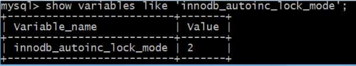
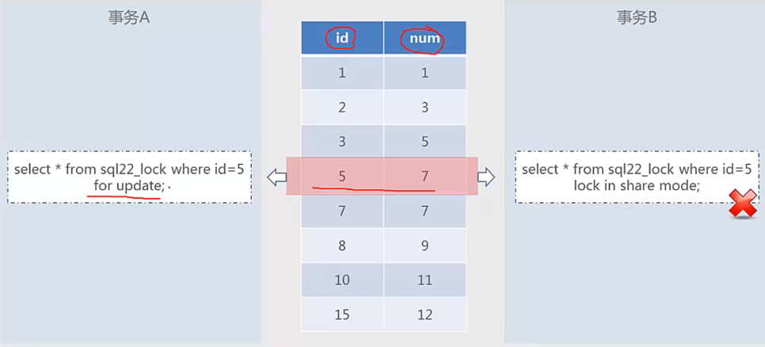
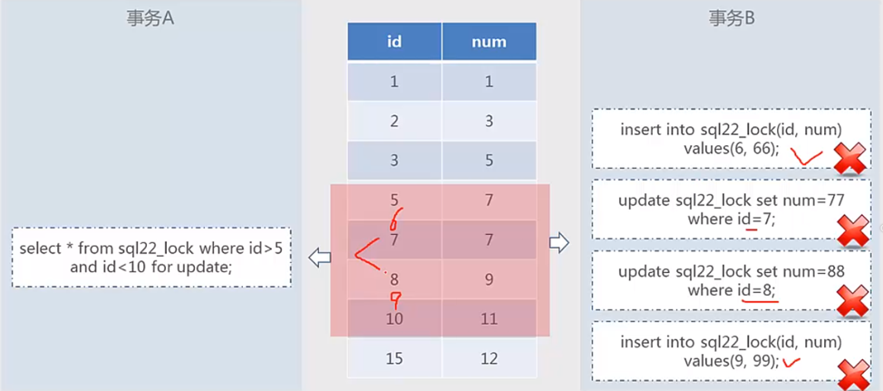
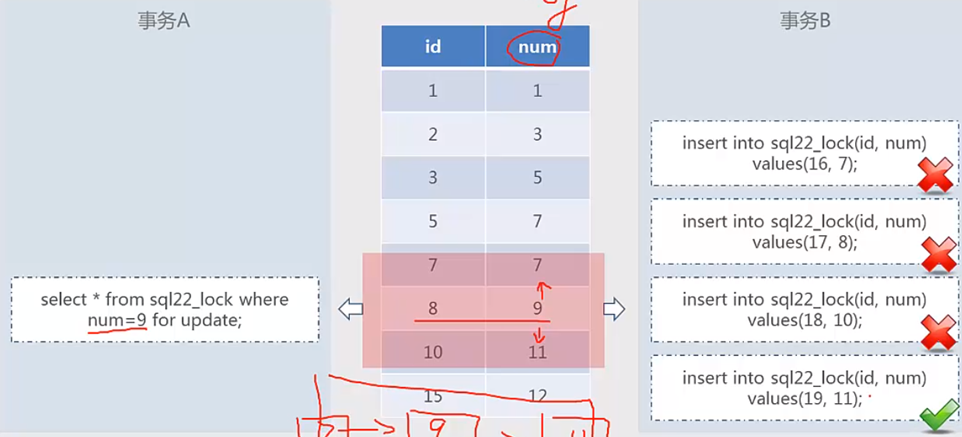
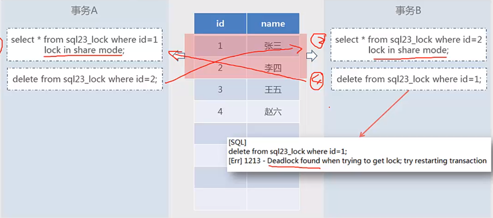
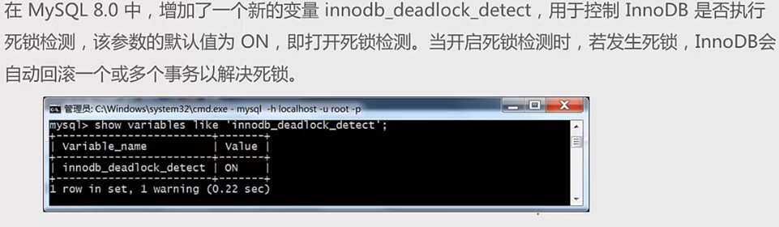
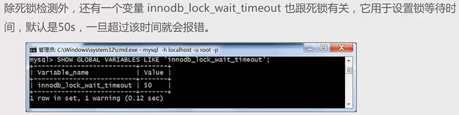
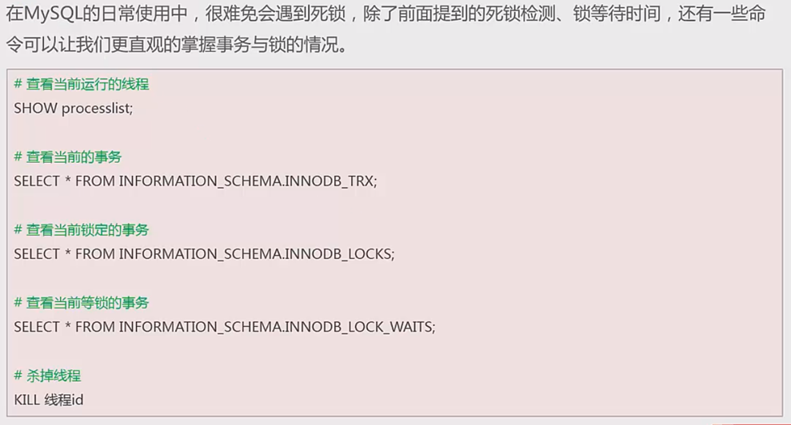
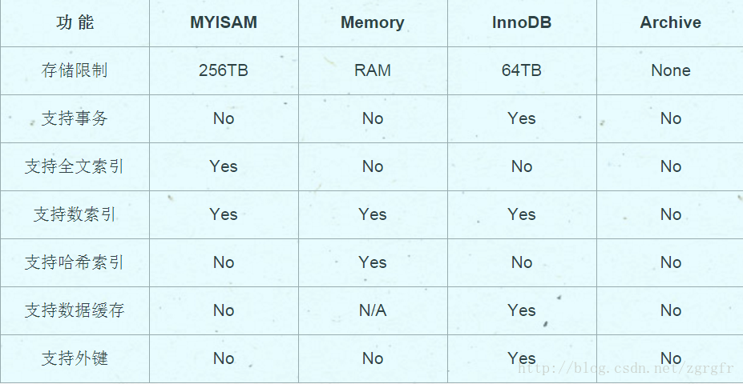

# 索引 MySQL

参考：

[MySQL教程：MySQL数据库学习宝典（从入门到精通）](http://c.biancheng.net/mysql/)

[MySQL数据库面试题（2020最新版）](https://thinkwon.blog.csdn.net/article/details/104778621)

## 三大范式

一范式就是属性不可分割

二范式就是要有主键,其他字段都依赖于主键

三范式就是要消除传递依赖,消除冗余,就是各种信息只在一个地方存储,不出现在多张表中

## 数据类型

- 数值数据类型：
  - INT：整数类型，用于存储整数。可以有参数，如INT(11)，表示存储的整数最大为10位数。
  - FLOAT：单精度浮点型，用于存储单精度浮点数。可以存储至多8位十进制数，并在内存中占4字节。
  - DOUBLE：双精度浮点型，用于存储双精度浮点数。可以存储至多18位十进制数，并在内存中占8字节。
  - DECIMAL：十进制类型，用于存储精确的小数。

- 日期和时间数据类型：
  - DATE：日期类型，格式为'YYYY-MM-DD'。
  - TIME：时间类型，格式为'HH:MM:SS'。
  - DATETIME：日期时间类型，格式为'YYYY-MM-DD HH:MM:SS'。
  - TIMESTAMP：时间戳类型，格式为'YYYY-MM-DD HH:MM:SS'，与UNIX时间戳有关。

- 字符串（字符）数据类型：
  - CHAR：定长字符串类型，长度在1到255之间。例如：CHAR(10)可以存储10个字符的字符串。
  - VARCHAR：可变长度字符串类型，长度在1到65535之间。例如：VARCHAR(255)可以存储最多255个字符的字符串。
  - TINYTEXT：非常小的文本类型，最大长度为255个字符。
  - TEXT：小型文本类型，最大长度为65535个字符。
  - MEDIUMTEXT：中型文本类型，最大长度为16777215个字符。
  - LONGTEXT：大型文本类型，最大长度为4294967295个字符。

- 其他数据类型：
  - BINARY：二进制字符串类型，用于存储二进制字符串。
    *VARBINARY：可变长二进制字符串类型，用于存储二进制字符串，长度在1到65535之间。
  - TINYINT：非常小的整数类型，取值范围为-128到127。
  - SMALLINT：小的整数类型，取值范围为-32768到32767。
  - MEDIUMINT：中等大小的整数类型，取值范围为-8388608到8388607。
  - INT和INTEGER：整数类型，取值范围为-2147483648到2147483647。
  - BIGINT：大的整数类型，取值范围为-9223372036854775808到9223372036854775807。

### 说明

#### char

- char表示定长字符串，长度是固定的；

- 如果插入数据的长度小于char的固定长度时，则用空格填充；

- 因为长度固定，所以存取速度要比varchar快很多，甚至能快50%，但正因为其长度固定，所以会占据多余的空间，是空间换时间的做法；

- 对于char来说，最多能存放的字符个数为255，和编码无关；
- 空格表示占位不算一个字符；

**char(10)：** 10位固定字符串，不足补空格，最多10个字符

密码散列，盐，用户身份证号等固定长度的字符串应该使用char而不是varchar来存储，这样可以节省空间且提高检索效率。

#### varchar

- varchar表示可变长字符串，长度是可变的；
- 插入的数据是多长，就按照多长来存储；
- varchar在存取方面与char相反，它存取慢，因为长度不固定，但正因如此，不占据多余的空间，是时间换空间的做法；
- 对于varchar来说，最多能存放的字符个数为65532；
- 空格也按一个字符存储；

**varchar(50)中50的涵义：**最多存放50个字符，varchar(50)和(200)存储hello所占空间一样，但后者在排序时会消耗更多内存，因为order by col采用fixed_length计算col长度(memory引擎也一样)。在早期 MySQL 版本中， 50 代表字节数，现在代表字符数。

#### int

**int(20)中20的涵义:**  是指显示字符的长度，不是存储数据的大小。INT类型是一个有符号整数类型，它占用4个字节（32位），可以表示范围为-2147483648到2147483647的整数。即使在INT(20)中指定了20，也不会改变这个范围。20表示最大显示宽度为20，但仍占4字节存储，存储范围不变，当使用带 zerofill 定义的 int 时，前面补多少个 0，易于报表展示

## 语句类型

SQL（Structure Query Language）结构化查询语言

- DQL（data query language）数据查询语言 select操作
- DML（data manipulation language）数据操作语言，主要是数据库增删改三种操作
- DDL（data defination language）数据库定义语言，主要是建表、删除表、修改表字段等操作
- DCL（data control language）数据库控制语言，如commit，revoke之类的

### 数据定义语言DDL

```java
create table score(
    id int not null auto_increment primary key, 
    name varchar(30) not null comment '学生姓名', 
    course varchar(50) comment '课程名称', 
    grade int comment '成绩' 
)engine=InnoDB default charset=utf8;
```

### 数据操作语言DML

```java
insert into score(name, course, grade) values('张三', '语文', 89);
```

#### drop、delete与truncate

三者都表示删除，但是三者有一些差别：

|          | Delete                                   | Truncate                       | Drop                                                 |
| -------- | ---------------------------------------- | ------------------------------ | ---------------------------------------------------- |
| 类型     | 属于DML                                  | 属于DDL                        | 属于DDL                                              |
| 回滚     | 可回滚                                   | 不可回滚                       | 不可回滚                                             |
| 删除内容 | 表结构还在，删除表的全部或者一部分数据行 | 表结构还在，删除表中的所有数据 | 从数据库中删除表，所有的数据行，索引和权限也会被删除 |
| 删除速度 | 删除速度慢，需要逐行删除                 | 删除速度快                     | 删除速度最快                                         |

因此，在不再需要一张表的时候，用drop；在想删除部分数据行时候，用delete；在保留表而删除所有数据的时候用truncate。

#### merge into

```sql
-- merge into 将源数据(来源于实际的表,视图,子查询)根据条件判断更新或插入到指定的表中(必须实际存在)
-- 这个语法仅需要一次全表扫描就完成了全部工作，执行效率要高于insert＋update，尤其是在大数据量面前，效率越明显。

-- 如果满足连接条件，则更新字段；如果连接条件不满足，则停止更新进行插入。
MERGE INTO table_name 
USING 数据来源表/视图/子查询结果集
ON 连接条件
WHEN MATCHED THEN 
UPDATE ...
WHEN NOT MATCHED THEN
INSERT ...
```

[SQL语句merge into的用法](https://blog.csdn.net/peterwanghao/article/details/107559583)

#### MINUS

```sql
-- MINUS 集合前减后
select id,employee_name from employees 
minus 
select id,employee_name from dependents
order by id;
```

#### 连接方法

```sql
-- 查询多个字段并链接在一起
MySQL: CONCAT()
Oracle: CONCAT(), ||
SQL Server: +

CONCAT(字串1, 字串2, 字串3, ...): 将字串1、字串2、字串3，等字串连在一起。请注意，Oracle的CONCAT()只允许两个参数；
```


### 数据查询语言DQL

#### ORDER BY

字段是整型数字，存储时用了Integer，排序会按照数字大小排序，如：2、4、10、11、31；但是用varchar存储，排序会按照字符排序，如：10、11、2、31、4，这时如果需要按照数字大小排序，先对长度排序，再使用字符排序`ORDER BY LENGTH(num),num`。

#### GROUP BY和HAVING

**语法：**	

```java
//aggregate_function表示聚合函数
SELECT column_name, aggregate_function(column_name)
FROM table_name
WHERE column_name operator value
GROUP BY column_name1,column_name2,...
HAVING aggregate_function(column_name) operator value
```

**说明：**

1. group by可以对一列或多列进行分组

2. SELECT一般只能跟上分组字段和聚合函数
3. WHERE 关键字无法与聚合函数一起使用，HAVING 子句可以对分组后的各组数据进行筛选，也可以对聚合函数进行判断

#### group_concat

group_concat配合group by一起使用，用于将某一列的值按指定的分隔符进行拼接，MySQL默认的分隔符为逗号。

**语法**

```java
group_concat([distinct] column_name [order by column_name asc/desc ] [separator '分隔符'])
```

**实例**

```java
>select * from employee;
id name dept
1 张三 部门A
2 李洁 部门C
3 李小梅 部门A
4 欧阳辉 部门C
5 李芳 部门A

>select dept,group_concat(name) from employee group by dept;
dept group_concat(name)
部门A  张三,李小梅,李芳   
部门C  李洁,欧阳辉
```

#### distinct

distinct用于在查询中返回列的唯一不同值（去重复），支持单列或多列。

**语法**

```java
//DISTINCT直接放在SELECT后面且DISTINCT后面跟的所有列都会加入去重，此时当column_name1, column_name2,...有任何一个不一样都会查出一行数据
SELECT DISTINCT column_name1, column_name2,... FROM table_name;
```

#### 表连接

**语法**

```mysql
#where
SELECT table1.column, table2.column 
FROM table1, table2 
WHERE table1.column1 = table2.column2;
```

**分类**

- `内连接`：使用`where、 join、inner join`，只连接匹配的行

  - `自连接`：同一张表内的连接，相互连接的表在物理上同为一张表，但是逻辑上是多张表

    ```mysql
    SELECT * FROM A T1 INNER JOIN A T2 ON T1.id=T2.pid
    ```

- `外连接`：
  
  - `左外连接，left join`，包含左表的全部行（不管右表是否存在与之匹配的行），以及右表中全部匹配的行
  
  - `右外连接，right join`，包含右表的全部行（不管左表是否存在与之匹配的行），以及左表中全部匹配的行
  
  - `全外连接，full join`，包含左右两个表的全部行（不管在另一个表中是否存在与之匹配的行），
  
    - MySQL不支持全连接，但是可以使用`LEFT JOIN 和UNION和RIGHT JOIN`联合使用来替代
  
    ```mysql
    SELECT * FROM A LEFT JOIN B ON A.id=B.id UNION SELECT * FROM A RIGHT JOIN B ON A.id=B.id
    ```

- `交叉连接（cross join）`：没有用where子句的交叉连接将产生笛卡尔积，第一个表的行数乘以第二个表的行数等于笛卡尔积
  和结果集的大小。这种连接需要尽量避免。比如：

  ```mysql
  SELECT table1.column, table2.column FROM table1, table2;
  ```

- `联合查询（UNION与UNION ALL）`

  ```mysql
  SELECT * FROM A UNION SELECT * FROM B UNION ...
  ```

  - 就是把多个结果集集中在一起，UNION前的结果为基准，需要注意的是联合查询的列数要相等，相同的记录行会合并
  - union会自动压缩多个结果集合中的重复结果，而union all则将所有的结果全部显示出来，也就是union会去重，union all不会
  - 但是效率 UNION ALL 高于 UNION
  - Union在去重的同时会进行默认规则的排序

#### 子查询

一条SQL语句的查询结果做为另一条查询语句的条件或查询结果，其中多条SQL语句嵌套使用，内部的SQL查询语句称为子查询。

- **子查询in**

  ```mysql
  #子查询in语法
  SELECT column_name FROM table_name 
  WHERE column_name IN(
   SELECT column_name FROM table_name [WHERE]
  );
  ```

- **子查询exists**

  EXISTS是子查询中用于测试内部查询是否返回任何行的布尔运算符。**将主查询的数据放到子查询中做条件验证**，根据验证结果（TRUE 或 FALSE）来决定主查询的数据结果是否保留。
  
  ```mysql
  #where子句使用exists语法
  SELECT t1.* 
  FROM table_name1 t1
  WHERE EXISTS (SELECT * FROM table_name2 t2 WHERE t1.column_name=t2.column_name);
  ```
  
  ```mysql
  #查找有成绩的学生
  >select A.* from student A where exists(select * from score B where A.stu_id=B.stu_id);
  
  stu_id name address
   1     张三	贵州
   2     李四	陕西
  ```

- **mysql中 in 和 exists 区别**

  mysql中的in语句是把外表和内表作hash 连接，而exists语句是对外表作loop循环，每次loop循环再对内表进行查询。一直大家都认为exists比in语句的效率要高，这种说法其实是不准确的。这个是要区分环境的。

  - 如果查询的两个表大小相当，那么用in和exists差别不大。

  - 如果两个表中一个较小，一个是大表，则子查询表大的用exists，子查询表小的用in。

  - `not in 和not exists`：如果查询语句使用了not in，那么内外表都进行全表扫描，没有用到索引；而not extsts的子查询依然能用到表上的索引。所以无论那个表大，用not exists都比not in要快。

#### 分页

LIMIT 子句可以被用于强制 SELECT 语句返回指定的记录数。LIMIT 接受一个或两个数字参数。参数必须是一个整数常量。

```mysql
#如果给定两个参数，第一个参数指定第一个返回记录行的偏移量，第二个参数指定返回记录行的最大数目。初始记录行的偏移量是 0(而不是 1)
mysql> SELECT * FROM table LIMIT 5,10; # 检索记录行 6-15 

#为了检索从某一个偏移量到记录集的结束所有的记录行，可以指定第二个参数为 -1
mysql> SELECT * FROM table LIMIT 95,-1; # 检索记录行 96-last. 

#如果只给定一个参数，它表示返回最大的记录行数目
mysql> SELECT * FROM table LIMIT 5; #检索前 5 个记录行 
```

#### case when then

```sql
--简单case函数
case sex
  when '1' then '男'
  when '2' then '女'
  else '其他' end
  
--case搜索函数
case when sex = '1' then '男'
     when sex = '2' then '女'
     else '其他' end  
```

```sql
> select u.id,u.name,u.sex,
      (case u.sex
        when 1 then '男'
        when 2 then '女'
        else '空的'
        end
       )性别
    from users u;
 
id name                        sex	 性别
--------------------------------------------
1 张一                            	空的
2 张二                          1 	男
3 张三                            	空的
4 张四                            	空的
5 张五                          2 	女
6 张六                          1 	男
7 张七                          2 	女
8 张八                          1 	男

8 rows selected
```

```sql
> select
      sum(case u.sex when 1 then 1 else 0 end)男性,
      sum(case u.sex when 2 then 1 else 0 end)女性,
      sum(case when u.sex <>1 and u.sex<>2 then 1 else 0 end)性别为空
    from users u;
 
男性         女性       性别为空
---------- ---------- ----------
 3          2          0
```

### 数据控制语言DCL

#### 用户管理

```mysql
#创建用户，用户创建后没有任何权限
>CREATE USER '用户名' [@'主机名'] [IDENTIFIED BY '密码'];
#注意：MySQL的用户账号由两部分组成：用户名和主机名，即用户名@主机名，主机名可以是IP或机器名称,主机名为%表示允许任何地址的主机远程登录MySQL数据库。
#删除用户
>DROP USER '用户名' [@'主机名'];
#修改密码
>ALTER USER '用户名'@'主机名' IDENTIFIED BY '新密码';
```

#### 权限体系

MySQL的权限体系大致分为5个层级，全局层级、数据库层级、表层级、列层级和子程序层级。

- **全局层级** 适用于一个给定服务器中的所有数据库。这些权限存储在mysql.user表中。`GRANT ALL ON *.*`和`REVOKE ALL ON *.*`只授予和撤销全局权限。

- **数据库层级** 适用于一个给定数据库中的所有目标。这些权限存储在mysql.db和mysql.host表中。
  `GRANT ALL ON db_name.*`和`REVOKE ALL ON db_name.*`只授予和撤销数据库权限

- **表层级** 适用于一个给定表中的所有列。这些权限存储在mysql.talbes_priv表中。
  `GRANT ALL ON db_name.tbl_name`和`REVOKE ALL ON db_name.tbl_name`只授予和撤销表权限

- **列层级** 适用于一个给定表中的单一列。这些权限存储在mysql.columns_priv表中。当使用REVOKE时，您必须指定与被授权列相同的列

- **子程序层级** CREATE ROUTINE, ALTER ROUTINE, EXECUTE和GRANT权限适用于已存储的子程序。这些权限可以被授予为全局层级和数据库层级。而且，除了CREATE ROUTINE外，这些权限可以被授予为子程序层级，并存储在mysql.procs_priv表中。

MySQL的权限信息主要存储在以下几张表中，当用户连接数据库时，MySQL会根据这些表对用户
进行权限验证。

- **user** 用户权限表，记录账号、密码及全局性权限信息
- **db** 记录数据库相关权限
- **table_priv** 用户对某个表拥有的权限
- **column_priv** 用户对某表的某个列所拥有的权限
- **procs_priv** 用户对存储过程及存储函数的操作权限

#### 权限管理

```mysql
#授权
>grant all privileges on databaseName.tableName to '用户名' [@'主机名'] ;
#撤销授权
>revoke all privileges on databaseName.tableName from '用户名' [@'主机名'] ;
#刷新权限
>FLUSH PRIVILEGES;
#查看权限
>show grants for '用户名' [@'主机名'] ;
```

#### 权限列表

使用grant和revoke进行授权、撤销授权时，需要指定具体是哪些权限，这些权限大体可以分为3类，数据类、结构类和管理类。

- **数据** 	SELECT	INSERT	UPDATE	DELETE	FILE
- **结构**	CREATE	ALTER	INDEX	DROP	CREATE TEMPORARY TABLES	SHOW VIEW	CREATE ROUTINE	ALTER ROUTINE	EXECUTE	CREATE VIEW	EVENT	TRIGGER
- **管理**	USAGE	GRANT	SUPER	PROCESS	RELOAD	SHUTDOWN	SHOW DATABASES	LOCK TABLES	REFERENCES	REPUCATION CUENT	REPUCATION SLAVE	CREATE USER

#### 禁止root用户远程登录

```mysql
#保证用户表中不存在root@%用户即可
>use mysql;
>select user,host from user;
```

#### 忘记root密码

windows+mysql8

```sh
#关闭权限验证
mysqld --defaults-file="C:\ProgramData\MySQL\MySQL Server 8.0\my.ini" --console --skip-grant-tables --shared-memory
```

说明：参数--defaults-file的值为配置文件my.ini的完整路径。


MySQL关闭权限验证后，直接通过 mysql 命令即可连接到数据库，并可正常执行各类操作。

```mysql
#刷新权限
>FLUSH PRIVILEGES;
#修改root用户的密码
>ALTER USER 'root'@'localhost' IDENTIFIED BY '123456';
```

## SQL约束

- NOT NULL: 用于控制字段的内容一定不能为空（NULL）。
- UNIQUE: 控件字段内容不能重复，一个表允许有多个 Unique 约束。
- PRIMARY KEY: 也是用于控件字段内容不能重复，但它在一个表只允许出现一个。
- FOREIGN KEY: 用于预防破坏表之间连接的动作，也能防止非法数据插入外键列，因为它必须是它指向的那个表中的值之一。
- CHECK: 用于控制字段的值范围。

**注意：**

字段一般要求定义为`not null`，因为null值会占用更多的字节，且会在程序中造成很多与预期不符的情况。

## MySQL键

- 超键：在关系中能唯一标识元组的属性集称为关系模式的超键。一个属性可以为作为一个超键，多个属性组合在一起也可以作为一个超键。超键包含候选键和主键。
- 候选键：是最小超键，即没有冗余元素的超键。
- 主键：数据库表中对储存数据对象予以唯一和完整标识的数据列或属性的组合。一个数据列只能有一个主键，且主键的取值不能缺失，即不能为空（Null）。
- 外键：在一个表中存在的另一个表的主键称此表的外键。

### 主键

推荐使用自增ID，不要使用UUID。

因为在InnoDB存储引擎中，主键索引是作为聚簇索引存在的，也就是说，主键索引的B+树叶子节点上存储了主键索引以及全部的数据(按照顺序)，如果主键索引是自增ID，那么只需要不断向后排列即可，如果是UUID，由于到来的ID与原来的大小不确定，会造成非常多的数据插入，数据移动，然后导致产生很多的内存碎片，进而造成插入性能的下降。

总之，在数据量大一些的情况下，用自增主键性能会好一些。


### 外键和外键约束

#### 外键

表一的主键字段X在另外一张表二中存在，且不是主键，则字段X称为表二的外键；其中表一称为主键表(父表，主表)，表二称为外键表(从表，外表); 

如：字段depart_id就是学生表的外键，这里的外键表是学生表，主键表是院系表。

```mysql
#学生表
create table student(
    id int not null auto_increment primary key, 
    name varchar(30) not null comment '学生姓名',
    depart_id varchar(10) not null comment '院系ID'
)engine=InnoDB default charset=utf8;

#院系表
create table depart(
    id int not null auto_increment primary key, 
    name varchar(30) not null comment '院系名称'
)engine=InnoDB default charset=utf8;
```

#### 外键实现

**定义外键时，需要遵守下列规则：**

- 主表必须已经存在于数据库中，或者是当前正在创建的表。如果是后一种情况，则主表与从表是同一个表，这样的表称为自参照表，这种结构称为自参照完整性。
- 外键的取值要么取父表中字段对应的值，要么取NULL值;并且外键中列的数据类型必须和主表主键中对应列的数据类型相同。
- 主表中有多个主键时，外键中列的数目必须和主表的主键中列的数目相同。

##### 在创建表时设置外键约束

```mysql
[CONSTRAINT <外键名>]    FOREIGN KEY 字段名 [，字段名2，…]    REFERENCES <主表名> 主键列1 [，主键列2，…]
```

```mysql
#父表
create table parent(
　　id number primary key,
　　name varchar2(30),
);

#子表
create table child(
    id number primary key,
    name varchar2(30),
    #1、
    parent_id number,
    constraint child_fid_fk foreign key(parent_id) references parent(id)
    #2、也可以直接在字段上定义
    parent_id number constraint child_fid_fk references parent(id)
);
```

##### 在修改表时添加外键约束

前提是从表中外键列中的数据必须与主表中主键列中的数据一致或者是从表没有数据

```mysql
ALTER TABLE <数据表名> 
ADD CONSTRAINT <外键名> 
FOREIGN KEY(<列名>) REFERENCES <主表名> (<列名>);
```

```mysql
ALTER  TABLE child 
ADD  CONSTRAINT child_fid_fk 
FOREIGN  KEY (parent_id)  REFERENCES  parent(id);
```

##### 删除外键约束

外键一旦删除，就会解除主表和从表间的关联关系。

```mysql
ALTER TABLE <表名> 
DROP FOREIGN KEY <外键约束名>;
```

```mysql
ALTER  TABLE child 
DROP FOREIGN KEY child_fid_fk;
```

**注意：**

使用`casecade constraints`解除关联就可以删除父表

```mysql
drop table parent cascade constranints;
```

#### Mysql外键设置

##### on delete 规则

- `CASCADE`：级联删除，就是删除主键表的同时，外键表同时删除。

- `NO ACTION`(非活动，默认)、`RESTRICT`：约束/限制
  当取值为`No Action`或者`Restrict`时，则当在主键表中删除对应记录时，首先检查该记录是否有对应外键，如果有则不允许删除。（即外键表约束主键表）

  - `NO ACTION`和`RESTRICT`的区别：只有在及个别的情况下会导致区别，前者是在其他约束的动作之后执行，后者具有最高的优先权执行。

- `SET NULL`：级联置空

  当取值为Set Null时，则当在主键表中删除对应记录时，首先检查该记录是否有对应外键，如果有则设置子表中该外键值为null(外键表约束主键表，不过这就要求该外键允许取null)。

```mysql
create table child(
    id number primary key,
    name varchar2(30),
    #parent_id number constraint child_fid_fk references parent(id) on delete set null
    parent_id number constraint child_fid_fk references parent(id) on delete cascade
);
```

参考：[外键约束](https://www.cnblogs.com/cjaaron/p/9216839.html)

## MySQL 逻辑架构概览

可以大致把 MySQL 的逻辑架构分成 Server 层和存储引擎层：

1）大多数 MySQL 的核心服务功能都在 Server 层，包括连接、分析、优化、缓存以及所有的内置函数（例如，日期、时间、数学和加密函数），所有跨存储引擎的功能都在这一层实现：存储过程、触发器、视图等。

值得一提的是，Server 最上面的服务也就是连接器，拥有管理 MySQL 连接、权限验证的功能。显然这并非 MySQL 所独有，大多数基于网络的客户端/服务器的工具或者服务都有类似的架构。

2）第二层就是存储引擎（支持 InnoDB、MyISAM、Memory 等多个存储引擎）。**存储引擎负责 MySQL 中数据的存储和提取，且响应上层服务器的请求。**每个存储引擎自然是有它的优势和劣势，不同的存储引擎之间无法相互通信，所以我们需要根据不同的场景来选择合适的存储引擎。

服务器通过 API 与存储引擎进行通信。这些接口屏蔽了不同存储引擎之间的差异，使得这些差异对上层的查询过程透明。存储引擎 API 包含几十个底层函数，用于执行诸如 “开始一个事务” 或者 “根据主键提取一行记录” 等操作。

需要注意的是，在 MySQL 5.1 及之前的版本，MyISAM 是默认的存储引擎，而在 MySQL 5.5.5 后，InnoDB 成为了默认的存储引擎。

**MySQL 的逻辑架构图：**


MySQL 最重要、最与众不同的特性就是它的**可插拔存储引擎架构**（pluggable storage engine architecture），这种架构的设计将查询处理及其他系统任务和数据的存储/提取分离开来。


1. **连接器（Connector）**

   连接器会做两个事情，一个是管理 MySQL 连接，一个是权限验证。比对用户名和密码建立连接，它还会验证该用户是否具有执行某个特定查询的权限，当修改了用户权限后，只有再新建的连接才会使用新的权限设置。

2. **查询缓存（Query Cache）**

   查询缓存存储了 SELECT 语句的文本以及响应给客户端的相应结果。这样，如果服务器稍后接收到相同的 SELECT 语句，服务器会先从查询缓存中检索结果，而不是再次解析和执行该语句。查询缓存在 session 之间共享，因此可以发送一个客户端生成的结果集以响应另一个客户端发出的相同查询。如果当前的查询恰好命中了查询缓存，那么**在返回查询结果之前 MySQL 会检查一次用户权限**。

   为了保证缓存一致性，当表被修改时，查询缓存中的任何相关条目都会被 flushed，注意，这里的 flushed 翻译为**清空**而不是刷新，正是由于这个特性，**从 MySQL 5.7.20 开始，官方不再推荐使用查询缓存，并在 MySQL 8.0 中直接删除了查询缓存！**

3. **解析器（Parser）**

   如果没有命中或者没有开启查询缓存，MySQL 服务器接下来要做的就是**将一条 SQL 语句转换成一个执行计划**，再依照这个执行计划和存储引擎进行交互。这包括多个子阶段：解析 SQL、预处理、优化 SQL 执行计划。这个过程中任何错误（例如语法错误）都可能终止查询。

   其中**解析 SQL 和预处理就是解析器做的事情，优化 SQL 执行计划就是优化器做的事情**。服务器端进行 SQL 解析、预处理，生成合法的解析树；

4. **优化器（Optimizer）**

   一条查询可以有很多种执行计划，最后都返回相同的结果，**优化器的作用就是找到这其中最好的执行计划**。

5. **执行器**

   在开始执行 SQL 语句之前，执行器会先判断一下当前用户对这个表有没有执行查询的权限，如果没有，就会返回没有权限的错误。

   权限认证完成后，MySQL 就会根据执行计划给出的指令逐步执行。在根据执行计划逐步执行的过程中，有大量的操作需要通过调用存储引擎实现的接口来完成


## 表空间

### 概念

　　从 InnoDB存储引擎的逻辑存储结构看，所有数据都被逻辑地存放在一个空间中，称之为表空间( tablespace)。表空间又由段(segment)、区( extent)、页(page)组成，页在一些文档中有时也称为块( block) 。每个**表空间由一个或多个数据文件组成**，一个数据文件只能与一个表空间相联系。 

数据表是逻辑上的概念，**表空间是物理层面的概念**，在innodb存储引擎中数据是按照表空间来组织存储的，表空间文件对应着磁盘上的物理文件。 

#### 系统表空间

**查看系统表空间参数：**

```mysql
mysql> show variables like '%inndb_data_file_path%';

Variable_name			Value
innodb_data_file_path	ibdata1:12M:autoextend
```

Value部分的的组成是：name:size:attributes

默认情况下，MySQL会初始化一个大小为12MB，名为ibdata1文件，并且随着数据的增多，它会自动扩容。

这个ibdata1文件是**系统表空间**，也是默认的表空间，也是默认的表空间物理文件，也是共享表空间。

**配置系统表空间：**

系统表空间的数量和大小可以通过启动参数：innodb_data_file_path

```cnf
# my.cnf
[mysqld]
innodb_data_file_path=/dir1/ibdata1:2000M;/dir2/ibdata2:2000M:autoextend
```

#### 独占表空间

**启用独占表空间参数：**

```sh
让每一个数据库表都有一个单独的表空间文件的话，可以通过参数innodb_file_per_table设置。这个参数只有在MySQL5.6或者是更高的版本中才可以使用。

配置文件：
[mysqld]
innodb_file_per_table=ON

命令：
mysql> SET GLOBAL innodb_file_per_table=ON; 
```

之后InnoDB存储引擎产生的表都会自己独立的表空间文件。

独立的表空间文件命名规则：表名.ibd，独立表空间文件中仅存放该表对应数据、索引、insert buffer bitmap。

其余的诸如：undo信息、insert buffer 索引页、double write buffer 等信息依然放在默认表空间，也就是共享表空间中。

#### 临时表空间

**查看临时表空间参数：**

临时表空间用于存放用户创建的临时表和磁盘内部临时表。

```mysql
-- 参数innodb_temp_data_file_path定义了临时表空间的一些名称、大小、规格属性。
mysql> show variables like '%innodb_temp_data_file_path%';
Variable_name				Value
innodb_temp_data_file_path	ibtmp1:12M:autoextend

-- 查看临时表空间文件存放的目录
mysql> show variables like '%innodb_data_home_dir%';
Variable_name				Value
innodb_data_home_dir		/home/mysql/mysql/var
```

#### 撤销表空间

用来帮助回退未提交的事务数据

### 表碎片清理和表空间收缩

当你删除数据时，mysql并不会回收，被已删除数据的占据的存储空间，以及索引位。而是空在那里，而是等待新的数据来弥补这个空缺。

```mysql
-- 清理碎片后 tablename.ibd 文件磁盘空间减小,该方案基于独立表空间存储方式
> OPTIMIZE TABLE [tablename],当然这种方式只适用于独立表空间

清除碎片的优点:
  　　降低访问表时的IO,提高mysql性能,释放表空间降低磁盘空间使用率。
```

```mysql
-- 如：
> OPTIMIZE TABLE ipvacloud.report_site_day;
对myisam表有用  对innodb也有用，系统会自动把它转成 ALTER TABLE  report_site_day ENGINE = Innodb; 这是因为optimize table的本质，就是alter table，所以不管myisam引擎还是innodb引擎都可以使用OPTIMIZE TABLE回收表空间。
```


#### 存储模式

**MySQL5.5默认是共享表空间 ，5.6中默认是独立表空间(表空间管理类型就这2种)** 

独立表空间 就是采用和MyISAM 相同的方式, 每个表拥有一个独立的数据文件( .idb )

1.每个表都有自已独立的表空间。
2.每个表的数据和索引都会存在自已的表空间中。
3.可以实现单表在不同的数据库中移动(将一个库的表移动到另一个库里,可以正常使用)。
4.drop table自动回收表空间 ，删除大量数据后可以通过alter table XX engine = innodb;回收空间。

**查看表空间文件：**

```sh
# oa是数据库名称
$ ll /usr/local/mysql/data/oa
......
flowtemplate.ibd	# 以.ibd文件结尾的是表flowtemplate对应的独立表空间文件
t3.frm			#以frm结尾的是该表的表结构定义文件
......
```

**InnoDB引擎 frm ibd文件说明：**
   1.frm ：描述表结构文件，字段长度等
   2.ibd文件 
         **a如果采用独立表存储模式(5.6)，data\a中还会产生report_site_day.ibd文件（存储数据信息和索引信息）**

​         D:\java\mysql5.6\data\ipvacloudreport_site_day.frm 和

​         D:\java\mysql5.6\data\ipvacloud\report_site_day.ibd

​         **b如果采用共享存储模式(5.5)，数据信息和索引信息都存储在ibdata1中**
​          (其D:\java\mysql5.6\data\目录下没有.ibd文件,只有frm文件)


[MySQL的表空间](https://www.cnblogs.com/better-farther-world2099/articles/14713523.html)


## 视图

视图是一个**虚拟表**，其内容由**select查询语句**定义。和真实的表一样，视图也包含行和列，对视图的操作与对表的操作基本一致。视图中的数据是在使用视图时动态生成，**视图中的数据都存储在基表中**。  视图表的数据变化会影响到基表，基表的数据变化也会影响视图表。  其中单表创建的视图可以直接修改视图，数据变化会影响到原表数据，但是多表创建的视图不可以修改数据

- 可读性  ：简化了复杂的查询，使复杂的查询更易于理解和使用  
- 重用性  ：视图是对复杂查询语句的封装，对数据库重构，不会影响程序的运行  
- 安全性  ：视图可以隐藏一些敏感的信息，可以把权限限定到行列级别  

```mysql
#创建视图
CREATE VIEW view_name AS SELECT…;
#修改视图
ALTER VIEW view_name AS SELECT…;
#查看视图创建语句
SHOW CREATE VIEW view_name;
#查看有哪些视图
SHOW TABLE STATUS WHERE comment='view';
#删除视图
DROP VIEW view_name;
```

## 事务

事务（Transaction）是指作为一个逻辑工作单元执行的一系列操作，这些操作要么全部成功，要么全部失败。事务确保对多个数据的修改作为一个单元来处理。

- 在MySQL中，只有使用了Innodb存储引擎的数据库或表才支持事务。
- 事务用于维护数据库的完整性，保证成批的sql语句要么都执行，要么都不执行。
- 事务用于管理INSERT、UPDATE和DELETE语句，不会管理SELECT语句。


例如，张三在ATM机上给李四转账100元，在银行的业务系统中，主要会执行两步数据变更操作：
①从张三的账户减去1000-100元；
②给李四的账户增加0+100元。
试问，如果操作①执行成功，操作②执行失败会发生什么情况？

### 事务特性

事务拥有ACID四个特性，即Atomicity（原子性）、Consistency（一致性）、Isolation（隔离性）和Durability（持久性）。

- **原子性** 事务必须是原子工作单元，事务中包含的各操作要么都做，要么都不做
- **一致性** 事务在执行完成时，必须使所有的数据都保持一致状态。如上例数据要么是1000和0，要么是900和100
- **持久性** 事务执行完成之后，它对系统的影响是永久性的。比如不存在断电数据消失
- **隔离性** 事务独立运行。多个事务之间相互隔离，互不干扰。事务的100%隔离，会牺牲速度

### 事务控制

在默认情况下，MySQL是自动提交事务的，即每一条INSERT、UPDATE、DELETE的SQL语句提交后会立即执行COMMIT操作。因此，要开启一个事务，可以使用start transaction或begin，或者将autocommit的值设置为0

```mysql
#使用start transaction或begin开启事务。
>start transaction
>begin
#回滚到事务之前
>rollback;    
#提交
>commit;    
```

```mysql
#默认情况下，autocommit的值为1，表示自动提交事务
>select @@autocommit;
>set autocommit=0;
```

### 隔离级别

- Read Uncommitted（未提交读）
- Read Committed（已提交读）：大多数据库默认事务隔离级别，比如oracle、sqlserver
- Repeatable Read（可重复读）：MySQL的默认事务隔离级别
- Serializable（串行化）

事务一般隔离级别使用已提交读，代码中个别问题使用悲观锁和乐观锁处理，但是事务不会管理SELECT语句，所以即便是可串行化，也不能保证读取数据更新数据操作的原子性

#### 读取数据问题

- 脏读(Drity Read)

  事务A可以读取到事务B未提交的执行结果，即读取未提交的数据。  

- 不可重复读(Non-repeatable read)

  在一个事务的两次查询之中数据不一致，事务A执行同样的两次查询之间，事务B对数据进行更新提交，在事务B提交之前、提交之后，会得到不同的查询结果  

- 幻读(Phantom Read)

  在一个事务的两次查询中数据笔数不一致，事务A执行同样的两次查询之间，事务B插入一条数据并提交，在事务B提交之前、提交之后，事务A后一次查询看到了前一次查询没有看到的行。


#### MVCC与事务隔离级别

- **MVCC的核心机制**

  - **Undo Log版本链**：每次修改操作会生成数据的旧版本并记录到Undo Log中，形成版本链
  - **Read View**：事务启动时生成一个快照（Read View），后续查询基于该快照选择可见的数据版本
  - **可见性规则**：
    - 事务只能看到**自身修改的版本**或**在事务启动前已提交的版本**
    - 通过Undo Log回溯，事务可访问更早的版本（如解决不可重复读）

- **隔离级别的差异**

  | 隔离级别         | 可见性规则                                              | 锁机制                  |
  | ---------------- | ------------------------------------------------------- | ----------------------- |
  | Read Uncommitted | 可见未提交事务的修改                                    | 无锁，但可能引发脏读    |
  | Read Committed   | 只能看见已提交事务的修改（每次查询生成新Read View）     | 行锁+MVCC               |
  | Repeatable Read  | 整个事务期间看到的数据一致（基于事务启动时的Read View） | 行锁+间隙锁（防止幻读） |
  | Serializable     | 强制串行执行，通过表级锁避免所有并发冲突                | 表锁                    |

  

- 幻读的前提条件是InnoDB引擎，可重复读隔离级别，使用**当前读**时。
  - 在可重复读隔离级别下，普通查询是快照读，是不会看到别的事务插入的数据的，幻读只在**当前读**下才会出现。
  - 幻读专指**新插入的行**，读到原本存在行的更新结果不算。因为**当前读**的作用就是能读到所有已经提交记录的最新值。
- Innodb默认事务隔离级别是可重复读，同时使用了MVCC和next-key locks解决幻读，MVCC解决的是普通读（快照读）的幻读，next-key locks解决的是当前读情况下的幻读。  

参考：

[脏读、幻读、不可重复读](https://www.cnblogs.com/l-y-h/p/12458777.html#_label0_3)

[MySQL幻读](https://www.jianshu.com/p/c53c8ab650b5)

[MySQL当前读、快照读、MVCC](https://www.cnblogs.com/wwcom123/p/10727194.html)


**操作:**

```mysql
#查询隔离级别
>select @@tx_isolation;    
#设定隔离级别为READ-UNCOMMITTED
>SET tx_isolation='READ-UNCOMMITTED';


#MySQL 8.0
#查看事务隔离级别
select @@transaction_isolation;
#或者
show variables like 'transaction_isolation';
#设置事务隔离级别
set transaction_isolation ='read-uncommitted';
```

### 事务和锁

#### 自动加锁与行级锁机制

- **默认加锁行为**
  在默认的 Repeatable Read（可重复读）​隔离级别下，MySQL会自动为修改操作（UPDATE/DELETE）加排他锁（X锁）​，**阻止其他事务同时修改**同一行数据

  例如：

  - 事务A执行`UPDATE ... WHERE id=40`时，MySQL会自动锁定该行；
  - 事务B尝试修改同一行时会被阻塞，直到事务A提交或回滚

- **显式锁与查询锁**
  - 若事务A对某行加`SELECT ... FOR UPDATE`锁，**事务B的修改或查询**（需获取X锁）会被阻塞，直到事务A释放锁
  - 普通查询（无锁）不受影响，可并发读取数据


## 日志

日志分为：

- 逻辑日志：记录的sql语句。
- 物理日志：记录的数据页变更。

日志用于记录数据库的运行情况，以及用户对数据库执行的各类操作。当数据库发生故障时，可以根据日志分析和解决问题，从而对数据库进行恢复。

- **重做日志（redo log）** 

  重做日志是一种物理格式的日志，记录的是物理数据页面的修改的信息，其redo log是顺序写入redo log file的物理文件中去的。

- **回滚日志（undo log）**

  回滚日志是一种逻辑格式的日志，在执行undo的时候，仅仅是将数据从逻辑上恢复至事务之前的状态，而不是从物理页面上操作实现的，这一点是不同于redo log的。

- **二进制日志（binlog）**

  二进制日志是一种逻辑格式的日志，以二进制文件的形式记录了数据库中的操作，但不记录查询语句。

- **错误日志（errorlog）** 

  错误日志记录着mysqld启动和停止，以及服务器在运行过程中发生的错误的相关信息。

- **慢查询日志（slow query log）** 

  慢查询日志记录执行时间过长和没有使用索引的查询语句。

- **一般查询日志（general log）**

  记录了服务器接收到的每一个查询或是命令，无论这些查询或是命令是否正确甚至是否包含语法错误，general log都会将其记录下来。

- **中继日志（relay log）** 

  中继日志类似二进制；可用于复制架构中，使从服务器和主服务器的数据保持一致。

### 慢查询日志

用于记录MySQL数据库中响应时间超过指定阈值的语句。它不仅仅只针对**SELECT**语句，像**INSERT、UPDATE、DELETE**等语句，只要响应时间超过所设定阈值都会记录在慢查询日志中。

**日志参数:**

- **slow_query_log** 是否开启慢查询日志，1表示开启，0表示关闭。
- **slow_query_log_file** 慢查询日志存储路径，可选，默认`/var/lib/mysql/localhost-slow.log`。注意：MySQL 5.6之前的版本，参数名为 log-slow-queries
- **long_query_time** 阈值，当SQL语句的响应时间超过该阈值就会被记录到日志中
- **log_queries_not_using_indexes** 未使用索引的查询也被记录到慢查询日志中，可选。
- **log_output** 日志存储方式，默认为FILE。
  - log_output=‘FILE’表示将日志存入文件
  - log_output=‘TABLE’表示将日志存入数据库
  - log_output=‘FILE,TABLE’表示同时将日志存入文件和数据库

```mysql
#查看是否开启慢查询日志,其中show variables可以查看mysql中参数值
>show variables like 'slow%';

#临时开启慢查询日志,它会在datadir下产生一个xxx-slow.log的文件
>set GLOBAL slow_query_log='ON';

#设置临界时间，单位秒
>set long_query_time=1;

#慢查询日志文件所在位置
>show variables like '%datadir%';
```

```cnf
# MySQL的配置文件（/etc/my.cnf）

# 开启MySQL慢日志查询开关
slow_query_log=1
# 设置慢日志的时间为2秒，SQL语句执行时间超过2秒，就会视为慢查询，记录慢查询日志
long_query_time=2

# 慢查询日志记录原始的sql语句
```


### binlog日志

bin log属于逻辑日志，由服务层产生，所有存储引擎都支持。记录数据库执行的写入性操作信息，以二进制的形式保存在磁盘中。

MySQL的二进制日志binlog可以说是MySQL最重要的日志，它记录了所有的DDL和DML语句，以事件形式记录，还包含语句所执行的消耗的时间，MySQL的二进制日志是事务安全型的。

万一遇到数据丢失的紧急情况下，可以使用binlog日志进行数据恢复（定时全备份+binlog日志恢复增量数据部分）。

```mysql
#查看binlog日志参数
>show variables like 'log_bin%'  
log_bin								ON
log_bin_basename  					/usr/...	
log_bin_index						/usr/...
log_bin_trust_function_creators		OFF
log_bin_use_v1_row_events			OFF
```


```mysql
#查看所有二进制日志列表
show master logs;
#查看正在使用的二进制日志
show master status;
#刷新日志（重新开始新的binlog日志文件）
flush logs;

#binlog日志是二进制文件不能直接打开，需要用如下方式查看    
#查询指定的binlog
show binlog events in 'WQ-20160826MDKU-bin.000050' from 10668\G;

#导出sql在查看，同时可以用sql文件恢复误删数据
#(半夜备份文件，先找到日志中半夜行数到当前行数，导出sql文件，在使用source命令导入)

mysqlbinlog "C:\ProgramData\MySQL\MySQL Server 8.0\Data\WQ-20160826MDKU-bin.000057" --start-position 528 --stop-position 1191 > d:\backup\test.sql
#sql文件本质上就是数据库语句集
```


## MySQL的锁

当数据库有**并发事务**的时候，可能会产生数据的不一致，这时候需要一些机制来保证访问的次序，锁机制就是这样的一个机制。不同的存储引擎支持不同的锁机制，按照**锁的粒度来划分**，可以分为表锁、行锁和页锁。  

|      | 描述                                                         | MyISAM | InnoDB | BDB  |
| ---- | ------------------------------------------------------------ | ------ | ------ | ---- |
| 表锁 | 开销小，加锁快；不会出现死锁；锁定力度大，发生锁冲突概率高，并发度最低 | √      | √      | √    |
| 行锁 | 开销大，加锁慢；会出现死锁；锁定粒度小，发生锁冲突的概率低，并发度高 |        | √      |      |
| 页锁 | 开销和加锁速度介于表锁和行锁之间；会出现死锁；锁定粒度介于表锁和行锁之间， 并发度一般，介于表锁和行锁之间 |        |        | √    |

### MyISAM的锁  

MyISAM存储引擎**只支持表锁**。在执行查询操作（select）前， 会自动给涉及的所有表加读锁；在执行更新操作（insert、update、delete等）前， 会自动给涉及的所有表加写锁 。

MyISAM表的读操作，不会阻塞其他用户对相同表的读操作，但会阻塞对相同表的写操作；MyISAM表的写操作，会阻塞其他用户对相同表的读操作、写操作；MyISAM表的读、写操作之间，以及写操作之间是串行的。  

```mysql
# 给表加读锁，此时其他会话可以对表进行读操作，写操作会阻塞等待
lock tables bk_myisam read;
# 解锁
unlock tables;
```

### InnoDB的锁  

InnoDB存储引擎既支持行锁，也支持表锁，但默认情况下是采用行锁。InnoDB的锁，与索引、事务的隔离级别有关。

- InnoDB的行锁是通过**锁定索引项**来实现的，而不是锁定物理行记录。所以当查询字段不是索引键那么InnoDB将完成表锁，并发将无从谈起。当查询字段是唯一索引时使用记录锁，不是唯一索引使用临键锁。

- 事务隔离级别与锁的关系
  - 在Read Uncommitted级别下，读取数据不需要加共享锁，这样就不会跟被修改的数据上的排他锁冲突
  - 在Read Committed级别下，读操作需要加共享锁，但是在语句执行完以后释放共享锁；(单个语句执行期间不允许修改)
  - 在Repeatable Read级别下，读操作需要加共享锁，但是在事务提交之前并不释放共享锁，也就是必须等待事务执行完毕以后才释放共享锁。(整个事务执行期间不允许修改)
  - SERIALIZABLE 是限制性最强的隔离级别，因为该级别锁定整个范围的键，并一直持有锁，直到事务完成。

InnoDB的锁类型有很多种。

| 锁     | 描述                                                         |
| ------ | ------------------------------------------------------------ |
| 共享锁 | `Share Locks`，即S锁，读锁。当一个事务对某行上读锁时，允许其他事务对该行进行读操作，但不允许写。 |
| 排他锁 | `Exclusive Locks`，即X锁，写锁。当一个事务对某行数据上排他锁，其他事务就不能再对该行上任何锁。 |
| 意向锁 | `Intention Locks`，包括意向共享锁和意向排他锁，是表级锁，InnoDB自动添加，无需要人工干预 |
| 记录锁 | `Record Locks`，锁定索引记录，可以防止其他事务更新或删除行。 |
| 自增锁 | `Auto-inc Locks`，针对自动增长的主键。                       |
| 间隙锁 | `Gap Locks`，锁定索引记录之间的间隙。                        |
| 临键锁 | `Next-key Locks`，记录锁与间隙锁的组合。                     |


**从锁的类别上来讲，有共享锁和排他锁。**

#### 共享锁

共享锁（Share Locks）也称之为S锁、读锁。当一个事务对某行记录上了共享锁，允许其他事务对该记录进行读操作，但不允许写操作 。

```mysql
#共享锁加锁方式
SELECT ... LOCK IN SHARE MODE
```

```mysql
#事务A
begin;
select * from user where id=1 lock in share mode;	#加共享锁，其他事务此时可读不可写
commit;												#事务提交自动释放锁

#事务B
begin;
select * from user where id=1 lock in share mode;	#允许(事务A未提交)
update user set age=20 where id=1;					#不允许(事务A未提交),事务A提交之后操作就会继续执行，事务B中加的共享锁对本事务无影响
commit;
```

#### 排他锁

排他锁（Exclusive Locks）也称之为X锁、写锁。当一个事务对某行记录上了排他锁，其他事务即不能对该行记录进行读操作，也不能进行写操作。**InnoDB会自动对增删改操作加排他锁**。

```mysql
#手动加排他锁的方式
SELECT ... FOR UPDATE
```

```mysql
#事务A
select * from user where id=1 for update;

#事务B
select * from user where id=1 lock in share mode;	#不允许
update user set age=20 where id=1;					#不允许
```

#### 自增锁

在实际应用中，都推荐使用自增id作为数据表的主键，而不建议使用业务id，更不建议使用字符串作为主键 。 

- InnoDB底层的数据结构是B+Tree ，索引本身是有序的，再加上MySQL底层是以页为单位来存储数据的，一页写满继续写下一页。如果使用非自增id，为了保证索引的有序性，每次插入都需要将数据移动到合适的位置，可能会造成页分裂，影响插入性能。

- 相对而言，字符串作为主键占用的空间大，而且字符串的比较更慢  

自增锁（Auto-inc Locks）是当向含有AUTO_INCREMENT列的表中插入数据时需要获取的一种特殊的**表级锁**。在最简单的情况下，如果一个事务正在向表中插入值，则任何其他事务必须等待对该表执行自己的插入操作，以便第一个事务插入的行的值是连续的。  

特殊的表级锁：insert出现在事务中，**自增锁是在insert之后立即释放**，而不是等事务提交才释放。

**参数：**

InnoDB还提供了参数 `innodb_autoinc_lock_mode` 用于设置自增锁模式，它可以对插入操作实现性能与并发的平衡。  



取值说明：

- 0：traditional，传统锁模式，语句级锁，保证值分配的可预见性、连续性、可重复性，保证主从复制的一致性。(insert之后释放)
- 1： consecutive，连续锁模式，**锁在语句得到值后就释放**，并发插入性能优于传统模式，MySQL 5.x默认模式。
- 2：interleaved，交错锁模式，最快最具扩展性的模式，基于binlog的复制与恢复不安全，MySQL 8.0默认模式 。不能保证自增的连续性。 

```mysql
#查看自增参数
show variables like '%auto_increment%';

auto_increment_increment	1	#初始值
auto_increment_offset		1	#每次增加的步长
```

#### 行级锁

行级锁能够有效减少锁冲突。**按照锁定范围的不同，MySQL支持3种行级锁**：记录锁、间隙锁和临键锁。

| 锁     | 描述                                                         |
| ------ | ------------------------------------------------------------ |
| 记录锁 | Record Locks，锁定某行记录                                   |
| 间隙锁 | Gap Locks，锁定一个范围，不仅仅是记录本身                    |
| 临键锁 | Next-key Locks(Record+Gap)，锁定记录本身和左右两边相邻的范围 |

- innodb对于行的查询使用临键锁，当查询的索引含有唯一属性时，将临键锁降级为记录锁。临键锁解决幻读问题。
- 间隙锁设计的目的是为了阻止多个事务将记录插入到同一范围内，而这会导致幻读问题的产生。两种方式显式关闭间隙锁：（除了外键约束和唯一性检查外，其余情况仅使用记录锁） A. 将事务隔离级别设置为`Read Committed` B. 将参数`innodb_locks_unsafe_for_binlog`设置为1

##### 记录锁

记录锁是通过主键或唯一索引对某行记录进行加锁，它锁住该行的索引，有时也称之为行锁。



##### 间隙锁

间隙锁锁住的是一个范围区间，而不仅仅是这个区间的记录。



##### 临键锁

临键锁是记录锁和间隙锁的组合，除了锁定记录本身之外，还会锁定左右两边相邻的区间范围。

如下num是普通索引，会出现临键锁：



#### 死锁

死锁(DeadLock)是指两个或两个以上的事务在执行过程中，因争夺资源而造成相互等待的现象，若无外力作用，它们都将无法进行下去，一直处于等待状态。

两个事务A、B因争夺资源而相互等待，A等待B释放id=2的锁，B等待A释放id=1的锁。



##### 死锁检测



##### 锁等待时间



##### 处理死锁的相关命令



##### 解决死锁的方法

- 如果不同程序会并发存取多个表，尽量约定以相同的顺序访问表，可以大大降低死锁机会。

- 在同一个事务中，尽可能做到一次锁定所需要的所有资源，减少死锁产生概率；

- 对于非常容易产生死锁的业务部分，可以尝试使用升级锁定颗粒度，通过表级锁定来减少死锁产生的概率；

- 如果业务处理不好可以用分布式事务锁或者使用乐观锁

### 乐观锁和悲观锁

数据库管理系统（DBMS）中的并发控制(锁)的任务是确保在多个事务同时存取数据库中同一数据时不破坏事务的隔离性和统一性以及数据库的统一性。乐观并发控制（乐观锁）和悲观并发控制（悲观锁）是并发控制主要采用的技术手段。

- 悲观锁：假定会发生并发冲突，屏蔽一切可能违反数据完整性的操作。在查询完数据的时候就把事务锁起来，直到提交事务。实现方式：使用数据库中的锁机制。

- 乐观锁：假设不会发生并发冲突，只在提交操作时检查是否违反数据完整性。在修改数据的时候把事务锁起来，通过version的方式来进行锁定。实现方式：乐观锁一般会使用版本号机制或CAS算法实现。

#### 使用场景

**乐观锁适用于多读场景**，即冲突真的很少发生的时候，这样可以省去了锁的开销，加大了系统的整个吞吐量。

但如果是多写的情况，一般会经常产生冲突，这就会导致上层应用会不断的进行retry，这样反倒是降低了性能，所以**一般多写的场景下用悲观锁就比较合适。**

## 存储过程

存储过程（ Stored Procedure）是为了完成特定功能的**预编译SQL语句集**，经编译创建并保存在数据库中，用户可通过指定存储过程的名字并给定参数(需要时)来调用执行，类似于编程语言中的方法或函数。  

**存储过程的优点：**

- 存储过程是对SQL语句的封装，增强可复用性
- 存储过程可以隐藏复杂的业务逻辑、商业逻辑
- 存储过程支持接收参数，并返回运算结果

**存储过程的缺点：**

- 存储过程的可移植性较差，如果更换数据库，要重写存储过程
- 存储过程难以调试和扩展
- 无法使用Explain对存储过程进行分析
- 《阿里巴巴Java开发手册》 中禁止使用存储过程  

```java
#存储过程定义：求两数之和
#delimiter声明语句结束符
delimiter //
#in定义入参 out定义出参    
create procedure my_sum(in a int, in b int, out result int)
#存储过程begin开始与end结束
begin
	set result = a + b;
end
//
delimiter ;

#存储过程调用
call my_sum(10, 20, @result);
select @result;
```

```java
#存储过程定义：计算1+2+...+n的和
delimiter //
create procedure my_n_sum(in n int, out result int)
begin
    declare i int default 1;
    declare sum int default 0;
    while i<=n do
        set sum = sum + i;
        set i = i + 1;
    end while;
    set result = sum;
end;
//
delimiter ;
```

```java
drop table if exists user_info;
drop table if exists email_info;

create table user_info(
    id int not null auto_increment primary key,
    name varchar(30),
    email varchar(50)
);

insert into user_info(id, name, email) values(1, '柳峰', 'liufeng@qq.com');
insert into user_info(id, name, email) values(2, '张三', 'zhangsan@qq.com');

create table email_info(
    id int not null auto_increment primary key,
    email varchar(50),
    content text,
    send_time datetime
);


#存储过程示例：根据用户id和邮件内容content给用户发邮件
delimiter //
create procedure send_email(in user_id int, in content text)
begin
    /* 根据用户id查询邮箱email */
    set @user_email=(select email from user_info where id=user_id);
    /* 模拟发送邮件 */
    insert into email_info(email, content, send_time) values(@user_email, content, now());
end;
//
delimiter ;


call send_email(1, '欢迎加入MySQL阵营！ ');
```


## 触发器

触发器（ trigger）是用户定义在关系表上的一类由事件驱动的特殊的存储过程。用于监视某种情况并触发某种操作，它是与**表事件**相关的特殊的存储过程， 它的执行不是由程序调用，而是由事件来触发。 例如，当对某张表进行**insert、 delete、 update操作**时就会触发执行它。  

```mysql
#创建触发器语法
CREATE TRIGGER trigger_name trigger_time trigger_event ON table_name FOR EACH ROW trigger_stmt
```

参数说明：

- trigger_name：触发器名称
- trigger_time：触发时间，取值有before、 after
- trigger_event：触发事件，取值有insert、 update、 delete
- table_name：触发器监控的表名
- trigger_stmt：触发执行的语句，可以使用OLD、 NEW来引用变化前后的记录内容
- NEW.columnName：获取INSERT触发事件中新插入的数据
  OLD.columnName：获取UPDATE和DELETE触发事件中被更新、删除的数据  

```mysql
drop table if exists user_info;
drop table if exists email_info;

create table user_info(
    id int not null auto_increment primary key,
    name varchar(30),
    email varchar(50)
);

insert into user_info(id, name, email) values(1, '柳峰', 'liufeng@qq.com');
insert into user_info(id, name, email) values(2, '张三', 'zhangsan@qq.com');

create table email_info(
    id int not null auto_increment primary key,
    email varchar(50),
    content text,
    send_time datetime
);

#当有新用户插入时，自动给用户发送邮件。
delimiter //
#触发时间AFTER  监控的表名user_info
CREATE TRIGGER send_email_trigger AFTER INSERT ON user_info FOR EACH ROW
BEGIN
	#获取新插入的数据NEW.email
	insert into email_info(email, content, send_time) values(NEW.email, '欢迎加入MySQL阵营！ ', now());
END
//
delimiter ;
```

在MySQL数据库中有如下六种触发器：

- Before Insert
- After Insert
- Before Update
- After Update
- Before Delete
- After Delete

## 存储引擎

### 概念

MySQL中的数据用各种不同的技术存储在文件(或者内存)中。这些技术中的每一种技术都使用不同的存储机制、索引技巧、锁定水平并且最终提供广泛的不同的功能和能力。这些不同的技术以及配套的相关功能在 MySQL中被称作存储引擎(也称作表类型)。

在mysql客户端中，使用以下命令可以查看MySQL支持的引擎。

`show engines;`

### InnoDB

- InnoDB是一个健壮的事务型存储引擎；
- 支持行级锁定和外键约束；
- 适合处理多重并发的更新请求；
- 与其它存储引擎不同，InnoDB表能够自动从灾难中恢复；
- 支持自动增加列AUTO_INCREMENT属性。
- InnoDB将它的数据放在一个逻辑表空间(一个目录)中，表空间可以包含数个文件（一个数据库一个文件夹，一个表是一个`.frm`表定义文件和`.ibd`表数据文件）

一般来说，如果需要事务支持，并且有较高的并发读取频率，InnoDB是不错的选择。

### MyISAM

- 拥有较高的插入、查询速度；
- 不支持事务，也不支持外键；
- 可以把数据文件和索引文件放在不同目录（InnoDB是放在一个目录里面的）；要指定数据文件和索引文件的路径，需要在创建表的时候通过`DATA DIRECTORY`和`INDEX DIRECTORY`语句指定，文件路径需要使用绝对路径。

### MEMORY

- 使用系统内存存储数据，虽然在内存中存储表数据确实会提供很高的性能，但当mysqld守护进程崩溃时，所有的Memory数据都会丢失；
- 存储的数据使用的是长度不变的格式，不能使用BLOB和TEXT长度可变的数据类型，VARCHAR是一种长度可变的类型，但因为它在MySQL内部当做长度固定不变的CHAR类型，所以可以使用；
- 可以在一个MEMORY表中有非唯一键值；
- MEMORY支持AUTO_INCREMENT列和对可包含NULL值的列的索引；
- 当不再需要MEMORY表的内容时，要释放被MEMORY表使用的内存，应该执行DELETE FROM或TRUNCATE TABLE，或者删除整个表（使用DROP TABLE）；
- 支持散列索引和B树索引，如：

```mysql
#在username字段上使用了HASH散列索引
create table users(
    id smallint unsigned not null auto_increment,
    username varchar(15) not null,
    pwd varchar(15) not null,
    index using hash (username),
    primary key (id)
)engine=memory;

#在username字段上使用BTREE索引
create table users(
    id smallint unsigned not null auto_increment,
    username varchar(15) not null,
    pwd varchar(15) not null,
    index using btree (username),
    primary key (id)
)engine=memory;
```

### ARCHIVE

仅仅支持最基本的插入和查询两种功能。Archive支持高并发的插入操作，但是本身不是事务安全的。Archive非常适合存储归档数据，如记录日志信息可以使用Archive。



## 字符集

**字符（Character）**是各种文字和符号的总称，包括各国家文字、标点符号、图形符号、数字等。
**字符集（Character set）**是多个字符的集合，字符集种类较多，每个字符集包含的字符个数不同，常见的字符集有ASCII、GB2312、GBK、 GB18030、Unicode等。计算机要准确的处理各种字符集文字，就需要进行字符编码，以便计算机能够识别和存储各种文字。

- **ASCII** 最简单的西文编码方案，主要用于显示现代英语和其他西欧语言。

  使用1个字节表示，可表示128个字符。

- **GB2312** 国家标准简体中文字符集，兼容ASCII。

  使用2个字节表示，能表示7445个符号，包括6763个汉字，几乎覆盖所有高频率汉字。

- **GBK** GB2312的扩展，加入对繁体字的支持，兼容GB2312。

  使用2个字节表示，可表示21886个字符。

- **GB18030** 解决了中文、日文、朝鲜语等的编码，兼容GBK。

  采用变字节表示(1 ASCII，2，4字节)。可表示27484个文字。

- **Unicode** Unicode是国际标准编码字符集，为世界650种语言进行统一编码，兼容ISO-8859-1。
  Unicode字符集有多个编码方式，分别是UTF-8，UTF-16和UTF-32。

```mysql
#查看mysql数据库支持的字符集
>show character set;
```

### 设置字符集

```mysql
1、数据库
# 创建数据库时指定字符集,COLLATE为排序使用的字符集
CREATE DATABASE databaseName CHARSET utf8 COLLATE utf8_general_ci;
# 查看数据库的字符集
SHOW CREATE DATABASE databaseName;
2、表
# 创建表时指定字符集
CREATE TABLE tableName(…) DEFAULT CHARSET=utf8;
# 查看数据库的字符集
SHOW CREATE TABLE tableName;
3、字段
CREATE TABLE tableName(…, name varchar(50) not null CHARSET utf8, …);
```

```mysql
#举例
>create table t1(name varchar(30)) default charset=gb2312
#gb2312不支持繁体字，这里会报错，需要换成gbk或者unicode编码等    
>insert into t1 values('陶喆')    
```


## 预处理

从MySQL 4.1开始，就支持预处理语句（Prepared statement），这大大提高了客户端和服务器端数据传输的效率。当创建一个预定义SQL时，客户端向服务器发送一个SQL语句的原型；服务器端接收到这个SQL语句后，解析并存储这个SQL语句的**部分执行计划**，返回给客户端一个SQL语句处理句柄，以后每次执行这条SQL，客户端都指定使用这个句柄。

- **高效执行重复SQL**  在服务器端只需要解析一次SQL，在服务器端某些优化器的工作只需要执行一次，它会缓存一部分执行计划
- **减少网络开销** 对于重复执行的SQL，后续只需要将参数发送到服务器端，而不是整个SQL语句，因此网络开销会更小。
- **更加安全** 使用预处理语句，无须在应用程序中处理转义，也大大减少了SQL注入和攻击的风险

### 基本使用

MySQL支持SQL接口的预处理，即不使用二进制传输协议也可以直接以SQL的方式使用预处理。预处理的语法如下。

```mysql
# 定义预处理语句
PREPARE stmt_name FROM preparable_stmt;
# 执行预处理语句
EXECUTE stmt_name [USING @var_name [, @var_name] ...];
# 删除(释放)定义
{DEALLOCATE | DROP} PREPARE stmt_name;
```

```mysql
>prepare pre_employee from 'select * from employee where name=?';
>set @name1='张三'
>execute pre_employee using @name1;    
```

## 查询缓存(过期)

很多数据库产品都能够缓存查询的执行计划，对于相同类型的SQL就可以跳过SQL解析和执行计划分成阶段。MySQL在某种场景下也可以实现，但是MySQL还有另一种不同的缓存类型：**缓存完成的SELECT查询结果**，也就是查询缓存。
MySQL将缓存存放在一个引用表中，类似于HashMap的数据结构，Key查询SQL语句，Value则是查询结果。当发起查询时，会使用SQL语句去缓存中查询，如果命中则立即返回缓存的结果集

```java
# 查询缓存参数，8.0中数值为no表示已弃用
show variables like "%query_cache%";
```

- 可以使用 SQL_NO_CACHE 在 SELECT 中禁止缓存查询结果，例如：SELECT SQL_NO_CACHE ...
- MySQL 8.0已删除查询缓存功能

## SQL注入

SQL注入（SQL Injection）是指应用程序对用户输入数据的合法性没有判断、没有过滤，攻击者可以在应用程序中通过表单提交特殊的字符串，该特殊字符串会改变SQL的运行结果，从而在管理员毫不知情的情况下实现非法操作，以此来实现欺骗数据库执行非授权的任意查询。

**广泛性** 任何一个基于SQL语言的数据库都可能受到SQL注入攻击。很多开发人员都为了省事不对表单参数进行校验。

**隐蔽性** SQL注入语句一般都嵌入在普通的HTTP请求中，很难与正常语句区分开，SQL注入也有很多变种。

**操作简单** 互联网上有很多SQL注入工具，简单易懂，攻击过程简单，不需要太多专业知识

**危害大** 攻击者通过SQL注入能够获取到更多数据，如管理员密码、整个系统的用户数据、他人的隐私数据、完整的数据库。

```java
#账号密码：adc/' or '1'='1，如下会查出所有数据
select * from user where username='abc' and password='' or '1'='1';
```

## 文件编码

在Windows中，MySQL 8.0的配置文件my.ini的编码为ANSI，但是修改配置文件后默认保存的编码为UTF-8，这会导致MySQL解析配置文件错误，无法启动。只需要将配置文件另存为ANSI编码即可。

## 文档存储

在关系数据库中，需要先定义表才能存储数据。文档存储更加灵活，不需要事先定义数据结构、数据约束等就可以直接存储数据。将MySQL用作文档存储时，集合是容器，集合包含可以添加、查找、更新和删除的JSON文档

| 关系数据库 | MySQL文档存储 | 说明    |
| ---------- | ------------- | ------- |
| database   | database      | 数据库  |
| table      | collection    | 表/集合 |
| row        | document      | 行/文档 |


表中

| id   | name | age  |
| ---- | ---- | ---- |
| 1    | 张三 | 10   |

文档中

{
    "id":1,
    "name":"张三",
    "age":"10"
}

```java
#使用MySQL Shell连接数据库（支持文档存储）
mysqlsh root@localhost:33060/mydb
#查看当前数据库
db
#查看当前数据库有哪些集合
db.getCollections()
#创建集合
db.createCollection("employee_doc")
#删除集合
db.dropCollection("employee_doc")
#添加文档
db.employee_doc.add({
    "id":1,
    "name":"张三",
    "sex":"男",
    "salary":5500,
    "dept":"部门A"
})
#查询文档
db.employee_doc.find("name='张三'")
#删除文档
db.employee_doc.remove("name='张三'")
#删除所有文档
db.employee_doc.remove("true")
```


## MySQL8.0的新特性

| 新特性/改进                | 描述                                                         |
| -------------------------- | ------------------------------------------------------------ |
| 默认字符集变为utf8mb4      | 移动端有大量的表情符号需要存储，默认的字符集从 latin-1 转为 utf8mb4。 |
| 系统表存储引擎全部为InnoDB | 不再采用MyISAM。                                             |
| DDL原子化                  | 在MySQL 8.0之前，DDL操作是非原子型操作，在执行过程中遇到实例故障重启，可能导<br/>致DDL没有完成也没有回滚。 |
| 持久化系统参数             | 可以用 SET PERSIST 来设置持久性的全局变量，即便服务器重启也会保持 |
| 不可见索引                 | 可以将一些索引设置为不可见，这样 SQL 优化器就不会用到它，但是它会继续在后台保持更新。当有需要时，可以随时恢复可见。不可见的索引可以测试删除索引对查询性能的影响，而无需进行破坏性的更改 |
| 全新的身份认证方式         | 身份认证方式由以前的mysql_native_password改为caching_sha2_password |
| 通用表表达式               | 通用表表达式（CTE）是一个在语句级别定义的临时结果集。定义之后，可以在当前语句中多次引用该 CTE。CTE有两种用法，非递归的CTE和递归的CTE。 |
| 窗口函数                   | 类似于聚合函数，可降低代码复杂性并帮助开发人员提高工作效率   |
| JSON扩展                   | 从版本5.7.8开始，MySQL开始支持JSON数据类型。MySQL8.0新增了JSON_TABLE()函数，可以将JSON数据转换成表 |
| GIS增强                    | GIS得到了增强，可支持地理和空间参考系统（SRS）。             |
| 文档存储                   | 可以使用同一种解决方案处理 SQL 和 NoSQL，也可以将两种的优势结合起来 |

### 问题

#### 身份认证方式

老版本的Navicat连接能正常连接MySQL 5.x，但是连接MySQL 8.0却报错，错误提示：

```java
Client does not support authentication protocol requested by server;consider upgrading MySQL client
客户端不支持服务器请求的身份验证协议；请考虑升级MySQL客户端    
```

MySQL 5.x的身份认证方式为 mysql_native_password，也就是Navicat客户端支持的认证方式。但是MySQL 8.0升级了身份认证方式，默认为 caching_sha2_password。因此，在不升级Navicat版本的情况下，可以将MySQL 8.0的身份认证方式修改为 mysql_native_password。

```java
ALTER USER 'root'@'localhost' IDENTIFIED WITH mysql_native_password BY '123456';
flush privileges;
```

#### 编码格式

MySQL 8.0将utf8mb4作为默认字符集，mb4是most bytes 4的缩写，专门用于兼容四字节字符，如Emoji表情。MySQL中的utf8是utf8mb3的别名，utf8mb4兼容utf8。

### 原子DDL

MySQL 8.0 开始支持原子性的数据定义语言（DDL），也称为原子 DDL。一个原子 DDL 语句将相关的数据字典更新、存储引擎操作以及写入二进制日志组合成单一的原子事务。当事务正在处理时出现服务器故障，该事务可能被提交，相应的变更会保存到数据字典更新、存储引擎更改以及二进制日志中；也可能被整体回滚。目前，只有 InnoDB 存储引擎支持原子 DDL。

支持原子DDL

1. 数据库、表空间、表、索引的 CREATE、ALTER 以及 DROP 语句，以及 TRUNCATE TABLE 语句
2. 存储过程、触发器、视图以及用户定义函数（UDF）的 CREATE 和 DROP 语句，以及适用的 ALTER 语句
3. 用户和角色的 CREATE、ALTER、DROP 语句，以及 GRANT 和 REVOKE 语句

不支持原子DDL

1. 非 InnoDB 存储引擎上的表相关 DDL 语句
2. INSTALL PLUGIN 和 UNINSTALL PLUGIN 语句
3. INSTALL COMPONENT 和 UNINSTALL COMPONENT 语句
4. CREATE SERVER、ALTER SERVER 以及 DROP SERVER 语句


任何 DDL 语句，包括原子性或其他的 DDL，都会隐式地结束当前事务，就像在执行语句之前执行了COMMIT 操作一样。这就意味着 DDL 语句不能位于其他事务之中，不能位于事务控制语句（如START TRANSACTION … COMMIT）之中，也不能与同一个事务中的其他语句组合使用。

```java
#只创建一张表
>create table test1(id int)
#无test2表报错，回退test1表未删除    
>drop table test1,test2;
```

## NoSQL

NoSQL是Not Only SQL的简称，意思是“不仅仅是SQL”。

NoSQL，指的是非关系型的数据库，它是对不同于传统的关系型数据库的数据库管理系统的统称。

NoSQL用于超大规模数据的存储。

- **键值存储**
  - Tokyo Cabinet/Tyrant
  - Berkeley DB
  - MemcacheDB
  - Redis

- **列存储**
  - Hbase
  - Cassandra
  - Hypertable

- **文档存储**

  - MongoDB

  - CouchDB

- **图形存储**
  - Neo4J
    - FlockDB

