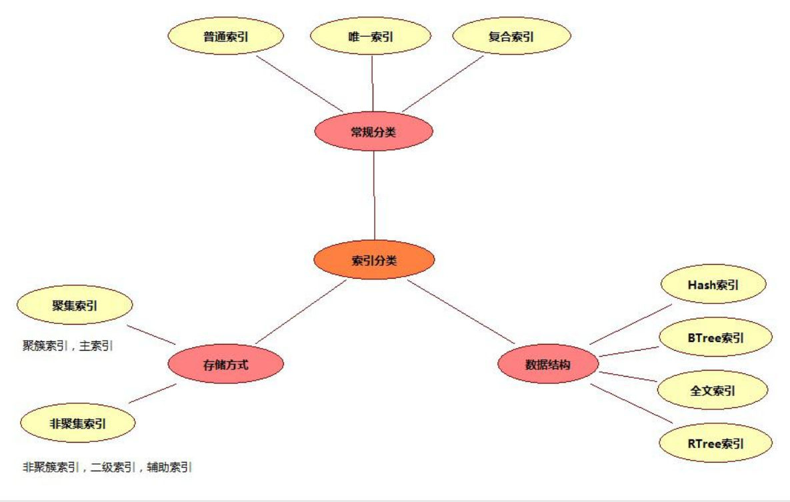
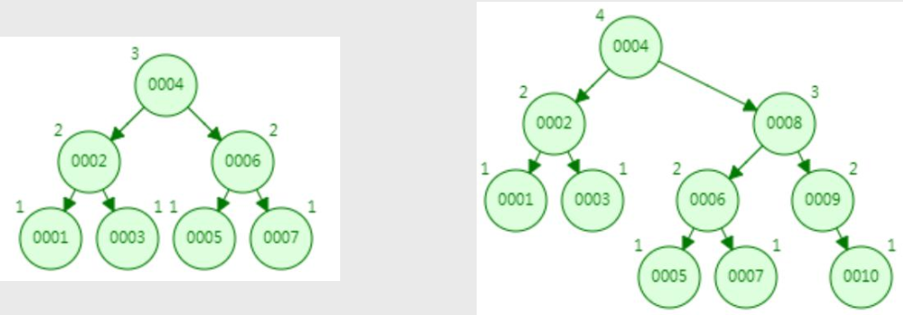
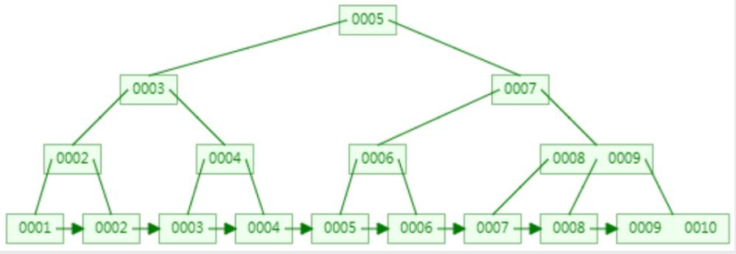
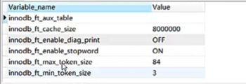

# MySQL

参考：

[MySQL教程：MySQL数据库学习宝典（从入门到精通）](http://c.biancheng.net/mysql/)

[MySQL数据库面试题（2020最新版）](https://thinkwon.blog.csdn.net/article/details/104778621)

## 三大范式

一范式就是属性不可分割

二范式就是要有主键,其他字段都依赖于主键

三范式就是要消除传递依赖,消除冗余,就是各种信息只在一个地方存储,不出现在多张表中

## 数据类型

- 数值数据类型：
  - INT：整数类型，用于存储整数。可以有参数，如INT(11)，表示存储的整数最大为10位数。
  - FLOAT：单精度浮点型，用于存储单精度浮点数。可以存储至多8位十进制数，并在内存中占4字节。
  - DOUBLE：双精度浮点型，用于存储双精度浮点数。可以存储至多18位十进制数，并在内存中占8字节。
  - DECIMAL：十进制类型，用于存储精确的小数。

- 日期和时间数据类型：
  - DATE：日期类型，格式为'YYYY-MM-DD'。
  - TIME：时间类型，格式为'HH:MM:SS'。
  - DATETIME：日期时间类型，格式为'YYYY-MM-DD HH:MM:SS'。
  - TIMESTAMP：时间戳类型，格式为'YYYY-MM-DD HH:MM:SS'，与UNIX时间戳有关。

- 字符串（字符）数据类型：
  - CHAR：定长字符串类型，长度在1到255之间。例如：CHAR(10)可以存储10个字符的字符串。
  - VARCHAR：可变长度字符串类型，长度在1到65535之间。例如：VARCHAR(255)可以存储最多255个字符的字符串。
  - TINYTEXT：非常小的文本类型，最大长度为255个字符。
  - TEXT：小型文本类型，最大长度为65535个字符。
  - MEDIUMTEXT：中型文本类型，最大长度为16777215个字符。
  - LONGTEXT：大型文本类型，最大长度为4294967295个字符。

- 其他数据类型：
  - BINARY：二进制字符串类型，用于存储二进制字符串。
    *VARBINARY：可变长二进制字符串类型，用于存储二进制字符串，长度在1到65535之间。
  - TINYINT：非常小的整数类型，取值范围为-128到127。
  - SMALLINT：小的整数类型，取值范围为-32768到32767。
  - MEDIUMINT：中等大小的整数类型，取值范围为-8388608到8388607。
  - INT和INTEGER：整数类型，取值范围为-2147483648到2147483647。
  - BIGINT：大的整数类型，取值范围为-9223372036854775808到9223372036854775807。

### 说明

#### char

- char表示定长字符串，长度是固定的；

- 如果插入数据的长度小于char的固定长度时，则用空格填充；

- 因为长度固定，所以存取速度要比varchar快很多，甚至能快50%，但正因为其长度固定，所以会占据多余的空间，是空间换时间的做法；

- 对于char来说，最多能存放的字符个数为255，和编码无关；
- 空格表示占位不算一个字符；

**char(10)：** 10位固定字符串，不足补空格，最多10个字符

密码散列，盐，用户身份证号等固定长度的字符串应该使用char而不是varchar来存储，这样可以节省空间且提高检索效率。

#### varchar

- varchar表示可变长字符串，长度是可变的；
- 插入的数据是多长，就按照多长来存储；
- varchar在存取方面与char相反，它存取慢，因为长度不固定，但正因如此，不占据多余的空间，是时间换空间的做法；
- 对于varchar来说，最多能存放的字符个数为65532；
- 空格也按一个字符存储；

**varchar(50)中50的涵义：**最多存放50个字符，varchar(50)和(200)存储hello所占空间一样，但后者在排序时会消耗更多内存，因为order by col采用fixed_length计算col长度(memory引擎也一样)。在早期 MySQL 版本中， 50 代表字节数，现在代表字符数。

#### int

**int(20)中20的涵义:**  是指显示字符的长度，不是存储数据的大小。INT类型是一个有符号整数类型，它占用4个字节（32位），可以表示范围为-2147483648到2147483647的整数。即使在INT(20)中指定了20，也不会改变这个范围。20表示最大显示宽度为20，但仍占4字节存储，存储范围不变，当使用带 zerofill 定义的 int 时，前面补多少个 0，易于报表展示

## 语句类型

SQL（Structure Query Language）结构化查询语言

- DQL（data query language）数据查询语言 select操作
- DML（data manipulation language）数据操作语言，主要是数据库增删改三种操作
- DDL（data defination language）数据库定义语言，主要是建表、删除表、修改表字段等操作
- DCL（data control language）数据库控制语言，如commit，revoke之类的

### 数据定义语言DDL

```java
create table score(
    id int not null auto_increment primary key, 
    name varchar(30) not null comment '学生姓名', 
    course varchar(50) comment '课程名称', 
    grade int comment '成绩' 
)engine=InnoDB default charset=utf8;
```

### 数据操作语言DML

```java
insert into score(name, course, grade) values('张三', '语文', 89);
```

#### drop、delete与truncate

三者都表示删除，但是三者有一些差别：

|          | Delete                                   | Truncate                       | Drop                                                 |
| -------- | ---------------------------------------- | ------------------------------ | ---------------------------------------------------- |
| 类型     | 属于DML                                  | 属于DDL                        | 属于DDL                                              |
| 回滚     | 可回滚                                   | 不可回滚                       | 不可回滚                                             |
| 删除内容 | 表结构还在，删除表的全部或者一部分数据行 | 表结构还在，删除表中的所有数据 | 从数据库中删除表，所有的数据行，索引和权限也会被删除 |
| 删除速度 | 删除速度慢，需要逐行删除                 | 删除速度快                     | 删除速度最快                                         |

因此，在不再需要一张表的时候，用drop；在想删除部分数据行时候，用delete；在保留表而删除所有数据的时候用truncate。

#### merge into

```sql
-- merge into 将源数据(来源于实际的表,视图,子查询)根据条件判断更新或插入到指定的表中(必须实际存在)
-- 这个语法仅需要一次全表扫描就完成了全部工作，执行效率要高于insert＋update，尤其是在大数据量面前，效率越明显。

-- 如果满足连接条件，则更新字段；如果连接条件不满足，则停止更新进行插入。
MERGE INTO table_name 
USING 数据来源表/视图/子查询结果集
ON 连接条件
WHEN MATCHED THEN 
UPDATE ...
WHEN NOT MATCHED THEN
INSERT ...
```

[SQL语句merge into的用法](https://blog.csdn.net/peterwanghao/article/details/107559583)

#### MINUS

```sql
-- MINUS 集合前减后
select id,employee_name from employees 
minus 
select id,employee_name from dependents
order by id;
```

#### 连接方法

```sql
-- 查询多个字段并链接在一起
MySQL: CONCAT()
Oracle: CONCAT(), ||
SQL Server: +

CONCAT(字串1, 字串2, 字串3, ...): 将字串1、字串2、字串3，等字串连在一起。请注意，Oracle的CONCAT()只允许两个参数；
```


### 数据查询语言DQL

#### ORDER BY

字段是整型数字，存储时用了Integer，排序会按照数字大小排序，如：2、4、10、11、31；但是用varchar存储，排序会按照字符排序，如：10、11、2、31、4，这时如果需要按照数字大小排序，先对长度排序，再使用字符排序`ORDER BY LENGTH(num),num`。

#### GROUP BY和HAVING

**语法：**	

```java
//aggregate_function表示聚合函数
SELECT column_name, aggregate_function(column_name)
FROM table_name
WHERE column_name operator value
GROUP BY column_name1,column_name2,...
HAVING aggregate_function(column_name) operator value
```

**说明：**

1. group by可以对一列或多列进行分组

2. SELECT一般只能跟上分组字段和聚合函数
3. WHERE 关键字无法与聚合函数一起使用，HAVING 子句可以对分组后的各组数据进行筛选，也可以对聚合函数进行判断

#### group_concat

group_concat配合group by一起使用，用于将某一列的值按指定的分隔符进行拼接，MySQL默认的分隔符为逗号。

**语法**

```java
group_concat([distinct] column_name [order by column_name asc/desc ] [separator '分隔符'])
```

**实例**

```java
>select * from employee;
id name dept
1 张三 部门A
2 李洁 部门C
3 李小梅 部门A
4 欧阳辉 部门C
5 李芳 部门A

>select dept,group_concat(name) from employee group by dept;
dept group_concat(name)
部门A  张三,李小梅,李芳   
部门C  李洁,欧阳辉
```

#### distinct

distinct用于在查询中返回列的唯一不同值（去重复），支持单列或多列。

**语法**

```java
//DISTINCT直接放在SELECT后面且DISTINCT后面跟的所有列都会加入去重，此时当column_name1, column_name2,...有任何一个不一样都会查出一行数据
SELECT DISTINCT column_name1, column_name2,... FROM table_name;
```

#### 表连接

**语法**

```mysql
#where
SELECT table1.column, table2.column 
FROM table1, table2 
WHERE table1.column1 = table2.column2;
```

**分类**

- `内连接`：使用`where、 join、inner join`，只连接匹配的行

  - `自连接`：同一张表内的连接，相互连接的表在物理上同为一张表，但是逻辑上是多张表

    ```mysql
    SELECT * FROM A T1 INNER JOIN A T2 ON T1.id=T2.pid
    ```

- `外连接`：
  
  - `左外连接，left join`，包含左表的全部行（不管右表是否存在与之匹配的行），以及右表中全部匹配的行
  
  - `右外连接，right join`，包含右表的全部行（不管左表是否存在与之匹配的行），以及左表中全部匹配的行
  
  - `全外连接，full join`，包含左右两个表的全部行（不管在另一个表中是否存在与之匹配的行），
  
    - MySQL不支持全连接，但是可以使用`LEFT JOIN 和UNION和RIGHT JOIN`联合使用来替代
  
    ```mysql
    SELECT * FROM A LEFT JOIN B ON A.id=B.id UNION SELECT * FROM A RIGHT JOIN B ON A.id=B.id
    ```

- `交叉连接（cross join）`：没有用where子句的交叉连接将产生笛卡尔积，第一个表的行数乘以第二个表的行数等于笛卡尔积
  和结果集的大小。这种连接需要尽量避免。比如：

  ```mysql
  SELECT table1.column, table2.column FROM table1, table2;
  ```

- `联合查询（UNION与UNION ALL）`

  ```mysql
  SELECT * FROM A UNION SELECT * FROM B UNION ...
  ```

  - 就是把多个结果集集中在一起，UNION前的结果为基准，需要注意的是联合查询的列数要相等，相同的记录行会合并
  - union会自动压缩多个结果集合中的重复结果，而union all则将所有的结果全部显示出来，也就是union会去重，union all不会
  - 但是效率 UNION ALL 高于 UNION
  - Union在去重的同时会进行默认规则的排序

#### 子查询

一条SQL语句的查询结果做为另一条查询语句的条件或查询结果，其中多条SQL语句嵌套使用，内部的SQL查询语句称为子查询。

- **子查询in**

  ```mysql
  #子查询in语法
  SELECT column_name FROM table_name 
  WHERE column_name IN(
   SELECT column_name FROM table_name [WHERE]
  );
  ```

- **子查询exists**

  EXISTS是子查询中用于测试内部查询是否返回任何行的布尔运算符。**将主查询的数据放到子查询中做条件验证**，根据验证结果（TRUE 或 FALSE）来决定主查询的数据结果是否保留。
  
  ```mysql
  #where子句使用exists语法
  SELECT t1.* 
  FROM table_name1 t1
  WHERE EXISTS (SELECT * FROM table_name2 t2 WHERE t1.column_name=t2.column_name);
  ```
  
  ```mysql
  #查找有成绩的学生
  >select A.* from student A where exists(select * from score B where A.stu_id=B.stu_id);
  
  stu_id name address
   1     张三	贵州
   2     李四	陕西
  ```

- **mysql中 in 和 exists 区别**

  mysql中的in语句是把外表和内表作hash 连接，而exists语句是对外表作loop循环，每次loop循环再对内表进行查询。一直大家都认为exists比in语句的效率要高，这种说法其实是不准确的。这个是要区分环境的。

  - 如果查询的两个表大小相当，那么用in和exists差别不大。

  - 如果两个表中一个较小，一个是大表，则子查询表大的用exists，子查询表小的用in。

  - `not in 和not exists`：如果查询语句使用了not in，那么内外表都进行全表扫描，没有用到索引；而not extsts的子查询依然能用到表上的索引。所以无论那个表大，用not exists都比not in要快。

#### 分页

LIMIT 子句可以被用于强制 SELECT 语句返回指定的记录数。LIMIT 接受一个或两个数字参数。参数必须是一个整数常量。

```mysql
#如果给定两个参数，第一个参数指定第一个返回记录行的偏移量，第二个参数指定返回记录行的最大数目。初始记录行的偏移量是 0(而不是 1)
mysql> SELECT * FROM table LIMIT 5,10; # 检索记录行 6-15 

#为了检索从某一个偏移量到记录集的结束所有的记录行，可以指定第二个参数为 -1
mysql> SELECT * FROM table LIMIT 95,-1; # 检索记录行 96-last. 

#如果只给定一个参数，它表示返回最大的记录行数目
mysql> SELECT * FROM table LIMIT 5; #检索前 5 个记录行 
```

#### case when then

```sql
--简单case函数
case sex
  when '1' then '男'
  when '2' then '女'
  else '其他' end
  
--case搜索函数
case when sex = '1' then '男'
     when sex = '2' then '女'
     else '其他' end  
```

```sql
> select u.id,u.name,u.sex,
      (case u.sex
        when 1 then '男'
        when 2 then '女'
        else '空的'
        end
       )性别
    from users u;
 
id name                        sex	 性别
--------------------------------------------
1 张一                            	空的
2 张二                          1 	男
3 张三                            	空的
4 张四                            	空的
5 张五                          2 	女
6 张六                          1 	男
7 张七                          2 	女
8 张八                          1 	男

8 rows selected
```

```sql
> select
      sum(case u.sex when 1 then 1 else 0 end)男性,
      sum(case u.sex when 2 then 1 else 0 end)女性,
      sum(case when u.sex <>1 and u.sex<>2 then 1 else 0 end)性别为空
    from users u;
 
男性         女性       性别为空
---------- ---------- ----------
 3          2          0
```

### 数据控制语言DCL

#### 用户管理

```mysql
#创建用户，用户创建后没有任何权限
>CREATE USER '用户名' [@'主机名'] [IDENTIFIED BY '密码'];
#注意：MySQL的用户账号由两部分组成：用户名和主机名，即用户名@主机名，主机名可以是IP或机器名称,主机名为%表示允许任何地址的主机远程登录MySQL数据库。
#删除用户
>DROP USER '用户名' [@'主机名'];
#修改密码
>ALTER USER '用户名'@'主机名' IDENTIFIED BY '新密码';
```

#### 权限体系

MySQL的权限体系大致分为5个层级，全局层级、数据库层级、表层级、列层级和子程序层级。

- **全局层级** 适用于一个给定服务器中的所有数据库。这些权限存储在mysql.user表中。`GRANT ALL ON *.*`和`REVOKE ALL ON *.*`只授予和撤销全局权限。

- **数据库层级** 适用于一个给定数据库中的所有目标。这些权限存储在mysql.db和mysql.host表中。
  `GRANT ALL ON db_name.*`和`REVOKE ALL ON db_name.*`只授予和撤销数据库权限

- **表层级** 适用于一个给定表中的所有列。这些权限存储在mysql.talbes_priv表中。
  `GRANT ALL ON db_name.tbl_name`和`REVOKE ALL ON db_name.tbl_name`只授予和撤销表权限

- **列层级** 适用于一个给定表中的单一列。这些权限存储在mysql.columns_priv表中。当使用REVOKE时，您必须指定与被授权列相同的列

- **子程序层级** CREATE ROUTINE, ALTER ROUTINE, EXECUTE和GRANT权限适用于已存储的子程序。这些权限可以被授予为全局层级和数据库层级。而且，除了CREATE ROUTINE外，这些权限可以被授予为子程序层级，并存储在mysql.procs_priv表中。

MySQL的权限信息主要存储在以下几张表中，当用户连接数据库时，MySQL会根据这些表对用户
进行权限验证。

- **user** 用户权限表，记录账号、密码及全局性权限信息
- **db** 记录数据库相关权限
- **table_priv** 用户对某个表拥有的权限
- **column_priv** 用户对某表的某个列所拥有的权限
- **procs_priv** 用户对存储过程及存储函数的操作权限

#### 权限管理

```mysql
#授权
>grant all privileges on databaseName.tableName to '用户名' [@'主机名'] ;
#撤销授权
>revoke all privileges on databaseName.tableName from '用户名' [@'主机名'] ;
#刷新权限
>FLUSH PRIVILEGES;
#查看权限
>show grants for '用户名' [@'主机名'] ;
```

#### 权限列表

使用grant和revoke进行授权、撤销授权时，需要指定具体是哪些权限，这些权限大体可以分为3类，数据类、结构类和管理类。

- **数据** 	SELECT	INSERT	UPDATE	DELETE	FILE
- **结构**	CREATE	ALTER	INDEX	DROP	CREATE TEMPORARY TABLES	SHOW VIEW	CREATE ROUTINE	ALTER ROUTINE	EXECUTE	CREATE VIEW	EVENT	TRIGGER
- **管理**	USAGE	GRANT	SUPER	PROCESS	RELOAD	SHUTDOWN	SHOW DATABASES	LOCK TABLES	REFERENCES	REPUCATION CUENT	REPUCATION SLAVE	CREATE USER

#### 禁止root用户远程登录

```mysql
#保证用户表中不存在root@%用户即可
>use mysql;
>select user,host from user;
```

#### 忘记root密码

windows+mysql8

```sh
#关闭权限验证
mysqld --defaults-file="C:\ProgramData\MySQL\MySQL Server 8.0\my.ini" --console --skip-grant-tables --shared-memory
```

说明：参数--defaults-file的值为配置文件my.ini的完整路径。


MySQL关闭权限验证后，直接通过 mysql 命令即可连接到数据库，并可正常执行各类操作。

```mysql
#刷新权限
>FLUSH PRIVILEGES;
#修改root用户的密码
>ALTER USER 'root'@'localhost' IDENTIFIED BY '123456';
```

## SQL约束

- NOT NULL: 用于控制字段的内容一定不能为空（NULL）。
- UNIQUE: 控件字段内容不能重复，一个表允许有多个 Unique 约束。
- PRIMARY KEY: 也是用于控件字段内容不能重复，但它在一个表只允许出现一个。
- FOREIGN KEY: 用于预防破坏表之间连接的动作，也能防止非法数据插入外键列，因为它必须是它指向的那个表中的值之一。
- CHECK: 用于控制字段的值范围。

**注意：**

字段一般要求定义为`not null`，因为null值会占用更多的字节，且会在程序中造成很多与预期不符的情况。

## MySQL键

- 超键：在关系中能唯一标识元组的属性集称为关系模式的超键。一个属性可以为作为一个超键，多个属性组合在一起也可以作为一个超键。超键包含候选键和主键。
- 候选键：是最小超键，即没有冗余元素的超键。
- 主键：数据库表中对储存数据对象予以唯一和完整标识的数据列或属性的组合。一个数据列只能有一个主键，且主键的取值不能缺失，即不能为空（Null）。
- 外键：在一个表中存在的另一个表的主键称此表的外键。

### 主键

推荐使用自增ID，不要使用UUID。

因为在InnoDB存储引擎中，主键索引是作为聚簇索引存在的，也就是说，主键索引的B+树叶子节点上存储了主键索引以及全部的数据(按照顺序)，如果主键索引是自增ID，那么只需要不断向后排列即可，如果是UUID，由于到来的ID与原来的大小不确定，会造成非常多的数据插入，数据移动，然后导致产生很多的内存碎片，进而造成插入性能的下降。

总之，在数据量大一些的情况下，用自增主键性能会好一些。


### 外键和外键约束

#### 外键

表一的主键字段X在另外一张表二中存在，且不是主键，则字段X称为表二的外键；其中表一称为主键表(父表，主表)，表二称为外键表(从表，外表); 

如：字段depart_id就是学生表的外键，这里的外键表是学生表，主键表是院系表。

```mysql
#学生表
create table student(
    id int not null auto_increment primary key, 
    name varchar(30) not null comment '学生姓名',
    depart_id varchar(10) not null comment '院系ID'
)engine=InnoDB default charset=utf8;

#院系表
create table depart(
    id int not null auto_increment primary key, 
    name varchar(30) not null comment '院系名称'
)engine=InnoDB default charset=utf8;
```

#### 外键实现

**定义外键时，需要遵守下列规则：**

- 主表必须已经存在于数据库中，或者是当前正在创建的表。如果是后一种情况，则主表与从表是同一个表，这样的表称为自参照表，这种结构称为自参照完整性。
- 外键的取值要么取父表中字段对应的值，要么取NULL值;并且外键中列的数据类型必须和主表主键中对应列的数据类型相同。
- 主表中有多个主键时，外键中列的数目必须和主表的主键中列的数目相同。

##### 在创建表时设置外键约束

```mysql
[CONSTRAINT <外键名>]    FOREIGN KEY 字段名 [，字段名2，…]    REFERENCES <主表名> 主键列1 [，主键列2，…]
```

```mysql
#父表
create table parent(
　　id number primary key,
　　name varchar2(30),
);

#子表
create table child(
    id number primary key,
    name varchar2(30),
    #1、
    parent_id number,
    constraint child_fid_fk foreign key(parent_id) references parent(id)
    #2、也可以直接在字段上定义
    parent_id number constraint child_fid_fk references parent(id)
);
```

##### 在修改表时添加外键约束

前提是从表中外键列中的数据必须与主表中主键列中的数据一致或者是从表没有数据

```mysql
ALTER TABLE <数据表名> 
ADD CONSTRAINT <外键名> 
FOREIGN KEY(<列名>) REFERENCES <主表名> (<列名>);
```

```mysql
ALTER  TABLE child 
ADD  CONSTRAINT child_fid_fk 
FOREIGN  KEY (parent_id)  REFERENCES  parent(id);
```

##### 删除外键约束

外键一旦删除，就会解除主表和从表间的关联关系。

```mysql
ALTER TABLE <表名> 
DROP FOREIGN KEY <外键约束名>;
```

```mysql
ALTER  TABLE child 
DROP FOREIGN KEY child_fid_fk;
```

**注意：**

使用`casecade constraints`解除关联就可以删除父表

```mysql
drop table parent cascade constranints;
```

#### Mysql外键设置

##### on delete 规则

- `CASCADE`：级联删除，就是删除主键表的同时，外键表同时删除。

- `NO ACTION`(非活动，默认)、`RESTRICT`：约束/限制
  当取值为`No Action`或者`Restrict`时，则当在主键表中删除对应记录时，首先检查该记录是否有对应外键，如果有则不允许删除。（即外键表约束主键表）

  - `NO ACTION`和`RESTRICT`的区别：只有在及个别的情况下会导致区别，前者是在其他约束的动作之后执行，后者具有最高的优先权执行。

- `SET NULL`：级联置空

  当取值为Set Null时，则当在主键表中删除对应记录时，首先检查该记录是否有对应外键，如果有则设置子表中该外键值为null(外键表约束主键表，不过这就要求该外键允许取null)。

```mysql
create table child(
    id number primary key,
    name varchar2(30),
    #parent_id number constraint child_fid_fk references parent(id) on delete set null
    parent_id number constraint child_fid_fk references parent(id) on delete cascade
);
```

参考：[外键约束](https://www.cnblogs.com/cjaaron/p/9216839.html)

## 表空间

### 概念

　　从 InnoDB存储引擎的逻辑存储结构看，所有数据都被逻辑地存放在一个空间中，称之为表空间( tablespace)。表空间又由段(segment)、区( extent)、页(page)组成，页在一些文档中有时也称为块( block) 。每个**表空间由一个或多个数据文件组成**，一个数据文件只能与一个表空间相联系。 

数据表是逻辑上的概念，**表空间是物理层面的概念**，在innodb存储引擎中数据是按照表空间来组织存储的，表空间文件对应着磁盘上的物理文件。 

#### 系统表空间

**查看系统表空间参数：**

```mysql
mysql> show variables like '%inndb_data_file_path%';

Variable_name			Value
innodb_data_file_path	ibdata1:12M:autoextend
```

Value部分的的组成是：name:size:attributes

默认情况下，MySQL会初始化一个大小为12MB，名为ibdata1文件，并且随着数据的增多，它会自动扩容。

这个ibdata1文件是**系统表空间**，也是默认的表空间，也是默认的表空间物理文件，也是共享表空间。

**配置系统表空间：**

系统表空间的数量和大小可以通过启动参数：innodb_data_file_path

```cnf
# my.cnf
[mysqld]
innodb_data_file_path=/dir1/ibdata1:2000M;/dir2/ibdata2:2000M:autoextend
```

#### 独占表空间

**启用独占表空间参数：**

```sh
让每一个数据库表都有一个单独的表空间文件的话，可以通过参数innodb_file_per_table设置。这个参数只有在MySQL5.6或者是更高的版本中才可以使用。

配置文件：
[mysqld]
innodb_file_per_table=ON

命令：
mysql> SET GLOBAL innodb_file_per_table=ON; 
```

之后InnoDB存储引擎产生的表都会自己独立的表空间文件。

独立的表空间文件命名规则：表名.ibd，独立表空间文件中仅存放该表对应数据、索引、insert buffer bitmap。

其余的诸如：undo信息、insert buffer 索引页、double write buffer 等信息依然放在默认表空间，也就是共享表空间中。

#### 临时表空间

**查看临时表空间参数：**

临时表空间用于存放用户创建的临时表和磁盘内部临时表。

```mysql
-- 参数innodb_temp_data_file_path定义了临时表空间的一些名称、大小、规格属性。
mysql> show variables like '%innodb_temp_data_file_path%';
Variable_name				Value
innodb_temp_data_file_path	ibtmp1:12M:autoextend

-- 查看临时表空间文件存放的目录
mysql> show variables like '%innodb_data_home_dir%';
Variable_name				Value
innodb_data_home_dir		/home/mysql/mysql/var
```

#### 撤销表空间

用来帮助回退未提交的事务数据

### 表碎片清理和表空间收缩

当你删除数据时，mysql并不会回收，被已删除数据的占据的存储空间，以及索引位。而是空在那里，而是等待新的数据来弥补这个空缺。

```mysql
-- 清理碎片后 tablename.ibd 文件磁盘空间减小,该方案基于独立表空间存储方式
> OPTIMIZE TABLE [tablename],当然这种方式只适用于独立表空间

清除碎片的优点:
  　　降低访问表时的IO,提高mysql性能,释放表空间降低磁盘空间使用率。
```

```mysql
-- 如：
> OPTIMIZE TABLE ipvacloud.report_site_day;
对myisam表有用  对innodb也有用，系统会自动把它转成 ALTER TABLE  report_site_day ENGINE = Innodb; 这是因为optimize table的本质，就是alter table，所以不管myisam引擎还是innodb引擎都可以使用OPTIMIZE TABLE回收表空间。
```


#### 存储模式

**MySQL5.5默认是共享表空间 ，5.6中默认是独立表空间(表空间管理类型就这2种)** 

独立表空间 就是采用和MyISAM 相同的方式, 每个表拥有一个独立的数据文件( .idb )

1.每个表都有自已独立的表空间。
2.每个表的数据和索引都会存在自已的表空间中。
3.可以实现单表在不同的数据库中移动(将一个库的表移动到另一个库里,可以正常使用)。
4.drop table自动回收表空间 ，删除大量数据后可以通过alter table XX engine = innodb;回收空间。

**查看表空间文件：**

```sh
# oa是数据库名称
$ ll /usr/local/mysql/data/oa
......
flowtemplate.ibd	# 以.ibd文件结尾的是表flowtemplate对应的独立表空间文件
t3.frm			#以frm结尾的是该表的表结构定义文件
......
```

**InnoDB引擎 frm ibd文件说明：**
   1.frm ：描述表结构文件，字段长度等
   2.ibd文件 
         **a如果采用独立表存储模式(5.6)，data\a中还会产生report_site_day.ibd文件（存储数据信息和索引信息）**

​         D:\java\mysql5.6\data\ipvacloudreport_site_day.frm 和

​         D:\java\mysql5.6\data\ipvacloud\report_site_day.ibd

​         **b如果采用共享存储模式(5.5)，数据信息和索引信息都存储在ibdata1中**
​          (其D:\java\mysql5.6\data\目录下没有.ibd文件,只有frm文件)


[MySQL的表空间](https://www.cnblogs.com/better-farther-world2099/articles/14713523.html)


## 索引

索引是一种特殊的文件(InnoDB数据表上的索引是表空间的一个组成部分)，它们包含着对数据表里所有记录的引用指针。更通俗的说，索引就相当于目录。为了方便查找书中的内容，通过对内容建立索引形成目录。索引是一个文件，它是要占据物理空间的。

索引是一种数据结构。数据库索引，是数据库管理系统中一个排序的数据结构，以协助快速查询、更新数据库表中数据。索引的实现通常使用B树及其变种B+树。

### 优缺点

**索引的优点**

- 可以大大加快数据的检索速度，这也是创建索引的最主要的原因。
- 通过使用索引，可以在查询的过程中，使用优化隐藏器，提高系统的性能。

**索引的缺点**

- 时间方面：创建索引和维护索引要耗费时间，具体地，当对表中的数据进行增加、删除和修改的时候，索引也要动态的维护，会降低增/改/删的执行效率；
- 空间方面：索引需要占物理空间。

### 索引种类



- **普通索引** 最基本的索引，没有任何限制，仅加速查询。
- **唯一索引** 索引列的值必须唯一，但允许有空值。
- **主键索引** 一种特殊的唯一索引，不允许有空值。一般是在建表的同时自动创建主键索引。
- **复合索引** 两个或多个列上的索引被称作复合索引。
- **全文索引** 对文本内容进行分词索引。

### 索引使用

```mysql
1、创建索引
# 创建普通索引
>CREATE INDEX indexName ON tableName(columnName(length)); 
# 创建唯一索引
>CREATE UNIQUE INDEX indexName ON tableName(columnName(length)); 
# 创建复合索引
>CREATE INDEX indexName ON tableName(columnName1, columnName2, …);
#可以使用上述方法可对表增加普通索引或UNIQUE索引，但是，不能创建PRIMARY KEY索引

#使用ALTER TABLE命令去增加索引,可以用来创建普通索引、UNIQUE索引或PRIMARY KEY索引
>ALTER TABLE table_name ADD INDEX index_name (column_list);

2、删除索引
>DROP INDEX [indexName] ON tableName; 
#根据索引名删除普通索引、唯一索引、全文索引
>alter table 表名 drop KEY 索引名

3、查看索引
>SHOW INDEX FROM tableName;
```

```java
>create table tableName(
	a int,
    ...
    index indexName(columnName1, columnName2, …)
);

>show create table tableName\G;
CTEATE TABLE tableName(
	a int(11) DEFAULT NULL,
    ...
    KEY indexName(columnName1, columnName2, …)
)engine=InnoDB default charset=utf8;
```

### 建立索引注意点

- 选择区分度高的列建立索引
- 使用短索引，如果对长字符串列进行索引，应该指定一个前缀长度，这样能够节省大量索引空间
- 不要过度索引。索引需要额外的磁盘空间，并降低写操作的性能。在修改表内容的时候，索引会进行更新甚至重构，索引列越多，这个时间就会越长。所以只保持需要的索引有利于查询即可。
- 较频繁作为查询条件的字段才去创建索引，更新频繁字段不适合创建索引
- 定义有外键的数据列一定要建立索引。

### 索引查询效率

通常，通过索引查询数据比全表扫描要快。但是我们也必须注意到它的代价。

索引需要空间来存储，也需要定期维护， 每当有记录在表中增减或索引列被修改时，索引本身也会被修改。 这意味着每条记录的INSERT，DELETE，UPDATE将为此多付出4，5 次的磁盘I/O。 因为索引需要额外的存储空间和处理，那些不必要的索引反而会使查询反应时间变慢。使用索引查询不一定能提高查询性能，索引范围查询(INDEX RANGE SCAN)适用于两种情况:

- 基于一个范围的检索，一般查询返回结果集小于表中记录数的30%
- 基于非唯一性索引的检索

### MySQL索引原理之B+Tree

```java
CREATE [UNIQUE | FULLTEXT | SPATIAL] INDEX index_name
    [index_type]
    ON tbl_name (key_part,...)
    [index_option]
    [algorithm_option | lock_option] ...

key_part: {col_name [(length)] | (expr)} [ASC | DESC]

index_option: {
    KEY_BLOCK_SIZE [=] value
  | index_type
  | WITH PARSER parser_name
  | COMMENT 'string'
  | {VISIBLE | INVISIBLE}
  | ENGINE_ATTRIBUTE [=] 'string'
  | SECONDARY_ENGINE_ATTRIBUTE [=] 'string'
}

index_type:
    USING {BTREE | HASH}

algorithm_option:
    ALGORITHM [=] {DEFAULT | INPLACE | COPY}

lock_option:
    LOCK [=] {DEFAULT | NONE | SHARED | EXCLUSIVE}
```

参考：[MYSQL官网8.0文档](https://dev.mysql.com/doc/refman/8.0/en/create-index.html)

#### 索引类型

索引是存储引擎用于快速查找记录的一种数据结构，不同的存储引擎支持的索引类型不一样，MySQL中主要使用的索引结构类型是Hash和B+Tree。  

| 存储引擎    | 支持的索引类型 |
| ----------- | -------------- |
| InnoDB      | BTREE          |
| MyISAM      | BTREE          |
| MEMORY/HEAP | HASH, BTREE    |
| NDB         | HASH, BTREE    |

#### 哈希索引

哈希索引基于哈希表实现，它根据给定的哈希函数Hash(Key)和处理冲突（不同索引列值有相同的哈希值）方法将每一个索引列值都映射到一个固定长度的地址，哈希索引只存储哈希值和行指针。
【结论】
1）哈希索引只支持等值比较，包括=、in()、<=>，查询速度非常快。需求为单条记录查询的时候，可以选择哈希索引。
2）在hash索引中经过hash函数建立索引之后，索引的顺序与原顺序无法保持一致，不能支持范围查询。


#### 二叉查找树  

二叉查找树，也称之为二叉搜索树、二叉排序树，它的每个节点最多有两个子节点，左子树上的节点值均小于它的根节点值，右子树上的节点值均大于它的根节点值，左右子树也分别是二叉排序树

【结论】
1）二叉查找树可以做范围查询。
2）但是极端情况下，二叉树会退化成线性链表，二分查找也会退化成遍历查找。  


#### 红黑树

二叉查找树存在不平衡的问题，因此就有了自平衡二叉树，能够自动旋转和调整，让树始终处于平衡状态，常见的自平衡二叉树有红黑树和AVL树。红黑树是一种自平衡的二叉查找树。
【结论】
1）通过自平衡解决了二叉查找树有可能退化成线性链表的问题。
2）但是极端情况下，红黑树有“右倾”趋势，并没有真正解决树的平衡问题  


#### 平衡二叉树

平衡二叉树，又称AVL树，指的是左子树上的所有节点的值都比根节点的值小，而右子树上的所有节点的值都比根节点的值大，且左子树与右子树的高度差最大为1。
【结论】
1）AVL树从根本上解决了红黑树的“右倾”问题，查找效率得到提升，无极端低效情况。
2）数据库查询的瓶颈在磁盘I/O，数据量很大的情况下，AVL树的高度会很高，查询需要更多I/O。  



#### B-Tree

B-Tree，即B树（不要读成B减树），它是一种多路搜索树（多叉树），可以在平衡二叉树的基础上降低树的高度，从而提升查找效率。
【结论】

- B树通过多叉、一个节点可有多个值，有效地控制了树的高度，比平衡二叉树查询效率高。但是范围查询的效率仍然有待提升  
- B树中，键和值一起存放在内部节点和叶子节点


#### B+Tree

B+Tree是B树的变体，比B树有更广泛的应用。
【结论】

- B+Tree在叶子节点增加了有序链表，包含了所有节点，非常适合范围查询。非叶子节点存在部分冗余。  

- B+树中，内部节点都是键，没有值，叶子节点同时存放键和值



#### B树和B+树比较

- B树只适合随机检索，而B+树同时支持随机检索和顺序检索；
- B+树空间利用率更高，可减少I/O次数，磁盘读写代价更低。一般来说，索引本身也很大，不可能全部存储在内存中，因此索引往往以索引文件的形式存储的磁盘上。这样的话，索引查找过程中就要产生磁盘I/O消耗。B+树的内部结点并没有指向关键字具体信息的指针，只是作为索引使用，其内部结点比B树小，盘块能容纳的结点中关键字数量更多，一次性读入内存中可以查找的关键字也就越多，相对的，IO读写次数也就降低了。而IO读写次数是影响索引检索效率的最大因素；
- B+树的查询效率更加稳定。B树搜索有可能会在非叶子结点结束，越靠近根节点的记录查找时间越短，只要找到关键字即可确定记录的存在，其性能等价于在关键字全集内做一次二分查找。而在B+树中，顺序检索比较明显，随机检索时，任何关键字的查找都必须走一条从根节点到叶节点的路，所有关键字的查找路径长度相同，导致每一个关键字的查询效率相当。
- B-树在提高了磁盘IO性能的同时并没有解决元素遍历的效率低下的问题。B+树的叶子节点使用指针顺序连接在一起，只要遍历叶子节点就可以实现整棵树的遍历。而且在数据库中基于范围的查询是非常频繁的，而B树不支持这样的操作。
- 增删文件（节点）时，效率更高。因为B+树的叶子节点包含所有关键字，并以有序的链表结构存储，这样可很好提高增删效率。

索引列的值就是key

参考：[数据结构在线模拟工具](https://www.cs.usfca.edu/~galles/visualization/Algorithms.html)

### MyISAM与InnoDB索引结构  

```java
//对两种引擎的表分别进行插入操作
insert into t_myisam(id, a, b) values(5, 2, 7);
insert into t_myisam(id, a, b) values(8, 11, 5);
insert into t_myisam(id, a, b) values(4, 9, 3);
insert into t_myisam(id, a, b) values(2, 5, 1);
insert into t_myisam(id, a, b) values(6, 0, 2);
insert into t_myisam(id, a, b) values(1, 4, 4);
insert into t_myisam(id, a, b) values(7, 3, 8);
insert into t_myisam(id, a, b) values(3, 6, 9);
//使用select * from table发现MyISAM中的数据会按照插入的顺序排序，InnoDB会按照主键顺序排序。
```


#### MyISAM的索引结构

MyISAM存储引擎使用B+Tree作为索引结构，叶子节点的data域存放的是数据记录的地址。因此索引检索会按照B+Tree的检索算法检索索引，如果指定的Key存在，则取出其data域的值（地址），然后根据地址读取相应的数据记录。

在MyISAM中，主索引和辅助索引（Secondary key）在结构上没有任何区别，只是主索引要求key是唯一的，而辅助索引的key可以重复。


#### InnoDB的索引结构

InnoDB存储引擎也使用B+Tree作为索引结构，索引的key是数据表的主键，叶子节点的data域保存了完整的数据记录。MyISAM索引文件和数据文件是分离的，索引文件仅保存数据记录的地址；InnoDB只有一个表数据文件，它本身就是主索引文件。  

其中主键索引data存放的是数据，辅助索引data存放的是主键。

**回表查询**：先定位主键值，再定位行记录，它的性能较扫一遍索引树更低。


#### 聚簇索引和非聚簇索引

- 聚簇索引：将数据存储与索引放到了一块，找到索引也就找到了数据，比如innodb的主键索引，在InnoDB中，只有主键索引是聚簇索引，如果没有主键，则挑选一个唯一键建立聚簇索引。如果没有唯一键，则隐式的生成一个键来建立聚簇索引。
- 非聚簇索引：将数据和索引分开存储，索引结构的叶子节点指向了数据的对应行，比如myisam的索引和innodb的辅助索引

当查询使用聚簇索引时，在对应的叶子节点，可以获取到整行数据，因此不用再次进行回表查询。使用非聚簇索引，如果查询语句所要求的字段是否全部命中了索引，也可以不用再进行回表查询，否则需要进行二次查询。换句话说，B+树在满足聚簇索引和覆盖索引的时候不需要回表查询数据。

举个简单的例子，假设我们在员工表的年龄上建立了索引，那么当进行`select age from employee where age < 20`的查询时，在索引的叶子节点上，已经包含了age信息，不会再次进行回表查询。


#### 复合索引的底层结构

假定，对people表创建复合索引(last_name, first_name, birthday) ，索引的多个值会按照定义索引时字段的顺序进行排序。

1. 复合索引先按照第一列 last_name 进行排序存储；当 last_name 相同时，则根据 first_name 进行排序；当 last_name 和 first_name 都相同时，则根据 birthday 进行排序。
2. 从图不难看出，该索引结构对于全值匹配、匹配最左前缀、匹配列前缀、匹配范围值、精确匹配某一列并范围匹配另外一列等类型的查询都是有效的。  


### 索引优化使用

不要想着为每个字段建立索引，因为优先使用索引的优势就在于其体积小。

#### 复合索引

##### 前导列特性

在MySQL中，如果创建了复合索引(name, salary, dept)，就相当于创建了(name, salary, dept)、(name, salary)和(name)三个索引，这被称为复合索引前导列特性，因此在创建复合索引时应该将最常用作查询条件的列放在最左边，依次递减。

```mysql
#未使用索引
>select * from employee where salary=8800;
>select * from employee where dept='部门A';
>select * from employee where salary=8800 and dept='部门A';
#使用索引
>select * from employee where name='liufeng';
>select * from employee where name='liufeng' and salary=8800;
>select * from employee where name='liufeng' and salary=8800 and dept='部门A';
>select * from employee where name='liufeng' and dept='部门A';#这里的name也使用了索引
```

##### 最左前缀匹配原则

- 顾名思义，就是最左优先，在创建多列索引时，要根据业务需求，where子句中使用最频繁的一列放在最左边。
- 最左前缀匹配原则，非常重要的原则，mysql会一直向右匹配直到遇到范围查询(>、<、between、like)就停止匹配，比如a = 1 and b = 2 and c > 3 and d = 4 如果建立(a,b,c,d)顺序的索引，d是用不到索引的，如果建立(a,b,d,c)的索引则都可以用到，a,b,d的顺序可以任意调整。
- =和in可以乱序，比如a = 1 and b = 2 and c = 3 建立(a,b,c)索引可以任意顺序，mysql的查询优化器会帮你优化成索引可以识别的形式

##### 查询索引列

覆盖索引中，select的数据列只从索引中就能得到，不用再扫描数据表，也就是只需扫描索引就可以得到查询结果。但是并非所有类型的索引都可以作为覆盖索引，覆盖索引必须要存储索引列的值。像哈希索引、空间索引、全文索引等并不会真正存储索引列的值。

当一个查询使用了覆盖索引，在查询分析器EXPLAIN的Extra列可以看到`“Using index”` 。

#### 前缀索引

语法：`index(field(10))`，使用字段值的前10个字符建立索引，默认是使用字段的全部内容建立索引。

前提：前缀的标识度高。比如密码就适合建立前缀索引，因为密码几乎各不相同。

实操的难度：在于前缀截取的长度。

我们可以利用`select count(*)/count(distinct left(password,prefixLen));`，通过从调整prefixLen的值（从1自增）查看不同前缀长度的一个平均匹配度，接近1时就可以了（表示一个密码的前prefixLen个字符几乎能确定唯一一条记录）


#### 降序索引

在MySQL 8.0之前，索引都是按升序创建的，虽然语法上支持DESC，但创建的仍然是升序索引。  

```java
>CREATE INDEX indexName ON tableName(columnName1 asc, columnName2 desc, …);
```

如果某个查询需要对多个列进行排序（有降序、也有升序），并且排序条件与索引列不一致，或没有对排序列创建索引，数据库都会进行额外的外部排序filesort，此时就可以考虑使用降序索引进行优化。  

```java
//当不存在a desc,b asc这样的索引，数据库就会进行额外排序，使用explain中Extra：Using filesort
>select * from tableName order by a desc,b asc\G;

//创建索引加快查询效率
>create table t1(
	a int,
	b int,
	index a_desc_b_asc(a desc, b asc)
);
```

#### join

对`join`语句匹配关系（`on`）涉及的字段建立索引能够提高效率

#### 排序和分组

确保`GROUP BY`和`ORDER BY`只有一个表中的列，这样MySQL才有可能使用索引

#### like '%xxx'不会使用索引  

B+Tree索引可以用于在表达式中对字段进行比较，如=、>、>=、<、<=和Between。索引同样也可以用在LIKE语句中，只要参数不是以通配符开头的字符串。  

```java
//如：
SELECT * FROM tbl_name WHERE key_col LIKE 'Patrick%';
SELECT * FROM tbl_name WHERE key_col LIKE 'Pat%_ck%';
```

下面的SELECT语句不会用到索引：  

```java
SELECT * FROM tbl_name WHERE key_col LIKE '%Patrick';
SELECT * FROM tbl_name WHERE key_col LIKE '%Patrick%';
```

索引是一种有序的数据结构，**会根据索引字段顺序进行排序**，当字段开头模糊匹配无法使用索引查找

```java
//特例
explain select name from tableName where name like '%龙%';
```

#### 列参与运算不会使用索引  

索引列作为表达式的一部分，或者将索引列作为函数的参数无法使用索引；

```java
//不会使用索引
#找出id=4的人
>select * from sql10_people where id+1=5;
#找出92年及之前生的人
>select * from sql10_people where year(birthday)<=1992;
```

```mysql
//会使用索引
#找出id=4的人
>select * from sql10_people where id=5-1;
#找出92年及之前生的人
>select * from sql10_people where birthday<=DATE_FORMAT('1992-12-31','%Y-%M-%d');
```

#### 隐式类型转换会导致索引失效  

```mysql
create table sql11_people(
    id int not null auto_increment primary key,
    name varchar(30) comment '姓名',
    phone varchar(15) comment '联系电话'
)engine=InnoDB default charset=utf8;
create index idx_11_phone on sql11_people(phone);
```

对于SQL中的值为数值的字符串，不加单引号MySQL也不会报错，但是存在隐式类型转换会导致索引失效  

```mysql
#标准写法（会使用索引）
select * from sql11_people where phone='18733334444';
#非标准写法（全表扫描，不推荐）
select * from sql11_people where phone=18733334444;
#对于int类型的值加了单引号，会走索引但不推荐
select * from sql11_people where id='5'
```

#### or条件会导致索引失效  

- 如果查询条件中使用了or，只要其中一个条件没有索引，其他条件（字段）有索引也不会使用 。or 和 and 不一样，添加复合索引 (id, name) 也不能解决问题 。
- 给or的每个字段单独添加索引或者使用union或union all解决这个问题。

```mysql
#当只有id有索引，name没有索引时
#不会使用索引
select * from sql_p where id='5' or name='张三';

#会使用id索引
select * from sql_p where id='5' 
union 
select * from sql_p where name='张三';
```

### 全文索引  

全文索引是搜索引擎的关键技术。

#### 倒排索引  

倒排索引通常也称之为反向索引，它是搜索引擎主要使用的索引方式。倒排索引是一种面向单词的索引机制，每个文档都可以用一系列单词来表示，可以很方便地通过单词找到对应的文档。  

- 正向索引：文档-->单词
- 倒排索引：单词-->文档

```mysql
#对以下文档内容建索引，得到的结果如下图。
MySQL is the most popular relational database on the internet.
I like MySQL very much.
```


#### 全文索引的使用  

```mysql
CREATE TABLE ft_en(
    id INT UNSIGNED AUTO_INCREMENT NOT NULL PRIMARY KEY,
    title VARCHAR(200),
    body TEXT,
    FULLTEXT (title,body)
) ENGINE=InnoDB;


INSERT INTO ft_en(title,body) VALUES
('MySQL Tutorial','DBMS stands for DataBase ...'),
('How To Use MySQL Well','After you went through a ...'),
('Optimizing MySQL','In this tutorial we will show ...'),
('1001 MySQL Tricks','1. Never run mysqld as root. 2. ...'),
('MySQL vs. YourSQL','In the following database comparison ...'),
('MySQL Security','When configured properly, MySQL ...');


# 如果建表时未创建全文索引，也可以使用create fulltext index创建
CREATE FULLTEXT INDEX ft_title_body ON ft_en(title,body);
```

##### 三种模式  

MySQL支持三种模式的全文检索，自然语言模式、布尔模式和查询扩展模式。  

- 自然语言模式  

```mysql
# 将搜索字符串解释为自然人类语言，除双引号外，没有特殊的运算符
# 未指定查询模式或指定为 IN NATURAL LANGUAGE MODE，都表示自然语言搜索
SELECT * FROM ft_en WHERE MATCH (title, body) AGAINST ('database');
```

```mysql
# score越大表示相关度越高
select *, MATCH (title, body) AGAINST ('database') as score from ft_en;
```


- 布尔模式  

```mysql
#使用特殊规则解释搜索字符串。该字符串包含要搜索的单词，还可以包含指定要求的运算符
#查询模式 IN BOOLEAN MODE 表示布尔搜索，+database -dbms表示有database没有dbms字样
SELECT * FROM ft_en WHERE MATCH (title, body) AGAINST ('+database -dbms' IN BOOLEAN MODE);
```

- 查询扩展模式  

```mysql
#是对自然语言搜索的修改。搜索字符串用于执行自然语言搜索，将搜索返回的最相关行中的单词添加到搜索字符串中，然后再次执行搜索
#IN NATURAL LANGUAGE MODE WITH QUERY EXPANSION 或 WITH QUERY EXPANSION
SELECT * FROM ft_en WHERE MATCH (title, body) AGAINST ('database' WITH QUERY EXPANSION);
```


**全文索引相关参数设置：**

```mysql
show variables like 'innodb_ft%';
```



#### 忽略的单词

在使用MySQL全文索引时，会发现有些单词检索不出结果，如for、how、in等，如：

```mysql
#查询结果为空
select * from ft_en where match(title,body) against('for');
```

主要原因有两个：

- InnoDB存储引擎默认只对长度>=3的单词建索引。查看参数设置： `SHOW VARIABLES LIKE 'innodb_ft%';`

- 使用了停用词。查看停用词表： `select * from information_schema.INNODB_FT_DEFAULT_STOPWORD;  `

#### 查看分词结果

```mysql
SET GLOBAL innodb_ft_aux_table="liufeng/ft_en";
SELECT * FROM INFORMATION_SCHEMA.INNODB_FT_INDEX_CACHE;
```


#### ngram全文解析器

MySQL内置的全文解析器使用空格确定单词的开始和结束，当涉及汉语、日语或韩文时，这明显不适用。为了解决这个问题，MySQL提供了ngarm全文解析器，支持MyISAM和InnoDB存储引擎。

ngram即n元分词，ngram解析器将文本序列标记为连续的n字符序列，例如，对于“我爱中国”：  

- n=1： '我', '爱', '中', '国'
- n=2： '我爱', '爱中', '中国'
- n=3： '我爱中', '爱中国'
- n=4： '我爱中国'  

默认ngram令牌大小为2，可以通过修改ngram_token_size来配置ngram令牌大小。  

```mysql
#在启动参数中设置
mysqld --ngram_token_size=2
#在配置文件中设置
[mysqld]
ngram_token_size=2
```

##### 使用ngram解析器创建全文索引  

```mysql
CREATE TABLE ft_zh(
    id INT UNSIGNED AUTO_INCREMENT NOT NULL PRIMARY KEY,
    title VARCHAR(200),
    body TEXT,
    FULLTEXT (title,body) WITH PARSER ngram
) ENGINE=InnoDB CHARACTER SET utf8mb4;

INSERT INTO ft_zh(title,body) VALUES ('MySQL基础入门', '主要讲解MySQL的基本使用。');
INSERT INTO ft_zh(title,body) VALUES ('MySQL高级进阶', '主要讲解查询优化、高可用等相关知识。');

#如果建表时未创建全文索引
CREATE FULLTEXT INDEX idx_ft_zh ON ft_zh(title, body) WITH PARSER ngram; 

#查看分词结果
SET GLOBAL innodb_ft_aux_table="liufeng/ft_zh";
SELECT * FROM INFORMATION_SCHEMA.INNODB_FT_INDEX_CACHE ORDER BY doc_id, position;

#查询数据
SELECT * FROM ft_zh WHERE MATCH (title, body) AGAINST('入门和进阶');
```

#### Sphinx  

Sphinx是一个免费、开源的全文搜索引擎，它的设计就着眼于与数据库的完美结合，有着类似于DBMS的特性，查询速度非常快，支持分布式检索，并且扩展性好。它可以高效利用内存和磁盘I/O，缓解大型操作的瓶颈，可以提供比数据库本身更专业的搜索功能。  

Sphinx可以在多个方面完善基于MySQL的应用程序，能弥补MySQL性能的不足，还提供了MySQL没有的功能，例如：

- Sphinx是快速、高效、可扩展的全文检索。
- Shinx的索引和检索的速度要明显快于MySQL，查询1GB的数据也只需要10~100ms。
- Sphinx可以对多个源表的混合数据创建索引，不限于单个表上的字段。
- Sphinx可以将多个索引的搜索结果进行动态整合。
- 除了能对文本列索引外，还支持其他数据类型，如整型、浮点型、时间戳等。
- 支持布尔、短语、相似词搜索。
- 支持关键词高亮显示。
- 支持生成文档摘要。
- … …  

**使用Sphinx的两种方式：**  

在实际应用中，可以通过两种方式整合Sphinx和MySQL。一种是松耦合方式，Sphinx对MySQL的查询结果进行索引，应用程序使用API进行检索；另一种是将Sphinx作为MySQL的插件。  


**中文分词算法：**  

- 基于词典  

  典型的机械分词，与词典进行比较，词典越大，分词的准确率越高。

  - 正向最大匹配
  - 逆向最大匹配
  - 双向最大匹配  

- 基于统计  

  上下文中相邻的字同时出现的次数越多，就越可能构成一个词。

  - N元模型
  - 隐马尔科夫模型 HMM  

- 基于规则（语义）  

  通过模拟人对句子的理解，达到识别词的效果，基本思想是语义分析，句法分析，利用句法信息和语义信息对文本进行分词。目前还不成熟  


### 百万级别或以上的数据如何删除

关于索引：由于索引需要额外的维护成本，因为索引文件是单独存在的文件,所以当我们对数据的增加,修改,删除,都会产生额外的对索引文件的操作,这些操作需要消耗额外的IO,会降低增/改/删的执行效率。所以，在我们删除数据库百万级别数据的时候，查询MySQL官方手册得知删除数据的速度和创建的索引数量是成反比的。

1. 所以我们想要删除百万数据的时候可以先删除索引（此时大概耗时三分多钟）
2. 然后删除其中无用数据（此过程需要不到两分钟）
3. 删除完成后重新创建索引(此时数据较少了)创建索引也非常快，约十分钟左右。
4. 与之前的直接删除绝对是要快速很多，更别说万一删除中断,一切删除会回滚。那更是坑了


## 视图

视图是一个**虚拟表**，其内容由**select查询语句**定义。和真实的表一样，视图也包含行和列，对视图的操作与对表的操作基本一致。视图中的数据是在使用视图时动态生成，**视图中的数据都存储在基表中**。  视图表的数据变化会影响到基表，基表的数据变化也会影响视图表。  其中单表创建的视图可以直接修改视图，数据变化会影响到原表数据，但是多表创建的视图不可以修改数据

- 可读性  ：简化了复杂的查询，使复杂的查询更易于理解和使用  
- 重用性  ：视图是对复杂查询语句的封装，对数据库重构，不会影响程序的运行  
- 安全性  ：视图可以隐藏一些敏感的信息，可以把权限限定到行列级别  

```mysql
#创建视图
CREATE VIEW view_name AS SELECT…;
#修改视图
ALTER VIEW view_name AS SELECT…;
#查看视图创建语句
SHOW CREATE VIEW view_name;
#查看有哪些视图
SHOW TABLE STATUS WHERE comment='view';
#删除视图
DROP VIEW view_name;
```

## 事务

事务（Transaction）是指作为一个逻辑工作单元执行的一系列操作，这些操作要么全部成功，要么全部失败。事务确保对多个数据的修改作为一个单元来处理。

- 在MySQL中，只有使用了Innodb存储引擎的数据库或表才支持事务。
- 事务用于维护数据库的完整性，保证成批的sql语句要么都执行，要么都不执行。
- 事务用于管理INSERT、UPDATE和DELETE语句，不会管理SELECT语句。


例如，张三在ATM机上给李四转账100元，在银行的业务系统中，主要会执行两步数据变更操作：
①从张三的账户减去1000-100元；
②给李四的账户增加0+100元。
试问，如果操作①执行成功，操作②执行失败会发生什么情况？

### 事务特性

事务拥有ACID四个特性，即Atomicity（原子性）、Consistency（一致性）、Isolation（隔离性）和Durability（持久性）。

- **原子性** 事务必须是原子工作单元，事务中包含的各操作要么都做，要么都不做
- **一致性** 事务在执行完成时，必须使所有的数据都保持一致状态。如上例数据要么是1000和0，要么是900和100
- **持久性** 事务执行完成之后，它对系统的影响是永久性的。比如不存在断电数据消失
- **隔离性** 事务独立运行。多个事务之间相互隔离，互不干扰。事务的100%隔离，会牺牲速度

### 事务控制

在默认情况下，MySQL是自动提交事务的，即每一条INSERT、UPDATE、DELETE的SQL语句提交后会立即执行COMMIT操作。因此，要开启一个事务，可以使用start transaction或begin，或者将autocommit的值设置为0

```mysql
#使用start transaction或begin开启事务。
>start transaction
>begin
#回滚到事务之前
>rollback;    
#提交
>commit;    
```

```mysql
#默认情况下，autocommit的值为1，表示自动提交事务
>select @@autocommit;
>set autocommit=0;
```

### 隔离级别

- Read Uncommitted（未提交读）
- Read Committed（已提交读）：大多数据库默认事务隔离级别，比如oracle、sqlserver
- Repeatable Read（可重复读）：MySQL的默认事务隔离级别
- Serializable（串行化）

事务一般隔离级别使用已提交读，代码中个别问题使用悲观锁和乐观锁处理，但是事务不会管理SELECT语句，所以即便是可串行化，也不能保证读取数据更新数据操作的原子性

#### 读取数据问题

- 脏读(Drity Read)

  事务A可以读取到事务B未提交的执行结果，即读取未提交的数据。  

- 不可重复读(Non-repeatable read)

  在一个事务的两次查询之中数据不一致，事务A执行同样的两次查询之间，事务B对数据进行更新提交，在事务B提交之前、提交之后，会得到不同的查询结果  

- 幻读(Phantom Read)

  在一个事务的两次查询中数据笔数不一致，事务A执行同样的两次查询之间，事务B插入一条数据并提交，在事务B提交之前、提交之后，事务A后一次查询看到了前一次查询没有看到的行。

  

  注意：  ？？？

- 幻读的前提条件是InnoDB引擎，可重复读隔离级别，使用**当前读**时。
  - 在可重复读隔离级别下，普通查询是快照读，是不会看到别的事务插入的数据的，幻读只在**当前读**下才会出现。
  - 幻读专指**新插入的行**，读到原本存在行的更新结果不算。因为**当前读**的作用就是能读到所有已经提交记录的最新值。

- Innodb默认事务隔离级别是可重复读，同时使用了MVCC和next-key locks解决幻读，MVCC解决的是普通读（快照读）的幻读，next-key locks解决的是当前读情况下的幻读。  

参考：

[脏读、幻读、不可重复读](https://www.cnblogs.com/l-y-h/p/12458777.html#_label0_3)

[MySQL幻读](https://www.jianshu.com/p/c53c8ab650b5)

[MySQL当前读、快照读、MVCC](https://www.cnblogs.com/wwcom123/p/10727194.html)


**操作:**

```mysql
#查询隔离级别
>select @@tx_isolation;    
#设定隔离级别为READ-UNCOMMITTED
>SET tx_isolation='READ-UNCOMMITTED';


#MySQL 8.0
#查看事务隔离级别
select @@transaction_isolation;
#或者
show variables like 'transaction_isolation';
#设置事务隔离级别
set transaction_isolation ='read-uncommitted';
```


## 日志

日志用于记录数据库的运行情况，以及用户对数据库执行的各类操作。当数据库发生故障时，可以根据日志分析和解决问题，从而对数据库进行恢复。

- **重做日志（redo log）** 

  重做日志是一种物理格式的日志，记录的是物理数据页面的修改的信息，其redo log是顺序写入redo log file的物理文件中去的。

- **回滚日志（undo log）**

  回滚日志是一种逻辑格式的日志，在执行undo的时候，仅仅是将数据从逻辑上恢复至事务之前的状态，而不是从物理页面上操作实现的，这一点是不同于redo log的。

- **二进制日志（binlog）**

  二进制日志是一种逻辑格式的日志，以二进制文件的形式记录了数据库中的操作，但不记录查询语句。

- **错误日志（errorlog）** 

  错误日志记录着mysqld启动和停止，以及服务器在运行过程中发生的错误的相关信息。

- **慢查询日志（slow query log）** 

  慢查询日志记录执行时间过长和没有使用索引的查询语句。

- **一般查询日志（general log）**

  记录了服务器接收到的每一个查询或是命令，无论这些查询或是命令是否正确甚至是否包含语法错误，general log都会将其记录下来。

- **中继日志（relay log）** 

  中继日志类似二进制；可用于复制架构中，使从服务器和主服务器的数据保持一致。

### 慢查询日志

用于记录MySQL数据库中响应时间超过指定阈值的语句。它不仅仅只针对**SELECT**语句，像**INSERT、UPDATE、DELETE**等语句，只要响应时间超过所设定阈值都会记录在慢查询日志中。

**日志参数:**

- **slow_query_log** 是否开启慢查询日志，1表示开启，0表示关闭。
- **slow_query_log_file** 慢查询日志存储路径，可选。注意：MySQL 5.6之前的版本，参数名为 log-slow-queries
- **long_query_time** 阈值，当SQL语句的响应时间超过该阈值就会被记录到日志中
- **log_queries_not_using_indexes** 未使用索引的查询也被记录到慢查询日志中，可选。
- **log_output** 日志存储方式，默认为FILE。
  - log_output=‘FILE’表示将日志存入文件
  - log_output=‘TABLE’表示将日志存入数据库
  - log_output=‘FILE,TABLE’表示同时将日志存入文件和数据库

```mysql
#查看是否开启慢查询日志,其中show variables可以查看mysql中参数值
>show variables like 'slow%';

#临时开启慢查询日志,它会在datadir下产生一个xxx-slow.log的文件
>set GLOBAL slow_query_log='ON';

#设置临界时间，单位秒
>set long_query_time=1;

#慢查询日志文件所在位置
>show variables like '%datadir%';
```

### binlog日志

MySQL的二进制日志binlog可以说是MySQL最重要的日志，它记录了所有的DDL和DML语句，以事件形式记录，还包含语句所执行的消耗的时间，MySQL的二进制日志是事务安全型的。

万一遇到数据丢失的紧急情况下，可以使用binlog日志进行数据恢复（定时全备份+binlog日志恢复增量数据部分）。

```mysql
#查看binlog日志参数
>show variables like 'log_bin%'  
log_bin								ON
log_bin_basename  					/usr/...	
log_bin_index						/usr/...
log_bin_trust_function_creators		OFF
log_bin_use_v1_row_events			OFF
```


```mysql
#查看所有二进制日志列表
show master logs;
#查看正在使用的二进制日志
show master status;
#刷新日志（重新开始新的binlog日志文件）
flush logs;

#binlog日志是二进制文件不能直接打开，需要用如下方式查看    
#查询指定的binlog
show binlog events in 'WQ-20160826MDKU-bin.000050' from 10668\G;

#导出sql在查看，同时可以用sql文件恢复误删数据
#(半夜备份文件，先找到日志中半夜行数到当前行数，导出sql文件，在使用source命令导入)

mysqlbinlog "C:\ProgramData\MySQL\MySQL Server 8.0\Data\WQ-20160826MDKU-bin.000057" --start-position 528 --stop-position 1191 > d:\backup\test.sql
#sql文件本质上就是数据库语句集
```


