MySQL

参考：

[MySQL教程：MySQL数据库学习宝典（从入门到精通）](http://c.biancheng.net/mysql/)

[MySQL数据库面试题（2020最新版）](https://thinkwon.blog.csdn.net/article/details/104778621)

## SQL优化

### MySQL 逻辑架构概览

可以大致把 MySQL 的逻辑架构分成 Server 层和存储引擎层：

1）大多数 MySQL 的核心服务功能都在 Server 层，包括连接、分析、优化、缓存以及所有的内置函数（例如，日期、时间、数学和加密函数），所有跨存储引擎的功能都在这一层实现：存储过程、触发器、视图等。

值得一提的是，Server 最上面的服务也就是连接器，拥有管理 MySQL 连接、权限验证的功能。显然这并非 MySQL 所独有，大多数基于网络的客户端/服务器的工具或者服务都有类似的架构。

2）第二层就是存储引擎（支持 InnoDB、MyISAM、Memory 等多个存储引擎）。**存储引擎负责 MySQL 中数据的存储和提取，且响应上层服务器的请求。**每个存储引擎自然是有它的优势和劣势，不同的存储引擎之间无法相互通信，所以我们需要根据不同的场景来选择合适的存储引擎。

服务器通过 API 与存储引擎进行通信。这些接口屏蔽了不同存储引擎之间的差异，使得这些差异对上层的查询过程透明。存储引擎 API 包含几十个底层函数，用于执行诸如 “开始一个事务” 或者 “根据主键提取一行记录” 等操作。

需要注意的是，在 MySQL 5.1 及之前的版本，MyISAM 是默认的存储引擎，而在 MySQL 5.5.5 后，InnoDB 成为了默认的存储引擎。

**MySQL 的逻辑架构图：**

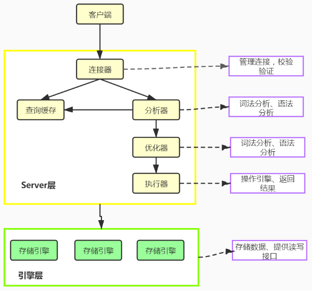

MySQL 最重要、最与众不同的特性就是它的**可插拔存储引擎架构**（pluggable storage engine architecture），这种架构的设计将查询处理及其他系统任务和数据的存储/提取分离开来。


1. **连接器（Connector）**

   连接器会做两个事情，一个是管理 MySQL 连接，一个是权限验证。比对用户名和密码建立连接，它还会验证该用户是否具有执行某个特定查询的权限，当修改了用户权限后，只有再新建的连接才会使用新的权限设置。

2. **查询缓存（Query Cache）**

   查询缓存存储了 SELECT 语句的文本以及响应给客户端的相应结果。这样，如果服务器稍后接收到相同的 SELECT 语句，服务器会先从查询缓存中检索结果，而不是再次解析和执行该语句。查询缓存在 session 之间共享，因此可以发送一个客户端生成的结果集以响应另一个客户端发出的相同查询。如果当前的查询恰好命中了查询缓存，那么**在返回查询结果之前 MySQL 会检查一次用户权限**。

   为了保证缓存一致性，当表被修改时，查询缓存中的任何相关条目都会被 flushed，注意，这里的 flushed 翻译为**清空**而不是刷新，正是由于这个特性，**从 MySQL 5.7.20 开始，官方不再推荐使用查询缓存，并在 MySQL 8.0 中直接删除了查询缓存！**

3. **解析器（Parser）**

   如果没有命中或者没有开启查询缓存，MySQL 服务器接下来要做的就是**将一条 SQL 语句转换成一个执行计划**，再依照这个执行计划和存储引擎进行交互。这包括多个子阶段：解析 SQL、预处理、优化 SQL 执行计划。这个过程中任何错误（例如语法错误）都可能终止查询。

   其中**解析 SQL 和预处理就是解析器做的事情，优化 SQL 执行计划就是优化器做的事情**。服务器端进行 SQL 解析、预处理，生成合法的解析树；

4. **优化器（Optimizer）**

   一条查询可以有很多种执行计划，最后都返回相同的结果，**优化器的作用就是找到这其中最好的执行计划**。

5. **执行器**

   在开始执行 SQL 语句之前，执行器会先判断一下当前用户对这个表有没有执行查询的权限，如果没有，就会返回没有权限的错误。

   权限认证完成后，MySQL 就会根据执行计划给出的指令逐步执行。在根据执行计划逐步执行的过程中，有大量的操作需要通过调用存储引擎实现的接口来完成


### profile详情

```mysql
# 当前MySQL是否支持profile操作
>SELECT @@have_profiling ;

# 通过set语句在 session/global 级别开启profiling
>SET profiling = 1; 
```


```mysql
# 执行一系列的业务SQL的操作，然后通过如下指令查看指令的执行耗时:

-- 查看每一条SQL的耗时基本情况，可以找到每条sql的query_id
>show profiles;

-- 查看指定query_id的SQL语句各个阶段的耗时情况
>show profile for query query_id;
-- 查看指定query_id的SQL语句CPU的使用情况
>show profile cpu for query query_id;
```


[技术提升篇：一条 SQL 查询语句是如何执行的？](https://articles.zsxq.com/id_bjiwrqnlozqf.html)

### 查询分析器explain

explain命令可以查看SQL语句的执行计划(执行计划，就是显示数据库引擎对于SQL语句的执行的详细情况)。MySQL解释了它将如何处理语句，包括有关如何联接表以及以何种顺序联接表的信息。

explain的使用很简单，只需要在SQL语句之前加上explain命令即可。

**参数**

- **id**	一个查询中各个子查询的执行顺序

  - id相同执行顺序由上至下。
  - id不同，id值越大优先级越高，越先被执行。
  - id为`null`时表示一个结果集，不需要使用它查询，常出现在包含union等查询语句中。

- select_type	查询类型

  - SIMPLE	不包含任何子查询或union等查询
  - PRIMARY	包含子查询最外层查询就显示为 PRIMARY
  - SUBQUERY	在select或 where字句中包含的查询
  - DERIVED	from字句中包含的查询
  - UNION	出现在union后的查询语句中
  - UNION RESULT	从UNION中获取结果集，例如上文的第三个例子

- table	查询的数据表

- partitions	匹配的分区

- **type** 	连接类型，如`NULL、system、const、eq_ref、ref、range、index、all`等，越往后语句越差，优化时至少要达到 range 级别，要求是ref级别，如果可以是consts最好。 

  - `NULL` 不查询任何表，如`select 'ABC'`
  - `system` 查询系统表
  - `consts` 使用唯一索引查询。 
  - `eq_ref` 在join查询中使用`PRIMARY KEY or UNIQUE NOT NULL`索引关联。
  - `ref` 使用普通索引查找数据
  - `range` 对索引进行范围检索
  - `index` 遍历索引，索引物理文件全扫描
  - `ALL` 扫描全表数据

  

  - `index_subquery` 在子查询中使用 ref
  - `unique_subquery` 在子查询中使用 eq_ref
  - `ref_or_null` 对Null进行索引的优化的 ref
  - `fulltext` 使用全文索引

- possible_keys	可能使用的索引

- **key**	实际使用的索引，NULL表示未使用索引

- key_len	查询中使用的索引长度

- ref	列与索引的比较，上述表的连接匹配条件，即哪些列或常量被用于查找索引列上的值

- **rows**	MySQL认为必须要执行查询的行数，在innodb引擎的表中，是一个估计值，可能并不总是准确的。

- **filtered**	返回结果的行数占需读取行数的百分比，理想的结果是100

- extra	其他额外信息

  - Using index 使用覆盖索引

  - Using where 使用了用where子句来过滤结果集

  - Using filesort 使用文件排序，使用非索引列进行排序时出现，非常消耗性能，尽量优化。

  - Using temporary 使用了临时表

### 处理超大分页

超大的分页一般从两个方向上来解决。

- 数据库层面,这也是我们主要集中关注的(虽然收效没那么大)，类似于`select * from table where age > 20 limit 1000000,10`这种查询其实也是有可以优化的余地的。这条语句需要load1000000数据然后基本上全部丢弃，只取10条当然比较慢. 当时我们可以修改为`select * from table where id in (select id from table where age > 20 limit 1000000,10)`。这样虽然也load了一百万的数据，但是由于索引覆盖,要查询的所有字段都在索引中，所以速度会很快。 同时如果ID连续的好,我们还可以`select * from table where id > 1000000 limit 10`,效率也是不错的,优化的可能性有许多种，但是核心思想都一样，就是**减少load加载的数据**。

- 从需求的角度减少这种请求…主要是不做类似的需求(直接跳转到几百万页之后的具体某一页.只允许逐页查看或者按照给定的路线走,这样可预测,可缓存)以及防止ID泄漏且连续被人恶意攻击.

解决超大分页，其实主要是靠缓存，可预测性的提前查到内容，缓存至redis等k-V数据库中，直接返回即可。

```mysql
#在阿里巴巴《Java开发手册》中,对超大分页的解决办法是类似于上面提到的第一种.
#【推荐】利用延迟关联或者子查询优化超多分页场景。 

#说明：MySQL并不是跳过offset行，而是取offset+N行，然后返回放弃前offset行，返回N行，那当offset特别大的时候，效率就非常的低下，要么控制返回的总页数，要么对超过特定阈值的页数进行SQL改写。 

#正例：先快速定位需要获取的id段，然后再关联： 

SELECT a.* FROM 表1 a, (select id from 表1 where 条件 LIMIT 100000,20 ) b where a.id=b.id
```

### 慢查询优化

慢查询的优化首先要搞明白慢的原因是什么？是查询条件没有命中索引？是load了不需要的数据列？还是数据量太大？

所以优化也是针对这三个方向来的，

- 首先分析语句，看看是否load了额外的数据，可能是查询了多余的行并且抛弃掉了，可能是加载了许多结果中并不需要的列，对语句进行分析以及重写。
- 分析语句的执行计划，然后获得其使用索引的情况，之后修改语句或者修改索引，使得语句可以尽可能的命中索引。
- 如果对语句的优化已经无法进行，可以考虑表中的数据量是否太大，如果是的话可以进行横向或者纵向的分表。

### 具体的优化

#### 优化长难的查询语句

一个复杂查询还是多个简单查询？？？

MySQL内部每秒能扫描内存中上百万行数据，相比之下，响应数据给客户端就要慢得多，使用切分查询(将一个大的查询分为多个小的相同的查询)是很有必要的。


一次性删除1000万的数据要比一次删除1万，暂停一会的方案更加损耗服务器开销。

#### count优化

- `count(*)`，包括了所有的列，相当于行数，查询结果包含null 和空字符串
- `count(1)`，用1代表代码行，查询结果包含null 和空字符串
- `count(列名)`，只包括列名那一列，查询结果忽略列值为null，但是包含空字符串

**按照效率排序的话，count(字段)<count(主键id)<count(1)≈count(\*)**

MyISAM中，没有任何where条件的`count(*)`非常快，当有where条件时，MyISAM的count统计不一定比其它引擎快。

#### where优化

- 对查询进行优化，应尽量避免全表扫描，首先应考虑在 where 及 order by 涉及的列上建立索引。

- 应尽量避免在 where 子句中对字段进行 null 值判断，否则将导致引擎放弃使用索引而进行全表扫描，如：

  ```mysql
  select id from t where num is null
  -- 可以在num上设置默认值0，确保表中num列没有null值，然后这样查询：
  select id from t where num=0
  ```

- 应尽量避免在 where 子句中使用!=或<>操作符，否则引擎将放弃使用索引而进行全表扫描。

- 应尽量避免在 where 子句中使用or 来连接条件，否则将导致引擎放弃使用索引而进行全表扫描，如：

  ```mysql
  select id from t where num=10 or num=20
  -- 可以这样查询：
  select id from t where num=10 union all select id from t where num=20
  ```

- in 和 not in 也要慎用，否则会导致全表扫描，如：

  ```mysql
  select id from t where num in(1,2,3) 
  -- 对于连续的数值，能用 between 就不要用 in 了：
  select id from t where num between 1 and 3
  ```

- 下面的查询也将导致全表扫描：`select id from t where name like ‘%李%’`若要提高效率，可以考虑全文检索。

- 如果在 where 子句中使用参数，也会导致全表扫描。因为SQL只有在运行时才会解析局部变量，但优化程序不能将访问计划的选择推迟到运行时；它必须在编译时进行选择。然而，如果在编译时建立访问计划，变量的值还是未知的，因而无法作为索引选择的输入项。如下面语句将进行全表扫描：

  ```mysql
  select id from t where num=@num
  -- 可以改为强制查询使用索引：
  select id from t with(index(索引名)) where num=@num
  ```

- 不要在 where 子句中的“=”左边进行函数、算术运算或其他表达式运算，否则系统将可能无法正确使用索引

  - 应尽量避免在 where 子句中对字段进行表达式操作，这将导致引擎放弃使用索引而进行全表扫描。如：

    ```mysql
    select id from t where num/2=100
    -- 应改为:
    select id from t where num=100*2
    ```

  - 应尽量避免在where子句中对字段进行函数操作，这将导致引擎放弃使用索引而进行全表扫描。如：

    ```mysql
    select id from t where substring(name,1,3)=’abc’
    -- name以abc开头的id应改为:
    select id from t where name like ‘abc%’
    ```

## 索引

**索引（index）是帮助MySQL高效获取数据的数据结构(有序)。**索引的实现通常使用B树及其变种B+树。

### 优缺点

**索引的优点**

- 提高数据检索的效率，降低数据库的IO成本。
- 通过索引列对数据进行排序，降低数据排序的成本，降低CPU的消耗。

**索引的缺点**

- 创建索引和维护索引要耗费时间，具体地，当对表中的数据进行增加、删除和修改的时候，索引也要动态的维护，会降低增/改/删的执行效率；
- 索引列也是要占用空间的。

### 索引类型

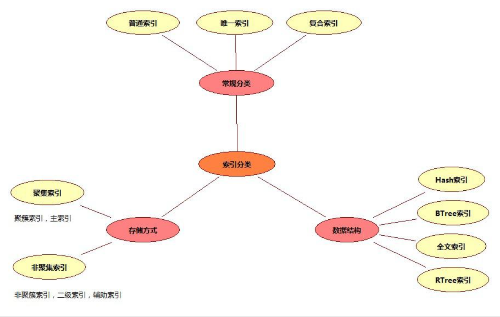

- **普通索引** 最基本的索引，没有任何限制，仅加速查询。
- **唯一索引** 索引列的值必须唯一，但允许有空值。
  - **主键索引** 针对于表中主键创建的索引，一种特殊的唯一索引，不允许有空值。默认自动创建，一张表只能有一个。
- **复合索引** 两个或多个列上的索引被称作复合索引。


- **Hash索引** 底层数据结构是用哈希表实现的, 只有精确匹配索引列的查询才有效, 不支持范围查询。
- **Full-text（全文索引）** 是一种通过建立倒排索引，快速匹配文档的方式。全文索引查找的是文本中的关键词，而不是比较索引中的值，类似于Lucene，Solr，ES。
- **R-tree（空间索引）**空间索引是MyISAM引擎的一个特殊索引类型，主要用于地理空间数据类型，通常使用较少。


**存储引擎支持的索引类型：**

不同的存储引擎支持的索引类型不一样，MySQL中主要使用的索引结构类型是B+Tree。  

| 索引        | InnoDB          | MyISAM | Memory |
| ----------- | --------------- | ------ | ------ |
| B+tree索引  | 支持            | 支持   | 支持   |
| Hash 索引   | 不支持          | 不支持 | 支持   |
| R-tree 索引 | 不支持          | 支持   | 不支持 |
| Full-text   | 5.6版本之后支持 | 支持   | 不支持 |


### 索引使用

```mysql
1、创建索引
# 创建普通索引
>CREATE INDEX indexName ON tableName(columnName(length)); 
# 创建唯一索引
>CREATE UNIQUE INDEX indexName ON tableName(columnName(length)); 
# 创建复合索引
>CREATE INDEX indexName ON tableName(columnName1, columnName2, …);
#可以使用上述方法可对表增加普通索引或UNIQUE索引，但是，不能创建PRIMARY KEY索引

#使用ALTER TABLE命令去增加索引,可以用来创建普通索引、UNIQUE索引或PRIMARY KEY索引
>ALTER TABLE table_name ADD INDEX index_name (column_list);

2、删除索引
>DROP INDEX [indexName] ON tableName; 
#根据索引名删除普通索引、唯一索引、全文索引
>alter table 表名 drop KEY 索引名

3、查看索引
>SHOW INDEX FROM tableName;
```

```java
>create table tableName(
	a int,
    ...
    index indexName(columnName1, columnName2, …)
);

>show create table tableName\G;
CTEATE TABLE tableName(
	a int(11) DEFAULT NULL,
    ...
    KEY indexName(columnName1, columnName2, …)
)engine=InnoDB default charset=utf8;
```

### 建立索引注意点

- 选择区分度高的列建立索引
- 使用短索引，如果对长字符串列进行索引，应该指定一个前缀长度，这样能够节省大量索引空间
- 不要过度索引。索引需要额外的磁盘空间，并降低写操作的性能。在修改表内容的时候，索引会进行更新甚至重构，索引列越多，这个时间就会越长。所以只保持需要的索引有利于查询即可。
- 较频繁作为查询条件的字段才去创建索引，更新频繁字段不适合创建索引
- 定义有外键的数据列一定要建立索引。

### 索引查询效率

通常，通过索引查询数据比全表扫描要快。但是我们也必须注意到它的代价。

索引需要空间来存储，也需要定期维护， 每当有记录在表中增减或索引列被修改时，索引本身也会被修改。 这意味着每条记录的INSERT，DELETE，UPDATE将为此多付出4，5 次的磁盘I/O。 因为索引需要额外的存储空间和处理，那些不必要的索引反而会使查询反应时间变慢。使用索引查询不一定能提高查询性能，索引范围查询(INDEX RANGE SCAN)适用于两种情况:

- 基于一个范围的检索，一般查询返回结果集小于表中记录数的30%
- 基于非唯一性索引的检索

### MySQL索引原理

参考：[MYSQL官网8.0文档](https://dev.mysql.com/doc/refman/8.0/en/create-index.html)

#### 哈希索引

哈希索引基于哈希表实现，它根据给定的哈希函数 Hash(Key) 和处理冲突（不同索引列值有相同的哈希值）方法将每一个索引列值都映射到一个固定长度的地址，哈希索引只存储哈希值和行指针。
【结论】
1）哈希索引只支持等值比较，包括=、in()、<=>，查询速度非常快。需求为单条记录查询的时候，可以选择哈希索引。
2）无法利用索引完成排序操作，不能支持范围查询。

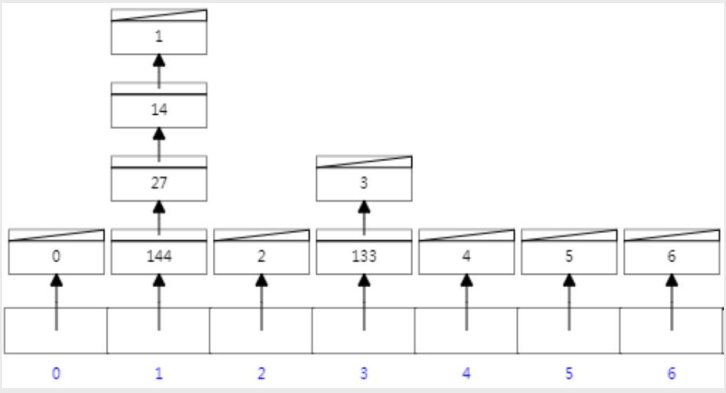

#### 二叉查找树  

二叉查找树，也称之为二叉搜索树、二叉排序树，它的每个节点最多有两个子节点，左子树上的节点值均小于它的根节点值，右子树上的节点值均大于它的根节点值，左右子树也分别是二叉排序树

【结论】

- 二叉查找树可以做范围查询。
- 但是从小到大顺序插入时，会形成一个链表，查询性能大大降低。

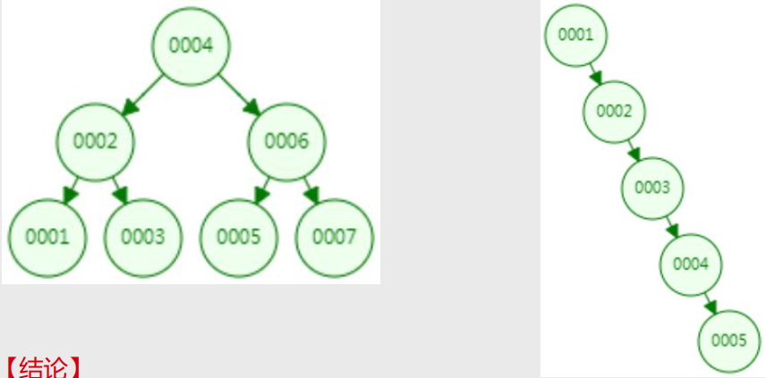

#### 红黑树

二叉查找树存在不平衡的问题，因此就有了自平衡二叉树，能够自动旋转和调整，让树始终处于平衡状态。红黑树是一种自平衡的二叉查找树。
【结论】

- 通过自平衡解决了二叉查找树有可能退化成线性链表的问题。但是极端情况下，红黑树有“右倾”趋势，并没有真正解决树的平衡问题。

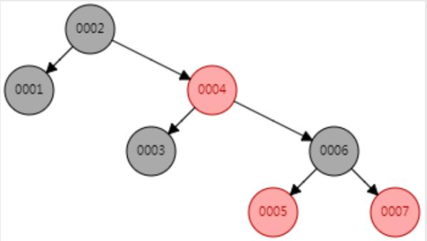


#### 平衡二叉树

平衡二叉树，又称AVL树，指的是左子树上的所有节点的值都比根节点的值小，而右子树上的所有节点的值都比根节点的值大，且左子树与右子树的高度差最大为1。
【结论】
1）AVL树从根本上解决了红黑树的“右倾”问题，查找效率得到提升，无极端低效情况。
2）二叉树子节点只有两个，大数据量情况下，层级较深，检索速度慢，查询需要更多I/O。  

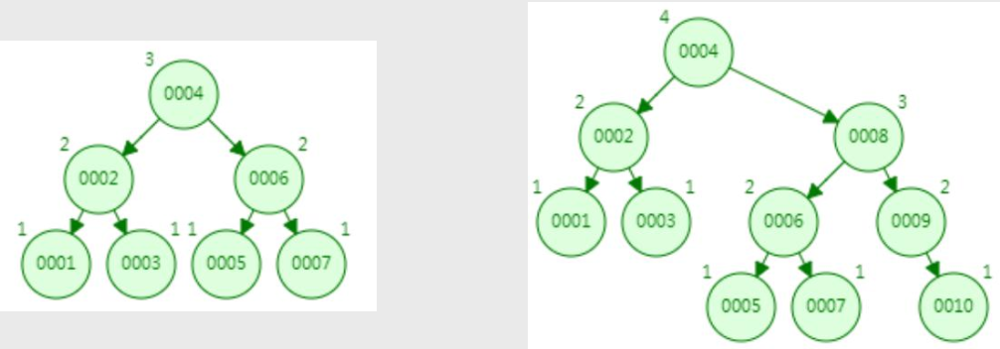

#### B-Tree

B-Tree，即B树（不要读成B减树），它是一种多路搜索树（多叉树），可以在平衡二叉树的基础上降低树的高度，从而提升查找效率。

树的度数指的是一个节点的子节点个数，以一颗最大度数（max-degree）为5(5阶)的b-tree为例，那这个B树每个节点最多存储4个key，5个指针，一旦节点存储的key数量到达5，就会裂变，中间元素**向上分裂**。


【结论】

- B树通过多叉、一个节点可有多个值，有效地控制了树的高度，比平衡二叉树查询效率高。
- B树中，键和值一起存放在内部节点和叶子节点

#### B+Tree

B+Tree是B树的变体，比B树有更广泛的应用。

以一颗最大度数（max-degree）为4（4阶）的b+tree为例，中间元素向上分裂的过程中依然保留一份数据在叶子节点中。

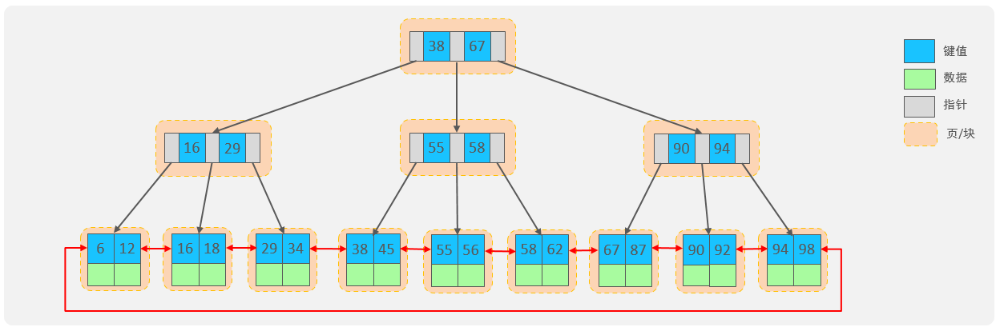

- 非叶子节点仅仅起到索引数据作用，具体的数据都是在叶子节点存放的。
- B+Tree 的叶子节点会形成一个单向链表，这里MySQL索引数据结构对经典的B+Tree进行了优化。在原B+Tree的基础上，增加一个指向相邻叶子节点的链表指针，就形成了带有顺序指针的B+Tree，提高区间访问的性能，利于排序。


**InnoDB主键索引的B+tree高度和数据存储量**

假设:
B+tree的每个节点存放在页中，一页大小16k；计算最大数据存储量则每个非叶子节点存满了一页，叶子节点存储的数据也占满了一页；InnoDB的指针占用6个字节的空间，主键假设为bigint，占用字节数为8，假设一个节点记录了n个主键和n+1个指针；假设一行数据大小为1k，一页中可以存储16行这样的数据。

- 高度为2：
  `n * 8 + (n + 1) * 6 = 16*1024` , 算出n约为 1170
  1171* 16 = 18736
  也就是说，如果树的高度为2，则可以存储 18000 多条记录。
- 高度为3：
  `1171 * 1171 * 16 = 21939856`
  也就是说，如果树的高度为3，则可以存储 2200w 左右的记录。


#### B树和B+树比较

- B树只适合随机检索，而B+树同时支持随机检索和顺序检索；
- B+树空间利用率更高，可减少I/O次数，磁盘读写代价更低。一般来说，索引本身也很大，不可能全部存储在内存中，因此索引往往以索引文件的形式存储的磁盘上。这样的话，索引查找过程中就要产生磁盘I/O消耗。B+树的内部结点并没有指向关键字具体信息的指针，只是作为索引使用，其内部结点比B树小，盘块能容纳的结点中关键字数量更多，一次性读入内存中可以查找的关键字也就越多，相对的，IO读写次数也就降低了。而IO读写次数是影响索引检索效率的最大因素；
- B+树的查询效率更加稳定。B树搜索有可能会在非叶子结点结束，越靠近根节点的记录查找时间越短，只要找到关键字即可确定记录的存在，其性能等价于在关键字全集内做一次二分查找。而在B+树中，顺序检索比较明显，随机检索时，任何关键字的查找都必须走一条从根节点到叶节点的路，所有关键字的查找路径长度相同，导致每一个关键字的查询效率相当。
- B-树在提高了磁盘IO性能的同时并没有解决元素遍历的效率低下的问题。B+树的叶子节点使用指针顺序连接在一起，只要遍历叶子节点就可以实现整棵树的遍历。而且在数据库中基于范围的查询是非常频繁的，而B树不支持这样的操作。
- 增删文件（节点）时，效率更高。因为B+树的叶子节点包含所有关键字，并以有序的链表结构存储，这样可很好提高增删效率。

索引列的值就是key

参考：[数据结构在线模拟工具](https://www.cs.usfca.edu/~galles/visualization/Algorithms.html)

### MyISAM与InnoDB索引结构  

```java
//对两种引擎的表分别进行插入操作
insert into t_myisam(id, a, b) values(5, 2, 7);
insert into t_myisam(id, a, b) values(8, 11, 5);
insert into t_myisam(id, a, b) values(4, 9, 3);
insert into t_myisam(id, a, b) values(2, 5, 1);
insert into t_myisam(id, a, b) values(6, 0, 2);
insert into t_myisam(id, a, b) values(1, 4, 4);
insert into t_myisam(id, a, b) values(7, 3, 8);
insert into t_myisam(id, a, b) values(3, 6, 9);
//使用select * from table发现MyISAM中的数据会按照插入的顺序排序，InnoDB会按照主键顺序排序。
```


#### MyISAM的索引结构

MyISAM存储引擎使用B+Tree作为索引结构，叶子节点的data域存放的是数据记录的地址。因此索引检索会按照B+Tree的检索算法检索索引，如果指定的Key存在，则取出其data域的值（地址），然后根据地址读取相应的数据记录。

在MyISAM中，主索引和辅助索引（Secondary key）在结构上没有任何区别，只是主索引要求key是唯一的，而辅助索引的key可以重复。

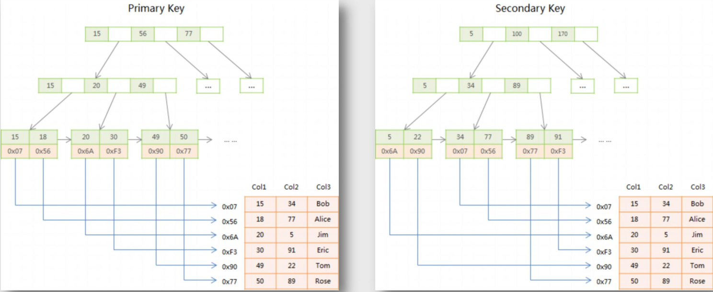

#### InnoDB的索引结构

InnoDB存储引擎也使用B+Tree作为索引结构，根据索引的存储形式，又可以分为以下两种：

| 分类                       | 含义                                                       | 特点                 |
| -------------------------- | ---------------------------------------------------------- | -------------------- |
| 聚集索引 (Clustered Index) | 将数据存储与索引放到了一块，索引结构的叶子节点保存了行数据 | 必须有，而且只有一个 |
| 二级索引 (Secondary Index) | 将数据与索引分开存储，索引结构的叶子节点关联的是对应的主键 | 可以存在多个         |

**聚集索引选取规则:**

- 如果存在主键，主键索引就是聚集索引。
- 如果不存在主键，将使用第一个唯一（UNIQUE）索引作为聚集索引。
- 如果表没有主键，或没有合适的唯一索引，则InnoDB会自动生成一个rowid作为隐藏的聚集索引。

聚集索引和二级索引的具体结构如下：

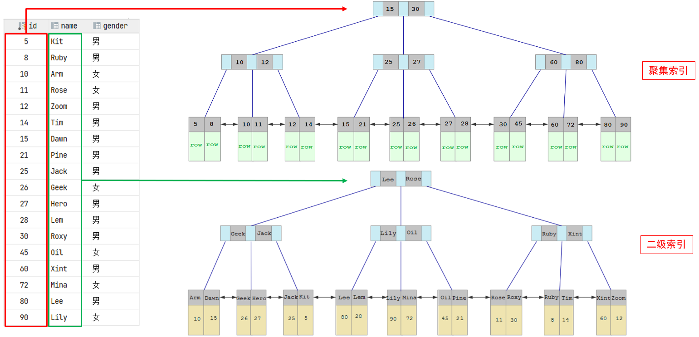

回表查询： 如`select * from user where name = 'Arm'` ，这种先到二级索引中查找数据，找到主键值，然后再到聚集索引中根据主键值，获取数据的方式，就称之为回表查询。


MyISAM索引文件和数据文件是分离的，索引文件仅保存数据记录的地址；InnoDB只有一个表数据文件，它本身就是主索引文件。  

#### 聚簇索引和非聚簇索引

- 聚簇索引：将数据存储与索引放到了一块，找到索引也就找到了数据，比如innodb的主键索引，在InnoDB中，只有主键索引是聚簇索引，如果没有主键，则挑选一个唯一键建立聚簇索引。如果没有唯一键，则隐式的生成一个键来建立聚簇索引。
- 非聚簇索引：将数据和索引分开存储，索引结构的叶子节点指向了数据的对应行，比如myisam的索引和innodb的辅助索引

当查询使用聚簇索引时，在对应的叶子节点，可以获取到整行数据，因此不用再次进行回表查询。使用非聚簇索引，如果查询语句所要求的字段是否全部命中了索引，也可以不用再进行回表查询，否则需要进行二次查询。换句话说，B+树在满足聚簇索引和覆盖索引的时候不需要回表查询数据。

举个简单的例子，假设我们在员工表的年龄上建立了索引，那么当进行`select age from employee where age < 20`的查询时，在索引的叶子节点上，已经包含了age信息，不会再次进行回表查询。


### 索引优化使用

不要想着为每个字段建立索引，因为优先使用索引的优势就在于其体积小。

#### 复合索引

##### 前导列特性

在MySQL中，如果创建了复合索引(name, salary, dept)，就相当于创建了(name, salary, dept)、(name, salary)和(name)三个索引，这被称为复合索引前导列特性，因此在创建复合索引时应该将最常用作查询条件的列放在最左边，依次递减。

```mysql
#未使用索引
>select * from employee where salary=8800;
>select * from employee where dept='部门A';
>select * from employee where salary=8800 and dept='部门A';
#使用索引
>select * from employee where name='liufeng';
>select * from employee where name='liufeng' and salary=8800;
>select * from employee where name='liufeng' and salary=8800 and dept='部门A';
>select * from employee where name='liufeng' and dept='部门A';#这里的name也使用了索引
```

##### 最左前缀匹配原则

- 最左前缀法则指的是查询时，联合索引的最左列（即是第一个字段）必须存在，否则索引全部失效。而且中间不能跳过某一列，否则该列后面的字段索引将失效。与我们编写SQL时，条件编写的先后顺序无关。
- 联合索引中，出现范围查询(>、<、between、like)，范围查询右侧的列索引失效。比如a = 1 and b = 2 and c > 3 and d = 4 如果建立(a,b,c,d)顺序的索引，d是用不到索引的，如果建立(a,b,d,c)的索引则都可以用到，a,b,d的顺序可以任意调整。当范围查询使用>= 或 <= 时，所有的字段都是走索引的。
- =和in可以乱序，比如a = 1 and b = 2 and c = 3 建立(a,b,c)索引可以任意顺序，mysql的查询优化器会帮你优化成索引可以识别的形式

##### 覆盖索引

覆盖索引中，select的数据列只从索引中就能得到，不用再扫描数据表，也就是只需扫描索引就可以得到查询结果。但是并非所有类型的索引都可以作为覆盖索引，覆盖索引必须要存储索引列的值。像哈希索引、空间索引、全文索引等并不会真正存储索引列的值。

当一个查询使用了覆盖索引，在查询分析器EXPLAIN的Extra列可以看到`“Using index”` 。

| Extra                    | 含义                                                         |
| ------------------------ | ------------------------------------------------------------ |
| Using where; Using Index | 查找使用了索引，但是需要的数据都在索引列中能找到，所以不需要回表查询数据 |
| Using index condition    | 查找使用了索引，但是需要回表查询数据                         |


##### 复合索引的底层结构

假定，对people表创建复合索引(last_name, first_name, birthday) ，索引的多个值会按照定义索引时字段的顺序进行排序。

1. 复合索引先按照第一列 last_name 进行排序存储；当 last_name 相同时，则根据 first_name 进行排序；当 last_name 和 first_name 都相同时，则根据 birthday 进行排序。
2. 从图不难看出，该索引结构对于全值匹配、匹配最左前缀、匹配列前缀、匹配范围值、精确匹配某一列并范围匹配另外一列等类型的查询都是有效的。  

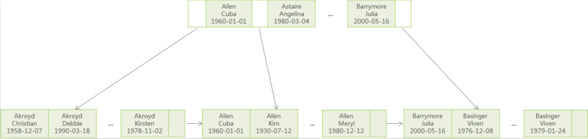


### 索引失效

**B+Tree索引可以用于在表达式中对字段进行比较，如=、>、>=、<、<=和Between、IN。**

- **索引列运算**：不要在索引列上进行运算操作， 索引将失效。

  ```mysql
  -- 索引失效
  select * from tb_user where substring(phone,10,2) = '15'; 
  
  -- 找出92年及之前生的人
  -- 索引失效
  select * from people where year(birthday) <= 1992;
  
  -- 索引生效
  select * from people where birthday <= DATE_FORMAT('1992-12-31','%Y-%M-%d');
  ```

- **隐式类型转换**：数据库存在隐式类型转换，索引将失效。

  ```mysql
  -- phone为字符串，会使用索引
  select * from tb_user where phone = '18733334444';
  
  -- phone为字符串，索引未生效
  select * from tb_user where phone = 17799990015;
  
  -- 对于int类型的值加了单引号，会走索引但不推荐
  select * from tb_user where id= '5'
  ```

- **模糊查询**：如果仅仅是尾部模糊匹配，索引不会失效。如果是头部模糊匹配，索引失效。

  ```mysql
  -- 索引生效
  select * from tb_user where profession like '软件%';
  
  -- 索引失效
  select * from tb_user where profession like '%工程';
  ```

- **or连接条件**：当or连接的条件，左右两侧字段都有索引时，索引才会生效。有一侧没有索引就都不会被用到。

  or 和 and 不一样，添加复合索引 (phone, age) 也不能解决问题 。给or的每个字段单独添加索引或者使用union或union all解决这个问题

  ```mysql
  -- phone有索引，age无索引，都不会走索引
  select * from tb_user where phone = '17799990017' or age = 23;
  
  -- 会使用phone索引
  select * from tb_user where phone = '17799990017' 
  union 
  select * from tb_user where age = 23;
  ```

- **数据分布影响**：MySQL 的查询优化器会根据统计信息决定是否使用索引。如果优化器认为全表扫描比使用索引更高效，它可能会选择不使用索引。

  因为MySQL在查询时，会评估使用索引的效率与走全表扫描的效率，如果走全表扫描更快，则放弃索引，走全表扫描。 因为索引是用来索引少量数据的，如果通过索引查询返回大批量的数据，则还不如走全表扫描来的快，此时索引就会失效。

  ```mysql
  select * from tb_user where profession is null;
  select * from tb_user where profession is not null;
  
  -- 当profession不为null时，第一个走索引，第二个全表扫描
  -- 当profession为null时，第一个全表扫描，第二个走索引
  ```

### 索引使用

#### 索引提示

SQL提示，是优化数据库的一个重要手段，简单来说，就是在SQL语句中加入一些人为的提示来达到优化操作的目的。当一张表中存在多个索引会用到。

```sql
-- use index ： 建议MySQL使用哪一个索引完成此次查询（仅仅是建议，mysql内部还会再次进行评估）
explain select * from tb_user use index(idx_user_pro) where profession = '软件工程';

-- ignore index ： 忽略指定的索引。
explain select * from tb_user ignore index(idx_user_pro) where profession = '软件工程';

-- force index ： 强制使用索引。
explain select * from tb_user force index(idx_user_pro) where profession = '软件工程';
```


#### 前缀索引

当字段类型为字符串（varchar，text，longtext等）时，有时候需要索引很长的字符串，这会让索引变得很大，查询时，浪费大量的磁盘IO， 影响查询效率。此时可以只将字符串的一部分前缀，建立索引，这样可以大大节约索引空间，从而提高索引效率。

语法：`create index idx_xxxx on table_name(column(n)) ; `

```sql
-- 为tb_user表的email字段，建立长度为5的前缀索引
create index idx_email_5 on tb_user(email(5)); 
```

前缀长度：在于前缀截取的长度。可以根据索引的选择性来决定，而选择性是指不重复的索引值（基数）和数据表的记录总数的比值，索引选择性越高则查询效率越高， 唯一索引的选择性是1，这是最好的索引选择性，性能也是最好的。

```sql
select count(distinct email) / count(*) from tb_user;
select count(distinct substring(email,1,5)) / count(*) from tb_user;
```


#### 降序索引

在MySQL 8.0之前，索引都是按升序创建的，虽然语法上支持DESC，但创建的仍然是升序索引。  

```java
>CREATE INDEX indexName ON tableName(columnName1 asc, columnName2 desc, …);
```

如果某个查询需要对多个列进行排序（有降序、也有升序），并且排序条件与索引列不一致，或没有对排序列创建索引，数据库都会进行额外的外部排序filesort，此时就可以考虑使用降序索引进行优化。  

```java
//当不存在a desc,b asc这样的索引，数据库就会进行额外排序，使用explain中Extra：Using filesort
>select * from tableName order by a desc,b asc\G;

//创建索引加快查询效率
>create table t1(
	a int,
	b int,
	index a_desc_b_asc(a desc, b asc)
);
```

#### 索引设计原则

- 针对于数据量较大，且查询比较频繁的表建立索引。
- 针对于常作为查询条件（where）、排序（order by）、分组（group by）操作的字段建立索引。
- 尽量选择区分度高的列作为索引，尽量建立唯一索引，区分度越高，使用索引的效率越高。
- 如果是字符串类型的字段，字段的长度较长，可以针对于字段的特点，建立前缀索引。
- 尽量使用联合索引，减少单列索引，查询时，联合索引很多时候可以覆盖索引，节省存储空间，避免回表，提高查询效率。
- 要控制索引的数量，索引并不是多多益善，索引越多，维护索引结构的代价也就越大，会影响增删改的效率。
- 如果索引列不能存储NULL值，请在创建表时使用NOT NULL约束它。当优化器知道每列是否包含NULL值时，它可以更好地确定哪个索引最有效地用于查询。


### 全文索引  

全文索引是搜索引擎的关键技术。

#### 倒排索引  

倒排索引通常也称之为反向索引，它是搜索引擎主要使用的索引方式。倒排索引是一种面向单词的索引机制，每个文档都可以用一系列单词来表示，可以很方便地通过单词找到对应的文档。  

- 正向索引：文档-->单词
- 倒排索引：单词-->文档

```mysql
#对以下文档内容建索引，得到的结果如下图。
MySQL is the most popular relational database on the internet.
I like MySQL very much.
```

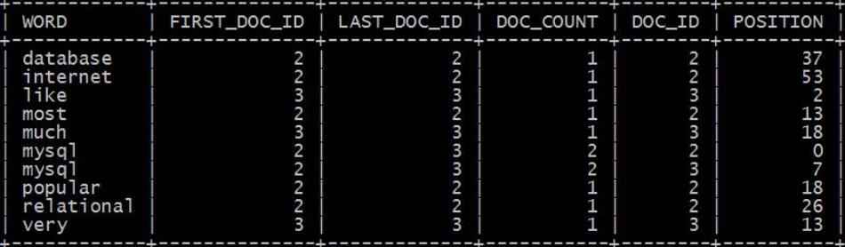

#### 全文索引的使用  

```mysql
CREATE TABLE ft_en(
    id INT UNSIGNED AUTO_INCREMENT NOT NULL PRIMARY KEY,
    title VARCHAR(200),
    body TEXT,
    FULLTEXT (title,body)
) ENGINE=InnoDB;


INSERT INTO ft_en(title,body) VALUES
('MySQL Tutorial','DBMS stands for DataBase ...'),
('How To Use MySQL Well','After you went through a ...'),
('Optimizing MySQL','In this tutorial we will show ...'),
('1001 MySQL Tricks','1. Never run mysqld as root. 2. ...'),
('MySQL vs. YourSQL','In the following database comparison ...'),
('MySQL Security','When configured properly, MySQL ...');


# 如果建表时未创建全文索引，也可以使用create fulltext index创建
CREATE FULLTEXT INDEX ft_title_body ON ft_en(title,body);
```

##### 三种模式  

MySQL支持三种模式的全文检索，自然语言模式、布尔模式和查询扩展模式。  

- 自然语言模式  

```mysql
# 将搜索字符串解释为自然人类语言，除双引号外，没有特殊的运算符
# 未指定查询模式或指定为 IN NATURAL LANGUAGE MODE，都表示自然语言搜索
SELECT * FROM ft_en WHERE MATCH (title, body) AGAINST ('database');
```

```mysql
# score越大表示相关度越高
select *, MATCH (title, body) AGAINST ('database') as score from ft_en;
```

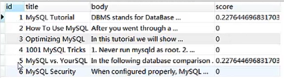

- 布尔模式  

```mysql
#使用特殊规则解释搜索字符串。该字符串包含要搜索的单词，还可以包含指定要求的运算符
#查询模式 IN BOOLEAN MODE 表示布尔搜索，+database -dbms表示有database没有dbms字样
SELECT * FROM ft_en WHERE MATCH (title, body) AGAINST ('+database -dbms' IN BOOLEAN MODE);
```

- 查询扩展模式  

```mysql
#是对自然语言搜索的修改。搜索字符串用于执行自然语言搜索，将搜索返回的最相关行中的单词添加到搜索字符串中，然后再次执行搜索
#IN NATURAL LANGUAGE MODE WITH QUERY EXPANSION 或 WITH QUERY EXPANSION
SELECT * FROM ft_en WHERE MATCH (title, body) AGAINST ('database' WITH QUERY EXPANSION);
```


**全文索引相关参数设置：**

```mysql
show variables like 'innodb_ft%';
```

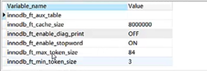

#### 忽略的单词

在使用MySQL全文索引时，会发现有些单词检索不出结果，如for、how、in等，如：

```mysql
#查询结果为空
select * from ft_en where match(title,body) against('for');
```

主要原因有两个：

- InnoDB存储引擎默认只对长度>=3的单词建索引。查看参数设置： `SHOW VARIABLES LIKE 'innodb_ft%';`

- 使用了停用词。查看停用词表： `select * from information_schema.INNODB_FT_DEFAULT_STOPWORD;  `

#### 查看分词结果

```mysql
SET GLOBAL innodb_ft_aux_table="liufeng/ft_en";
SELECT * FROM INFORMATION_SCHEMA.INNODB_FT_INDEX_CACHE;
```

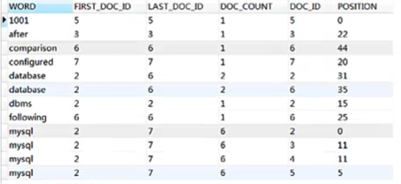

#### ngram全文解析器

MySQL内置的全文解析器使用空格确定单词的开始和结束，当涉及汉语、日语或韩文时，这明显不适用。为了解决这个问题，MySQL提供了ngarm全文解析器，支持MyISAM和InnoDB存储引擎。

ngram即n元分词，ngram解析器将文本序列标记为连续的n字符序列，例如，对于“我爱中国”：  

- n=1： '我', '爱', '中', '国'
- n=2： '我爱', '爱中', '中国'
- n=3： '我爱中', '爱中国'
- n=4： '我爱中国'  

默认ngram令牌大小为2，可以通过修改ngram_token_size来配置ngram令牌大小。  

```mysql
#在启动参数中设置
mysqld --ngram_token_size=2
#在配置文件中设置
[mysqld]
ngram_token_size=2
```

##### 使用ngram解析器创建全文索引  

```mysql
CREATE TABLE ft_zh(
    id INT UNSIGNED AUTO_INCREMENT NOT NULL PRIMARY KEY,
    title VARCHAR(200),
    body TEXT,
    FULLTEXT (title,body) WITH PARSER ngram
) ENGINE=InnoDB CHARACTER SET utf8mb4;

INSERT INTO ft_zh(title,body) VALUES ('MySQL基础入门', '主要讲解MySQL的基本使用。');
INSERT INTO ft_zh(title,body) VALUES ('MySQL高级进阶', '主要讲解查询优化、高可用等相关知识。');

#如果建表时未创建全文索引
CREATE FULLTEXT INDEX idx_ft_zh ON ft_zh(title, body) WITH PARSER ngram; 

#查看分词结果
SET GLOBAL innodb_ft_aux_table="liufeng/ft_zh";
SELECT * FROM INFORMATION_SCHEMA.INNODB_FT_INDEX_CACHE ORDER BY doc_id, position;

#查询数据
SELECT * FROM ft_zh WHERE MATCH (title, body) AGAINST('入门和进阶');
```

#### Sphinx  

Sphinx是一个免费、开源的全文搜索引擎，它的设计就着眼于与数据库的完美结合，有着类似于DBMS的特性，查询速度非常快，支持分布式检索，并且扩展性好。它可以高效利用内存和磁盘I/O，缓解大型操作的瓶颈，可以提供比数据库本身更专业的搜索功能。  

Sphinx可以在多个方面完善基于MySQL的应用程序，能弥补MySQL性能的不足，还提供了MySQL没有的功能，例如：

- Sphinx是快速、高效、可扩展的全文检索。
- Shinx的索引和检索的速度要明显快于MySQL，查询1GB的数据也只需要10~100ms。
- Sphinx可以对多个源表的混合数据创建索引，不限于单个表上的字段。
- Sphinx可以将多个索引的搜索结果进行动态整合。
- 除了能对文本列索引外，还支持其他数据类型，如整型、浮点型、时间戳等。
- 支持布尔、短语、相似词搜索。
- 支持关键词高亮显示。
- 支持生成文档摘要。
- … …  

**使用Sphinx的两种方式：**  

在实际应用中，可以通过两种方式整合Sphinx和MySQL。一种是松耦合方式，Sphinx对MySQL的查询结果进行索引，应用程序使用API进行检索；另一种是将Sphinx作为MySQL的插件。  

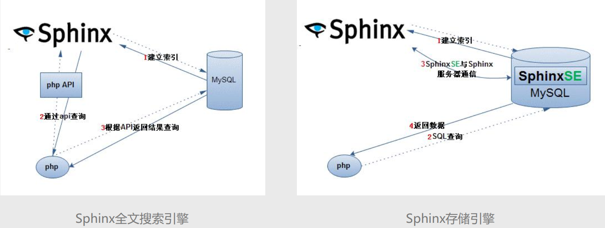

**中文分词算法：**  

- 基于词典  

  典型的机械分词，与词典进行比较，词典越大，分词的准确率越高。

  - 正向最大匹配
  - 逆向最大匹配
  - 双向最大匹配  

- 基于统计  

  上下文中相邻的字同时出现的次数越多，就越可能构成一个词。

  - N元模型
  - 隐马尔科夫模型 HMM  

- 基于规则（语义）  

  通过模拟人对句子的理解，达到识别词的效果，基本思想是语义分析，句法分析，利用句法信息和语义信息对文本进行分词。目前还不成熟  


### 百万级别或以上的数据如何删除

关于索引：由于索引需要额外的维护成本，因为索引文件是单独存在的文件,所以当我们对数据的增加,修改,删除,都会产生额外的对索引文件的操作,这些操作需要消耗额外的IO,会降低增/改/删的执行效率。所以，在我们删除数据库百万级别数据的时候，查询MySQL官方手册得知删除数据的速度和创建的索引数量是成反比的。

1. 所以我们想要删除百万数据的时候可以先删除索引（此时大概耗时三分多钟）
2. 然后删除其中无用数据（此过程需要不到两分钟）
3. 删除完成后重新创建索引(此时数据较少了)创建索引也非常快，约十分钟左右。
4. 与之前的直接删除绝对是要快速很多，更别说万一删除中断,一切删除会回滚。那更是坑了


## 分区表

分区表就是按照某种规则将同一张表的数据分段划分到多个位置存储。对数据的分区存储提高了数据库的性能，被分区存储的数据在**物理上是多个文件， 但在逻辑上仍然是一个表**，对表的任何操作都跟没分区之前一样。在执行增、删、改、查等操作时， 数据库会自动找到对应的分区，然后执行操作。

- MySQL从5.1.3开始支持分区（ Partition）。
- 在MySQL 8.0中，只有InnoDB和NDB两个存储引擎支持分区  

优点：

- 存储更多  ：与单个磁盘或文件系统分区相比，可以存储更多的数据。   
- 便于管理  ：很容易根据分区删除失去保存意义的历史数据  
- 提升查询效率  ：一些查询可以极大地优化，查询仅从某个或某几个分区中获取数据。   
- 并行处理  ：涉及到sum()、 count()等聚合函数的查询，可以很容易进行并行处理  
- 提高查询吞吐  ：通过跨多个磁盘来分散数据查询，来获得更大的查询吞吐量  

### 分区类型

MySQL支持的分区类型包括Range、 List、 Hash和Key，其中Range最常用。  

- Range分区  ：允许将数据划分不同范围。例如可以将一个表通过年份划分成若干个分区  
- List分区  ：允许系统通过预定义的列表的值来对数据进行分割  
- Hash分区   ：允许通过对表的一个或多个列的HashKey进行计算，最后通过这个Hash码不同数值对应的数据区域进行分区。  
- Key分区  ：对Hash模式的一种延伸，这里的HashKey是MySQL系统产生的。  

### Range分区

Range分区是基于属于一个给定连续区间的列值，把多行分配给分区。**范围值**

```java
create table user_range(
    id int not null auto_increment,
    name varchar(30) ,
    age int,
    birthday date,
    province int,
    //主键必须包含分区字段
    primary key(id, age)
)
partition by RANGE(age) (
    partition p1 VALUES LESS THAN (20) DATA DIRECTORY = 'c:/data/p1',
    partition p2 VALUES LESS THAN (40) DATA DIRECTORY = 'c:/data/p2',
    partition p3 VALUES LESS THAN (60) DATA DIRECTORY = 'c:/data/p3',
    partition p4 VALUES LESS THAN MAXVALUE DATA DIRECTORY = 'c:/data/p4'
);  
```

### List分区

List分区是基于列值匹配一个离散值集合中的某个值来进行选择。**一系列值**

```java
create table user_list(
    id int not null auto_increment,
    name varchar(30) ,
    age int,
    birthday date,
    province int,
    primary key(id, province)
)
partition by List(province) (
    partition p1 VALUES IN (1,3,5,7,9,11,13,15,17,19,21),
    partition p2 VALUES IN (2,4,6,8,10,12,14,16,18,20,22),
    partition p3 VALUES IN (23,24,25,26,27,28,29,30,31,32,33,34)
);  
```

### Hash分区

Hash分区是基于用户定义的表达式的返回值来进行选择的分区。

```java
create table user_hash(
    id int not null auto_increment,
    name varchar(30) ,
    age int,
    birthday date,
    province int,
    primary key(id, birthday)
)
partition by HASH(YEAR(birthday))
partitions 5;  
```

### Key分区

Key分区类似于Hash分区，但这里的Hash Key是由MySQL系统产生的。

```mysql
create table user_key(
    id int not null auto_increment,
    name varchar(30) ,
    age int,
    birthday date,
    province int,
    primary key(id, age)
)
partition by KEY (age)
partitions 5;  
```

### 分区操作

```mysql
#新增分区
alter table `user` add partition(partition p5 VALUES LESS THAN MAXVALUE);

#对已存在的表进行分区
alter table `user` partition by RANGE(age) (
    partition p1 VALUES LESS THAN (20) DATA DIRECTORY = 'c:/data/p1',
    partition p2 VALUES LESS THAN (40) DATA DIRECTORY = 'c:/data/p2',
    partition p3 VALUES LESS THAN (60) DATA DIRECTORY = 'c:/data/p3',
    partition p4 VALUES LESS THAN MAXVALUE DATA DIRECTORY = 'c:/data/p4'
);

#删除分区（分区下的数据也会被删除）
alter table `user` drop partition p5;

#移除分区（数据不会被删除）
ALTER TABLE `user` REMOVE PARTITIONING ;
```


## 表常用操作

### 复制表

```mysql
#只复制表结构，包括主键、索引，但不会复制表数据
create table tableName like someTable;
#复制表的大体结构及全部数据，不会复制主键、索引等
create table tableName select * from someTable;
#完整复制，分两步完成，先复制表结构，再插入数据
create table tableName like someTable;
insert into tableName select * from someTable;
```

### 导出数据

#### SELECT...INTO OUTFILE

在MySQL中，可以使用SELECT...INTO OUTFILE语句将查询结果数据导出到文本文件。

```mysql
#文件存储路径
SELECT * FROM employee INTO OUTFILE 'D:\\employee.txt' 
#字段间分隔符
FIELDS TERMINATED BY ','  
#值用双引号引起
ENCLOSED BY '"' 
#行间分隔符,\r\n在mysql中表示换行
LINES TERMINATED BY '\r\n';
```

```mysql
#mysql中secure_file_priv参数控制导出
#null 表示不允许导入导出		空 表示没有任何限制		指定路径 表示导入导出只能在指定路径下完成    
show variables like "secure_file_priv";    
```

#### mysql命令

通常，我们使用mysql命令连接数据库，mysql命令有一个`-e`选项，可以执行指定的SQL语句，再结合DOS的重定向操作符”>”可以将查询结果导出到文件

```sh
mysql -h localhost -u root -p -D mydb -e "select * from employee" > E:\employee.txt
```

#### mysqldump命令

mysqldump是MySQL用于转存储数据库的实用程序，它主要产生一个SQL脚本，其中包含创建数据库、创建数据表、插入数据所必需的SQL语句。

```sh
# 导出mydb数据库（含数据）
mysqldump -h localhost -u root -p mydb > d:/mydb.sql
# 导出mydb数据库（不含数据）
mysqldump -h localhost -u root -p mydb --no-data > d:/mydb.sql
# 导出mydb.employee数据表
mysqldump -h localhost -u root -p mydb employee > d:/employee.sql
# 导出mydb数据库，忽略contacts表
mysqldump -h localhost -u root -p mydb --ignore-table mydb.contacts > d:/employee.sql
```

### 定时备份数据库

定时调度器-->数据库备份脚本

定时调度器有：

- Windows的定时计划
- Linux的Crontab
- 编程语言的Timer

数据库备份脚本有：

- DOS批处理脚本
- Linux Shell脚本

#### Windows

schtasks.exe用于安排命令和程序在指定时间内运行或定期运行，它可以从计划表中添加和删除任务、按需要启动和停止任务、显示和更改计划任务。

```sh
#备份数据库的脚本mysql_mydb_backup.bat
mysqldump -h localhost -uroot -p123456 mydb > d:\backup\mydb.sql
#创建计划任务（每隔指定时间备份一次MySQL）
schtasks /create /sc minute /mo 1 /tn 定期备份MySQL /tr d:\backup\mysql_mydb_backup.bat
#删除计划任务
schtasks /delete /tn 定期备份MySQL
```

#### Linux

```sh
#!/bin/bash
#备份目录
backup_dir=/home/liufeng/backup
#备份文件名
backup_filename=“mydb-`date +%Y%m%d`.sql“
#进入备份目录
cd $backup_dir
#备份数据库
mysqldump -h localhost -uroot -p123456 mydb > ${backup_dir}/${backup_filename}
#删除7天以前的备份
find ${backup_dir} -mtime +7 -name "*.sql" -exec rm -rf {} \;
```

crontab是一个命令，常见于Unix和类Unix的操作系统之中，用于周期性执行任务。

```sh
#每天凌晨01:30执行shell脚本（备份数据库）
30 1 * * * bash /home/liufeng/backup/mysql_mydb_backup.sh
```

### 导入数据

#### LOAD DATA

在MySQL中，可以使用LOAD DATA语句将文本文件数据导入到对应的数据库表中，可以将LOAD DATA语句看成是SELECT…INTO OUTFILE的反操作

```mysql
#数据文件位置
>LOAD DATA INFILE 'D:\\employee.txt' INTO TABLE employee character set utf8 
#字段间分隔符
>FIELDS TERMINATED BY ',' 
#值用双引号引起    
>ENCLOSED BY '"' 
#行间分隔符    
>LINES TERMINATED BY '\r\n';
```

#### source命令

在MySQL中，可以使用source命令导入较大的SQL文件。source命令可以导入使用mysqldump备份的sql文件。

```mysql
>source d:/mydb.sql
```

## 预处理

从MySQL 4.1开始，就支持预处理语句（Prepared statement），这大大提高了客户端和服务器端数据传输的效率。当创建一个预定义SQL时，客户端向服务器发送一个SQL语句的原型；服务器端接收到这个SQL语句后，解析并存储这个SQL语句的**部分执行计划**，返回给客户端一个SQL语句处理句柄，以后每次执行这条SQL，客户端都指定使用这个句柄。

- **高效执行重复SQL**  在服务器端只需要解析一次SQL，在服务器端某些优化器的工作只需要执行一次，它会缓存一部分执行计划
- **减少网络开销** 对于重复执行的SQL，后续只需要将参数发送到服务器端，而不是整个SQL语句，因此网络开销会更小。
- **更加安全** 使用预处理语句，无须在应用程序中处理转义，也大大减少了SQL注入和攻击的风险

### 基本使用

MySQL支持SQL接口的预处理，即不使用二进制传输协议也可以直接以SQL的方式使用预处理。预处理的语法如下。

```mysql
# 定义预处理语句
PREPARE stmt_name FROM preparable_stmt;
# 执行预处理语句
EXECUTE stmt_name [USING @var_name [, @var_name] ...];
# 删除(释放)定义
{DEALLOCATE | DROP} PREPARE stmt_name;
```

```mysql
>prepare pre_employee from 'select * from employee where name=?';
>set @name1='张三'
>execute pre_employee using @name1;    
```

## 查询缓存(过期)

很多数据库产品都能够缓存查询的执行计划，对于相同类型的SQL就可以跳过SQL解析和执行计划分成阶段。MySQL在某种场景下也可以实现，但是MySQL还有另一种不同的缓存类型：**缓存完成的SELECT查询结果**，也就是查询缓存。
MySQL将缓存存放在一个引用表中，类似于HashMap的数据结构，Key查询SQL语句，Value则是查询结果。当发起查询时，会使用SQL语句去缓存中查询，如果命中则立即返回缓存的结果集

```java
# 查询缓存参数，8.0中数值为no表示已弃用
show variables like "%query_cache%";
```

- 可以使用 SQL_NO_CACHE 在 SELECT 中禁止缓存查询结果，例如：SELECT SQL_NO_CACHE ...
- MySQL 8.0已删除查询缓存功能

## SQL注入

SQL注入（SQL Injection）是指应用程序对用户输入数据的合法性没有判断、没有过滤，攻击者可以在应用程序中通过表单提交特殊的字符串，该特殊字符串会改变SQL的运行结果，从而在管理员毫不知情的情况下实现非法操作，以此来实现欺骗数据库执行非授权的任意查询。

**广泛性** 任何一个基于SQL语言的数据库都可能受到SQL注入攻击。很多开发人员都为了省事不对表单参数进行校验。

**隐蔽性** SQL注入语句一般都嵌入在普通的HTTP请求中，很难与正常语句区分开，SQL注入也有很多变种。

**操作简单** 互联网上有很多SQL注入工具，简单易懂，攻击过程简单，不需要太多专业知识

**危害大** 攻击者通过SQL注入能够获取到更多数据，如管理员密码、整个系统的用户数据、他人的隐私数据、完整的数据库。

```java
#账号密码：adc/' or '1'='1，如下会查出所有数据
select * from user where username='abc' and password='' or '1'='1';
```

## 文件编码

在Windows中，MySQL 8.0的配置文件my.ini的编码为ANSI，但是修改配置文件后默认保存的编码为UTF-8，这会导致MySQL解析配置文件错误，无法启动。只需要将配置文件另存为ANSI编码即可。

## 文档存储

在关系数据库中，需要先定义表才能存储数据。文档存储更加灵活，不需要事先定义数据结构、数据约束等就可以直接存储数据。将MySQL用作文档存储时，集合是容器，集合包含可以添加、查找、更新和删除的JSON文档

| 关系数据库 | MySQL文档存储 | 说明    |
| ---------- | ------------- | ------- |
| database   | database      | 数据库  |
| table      | collection    | 表/集合 |
| row        | document      | 行/文档 |


表中

| id   | name | age  |
| ---- | ---- | ---- |
| 1    | 张三 | 10   |

文档中

{
    "id":1,
    "name":"张三",
    "age":"10"
}

```java
#使用MySQL Shell连接数据库（支持文档存储）
mysqlsh root@localhost:33060/mydb
#查看当前数据库
db
#查看当前数据库有哪些集合
db.getCollections()
#创建集合
db.createCollection("employee_doc")
#删除集合
db.dropCollection("employee_doc")
#添加文档
db.employee_doc.add({
    "id":1,
    "name":"张三",
    "sex":"男",
    "salary":5500,
    "dept":"部门A"
})
#查询文档
db.employee_doc.find("name='张三'")
#删除文档
db.employee_doc.remove("name='张三'")
#删除所有文档
db.employee_doc.remove("true")
```


## MySQL8.0的新特性

| 新特性/改进                | 描述                                                         |
| -------------------------- | ------------------------------------------------------------ |
| 默认字符集变为utf8mb4      | 移动端有大量的表情符号需要存储，默认的字符集从 latin-1 转为 utf8mb4。 |
| 系统表存储引擎全部为InnoDB | 不再采用MyISAM。                                             |
| DDL原子化                  | 在MySQL 8.0之前，DDL操作是非原子型操作，在执行过程中遇到实例故障重启，可能导<br/>致DDL没有完成也没有回滚。 |
| 持久化系统参数             | 可以用 SET PERSIST 来设置持久性的全局变量，即便服务器重启也会保持 |
| 不可见索引                 | 可以将一些索引设置为不可见，这样 SQL 优化器就不会用到它，但是它会继续在后台保持更新。当有需要时，可以随时恢复可见。不可见的索引可以测试删除索引对查询性能的影响，而无需进行破坏性的更改 |
| 全新的身份认证方式         | 身份认证方式由以前的mysql_native_password改为caching_sha2_password |
| 通用表表达式               | 通用表表达式（CTE）是一个在语句级别定义的临时结果集。定义之后，可以在当前语句中多次引用该 CTE。CTE有两种用法，非递归的CTE和递归的CTE。 |
| 窗口函数                   | 类似于聚合函数，可降低代码复杂性并帮助开发人员提高工作效率   |
| JSON扩展                   | 从版本5.7.8开始，MySQL开始支持JSON数据类型。MySQL8.0新增了JSON_TABLE()函数，可以将JSON数据转换成表 |
| GIS增强                    | GIS得到了增强，可支持地理和空间参考系统（SRS）。             |
| 文档存储                   | 可以使用同一种解决方案处理 SQL 和 NoSQL，也可以将两种的优势结合起来 |

### 问题

#### 身份认证方式

老版本的Navicat连接能正常连接MySQL 5.x，但是连接MySQL 8.0却报错，错误提示：

```java
Client does not support authentication protocol requested by server;consider upgrading MySQL client
客户端不支持服务器请求的身份验证协议；请考虑升级MySQL客户端    
```

MySQL 5.x的身份认证方式为 mysql_native_password，也就是Navicat客户端支持的认证方式。但是MySQL 8.0升级了身份认证方式，默认为 caching_sha2_password。因此，在不升级Navicat版本的情况下，可以将MySQL 8.0的身份认证方式修改为 mysql_native_password。

```java
ALTER USER 'root'@'localhost' IDENTIFIED WITH mysql_native_password BY '123456';
flush privileges;
```

#### 编码格式

MySQL 8.0将utf8mb4作为默认字符集，mb4是most bytes 4的缩写，专门用于兼容四字节字符，如Emoji表情。MySQL中的utf8是utf8mb3的别名，utf8mb4兼容utf8。

### 原子DDL

MySQL 8.0 开始支持原子性的数据定义语言（DDL），也称为原子 DDL。一个原子 DDL 语句将相关的数据字典更新、存储引擎操作以及写入二进制日志组合成单一的原子事务。当事务正在处理时出现服务器故障，该事务可能被提交，相应的变更会保存到数据字典更新、存储引擎更改以及二进制日志中；也可能被整体回滚。目前，只有 InnoDB 存储引擎支持原子 DDL。

支持原子DDL

1. 数据库、表空间、表、索引的 CREATE、ALTER 以及 DROP 语句，以及 TRUNCATE TABLE 语句
2. 存储过程、触发器、视图以及用户定义函数（UDF）的 CREATE 和 DROP 语句，以及适用的 ALTER 语句
3. 用户和角色的 CREATE、ALTER、DROP 语句，以及 GRANT 和 REVOKE 语句

不支持原子DDL

1. 非 InnoDB 存储引擎上的表相关 DDL 语句
2. INSTALL PLUGIN 和 UNINSTALL PLUGIN 语句
3. INSTALL COMPONENT 和 UNINSTALL COMPONENT 语句
4. CREATE SERVER、ALTER SERVER 以及 DROP SERVER 语句


任何 DDL 语句，包括原子性或其他的 DDL，都会隐式地结束当前事务，就像在执行语句之前执行了COMMIT 操作一样。这就意味着 DDL 语句不能位于其他事务之中，不能位于事务控制语句（如START TRANSACTION … COMMIT）之中，也不能与同一个事务中的其他语句组合使用。

```java
#只创建一张表
>create table test1(id int)
#无test2表报错，回退test1表未删除    
>drop table test1,test2;
```

## NoSQL

NoSQL是Not Only SQL的简称，意思是“不仅仅是SQL”。

NoSQL，指的是非关系型的数据库，它是对不同于传统的关系型数据库的数据库管理系统的统称。

NoSQL用于超大规模数据的存储。

- **键值存储**
  - Tokyo Cabinet/Tyrant
  - Berkeley DB
  - MemcacheDB
  - Redis

- **列存储**
  - Hbase
  - Cassandra
  - Hypertable

- **文档存储**

  - MongoDB

  - CouchDB

- **图形存储**
  - Neo4J
    - FlockDB


## 数据库连接池

### 流程

#### 不使用连接池流程

1. TCP建立连接的三次握手
2. MySQL认证的三次握手
3. 真正的SQL执行
4. MySQL的关闭
5. TCP的四次握手关闭

#### 使用连接池流程

- 第一次访问的时候，需要建立连接。 但是之后的访问，均会复用之前创建的连接，直接执行SQL语句。
- 当客户请求数据库连接时，首先查看连接池中是否有空闲连接，如果存在空闲连接，则将连接分配给客户使用；如果没有空闲连接，则查看当前所开的连接数是否已经达到最大连接数，如果没达到就重新创建一个连接给请求的客户；如果达到就按设定的最大等待时间进行等待，如果超出最大等待时间，则抛出异常给客户。
- 每一个事务都会独占一个数据库连接。

参考：[数据库连接池了解和常用连接池对比](https://www.cnblogs.com/whb11/p/11315463.html)

### 连接池类型

第一代连接池c3p0和dbcp一般已经弃用了，常用第二代连接池HikariCP和Druid

### SpringBoot配置数据库连接池

```java
//springboot2.3.0版本org.springframework.boot.autoconfigure.jdbc.DataSourceBuilder
//SpringBoot中默认支持的连接池有dbcp2, tomcat, hikari三种连接池
public final class DataSourceBuilder<T extends DataSource> {
   private static final String[] DATA_SOURCE_TYPE_NAMES = new String[] {
       "com.zaxxer.hikari.HikariDataSource",
       "org.apache.tomcat.jdbc.pool.DataSource", 
       "org.apache.commons.dbcp2.BasicDataSource" 
   };
         ...
}
```

#### 配置默认数据库连接池（Hikari）

```xml
<!-- jdbc起步依赖 -->
<dependency>
    <groupId>org.springframework.boot</groupId>
    <artifactId>spring-boot-starter-jdbc</artifactId>
</dependency>
<!-- mysql数据库驱动 -->
<dependency>
    <groupId>mysql</groupId>
    <artifactId>mysql-connector-java</artifactId>
</dependency>
```

```properties
# application.properties
# 必要配置
# 驱动程序类名称
spring.datasource.driver-class-name=com.mysql.jdbc.Driver
spring.datasource.url=jdbc:mysql://127.0.0.1:3306/datebook?useUnicode=true&characterEncoding=UTF-8&autoReconnect=true&useSSL=false&zeroDateTimeBehavior=convertToNull
spring.datasource.username=root
spring.datasource.password=root

# 常用配置
# 指定使用的数据库连接池类型
spring.datasource.type=com.zaxxer.hikari.HikariDataSource
# 最小空闲连接数，如果空闲连接低于此值并且连接池中的总连接数少于maximumPoolSize就会创建新连接，默认值：与maximumPoolSize相同
spring.datasource.hikari.minimum-idle=5
# 最大实际连接数，默认值：10
spring.datasource.hikari.maximum-pool-size=15
# 事务自动提交，默认值：true
spring.datasource.hikari.auto-commit=true
# 允许连接在池中闲置的最长时间，当连接数减少到minimum-idle，空闲连接将不会退出，值为0意味着空闲连接永远不会从池中删除，默认值：600000（10分钟）
spring.datasource.hikari.idle-timeout=30000
# 连接池名称，默认：自动生成
spring.datasource.hikari.pool-name=DatebookHikariCP
# 连接的最大生存周期，正在使用的连接永远不会删除，值为0表示无限寿命， 默认值：1800000（30分钟）
spring.datasource.hikari.max-lifetime=1800000
# 客户端等待连接的最大毫秒数，没有可用连接的情况下超过此时间，则会抛出SQLException，默认值：30000（30秒）
spring.datasource.hikari.connection-timeout=30000
# 驱动程序JDBC4之前，检测新获取的连接是否存在未完成的查询，JDBC4不需要，默认值：无
spring.datasource.hikari.connection-test-query=SELECT 1
```

参考：[Springboot 2.0默认连接池HikariCP详解（效率最高）](https://blog.csdn.net/weixin_41249041/article/details/90578226)

#### 配置druid连接池

```xml
<!-- 阿里系的Druid依赖包 -->
<dependency>
    <groupId>com.alibaba</groupId>
    <artifactId>druid-spring-boot-starter</artifactId>
    <version>1.1.9</version>
</dependency>
<!-- Druid 依赖 log4j包，但是SpringBoot默认使用的是slf4j+logback -->
<dependency>
    <groupId>log4j</groupId>
    <artifactId>log4j</artifactId>
    <version>1.2.17</version>
</dependency>
```

```properties
#mysql 配置
spring.datasource.driverClassName=com.mysql.jdbc.Driver
spring.datasource.url=jdbc:mysql://192.168.2.126:3306/springboot_druid_demo?characterEncoding=utf-8&autoReconnect=true&zeroDateTimeBehavior=convertToNull&useSSL=false
spring.datasource.username=root
spring.datasource.password=123456

#阿里druid连接池驱动配置信息
spring.datasource.type=com.alibaba.druid.pool.DruidDataSource
#连接池的配置信息
#初始化大小
spring.datasource.initialSize=5
#最小空闲连接数
spring.datasource.minIdle=5
#最大连接数
spring.datasource.maxActive=20
#配置获取连接等待超时的时间
spring.datasource.maxWait=60000
#配置间隔多久才进行一次检测，检测需要关闭的空闲连接，单位是毫秒
spring.datasource.timeBetweenEvictionRunsMillis=60000
#配置一个连接在池中最小生存的时间，单位是毫秒
spring.datasource.minEvictableIdleTimeMillis=300000
spring.datasource.validationQuery=SELECT 1 FROM DUAL
spring.datasource.testWhileIdle=true
spring.datasource.testOnBorrow=false
spring.datasource.testOnReturn=false
#打开PSCache，并且指定每个连接上PSCache的大小
spring.datasource.poolPreparedStatements=true
spring.datasource.maxPoolPreparedStatementPerConnectionSize=20
#配置监控统计拦截的filters，去掉后监控界面sql无法统计，'wall'用于防火墙
spring.datasource.filters=stat,wall,log4j
#通过connectProperties属性来打开mergeSql功能；慢SQL记录
spring.datasource.connectionProperties=druid.stat.mergeSql=true;druid.stat.slowSqlMillis=5000
```

```java
@Configuration
public class DruidConfig {
    @Bean
    public ServletRegistrationBean druidServlet() {// 主要实现web监控的配置处理
        ServletRegistrationBean servletRegistrationBean = new ServletRegistrationBean(
                new StatViewServlet(), "/druid/*");//表示进行druid监控的配置处理操作
        servletRegistrationBean.addInitParameter("allow", "127.0.0.1,129.168.1.11");//白名单，空字符串表示允许所有地址访问
        servletRegistrationBean.addInitParameter("deny", "129.168.1.12");//黑名单
        servletRegistrationBean.addInitParameter("loginUsername", "root");//用户名
        servletRegistrationBean.addInitParameter("loginPassword", "root");//密码
        servletRegistrationBean.addInitParameter("resetEnable", "false");//是否可以重置数据源
        return servletRegistrationBean;

    }
    @Bean    //监控
    public FilterRegistrationBean filterRegistrationBean(){
        FilterRegistrationBean filterRegistrationBean=new FilterRegistrationBean();
        filterRegistrationBean.setFilter(new WebStatFilter());
        filterRegistrationBean.addUrlPatterns("/*");//所有请求进行监控处理
        filterRegistrationBean.addInitParameter("exclusions", "*.js,*.gif,*.jpg,*.css,/druid/*");//排除
        return filterRegistrationBean;
    }
    
    //配置连接池
    @Bean
    @ConfigurationProperties(prefix = "spring.datasource")
    public DataSource druidDataSource() {
        /*
        	可以不使用配置文件直接赋值
         	DataSource  dataSource = new DruidDataSource();
           dataSource.setDriverClasClassName("com.mysql.jdbc.Driver");
           dataSource.setUrl(url);
           dataSource.setUsername(username);
           dataSource.setPassword(password);
           dataSource.setMaxActive(maxTotal);
           dataSource.setMinIdle(minIdle);
           dataSource.setMaxIdle(maxIdle);
           dataSource.setInitialSizlSize(initialSize);
        */
        return new DruidDataSource();
    }
}
```

## 每门课都大于x分

**请用一条SQL筛选出所有课程的成绩都大于等于85的学生**

```java
>select * from score;
Name Course Grade
张三 语文 89
张三 数学 77
张三 计算机 65
李四 语文 95
李四 数学 90
李四 计算机 88
王五 语文 66
王五 数学 85
王五 计算机 94
```

```java
1、只要最低分数>=85就意味着所有课程成绩>=85
>select name from score group by name having min(grade)>=85;    
    
2、排除法，只要有一门课的成绩小于85就不满足条件
>select distinct name from score A where not exists(
	select * from score B where A.name=B.name and grade<85
);
    
3、所有成绩的个数与>=85的成绩个数相等 
>select name from acore where grade >=85 
    group by name having count(*) = select count(distinct course) from score;
```

## 课程选修问题

**查询至少选修了202002学生选修的全部课程的学生学号**

```java
>select * from score;
学号sno 课程号cno 分数score
202001 01 85
202001 03 65
202002 02 80
202002 04 81
202002 01 68
202003 06 74
202003 01 78
202003 02 70
202003 04 72
202004 01 55
202004 02 44
202004 03 0
    
1）找出学号=202002的学生选修的所有课程
2）根据1）的结果，找出所有跟202002选修了同一门课（任意一门）的数据
3）按学号进行分组，从2）的结果中找出选课数量等于202002学生的选课数量的所有学生

select B.sno from score B where B.cno in(      
	select A.cno from score A where A.sno='202002'
)
group by B.sno
having count(*)=(select count(*) from score C where c.sno='202002');    
```

## 生成比赛对阵表

**有A、B、C、D四个球队进行比赛，用一条SQL显示出所有可能的比赛组合。**

其中一共有4x4=16种组合，但是AA不能比赛，AB匹配之后BA重复

```java
>select * from team;
id name
 1  A
 2  B
 3  C
 4  D
    
1）表和它自身（A、B两张表）做笛卡尔积
2）再筛选出 A.name>B.name 或 A.name < B.name 的所有记录
>select A.name,B.name from team A,team B where A.name < B.name;
```

## 删除冗余记录

**学生表中产生了冗余记录，请用一条SQL删除所有冗余记录。**

```java
>select * from student;
自动编号 学号 姓名 年龄
1 202001 张三 18
2 202002 李四 19
3 202002 李四 19
4 202003 王五 18
5 202004 赵六 21
6 202004 赵六 21
7 202004 赵六 21
8 202005 田七 20
```

```java
排除法，将需要保留的记录排除
1）按照学号、姓名、年龄进行分组，找出最大或最小的所有 id
2）将不在1）的结果之内的所有id对应的记录都删除
        
>delete from student where id not in {
    select max(id) from student group by sno,name,age
};

>delete from student where id in( 
    select id from student where id not in (
        select max(id) from student group by sno,name,age
    )
);

在实际使用中，根据指定条件进行删除或修改数据时，经常会遇到如下错误，意思是不允许在子查询中出现
update或delete要操作的表。
ERROR 1093 (HY000): You can't specify target table 'sql04_student' for update in FROM clause
    
所以mysql中以上两种方式都会报错，这里需要做一个嵌套生成衍生表temp再删除    
>delete from student where id in(
    select * from (
        select id from student where id not in (
            select max(id) from student group by sno,name,age
        )
    ) temp
);
```

## 横表与纵表的概念、场景及互换

### 概念

- 横表：平时接触的绝大多数表都是横表，如(主键，字段1，字段2，…，字段n)
- 纵表：key-value存储方式，如(主键，字段编码，字段值)

### 横表

sql_h

| name | sex  | chinese | math |
| ---- | ---- | ------- | ---- |
| 张三 | 男   | 89      | 56   |
| 李四 | 女   | 78      | 23   |

### 纵表

sql_v

| name | key  | value |
| ---- | ---- | ----- |
| 张三 | 性别 | 男    |
| 张三 | 语文 | 89    |
| 张三 | 数学 | 56    |
| 李四 | 性别 | 女    |
| 李四 | 语文 | 78    |
| 李四 | 数学 | 23    |

### 对比

| 对比项   | 横表                             | 纵表                               |
| -------- | -------------------------------- | ---------------------------------- |
| 数据量   | 一行表示一个实体                 | 多行表示一个实体                   |
| 业务描述 | 符合常规，易于理解               | 不直观                             |
| 代码方面 | 业务代码清晰，简洁明了           | 通常需要转换成横表，较复杂         |
| 性能方面 | 跟业务报表吻合，查询开销小       | 查询开销大                         |
| 字段类型 | 每个字段根据实际情况设计专用类型 | 值字段通常是varchar，兼容各种情况  |
| 数据冗余 | 有一定的冗余                     | 有一定的冗余                       |
| 可扩展性 | 对实体增加属性，需要动表结构     | 对实体增加属性，只需要增加记录即可 |

通过上面的对比，不难发现，相对于横表，纵表主要的优势是可扩展性强，适用于表结构不固定、经常扩展的场景，如电信行业的用户账单明细，金融行业的收支明细。

### 转换

```java
--横表转纵表 union all
select A.name, '性别' as 'key', A.sex as 'value' from sql_h A
union all
select A.name, '语文' as 'key', A.chinese as 'value' from sql_h A
union all
select A.name, '数学' as 'key', A.math as 'value' from sql_h A;
```

```java
--纵表转横表 
select
    A.name, 
	max(case when A.key='性别' then A.value end) as sex, 
	max(case when A.key='语文' then A.value end) as chinese, 
	max(case when A.key='数学' then A.value end) as math 
from sql_v A group by A.name;
```
