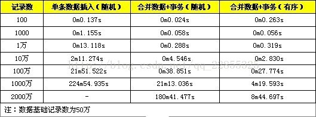
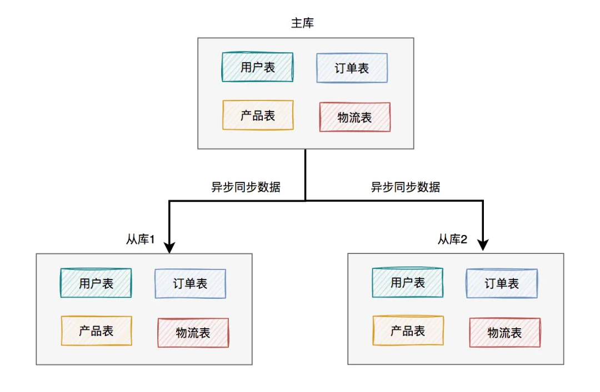

参考：

[MySQL教程：MySQL数据库学习宝典（从入门到精通）](http://c.biancheng.net/mysql/)

[MySQL数据库面试题（2020最新版）](https://thinkwon.blog.csdn.net/article/details/104778621)

## 索引

**索引（index）是帮助MySQL高效获取数据的数据结构(有序)。**索引的实现通常使用B树及其变种B+树。

### 优缺点

**索引的优点**

- 提高数据检索的效率，降低数据库的IO成本。
- 通过索引列对数据进行排序，降低数据排序的成本，降低CPU的消耗。

**索引的缺点**

- 创建索引和维护索引要耗费时间，具体地，当对表中的数据进行增加、删除和修改的时候，索引也要动态的维护，会降低增/改/删的执行效率；
- 索引列也是要占用空间的。

### 索引类型


- **普通索引** 最基本的索引，没有任何限制，仅加速查询。
- **唯一索引** 索引列的值必须唯一，但允许有空值。
  - **主键索引** 针对于表中主键创建的索引，一种特殊的唯一索引，不允许有空值。默认自动创建，一张表只能有一个。
- **复合索引** 两个或多个列上的索引被称作复合索引。


- **Hash索引** 底层数据结构是用哈希表实现的, 只有精确匹配索引列的查询才有效, 不支持范围查询。
- **Full-text（全文索引）** 是一种通过建立倒排索引，快速匹配文档的方式。全文索引查找的是文本中的关键词，而不是比较索引中的值，类似于Lucene，Solr，ES。
- **R-tree（空间索引）**空间索引是MyISAM引擎的一个特殊索引类型，主要用于地理空间数据类型，通常使用较少。


**存储引擎支持的索引类型：**

不同的存储引擎支持的索引类型不一样，MySQL中主要使用的索引结构类型是B+Tree。  

| 索引        | InnoDB          | MyISAM | Memory |
| ----------- | --------------- | ------ | ------ |
| B+tree索引  | 支持            | 支持   | 支持   |
| Hash 索引   | 不支持          | 不支持 | 支持   |
| R-tree 索引 | 不支持          | 支持   | 不支持 |
| Full-text   | 5.6版本之后支持 | 支持   | 不支持 |


### 索引使用

```mysql
1、创建索引
# 创建普通索引
>CREATE INDEX indexName ON tableName(columnName(length)); 
# 创建唯一索引
>CREATE UNIQUE INDEX indexName ON tableName(columnName(length)); 
# 创建复合索引
>CREATE INDEX indexName ON tableName(columnName1, columnName2, …);
#可以使用上述方法可对表增加普通索引或UNIQUE索引，但是，不能创建PRIMARY KEY索引

#使用ALTER TABLE命令去增加索引,可以用来创建普通索引、UNIQUE索引或PRIMARY KEY索引
>ALTER TABLE table_name ADD INDEX index_name (column_list);

2、删除索引
>DROP INDEX [indexName] ON tableName; 
#根据索引名删除普通索引、唯一索引、全文索引
>alter table 表名 drop KEY 索引名

3、查看索引
>SHOW INDEX FROM tableName;
```

```java
>create table tableName(
	a int,
    ...
    index indexName(columnName1, columnName2, …)
);

>show create table tableName\G;
CTEATE TABLE tableName(
	a int(11) DEFAULT NULL,
    ...
    KEY indexName(columnName1, columnName2, …)
)engine=InnoDB default charset=utf8;
```

### 建立索引注意点

- 选择区分度高的列建立索引
- 使用短索引，如果对长字符串列进行索引，应该指定一个前缀长度，这样能够节省大量索引空间
- 不要过度索引。索引需要额外的磁盘空间，并降低写操作的性能。在修改表内容的时候，索引会进行更新甚至重构，索引列越多，这个时间就会越长。所以只保持需要的索引有利于查询即可。
- 较频繁作为查询条件的字段才去创建索引，更新频繁字段不适合创建索引
- 定义有外键的数据列一定要建立索引。

### 索引查询效率

通常，通过索引查询数据比全表扫描要快。但是我们也必须注意到它的代价。

索引需要空间来存储，也需要定期维护， 每当有记录在表中增减或索引列被修改时，索引本身也会被修改。 这意味着每条记录的INSERT，DELETE，UPDATE将为此多付出4，5 次的磁盘I/O。 因为索引需要额外的存储空间和处理，那些不必要的索引反而会使查询反应时间变慢。使用索引查询不一定能提高查询性能，索引范围查询(INDEX RANGE SCAN)适用于两种情况:

- 基于一个范围的检索，一般查询返回结果集小于表中记录数的30%
- 基于非唯一性索引的检索

### MySQL索引原理

参考：[MYSQL官网8.0文档](https://dev.mysql.com/doc/refman/8.0/en/create-index.html)

#### 哈希索引

哈希索引基于哈希表实现，它根据给定的哈希函数 Hash(Key) 和处理冲突（不同索引列值有相同的哈希值）方法将每一个索引列值都映射到一个固定长度的地址，哈希索引只存储**哈希值和行指针**。
【结论】
1）哈希索引只支持等值比较，包括=、in()、<=>，查询速度非常快。需求为单条记录查询的时候，可以选择哈希索引。
2）无法利用索引完成排序操作，不能支持范围查询。


#### 二叉查找树  

二叉查找树，也称之为二叉搜索树、二叉排序树，它的每个节点最多有两个子节点，左子树上的节点值均小于它的根节点值，右子树上的节点值均大于它的根节点值，左右子树也分别是二叉排序树

【结论】

- 二叉查找树可以做范围查询。
- 但是从小到大顺序插入时，会形成一个链表，查询性能大大降低。


#### 红黑树

二叉查找树存在不平衡的问题，因此就有了自平衡二叉树，能够自动旋转和调整，让树始终处于平衡状态。红黑树是一种自平衡的二叉查找树。
【结论】

- 通过自平衡解决了二叉查找树有可能退化成线性链表的问题。但是极端情况下，红黑树有“右倾”趋势，并没有真正解决树的平衡问题。


#### 平衡二叉树

平衡二叉树，又称AVL树，指的是左子树上的所有节点的值都比根节点的值小，而右子树上的所有节点的值都比根节点的值大，且左子树与右子树的高度差最大为1。
【结论】
1）AVL树从根本上解决了红黑树的“右倾”问题，查找效率得到提升，无极端低效情况。
2）二叉树子节点只有两个，大数据量情况下，层级较深，检索速度慢，查询需要更多I/O。  


#### B-Tree

B-Tree，即B树（不要读成B减树），它是一种多路搜索树（多叉树），可以在平衡二叉树的基础上降低树的高度，从而提升查找效率。

树的度数指的是一个节点的子节点个数，以一颗最大度数（max-degree）为5(5阶)的b-tree为例，那这个B树每个节点最多存储4个key，5个指针，一旦节点存储的key数量到达5，就会裂变，中间元素**向上分裂**。


【结论】

- B树通过多叉、一个节点可有多个值，有效地控制了树的高度，比平衡二叉树查询效率高。
- B树中，键和值一起存放在内部节点和叶子节点

#### B+Tree

B+Tree是B树的变体，比B树有更广泛的应用。

以一颗最大度数（max-degree）为4（4阶）的b+tree为例，中间元素向上分裂的过程中依然保留一份数据在叶子节点中。


- 非叶子节点仅仅起到索引数据作用，具体的数据都是在叶子节点存放的。
- B+Tree 的叶子节点会形成一个单向链表，这里MySQL索引数据结构对经典的B+Tree进行了优化。在原B+Tree的基础上，增加一个指向相邻叶子节点的链表指针，就形成了带有顺序指针的B+Tree，提高区间访问的性能，利于排序。

非唯一索引，在查找过程中，找到第一个会去主键索引中查找行记录返回，之后还会在B+树的叶子结点有序链表中继续查找


**InnoDB主键索引的B+tree高度和数据存储量**

假设:
B+tree的每个节点存放在页中，一页大小16k；计算最大数据存储量则每个非叶子节点存满了一页，叶子节点存储的数据也占满了一页；InnoDB的指针占用6个字节的空间，主键假设为bigint，占用字节数为8，假设一个节点记录了n个主键和n+1个指针；假设一行数据大小为1k，一页中可以存储16行这样的数据。

- 高度为2：
  `n * 8 + (n + 1) * 6 = 16*1024` , 算出n约为 1170
  1171* 16 = 18736
  也就是说，如果树的高度为2，则可以存储 18000 多条记录。
- 高度为3：
  `1171 * 1171 * 16 = 21939856`
  也就是说，如果树的高度为3，则可以存储 2200w 左右的记录。


#### B树和B+树比较

- B树只适合随机检索，而B+树同时支持随机检索和顺序检索；
- B+树空间利用率更高，可减少I/O次数，磁盘读写代价更低。一般来说，索引本身也很大，不可能全部存储在内存中，因此索引往往以索引文件的形式存储的磁盘上。这样的话，索引查找过程中就要产生磁盘I/O消耗。B+树的内部结点并没有指向关键字具体信息的指针，只是作为索引使用，其内部结点比B树小，盘块能容纳的结点中关键字数量更多，一次性读入内存中可以查找的关键字也就越多，相对的，IO读写次数也就降低了。而IO读写次数是影响索引检索效率的最大因素；
- B+树的查询效率更加稳定。B树搜索有可能会在非叶子结点结束，越靠近根节点的记录查找时间越短，只要找到关键字即可确定记录的存在，其性能等价于在关键字全集内做一次二分查找。而在B+树中，顺序检索比较明显，随机检索时，任何关键字的查找都必须走一条从根节点到叶节点的路，所有关键字的查找路径长度相同，导致每一个关键字的查询效率相当。
- B-树在提高了磁盘IO性能的同时并没有解决元素遍历的效率低下的问题。B+树的叶子节点使用指针顺序连接在一起，只要遍历叶子节点就可以实现整棵树的遍历。而且在数据库中基于范围的查询是非常频繁的，而B树不支持这样的操作。
- 增删文件（节点）时，效率更高。因为B+树的叶子节点包含所有关键字，并以有序的链表结构存储，这样可很好提高增删效率。

索引列的值就是key

参考：[数据结构在线模拟工具](https://www.cs.usfca.edu/~galles/visualization/Algorithms.html)

### MyISAM与InnoDB索引结构  

```java
//对两种引擎的表分别进行插入操作
insert into t_myisam(id, a, b) values(5, 2, 7);
insert into t_myisam(id, a, b) values(8, 11, 5);
insert into t_myisam(id, a, b) values(4, 9, 3);
insert into t_myisam(id, a, b) values(2, 5, 1);
insert into t_myisam(id, a, b) values(6, 0, 2);
insert into t_myisam(id, a, b) values(1, 4, 4);
insert into t_myisam(id, a, b) values(7, 3, 8);
insert into t_myisam(id, a, b) values(3, 6, 9);
//使用select * from table发现MyISAM中的数据会按照插入的顺序排序，InnoDB会按照主键顺序排序。
```


#### MyISAM的索引结构

MyISAM存储引擎使用B+Tree作为索引结构，叶子节点的data域存放的是数据记录的地址。因此索引检索会按照B+Tree的检索算法检索索引，如果指定的Key存在，则取出其data域的值（地址），然后根据地址读取相应的数据记录。

在MyISAM中，主索引和辅助索引（Secondary key）在结构上没有任何区别，只是主索引要求key是唯一的，而辅助索引的key可以重复。


#### InnoDB的索引结构

InnoDB存储引擎也使用B+Tree作为索引结构，根据索引的存储形式，又可以分为以下两种：

| 分类                       | 含义                                                       | 特点                 |
| -------------------------- | ---------------------------------------------------------- | -------------------- |
| 聚集索引 (Clustered Index) | 将数据存储与索引放到了一块，索引结构的叶子节点保存了行数据 | 必须有，而且只有一个 |
| 二级索引 (Secondary Index) | 将数据与索引分开存储，索引结构的叶子节点关联的是对应的主键 | 可以存在多个         |

**聚集索引选取规则:**

- 如果存在主键，主键索引就是聚集索引。
- 如果不存在主键，将使用第一个唯一（UNIQUE）索引作为聚集索引。
- 如果表没有主键，或没有合适的唯一索引，则InnoDB会自动生成一个rowid作为隐藏的聚集索引。

聚集索引和二级索引的具体结构如下：


回表查询： 如`select * from user where name = 'Arm'` ，这种先到二级索引中查找数据，找到主键值，然后再到聚集索引中根据主键值，获取数据的方式，就称之为回表查询。


#### 聚簇索引和非聚簇索引

- 聚簇索引：将数据存储与索引放到了一块，找到索引也就找到了数据，比如innodb的主键索引，在InnoDB中，只有主键索引是聚簇索引，如果没有主键，则挑选一个唯一键建立聚簇索引。如果没有唯一键，则隐式的生成一个键来建立聚簇索引。InnoDB只有一个表数据文件，它本身就是主索引文件。
- 非聚簇索引：将数据和索引分开存储，索引结构的叶子节点指向了数据的对应行，比如myisam的索引和innodb的辅助索引，在MyISAM中，索引文件（.MYI）和数据文件（.MYD）是分开的，索引文件仅保存数据记录的地址；

当查询使用聚簇索引时，在对应的叶子节点，可以获取到整行数据，因此不用再次进行回表查询。使用非聚簇索引，如果查询语句所要求的字段是否全部命中了索引，也可以不用再进行回表查询，否则需要进行二次查询。换句话说，B+树在满足聚簇索引和覆盖索引的时候不需要回表查询数据。

举个简单的例子，假设我们在员工表的年龄上建立了索引，那么当进行`select age from employee where age < 20`的查询时，在索引的叶子节点上，已经包含了age信息，不会再次进行回表查询。


### 索引优化使用

不要想着为每个字段建立索引，因为优先使用索引的优势就在于其体积小。

#### 复合索引

##### 前导列特性

在MySQL中，如果创建了复合索引(name, salary, dept)，就相当于创建了(name, salary, dept)、(name, salary)和(name)三个索引，这被称为复合索引前导列特性，因此在创建复合索引时应该将最常用作查询条件的列放在最左边，依次递减。

```mysql
#未使用索引
>select * from employee where salary=8800;
>select * from employee where dept='部门A';
>select * from employee where salary=8800 and dept='部门A';
#使用索引
>select * from employee where name='liufeng';
>select * from employee where name='liufeng' and salary=8800;
>select * from employee where name='liufeng' and salary=8800 and dept='部门A';
>select * from employee where name='liufeng' and dept='部门A';#这里的name也使用了索引
```

##### 最左前缀匹配原则

- 最左前缀法则指的是查询时，联合索引的最左列（即是第一个字段）必须存在，否则索引全部失效。而且中间不能跳过某一列，否则该列后面的字段索引将失效。与我们编写SQL时，条件编写的先后顺序无关。
- 联合索引中，出现范围查询(>、<、between、like)，范围查询右侧的列索引失效。比如a = 1 and b = 2 and c > 3 and d = 4 如果建立(a,b,c,d)顺序的索引，d是用不到索引的，如果建立(a,b,d,c)的索引则都可以用到，a,b,d的顺序可以任意调整。当范围查询使用>= 或 <= 时，所有的字段都是走索引的。
- =和in可以乱序，比如a = 1 and b = 2 and c = 3 建立(a,b,c)索引可以任意顺序，mysql的查询优化器会帮你优化成索引可以识别的形式

##### 覆盖索引

覆盖索引中，select的数据列只从索引中就能得到，不用再扫描数据表，也就是只需扫描索引就可以得到查询结果。但是并非所有类型的索引都可以作为覆盖索引，覆盖索引必须要存储索引列的值。像哈希索引、空间索引、全文索引等并不会真正存储索引列的值。

当一个查询使用了覆盖索引，在查询分析器EXPLAIN的Extra列可以看到`“Using index”` 。

| Extra                    | 含义                                                         |
| ------------------------ | ------------------------------------------------------------ |
| Using where; Using Index | 查找使用了索引，但是需要的数据都在索引列中能找到，所以不需要回表查询数据 |
| Using index condition    | 查找使用了索引，但是需要回表查询数据                         |


##### 复合索引的底层结构

假定，对people表创建复合索引(last_name, first_name, birthday) ，索引的多个值会按照定义索引时字段的顺序进行排序。

1. 复合索引先按照第一列 last_name 进行排序存储；当 last_name 相同时，则根据 first_name 进行排序；当 last_name 和 first_name 都相同时，则根据 birthday 进行排序。
2. 从图不难看出，该索引结构对于全值匹配、匹配最左前缀、匹配列前缀、匹配范围值、精确匹配某一列并范围匹配另外一列等类型的查询都是有效的。  


### 索引失效

**B+Tree索引可以用于在表达式中对字段进行比较，如=、>、>=、<、<=和Between、IN。**

- **索引列运算**：不要在索引列上进行运算操作， 索引将失效。

  ```mysql
  -- 索引失效
  select * from tb_user where substring(phone,10,2) = '15'; 
  
  -- 找出92年及之前生的人
  -- 索引失效
  select * from people where year(birthday) <= 1992;
  
  -- 索引生效
  select * from people where birthday <= DATE_FORMAT('1992-12-31','%Y-%M-%d');
  ```

- **隐式类型转换**：数据库存在隐式类型转换，索引将失效。

  ```mysql
  -- phone为字符串，会使用索引
  select * from tb_user where phone = '18733334444';
  
  -- phone为字符串，索引未生效
  select * from tb_user where phone = 17799990015;
  
  -- 对于int类型的值加了单引号，会走索引但不推荐
  select * from tb_user where id= '5'
  ```

- **模糊查询**：如果仅仅是尾部模糊匹配，索引不会失效。如果是头部模糊匹配，索引失效。

  ```mysql
  -- 索引生效
  select * from tb_user where profession like '软件%';
  
  -- 索引失效
  select * from tb_user where profession like '%工程';
  ```

- **or连接条件**：当or连接的条件，左右两侧字段都有索引时，索引才会生效。有一侧没有索引就都不会被用到。

  or 和 and 不一样，添加复合索引 (phone, age) 也不能解决问题 。给or的每个字段单独添加索引或者使用union或union all解决这个问题

  ```mysql
  -- phone有索引，age无索引，都不会走索引
  select * from tb_user where phone = '17799990017' or age = 23;
  
  -- 会使用phone索引
  select * from tb_user where phone = '17799990017' 
  union 
  select * from tb_user where age = 23;
  ```

- **数据分布影响**：MySQL 的查询优化器会根据统计信息决定是否使用索引。如果优化器认为全表扫描比使用索引更高效，它可能会选择不使用索引。

  因为MySQL在查询时，会评估使用索引的效率与走全表扫描的效率，如果走全表扫描更快，则放弃索引，走全表扫描。 因为索引是用来索引少量数据的，如果通过索引查询返回大批量的数据，则还不如走全表扫描来的快，此时索引就会失效。比如NULL、NOT NULL、!=等。

  ```mysql
  select * from tb_user where profession is null;
  select * from tb_user where profession is not null;
  
  -- 当表中大多数profession不为null时，第一个走索引，第二个全表扫描
  -- 当表中大多数profession为null时，第一个全表扫描，第二个走索引
  ```

### 索引使用

#### 索引提示

多条件联合查询时，多个条件有单列索引，MYSQL优化器会评估哪个字段的索引效率更高，会选择该索引完成本次查询，其他索引不会使用。

SQL提示，是优化数据库的一个重要手段，简单来说，就是在SQL语句中加入一些人为的提示来达到优化操作的目的。当一张表中存在多个索引会用到。

```sql
-- use index ： 建议MySQL使用哪一个索引完成此次查询（仅仅是建议，mysql内部还会再次进行评估）
explain select * from tb_user use index(idx_user_pro) where profession = '软件工程';

-- ignore index ： 忽略指定的索引。
explain select * from tb_user ignore index(idx_user_pro) where profession = '软件工程';

-- force index ： 强制使用索引。
explain select * from tb_user force index(idx_user_pro) where profession = '软件工程';
```


#### 前缀索引

当字段类型为字符串（varchar，text，longtext等）时，有时候需要索引很长的字符串，这会让索引变得很大，查询时，浪费大量的磁盘IO， 影响查询效率。此时可以只将字符串的一部分前缀，建立索引，这样可以大大节约索引空间，从而提高索引效率。

语法：`create index idx_xxxx on table_name(column(n)) ; `

```sql
-- 为tb_user表的email字段，建立长度为5的前缀索引
create index idx_email_5 on tb_user(email(5)); 
```

前缀长度：在于前缀截取的长度。可以根据索引的选择性来决定，而选择性是指不重复的索引值（基数）和数据表的记录总数的比值，索引选择性越高则查询效率越高， 唯一索引的选择性是1，这是最好的索引选择性，性能也是最好的。

```sql
select count(distinct email) / count(*) from tb_user;
select count(distinct substring(email,1,5)) / count(*) from tb_user;
```


#### 降序索引

在MySQL 8.0之前，索引都是按升序创建的，虽然语法上支持DESC，但创建的仍然是升序索引。  

```java
>CREATE INDEX indexName ON tableName(columnName1 asc, columnName2 desc, …);
```

如果某个查询需要对多个列进行排序（有降序、也有升序），并且排序条件与索引列不一致，或没有对排序列创建索引，数据库都会进行额外的外部排序filesort，此时就可以考虑使用降序索引进行优化。  

```java
//当不存在a desc,b asc这样的索引，数据库就会进行额外排序，使用explain中Extra：Using filesort
>select * from tableName order by a desc,b asc\G;

//创建索引加快查询效率
>create table t1(
	a int,
	b int,
	index a_desc_b_asc(a desc, b asc)
);
```

#### 索引设计原则

- 针对于数据量较大，且查询比较频繁的表建立索引。
- 针对于常作为查询条件（where）、排序（order by）、分组（group by）操作的字段建立索引。
- 尽量选择区分度高的列作为索引，尽量建立唯一索引，区分度越高，使用索引的效率越高。
- 如果是字符串类型的字段，字段的长度较长，可以针对于字段的特点，建立前缀索引。
- 尽量使用联合索引，减少单列索引，查询时，联合索引很多时候可以覆盖索引，节省存储空间，避免回表，提高查询效率。
- 要控制索引的数量，索引并不是多多益善，索引越多，维护索引结构的代价也就越大，会影响增删改的效率。
- 如果索引列不能存储NULL值，请在创建表时使用NOT NULL约束它。当优化器知道每列是否包含NULL值时，它可以更好地确定哪个索引最有效地用于查询。


### 全文索引  

全文索引是搜索引擎的关键技术。

#### 倒排索引  

倒排索引通常也称之为反向索引，它是搜索引擎主要使用的索引方式。倒排索引是一种面向单词的索引机制，每个文档都可以用一系列单词来表示，可以很方便地通过单词找到对应的文档。  

- 正向索引：文档-->单词
- 倒排索引：单词-->文档

```mysql
#对以下文档内容建索引，得到的结果如下图。
MySQL is the most popular relational database on the internet.
I like MySQL very much.
```


#### 全文索引的使用  

```mysql
CREATE TABLE ft_en(
    id INT UNSIGNED AUTO_INCREMENT NOT NULL PRIMARY KEY,
    title VARCHAR(200),
    body TEXT,
    FULLTEXT (title,body)
) ENGINE=InnoDB;


INSERT INTO ft_en(title,body) VALUES
('MySQL Tutorial','DBMS stands for DataBase ...'),
('How To Use MySQL Well','After you went through a ...'),
('Optimizing MySQL','In this tutorial we will show ...'),
('1001 MySQL Tricks','1. Never run mysqld as root. 2. ...'),
('MySQL vs. YourSQL','In the following database comparison ...'),
('MySQL Security','When configured properly, MySQL ...');


# 如果建表时未创建全文索引，也可以使用create fulltext index创建
CREATE FULLTEXT INDEX ft_title_body ON ft_en(title,body);
```

##### 三种模式  

MySQL支持三种模式的全文检索，自然语言模式、布尔模式和查询扩展模式。  

- 自然语言模式  

```mysql
# 将搜索字符串解释为自然人类语言，除双引号外，没有特殊的运算符
# 未指定查询模式或指定为 IN NATURAL LANGUAGE MODE，都表示自然语言搜索
SELECT * FROM ft_en WHERE MATCH (title, body) AGAINST ('database');
```

```mysql
# score越大表示相关度越高
select *, MATCH (title, body) AGAINST ('database') as score from ft_en;
```


- 布尔模式  

```mysql
#使用特殊规则解释搜索字符串。该字符串包含要搜索的单词，还可以包含指定要求的运算符
#查询模式 IN BOOLEAN MODE 表示布尔搜索，+database -dbms表示有database没有dbms字样
SELECT * FROM ft_en WHERE MATCH (title, body) AGAINST ('+database -dbms' IN BOOLEAN MODE);
```

- 查询扩展模式  

```mysql
#是对自然语言搜索的修改。搜索字符串用于执行自然语言搜索，将搜索返回的最相关行中的单词添加到搜索字符串中，然后再次执行搜索
#IN NATURAL LANGUAGE MODE WITH QUERY EXPANSION 或 WITH QUERY EXPANSION
SELECT * FROM ft_en WHERE MATCH (title, body) AGAINST ('database' WITH QUERY EXPANSION);
```


**全文索引相关参数设置：**

```mysql
show variables like 'innodb_ft%';
```


#### 忽略的单词

在使用MySQL全文索引时，会发现有些单词检索不出结果，如for、how、in等，如：

```mysql
#查询结果为空
select * from ft_en where match(title,body) against('for');
```

主要原因有两个：

- InnoDB存储引擎默认只对长度>=3的单词建索引。查看参数设置： `SHOW VARIABLES LIKE 'innodb_ft%';`

- 使用了停用词。查看停用词表： `select * from information_schema.INNODB_FT_DEFAULT_STOPWORD;  `

#### 查看分词结果

```mysql
SET GLOBAL innodb_ft_aux_table="liufeng/ft_en";
SELECT * FROM INFORMATION_SCHEMA.INNODB_FT_INDEX_CACHE;
```


#### ngram全文解析器

MySQL内置的全文解析器使用空格确定单词的开始和结束，当涉及汉语、日语或韩文时，这明显不适用。为了解决这个问题，MySQL提供了ngarm全文解析器，支持MyISAM和InnoDB存储引擎。

ngram即n元分词，ngram解析器将文本序列标记为连续的n字符序列，例如，对于“我爱中国”：  

- n=1： '我', '爱', '中', '国'
- n=2： '我爱', '爱中', '中国'
- n=3： '我爱中', '爱中国'
- n=4： '我爱中国'  

默认ngram令牌大小为2，可以通过修改ngram_token_size来配置ngram令牌大小。  

```mysql
#在启动参数中设置
mysqld --ngram_token_size=2
#在配置文件中设置
[mysqld]
ngram_token_size=2
```

##### 使用ngram解析器创建全文索引  

```mysql
CREATE TABLE ft_zh(
    id INT UNSIGNED AUTO_INCREMENT NOT NULL PRIMARY KEY,
    title VARCHAR(200),
    body TEXT,
    FULLTEXT (title,body) WITH PARSER ngram
) ENGINE=InnoDB CHARACTER SET utf8mb4;

INSERT INTO ft_zh(title,body) VALUES ('MySQL基础入门', '主要讲解MySQL的基本使用。');
INSERT INTO ft_zh(title,body) VALUES ('MySQL高级进阶', '主要讲解查询优化、高可用等相关知识。');

#如果建表时未创建全文索引
CREATE FULLTEXT INDEX idx_ft_zh ON ft_zh(title, body) WITH PARSER ngram; 

#查看分词结果
SET GLOBAL innodb_ft_aux_table="liufeng/ft_zh";
SELECT * FROM INFORMATION_SCHEMA.INNODB_FT_INDEX_CACHE ORDER BY doc_id, position;

#查询数据
SELECT * FROM ft_zh WHERE MATCH (title, body) AGAINST('入门和进阶');
```

#### Sphinx  

Sphinx是一个免费、开源的全文搜索引擎，它的设计就着眼于与数据库的完美结合，有着类似于DBMS的特性，查询速度非常快，支持分布式检索，并且扩展性好。它可以高效利用内存和磁盘I/O，缓解大型操作的瓶颈，可以提供比数据库本身更专业的搜索功能。  

Sphinx可以在多个方面完善基于MySQL的应用程序，能弥补MySQL性能的不足，还提供了MySQL没有的功能，例如：

- Sphinx是快速、高效、可扩展的全文检索。
- Shinx的索引和检索的速度要明显快于MySQL，查询1GB的数据也只需要10~100ms。
- Sphinx可以对多个源表的混合数据创建索引，不限于单个表上的字段。
- Sphinx可以将多个索引的搜索结果进行动态整合。
- 除了能对文本列索引外，还支持其他数据类型，如整型、浮点型、时间戳等。
- 支持布尔、短语、相似词搜索。
- 支持关键词高亮显示。
- 支持生成文档摘要。
- … …  

**使用Sphinx的两种方式：**  

在实际应用中，可以通过两种方式整合Sphinx和MySQL。一种是松耦合方式，Sphinx对MySQL的查询结果进行索引，应用程序使用API进行检索；另一种是将Sphinx作为MySQL的插件。  


**中文分词算法：**  

- 基于词典  

  典型的机械分词，与词典进行比较，词典越大，分词的准确率越高。

  - 正向最大匹配
  - 逆向最大匹配
  - 双向最大匹配  

- 基于统计  

  上下文中相邻的字同时出现的次数越多，就越可能构成一个词。

  - N元模型
  - 隐马尔科夫模型 HMM  

- 基于规则（语义）  

  通过模拟人对句子的理解，达到识别词的效果，基本思想是语义分析，句法分析，利用句法信息和语义信息对文本进行分词。目前还不成熟  


### 百万级别或以上的数据如何删除

关于索引：由于索引需要额外的维护成本，因为索引文件是单独存在的文件,所以当我们对数据的增加,修改,删除,都会产生额外的对索引文件的操作,这些操作需要消耗额外的IO,会降低增/改/删的执行效率。所以，在我们删除数据库百万级别数据的时候，查询MySQL官方手册得知删除数据的速度和创建的索引数量是成反比的。

1. 所以我们想要删除百万数据的时候可以先删除索引（此时大概耗时三分多钟）
2. 然后删除其中无用数据（此过程需要不到两分钟）
3. 删除完成后重新创建索引(此时数据较少了)创建索引也非常快，约十分钟左右。
4. 与之前的直接删除绝对是要快速很多，更别说万一删除中断,一切删除会回滚。那更是坑了


## 分区表

分区表就是按照某种规则将同一张表的数据分段划分到多个位置存储。对数据的分区存储提高了数据库的性能，被分区存储的数据在**物理上是多个文件， 但在逻辑上仍然是一个表**，对表的任何操作都跟没分区之前一样。在执行增、删、改、查等操作时， 数据库会自动找到对应的分区，然后执行操作。

- MySQL从5.1.3开始支持分区（ Partition）。
- 在MySQL 8.0中，只有InnoDB和NDB两个存储引擎支持分区  

优点：

- 存储更多  ：与单个磁盘或文件系统分区相比，可以存储更多的数据。   
- 便于管理  ：很容易根据分区删除失去保存意义的历史数据  
- 提升查询效率  ：一些查询可以极大地优化，查询仅从某个或某几个分区中获取数据。   
- 并行处理  ：涉及到sum()、 count()等聚合函数的查询，可以很容易进行并行处理  
- 提高查询吞吐  ：通过跨多个磁盘来分散数据查询，来获得更大的查询吞吐量  

### 分区类型

MySQL支持的分区类型包括Range、 List、 Hash和Key，其中Range最常用。  

- Range分区  ：允许将数据划分不同范围。例如可以将一个表通过年份划分成若干个分区  
- List分区  ：允许系统通过预定义的列表的值来对数据进行分割  
- Hash分区   ：允许通过对表的一个或多个列的HashKey进行计算，最后通过这个Hash码不同数值对应的数据区域进行分区。  
- Key分区  ：对Hash模式的一种延伸，这里的HashKey是MySQL系统产生的。  

### Range分区

Range分区是基于属于一个给定连续区间的列值，把多行分配给分区。**范围值**

```java
create table user_range(
    id int not null auto_increment,
    name varchar(30) ,
    age int,
    birthday date,
    province int,
    //主键必须包含分区字段
    primary key(id, age)
)
partition by RANGE(age) (
    partition p1 VALUES LESS THAN (20) DATA DIRECTORY = 'c:/data/p1',
    partition p2 VALUES LESS THAN (40) DATA DIRECTORY = 'c:/data/p2',
    partition p3 VALUES LESS THAN (60) DATA DIRECTORY = 'c:/data/p3',
    partition p4 VALUES LESS THAN MAXVALUE DATA DIRECTORY = 'c:/data/p4'
);  
```

### List分区

List分区是基于列值匹配一个离散值集合中的某个值来进行选择。**一系列值**

```java
create table user_list(
    id int not null auto_increment,
    name varchar(30) ,
    age int,
    birthday date,
    province int,
    primary key(id, province)
)
partition by List(province) (
    partition p1 VALUES IN (1,3,5,7,9,11,13,15,17,19,21),
    partition p2 VALUES IN (2,4,6,8,10,12,14,16,18,20,22),
    partition p3 VALUES IN (23,24,25,26,27,28,29,30,31,32,33,34)
);  
```

### Hash分区

Hash分区是基于用户定义的表达式的返回值来进行选择的分区。

```java
create table user_hash(
    id int not null auto_increment,
    name varchar(30) ,
    age int,
    birthday date,
    province int,
    primary key(id, birthday)
)
partition by HASH(YEAR(birthday))
partitions 5;  
```

### Key分区

Key分区类似于Hash分区，但这里的Hash Key是由MySQL系统产生的。

```mysql
create table user_key(
    id int not null auto_increment,
    name varchar(30) ,
    age int,
    birthday date,
    province int,
    primary key(id, age)
)
partition by KEY (age)
partitions 5;  
```

### 分区操作

```mysql
#新增分区
alter table `user` add partition(partition p5 VALUES LESS THAN MAXVALUE);

#对已存在的表进行分区
alter table `user` partition by RANGE(age) (
    partition p1 VALUES LESS THAN (20) DATA DIRECTORY = 'c:/data/p1',
    partition p2 VALUES LESS THAN (40) DATA DIRECTORY = 'c:/data/p2',
    partition p3 VALUES LESS THAN (60) DATA DIRECTORY = 'c:/data/p3',
    partition p4 VALUES LESS THAN MAXVALUE DATA DIRECTORY = 'c:/data/p4'
);

#删除分区（分区下的数据也会被删除）
alter table `user` drop partition p5;

#移除分区（数据不会被删除）
ALTER TABLE `user` REMOVE PARTITIONING ;
```


# 	MySQL性能调优

## SQL优化分析

### profile详情

```mysql
# 当前MySQL是否支持profile操作
>SELECT @@have_profiling ;

# 通过set语句在 session/global 级别开启profiling
>SET profiling = 1;
```


```mysql
# 执行一系列的业务SQL的操作，然后通过如下指令查看指令的执行耗时:

-- 查看每一条SQL的耗时基本情况，可以找到每条sql的query_id
>show profiles;

-- 查看指定query_id的SQL语句各个阶段的耗时情况
>show profile for query query_id;
-- 查看指定query_id的SQL语句CPU的使用情况
>show profile cpu for query query_id;
```


[技术提升篇：一条 SQL 查询语句是如何执行的？](https://articles.zsxq.com/id_bjiwrqnlozqf.html)

### 查询分析器explain

explain命令可以查看SQL语句的执行计划(执行计划，就是显示数据库引擎对于SQL语句的执行的详细情况)。MySQL解释了它将如何处理语句，包括有关如何联接表以及以何种顺序联接表的信息。

explain的使用很简单，只需要在SQL语句之前加上explain命令即可。

**参数**

- **id**	一个查询中各个子查询的执行顺序

  - id相同执行顺序由上至下。
  - id不同，id值越大优先级越高，越先被执行。
  - id为`null`时表示一个结果集，不需要使用它查询，常出现在包含union等查询语句中。

- select_type	查询类型

  - SIMPLE	不包含任何子查询或union等查询
  - PRIMARY	包含子查询最外层查询就显示为 PRIMARY
  - SUBQUERY	在select或 where字句中包含的查询
  - DERIVED	from字句中包含的查询
  - UNION	出现在union后的查询语句中
  - UNION RESULT	从UNION中获取结果集，例如上文的第三个例子

- table	查询的数据表

- partitions	匹配的分区

- **type** 	连接类型，如`NULL、system、const、eq_ref、ref、range、index、all`等，越往后语句越差，优化时至少要达到 range 级别，要求是ref级别，如果可以是consts最好。 

  - `NULL` 不查询任何表，如`select 'ABC'`
  - `system` 查询系统表
  - `consts` 使用唯一索引查询。 
  - `eq_ref` 在join查询中使用`PRIMARY KEY or UNIQUE NOT NULL`索引关联。
  - `ref` 使用普通索引查找数据
  - `range` 对索引进行范围检索
  - `index` 遍历索引，索引物理文件全扫描
  - `ALL` 扫描全表数据

  

  - `index_subquery` 在子查询中使用 ref
  - `unique_subquery` 在子查询中使用 eq_ref
  - `ref_or_null` 对Null进行索引的优化的 ref
  - `fulltext` 使用全文索引

- possible_keys	可能使用的索引

- **key**	实际使用的索引，NULL表示未使用索引

- key_len	查询中使用的索引长度

- ref	列与索引的比较，上述表的连接匹配条件，即哪些列或常量被用于查找索引列上的值

- **rows**	MySQL认为必须要执行查询的行数，在innodb引擎的表中，是一个估计值，可能并不总是准确的。

- **filtered**	返回结果的行数占需读取行数的百分比，理想的结果是100

- extra	其他额外信息

  - Using index 使用覆盖索引

  - Using where 使用了用where子句来过滤结果集

  - Using filesort 使用文件排序，使用非索引列进行排序时出现，非常消耗性能，尽量优化。

  - Using temporary 使用了临时表


## 优化方案

**来源：**

[MySQL性能调优](https://blog.csdn.net/weixin_41249041/article/details/102761589)

[Mybatis与JDBC批量插入MySQL数据库性能测试及解决方案](https://www.cnblogs.com/wxw7blog/p/8706797.html)

- **减少 IO 次数**:  IO永远是数据库最容易瓶颈的地方，这是由数据库的职责所决定的，大部分数据库操作中超过90%的时间都是 IO 操作所占用的，减少 IO 次数是 SQL 优化中需要第一优先考虑，当然，也是收效最明显的优化手段。
- **降低 CPU 计算** ：SQL优化中需要考虑的就是 CPU 运算量的优化了。order by, group by,distinct … 都是消耗 CPU 的大户（这些操作基本上都是 CPU 处理内存中的数据比较运算）。当我们的 IO 优化做到一定阶段之后，降低 CPU 计算也就成为了我们 SQL 优化的重要目标。

## 插入优化

**当表中数据量比较庞大时，插入数据会变得缓慢的原因有很多。其中最主要的原因包括：**

- 索引更新：插入数据时，需要更新表的索引，而随着数据量增加，索引的更新会变得更加耗时。
- 日志写入：MySQL会生成redo log，用于恢复数据。当插入大量数据时，redo log的写入也会变得更频繁，导致性能下降。需要减少日志写入，减少数据库的checkpoint 操作。
- 锁竞争：插入数据时需要获取表级别或行级别的锁，当数据量大时，锁的竞争会增加，影响性能。需要减少系统的IO冲突。

### SQL优化

- 合并SQL语句插入：合并后日志量（MySQL的binlog和innodb的事务日志）减少了，**降低日志刷盘的数据量和频率，从而提高效率**。同时也能减少SQL语句解析的次数，减少网络传输的IO。

  **SQL语句是有长度限制**，在进行数据合并在同一SQL中务必不能超过SQL长度限制，通过max_allowed_packet配置可以修改，默认是1M，测试时修改为8M。

  ```sql
  INSERT INTO `insert_table` (`datetime`, `uid`, `content`, `type`) 
      VALUES ('0', 'userid_0', 'content_0', 0), ('1', 'userid_1', 'content_1', 1);
  ```

- 使用事务：进行一个INSERT操作时，**MySQL内部会建立一个事务**，在事务内才进行真正插入处理操作。通过使用事务可以减少创建事务的消耗，所有插入都在执行后才进行提交操作。

  **事务需要控制大小**，事务太大可能会影响执行的效率。MySQL有innodb_log_buffer_size配置项，超过这个值会把innodb的数据刷到磁盘中，性能下降较快。所以比较好的做法是，在数据达到这个这个值前进行事务提交。

  ```sql
  START TRANSACTION;
  INSERT INTO `insert_table` (`datetime`, `uid`, `content`, `type`) 
      VALUES ('0', 'userid_0', 'content_0', 0);
  INSERT INTO `insert_table` (`datetime`, `uid`, `content`, `type`) 
      VALUES ('1', 'userid_1', 'content_1', 1);
  ...
  COMMIT;
  ```

- 数据有序插入：如果每次插入记录都在索引的最后面，索引的定位效率很高，并且对索引调整较小；如果插入的记录在索引中间，需要B+tree进行分裂合并等处理，会消耗比较多计算资源，并且插入记录的索引定位效率会下降，数据量较大时会有频繁的磁盘操作。

  ```sql
  INSERT INTO `insert_table` (`datetime`, `uid`, `content`, `type`) 
      VALUES ('0', 'userid_0', 'content_0', 0);
  INSERT INTO `insert_table` (`datetime`, `uid`, `content`, `type`) 
      VALUES ('1', 'userid_1', 'content_1', 1);
  INSERT INTO `insert_table` (`datetime`, `uid`, `content`, `type`) 
      VALUES ('2', 'userid_2', 'content_2',2);
  ```

  **实际测试：**

  

  从测试结果可以看到，合并数据+事务的方法在较小数据量时，性能提高是很明显的，数据量较大时（1千万以上），性能会急剧下降；而使用合并数据+事务+有序数据的方式在数据量达到千万级以上表现依旧是良好；

  在数据量较大时，数据量超过了innodb_buffer的容量，每次定位索引涉及较多的磁盘读写操作，而有序数据索引定位较为方便，不需要频繁对磁盘进行读写操作，所以可以维持较高的性能。


### JDBC优化

#### 规律总结

**MyBatis测试数据：**

| 测试样例 | AVG（s） |
| -------- | -------- |
| 1K       | 0.445    |
| 4K       | 5.623    |
| 10K      | 38.941   |
| 20K      | 144.527  |

**JDBC测试数据：**

| 测试样例  | 1W（s） | 5W(s)  | 10W(s) | 25W(s)  | 50W(s)  |
| --------- | ------- | ------ | ------ | ------- | ------- |
| 普通插入  | 28.70   | 191.91 | 367.42 | 1040.82 | 2011.82 |
| 普通+事务 | 1.64    | 12.81  | 21.91  | 49.29   | 122.81  |
| 批量插入  | 32.38   | 223.00 | 385.83 | 1199.02 | 1980.54 |
| 批量+事务 | 2.37    | 15.51  | 18.63  | 69.71   | 112.57  |

- 小于1W，Mybatis批量插入方案：对JVM进行调优，但主要的性能瓶颈在批量插入操作。鉴于mybatis在项目开发方面的优势，数据量很小的情况下还是建议使用Mybatis。
- 大于1W小于10W，JDBC批量+事务处理，对JVM进行调优（设置Stack和GC等）。一般操作30秒以内是可以容忍的性能耗时。
- 10W以上数据使用数据分批+JDBC批量+事务处理：对JVM进行调优（设置Stack和GC等），通过数据分批处理。对于分批处理需要定义分批量的大小，主要是对操作时间调优。
- 如果是100W、1000W级别的数据量，分批处理可以很大程度地提升插入效率。

mybatis批量插入问题：性能低；批量处理数据量大小受限；批量处理分批，在通过多线程并发处理时，很容易导致数据库表锁表，使得后续的操作无法进行；对象超出GC对象回收阀值，导致程序中断。

Mybatis的批量适合处理少量数据的批量处理，而JDBC适合大数据量的批量处理。据此，采用JDBC批量+事务处理大数据量的表插入操作是最合适的。


#### 实操

```java
//JDBC工具类
public class JDBCDruidUtils {
    private static DataSource dataSource;

    // 创建数据Properties集合对象加载加载配置文件
    static {
        Properties pro = new Properties();
        //加载数据库连接池对象
        try {
            //获取数据库连接池对象
            pro.load(JDBCDruidUtils.class.getClassLoader().getResourceAsStream("druid.properties"));
            dataSource = DruidDataSourceFactory.createDataSource(pro);
        } catch (Exception e) {
            e.printStackTrace();
        }
    }

    // 获取连接
    public static Connection getConnection() throws SQLException {
        return dataSource.getConnection();
    }


    /**
     * 关闭conn,和 statement独对象资源
     */
    public static void close(Connection connection, Statement statement) {
        if (connection != null) {
            try {
                connection.close();
            } catch (SQLException e) {
                e.printStackTrace();
            }
        }
        if (statement != null) {
            try {
                statement.close();
            } catch (SQLException e) {
                e.printStackTrace();
            }
        }
    }

    /**
     * 关闭 conn , statement 和resultset三个对象资源
     */
    public static void close(Connection connection, Statement statement, ResultSet resultSet) {
        close(connection, statement);
        if (resultSet != null) {
            try {
                resultSet.close();
            } catch (SQLException e) {
                e.printStackTrace();
            }
        }
    }

    // 获取连接池对象
    public static DataSource getDataSource() {
        return dataSource;
    }

}
/* druid.properties配置
driverClassName=oracle.jdbc.driver.OracleDriver
url=jdbc:oracle:thin:@localhost:1521:ORCL
username=mrkay
password=******
initialSize=10
maxActive=50
maxWait=60000
*/

/**
 * 使用 数据分批+JDBC分批插入+事务
 */
@Override
public Map<String, Object> import2DBFromExcel10w(List<Map<Integer, String>> dataList) {
    HashMap<String, Object> result = new HashMap<>();
    //结果集中数据为0时,结束方法.进行下一次调用
    if (dataList.size() == 0) {
        result.put("empty", "0000");
        return result;
    }
    //JDBC分批插入+事务操作完成对10w数据的插入
    Connection conn = null;
    PreparedStatement ps = null;
    try {
        long startTime = System.currentTimeMillis();
        System.out.println(dataList.size() + "条,开始导入到数据库时间:" + startTime + "ms");
        conn = JDBCDruidUtils.getConnection();
        //控制事务:默认不提交
        conn.setAutoCommit(false);
        String sql = "insert into ACT_RESULT_LOG (onlineseqid,businessid,becifno,ivisresult,createdby,createddate,updateby,updateddate,risklevel) values";
        sql += "(?,?,?,?,?,?,?,?,?)";
        ps = conn.prepareStatement(sql);
        //循环结果集
        for (int i = 0; i < dataList.size(); i++) {
            Map<Integer, String> item = dataList.get(i);
            // pstm.setLong(1, begin);
            ps.setString(1, item.get(0));
            ps.setString(2, item.get(1));
            ps.setString(3, item.get(2));
            // pstm.setInt(4, RandomValue.getNum(1, 100));
            ps.setString(4, item.get(3));
            ps.setString(5, item.get(4));
            ps.setTimestamp(6, new Timestamp(System.currentTimeMillis()));
            ps.setString(7, item.get(6));
            ps.setTimestamp(8, new Timestamp(System.currentTimeMillis()));
            ps.setString(9, item.get(8));
            //将一组参数添加到此 PreparedStatement 对象的批处理命令中。
            ps.addBatch();
        }
        //执行批处理
        ps.executeBatch();
        //手动提交事务
        conn.commit();
        long endTime = System.currentTimeMillis();
        System.out.println(dataList.size() + "条,结束导入到数据库时间:" + endTime + "ms");
        System.out.println(dataList.size() + "条,导入用时:" + (endTime - startTime) + "ms");
        result.put("success", "1111");
    } catch (Exception e) {
        result.put("exception", "0000");
        e.printStackTrace();
    } finally {
        //关连接
        JDBCDruidUtils.close(conn, ps);
    }
    return result;
}
```

##### JDBC 连接对象的属性设置

- 一定不要用自动提交，而使用手动提交；数据分批量不要太大，为了防止内存不足，可以设定一个峰值如 2000 条，提交一次；因为把大量数据都压一个队列中是非常占用内存的。

- `allowMultiQueries=true`：

  这个参数允许在一次请求中执行多个SQL语句。在执行批量更新或者执行包含多个SQL语句的操作时，可以减少网络往返次数，从而提高性能。

- `useServerPrepStmts=false`：

  这个参数控制预编译语句(prepared statements)的创建位置。当设置为`false`时，客户端(JDBC驱动)会自己创建预编译的语句，而当设置为`true`时，则是MySQL服务器来创建。

- `rewriteBatchedStatements=true`：

  这个参数允许JDBC驱动重写SQL语句以支持批处理操作。开启这个选项可以提高批量更新的性能。

```java
Class.forName("org.gjt.mm.mysql.Driver").newInstance();
String url ="jdbc:mysql://"+ this.HostName +":" + this.port  +"/"+ this.DBName + 
"?user="+
this.User +
"&password="+
this.Password +
"&useUnicode=true&characterEncoding=UTF-8";
url += "&useServerPrepStmts=false&rewriteBatchedStatements=true";
```


### 数据库配置优化

- 将 innodb_flush_log_at_trx_commit 配置设定为0；按过往经验设定为0，插入速度会有很大提高。

- 将 innodb_autoextend_increment 配置由于默认8M 调整到 128M。此配置项作用主要是当tablespace 空间已经满了后，需要MySQL系统需要自动扩展多少空间，每次tablespace 扩展都会让各个SQL 处于等待状态。增加自动扩展Size可以减少tablespace自动扩展次数。

- 将 innodb_log_buffer_size 配置由于默认1M 调整到 16M。此配置项作用设定innodb 数据库引擎写日志缓存区；将此缓存段增大可以减少数据库写数据文件次数。

- 将 innodb_log_file_size 配置由于默认 8M 调整到 128M。此配置项作用设定innodb 数据库引擎UNDO日志的大小；从而减少数据库checkpoint操作。

经过以上调整，系统插入速度由于原来10分钟几万条提升至1秒1W左右；注：以上参数调整，需要根据不同机器来进行实际调整。特别是 innodb_flush_log_at_trx_commit、innodb_log_buffer_size和 innodb_log_file_size 需要谨慎调整；因为涉及MySQL本身的容灾处理。

### 文件导入

另外一种比较高效的导入方式是生成一个文本文件直接从文件中导入数据到表中，使用MySQL的JDBC LOAD DATA LOCAL INFILE；

参考示例：

[MySQL使用JDBC LOAD DATA LOCAL INFILE导入注意事项](http://www.cnblogs.com/obullxl/archive/2012/06/11/jdbc-mysql-load-data-infile.html)

[MySQL使用LOAD DATA LOCAL INFILE数据3-5秒导入40W数据](http://www.jb51.net/article/33365.htm)

[Java不写文件，LOAD DATA LOCAL INFILE大批量导入数据到MySQL的实现](http://blog.itpub.net/29254281/viewspace-1839492/)


### 其他

- 禁用索引：在插入数据前，可以暂时禁用或删除索引，数据插入完成后再重新创建索引。
- 使用合适的存储引擎：对于非事务型的数据，可以考虑使用MyISAM存储引擎，它在插入性能上有更好的表现。


## 读取优化

### SQL优化

- 尽量用 join 代替子查询，同时尽量少 join

- 尽量少排序:   排序操作会消耗较多的 CPU 资源，所以减少排序可以在缓存命中率高等 IO 能力足够的场景下会较大影响 SQL 的响应时间。

  一定需要排序操作，利用索引来优化有排序需求的 SQL，我们知道索引数据实际上是有序的，如果我们的需要的数据和某个索引的顺序一致，而且我们的查询又通过这个索引来执行，那么数据库一般会省略排序操作，而直接将数据返回，因为数据库知道数据已经满足我们的排序需求了。

- 避免使用耗费资源的操作，带有DISTINCT,UNION,MINUS,INTERSECT,ORDER BY的SQL语句会启动SQL引擎 执行，耗费资源的排序(SORT)功能.    DISTINCT需要一次排序操作, 而其他的至少需要执行两次排序

- 尽量用 union all 代替 union:  union 和 union all 的差异主要是前者需要将两个（或者多个）结果集合并后再进行唯一性过滤操作，这就会涉及到排序，增加大量的 CPU 运算，加大资源消耗及延迟。所以当我们可以确认不可能出现重复结果集或者不在乎重复结果集的时候，尽量使用 union all 而不是 union。

- 尽量早过滤:   这一优化策略其实最常见于索引的优化设计中（将过滤性更好的字段放得更靠前）。比如我们在多个表进行分页数据查询的时候，我们最好是能够在一个表上先过滤好数据分好页，然后再用分好页的结果集与另外的表 Join，这样可以尽可能多的减少不必要的 IO 操作，大大节省 IO 操作所消耗的时间。

- 优先优化高并发的 SQL，而不是执行频率低某些“大”SQL: 对于破坏性来说，高并发的 SQL 总是会比低频率的来得大，因为高并发的 SQL 一旦出现问题，甚至不会给我们任何喘息的机会就会将系统压跨。而对于一些虽然需要消耗大量 IO 而且响应很慢的 SQL，由于频率低，即使遇到，最多就是让整个系统响应慢一点，但至少可能撑一会儿，让我们有缓冲的机会。

- 从全局出发优化，而不是片面调整:  SQL 优化不能是单独针对某一个进行，而应充分考虑系统中所有的 SQL，尤其是在通过调整索引优化 SQL 的执行计划的时候，千万不能顾此失彼，因小失大。

- 尽可能对每一条运行在数据库中的SQL进行 explain :   优化 SQL，需要做到心中有数，知道 SQL 的执行计划才能判断是否有优化余地，才能判断是否存在执行计划问题。在对数据库中运行的 SQL 进行了一段时间的优化之后，很明显的问题 SQL 可能已经很少了，大多都需要去发掘，这时候就需要进行大量的 explain 操作收集执行计划，并判断是否需要进行优化。


#### 处理超大分页

- 数据库层面，这也是我们主要集中关注的（虽然收效没那么大），分别优化偏移量和数据量。

  ```sql
  -- MySQL并不是跳过offset行，而是取offset+N行，然后返回放弃前offset行，返回N行，那当offset特别大的时候，效率就非常的低下，要么控制返回的总页数，要么对超过特定阈值的页数进行SQL改写。 可以先定位需要获取的id段，然后再关联查询。
  select * from table where age > 20 limit 1000000,10
  
  -- 偏移量大
  -- 采用子查询方式，虽然也load了一百万的数据，但是由于索引覆盖，要查询的所有字段都在索引中，所以速度会很快
  select * from table where id in (select id from table where age > 20 limit 1000000,10)
  SELECT a.* FROM table a, (select id from table where age > 20 LIMIT 1000000,10 ) b where a.id=b.id
  
  -- 如果ID连续的好，可以使用id > 1000000，核心思想是减少load加载的数据
  select * from table where id > 1000000 limit 10
  
  -- 某些 mysql 版本不支持在 in 子句中使用 limit，所以采用了多个嵌套select
  SELECT * FROM table WHERE id IN (SELECT t.id FROM (select id from table where age > 20 limit 1000000,10) AS t)
  
  
  
  -- 数据量大 不推荐使用select * 的原因，最主要是避免回表带来的随机io操作
  SELECT * FROM user_operation_log LIMIT 1, 1000000
  SELECT id, user_id, ip, op_data, attr1, attr2, attr3, attr4, attr5, attr6, attr7, attr8, attr9, attr10, attr11, attr12 FROM user_operation_log LIMIT 1, 1000000
  ```

  

- 从需求的角度减少这种请求，主要是不做类似的需求（直接跳转到几百万页之后的具体某一页，只允许逐页查看或者按照给定的路线走，这样可预测，可缓存)以及防止ID泄漏且连续被人恶意攻击。

- 解决超大分页，其实主要是靠缓存，可预测性的提前查到内容，缓存至redis等k-V数据库中，直接返回即可。

#### 索引优化

对于类似于这样的存在非常大更新量的数据，索引的维护成本会非常高，如果其检索需求很少，而且对检索效率并没有非常高的要求的时候，我们并不建议创建索引，或者是尽量减少索引。

字段的顺序对组合索引效率有至关重要的作用，过滤效果越好的字段需要更靠前。

> 不要在建立的索引的数据列上进行下列操作:
>
> ◆避免对索引字段进行计算操作
>
> ◆避免在索引字段上使用not，<>，!=
>
> ◆避免在索引列上使用IS NULL和IS NOT NULL
>
> ◆避免在索引列上出现数据类型转换
>
> ◆避免在索引字段上使用函数
>
> ◆避免建立索引的列中使用空值。


### 表结构优化

**由于MySQL数据库是基于行（Row）存储的数据库，而数据库操作 IO 的时候是以 page（block）的方式，也就是说，如果我们每条记录所占用的空间量减小，就会使每个page中可存放的数据行数增大，那么每次 IO 可访问的行数也就增多了。**反过来说，处理相同行数的数据，需要访问的 page 就会减少，也就是 IO 操作次数降低，直接提升性能。此外，由于我们的内存是有限的，增加每个page中存放的数据行数，就等于增加每个内存块的缓存数据量，同时还会提升内存换中数据命中的几率，也就是缓存命中率。

关于字段类型的优化建议主要适用于记录条数较多，数据量较大的场景，因为精细化的数据类型设置可能带来维护成本的提高，过度优化也可能会带来其他的问题：

- **数据类型选择**：数据库操作中最为耗时的操作就是 IO 处理，大部分数据库操作 90% 以上的时间都花在了 IO 读写上面。所以尽可能减少 IO 读写量，可以在很大程度上提高数据库操作的性能。

  - 字符类型：**非万不得已不要使用 TEXT 数据类型**，其处理方式决定了他的性能要低于char或者是varchar类型的处理。**定长字段，建议使用 CHAR 类型，不定长字段尽量使用 VARCHAR**，且仅仅设定适当的最大长度，而不是非常随意的给一个很大的最大长度限定，因为不同的长度范围，MySQL也会有不一样的存储处理。
  - 时间类型：**尽量使用TIMESTAMP类型**，因为其存储空间只需要 DATETIME 类型的一半。对于只需要精确到某一天的数据类型，建议使用DATE类型，因为他的存储空间只需要3个字节，比TIMESTAMP还少。不建议通过INT类型类存储一个unix timestamp 的值，因为这太不直观，会给维护带来不必要的麻烦，同时还不会带来任何好处。
  - ENUM & SET：**对于状态字段，可以尝试使用 ENUM 来存放**，因为可以极大的降低存储空间，而且即使需要增加新的类型，只要增加于末尾，修改结构也不需要重建表数据。如果是存放可预先定义的属性数据呢？可以尝试使用SET类型，即使存在多种属性，同样可以游刃有余，同时还可以节省不小的存储空间。
  - LOB类型：**强烈反对在数据库中存放 LOB 类型数据**。

- **字符编码**：

  字符集直接决定了数据在MySQL中的存储编码方式，由于同样的内容使用不同字符集表示所占用的空间大小会有较大的差异，所以通过使用合适的字符集，可以帮助我们尽可能减少数据量，进而减少IO操作次数。

  **纯拉丁字符能表示的内容，没必要选择 latin1 之外的其他字符编码**，因为这会节省大量的存储空间

  如果我们可以确定**不需要存放多种语言，就没必要非得使用UTF8或者其他UNICODE字符类型**，这回造成大量的存储空间浪费

  MySQL的数据类型可以精确到字段，所以当我们需要大型数据库中存放多字节数据的时候，可以通过**对不同表不同字段使用不同的数据类型**来较大程度减小数据存储量，进而降低 IO 操作次数并提高缓存命中率

- **适当拆分**：**把 TEXT 或者是很大的 VARCHAR类型的大字段拆到其他表**

  当我们的表中存在类似于 TEXT 或者是很大的 VARCHAR类型的大字段的时候，如果我们大部分访问这张表的时候都不需要这个字段，我们就该义无反顾的将其拆分到另外的独立表中，以减少常用数据所占用的存储空间。这样做的一个明显好处就是每个数据块中可以存储的数据条数可以大大增加，既减少物理 IO 次数，也能大大提高内存中的缓存命中率。

- **尽量使用 NOT NULL**：**尽量确保 DEFAULT 值不是 NULL**

  NULL 类型比较特殊，SQL 难优化。虽然 MySQL NULL类型和 Oracle 的NULL 有差异，会进入索引中，但如果是一个组合索引，那么这个NULL 类型的字段会极大影响整个索引的效率。此外，NULL 在索引中的处理也是特殊的，也会占用额外的存放空间。虽然空间上可能确实有一定节省，倒是带来了很多其他的优化问题，不但没有将IO量省下来，反而加大了SQL的IO量。所以尽量确保 DEFAULT 值不是 NULL，也是一个很好的表结构设计优化习惯。


### 分库分表

来源：

[好好的系统，为什么要分库分表？](https://mp.weixin.qq.com/s?__biz=MzkyMzU5Mzk1NQ==&mid=2247506690&idx=1&sn=2341d5ba9c3a4a3027166aa9361963aa&source=41#wechat_redirect)

[阿里二面：为什么要分库分表？](https://mp.weixin.qq.com/s/klkD8xea0gQ96Mh1Q1MHLw)

- 垂直拆分，根据你模块的耦合度，将一个大的系统分为多个小的系统，也就是分布式系统；

- 水平切分，针对数据量大的表，这一步最麻烦，最能考验技术水平，要选择一个合理的sharding key(切分键)， 为了有好的查询效率，表结构要改动，做一定的冗余，应用也要改，sql中尽量带sharding key，将数据定位到限定的表上去查，而不是扫描全部的表

通过一定的规则，将原本数据量大的数据库拆分成多个单独的数据库，将原本数据量大的表拆分成若干个数据表，使得单一的库、表性能达到最优的效果（响应速度快），以此提升整体数据库性能。

单机数据库的存储能力、连接数是有限的，它自身就很容易会成为系统的瓶颈。当单表数据量在百万以里时，我们还可以通过添加从库、优化索引提升性能。一旦数据量朝着**千万以上**趋势增长，再怎么优化数据库，很多操作性能仍下降严重。分库分表是在海量数据下，由于单库、表数据量过大，导致数据库性能持续下降的问题，演变出的技术方案。


在水平方向（即数据方向）上，分库和分表的作用，其实是有区别的，不能混为一谈。

- 分库：是为了解决数据库分配的磁盘容量，连接数资源不足问题，和磁盘IO的性能瓶颈问题。
- 分表：是为了解决单表数据量太大，`InnoDB`存储引擎，聚簇索引结构的 B+tree 层级变高，磁盘IO变多查询性能变慢。此外还可以解决消耗cpu资源问题。
- 分库分表：可以解决 数据库连接资源不足、磁盘IO的性能瓶颈、检索数据耗时 和 消耗cpu资源等问题。

如果在有些业务场景中，用户并发量很大，但是需要保存的数据量很少，这时可以只分库，不分表。

如果在有些业务场景中，用户并发量不大，但是需要保存的数量很多，这时可以只分表，不分库。

如果在有些业务场景中，用户并发量大，并且需要保存的数量也很多时，可以分库分表。


#### 方法

> 分库分表的核心就是对数据的分片（`Sharding`）并相对均匀的路由在不同的库、表中，以及分片后对数据的快速定位与检索结果的整合。

分库与分表可以从：垂直（纵向）和 水平（横向）两种纬度进行拆分。

**垂直拆分**

垂直方向主要针对的是业务

- 垂直分库

  垂直分库一般来说按照**业务和功能**的维度进行拆分，将不同业务数据分别放到不同的数据库中，核心理念**专库专用**。

- 垂直分表

  垂直分表针对**业务上字段比较多的大表**进行的，除了按实际业务分表之外，还有一个常用的分表原则是：把调用频次高的放在一张表，调用频次低的放在另一张表。

**水平拆分**

水平方向主要针对的是数据

- 水平分库

  水平分库是把同一个表按一定规则拆分到不同的数据库中，每个库可以位于不同的服务器上，以此实现水平扩展，是一种常见的提升数据库性能的方式。

- 水平分表

  水平分表是在**同一个数据库内**，把一张大数据量的表按一定规则，切分成多个结构完全相同表，而每个表只存原表的一部分数据。

  水平分表解决了单一表数据量过大的问题，但是还在竞争同一个物理机的CPU、内存、网络IO等。要想进一步提升性能，就需要将拆分后的表分散到不同的数据库中，达到分布式的效果。

#### 算法

- 取模算法

  关键字段取模（对hash结果取余数 hash(XXX) mod N)，N为数据库实例数或子表数量）是最为常见的一种路由方式。

  实现简单，数据分布相对比较均匀，不易出现请求都打到一个库上的情况。但是取模算法对集群的伸缩支持不太友好。

- 范围限定算法

  范围限定算法以某些范围字段，如`时间`或`ID区`拆分。

  用户表`t_user`被拆分成`t_user_1`、`t_user_2`、`t_user_3`三张表，后续将`user_id`范围为1 ~ 1000w的用户数据放入`t_user_1`，1000~ 2000w放入`t_user_2`，2000~3000w放入`t_user_3`，以此类推。按日期范围划分同理。

  单表数据量是可控的，且水平扩展简单只需增加节点即可，无需对其他分片的数据进行迁移。但是由于连续分片可能存在`数据热点`，比如按时间字段分片时，如果某一段时间（双11等大促）订单骤增，存11月数据的表可能会被频繁的读写，其他分片表存储的历史数据则很少被查询，导致数据倾斜，数据库压力分摊不均匀。

- 范围 + 取模算法

  为了避免热点数据的问题，我们可以对上范围算法优化一下，这次我们先通过范围算法定义每个库的用户表`t_user`只存1000w数据，第一个`db_order_1`库存放`userId`从1 ~ 1000w，第二个库1000~2000w，第三个库2000~3000w，以此类推。每个库里再把用户表`t_user`拆分成`t_user_1`、`t_user_2`、`t_user_3`等，对`userd`进行取模路由到对应的表中。

  有效的避免数据分布不均匀的问题，数据库水平扩展也简单，直接添加实例无需迁移历史数据。

- 地理位置分片

  地理位置分片其实是一个更大的范围，按城市或者地域划分，比如华东、华北数据放在不同的分片库、表。

- 预定义算法

  预定义算法是事先已经明确知道分库和分表的数量，可以直接将某类数据路由到指定库或表中，查询的时候亦是如此。

#### 问题

- 分页、排序、跨节点联合查询

  分页、排序、联合查询，这些看似普通，开发中使用频率较高的操作，在分库分表后却是让人非常头疼的问题。把分散在不同库中表的数据查询出来，再将所有结果进行汇总合并整理后提供给用户。

  - **跨库join** 解决这一问题的普遍做法是分两次查询实现。在第一次查询的结果集中找出关联数据的id,根据这些id发起第二次请求得到关联数据。 

  - **跨节点的count,order by,group by以及聚合函数问题**  它们都需要基于全部数据集合进行计算。分别在各个节点上得到结果后在应用程序端进行合并。和join不同的是每个结点的查询可以并行执行，因此很多时候它的速度要比单一大表快很多。但如果结果集很大，对应用程序内存的消耗是一个问题。

- 事务一致性

  分库分表后由于表分布在不同库中，不可避免会带来跨库事务问题。可以以阿里的`Seata`和MySQL的`XA`协议实现分布式事务。

- 全局唯一的主键

  分库分表后数据库表的主键ID业务意义就不大了，因为无法在标识唯一一条记录，我们需要主动为一条记录分配一个ID，这个全局唯一的ID就叫`分布式ID`，发放这个ID的系统通常被叫发号器。

- 历史数据迁移，容量规划，扩容

  分库分表架构落地以后，首要的问题就是如何平滑的迁移历史数据，增量数据和全量数据迁移。

- 多数据库高效治理

  对多个数据库以及库内大量分片表的高效治理，是非常有必要，因为像某宝这种大厂一次大促下来，订单表可能会被拆分成成千上万个`t_order_n`表，如果没有高效的管理方案，手动建表、排查问题是一件很恐怖的事。

#### 模式

分库分表架构主要有两种模式：`client`客户端模式和`proxy`代理模式

- 客户模式

  `client`模式指分库分表的逻辑都在你的系统应用内部进行控制，应用会将拆分后的SQL直连多个数据库进行操作，然后本地进行数据的合并汇总等操作。

   分片逻辑在应用端，封装在jar包中，通过修改或者封装JDBC层来实现。 当当网的`Sharding-JDBC` 、阿里的TDDL是两种比较常用的实现。

- 代理模式

  `proxy`代理模式将应用程序与MySQL数据库隔离，业务方的应用不在需要直连数据库，而是连接proxy代理服务，代理服务实现了MySQL的协议，对业务方来说代理服务就是数据库，它会将SQL分发到具体的数据库进行执行，并返回结果。该服务内有分库分表的配置，根据配置自动创建分片表。

  在应用和数据中间加了一个代理层。分片逻辑统一维护在中间件服务中。Mycat 、360的Atlas、网易的DDB等等都是这种架构的实现。

**区别：**

- 性能

  性能方面`client`模式表现的稍好一些，它是直接连接MySQL执行命令；`proxy`代理服务则将整个执行链路延长了，应用->代理服务->MySQL，可能导致性能有一些损耗，但两者差距并不是非常大。

- 复杂度

  `client`模式在开发使用通常引入一个jar可以；`proxy`代理模式则需要搭建单独的服务，有一定的维护成本，既然是服务那么就要考虑高可用，毕竟应用的所有SQL都要通过它转发至MySQL。

- 升级

  `client`模式分库分表一般是依赖基础架构团队的Jar包，一旦有版本升级或者Bug修改，所有应用到的项目都要跟着升级。小规模的团队服务少升级问题不大，如果是大公司服务规模大，且涉及到跨多部门，那么升级一次成本就比较高；

  `proxy`模式在升级方面优势很明显，发布新功能或者修复Bug，只要重新部署代理服务集群即可，业务方是无感知的，但要保证发布过程中服务的可用性。

- 治理、监控

  `client`模式由于是内嵌在应用内，应用集群部署不太方便统一处理；`proxy`模式在对SQL限流、读写权限控制、监控、告警等服务治理方面更优雅一些。


### 主从读写分离

众所周知，数据库连接是有限的，它是非常宝贵的资源。而每次数据库的读或写请求，都需要占用至少一个数据库连接。如果用户的请求当中，读数据的请求占据了大部分，真正写数据的请求占比很少。可以把读库和写库分开，使用主从读写分离架构。主库负责写，从库负责读。

**一主多从：**



所有的写数据请求，都指向主库。一旦主库写完数据之后，立马异步同步给从库。这样所有的读数据请求，就能及时从从库中获取到数据了（除非网络有延迟）。因为如果主库挂了，可以升级从库为主库，将所有读写请求都指向新主库，系统又能正常运行了。


### 其他

**表分区**

**缓存优化：**

数据库属于 IO 密集型的应用程序，其主要职责就是数据的管理及存储工作。而我们知道，从内存中读取一个数据库的时间是微秒级别，而从一块普通硬盘上读取一个IO是在毫秒级别，二者相差3个数量级。所以，要优化数据库，首先第一步需要优化的就是IO，尽可能将磁盘IO转化为内存IO。

可以加缓存，memcached, redis；


## CPU优化

**MySQL数据库cpu飙升到500%怎么处理**

当 cpu 飙升到 500%时，先用操作系统命令 top 命令观察是不是 mysqld 占用导致的，如果不是，找出占用高的进程，并进行相关处理。

如果是 mysqld 造成的， `show processlist`，看看里面跑的 session 情况，是不是有消耗资源的 sql 在运行。找出消耗高的 sql，看看执行计划是否准确，index 是否缺失，或者实在是数据量太大造成。

一般来说，肯定要 kill 掉这些线程(同时观察 cpu 使用率是否下降)，等进行相应的调整(比如说加索引、改 sql、改内存参数)之后，再重新跑这些 SQL。

也有可能是每个 sql 消耗资源并不多，但是突然之间，有大量的 session 连进来导致 cpu 飙升，这种情况就需要跟应用一起来分析为何连接数会激增，再做出相应的调整，比如说限制连接数等

