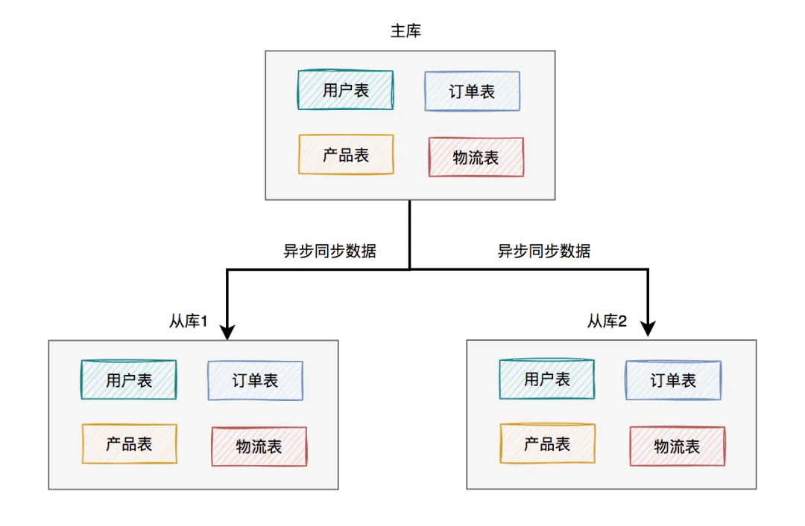

# 	MySQL性能调优

**来源：**

[MySQL性能调优](https://blog.csdn.net/weixin_41249041/article/details/102761589)

[Mybatis与JDBC批量插入MySQL数据库性能测试及解决方案](https://www.cnblogs.com/wxw7blog/p/8706797.html)

- **减少 IO 次数**:  IO永远是数据库最容易瓶颈的地方，这是由数据库的职责所决定的，大部分数据库操作中超过90%的时间都是 IO 操作所占用的，减少 IO 次数是 SQL 优化中需要第一优先考虑，当然，也是收效最明显的优化手段。
- **降低 CPU 计算** ：SQL优化中需要考虑的就是 CPU 运算量的优化了。order by, group by,distinct … 都是消耗 CPU 的大户（这些操作基本上都是 CPU 处理内存中的数据比较运算）。当我们的 IO 优化做到一定阶段之后，降低 CPU 计算也就成为了我们 SQL 优化的重要目标。

## 插入优化

**当表中数据量比较庞大时，插入数据会变得缓慢的原因有很多。其中最主要的原因包括：**

- 索引更新：插入数据时，需要更新表的索引，而随着数据量增加，索引的更新会变得更加耗时。
- 日志写入：MySQL会生成redo log，用于恢复数据。当插入大量数据时，redo log的写入也会变得更频繁，导致性能下降。需要减少日志写入，减少数据库的checkpoint 操作。
- 锁竞争：插入数据时需要获取表级别或行级别的锁，当数据量大时，锁的竞争会增加，影响性能。需要减少系统的IO冲突。

### SQL优化

- 合并SQL语句插入：合并后日志量（MySQL的binlog和innodb的事务日志）减少了，**降低日志刷盘的数据量和频率，从而提高效率**。同时也能减少SQL语句解析的次数，减少网络传输的IO。

  **SQL语句是有长度限制**，在进行数据合并在同一SQL中务必不能超过SQL长度限制，通过max_allowed_packet配置可以修改，默认是1M，测试时修改为8M。

  ```sql
  INSERT INTO `insert_table` (`datetime`, `uid`, `content`, `type`) 
      VALUES ('0', 'userid_0', 'content_0', 0), ('1', 'userid_1', 'content_1', 1);
  ```

- 使用事务：进行一个INSERT操作时，**MySQL内部会建立一个事务**，在事务内才进行真正插入处理操作。通过使用事务可以减少创建事务的消耗，所有插入都在执行后才进行提交操作。

  **事务需要控制大小**，事务太大可能会影响执行的效率。MySQL有innodb_log_buffer_size配置项，超过这个值会把innodb的数据刷到磁盘中，性能下降较快。所以比较好的做法是，在数据达到这个这个值前进行事务提交。

  ```sql
  START TRANSACTION;
  INSERT INTO `insert_table` (`datetime`, `uid`, `content`, `type`) 
      VALUES ('0', 'userid_0', 'content_0', 0);
  INSERT INTO `insert_table` (`datetime`, `uid`, `content`, `type`) 
      VALUES ('1', 'userid_1', 'content_1', 1);
  ...
  COMMIT;
  ```

- 数据有序插入：如果每次插入记录都在索引的最后面，索引的定位效率很高，并且对索引调整较小；如果插入的记录在索引中间，需要B+tree进行分裂合并等处理，会消耗比较多计算资源，并且插入记录的索引定位效率会下降，数据量较大时会有频繁的磁盘操作。

  ```sql
  INSERT INTO `insert_table` (`datetime`, `uid`, `content`, `type`) 
      VALUES ('0', 'userid_0', 'content_0', 0);
  INSERT INTO `insert_table` (`datetime`, `uid`, `content`, `type`) 
      VALUES ('1', 'userid_1', 'content_1', 1);
  INSERT INTO `insert_table` (`datetime`, `uid`, `content`, `type`) 
      VALUES ('2', 'userid_2', 'content_2',2);
  ```

  **实际测试：**

  

  从测试结果可以看到，合并数据+事务的方法在较小数据量时，性能提高是很明显的，数据量较大时（1千万以上），性能会急剧下降；而使用合并数据+事务+有序数据的方式在数据量达到千万级以上表现依旧是良好；

  在数据量较大时，数据量超过了innodb_buffer的容量，每次定位索引涉及较多的磁盘读写操作，而有序数据索引定位较为方便，不需要频繁对磁盘进行读写操作，所以可以维持较高的性能。


### JDBC优化

#### 规律总结

**MyBatis测试数据：**

| 测试样例 | AVG（s） |
| -------- | -------- |
| 1K       | 0.445    |
| 4K       | 5.623    |
| 10K      | 38.941   |
| 20K      | 144.527  |

**JDBC测试数据：**

| 测试样例  | 1W（s） | 5W(s)  | 10W(s) | 25W(s)  | 50W(s)  |
| --------- | ------- | ------ | ------ | ------- | ------- |
| 普通插入  | 28.70   | 191.91 | 367.42 | 1040.82 | 2011.82 |
| 普通+事务 | 1.64    | 12.81  | 21.91  | 49.29   | 122.81  |
| 批量插入  | 32.38   | 223.00 | 385.83 | 1199.02 | 1980.54 |
| 批量+事务 | 2.37    | 15.51  | 18.63  | 69.71   | 112.57  |

- 小于1W，Mybatis批量插入方案：对JVM进行调优，但主要的性能瓶颈在批量插入操作。鉴于mybatis在项目开发方面的优势，数据量很小的情况下还是建议使用Mybatis。
- 大于1W小于10W，JDBC批量+事务处理，对JVM进行调优（设置Stack和GC等）。一般操作30秒以内是可以容忍的性能耗时。
- 10W以上数据使用数据分批+JDBC批量+事务处理：对JVM进行调优（设置Stack和GC等），通过数据分批处理。对于分批处理需要定义分批量的大小，主要是对操作时间调优。
- 如果是100W、1000W级别的数据量，分批处理可以很大程度地提升插入效率。

mybatis批量插入问题：性能低；批量处理数据量大小受限；批量处理分批，在通过多线程并发处理时，很容易导致数据库表锁表，使得后续的操作无法进行；对象超出GC对象回收阀值，导致程序中断。

Mybatis的批量适合处理少量数据的批量处理，而JDBC适合大数据量的批量处理。据此，采用JDBC批量+事务处理大数据量的表插入操作是最合适的。


#### 实操

```java
//JDBC工具类
public class JDBCDruidUtils {
    private static DataSource dataSource;

    // 创建数据Properties集合对象加载加载配置文件
    static {
        Properties pro = new Properties();
        //加载数据库连接池对象
        try {
            //获取数据库连接池对象
            pro.load(JDBCDruidUtils.class.getClassLoader().getResourceAsStream("druid.properties"));
            dataSource = DruidDataSourceFactory.createDataSource(pro);
        } catch (Exception e) {
            e.printStackTrace();
        }
    }

    // 获取连接
    public static Connection getConnection() throws SQLException {
        return dataSource.getConnection();
    }


    /**
     * 关闭conn,和 statement独对象资源
     */
    public static void close(Connection connection, Statement statement) {
        if (connection != null) {
            try {
                connection.close();
            } catch (SQLException e) {
                e.printStackTrace();
            }
        }
        if (statement != null) {
            try {
                statement.close();
            } catch (SQLException e) {
                e.printStackTrace();
            }
        }
    }

    /**
     * 关闭 conn , statement 和resultset三个对象资源
     */
    public static void close(Connection connection, Statement statement, ResultSet resultSet) {
        close(connection, statement);
        if (resultSet != null) {
            try {
                resultSet.close();
            } catch (SQLException e) {
                e.printStackTrace();
            }
        }
    }

    // 获取连接池对象
    public static DataSource getDataSource() {
        return dataSource;
    }

}
/* druid.properties配置
driverClassName=oracle.jdbc.driver.OracleDriver
url=jdbc:oracle:thin:@localhost:1521:ORCL
username=mrkay
password=******
initialSize=10
maxActive=50
maxWait=60000
*/

/**
 * 使用 数据分批+JDBC分批插入+事务
 */
@Override
public Map<String, Object> import2DBFromExcel10w(List<Map<Integer, String>> dataList) {
    HashMap<String, Object> result = new HashMap<>();
    //结果集中数据为0时,结束方法.进行下一次调用
    if (dataList.size() == 0) {
        result.put("empty", "0000");
        return result;
    }
    //JDBC分批插入+事务操作完成对10w数据的插入
    Connection conn = null;
    PreparedStatement ps = null;
    try {
        long startTime = System.currentTimeMillis();
        System.out.println(dataList.size() + "条,开始导入到数据库时间:" + startTime + "ms");
        conn = JDBCDruidUtils.getConnection();
        //控制事务:默认不提交
        conn.setAutoCommit(false);
        String sql = "insert into ACT_RESULT_LOG (onlineseqid,businessid,becifno,ivisresult,createdby,createddate,updateby,updateddate,risklevel) values";
        sql += "(?,?,?,?,?,?,?,?,?)";
        ps = conn.prepareStatement(sql);
        //循环结果集
        for (int i = 0; i < dataList.size(); i++) {
            Map<Integer, String> item = dataList.get(i);
            // pstm.setLong(1, begin);
            ps.setString(1, item.get(0));
            ps.setString(2, item.get(1));
            ps.setString(3, item.get(2));
            // pstm.setInt(4, RandomValue.getNum(1, 100));
            ps.setString(4, item.get(3));
            ps.setString(5, item.get(4));
            ps.setTimestamp(6, new Timestamp(System.currentTimeMillis()));
            ps.setString(7, item.get(6));
            ps.setTimestamp(8, new Timestamp(System.currentTimeMillis()));
            ps.setString(9, item.get(8));
            //将一组参数添加到此 PreparedStatement 对象的批处理命令中。
            ps.addBatch();
        }
        //执行批处理
        ps.executeBatch();
        //手动提交事务
        conn.commit();
        long endTime = System.currentTimeMillis();
        System.out.println(dataList.size() + "条,结束导入到数据库时间:" + endTime + "ms");
        System.out.println(dataList.size() + "条,导入用时:" + (endTime - startTime) + "ms");
        result.put("success", "1111");
    } catch (Exception e) {
        result.put("exception", "0000");
        e.printStackTrace();
    } finally {
        //关连接
        JDBCDruidUtils.close(conn, ps);
    }
    return result;
}
```

##### JDBC 连接对象的属性设置

- 一定不要用自动提交，而使用手动提交；数据分批量不要太大，为了防止内存不足，可以设定一个峰值如 2000 条，提交一次；因为把大量数据都压一个队列中是非常占用内存的。

- `allowMultiQueries=true`：

  这个参数允许在一次请求中执行多个SQL语句。在执行批量更新或者执行包含多个SQL语句的操作时，可以减少网络往返次数，从而提高性能。

- `useServerPrepStmts=false`：

  这个参数控制预编译语句(prepared statements)的创建位置。当设置为`false`时，客户端(JDBC驱动)会自己创建预编译的语句，而当设置为`true`时，则是MySQL服务器来创建。

- `rewriteBatchedStatements=true`：

  这个参数允许JDBC驱动重写SQL语句以支持批处理操作。开启这个选项可以提高批量更新的性能。

```java
Class.forName("org.gjt.mm.mysql.Driver").newInstance();
String url ="jdbc:mysql://"+ this.HostName +":" + this.port  +"/"+ this.DBName + 
"?user="+
this.User +
"&password="+
this.Password +
"&useUnicode=true&characterEncoding=UTF-8";
url += "&useServerPrepStmts=false&rewriteBatchedStatements=true";
```


### 数据库配置优化

- 将 innodb_flush_log_at_trx_commit 配置设定为0；按过往经验设定为0，插入速度会有很大提高。

- 将 innodb_autoextend_increment 配置由于默认8M 调整到 128M。此配置项作用主要是当tablespace 空间已经满了后，需要MySQL系统需要自动扩展多少空间，每次tablespace 扩展都会让各个SQL 处于等待状态。增加自动扩展Size可以减少tablespace自动扩展次数。

- 将 innodb_log_buffer_size 配置由于默认1M 调整到 16M。此配置项作用设定innodb 数据库引擎写日志缓存区；将此缓存段增大可以减少数据库写数据文件次数。

- 将 innodb_log_file_size 配置由于默认 8M 调整到 128M。此配置项作用设定innodb 数据库引擎UNDO日志的大小；从而减少数据库checkpoint操作。

经过以上调整，系统插入速度由于原来10分钟几万条提升至1秒1W左右；注：以上参数调整，需要根据不同机器来进行实际调整。特别是 innodb_flush_log_at_trx_commit、innodb_log_buffer_size和 innodb_log_file_size 需要谨慎调整；因为涉及MySQL本身的容灾处理。

### 文件导入

另外一种比较高效的导入方式是生成一个文本文件直接从文件中导入数据到表中，使用MySQL的JDBC LOAD DATA LOCAL INFILE；

参考示例：

[MySQL使用JDBC LOAD DATA LOCAL INFILE导入注意事项](http://www.cnblogs.com/obullxl/archive/2012/06/11/jdbc-mysql-load-data-infile.html)

[MySQL使用LOAD DATA LOCAL INFILE数据3-5秒导入40W数据](http://www.jb51.net/article/33365.htm)

[Java不写文件，LOAD DATA LOCAL INFILE大批量导入数据到MySQL的实现](http://blog.itpub.net/29254281/viewspace-1839492/)


### 其他

- 禁用索引：在插入数据前，可以暂时禁用或删除索引，数据插入完成后再重新创建索引。
- 使用合适的存储引擎：对于非事务型的数据，可以考虑使用MyISAM存储引擎，它在插入性能上有更好的表现。


## 读取优化

### SQL优化

- 分别优化偏移量和数据量

  ```sql
  -- 优化偏移量 采用子查询方式
  -- 某些 mysql 版本不支持在 in 子句中使用 limit，所以采用了多个嵌套select
  SELECT * FROM `user_operation_log` WHERE id IN (SELECT t.id FROM (SELECT id FROM `user_operation_log` LIMIT 1000000, 10) AS t)
  
  
  -- 优化数据量大 不推荐使用select * 的原因，最主要是避免回表带来的随机io操作
  SELECT * FROM `user_operation_log` LIMIT 1, 1000000
  SELECT id, user_id, ip, op_data, attr1, attr2, attr3, attr4, attr5, attr6, attr7, attr8, attr9, attr10, attr11, attr12 FROM `user_operation_log` LIMIT 1, 1000000
  ```

- 尽量用 join 代替子查询，同时尽量少 join

- 尽量少排序:   排序操作会消耗较多的 CPU 资源，所以减少排序可以在缓存命中率高等 IO 能力足够的场景下会较大影响 SQL 的响应时间。

  一定需要排序操作，利用索引来优化有排序需求的 SQL，我们知道索引数据实际上是有序的，如果我们的需要的数据和某个索引的顺序一致，而且我们的查询又通过这个索引来执行，那么数据库一般会省略排序操作，而直接将数据返回，因为数据库知道数据已经满足我们的排序需求了。

- 避免使用耗费资源的操作，带有DISTINCT,UNION,MINUS,INTERSECT,ORDER BY的SQL语句会启动SQL引擎 执行，耗费资源的排序(SORT)功能.    DISTINCT需要一次排序操作, 而其他的至少需要执行两次排序

- 尽量用 union all 代替 union:  union 和 union all 的差异主要是前者需要将两个（或者多个）结果集合并后再进行唯一性过滤操作，这就会涉及到排序，增加大量的 CPU 运算，加大资源消耗及延迟。所以当我们可以确认不可能出现重复结果集或者不在乎重复结果集的时候，尽量使用 union all 而不是 union。

- 尽量早过滤:   这一优化策略其实最常见于索引的优化设计中（将过滤性更好的字段放得更靠前）。比如我们在多个表进行分页数据查询的时候，我们最好是能够在一个表上先过滤好数据分好页，然后再用分好页的结果集与另外的表 Join，这样可以尽可能多的减少不必要的 IO 操作，大大节省 IO 操作所消耗的时间。

- 优先优化高并发的 SQL，而不是执行频率低某些“大”SQL: 对于破坏性来说，高并发的 SQL 总是会比低频率的来得大，因为高并发的 SQL 一旦出现问题，甚至不会给我们任何喘息的机会就会将系统压跨。而对于一些虽然需要消耗大量 IO 而且响应很慢的 SQL，由于频率低，即使遇到，最多就是让整个系统响应慢一点，但至少可能撑一会儿，让我们有缓冲的机会。

- 从全局出发优化，而不是片面调整:  SQL 优化不能是单独针对某一个进行，而应充分考虑系统中所有的 SQL，尤其是在通过调整索引优化 SQL 的执行计划的时候，千万不能顾此失彼，因小失大。

- 尽可能对每一条运行在数据库中的SQL进行 explain :   优化 SQL，需要做到心中有数，知道 SQL 的执行计划才能判断是否有优化余地，才能判断是否存在执行计划问题。在对数据库中运行的 SQL 进行了一段时间的优化之后，很明显的问题 SQL 可能已经很少了，大多都需要去发掘，这时候就需要进行大量的 explain 操作收集执行计划，并判断是否需要进行优化。

#### 索引优化

对于类似于这样的存在非常大更新量的数据，索引的维护成本会非常高，如果其检索需求很少，而且对检索效率并没有非常高的要求的时候，我们并不建议创建索引，或者是尽量减少索引。

字段的顺序对组合索引效率有至关重要的作用，过滤效果越好的字段需要更靠前。


> 不要在建立的索引的数据列上进行下列操作:
>
> ◆避免对索引字段进行计算操作
>
> ◆避免在索引字段上使用not，<>，!=
>
> ◆避免在索引列上使用IS NULL和IS NOT NULL
>
> ◆避免在索引列上出现数据类型转换
>
> ◆避免在索引字段上使用函数
>
> ◆避免建立索引的列中使用空值。

避免类型转换：“类型转换”是指 where 子句中出现 column 字段的类型和传入的参数类型不一致的时候发生的类型转换；或人为在column_name 上通过转换函数进行转换：直接导致 MySQL（实际上其他数据库也会有同样的问题）无法使用索引，如果非要转换，应该在传入的参数上进行转换

由数据库自己进行转换，如果我们传入的数据类型和字段类型不一致，同时我们又没有做任何类型转换处理，MySQL 可能会自己对我们的数据进行类型转换操作，也可能不进行处理而交由存储引擎去处理，这样一来，就会出现索引无法使用的情况而造成执行计划问题。

```sql
SELECT emp.ename, emp.job FROM emp WHERE emp.empno = 7369;

不要使用：
SELECT emp.ename, emp.job FROM emp WHERE emp.empno = ‘7369
```


### 表结构优化

由于MySQL数据库是基于行（Row）存储的数据库，而数据库操作 IO 的时候是以 page（block）的方式，也就是说，如果我们每条记录所占用的空间量减小，就会使每个page中可存放的数据行数增大，那么每次 IO 可访问的行数也就增多了。反过来说，处理相同行数的数据，需要访问的 page 就会减少，也就是 IO 操作次数降低，直接提升性能。此外，由于我们的内存是有限的，增加每个page中存放的数据行数，就等于增加每个内存块的缓存数据量，同时还会提升内存换中数据命中的几率，也就是缓存命中率。

关于字段类型的优化建议主要适用于记录条数较多，数据量较大的场景，因为精细化的数据类型设置可能带来维护成本的提高，过度优化也可能会带来其他的问题：

数据类型选择：数据库操作中最为耗时的操作就是 IO 处理，大部分数据库操作 90% 以上的时间都花在了 IO 读写上面。所以尽可能减少 IO 读写量，可以在很大程度上提高数据库操作的性能。

> - 字符类型：非万不得已不要使用 TEXT 数据类型，其处理方式决定了他的性能要低于char或者是varchar类型的处理。定长字段，建议使用 CHAR 类型，不定长字段尽量使用 VARCHAR，且仅仅设定适当的最大长度，而不是非常随意的给一个很大的最大长度限定，因为不同的长度范围，MySQL也会有不一样的存储处理。
> - 时间类型：尽量使用TIMESTAMP类型，因为其存储空间只需要 DATETIME 类型的一半。对于只需要精确到某一天的数据类型，建议使用DATE类型，因为他的存储空间只需要3个字节，比TIMESTAMP还少。不建议通过INT类型类存储一个unix timestamp 的值，因为这太不直观，会给维护带来不必要的麻烦，同时还不会带来任何好处。
> - ENUM & SET：对于状态字段，可以尝试使用 ENUM 来存放，因为可以极大的降低存储空间，而且即使需要增加新的类型，只要增加于末尾，修改结构也不需要重建表数据。如果是存放可预先定义的属性数据呢？可以尝试使用SET类型，即使存在多种属性，同样可以游刃有余，同时还可以节省不小的存储空间。
> - LOB类型：强烈反对在数据库中存放 LOB 类型数据。

> **字符编码**
>
> 字符集直接决定了数据在MySQL中的存储编码方式，由于同样的内容使用不同字符集表示所占用的空间大小会有较大的差异，所以通过使用合适的字符集，可以帮助我们尽可能减少数据量，进而减少IO操作次数。
>
> 纯拉丁字符能表示的内容，没必要选择 latin1 之外的其他字符编码，因为这会节省大量的存储空间
>
> 如果我们可以确定不需要存放多种语言，就没必要非得使用UTF8或者其他UNICODE字符类型，这回造成大量的存储空间浪费
>
> MySQL的数据类型可以精确到字段，所以当我们需要大型数据库中存放多字节数据的时候，可以通过对不同表不同字段使用不同的数据类型来较大程度减小数据存储量，进而降低 IO 操作次数并提高缓存命中率
>
> **适当拆分**
>
> 当我们的表中存在类似于 TEXT 或者是很大的 VARCHAR类型的大字段的时候，如果我们大部分访问这张表的时候都不需要这个字段，我们就该义无反顾的将其拆分到另外的独立表中，以减少常用数据所占用的存储空间。这样做的一个明显好处就是每个数据块中可以存储的数据条数可以大大增加，既减少物理 IO 次数，也能大大提高内存中的缓存命中率。
>
> **尽量使用 NOT NULL**
>
> NULL 类型比较特殊，SQL 难优化。虽然 MySQL NULL类型和 Oracle 的NULL 有差异，会进入索引中，但如果是一个组合索引，那么这个NULL 类型的字段会极大影响整个索引的效率。此外，NULL 在索引中的处理也是特殊的，也会占用额外的存放空间。虽然空间上可能确实有一定节省，倒是带来了很多其他的优化问题，不但没有将IO量省下来，反而加大了SQL的IO量。所以尽量确保 DEFAULT 值不是 NULL，也是一个很好的表结构设计优化习惯。
>


一个好的数据库设计方案对于数据库的性能往往会起到事半功倍的效果。需要考虑数据冗余、查询和更新的速度、字段的数据类型是否合理等多方面的内容。

**将字段很多的表分解成多个表**

对于字段较多的表，如果有些字段的使用频率很低，可以将这些字段分离出来形成新表。因为当一个表的数据量很大时，会由于使用频率低的字段的存在而变慢。

**增加中间表**

对于需要经常联合查询的表，可以建立中间表以提高查询效率。通过建立中间表，将需要通过联合查询的数据插入到中间表中，然后将原来的联合查询改为对中间表的查询。

**增加冗余字段**

设计数据表时应尽量遵循范式理论的规约，尽可能的减少冗余字段，让数据库设计看起来精致、优雅。但是，合理的加入冗余字段可以提高查询速度。

表的规范化程度越高，表和表之间的关系越多，需要连接查询的情况也就越多，性能也就越差。

注意：

冗余字段的值在一个表中修改了，就要想办法在其他表中更新，否则就会导致数据不一致的问题。


### 分库分表

来源：

[好好的系统，为什么要分库分表？](https://mp.weixin.qq.com/s?__biz=MzkyMzU5Mzk1NQ==&mid=2247506690&idx=1&sn=2341d5ba9c3a4a3027166aa9361963aa&source=41#wechat_redirect)

[阿里二面：为什么要分库分表？](https://mp.weixin.qq.com/s/klkD8xea0gQ96Mh1Q1MHLw)

- 垂直拆分，根据你模块的耦合度，将一个大的系统分为多个小的系统，也就是分布式系统；

- 水平切分，针对数据量大的表，这一步最麻烦，最能考验技术水平，要选择一个合理的sharding key(切分键)， 为了有好的查询效率，表结构要改动，做一定的冗余，应用也要改，sql中尽量带sharding key，将数据定位到限定的表上去查，而不是扫描全部的表

通过一定的规则，将原本数据量大的数据库拆分成多个单独的数据库，将原本数据量大的表拆分成若干个数据表，使得单一的库、表性能达到最优的效果（响应速度快），以此提升整体数据库性能。

单机数据库的存储能力、连接数是有限的，它自身就很容易会成为系统的瓶颈。当单表数据量在百万以里时，我们还可以通过添加从库、优化索引提升性能。一旦数据量朝着**千万以上**趋势增长，再怎么优化数据库，很多操作性能仍下降严重。分库分表是在海量数据下，由于单库、表数据量过大，导致数据库性能持续下降的问题，演变出的技术方案。


在水平方向（即数据方向）上，分库和分表的作用，其实是有区别的，不能混为一谈。

- 分库：是为了解决数据库分配的磁盘容量，连接数资源不足问题，和磁盘IO的性能瓶颈问题。
- 分表：是为了解决单表数据量太大，`InnoDB`存储引擎，聚簇索引结构的 B+tree 层级变高，磁盘IO变多查询性能变慢。此外还可以解决消耗cpu资源问题。
- 分库分表：可以解决 数据库连接资源不足、磁盘IO的性能瓶颈、检索数据耗时 和 消耗cpu资源等问题。

如果在有些业务场景中，用户并发量很大，但是需要保存的数据量很少，这时可以只分库，不分表。

如果在有些业务场景中，用户并发量不大，但是需要保存的数量很多，这时可以只分表，不分库。

如果在有些业务场景中，用户并发量大，并且需要保存的数量也很多时，可以分库分表。


#### 方法

> 分库分表的核心就是对数据的分片（`Sharding`）并相对均匀的路由在不同的库、表中，以及分片后对数据的快速定位与检索结果的整合。

分库与分表可以从：垂直（纵向）和 水平（横向）两种纬度进行拆分。

**垂直拆分**

垂直方向主要针对的是业务

- 垂直分库

  垂直分库一般来说按照**业务和功能**的维度进行拆分，将不同业务数据分别放到不同的数据库中，核心理念**专库专用**。

- 垂直分表

  垂直分表针对**业务上字段比较多的大表**进行的，除了按实际业务分表之外，还有一个常用的分表原则是：把调用频次高的放在一张表，调用频次低的放在另一张表。

**水平拆分**

水平方向主要针对的是数据

- 水平分库

  水平分库是把同一个表按一定规则拆分到不同的数据库中，每个库可以位于不同的服务器上，以此实现水平扩展，是一种常见的提升数据库性能的方式。

- 水平分表

  水平分表是在**同一个数据库内**，把一张大数据量的表按一定规则，切分成多个结构完全相同表，而每个表只存原表的一部分数据。

  水平分表解决了单一表数据量过大的问题，但是还在竞争同一个物理机的CPU、内存、网络IO等。要想进一步提升性能，就需要将拆分后的表分散到不同的数据库中，达到分布式的效果。

#### 算法

- 取模算法

  关键字段取模（对hash结果取余数 hash(XXX) mod N)，N为数据库实例数或子表数量）是最为常见的一种路由方式。

  实现简单，数据分布相对比较均匀，不易出现请求都打到一个库上的情况。但是取模算法对集群的伸缩支持不太友好。

- 范围限定算法

  范围限定算法以某些范围字段，如`时间`或`ID区`拆分。

  用户表`t_user`被拆分成`t_user_1`、`t_user_2`、`t_user_3`三张表，后续将`user_id`范围为1 ~ 1000w的用户数据放入`t_user_1`，1000~ 2000w放入`t_user_2`，2000~3000w放入`t_user_3`，以此类推。按日期范围划分同理。

  单表数据量是可控的，且水平扩展简单只需增加节点即可，无需对其他分片的数据进行迁移。但是由于连续分片可能存在`数据热点`，比如按时间字段分片时，如果某一段时间（双11等大促）订单骤增，存11月数据的表可能会被频繁的读写，其他分片表存储的历史数据则很少被查询，导致数据倾斜，数据库压力分摊不均匀。

- 范围 + 取模算法

  为了避免热点数据的问题，我们可以对上范围算法优化一下，这次我们先通过范围算法定义每个库的用户表`t_user`只存1000w数据，第一个`db_order_1`库存放`userId`从1 ~ 1000w，第二个库1000~2000w，第三个库2000~3000w，以此类推。每个库里再把用户表`t_user`拆分成`t_user_1`、`t_user_2`、`t_user_3`等，对`userd`进行取模路由到对应的表中。

  有效的避免数据分布不均匀的问题，数据库水平扩展也简单，直接添加实例无需迁移历史数据。

- 地理位置分片

  地理位置分片其实是一个更大的范围，按城市或者地域划分，比如华东、华北数据放在不同的分片库、表。

- 预定义算法

  预定义算法是事先已经明确知道分库和分表的数量，可以直接将某类数据路由到指定库或表中，查询的时候亦是如此。

#### 问题

- 分页、排序、跨节点联合查询

  分页、排序、联合查询，这些看似普通，开发中使用频率较高的操作，在分库分表后却是让人非常头疼的问题。把分散在不同库中表的数据查询出来，再将所有结果进行汇总合并整理后提供给用户。

  - **跨库join** 解决这一问题的普遍做法是分两次查询实现。在第一次查询的结果集中找出关联数据的id,根据这些id发起第二次请求得到关联数据。 

  - **跨节点的count,order by,group by以及聚合函数问题**  它们都需要基于全部数据集合进行计算。分别在各个节点上得到结果后在应用程序端进行合并。和join不同的是每个结点的查询可以并行执行，因此很多时候它的速度要比单一大表快很多。但如果结果集很大，对应用程序内存的消耗是一个问题。

- 事务一致性

  分库分表后由于表分布在不同库中，不可避免会带来跨库事务问题。可以以阿里的`Seata`和MySQL的`XA`协议实现分布式事务。

- 全局唯一的主键

  分库分表后数据库表的主键ID业务意义就不大了，因为无法在标识唯一一条记录，我们需要主动为一条记录分配一个ID，这个全局唯一的ID就叫`分布式ID`，发放这个ID的系统通常被叫发号器。

- 历史数据迁移，容量规划，扩容

  分库分表架构落地以后，首要的问题就是如何平滑的迁移历史数据，增量数据和全量数据迁移。

- 多数据库高效治理

  对多个数据库以及库内大量分片表的高效治理，是非常有必要，因为像某宝这种大厂一次大促下来，订单表可能会被拆分成成千上万个`t_order_n`表，如果没有高效的管理方案，手动建表、排查问题是一件很恐怖的事。

#### 模式

分库分表架构主要有两种模式：`client`客户端模式和`proxy`代理模式

- 客户模式

  `client`模式指分库分表的逻辑都在你的系统应用内部进行控制，应用会将拆分后的SQL直连多个数据库进行操作，然后本地进行数据的合并汇总等操作。

   分片逻辑在应用端，封装在jar包中，通过修改或者封装JDBC层来实现。 当当网的`Sharding-JDBC` 、阿里的TDDL是两种比较常用的实现。

- 代理模式

  `proxy`代理模式将应用程序与MySQL数据库隔离，业务方的应用不在需要直连数据库，而是连接proxy代理服务，代理服务实现了MySQL的协议，对业务方来说代理服务就是数据库，它会将SQL分发到具体的数据库进行执行，并返回结果。该服务内有分库分表的配置，根据配置自动创建分片表。

  在应用和数据中间加了一个代理层。分片逻辑统一维护在中间件服务中。Mycat 、360的Atlas、网易的DDB等等都是这种架构的实现。

**区别：**

- 性能

  性能方面`client`模式表现的稍好一些，它是直接连接MySQL执行命令；`proxy`代理服务则将整个执行链路延长了，应用->代理服务->MySQL，可能导致性能有一些损耗，但两者差距并不是非常大。

- 复杂度

  `client`模式在开发使用通常引入一个jar可以；`proxy`代理模式则需要搭建单独的服务，有一定的维护成本，既然是服务那么就要考虑高可用，毕竟应用的所有SQL都要通过它转发至MySQL。

- 升级

  `client`模式分库分表一般是依赖基础架构团队的Jar包，一旦有版本升级或者Bug修改，所有应用到的项目都要跟着升级。小规模的团队服务少升级问题不大，如果是大公司服务规模大，且涉及到跨多部门，那么升级一次成本就比较高；

  `proxy`模式在升级方面优势很明显，发布新功能或者修复Bug，只要重新部署代理服务集群即可，业务方是无感知的，但要保证发布过程中服务的可用性。

- 治理、监控

  `client`模式由于是内嵌在应用内，应用集群部署不太方便统一处理；`proxy`模式在对SQL限流、读写权限控制、监控、告警等服务治理方面更优雅一些。


### 主从读写分离

众所周知，数据库连接是有限的，它是非常宝贵的资源。而每次数据库的读或写请求，都需要占用至少一个数据库连接。如果用户的请求当中，读数据的请求占据了大部分，真正写数据的请求占比很少。可以把读库和写库分开，使用主从读写分离架构。主库负责写，从库负责读。

**一主多从：**



所有的写数据请求，都指向主库。一旦主库写完数据之后，立马异步同步给从库。这样所有的读数据请求，就能及时从从库中获取到数据了（除非网络有延迟）。因为如果主库挂了，可以升级从库为主库，将所有读写请求都指向新主库，系统又能正常运行了。


### 其他

**表分区**

**缓存优化：**

数据库属于 IO 密集型的应用程序，其主要职责就是数据的管理及存储工作。而我们知道，从内存中读取一个数据库的时间是微秒级别，而从一块普通硬盘上读取一个IO是在毫秒级别，二者相差3个数量级。所以，要优化数据库，首先第一步需要优化的就是IO，尽可能将磁盘IO转化为内存IO。

可以加缓存，memcached, redis；


## CPU优化

**MySQL数据库cpu飙升到500%怎么处理**

当 cpu 飙升到 500%时，先用操作系统命令 top 命令观察是不是 mysqld 占用导致的，如果不是，找出占用高的进程，并进行相关处理。

如果是 mysqld 造成的， `show processlist`，看看里面跑的 session 情况，是不是有消耗资源的 sql 在运行。找出消耗高的 sql，看看执行计划是否准确，index 是否缺失，或者实在是数据量太大造成。

一般来说，肯定要 kill 掉这些线程(同时观察 cpu 使用率是否下降)，等进行相应的调整(比如说加索引、改 sql、改内存参数)之后，再重新跑这些 SQL。

也有可能是每个 sql 消耗资源并不多，但是突然之间，有大量的 session 连进来导致 cpu 飙升，这种情况就需要跟应用一起来分析为何连接数会激增，再做出相应的调整，比如说限制连接数等

