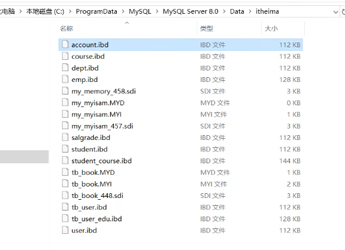

## 表常用操作

### 复制表

```mysql
#只复制表结构，包括主键、索引，但不会复制表数据
create table tableName like someTable;
#复制表的大体结构及全部数据，不会复制主键、索引等
create table tableName select * from someTable;
#完整复制，分两步完成，先复制表结构，再插入数据
create table tableName like someTable;
insert into tableName select * from someTable;
```

### 导出数据

#### SELECT...INTO OUTFILE

在MySQL中，可以使用SELECT...INTO OUTFILE语句将查询结果数据导出到文本文件。

```mysql
#文件存储路径
SELECT * FROM employee INTO OUTFILE 'D:\\employee.txt' 
#字段间分隔符
FIELDS TERMINATED BY ','  
#值用双引号引起
ENCLOSED BY '"' 
#行间分隔符,\r\n在mysql中表示换行
LINES TERMINATED BY '\r\n';
```

```mysql
#mysql中secure_file_priv参数控制导出
#null 表示不允许导入导出		空 表示没有任何限制		指定路径 表示导入导出只能在指定路径下完成    
show variables like "secure_file_priv";    
```

#### mysql命令

通常，我们使用mysql命令连接数据库，mysql命令有一个`-e`选项，可以执行指定的SQL语句，再结合DOS的重定向操作符”>”可以将查询结果导出到文件

```sh
mysql -h localhost -u root -p -D mydb -e "select * from employee" > E:\employee.txt
```

#### mysqldump命令

mysqldump是MySQL用于转存储数据库的实用程序，它主要产生一个SQL脚本，其中包含创建数据库、创建数据表、插入数据所必需的SQL语句。

```sh
# 导出mydb数据库（含数据）
mysqldump -h localhost -u root -p mydb > d:/mydb.sql
# 导出mydb数据库（不含数据）
mysqldump -h localhost -u root -p mydb --no-data > d:/mydb.sql
# 导出mydb.employee数据表
mysqldump -h localhost -u root -p mydb employee > d:/employee.sql
# 导出mydb数据库，忽略contacts表
mysqldump -h localhost -u root -p mydb --ignore-table mydb.contacts > d:/employee.sql
```

### 定时备份数据库

定时调度器-->数据库备份脚本

定时调度器有：

- Windows的定时计划
- Linux的Crontab
- 编程语言的Timer

数据库备份脚本有：

- DOS批处理脚本
- Linux Shell脚本

#### Windows

schtasks.exe用于安排命令和程序在指定时间内运行或定期运行，它可以从计划表中添加和删除任务、按需要启动和停止任务、显示和更改计划任务。

```sh
#备份数据库的脚本mysql_mydb_backup.bat
mysqldump -h localhost -uroot -p123456 mydb > d:\backup\mydb.sql
#创建计划任务（每隔指定时间备份一次MySQL）
schtasks /create /sc minute /mo 1 /tn 定期备份MySQL /tr d:\backup\mysql_mydb_backup.bat
#删除计划任务
schtasks /delete /tn 定期备份MySQL
```

#### Linux

```sh
#!/bin/bash
#备份目录
backup_dir=/home/liufeng/backup
#备份文件名
backup_filename=“mydb-`date +%Y%m%d`.sql“
#进入备份目录
cd $backup_dir
#备份数据库
mysqldump -h localhost -uroot -p123456 mydb > ${backup_dir}/${backup_filename}
#删除7天以前的备份
find ${backup_dir} -mtime +7 -name "*.sql" -exec rm -rf {} \;
```

crontab是一个命令，常见于Unix和类Unix的操作系统之中，用于周期性执行任务。

```sh
#每天凌晨01:30执行shell脚本（备份数据库）
30 1 * * * bash /home/liufeng/backup/mysql_mydb_backup.sh
```

### 导入数据

#### LOAD DATA

在MySQL中，可以使用LOAD DATA语句将文本文件数据导入到对应的数据库表中，可以将LOAD DATA语句看成是SELECT…INTO OUTFILE的反操作

```mysql
#数据文件位置
>LOAD DATA INFILE 'D:\\employee.txt' INTO TABLE employee character set utf8 
#字段间分隔符
>FIELDS TERMINATED BY ',' 
#值用双引号引起    
>ENCLOSED BY '"' 
#行间分隔符    
>LINES TERMINATED BY '\r\n';
```

#### source命令

在MySQL中，可以使用source命令导入较大的SQL文件。source命令可以导入使用mysqldump备份的sql文件。

```mysql
>source d:/mydb.sql
```


## 数据库连接池

### 流程

#### 不使用连接池流程

1. TCP建立连接的三次握手
2. MySQL认证的三次握手
3. 真正的SQL执行
4. MySQL的关闭
5. TCP的四次握手关闭

#### 使用连接池流程

- 第一次访问的时候，需要建立连接。 但是之后的访问，均会复用之前创建的连接，直接执行SQL语句。
- 当客户请求数据库连接时，首先查看连接池中是否有空闲连接，如果存在空闲连接，则将连接分配给客户使用；如果没有空闲连接，则查看当前所开的连接数是否已经达到最大连接数，如果没达到就重新创建一个连接给请求的客户；如果达到就按设定的最大等待时间进行等待，如果超出最大等待时间，则抛出异常给客户。
- 每一个事务都会独占一个数据库连接。

参考：[数据库连接池了解和常用连接池对比](https://www.cnblogs.com/whb11/p/11315463.html)

### 连接池类型

第一代连接池c3p0和dbcp一般已经弃用了，常用第二代连接池HikariCP和Druid

### SpringBoot配置数据库连接池

```java
//springboot2.3.0版本org.springframework.boot.autoconfigure.jdbc.DataSourceBuilder
//SpringBoot中默认支持的连接池有dbcp2, tomcat, hikari三种连接池
public final class DataSourceBuilder<T extends DataSource> {
   private static final String[] DATA_SOURCE_TYPE_NAMES = new String[] {
       "com.zaxxer.hikari.HikariDataSource",
       "org.apache.tomcat.jdbc.pool.DataSource", 
       "org.apache.commons.dbcp2.BasicDataSource" 
   };
         ...
}
```

#### 配置默认数据库连接池（Hikari）

```xml
<!-- jdbc起步依赖 -->
<dependency>
    <groupId>org.springframework.boot</groupId>
    <artifactId>spring-boot-starter-jdbc</artifactId>
</dependency>
<!-- mysql数据库驱动 -->
<dependency>
    <groupId>mysql</groupId>
    <artifactId>mysql-connector-java</artifactId>
</dependency>
```

```properties
# application.properties
# 必要配置
# 驱动程序类名称
spring.datasource.driver-class-name=com.mysql.jdbc.Driver
spring.datasource.url=jdbc:mysql://127.0.0.1:3306/datebook?useUnicode=true&characterEncoding=UTF-8&autoReconnect=true&useSSL=false&zeroDateTimeBehavior=convertToNull
spring.datasource.username=root
spring.datasource.password=root

# 常用配置
# 指定使用的数据库连接池类型
spring.datasource.type=com.zaxxer.hikari.HikariDataSource
# 最小空闲连接数，如果空闲连接低于此值并且连接池中的总连接数少于maximumPoolSize就会创建新连接，默认值：与maximumPoolSize相同
spring.datasource.hikari.minimum-idle=5
# 最大实际连接数，默认值：10
spring.datasource.hikari.maximum-pool-size=15
# 事务自动提交，默认值：true
spring.datasource.hikari.auto-commit=true
# 允许连接在池中闲置的最长时间，当连接数减少到minimum-idle，空闲连接将不会退出，值为0意味着空闲连接永远不会从池中删除，默认值：600000（10分钟）
spring.datasource.hikari.idle-timeout=30000
# 连接池名称，默认：自动生成
spring.datasource.hikari.pool-name=DatebookHikariCP
# 连接的最大生存周期，正在使用的连接永远不会删除，值为0表示无限寿命， 默认值：1800000（30分钟）
spring.datasource.hikari.max-lifetime=1800000
# 客户端等待连接的最大毫秒数，没有可用连接的情况下超过此时间，则会抛出SQLException，默认值：30000（30秒）
spring.datasource.hikari.connection-timeout=30000
# 驱动程序JDBC4之前，检测新获取的连接是否存在未完成的查询，JDBC4不需要，默认值：无
spring.datasource.hikari.connection-test-query=SELECT 1
```

参考：[Springboot 2.0默认连接池HikariCP详解（效率最高）](https://blog.csdn.net/weixin_41249041/article/details/90578226)

#### 配置druid连接池

```xml
<!-- 阿里系的Druid依赖包 -->
<dependency>
    <groupId>com.alibaba</groupId>
    <artifactId>druid-spring-boot-starter</artifactId>
    <version>1.1.9</version>
</dependency>
<!-- Druid 依赖 log4j包，但是SpringBoot默认使用的是slf4j+logback -->
<dependency>
    <groupId>log4j</groupId>
    <artifactId>log4j</artifactId>
    <version>1.2.17</version>
</dependency>
```

```properties
#mysql 配置
spring.datasource.driverClassName=com.mysql.jdbc.Driver
spring.datasource.url=jdbc:mysql://192.168.2.126:3306/springboot_druid_demo?characterEncoding=utf-8&autoReconnect=true&zeroDateTimeBehavior=convertToNull&useSSL=false
spring.datasource.username=root
spring.datasource.password=123456

#阿里druid连接池驱动配置信息
spring.datasource.type=com.alibaba.druid.pool.DruidDataSource
#连接池的配置信息
#初始化大小
spring.datasource.initialSize=5
#最小空闲连接数
spring.datasource.minIdle=5
#最大连接数
spring.datasource.maxActive=20
#配置获取连接等待超时的时间
spring.datasource.maxWait=60000
#配置间隔多久才进行一次检测，检测需要关闭的空闲连接，单位是毫秒
spring.datasource.timeBetweenEvictionRunsMillis=60000
#配置一个连接在池中最小生存的时间，单位是毫秒
spring.datasource.minEvictableIdleTimeMillis=300000
spring.datasource.validationQuery=SELECT 1 FROM DUAL
spring.datasource.testWhileIdle=true
spring.datasource.testOnBorrow=false
spring.datasource.testOnReturn=false
#打开PSCache，并且指定每个连接上PSCache的大小
spring.datasource.poolPreparedStatements=true
spring.datasource.maxPoolPreparedStatementPerConnectionSize=20
#配置监控统计拦截的filters，去掉后监控界面sql无法统计，'wall'用于防火墙
spring.datasource.filters=stat,wall,log4j
#通过connectProperties属性来打开mergeSql功能；慢SQL记录
spring.datasource.connectionProperties=druid.stat.mergeSql=true;druid.stat.slowSqlMillis=5000
```

```java
@Configuration
public class DruidConfig {
    @Bean
    public ServletRegistrationBean druidServlet() {// 主要实现web监控的配置处理
        ServletRegistrationBean servletRegistrationBean = new ServletRegistrationBean(
                new StatViewServlet(), "/druid/*");//表示进行druid监控的配置处理操作
        servletRegistrationBean.addInitParameter("allow", "127.0.0.1,129.168.1.11");//白名单，空字符串表示允许所有地址访问
        servletRegistrationBean.addInitParameter("deny", "129.168.1.12");//黑名单
        servletRegistrationBean.addInitParameter("loginUsername", "root");//用户名
        servletRegistrationBean.addInitParameter("loginPassword", "root");//密码
        servletRegistrationBean.addInitParameter("resetEnable", "false");//是否可以重置数据源
        return servletRegistrationBean;

    }
    @Bean    //监控
    public FilterRegistrationBean filterRegistrationBean(){
        FilterRegistrationBean filterRegistrationBean=new FilterRegistrationBean();
        filterRegistrationBean.setFilter(new WebStatFilter());
        filterRegistrationBean.addUrlPatterns("/*");//所有请求进行监控处理
        filterRegistrationBean.addInitParameter("exclusions", "*.js,*.gif,*.jpg,*.css,/druid/*");//排除
        return filterRegistrationBean;
    }
    
    //配置连接池
    @Bean
    @ConfigurationProperties(prefix = "spring.datasource")
    public DataSource druidDataSource() {
        /*
        	可以不使用配置文件直接赋值
         	DataSource  dataSource = new DruidDataSource();
           dataSource.setDriverClasClassName("com.mysql.jdbc.Driver");
           dataSource.setUrl(url);
           dataSource.setUsername(username);
           dataSource.setPassword(password);
           dataSource.setMaxActive(maxTotal);
           dataSource.setMinIdle(minIdle);
           dataSource.setMaxIdle(maxIdle);
           dataSource.setInitialSizlSize(initialSize);
        */
        return new DruidDataSource();
    }
}
```

## 常见SQL使用

#### 每门课都大于x分

**请用一条SQL筛选出所有课程的成绩都大于等于85的学生**

```java
>select * from score;
Name Course Grade
张三 语文 89
张三 数学 77
张三 计算机 65
李四 语文 95
李四 数学 90
李四 计算机 88
王五 语文 66
王五 数学 85
王五 计算机 94
```

```java
1、只要最低分数>=85就意味着所有课程成绩>=85
>select name from score group by name having min(grade)>=85;    
    
2、排除法，只要有一门课的成绩小于85就不满足条件
>select distinct name from score A where not exists(
	select * from score B where A.name=B.name and grade<85
);
    
3、所有成绩的个数与>=85的成绩个数相等 
>select name from acore where grade >=85 
    group by name having count(*) = select count(distinct course) from score;
```

#### 课程选修问题

**查询至少选修了202002学生选修的全部课程的学生学号**

```java
>select * from score;
学号sno 课程号cno 分数score
202001 01 85
202001 03 65
202002 02 80
202002 04 81
202002 01 68
202003 06 74
202003 01 78
202003 02 70
202003 04 72
202004 01 55
202004 02 44
202004 03 0
    
1）找出学号=202002的学生选修的所有课程
2）根据1）的结果，找出所有跟202002选修了同一门课（任意一门）的数据
3）按学号进行分组，从2）的结果中找出选课数量等于202002学生的选课数量的所有学生

select B.sno from score B where B.cno in(      
	select A.cno from score A where A.sno='202002'
)
group by B.sno
having count(*)=(select count(*) from score C where c.sno='202002');    
```

#### 生成比赛对阵表

**有A、B、C、D四个球队进行比赛，用一条SQL显示出所有可能的比赛组合。**

其中一共有4x4=16种组合，但是AA不能比赛，AB匹配之后BA重复

```java
>select * from team;
id name
 1  A
 2  B
 3  C
 4  D
    
1）表和它自身（A、B两张表）做笛卡尔积
2）再筛选出 A.name>B.name 或 A.name < B.name 的所有记录
>select A.name,B.name from team A,team B where A.name < B.name;
```

#### 删除冗余记录

**学生表中产生了冗余记录，请用一条SQL删除所有冗余记录。**

```java
>select * from student;
自动编号 学号 姓名 年龄
1 202001 张三 18
2 202002 李四 19
3 202002 李四 19
4 202003 王五 18
5 202004 赵六 21
6 202004 赵六 21
7 202004 赵六 21
8 202005 田七 20
```

```java
排除法，将需要保留的记录排除
1）按照学号、姓名、年龄进行分组，找出最大或最小的所有 id
2）将不在1）的结果之内的所有id对应的记录都删除
        
>delete from student where id not in {
    select max(id) from student group by sno,name,age
};

>delete from student where id in( 
    select id from student where id not in (
        select max(id) from student group by sno,name,age
    )
);

在实际使用中，根据指定条件进行删除或修改数据时，经常会遇到如下错误，意思是不允许在子查询中出现
update或delete要操作的表。
ERROR 1093 (HY000): You can't specify target table 'sql04_student' for update in FROM clause
    
所以mysql中以上两种方式都会报错，这里需要做一个嵌套生成衍生表temp再删除    
>delete from student where id in(
    select * from (
        select id from student where id not in (
            select max(id) from student group by sno,name,age
        )
    ) temp
);
```

#### 横表与纵表的概念、场景及互换

**概念**

- 横表：平时接触的绝大多数表都是横表，如(主键，字段1，字段2，…，字段n)
- 纵表：key-value存储方式，如(主键，字段编码，字段值)

**横表**

sql_h

| name | sex  | chinese | math |
| ---- | ---- | ------- | ---- |
| 张三 | 男   | 89      | 56   |
| 李四 | 女   | 78      | 23   |

**纵表**

sql_v

| name | key  | value |
| ---- | ---- | ----- |
| 张三 | 性别 | 男    |
| 张三 | 语文 | 89    |
| 张三 | 数学 | 56    |
| 李四 | 性别 | 女    |
| 李四 | 语文 | 78    |
| 李四 | 数学 | 23    |

**对比**

| 对比项   | 横表                             | 纵表                               |
| -------- | -------------------------------- | ---------------------------------- |
| 数据量   | 一行表示一个实体                 | 多行表示一个实体                   |
| 业务描述 | 符合常规，易于理解               | 不直观                             |
| 代码方面 | 业务代码清晰，简洁明了           | 通常需要转换成横表，较复杂         |
| 性能方面 | 跟业务报表吻合，查询开销小       | 查询开销大                         |
| 字段类型 | 每个字段根据实际情况设计专用类型 | 值字段通常是varchar，兼容各种情况  |
| 数据冗余 | 有一定的冗余                     | 有一定的冗余                       |
| 可扩展性 | 对实体增加属性，需要动表结构     | 对实体增加属性，只需要增加记录即可 |

通过上面的对比，不难发现，相对于横表，纵表主要的优势是可扩展性强，适用于表结构不固定、经常扩展的场景，如电信行业的用户账单明细，金融行业的收支明细。

**转换**

```java
--横表转纵表 union all
select A.name, '性别' as 'key', A.sex as 'value' from sql_h A
union all
select A.name, '语文' as 'key', A.chinese as 'value' from sql_h A
union all
select A.name, '数学' as 'key', A.math as 'value' from sql_h A;
```

```java
--纵表转横表 
select
    A.name, 
	max(case when A.key='性别' then A.value end) as sex, 
	max(case when A.key='语文' then A.value end) as chinese, 
	max(case when A.key='数学' then A.value end) as math 
from sql_v A group by A.name;
```


InnoDB逻辑存储结构：表空间 - 段 - 区 - 页




