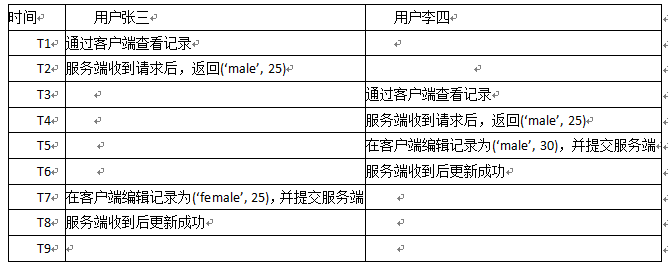
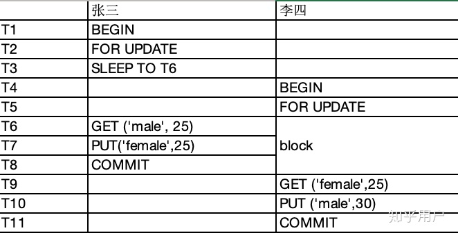
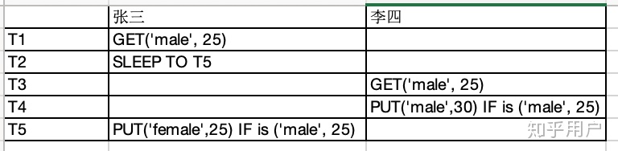

# Mybatis-Plus

## 依赖

```java
<dependency>
    <groupId>com.baomidou</groupId>
    <artifactId>mybatis-plus-boot-starter</artifactId>
    <version>3.3.1.tmp</version>
</dependency>
<dependency>
    <groupId>mysql</groupId>
    <artifactId>mysql-connector-java</artifactId>
    <version>8.0.18</version>
</dependency>
<dependency>
    <groupId>org.projectlombok</groupId>
    <artifactId>lombok</artifactId>
    <version>1.18.10</version>
</dependency>
```


## 配置日志

想要查看执行的 sql 语句，可以在 yml 文件中添加配置信息，如下。

```java
mybatis-plus:
  configuration:
    log-impl: org.apache.ibatis.logging.stdout.StdOutImpl
```

## 代码生成器

### 依赖

```java
<dependency>
    <groupId>com.baomidou</groupId>
    <artifactId>mybatis-plus-generator</artifactId>
    <version>3.3.1.tmp</version>
</dependency>
<!-- 添加 模板引擎 依赖 -->
<dependency>
    <groupId>org.apache.velocity</groupId>
    <artifactId>velocity-engine-core</artifactId>
    <version>2.2</version>
</dependency>
```

### 代码

```java
public class TestAutoGenerate {
    @Test
    public void autoGenerate() {
        // Step1：代码生成器
        AutoGenerator mpg = new AutoGenerator();

        // Step2：全局配置
        GlobalConfig gc = new GlobalConfig();
        // 填写代码生成的目录(需要修改)
        String projectPath = "E:\\myProject\\test\\test_mybatis_plus";
        // 拼接出代码最终输出的目录
        gc.setOutputDir(projectPath + "/src/main/java");
        // 配置开发者信息（可选）（需要修改）
        gc.setAuthor("lyh");
        // 配置是否打开目录，false 为不打开（可选）
        gc.setOpen(false);
        // 实体属性 Swagger2 注解，添加 Swagger 依赖，开启 Swagger2 模式（可选）
        //gc.setSwagger2(true);
        // 重新生成文件时是否覆盖，false 表示不覆盖（可选）
        gc.setFileOverride(false);
        // 配置主键生成策略，此处为 ASSIGN_ID（可选）
        gc.setIdType(IdType.ASSIGN_ID);
        // 配置日期类型，此处为 ONLY_DATE（可选）
        gc.setDateType(DateType.ONLY_DATE);
        // 默认生成的 service 会有 I 前缀
        gc.setServiceName("%sService");
        mpg.setGlobalConfig(gc);

        // Step3：数据源配置（需要修改）
        DataSourceConfig dsc = new DataSourceConfig();
        // 配置数据库 url 地址
        dsc.setUrl("jdbc:mysql://localhost:3306/testMyBatisPlus?useUnicode=true&characterEncoding=utf8");
        // dsc.setSchemaName("testMyBatisPlus"); // 可以直接在 url 中指定数据库名
        // 配置数据库驱动
        dsc.setDriverName("com.mysql.cj.jdbc.Driver");
        // 配置数据库连接用户名
        dsc.setUsername("root");
        // 配置数据库连接密码
        dsc.setPassword("123456");
        mpg.setDataSource(dsc);

        // Step:4：包配置
        PackageConfig pc = new PackageConfig();
        // 配置父包名（需要修改）
        pc.setParent("com.lyh.test");
        // 配置模块名（需要修改）
        pc.setModuleName("test_mybatis_plus");
        // 配置 entity 包名
        pc.setEntity("entity");
        // 配置 mapper 包名
        pc.setMapper("mapper");
        // 配置 service 包名
        pc.setService("service");
        // 配置 controller 包名
        pc.setController("controller");
        mpg.setPackageInfo(pc);

        // Step5：策略配置（数据库表配置）
        StrategyConfig strategy = new StrategyConfig();
        // 指定表名（可以同时操作多个表，使用 , 隔开）（需要修改）
        strategy.setInclude("test_mybatis_plus_user");
        // 配置数据表与实体类名之间映射的策略
        strategy.setNaming(NamingStrategy.underline_to_camel);
        // 配置数据表的字段与实体类的属性名之间映射的策略
        strategy.setColumnNaming(NamingStrategy.underline_to_camel);
        // 配置 lombok 模式
        strategy.setEntityLombokModel(true);
        // 配置 rest 风格的控制器（@RestController）
        strategy.setRestControllerStyle(true);
        // 配置驼峰转连字符
        strategy.setControllerMappingHyphenStyle(true);
        // 配置表前缀，生成实体时去除表前缀
        // 此处的表名为 test_mybatis_plus_user，模块名为 test_mybatis_plus，去除前缀后剩下为 user。
        strategy.setTablePrefix(pc.getModuleName() + "_");
        mpg.setStrategy(strategy);

        // Step6：执行代码生成操作
        mpg.execute();
    }
}
```

##  常用注解

```java
【@TableName 】
    @TableName               用于定义表名
注：
    常用属性：
        value                用于定义表名

【@TableId】
    @TableId                 用于定义表的主键
注：
    常用属性：
        value           用于定义主键字段名
        type            用于定义主键类型（主键策略 IdType）

   主键策略：
      IdType.AUTO          主键自增，系统分配，不需要手动输入
      IdType.NONE          未设置主键
      IdType.INPUT         需要自己输入 主键值。
      IdType.ASSIGN_ID     系统分配 ID，用于数值型数据（Long，对应 mysql 中 BIGINT 类型）。
      IdType.ASSIGN_UUID   系统分配 UUID，用于字符串型数据（String，对应 mysql 中 varchar(32) 类型）。

【@TableField】  
    @TableField            用于定义表的非主键字段。
注：
    常用属性：
        value                用于定义非主键字段名
        exist                用于指明是否为数据表的字段， true 表示是，false 为不是。
        fill                 用于指定字段填充策略（FieldFill）。
        
    字段填充策略：（一般用于填充 创建时间、修改时间等字段）
        FieldFill.DEFAULT         默认不填充
        FieldFill.INSERT          插入时填充
        FieldFill.UPDATE          更新时填充
        FieldFill.INSERT_UPDATE   插入、更新时填充。

【@TableLogic】
    @TableLogic           用于定义表的字段进行逻辑删除（非物理删除）
注：
    常用属性：
        value            用于定义未删除时字段的值
        delval           用于定义删除时字段的值
        
【@Version】
    @Version             用于字段实现乐观锁
```

### 字段填充策略： FieldFill

```java
/**
 * 创建时间
 */
@TableField(fill = FieldFill.INSERT)
private Date createTime;

/**
 * 最后修改时间
 */
@TableField(fill = FieldFill.INSERT_UPDATE)
private Date updateTime;
```


```java
@Component
public class MyMetaObjectHandler implements MetaObjectHandler {
    @Override
    public void insertFill(MetaObject metaObject) {
        this.strictInsertFill(metaObject, "createTime", Date.class, new Date());
        this.strictInsertFill(metaObject, "updateTime", Date.class, new Date());
    }

    @Override
    public void updateFill(MetaObject metaObject) {
        this.strictUpdateFill(metaObject, "updateTime", Date.class, new Date());
    }
}
```

### 逻辑删除

```java
//自动填充规则，初始值为 0。0 表示未删除， 1 表示删除。
//删除时会执行update语句并更新delete_flag字段值，而不是执行delete
@TableLogic(value = "0", delval = "1")
@TableField(fill = FieldFill.INSERT)
private Integer deleteFlag;

@Component
public class MyMetaObjectHandler implements MetaObjectHandler {
    @Override
    public void insertFill(MetaObject metaObject) {
        this.strictInsertFill(metaObject, "deleteFlag", Integer.class, 0);
    }
}
```

## 分页插件

### 配置

```java
@Configuration
@MapperScan("com.example.demo.wj.mapper")
public class MybatisPlusConfig {
    //MybatisPlus3.4版本后的分页插件使用方式，在配置类中进行如下编写
    @Bean
    public MybatisPlusInterceptor mybatisPlusInterceptor() {
        MybatisPlusInterceptor interceptor = new MybatisPlusInterceptor();
        //分页插件
        PaginationInnerInterceptor paginationInnerInterceptor = new PaginationInnerInterceptor(DbType.MYSQL);
        // 设置请求的页面大于最大页后操作， true调回到首页，false 继续请求  默认false
        // paginationInnerInterceptor.setOverflow(false);
        // 设置最大单页限制数量，默认 500 条，-1 不受限制
        // paginationInnerInterceptor.setMaxLimit(500L);
        interceptor.addInnerInterceptor(paginationInnerInterceptor);
        return interceptor;
    }
}
```

### base自带分页

```java
@Test
public void testPage() {
    // Step1：创建一个 Page 对象，对象需要传递两个参数（当前页，每页显示的条数）。
    Page<User> page = new Page<>(2, 5);
    // Step2：调用 mybatis-plus 提供的分页查询方法
    userService.page(page, new QueryWrapper<User>());
    // Step3：获取分页数据
    List<User> records = page.getRecords();
    System.out.println(page.getCurrent()); // 获取当前页
    System.out.println(page.getTotal()); // 获取总记录数
    System.out.println(page.getSize()); // 获取每页的条数
    System.out.println(page.getRecords()); // 获取每页数据的集合
    System.out.println(page.getPages()); // 获取总页数
    System.out.println(page.hasNext()); // 是否存在下一页
    System.out.println(page.hasPrevious()); // 是否存在上一页
    
    //也可以使用userMapper
    Page<User> page1 = new Page<>(1, 5);
    userMapper.selectPage(page1, new QueryWrapper<User>());
    List<User> records = page1.getRecords();
}
```

### XML自定义分页

```java
public interface UserMapper extends BaseMapper<User>{
    /**
     * <p>
     * 查询 : 根据state状态查询用户列表，分页显示
     * </p>
     *
     * @param page 分页对象,xml中可以从里面进行取值,传递参数 Page 即自动分页,必须放在第一位(你可以继承Page实现自己的分页对象)
     * @param state 状态
     * @return 分页对象
     */
    IPage<User> selectPageVo(Page<User> page, Integer state);
} 

//UserMapper.xml 等同于编写一个普通 list 查询，mybatis-plus 自动替你分页
<select id="selectPageVo" resultType="com.baomidou.cloud.entity.UserVo">
    SELECT id,name FROM user WHERE state=#{state}
</select>
```

```java
public interface UserService extends IService<User> {
    public IPage<User> selectUserPage(Page<User> page, Integer state);
}

//UserServiceImpl.java 调用分页方法
public IPage<User> selectUserPage(Page<User> page, Integer state) {
    // 不进行 count sql 优化，解决 MP 无法自动优化 SQL 问题，这时候你需要自己查询 count 部分
    // page.setOptimizeCountSql(false);
    // 当 total 为小于 0 或者设置 setSearchCount(false) 分页插件不会进行 count 查询
    // 要点!! 分页返回的对象与传入的对象是同一个
    return userMapper.selectPageVo(page, state);
}
```

```java
@Test
public void testPage(){
    Page<User> page = new Page<>(1, 5);
    IPage<User> userPag = UserService.selectUserPage(page, "0");
    List<User> records = userPag.getRecords();
}
```

### 使用PageHelper

```java
<dependency>
    <groupId>com.github.pagehelper</groupId>
    <artifactId>pagehelper-spring-boot-starter</artifactId>
    <version>1.2.3</version>
    <exclusions>
        <exclusion>
            <groupId>org.mybatis</groupId>
            <artifactId>mybatis</artifactId>
        </exclusion>
        <exclusion>
            <groupId>org.mybatis</groupId>
            <artifactId>mybatis-spring</artifactId>
        </exclusion>
    </exclusions>
</dependency>
```

```java
############# 分页插件PageHelper配置 #############
pagehelper.helper-dialect=mysql
pagehelper.reasonable=true
pagehelper.support-methods-arguments=true
pagehelper.pageSizeZero=true
pagehelper.params=count=countSql
```

最后pagehelper使用和之前相同

## 乐观锁

```java
MybatisPlus3.4版本后的乐观锁使用方式，在配置类中进行如下编写
@Bean
public MybatisPlusInterceptor mybatisPlusInterceptor() {
    MybatisPlusInterceptor interceptor = new MybatisPlusInterceptor();
    interceptor.addInnerInterceptor(new OptimisticLockerInnerInterceptor());//乐观锁插件
    return interceptor;
}

/**
 * 版本号（用于乐观锁， 默认为 1）
 */
@Version
@TableField(fill = FieldFill.INSERT)
private Integer version;


@Override
public void insertFill(MetaObject metaObject) {
    this.strictInsertFill(metaObject, "version", Integer.class, 1);
}
```

### 

（1）读问题、写问题
　　操作数据库数据时，遇到的最基本问题就是 读问题与写问题。
　　读问题 指的是从数据库中读取数据时遇到的问题，比如：脏读、幻读、不可重复读。

```
【脏读、幻读、不可重复读 参考地址：】
    https://www.cnblogs.com/l-y-h/p/12458777.html#_label0_3
```

　　写问题 指的是数据写入数据库时遇到的问题，比如：丢失更新（多个线程同时对某条数据更新，无论执行顺序如何，都会丢失其他线程更新的数据）

（2）乐观锁、悲观锁
　　　　乐观锁：总是假设最好的情况，每次读取数据时认为数据不会被修改（即不加锁），当进行更新操作时，会判断这条数据是否被修改，未被修改，则进行更新操作。若被修改，则数据更新失败，可以对数据进行重试（重新尝试修改数据）。
　　　　悲观锁：总是假设最坏的情况，每次读取数据时认为数据会被修改（即加锁），当进行更新操作时，直接更新数据，结束操作后释放锁（此处才可以被其他线程读取）。

（3）乐观锁、悲观锁使用场景？
　　乐观锁一般用于读比较多的场合，尽量减少加锁的开销。
　　悲观锁一般用于写比较多的场合，尽量减少 类似 乐观锁重试更新引起的性能开销。

​		加锁的目的是为了防止读取数据和更新数据之间有其他线程过来更新同一条数据，造成的数据冲突和信息遗失。其中事务一般隔离级别使用提交读，代码中个别问题使用悲观锁和乐观锁处理，而且即便是事务序列化也保证线程不能同时改，可以同时读取数据。

（4）乐观锁两种实现方式
方式一：通过版本号机制实现。
　　在数据表中增加一个 version 字段。
　　取数据时，获取该字段，更新时以该字段为条件进行处理（即set version = newVersion where version = oldVersion），若 version 相同，则更新成功（给新 version 赋一个值，一般加 1）。若 version 不同，则更新失败，可以重新尝试更新操作。

方式二：通过 CAS 算法实现。
　　CAS 为 Compare And Swap 的缩写，即比较交换，是一种无锁算法（即在不加锁的情况实现多线程之间的变量同步）。
　　CAS 操作包含三个操作数 —— 内存值（V）、预期原值（A）和新值(B)。如果内存地址里面的值 V 和 A 的值是一样的，那么就将内存里面的值更新成B。若 V 与 A 不一致，则不执行任何操作（可以通过自旋操作，不断尝试修改数据直至成功修改）。即 V == A ？ V = B ： V = V。
　　CAS 可能导致 ABA 问题（两次读取数据时值相同，但不确定值是否被修改过），比如两个线程操作同一个变量，线程 A、线程B 初始读取数据均为 A，后来 线程B 将数据修改为 B，然后又修改为 A，此时线程 A 再次读取到的数据依旧是 A，虽然值相同但是中间被修改过，这就是 ABA 问题。可以加一个额外的标志位 C，用于表示数据是否被修改。当标志位 C 与预期标志位相同、且 V == A 时，则更新值 B。

（5）mybatis-plus 实现乐观锁（通过 version 机制）
实现思路：
　　Step1：取出记录时，获取当前version
　　Step2：更新时，带上这个version
　　Step3：执行更新时， set version = newVersion where version = oldVersion
　　Step4：如果version不对，就更新失败


**原始操作：**



**悲观锁：**



**乐观锁：**




## CRUD 操作

### Mapper接口方法

```java
public interface UserMapper extends BaseMapper<User> {
}
```

```java
【添加数据：（增）】
    int insert(T entity);              // 插入一条记录
注：
    T         表示任意实体类型
    entity    表示实体对象

【删除数据：（删）】
    int deleteById(Serializable id);    // 根据主键 ID 删除
    int deleteByMap(@Param(Constants.COLUMN_MAP) Map<String, Object> columnMap);  // 根据 map 定义字段的条件删除
    int delete(@Param(Constants.WRAPPER) Wrapper<T> wrapper); // 根据实体类定义的 条件删除对象
    int deleteBatchIds(@Param(Constants.COLLECTION) Collection<? extends Serializable> idList); // 进行批量删除
注：
    id        表示 主键 ID
    columnMap 表示表字段的 map 对象
    wrapper   表示实体对象封装操作类，可以为 null。
    idList    表示 主键 ID 集合（列表、数组），不能为 null 或 empty

【修改数据：（改）】
    int updateById(@Param(Constants.ENTITY) T entity); // 根据 ID 修改实体对象。
    int update(@Param(Constants.ENTITY) T entity, @Param(Constants.WRAPPER) Wrapper<T> updateWrapper); // 根据 updateWrapper 条件修改实体对象
注：
    update 中的 entity 为 set 条件，可以为 null。
    updateWrapper 表示实体对象封装操作类（可以为 null,里面的 entity 用于生成 where 语句）

【查询数据：（查）】
    T selectById(Serializable id); // 根据 主键 ID 查询数据
    List<T> selectBatchIds(@Param(Constants.COLLECTION) Collection<? extends Serializable> idList); // 进行批量查询
    List<T> selectByMap(@Param(Constants.COLUMN_MAP) Map<String, Object> columnMap); // 根据表字段条件查询
    T selectOne(@Param(Constants.WRAPPER) Wrapper<T> queryWrapper); // 根据实体类封装对象 查询一条记录
    Integer selectCount(@Param(Constants.WRAPPER) Wrapper<T> queryWrapper); // 查询记录的总条数
    List<T> selectList(@Param(Constants.WRAPPER) Wrapper<T> queryWrapper); // 查询所有记录（返回 entity 集合）
    List<Map<String, Object>> selectMaps(@Param(Constants.WRAPPER) Wrapper<T> queryWrapper); // 查询所有记录（返回 map 集合）
    List<Object> selectObjs(@Param(Constants.WRAPPER) Wrapper<T> queryWrapper); // 查询所有记录（但只保存第一个字段的值）
    <E extends IPage<T>> E selectPage(E page, @Param(Constants.WRAPPER) Wrapper<T> queryWrapper); // 查询所有记录（返回 entity 集合），分页
    <E extends IPage<Map<String, Object>>> E selectMapsPage(E page, @Param(Constants.WRAPPER) Wrapper<T> queryWrapper); // 查询所有记录（返回 map 集合），分页
注：
    queryWrapper 表示实体对象封装操作类（可以为 null）
    page 表示分页查询条件
```

### Service接口方法

```java
public interface UserService extends IService<User>{
}
```

```java
【添加数据：（增）】
    default boolean save(T entity); // 调用 BaseMapper 的 insert 方法，用于添加一条数据。
    boolean saveBatch(Collection<T> entityList, int batchSize); // 批量插入数据
注：
    entityList 表示实体对象集合 
    batchSize 表示一次批量插入的数据量，默认为 1000

【添加或修改数据：（增或改）】
    boolean saveOrUpdate(T entity); // id 若存在，则修改， id 不存在则新增数据
   default boolean saveOrUpdate(T entity, Wrapper<T> updateWrapper); // 先根据条件尝试更新，然后再执行 saveOrUpdate 操作
   boolean saveOrUpdateBatch(Collection<T> entityList, int batchSize); // 批量插入并修改数据 

【删除数据：（删）】
    default boolean removeById(Serializable id); // 调用 BaseMapper 的 deleteById 方法，根据 id 删除数据。
    default boolean removeByMap(Map<String, Object> columnMap); // 调用 BaseMapper 的 deleteByMap 方法，根据 map 定义字段的条件删除
    default boolean remove(Wrapper<T> queryWrapper); // 调用 BaseMapper 的 delete 方法，根据实体类定义的 条件删除对象。
    default boolean removeByIds(Collection<? extends Serializable> idList); // 用 BaseMapper 的 deleteBatchIds 方法, 进行批量删除。
    
【修改数据：（改）】
    default boolean updateById(T entity); // 调用 BaseMapper 的 updateById 方法，根据 ID 选择修改。
    default boolean update(T entity, Wrapper<T> updateWrapper); // 调用 BaseMapper 的 update 方法，根据 updateWrapper 条件修改实体对象。
    boolean updateBatchById(Collection<T> entityList, int batchSize); // 批量更新数据

【查找数据：（查）】
    default T getById(Serializable id); // 调用 BaseMapper 的 selectById 方法，根据 主键 ID 返回数据。
    default List<T> listByIds(Collection<? extends Serializable> idList); // 调用 BaseMapper 的 selectBatchIds 方法，批量查询数据。
    default List<T> listByMap(Map<String, Object> columnMap); // 调用 BaseMapper 的 selectByMap 方法，根据表字段条件查询
    default T getOne(Wrapper<T> queryWrapper); // 返回一条记录（实体类保存）。
    Map<String, Object> getMap(Wrapper<T> queryWrapper); // 返回一条记录（map 保存）。
    default int count(Wrapper<T> queryWrapper); // 根据条件返回 记录数。
    default List<T> list(); // 返回所有数据。
    default List<T> list(Wrapper<T> queryWrapper); // 调用 BaseMapper 的 selectList 方法，查询所有记录（返回 entity 集合）。
    default List<Map<String, Object>> listMaps(Wrapper<T> queryWrapper); // 调用 BaseMapper 的 selectMaps 方法，查询所有记录（返回 map 集合）。
    default List<Object> listObjs(); // 返回全部记录，但只返回第一个字段的值。
    default <E extends IPage<T>> E page(E page, Wrapper<T> queryWrapper); // 调用 BaseMapper 的 selectPage 方法，分页查询
    default <E extends IPage<Map<String, Object>>> E pageMaps(E page, Wrapper<T> queryWrapper); // 调用 BaseMapper 的 selectMapsPage 方法，分页查询
注：
    get 用于返回一条记录。
    list 用于返回多条记录。
    count 用于返回记录总数。
    page 用于分页查询。
    
【链式调用：】
    default QueryChainWrapper<T> query(); // 普通链式查询
    default LambdaQueryChainWrapper<T> lambdaQuery(); // 支持 Lambda 表达式的修改
    default UpdateChainWrapper<T> update(); // 普通链式修改
    default LambdaUpdateChainWrapper<T> lambdaUpdate(); // 支持 Lambda 表达式的修改
注：
    query 表示查询
    update 表示修改
    Lambda 表示内部支持 Lambda 写法。
形如：
    query().eq("column", value).one();
    lambdaQuery().eq(Entity::getId, value).list();
    update().eq("column", value).remove();
    lambdaUpdate().eq(Entity::getId, value).update(entity);
```

### 条件构造器（Wrapper，定义 where 条件）

```java
Wrapper  条件构造抽象类
    -- AbstractWrapper 查询条件封装，用于生成 sql 中的 where 语句。
        -- QueryWrapper Entity 对象封装操作类，用于查询。
        -- UpdateWrapper Update 条件封装操作类，用于更新。
    -- AbstractLambdaWrapper 使用 Lambda 表达式封装 wrapper
        -- LambdaQueryWrapper 使用 Lambda 语法封装条件，用于查询。
        -- LambdaUpdateWrapper 使用 Lambda 语法封装条件，用于更新。
```

```java
【通用条件：】
【比较大小： ( =, <>, >, >=, <, <= )】
    eq(R column, Object val); // 等价于 =，例: eq("name", "老王") ---> name = '老王'
    ne(R column, Object val); // 等价于 <>，例: ne("name", "老王") ---> name <> '老王'
    gt(R column, Object val); // 等价于 >，例: gt("name", "老王") ---> name > '老王'
    ge(R column, Object val); // 等价于 >=，例: ge("name", "老王") ---> name >= '老王'
    lt(R column, Object val); // 等价于 <，例: lt("name", "老王") ---> name < '老王'
    le(R column, Object val); // 等价于 <=，例: le("name", "老王") ---> name <= '老王'
    
【范围：（between、not between、in、not in）】
   between(R column, Object val1, Object val2); // 等价于 between a and b, 例： between("age", 18, 30) ---> age between 18 and 30
   notBetween(R column, Object val1, Object val2); // 等价于 not between a and b, 例： notBetween("age", 18, 30) ---> age not between 18 and 30
   in(R column, Object... values); // 等价于 字段 IN (v0, v1, ...),例: in("age",{1,2,3}) ---> age in (1,2,3)
   notIn(R column, Object... values); // 等价于 字段 NOT IN (v0, v1, ...), 例: notIn("age",{1,2,3}) ---> age not in (1,2,3)
   inSql(R column, Object... values); // 等价于 字段 IN (sql 语句), 例: inSql("id", "select id from table where id < 3") ---> id in (select id from table where id < 3)
   notInSql(R column, Object... values); // 等价于 字段 NOT IN (sql 语句)
   
【模糊匹配：（like）】
    like(R column, Object val); // 等价于 LIKE '%值%'，例: like("name", "王") ---> name like '%王%'
    notLike(R column, Object val); // 等价于 NOT LIKE '%值%'，例: notLike("name", "王") ---> name not like '%王%'
    likeLeft(R column, Object val); // 等价于 LIKE '%值'，例: likeLeft("name", "王") ---> name like '%王'
    likeRight(R column, Object val); // 等价于 LIKE '值%'，例: likeRight("name", "王") ---> name like '王%'
    
【空值比较：（isNull、isNotNull）】
    isNull(R column); // 等价于 IS NULL，例: isNull("name") ---> name is null
    isNotNull(R column); // 等价于 IS NOT NULL，例: isNotNull("name") ---> name is not null

【分组、排序：（group、having、order）】
    groupBy(R... columns); // 等价于 GROUP BY 字段, ...， 例: groupBy("id", "name") ---> group by id,name
    orderByAsc(R... columns); // 等价于 ORDER BY 字段, ... ASC， 例: orderByAsc("id", "name") ---> order by id ASC,name ASC
    orderByDesc(R... columns); // 等价于 ORDER BY 字段, ... DESC， 例: orderByDesc("id", "name") ---> order by id DESC,name DESC
    having(String sqlHaving, Object... params); // 等价于 HAVING ( sql语句 )， 例: having("sum(age) > {0}", 11) ---> having sum(age) > 11

【拼接、嵌套 sql：（or、and、nested、apply）】
   or(); // 等价于 a or b， 例：eq("id",1).or().eq("name","老王") ---> id = 1 or name = '老王'
   or(Consumer<Param> consumer); // 等价于 or(a or/and b)，or 嵌套。例: or(i -> i.eq("name", "李白").ne("status", "活着")) ---> or (name = '李白' and status <> '活着')
   and(Consumer<Param> consumer); // 等价于 and(a or/and b)，and 嵌套。例: and(i -> i.eq("name", "李白").ne("status", "活着")) ---> and (name = '李白' and status <> '活着')
   nested(Consumer<Param> consumer); // 等价于 (a or/and b)，普通嵌套。例: nested(i -> i.eq("name", "李白").ne("status", "活着")) ---> (name = '李白' and status <> '活着')
   apply(String applySql, Object... params); // 拼接sql（若不使用 params 参数，可能存在 sql 注入），例: apply("date_format(dateColumn,'%Y-%m-%d') = {0}", "2008-08-08") ---> date_format(dateColumn,'%Y-%m-%d') = '2008-08-08'")
   last(String lastSql); // 无视优化规则直接拼接到 sql 的最后，可能存若在 sql 注入。
   exists(String existsSql); // 拼接 exists 语句。例: exists("select id from table where age = 1") ---> exists (select id from table where age = 1)
   
【QueryWrapper 条件：】
    select(String... sqlSelect); // 用于定义需要返回的字段。例： select("id", "name", "age") ---> select id, name, age
    select(Predicate<TableFieldInfo> predicate); // Lambda 表达式，过滤需要的字段。
    lambda(); // 返回一个 LambdaQueryWrapper
    
【UpdateWrapper 条件：】
    set(String column, Object val); // 用于设置 set 字段值。例: set("name", null) ---> set name = null
    etSql(String sql); // 用于设置 set 字段值。例: setSql("name = '老李头'") ---> set name = '老李头'
    lambda(); // 返回一个 LambdaUpdateWrapper 
```

```java
@Test
public void testQueryWrapper() {
    // Step1：创建一个 QueryWrapper 对象
    QueryWrapper<User> queryWrapper = new QueryWrapper<>();

    // Step2： 构造查询条件
    queryWrapper
            .select("id", "name", "age")
            .eq("age", 20)
            .like("name", "j");

    // Step3：执行查询
    userService
            .list(queryWrapper)
            .forEach(System.out::println);
}
```


参考：[MyBatis-Plus 用起来真的很舒服](https://www.cnblogs.com/l-y-h/p/12859477.html)