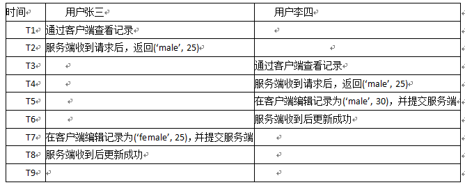
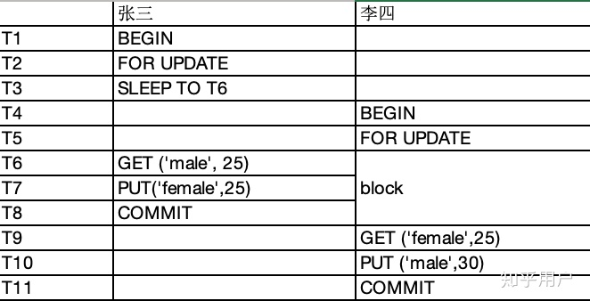

# Mybatis

## 概念

是一个持久层框架，或称为ORM框架 。用来访问数据库，做数据持久化操作 。本质上只是对JDBC进行封装，简化JDBC繁琐的操作。

### 持久层 DAO

Data Access Object 数据访问对象 。用来对数据进行持久化操作，如将数据存入数据库、硬盘等，可以永久保存 。

### ORM

Object Relaltional Mapping 对象关系映射，Java程序和数据库之间的映射关系： 

类 ————>表、对象 ————> 一条数据、属性 ————> 列 

## MyBatis应用

```java
public static void main(String[] args) { 
    //创建SqlSession，称为持久化管理器，是MyBatis的核心 
    // 1.创建SqlSessionFactoryBuilder 
    SqlSessionFactoryBuilder builder = new SqlSessionFactoryBuilder(); 
    // 2.创建SqlSessionFactory 
    SqlSessionFactory factory = builder.build(Test01.class.getClassLoader().getResourceAsStream("­config.xml")); 
    // 3.创建SqlSession 
    SqlSession session = factory.openSession(); 
    // Connection conn = session.getConnection(); 
    User user=new User(); 
    user.setUsername("tom"); 
    user.setPassword("111"); 
    
    //方式1：纯配置文件，没有接口,直接读取mapper该文件      
    session.insert("aaa.insertUser",user); //参数1表示当前调用的方法，值为namespace.id，参数2表示方法的实参 
    
    //方式2：配置文件+接口,通过代理自动生成DAO的实现类 
    UserDao userDao=session.getMapper(UserDao.class); // 参数为接口的Class对象 
    OtherDao otherDao=session.getMapper(OtherDao.class);
    //System.out.println(userDao.getClass()); //DAO的实现类即是代理类
    userDao.insertUser(user); 
    
    session.commit(); //提交事务 
}	
```

## 配置文件

- 主配置文件
- 映射配置文件

### 主配置文件config.xml

```xml
<configuration> 

    <!-- environments：配置所有数据库环境。
    	default：指定默认使用的环境，取值为某一个environment的id--> 
    <environments default="hello"> 
    
        <!-- environment：配置某一个数据库环境，可以有多个。
        		id：指定该环境的唯一标识符--> 
        <environment id="hello"> 
        
            <!-- transactionManager：配置事务管理器 
        		type：指定事务管理器的类型，取值有两种： 
                 		jdbc：使用简单的jdbc事务操作，如开启、提交、回滚，在mybatis中，默认是关闭自动提交事务的，conn.setAutoCommit(false)
            		managed：将事务交给其他框架/容器来处理--> 
            <transactionManager type="jdbc"></transactionManager> 
            
            <!-- dataSource：配置数据源 
            		type：配置数据源的类型，取值有三种： 
            			UNPOOLED：简单的JDBC配置，未使用连接池，相当于DriverManager.getConnection(url,username,password) 
            			POOLED：使用连接池技术 
            			JNDI：通过外部容器来获取连接--> 
            <dataSource type="POOLED"> 
            	<property name="driver" value="com.mysql.jdbc.Driver"/> 
            	<property name="url" value="jdbc:mysql://localhost:3306/mybatis?useUnicode=true&;characterEncoding=utf­8"/> 
            	<property name="username" value="root"/> 
            	<property name="password" value=""/> 
            </dataSource> 
            
            <!-- 也可以同时引用外部的properties文件--> 
            <properties resource="datasource.properties"/> 
            <!--	jdbc.driver=com.mysql.jdbc.Driver 
            	jdbc.url=jdbc:mysql://localhost:3306/mybatis?useUnicode=true&;characterEncoding=utf-8
            	jdbc.username=root 
            	jdbc.password=
             --> 
        </environment> 
    </environments> 
    
    <!-- 注册当前工程中使用的映射文件--> 
    <mappers> 
    
    	<!--mapper：注册某一个mapper文件，可以有多个 
    		resource属性：指定映射文件的路径--> 
    	<mapper resource="mapper/UserMapper.xml"/> 
    </mappers> 
    
    <!-- 配置别名，为当前工程中的某些类指定别名--> 
    <typeAliases> 
    
        <!-- typeAlias：为某个类配置别名 
        		type属性：指定类名 
        		alias属性：指定类的别名--> 
        <typeAlias type="entity.User" alias="User"/>
        
        <!-- package：为某个包下的所有类配置别名 
        		name属性：指定包名，该包下的所有类的别名就是其类名(别名不区分大小写，但建议与类名完全一致)--> 
        <package name="entity"/> 
    </typeAliases> 
</configuration>
```

### 映射配置文件xxxMapper.xml

> 每一个mapper文件相当于原来的DAO实现类，每个实体类对应一个映射文件

```xml
<!-- namespace属性：指定当前mapper配置文件的唯一标识符 
    	如果是纯配置文件的方式，没有接口，值可以随便写 
    	如果是配置文件+接口的方式，值必须是对应接口的全名--> 
<mapper namespace="aaa">
 
    <!-- insert：用来执行添加操作 
    	id：表示当前的方法名 
    		如果是纯配置文件的方式，没有接口，值可以随便写，但必须唯一 
    		如果是配置文件+接口的方式，值必须与接口中的方法名相同 
    	parameterType：表示方法的参数类型 
    		如果参数是对象，可以使用类的全名 
    		如果参数是普通数据，可以使用mybatis中的别名 
      	useGeneratedKeys属性：是否返回主键，取值有两个： 
    		false：表示不返回主键，默认值 
    		true：表示返回主键，会自动将返回的主键绑定到参数对象的主键属性中 
    	keyProperty属性：指定对象的哪个属性为主键属性，即主键所映射的属性，必须指定
    	标签体：编写sql语句 
    		使用#{xxx}表示占位符 
    			如果参数是对象，则xxx为对象的属性名 
    			如果参数是普通数据，则xxx为参数名--> 
    <insert id="insertUser" parameterType="entity.User" useGeneratedKeys="true" keyProperty="id"> 
    	insert into 
    		t_user 
    		(username,password,phone,address) 
    	values
    		(#{username},#{password},#{phone},#{address}) 
    </insert> 
    
    <!-- update：执行修改操作--> 
    <update id="updateUser" parameterType="User"> 
        update t_user 
        set username=#{username},password=#{password},phone=#{phone},address=#{address} 
        where id=#{id} 
    </update>
    
    <!-- delete：执行删除操作--> 
    <delete id="deleteById" parameterType="int"> 
        delete from t_user where id=#{id} 
    </delete>
</mapper>
```

#### select+返回值

```xml
<mapper namespace="aaa">
    <!-- select：执行查询操作 
    	resultType属性：表示返回的结果类型 
    	如果返回的是一个对象，会自动进行映射,前提条件：查询结果的字段名必须与对象的属性名相同
            对于引用数据类型，都是将大写字母转小写，
            比如java.lang.String对应的别名是'string',java.util.HashMap对应的别名是 'hashmap',User的别名是'user'
            基本数据类型考虑到重复的问题，会在其前面加上 '_'，比如java.lang.Byte对应的别名是 '_byte'
     --> 
    <select id="selectById" parameterType="int" resultType="User"> 
        select 
        	id,username,password,phone,address 
        from
        	t_user 
        where 
        	id=#{id} 
    </select> 
    
    <!-- 返回值封装：使用别名，为查询结果的每个字段指定别名，与对象的属性名相同，此时相当于自动映射--> 
    <select id="selectById2" parameterType="int" resultType="User"> 
        select 
        	user_id id,user_username username,user_password password,user_phone phone,user_address address 
        from
        	t_user2 
        where 
        	user_id=#{id} 
    </select> 
    
    <!-- 返回值封装：引用一个ResultMap属性，使用该ResultMap进行手动映射,其值为已存在的某一个ResultMap标签的id值--> 
    <select id="selectById3" parameterType="int" resultMap="userMap"> 
        select 
        	user_id,user_username,user_password,user_phone,user_address 
        from
        	t_user2 
        where 
        	user_id=#{id} 
    </select>
    <!-- resultMap：定义结果映射，将数据库的字段与对象的属性进行映射 
    	id属性：指定该resultMap的唯一标识符 
    	type属性：指定映射的对象类型--> 
    <resultMap id="userMap" type="User"> 
        <!-- id：配置主键映射，result：配置其他映射 
        		property属性：指定映射的属性名
          		column属性：指定映射的字段名，或者字段取的别名--> 
        <id property="id" column="user_id"/> 
        <result property="username" column="user_username"/> 
        <result property="password" column="user_password"/> 
        <result property="phone" column="user_phone"/> 
        <result property="address" column="user_address"/> 
    </resultMap>	
    
    
    <!-- 返回值封装：当方法返回值为对象集合时，resultType指定的是集合中元素的类型，而非集合本身--> 
    <select id="selectAll" resultType="User"> 
        <!-- include：用于引用sql代码段 
        		refid：指定要引用的sql代码段的id值--> 
        select 
        	<include refid="userColumn"/> 
        from
        	t_user 
    </select> 
    <!-- sql：定义sql代码段，便于复用 
    	id属性：指定该sql代码段的唯一标识符--> 
    <sql id="userColumn"> 
        id,username,password,phone,address
    </sql>
    
    <!-- 返回值封装：当方法返回值为List<Map<String,Object>>时，resultType="map"--> 
    <select id="getAllUsersList" resultType="map">
        select * from t_user
    </select>
    
    <!-- 返回值封装：当方法返回值为map时-->
    <!-- 如果查询的结果是一条，我们可以把查询的数据以{表字段名，对应的值}方式存入到Map中
    
         //根据 id 查询信息，并把结果信息封装成 Map 
         Map<String, Object> getUserAsMapById(Integer id);
         
         注意这里的 resultType 返回值类型是 'map'
         结果是{id=1,username=zhangsan,password=123456,phone=12345678912,address=diqiu}
    -->
    <select id="getUserAsMapById" resultType="map">
        select * from t_user where id = #{id}
    </select>
    
    <!-- 如果查询的结果是多条数据，我们也可以把查询的数据以{表中某一字段名, JavaBean}方式来封装成Map
    
        //@MapKey 中的值表示用数据库中的哪个字段名作 key
        @MapKey("id")
        Map<Integer, Employee> getAllUsersAsMap();
        
        注意 resultType 返回值类型，不再是 'map'，而是 Map 的 value 对应的 JavaBean 类型
        结果是{1={id=1,username=zhangsan,...},2={id=2,username=lisi,...},...}
    -->
    <select id="getAllUsersAsMap" resultType="user">
        select * from t_user
    </select>
</mapper>
```

#### select+请求参数

```xml
<mapper namespace="aaa">
    <!-- 请求参数封装：使用参数的索引，索引从0开始，如#{0}表示第一个参数，#{1}表示第二个参数--> 
    <select id="selectByUsernameAndPassword" resultType="User"> 
        select 
        	<include refid="userColumn"/> 
        from 
        	t_user 
        where 
        	username=#{0} and password=#{1} 
    </select> 
    
    <!-- 请求参数封装：使用@Param()定义的名称来引用指定的参数--> 
    <!-- 使用@Param()注解，标注在参数前，为参数指定占位符名称 
         public User selectByUsernameAndPassword2(@Param("username") String username,@Param("password") String password);--> 
    <select id="selectByUsernameAndPassword2" resultType="User"> 
        select 
        	<include refid="userColumn"/> 
        from 
        	t_user 
        where 
        	username=#{username} and password=#{password} 
    </select>
    
    <!-- 请求参数封装：将多个参数封装为一个对象，然后传递该对象--> 
    <select id="selectByUsernameAndPassword3" parameterType="User" resultType="User"> 
        select 
        	<include refid="userColumn"/> 
        from 
        	t_user 
        where 
        	username=#{username} and password=#{password} 
    </select> 
    
    <!-- 请求参数封装：将多个参数封装成一个Map集合，在#{}占位符中根据key获取value--> 
    <select id="selectByUsernameAndPassword4" resultType="User"> 
        select 
        	<include refid="userColumn"/> 
        from 
        	t_user 
        where 
        	username=#{username} and password=#{password} 
    </select> 
    <!-- Map map=new HashMap<String,Object>(); 
         map.put("username","alice"); 
         map.put("password","111"); 
         User user = userDao.selectByUsernameAndPassword4(map);-->
         
    <!-- 模糊查询：手动拼接模糊查询的字段-->
    <select id="selectByUsername" resultType="User"> 
        select 
        	<include refid="userColumn"/> 
        from 
        	t_user 
        where 
        	username like #{username} 
    </select> 
    <!-- String username="a"; 
         List<User> users = userDao.selectByUsername("%" + username + "%");-->
         
    <!-- 模糊查询：使用bind对参数进行额外的处理 -->
    <select id="selectByUsername2" resultType="User"> 
        select 
        	<include refid="userColumn"/> 
        from 
        	t_user 
        <!-- bind：创建一个变量，并为其绑定值 
    		name属性：指定变量名 
        		value属性：指定要绑定的值，可以使用_parameter获取当前方法的参数,也可以直接使用abc--> 
        <bind name="abc" value="'%'+_parameter+'%'"/> 
        where username like #{abc} 
    </select> 
    <!-- String username="a"; 
         List<User> users = userDao.selectByUsername2(username);-->
         
    <!-- 内置参数：_databaseId，配置多数据库中配置的数据库的别名-->
    <select id="getUsersByInnerParam" resultType="User"> 
        <if test="_databasesId=='mysql'">
            select * from sb_users
        </if>
        <if test="_databasesId=='oracle'">
            select * from sb_users
        </if>
    </select> 
    
    <!-- 内置参数：_parameter，接口方法传过来的参数的整体,
            一是如果接口方法传来的是单个参数，_parameter就是这个单参数的值，
            另一种情况是接口方法传来了多个参数的时候会被封装为一个map对象，_parameter就是这个map对象的引用变量-->
    <select id="getUsersByInnerParam" resultType="User"> 
        <if test="_databasesId=='mysql'">
            select * from sb_users
            <if test="_parameter!=null">
                where username=#{_parameter.username}
            </if>
        </if>
    </select> 
</mapper>
```

#### 多表关系映射

> 关联关系：
>
> - 多对一，多个员工都在同一个部门中
> - 一对多，一个部门中可以有多个员工
> - 一对一，一个员工只有一个身份证
> - 多对多，一个员工同时开发多个项目，一个项目也可以同时有多个员工开发

```mysql
#数据库设计
create table t_dept(
    id int primary key auto_increment,
    name varchar(50)
)charset utf8;

create table t_emp(
    id int primary key auto_increment,
    name varchar(30),
    salary double,
    dept_id int,
    foreign key (dept_id) references t_dept(id)
)charset utf8;
```

##### 多对一

> 在一个对象中定义另一个对象的属性

```java
//实体类
//多个员工对应一个部门,查询多个员工，每个员工对应一个部门
//员工类
public class Emp{
    private int id;
    private String name;
    private int salary,
    private Dept dept;
}
//部门类
public class Dept{
    private int id;
    private String name;
}
```

```xml
<mapper namespace="dao.EmpDao">

    <select id="selectAll" resultMap="empMapper">
        select 
            <include refid="empColumn"/>
        from 
            t_emp e
        left join 
            t_dept d on e.dept_id = d.id
    </select>

    <!-- 直接使用关联属性：association标签-->
    <resultMap id="empMapper" type="Emp">
        <id property="id" column="id"/>
        <result property="name" column="name"/>
        <result property="salary" column="salary"/>
        <!-- association：用于配置关联属性，多对一的关系
                property属性：当前需要映射的是对象中的哪个属性
                javaType属性：当前映射的属性的Java类型
                标签体：对当前映射的属性所在的表进行映射-->
        <association property="dept" javaType="Dept">
            <id property="id" column="deptId"/>
            <result property="name" column="deptName"/>
        </association>
    </resultMap>
    
    <!-- 使用关联的嵌套结果：使用assocition的resultMap属性，引用其他的resultMap-->
    <resultMap id="empMapper2" type="Emp">
        <id property="id" column="id"/>
        <result property="name" column="name"/>
        <result property="salary" column="salary"/>
        <!-- resultMap属性：引用其他的ResultMap映射配置
                      值为：resultMap所在Mapper文件的namespace.resultMap的id值-->
        <association property="dept" javaType="Dept" resultMap="dao.DeptDao.deptMapper"/>
    </resultMap>
    
    <!-- 使用关联的嵌套查询:使用assocition的select属性，引用其他select，通过多个单表查询来实现，效率低，会进行多次查询，存在N+1问题-->
    <resultMap id="empMapper3" type="Emp">
        <id property="id" column="id"/>
        <result property="name" column="name"/>
        <result property="salary" column="salary"/>
        <!--select属性：引用其他的select查询配置
                  值为：select所在Mapper文件的namespace.select的id值
                      column属性：当前查询的某列，作为查询条件，传递给引用的select查询配置的参数-->
        <association property="dept" javaType="Dept" select="dao.DeptDao.selectById" column="dept_id"/>
    </resultMap>
</mapper>

<mapper namespace="dao.DeptDao">
    <select id="selectById" parameterType="int" resultType="Dept">
        select
            id,name
        from 
            t_dept
        where 
            id=#{id}
    </select>
    
    <resultMap id="deptMapper" type="Dept">
        <id property="id" column="deptId"/>
        <result property="name" column="deptName"/>
    </resultMap>
</mapper>
```

##### 一对多

> 在一个对象中定义另一个对象的集合

```java
//实体类
//一个部门有多个员工,查询一个部门，每个部门有多个员工
//员工类
public class Emp{
    private int id;
    private String name;
    private int salary;
}
//部门类
public class Dept{
    private int id;
    private String name;
    private List<Emp> emps;
}
```

#### xml转义

sql中有一些特殊的字符的话，在解析xml文件的时候会被转义，但我们不希望他被转义，所以我们要使用<![CDATA[ ]]> 

<![CDATA[   ]]> 是XML语法。在CDATA内部的所有内容都会被解析器忽略。 

如果文本包含了很多的"<"字符 <=和"&"字符，那么最好把他们都放到CDATA部件中。 

## Other

### 批量插入

#### Mybatis设置batch模式

##### 三种执行器

mybatis提供三种sql执行器，分别是SIMPLE（默认）、REUSE、BATCH。

- SIMPLE（SimpleExecutor），相当于JDBC的stmt.execute(sql) 执行完毕即关闭即 stmt.close()
- REUSE（ReuseExecutor），相当于JDBC的stmt.execute(sql) 执行完不关闭，而是将stmt存入 Map<String, Statement>中缓存，其中key为执行的sql模板；
- BATCH（BatchExecutor），相当于JDBC语句的 stmt.addBatch(sql)，即仅将执行SQL加入到批量计划但是不真正执行， 所以此时不会执行返回受影响的行数，而只有执行stmt.execteBatch()后才会真正执行sql。

##### 常规

```java
// 设置batch模式
SqlSession sqlSession = sqlSessionTemplate.getSqlSessionFactory().openSession(ExecutorType.BATCH, false);

UserMapper userMapper = sqlSession.getMapper(UserMapper.class);
long start = System.currentTimeMillis();
for (int i = 0; i < 100000; i++) {
    User user = new User();
    user.setId("id" + i);
    user.setName("name" + i);
    user.setPassword("password" + i);
    userMapper.insert(user);
}
sqlSession.commit();
long end = System.currentTimeMillis();
System.out.println("---------------" + (start - end) + "---------------");
```

```xml
<insert id="insert">
    INSERT INTO t_user (id, name, password)
    VALUES(#{id}, #{name}, #{password})
</insert>
```

##### springboot下开启 batch模式

**全局方式开通batch**

```yml
mybatis:
  executor-type: batch
```

**方法中直接指定batch**

```java
// 这个方式的缺陷就是事务方面不受spring管理了。
@Autowired
protected SqlSessionFactory sqlSessionFactory;

public void saveOrder(Order t) {
    SqlSession sqlSession = sqlSessionFactory.openSession(ExecutorType.BATCH);
    OrderMapper orderMapper = sqlSession.getMapper(OrderMapper.class);

    try{
        orderMapper.save(t);
        sqlSession.commit();
    }catch(Exception e){
        logger.error("批量导入数据异常，事务回滚", e);
        sqlSession.rollback();
    }finally {
        if (sqlSession != null) {
            sqlSession.close();
        }
    }
}

```


#### 批量 foreach 插入 

```java
long start = System.currentTimeMillis();
List<User> userList = new ArrayList<>();
for (int i = 0; i < 100000; i++) {
    User user = new User();
    user.setId("id" + i);
    user.setName("name" + i);
    user.setPassword("password" + i);
    userList.add(user);
}
userMapper.insertBatch(userList);
long end = System.currentTimeMillis();
System.out.println("---------------" + (start - end) + "---------------");
```

```xml
<insert id="insertBatch" parameterType="java.util.List">
        INSERT INTO t_user
        (id, name, password)
        VALUES
        <foreach collection ="userList" item="user" separator =",">
            (#{user.id}, #{user.name}, #{user.password})
        </foreach >
</insert>
```

如果批量增加数据量较多时 建议采用batch模式，foreach一次性插入数据量建议10-100条，for循环是最不建议的方式，需要频繁的建立关闭数据库连接，比较耗时。


[Mybatis 批量插入数据的三种方式](https://blog.csdn.net/chang100111/article/details/115664432)

[springboot 集成的 mybatis 设置 executorType 为 batch模式](https://blog.csdn.net/gzt19881123/article/details/122815596)


### 动态SQL

#### if

```xml
<select id="findActiveBlogLike"
     resultType="Blog">
  SELECT * FROM BLOG WHERE state = ‘ACTIVE’
  <if test="title != null">
    AND title like #{title}
  </if>
  <if test="author != null and author.name != null">
    AND author_name like #{author.name}
  </if>
</select>
```

#### choose、when、otherwise

从多个条件中选择一个使用 

```xml
<!-- 传入了 “title” 就按 “title” 查找，传入了 “author” 就按 “author” 查找的情形。若两者都没有传入，就返回标记为 featured 的 BLOG -->
<select id="findActiveBlogLike"
     resultType="Blog">
  SELECT * FROM BLOG WHERE state = ‘ACTIVE’
  <choose>
    <when test="title != null">
      AND title like #{title}
    </when>
    <when test="author != null and author.name != null">
      AND author_name like #{author.name}
    </when>
    <otherwise>
      AND featured = 1
    </otherwise>
  </choose>
</select>
```

#### trim、where、set

##### where

where标签只会在它包含的标签中有返回值的情况下才插入 “WHERE” 子句。而且，若子句的开头为 “AND” 或 “OR”，where标签也会将它们去除。

```xml
<select id="findActiveBlogLike" resultType="Blog">
  SELECT * FROM BLOG
  <where>
    <if test="state != null">
         state = #{state}
    </if>
    <if test="title != null">
        AND title like #{title}
    </if>
    <if test="author != null and author.name != null">
        AND author_name like #{author.name}
    </if>
  </where>
</select>
```


```xml
<!-- prefixOverrides 属性会忽略通过管道符分隔的文本序列（注意此例中的空格是必要的）。例子会移除所有 prefixOverrides 属性中指定的内容，并且插入 prefix 属性中指定的内容。 这里自定义 trim 元素和 where 元素是等价的-->
<trim prefix="WHERE" prefixOverrides="AND |OR ">
  ...
</trim>
```


##### set

```xml
<!-- set 元素可以用于动态包含需要更新的列，忽略其它不更新的列，set 元素会动态地在行首插入 SET 关键字，并会删掉额外的逗号 -->
<update id="updateAuthorIfNecessary">
  update Author
    <set>
      <if test="username != null">username=#{username},</if>
      <if test="password != null">password=#{password},</if>
      <if test="email != null">email=#{email},</if>
      <if test="bio != null">bio=#{bio}</if>
    </set>
  where id=#{id}
</update>
```

```xml
<!-- 和上述set元素等价 -->
<trim prefix="SET" suffixOverrides=",">
  ...
</trim>
```

#### foreach

对集合进行遍历 

```xml
<!-- 指定一个集合（collection），声明可以在元素体内使用的集合项（item）和索引（index）变量。也允许指定开头与结尾的字符串以及集合项迭代之间的分隔符。这个元素也不会错误地添加多余的分隔符 -->
<select id="selectPostIn" resultType="domain.blog.Post">
  SELECT *
  FROM POST P
  <where>
    <foreach item="item" index="index" collection="list"
        open="ID in (" separator="," close=")" nullable="true">
          #{item}
    </foreach>
  </where>
</select>
```

可以将任何可迭代对象（如 List、Set 等）、Map 对象或者数组对象作为集合参数传递给 *foreach*。当使用可迭代对象或者数组时，index 是当前迭代的序号，item 的值是本次迭代获取到的元素。当使用 Map 对象（或者 Map.Entry 对象的集合）时，index 是键，item 是值。 

#### script

要在带注解的映射器接口类中使用动态 SQL，可以使用 *script* 元素。比如: 

```java
    @Update({"<script>",
      "update Author",
      "  <set>",
      "    <if test='username != null'>username=#{username},</if>",
      "    <if test='password != null'>password=#{password},</if>",
      "    <if test='email != null'>email=#{email},</if>",
      "    <if test='bio != null'>bio=#{bio}</if>",
      "  </set>",
      "where id=#{id}",
      "</script>"})
    void updateAuthorValues(Author author);
```

#### bind

`bind` 元素允许你在 OGNL 表达式以外创建一个变量，并将其绑定到当前的上下文。比如： 

```xml
<select id="selectBlogsLike" resultType="Blog">
  <bind name="pattern" value="'%' + _parameter.getTitle() + '%'" />
  SELECT * FROM BLOG
  WHERE title LIKE #{pattern}
</select>
```


#### 多数据库

如果配置了 databaseIdProvider，你就可以在动态代码中使用名为 “_databaseId” 的变量来为不同的数据库构建特定的语句。比如下面的例子： 

```xml
<insert id="insert">
  <selectKey keyProperty="id" resultType="int" order="BEFORE">
    <if test="_databaseId == 'oracle'">
      select seq_users.nextval from dual
    </if>
    <if test="_databaseId == 'db2'">
      select nextval for seq_users from sysibm.sysdummy1"
    </if>
  </selectKey>
  insert into users values (#{id}, #{name})
</insert>
```

[动态SQL](https://mybatis.org/mybatis-3/zh/dynamic-sql.html)

### 多数据库

MyBatis 可以根据不同的数据库厂商执行不同的语句，这种多厂商的支持是基于映射语句中的 databaseId 属性。如果配置了 **databaseIdProvider**，MyBatis 会加载所有的不带 databaseId 或匹配当前数据库 databaseId 属性的所有语句；如果带或者不带的语句都有，则不带的会被忽略。新增，修改和删除都有这个属性。 

```xml
<select id="getAssetsSquareSource" resultMap="AssetsSquare" databaseId="gauss">
        select NVL(COUNT(*),0) NUM
        FROM LOGICAL_ENTITY_INFO LOGICAL
        LEFT JOIN PHYSICAL_ENTITY_INFO PHYSICAL ON LOGICAL.LOGICALENTITY_ID = PHYSICAL.LOGICALENTITY_ID
        LEFT JOIN DATA_ASSETS_INFO LOGICALASSETS ON LOGICAL.DATA_CODE = LOGICALASSETS.DATA_CODE
        WHERE PHYSICAL.DATA_LEVEL = '1'
        AND LOGICALASSETS.STATE = '2'
        AND (LOGICALASSETS.ISPRIVATE = '0' OR LOGICALASSETS.DAMS_BEID =  #{damsBeId, jdbcType=VARCHAR})
        GROUP BY LOGICALASSETS.DATA_TYPE
</select>
    
    
<select id="getAssetsSquareSource" resultMap="AssetsSquare" databaseId="mysql">
        select IFNULL(COUNT(*),0) NUM
        FROM LOGICAL_ENTITY_INFO LOGICAL
        LEFT JOIN PHYSICAL_ENTITY_INFO PHYSICAL ON LOGICAL.LOGICALENTITY_ID = PHYSICAL.LOGICALENTITY_ID
        LEFT JOIN DATA_ASSETS_INFO LOGICALASSETS ON LOGICAL.DATA_CODE = LOGICALASSETS.DATA_CODE
        WHERE PHYSICAL.DATA_LEVEL = '1'
        AND LOGICALASSETS.STATE = '2'
        AND (LOGICALASSETS.ISPRIVATE = '0' OR LOGICALASSETS.DAMS_BEID =  #{damsBeId, jdbcType=VARCHAR})
        GROUP BY LOGICALASSETS.DATA_TYPE
</select>
```

```java
// springboot中
@Configuration
public class DatabaseSwitchConfig {
    /**
     * 自动识别使用的数据库类型
     * 在mapper.xml中databaseId的值就是跟这里对应，
     * 如果没有databaseId选择则说明该sql适用所有数据库
     *
     * @return DatabaseIdProvider
     */
    @Bean
    public DatabaseIdProvider getDatabaseIdProvider() {
        Properties properties = new Properties();
        properties.setProperty("Oracle", "oracle");
        properties.setProperty("MySQL", "mysql");
        properties.setProperty("DB2", "db2");
        properties.setProperty("Derby", "derby");
        properties.setProperty("H2", "h2");
        properties.setProperty("HSQL", "hsql");
        properties.setProperty("Informix", "informix");
        properties.setProperty("MS-SQL", "ms-sql");
        properties.setProperty("PostgreSQL", "postgresql");
        properties.setProperty("Sybase", "sybase");
        properties.setProperty("Hana", "hana");
        properties.setProperty("Zenith", "gauss");
        DatabaseIdProvider databaseIdProvider = new VendorDatabaseIdProvider();
        databaseIdProvider.setProperties(properties);
        return databaseIdProvider;
    }
}
```

[MyBatis之databaseIdProvider多数据库支持](https://blog.csdn.net/likewindy/article/details/51396576)


### 存储过程

```xml
<select id="synchronousDataQualityFromBdi" databaseId="gauss" resultType="String">
    CALL p_synch_data_quality_d (#{statDate,mode=IN,jdbcType=VARCHAR})
</select>
```

```sql
/*sql中存储过程*/
CREATE OR REPLACE PROCEDURE P_SYNCH_DATA_QUALITY_D (
                             iv_stat_date in varchar2   --同步日期
                             ) 
as
/** head
  * @name                    p_synch_data_quality_d
  * @caption                 将数据质量数据同步到资产可视通用数据质量
  * @type                    iv_stat_date varchar2,format yyyymmdd
  * @parameter               oi_result integer 0 成功
  * @version                 2.0.0
  * @author                  w00212040
  * @create_date             2020-04-28
  * @copyright               Huawei
  * @modify1                 修改时请标注修改内容
  */
begin

  --同步到t_dataquality_rule_details
  delete from t_dataquality_rule_details a
   where a.stat_date = to_number(iv_stat_date) and a.data_source_id='1';

  insert into t_dataquality_rule_details
              (stat_date,
               ruleid,
               rulecode,
               rulename,
               objecttype,
               typeid,
               objecttypestr,
               createtime,
               createtimeformat,
               data_cycle,
               data_source_id
              )
     select to_number(iv_stat_date) as stat_date,
              a.rule_id,
              a.rule_id as rule_code,
              a.rule_name,
              '' as objecttype,
              case when a.type_description='唯一性' then 'Unique'
                when a.type_description='准确性' then 'Accuracy'
                when a.type_description='一致性' then 'Consistency'
                when a.type_description='完整性' then 'Integrity'
                when a.type_description='及时性' then 'Timeliness'
                else 'Validity'
              end typeid,
              case
                when a.column_name is not null then 'Field'
                else 'Table'
              end object_type_str,
              to_char(SYSDATE,'yyyymmdd hh24:mi:ss') as createtime,
              to_char(SYSDATE,'yyyymmdd hh24:mi:ss') as createtimeformat,
              a.data_cycle,
              '1' as data_source_id
         from t_dq_rule_def a;
  commit;

end;/
```


### 函数

**函数创建**

```sql
CREATE OR REPLACE FUNCTION GETCHILDRENCATALOG ( rootid varchar2,tablename varchar2) RETURN varchar2
AS 
	schildrentemp varchar2 ( 4000 ):=rootid;
	schildrenlist varchar2 ( 8000 );
BEGIN
	while
	schildrentemp is not NULL  LOOP
	if ( schildrenlist is not null ) then
			 schildrenlist := concat( schildrenlist, ',', schildrentemp );
	else 
			 schildrenlist := concat( schildrentemp );
	end if;
	if ( tablename = 'DATA_CATALOG' ) then
			select
				group_concat( catalog_id ) into schildrentemp 
			from
				(SELECT catalog_id,parent_catalog_id from DATA_CATALOG
                 UNION
                 select BUSINESSOBJECT_ID catalog_id,catalog_id parent_catalog_id from BUSINESS_OBJECT_INFO
                ) 
			where
				find_in_set( parent_catalog_id, schildrentemp ) > 0;
	elsif ( tablename = 'METRICS_CATALOG') then
			select
				group_concat( metrics_catalog_id ) into schildrentemp 
			from
				metrics_catalog 
			where
				find_in_set( parent_metrics_catalog_id, schildrentemp ) > 0;
	elsif ( tablename = 'DATAPRODUCT_CATALOG') then
			select
				group_concat( dataProduct_catalog_id ) into schildrentemp 
			from
				dataProduct_catalog 
			where
				find_in_set( parent_dataProduct_catalog_id, schildrentemp ) > 0;
	elsif ( tablename = 'TABLE_DEPENDENCE_INFO' ) then
			select
				group_concat( schema_table ) into schildrentemp 
			from
				table_dependence_info 
			where
				find_in_set( dependent_id, schildrentemp ) > 0;
	elsif ( tablename = 'CUSTOMERLABEL_CATALOG') then
			select
				group_concat( customerlabel_catalog_id ) into schildrentemp 
			from
				customerlabel_catalog 
			where
				find_in_set( parent_customerlabel_catalog_id, schildrentemp ) > 0;
	end if;
	end LOOP;
	return schildrenlist;
end;/
```

**函数使用**

```xml
<!-- select GETCHILDRENCATALOG('0','BUSINESS_CATALOG') -->
<select id="getCategoryRelationship" resultMap="BusinessCatalog"
        resultType="com.huawei.business.model.BusinessCatalog" databaseId="mysql">
    SELECT BC.BUSI_CATALOG_ID,
    BC.BUSI_CATALOG_NAME_CN,
    BC.BUSI_CATALOG_NAME_EN,
    BC.BUSI_CATALOG_DESC,
    BC.PARENT_BUSI_CATALOG_ID,
    BC.BUSI_CATALOG_SORT,
    BC.CREATE_BY,
    BC.CREATE_DATE,
    BC.STATE,
    BC.STATE_DATE,
    (select GETUPLEVEL(BC.BUSI_CATALOG_ID,'BUSINESS_CATALOG')) LEVEL,
    (select GETISLEAF(BC.BUSI_CATALOG_ID,'BUSINESS_CATALOG')) AS isLeaf
    FROM BUSINESS_CATALOG BC
    WHERE STATE='2'
    AND    FIND_IN_SET(BC.BUSI_CATALOG_ID,(select GETCHILDRENCATALOG('0','BUSINESS_CATALOG')))>0
</select>
```

```xml
<!-- getChildrenCatalog??? -->
<select id="getChildrenCatalog" resultType="java.lang.String">
    SELECT "GETCHILDRENCATALOG"
    (
    #{catalogId,jdbcType=VARCHAR},
    'DATA_CATALOG'
    )
    as "GETCHILDRENCATALOG" FROM DUAL
</select>


<select id="getBusiChildsCatalog" resultMap="BusiBaseResultMap" parameterType="String">
    <!-- mysql语句 -->
    SELECT DISTINCT
    BUSI_CATALOG_ID
    FROM
    (
    SELECT
    d.BUSI_CATALOG_ID,
    d.PARENT_BUSI_CATALOG_ID,
    d.BUSI_CATALOG_NAME_CN,
    d.BUSI_CATALOG_NAME_EN,
    getDownLevel(d.BUSI_CATALOG_ID,'BUSINESS_CATALOG') AS LEVEL,
    getIsLeaf(d.BUSI_CATALOG_ID,'BUSINESS_CATALOG') isleaf
    FROM
    BUSINESS_CATALOG d LEFT JOIN BUSINESS_CATALOG t
    ON d.BUSI_CATALOG_ID=t.PARENT_BUSI_CATALOG_ID
    WHERE FIND_IN_SET(d.BUSI_CATALOG_ID,getChildrenCatalog(#{busiCatalogId}, 'BUSINESS_CATALOG'))
    AND d.STATE= '2'
    ORDER BY
    LEVEL ASC
    ) T
    WHERE
    T.isleaf =1
</select>
```

[MySQL数据库之内置函数和自定义函数 function](https://www.jb51.net/article/251748.htm)


[MySQL 创建函数(Function)](https://blog.csdn.net/jssg_tzw/article/details/39694489)


### 分页

#### limit用法

[Mybatis中limit用法与分页查询](https://blog.csdn.net/qq_42901303/article/details/87456097)


#### 引入

```xml
<dependency>
    <groupId>com.github.pagehelper</groupId>
    <artifactId>pagehelper</artifactId>
    <version>最新版本</version>
</dependency>
```

#### 配置

新版拦截器是 `com.github.pagehelper.PageInterceptor`。 `com.github.pagehelper.PageHelper` 现在是一个特殊的 `dialect` 实现类，是分页插件的默认实现类，提供了和以前相同的用法。 

- 在 MyBatis 配置 xml 中配置拦截器插件

  ```xml
  <!--
      plugins在配置文件中的位置必须符合要求，否则会报错，顺序如下:
      properties?, settings?,
      typeAliases?, typeHandlers?,
      objectFactory?,objectWrapperFactory?,
      plugins?,
      environments?, databaseIdProvider?, mappers?
  -->
  <plugins>
      <!-- com.github.pagehelper为PageHelper类所在包名 -->
      <plugin interceptor="com.github.pagehelper.PageInterceptor">
          <!-- 使用下面的方式配置参数，后面会有所有的参数介绍 -->
          <property name="param1" value="value1"/>
  	</plugin>
  </plugins>
  ```

- 在 Spring 配置文件中配置拦截器插件

  使用 spring 的属性配置方式，可以使用 `plugins` 属性像下面这样配置： 

  ```xml
  <bean id="sqlSessionFactory" class="org.mybatis.spring.SqlSessionFactoryBean">
    <!-- 注意其他配置 -->
    <property name="plugins">
      <array>
        <bean class="com.github.pagehelper.PageInterceptor">
          <property name="properties">
            <!--使用下面的方式配置参数，一行配置一个 -->
            <value>
              params=value1
            </value>
          </property>
        </bean>
      </array>
    </property>
  </bean>
  ```

##### 参数

分页插件提供了多个可选参数，这些参数使用时，按照上面两种配置方式中的示例配置即可。

分页插件可选参数如下：

- `dialect`：默认情况下会使用 PageHelper 方式进行分页，如果想要实现自己的分页逻辑，可以实现 `Dialect`(`com.github.pagehelper.Dialect`) 接口，然后配置该属性为实现类的全限定名称。

**下面几个参数都是针对默认 dialect 情况下的参数。使用自定义 dialect 实现时，下面的参数没有任何作用。**

1. `helperDialect`：分页插件会自动检测当前的数据库链接，自动选择合适的分页方式。 你可以配置`helperDialect`属性来指定分页插件使用哪种方言。配置时，可以使用下面的缩写值：
   `oracle`,`mysql`,`mariadb`,`sqlite`,`hsqldb`,`postgresql`,`db2`,`sqlserver`,`informix`,`h2`,`sqlserver2012`,`derby`
   **特别注意：**使用 SqlServer2012 数据库时，需要手动指定为 `sqlserver2012`，否则会使用 SqlServer2005 的方式进行分页。
   你也可以实现 `AbstractHelperDialect`，然后配置该属性为实现类的全限定名称即可使用自定义的实现方法。
2. `offsetAsPageNum`：默认值为 `false`，该参数对使用 `RowBounds` 作为分页参数时有效。 当该参数设置为 `true` 时，会将 `RowBounds` 中的 `offset` 参数当成 `pageNum` 使用，可以用页码和页面大小两个参数进行分页。
3. `rowBoundsWithCount`：默认值为`false`，该参数对使用 `RowBounds` 作为分页参数时有效。 当该参数设置为`true`时，使用 `RowBounds` 分页会进行 count 查询。
4. `pageSizeZero`：默认值为 `false`，当该参数设置为 `true` 时，如果 `pageSize=0` 或者 `RowBounds.limit = 0` 就会查询出全部的结果（相当于没有执行分页查询，但是返回结果仍然是 `Page` 类型）。
5. `reasonable`：分页合理化参数，默认值为`false`。当该参数设置为 `true` 时，`pageNum<=0` 时会查询第一页， `pageNum>pages`（超过总数时），会查询最后一页。默认`false` 时，直接根据参数进行查询。
6. `params`：为了支持`startPage(Object params)`方法，增加了该参数来配置参数映射，用于从对象中根据属性名取值， 可以配置 `pageNum,pageSize,count,pageSizeZero,reasonable`，不配置映射的用默认值， 默认值为`pageNum=pageNum;pageSize=pageSize;count=countSql;reasonable=reasonable;pageSizeZero=pageSizeZero`。
7. `supportMethodsArguments`：支持通过 Mapper 接口参数来传递分页参数，默认值`false`，分页插件会从查询方法的参数值中，自动根据上面 `params` 配置的字段中取值，查找到合适的值时就会自动分页。 使用方法可以参考测试代码中的 `com.github.pagehelper.test.basic` 包下的 `ArgumentsMapTest` 和 `ArgumentsObjTest`。
8. `autoRuntimeDialect`：默认值为 `false`。设置为 `true` 时，允许在运行时根据多数据源自动识别对应方言的分页 （不支持自动选择`sqlserver2012`，只能使用`sqlserver`），用法和注意事项参考下面的**场景五**。
9. `closeConn`：默认值为 `true`。当使用运行时动态数据源或没有设置 `helperDialect` 属性自动获取数据库类型时，会自动获取一个数据库连接， 通过该属性来设置是否关闭获取的这个连接，默认`true`关闭，设置为 `false` 后，不会关闭获取的连接，这个参数的设置要根据自己选择的数据源来决定。

**重要提示：**

当 `offsetAsPageNum=false` 的时候，由于 `PageNum` 问题，`RowBounds`查询的时候 `reasonable` 会强制为 `false`。使用 `PageHelper.startPage` 方法不受影响。

##### 场景

单独看每个参数的说明可能是一件让人不爽的事情，这里列举一些可能会用到某些参数的情况。

**场景一**

如果你仍然在用类似ibatis式的命名空间调用方式，你也许会用到`rowBoundsWithCount`， 分页插件对`RowBounds`支持和 MyBatis 默认的方式是一致，默认情况下不会进行 count 查询，如果你想在分页查询时进行 count 查询， 以及使用更强大的 `PageInfo` 类，你需要设置该参数为 `true`。

**注：** `PageRowBounds` 想要查询总数也需要配置该属性为 `true`。

**场景二**

如果你仍然在用类似ibatis式的命名空间调用方式，你觉得 `RowBounds` 中的两个参数 `offset,limit` 不如 `pageNum,pageSize` 容易理解， 你可以使用 `offsetAsPageNum` 参数，将该参数设置为 `true` 后，`offset`会当成 `pageNum` 使用，`limit` 和 `pageSize` 含义相同。

**场景三**

如果觉得某个地方使用分页后，你仍然想通过控制参数查询全部的结果，你可以配置 `pageSizeZero` 为 `true`， 配置后，当 `pageSize=0` 或者 `RowBounds.limit = 0` 就会查询出全部的结果。

**场景四**

如果你分页插件使用于类似分页查看列表式的数据，如新闻列表，软件列表， 你希望用户输入的页数不在合法范围（第一页到最后一页之外）时能够正确的响应到正确的结果页面， 那么你可以配置 `reasonable` 为 `true`，这时如果 `pageNum<=0` 会查询第一页，如果 `pageNum>总页数` 会查询最后一页。

**场景五**

如果你在 Spring 中配置了动态数据源，并且连接不同类型的数据库，这时你可以配置 `autoRuntimeDialect` 为 `true`，这样在使用不同数据源时，会使用匹配的分页进行查询。 这种情况下，你还需要特别注意 `closeConn` 参数，由于获取数据源类型会获取一个数据库连接，所以需要通过这个参数来控制获取连接后，是否关闭该连接。 默认为 `true`，有些数据库连接关闭后就没法进行后续的数据库操作。而有些数据库连接不关闭就会很快由于连接数用完而导致数据库无响应。所以在使用该功能时，特别需要注意你使用的数据源是否需要关闭数据库连接。

当不使用动态数据源而只是自动获取 `helperDialect` 时，数据库连接只会获取一次，所以不需要担心占用的这一个连接是否会导致数据库出错，但是最好也根据数据源的特性选择是否关闭连接。

#### 常用方式

##### 1). RowBounds方式的调用

```java
List<Country> list = sqlSession.selectList("x.y.selectIf", null, new RowBounds(1, 10));
```

使用这种调用方式时，你可以使用RowBounds参数进行分页，这种方式侵入性最小，我们可以看到，通过RowBounds方式调用只是使用了这个参数，并没有增加其他任何内容。

分页插件检测到使用了RowBounds参数时，就会对该查询进行**物理分页**。

关于这种方式的调用，有两个特殊的参数是针对 `RowBounds` 的，你可以参看上面的 **场景一** 和 **场景二**

**注：**不只有命名空间方式可以用RowBounds，使用接口的时候也可以增加RowBounds参数，例如：

```java
//这种情况下也会进行物理分页查询
List<Country> selectAll(RowBounds rowBounds);  
```

**注意：** 由于默认情况下的 `RowBounds` 无法获取查询总数，分页插件提供了一个继承自 `RowBounds` 的 `PageRowBounds`，这个对象中增加了 `total` 属性，执行分页查询后，可以从该属性得到查询总数。

##### 2).`PageHelper.startPage` 静态方法调用

除了 `PageHelper.startPage` 方法外，还提供了类似用法的 `PageHelper.offsetPage` 方法。

在你需要进行分页的 MyBatis 查询方法前调用 `PageHelper.startPage` 静态方法即可，紧跟在这个方法后的第一个**MyBatis 查询方法**会被进行分页。

**例一：**

```java
//获取第1页，10条内容，默认查询总数count
PageHelper.startPage(1, 10);
//紧跟着的第一个select方法会被分页
List<Country> list = countryMapper.selectIf(1);
assertEquals(2, list.get(0).getId());
assertEquals(10, list.size());
//分页时，实际返回的结果list类型是Page<E>，如果想取出分页信息，需要强制转换为Page<E>
assertEquals(182, ((Page) list).getTotal());
```

**例二：**

```java
//request: url?pageNum=1&pageSize=10
//支持 ServletRequest,Map,POJO 对象，需要配合 params 参数
PageHelper.startPage(request);
//紧跟着的第一个select方法会被分页
List<Country> list = countryMapper.selectIf(1);

//后面的不会被分页，除非再次调用PageHelper.startPage
List<Country> list2 = countryMapper.selectIf(null);
//list1
assertEquals(2, list.get(0).getId());
assertEquals(10, list.size());
//分页时，实际返回的结果list类型是Page<E>，如果想取出分页信息，需要强制转换为Page<E>，
//或者使用PageInfo类（下面的例子有介绍）
assertEquals(182, ((Page) list).getTotal());
//list2
assertEquals(1, list2.get(0).getId());
assertEquals(182, list2.size());
```

**例三，使用`PageInfo`的用法：**

```java
//获取第1页，10条内容，默认查询总数count
PageHelper.startPage(1, 10);
List<Country> list = countryMapper.selectAll();
//用PageInfo对结果进行包装
PageInfo page = new PageInfo(list);
//测试PageInfo全部属性
//PageInfo包含了非常全面的分页属性
assertEquals(1, page.getPageNum());
assertEquals(10, page.getPageSize());
assertEquals(1, page.getStartRow());
assertEquals(10, page.getEndRow());
assertEquals(183, page.getTotal());
assertEquals(19, page.getPages());
assertEquals(1, page.getFirstPage());
assertEquals(8, page.getLastPage());
assertEquals(true, page.isFirstPage());
assertEquals(false, page.isLastPage());
assertEquals(false, page.isHasPreviousPage());
assertEquals(true, page.isHasNextPage());
```

##### 3). 使用参数方式

想要使用参数方式，需要配置 `supportMethodsArguments` 参数为 `true`，同时要配置 `params` 参数。 例如下面的配置：

```xml
<plugins>
    <!-- com.github.pagehelper为PageHelper类所在包名 -->
    <plugin interceptor="com.github.pagehelper.PageInterceptor">
        <!-- 使用下面的方式配置参数，后面会有所有的参数介绍 -->
        <property name="supportMethodsArguments" value="true"/>
        <property name="params" value="pageNum=pageNumKey;pageSize=pageSizeKey;"/>
	</plugin>
</plugins>
```

在 MyBatis 方法中：

```java
List<Country> selectByPageNumSize(
        @Param("user") User user,
        @Param("pageNumKey") int pageNum,
        @Param("pageSizeKey") int pageSize);
```

当调用这个方法时，由于同时发现了 `pageNumKey` 和 `pageSizeKey` 参数，这个方法就会被分页。params 提供的几个参数都可以这样使用。

除了上面这种方式外，如果 User 对象中包含这两个参数值，也可以有下面的方法：

```java
List<Country> selectByPageNumSize(User user);
```

当从 User 中同时发现了 `pageNumKey` 和 `pageSizeKey` 参数，这个方法就会被分页。

注意：`pageNum` 和 `pageSize` 两个属性同时存在才会触发分页操作，在这个前提下，其他的分页参数才会生效。


[如何使用分页插件](https://pagehelper.github.io/docs/howtouse/)

#### SpringBoot中使用分页

[SpringBoot整合PageHelper做多条件分页查询](https://www.cnblogs.com/kelelipeng/p/11875574.html)


# Mybatis-Plus

## 依赖

```java
<dependency>
    <groupId>com.baomidou</groupId>
    <artifactId>mybatis-plus-boot-starter</artifactId>
    <version>3.3.1.tmp</version>
</dependency>
<dependency>
    <groupId>mysql</groupId>
    <artifactId>mysql-connector-java</artifactId>
    <version>8.0.18</version>
</dependency>
<dependency>
    <groupId>org.projectlombok</groupId>
    <artifactId>lombok</artifactId>
    <version>1.18.10</version>
</dependency>
```


## 配置日志

想要查看执行的 sql 语句，可以在 yml 文件中添加配置信息，如下。

```java
mybatis-plus:
  configuration:
    log-impl: org.apache.ibatis.logging.stdout.StdOutImpl
```

## 代码生成器

### 依赖

```java
<dependency>
    <groupId>com.baomidou</groupId>
    <artifactId>mybatis-plus-generator</artifactId>
    <version>3.3.1.tmp</version>
</dependency>
<!-- 添加 模板引擎 依赖 -->
<dependency>
    <groupId>org.apache.velocity</groupId>
    <artifactId>velocity-engine-core</artifactId>
    <version>2.2</version>
</dependency>
```

### 代码

```java
public class TestAutoGenerate {
    @Test
    public void autoGenerate() {
        // Step1：代码生成器
        AutoGenerator mpg = new AutoGenerator();

        // Step2：全局配置
        GlobalConfig gc = new GlobalConfig();
        // 填写代码生成的目录(需要修改)
        String projectPath = "E:\\myProject\\test\\test_mybatis_plus";
        // 拼接出代码最终输出的目录
        gc.setOutputDir(projectPath + "/src/main/java");
        // 配置开发者信息（可选）（需要修改）
        gc.setAuthor("lyh");
        // 配置是否打开目录，false 为不打开（可选）
        gc.setOpen(false);
        // 实体属性 Swagger2 注解，添加 Swagger 依赖，开启 Swagger2 模式（可选）
        //gc.setSwagger2(true);
        // 重新生成文件时是否覆盖，false 表示不覆盖（可选）
        gc.setFileOverride(false);
        // 配置主键生成策略，此处为 ASSIGN_ID（可选）
        gc.setIdType(IdType.ASSIGN_ID);
        // 配置日期类型，此处为 ONLY_DATE（可选）
        gc.setDateType(DateType.ONLY_DATE);
        // 默认生成的 service 会有 I 前缀
        gc.setServiceName("%sService");
        mpg.setGlobalConfig(gc);

        // Step3：数据源配置（需要修改）
        DataSourceConfig dsc = new DataSourceConfig();
        // 配置数据库 url 地址
        dsc.setUrl("jdbc:mysql://localhost:3306/testMyBatisPlus?useUnicode=true&characterEncoding=utf8");
        // dsc.setSchemaName("testMyBatisPlus"); // 可以直接在 url 中指定数据库名
        // 配置数据库驱动
        dsc.setDriverName("com.mysql.cj.jdbc.Driver");
        // 配置数据库连接用户名
        dsc.setUsername("root");
        // 配置数据库连接密码
        dsc.setPassword("123456");
        mpg.setDataSource(dsc);

        // Step:4：包配置
        PackageConfig pc = new PackageConfig();
        // 配置父包名（需要修改）
        pc.setParent("com.lyh.test");
        // 配置模块名（需要修改）
        pc.setModuleName("test_mybatis_plus");
        // 配置 entity 包名
        pc.setEntity("entity");
        // 配置 mapper 包名
        pc.setMapper("mapper");
        // 配置 service 包名
        pc.setService("service");
        // 配置 controller 包名
        pc.setController("controller");
        mpg.setPackageInfo(pc);

        // Step5：策略配置（数据库表配置）
        StrategyConfig strategy = new StrategyConfig();
        // 指定表名（可以同时操作多个表，使用 , 隔开）（需要修改）
        strategy.setInclude("test_mybatis_plus_user");
        // 配置数据表与实体类名之间映射的策略
        strategy.setNaming(NamingStrategy.underline_to_camel);
        // 配置数据表的字段与实体类的属性名之间映射的策略
        strategy.setColumnNaming(NamingStrategy.underline_to_camel);
        // 配置 lombok 模式
        strategy.setEntityLombokModel(true);
        // 配置 rest 风格的控制器（@RestController）
        strategy.setRestControllerStyle(true);
        // 配置驼峰转连字符
        strategy.setControllerMappingHyphenStyle(true);
        // 配置表前缀，生成实体时去除表前缀
        // 此处的表名为 test_mybatis_plus_user，模块名为 test_mybatis_plus，去除前缀后剩下为 user。
        strategy.setTablePrefix(pc.getModuleName() + "_");
        mpg.setStrategy(strategy);

        // Step6：执行代码生成操作
        mpg.execute();
    }
}
```

##  常用注解

```java
【@TableName 】
    @TableName               用于定义表名
注：
    常用属性：
        value                用于定义表名

【@TableId】
    @TableId                 用于定义表的主键
注：
    常用属性：
        value           用于定义主键字段名
        type            用于定义主键类型（主键策略 IdType）

   主键策略：
      IdType.AUTO          主键自增，系统分配，不需要手动输入
      IdType.NONE          未设置主键
      IdType.INPUT         需要自己输入 主键值。
      IdType.ASSIGN_ID     系统分配 ID，用于数值型数据（Long，对应 mysql 中 BIGINT 类型）。
      IdType.ASSIGN_UUID   系统分配 UUID，用于字符串型数据（String，对应 mysql 中 varchar(32) 类型）。

【@TableField】  
    @TableField            用于定义表的非主键字段。
注：
    常用属性：
        value                用于定义非主键字段名
        exist                用于指明是否为数据表的字段， true 表示是，false 为不是。
        fill                 用于指定字段填充策略（FieldFill）。
        
    字段填充策略：（一般用于填充 创建时间、修改时间等字段）
        FieldFill.DEFAULT         默认不填充
        FieldFill.INSERT          插入时填充
        FieldFill.UPDATE          更新时填充
        FieldFill.INSERT_UPDATE   插入、更新时填充。

【@TableLogic】
    @TableLogic           用于定义表的字段进行逻辑删除（非物理删除）
注：
    常用属性：
        value            用于定义未删除时字段的值
        delval           用于定义删除时字段的值
        
【@Version】
    @Version             用于字段实现乐观锁
```

### 字段填充策略： FieldFill

```java
/**
 * 创建时间
 */
@TableField(fill = FieldFill.INSERT)
private Date createTime;

/**
 * 最后修改时间
 */
@TableField(fill = FieldFill.INSERT_UPDATE)
private Date updateTime;
```


```java
@Component
public class MyMetaObjectHandler implements MetaObjectHandler {
    @Override
    public void insertFill(MetaObject metaObject) {
        this.strictInsertFill(metaObject, "createTime", Date.class, new Date());
        this.strictInsertFill(metaObject, "updateTime", Date.class, new Date());
    }

    @Override
    public void updateFill(MetaObject metaObject) {
        this.strictUpdateFill(metaObject, "updateTime", Date.class, new Date());
    }
}
```

### 逻辑删除

```java
//自动填充规则，初始值为 0。0 表示未删除， 1 表示删除。
//删除时会执行update语句并更新delete_flag字段值，而不是执行delete
@TableLogic(value = "0", delval = "1")
@TableField(fill = FieldFill.INSERT)
private Integer deleteFlag;

@Component
public class MyMetaObjectHandler implements MetaObjectHandler {
    @Override
    public void insertFill(MetaObject metaObject) {
        this.strictInsertFill(metaObject, "deleteFlag", Integer.class, 0);
    }
}
```

## 分页插件

### 配置

```java
@Configuration
@MapperScan("com.example.demo.wj.mapper")
public class MybatisPlusConfig {
    //MybatisPlus3.4版本后的分页插件使用方式，在配置类中进行如下编写
    @Bean
    public MybatisPlusInterceptor mybatisPlusInterceptor() {
        MybatisPlusInterceptor interceptor = new MybatisPlusInterceptor();
        //分页插件
        PaginationInnerInterceptor paginationInnerInterceptor = new PaginationInnerInterceptor(DbType.MYSQL);
        // 设置请求的页面大于最大页后操作， true调回到首页，false 继续请求  默认false
        // paginationInnerInterceptor.setOverflow(false);
        // 设置最大单页限制数量，默认 500 条，-1 不受限制
        // paginationInnerInterceptor.setMaxLimit(500L);
        interceptor.addInnerInterceptor(paginationInnerInterceptor);
        return interceptor;
    }
}
```

### base自带分页

```java
@Test
public void testPage() {
    // Step1：创建一个 Page 对象，对象需要传递两个参数（当前页，每页显示的条数）。
    Page<User> page = new Page<>(2, 5);
    // Step2：调用 mybatis-plus 提供的分页查询方法
    userService.page(page, new QueryWrapper<User>());
    // Step3：获取分页数据
    List<User> records = page.getRecords();
    System.out.println(page.getCurrent()); // 获取当前页
    System.out.println(page.getTotal()); // 获取总记录数
    System.out.println(page.getSize()); // 获取每页的条数
    System.out.println(page.getRecords()); // 获取每页数据的集合
    System.out.println(page.getPages()); // 获取总页数
    System.out.println(page.hasNext()); // 是否存在下一页
    System.out.println(page.hasPrevious()); // 是否存在上一页
    
    //也可以使用userMapper
    Page<User> page1 = new Page<>(1, 5);
    userMapper.selectPage(page1, new QueryWrapper<User>());
    List<User> records = page1.getRecords();
}
```

### XML自定义分页

```java
public interface UserMapper extends BaseMapper<User>{
    /**
     * <p>
     * 查询 : 根据state状态查询用户列表，分页显示
     * </p>
     *
     * @param page 分页对象,xml中可以从里面进行取值,传递参数 Page 即自动分页,必须放在第一位(你可以继承Page实现自己的分页对象)
     * @param state 状态
     * @return 分页对象
     */
    IPage<User> selectPageVo(Page<User> page, Integer state);
} 

//UserMapper.xml 等同于编写一个普通 list 查询，mybatis-plus 自动替你分页
<select id="selectPageVo" resultType="com.baomidou.cloud.entity.UserVo">
    SELECT id,name FROM user WHERE state=#{state}
</select>
```

```java
public interface UserService extends IService<User> {
    public IPage<User> selectUserPage(Page<User> page, Integer state);
}

//UserServiceImpl.java 调用分页方法
public IPage<User> selectUserPage(Page<User> page, Integer state) {
    // 不进行 count sql 优化，解决 MP 无法自动优化 SQL 问题，这时候你需要自己查询 count 部分
    // page.setOptimizeCountSql(false);
    // 当 total 为小于 0 或者设置 setSearchCount(false) 分页插件不会进行 count 查询
    // 要点!! 分页返回的对象与传入的对象是同一个
    return userMapper.selectPageVo(page, state);
}
```

```java
@Test
public void testPage(){
    Page<User> page = new Page<>(1, 5);
    IPage<User> userPag = UserService.selectUserPage(page, "0");
    List<User> records = userPag.getRecords();
}
```

### 使用PageHelper

```java
<dependency>
    <groupId>com.github.pagehelper</groupId>
    <artifactId>pagehelper-spring-boot-starter</artifactId>
    <version>1.2.3</version>
    <exclusions>
        <exclusion>
            <groupId>org.mybatis</groupId>
            <artifactId>mybatis</artifactId>
        </exclusion>
        <exclusion>
            <groupId>org.mybatis</groupId>
            <artifactId>mybatis-spring</artifactId>
        </exclusion>
    </exclusions>
</dependency>
```

```java
############# 分页插件PageHelper配置 #############
pagehelper.helper-dialect=mysql
pagehelper.reasonable=true
pagehelper.support-methods-arguments=true
pagehelper.pageSizeZero=true
pagehelper.params=count=countSql
```

最后pagehelper使用和之前相同

## 乐观锁

```java
//MybatisPlus3.4版本后的乐观锁使用方式，在配置类中进行如下编写
@Bean
public MybatisPlusInterceptor mybatisPlusInterceptor() {
    MybatisPlusInterceptor interceptor = new MybatisPlusInterceptor();
    interceptor.addInnerInterceptor(new OptimisticLockerInnerInterceptor());//乐观锁插件
    return interceptor;
}

/**
 * 版本号（用于乐观锁， 默认为 1）
 */
@Version
@TableField(fill = FieldFill.INSERT)
private Integer version;


@Override
public void insertFill(MetaObject metaObject) {
    this.strictInsertFill(metaObject, "version", Integer.class, 1);
}
```

乐观锁解决了数据写入数据库时遇到的问题，比如：丢失更新（多个线程同时对某条数据更新，无论执行顺序如何，都会丢失其他线程更新的数据）

### mybatis-plus实现乐观锁（通过 version 机制）

在数据表中增加一个 version 字段。取数据时，获取该字段，更新时以该字段为条件进行处理（即set version = newVersion where version = oldVersion），若 version 相同，则更新成功（给新 version 赋一个值，一般加 1）。若 version 不同，则更新失败，可以重新尝试更新操作。

实现思路：
　　Step1：取出记录时，获取当前version
　　Step2：更新时，带上这个version
　　Step3：执行更新时， set version = newVersion where version = oldVersion
　　Step4：如果version不对，就更新失败


**原始操作：**



**悲观锁：**



**乐观锁：**


## CRUD 操作

### Mapper接口方法

```java
public interface UserMapper extends BaseMapper<User> {
}
```

```java
【添加数据：（增）】
    int insert(T entity);              // 插入一条记录
注：
    T         表示任意实体类型
    entity    表示实体对象

【删除数据：（删）】
    int deleteById(Serializable id);    // 根据主键 ID 删除
    int deleteByMap(@Param(Constants.COLUMN_MAP) Map<String, Object> columnMap);  // 根据 map 定义字段的条件删除
    int delete(@Param(Constants.WRAPPER) Wrapper<T> wrapper); // 根据实体类定义的 条件删除对象
    int deleteBatchIds(@Param(Constants.COLLECTION) Collection<? extends Serializable> idList); // 进行批量删除
注：
    id        表示 主键 ID
    columnMap 表示表字段的 map 对象
    wrapper   表示实体对象封装操作类，可以为 null。
    idList    表示 主键 ID 集合（列表、数组），不能为 null 或 empty

【修改数据：（改）】
    int updateById(@Param(Constants.ENTITY) T entity); // 根据 ID 修改实体对象。
    int update(@Param(Constants.ENTITY) T entity, @Param(Constants.WRAPPER) Wrapper<T> updateWrapper); // 根据 updateWrapper 条件修改实体对象
注：
    update 中的 entity 为 set 条件，可以为 null。
    updateWrapper 表示实体对象封装操作类（可以为 null,里面的 entity 用于生成 where 语句）

【查询数据：（查）】
    T selectById(Serializable id); // 根据 主键 ID 查询数据
    List<T> selectBatchIds(@Param(Constants.COLLECTION) Collection<? extends Serializable> idList); // 进行批量查询
    List<T> selectByMap(@Param(Constants.COLUMN_MAP) Map<String, Object> columnMap); // 根据表字段条件查询
    T selectOne(@Param(Constants.WRAPPER) Wrapper<T> queryWrapper); // 根据实体类封装对象 查询一条记录
    Integer selectCount(@Param(Constants.WRAPPER) Wrapper<T> queryWrapper); // 查询记录的总条数
    List<T> selectList(@Param(Constants.WRAPPER) Wrapper<T> queryWrapper); // 查询所有记录（返回 entity 集合）
    List<Map<String, Object>> selectMaps(@Param(Constants.WRAPPER) Wrapper<T> queryWrapper); // 查询所有记录（返回 map 集合）
    List<Object> selectObjs(@Param(Constants.WRAPPER) Wrapper<T> queryWrapper); // 查询所有记录（但只保存第一个字段的值）
    <E extends IPage<T>> E selectPage(E page, @Param(Constants.WRAPPER) Wrapper<T> queryWrapper); // 查询所有记录（返回 entity 集合），分页
    <E extends IPage<Map<String, Object>>> E selectMapsPage(E page, @Param(Constants.WRAPPER) Wrapper<T> queryWrapper); // 查询所有记录（返回 map 集合），分页
注：
    queryWrapper 表示实体对象封装操作类（可以为 null）
    page 表示分页查询条件
```

### Service接口方法

```java
public interface UserService extends IService<User>{
}
```

```java
【添加数据：（增）】
    default boolean save(T entity); // 调用 BaseMapper 的 insert 方法，用于添加一条数据。
    boolean saveBatch(Collection<T> entityList, int batchSize); // 批量插入数据
注：
    entityList 表示实体对象集合 
    batchSize 表示一次批量插入的数据量，默认为 1000

【添加或修改数据：（增或改）】
    boolean saveOrUpdate(T entity); // id 若存在，则修改， id 不存在则新增数据
   default boolean saveOrUpdate(T entity, Wrapper<T> updateWrapper); // 先根据条件尝试更新，然后再执行 saveOrUpdate 操作
   boolean saveOrUpdateBatch(Collection<T> entityList, int batchSize); // 批量插入并修改数据 

【删除数据：（删）】
    default boolean removeById(Serializable id); // 调用 BaseMapper 的 deleteById 方法，根据 id 删除数据。
    default boolean removeByMap(Map<String, Object> columnMap); // 调用 BaseMapper 的 deleteByMap 方法，根据 map 定义字段的条件删除
    default boolean remove(Wrapper<T> queryWrapper); // 调用 BaseMapper 的 delete 方法，根据实体类定义的 条件删除对象。
    default boolean removeByIds(Collection<? extends Serializable> idList); // 用 BaseMapper 的 deleteBatchIds 方法, 进行批量删除。
    
【修改数据：（改）】
    default boolean updateById(T entity); // 调用 BaseMapper 的 updateById 方法，根据 ID 选择修改。
    default boolean update(T entity, Wrapper<T> updateWrapper); // 调用 BaseMapper 的 update 方法，根据 updateWrapper 条件修改实体对象。
    boolean updateBatchById(Collection<T> entityList, int batchSize); // 批量更新数据

【查找数据：（查）】
    default T getById(Serializable id); // 调用 BaseMapper 的 selectById 方法，根据 主键 ID 返回数据。
    default List<T> listByIds(Collection<? extends Serializable> idList); // 调用 BaseMapper 的 selectBatchIds 方法，批量查询数据。
    default List<T> listByMap(Map<String, Object> columnMap); // 调用 BaseMapper 的 selectByMap 方法，根据表字段条件查询
    default T getOne(Wrapper<T> queryWrapper); // 返回一条记录（实体类保存）。
    Map<String, Object> getMap(Wrapper<T> queryWrapper); // 返回一条记录（map 保存）。
    default int count(Wrapper<T> queryWrapper); // 根据条件返回 记录数。
    default List<T> list(); // 返回所有数据。
    default List<T> list(Wrapper<T> queryWrapper); // 调用 BaseMapper 的 selectList 方法，查询所有记录（返回 entity 集合）。
    default List<Map<String, Object>> listMaps(Wrapper<T> queryWrapper); // 调用 BaseMapper 的 selectMaps 方法，查询所有记录（返回 map 集合）。
    default List<Object> listObjs(); // 返回全部记录，但只返回第一个字段的值。
    default <E extends IPage<T>> E page(E page, Wrapper<T> queryWrapper); // 调用 BaseMapper 的 selectPage 方法，分页查询
    default <E extends IPage<Map<String, Object>>> E pageMaps(E page, Wrapper<T> queryWrapper); // 调用 BaseMapper 的 selectMapsPage 方法，分页查询
注：
    get 用于返回一条记录。
    list 用于返回多条记录。
    count 用于返回记录总数。
    page 用于分页查询。
    
【链式调用：】
    default QueryChainWrapper<T> query(); // 普通链式查询
    default LambdaQueryChainWrapper<T> lambdaQuery(); // 支持 Lambda 表达式的修改
    default UpdateChainWrapper<T> update(); // 普通链式修改
    default LambdaUpdateChainWrapper<T> lambdaUpdate(); // 支持 Lambda 表达式的修改
注：
    query 表示查询
    update 表示修改
    Lambda 表示内部支持 Lambda 写法。
形如：
    query().eq("column", value).one();
    lambdaQuery().eq(Entity::getId, value).list();
    update().eq("column", value).remove();
    lambdaUpdate().eq(Entity::getId, value).update(entity);
```

### 条件构造器（Wrapper，定义 where 条件）

```java
Wrapper  条件构造抽象类
    -- AbstractWrapper 查询条件封装，用于生成 sql 中的 where 语句。
        -- QueryWrapper Entity 对象封装操作类，用于查询。
        -- UpdateWrapper Update 条件封装操作类，用于更新。
    -- AbstractLambdaWrapper 使用 Lambda 表达式封装 wrapper
        -- LambdaQueryWrapper 使用 Lambda 语法封装条件，用于查询。
        -- LambdaUpdateWrapper 使用 Lambda 语法封装条件，用于更新。
```

```java
【通用条件：】
【比较大小： ( =, <>, >, >=, <, <= )】
    eq(R column, Object val); // 等价于 =，例: eq("name", "老王") ---> name = '老王'
    ne(R column, Object val); // 等价于 <>，例: ne("name", "老王") ---> name <> '老王'
    gt(R column, Object val); // 等价于 >，例: gt("name", "老王") ---> name > '老王'
    ge(R column, Object val); // 等价于 >=，例: ge("name", "老王") ---> name >= '老王'
    lt(R column, Object val); // 等价于 <，例: lt("name", "老王") ---> name < '老王'
    le(R column, Object val); // 等价于 <=，例: le("name", "老王") ---> name <= '老王'
    
【范围：（between、not between、in、not in）】
   between(R column, Object val1, Object val2); // 等价于 between a and b, 例： between("age", 18, 30) ---> age between 18 and 30
   notBetween(R column, Object val1, Object val2); // 等价于 not between a and b, 例： notBetween("age", 18, 30) ---> age not between 18 and 30
   in(R column, Object... values); // 等价于 字段 IN (v0, v1, ...),例: in("age",{1,2,3}) ---> age in (1,2,3)
   notIn(R column, Object... values); // 等价于 字段 NOT IN (v0, v1, ...), 例: notIn("age",{1,2,3}) ---> age not in (1,2,3)
   inSql(R column, Object... values); // 等价于 字段 IN (sql 语句), 例: inSql("id", "select id from table where id < 3") ---> id in (select id from table where id < 3)
   notInSql(R column, Object... values); // 等价于 字段 NOT IN (sql 语句)
   
【模糊匹配：（like）】
    like(R column, Object val); // 等价于 LIKE '%值%'，例: like("name", "王") ---> name like '%王%'
    notLike(R column, Object val); // 等价于 NOT LIKE '%值%'，例: notLike("name", "王") ---> name not like '%王%'
    likeLeft(R column, Object val); // 等价于 LIKE '%值'，例: likeLeft("name", "王") ---> name like '%王'
    likeRight(R column, Object val); // 等价于 LIKE '值%'，例: likeRight("name", "王") ---> name like '王%'
    
【空值比较：（isNull、isNotNull）】
    isNull(R column); // 等价于 IS NULL，例: isNull("name") ---> name is null
    isNotNull(R column); // 等价于 IS NOT NULL，例: isNotNull("name") ---> name is not null

【分组、排序：（group、having、order）】
    groupBy(R... columns); // 等价于 GROUP BY 字段, ...， 例: groupBy("id", "name") ---> group by id,name
    orderByAsc(R... columns); // 等价于 ORDER BY 字段, ... ASC， 例: orderByAsc("id", "name") ---> order by id ASC,name ASC
    orderByDesc(R... columns); // 等价于 ORDER BY 字段, ... DESC， 例: orderByDesc("id", "name") ---> order by id DESC,name DESC
    having(String sqlHaving, Object... params); // 等价于 HAVING ( sql语句 )， 例: having("sum(age) > {0}", 11) ---> having sum(age) > 11

【拼接、嵌套 sql：（or、and、nested、apply）】
   or(); // 等价于 a or b， 例：eq("id",1).or().eq("name","老王") ---> id = 1 or name = '老王'
   or(Consumer<Param> consumer); // 等价于 or(a or/and b)，or 嵌套。例: or(i -> i.eq("name", "李白").ne("status", "活着")) ---> or (name = '李白' and status <> '活着')
   and(Consumer<Param> consumer); // 等价于 and(a or/and b)，and 嵌套。例: and(i -> i.eq("name", "李白").ne("status", "活着")) ---> and (name = '李白' and status <> '活着')
   nested(Consumer<Param> consumer); // 等价于 (a or/and b)，普通嵌套。例: nested(i -> i.eq("name", "李白").ne("status", "活着")) ---> (name = '李白' and status <> '活着')
   apply(String applySql, Object... params); // 拼接sql（若不使用 params 参数，可能存在 sql 注入），例: apply("date_format(dateColumn,'%Y-%m-%d') = {0}", "2008-08-08") ---> date_format(dateColumn,'%Y-%m-%d') = '2008-08-08'")
   last(String lastSql); // 无视优化规则直接拼接到 sql 的最后，可能存若在 sql 注入。
   exists(String existsSql); // 拼接 exists 语句。例: exists("select id from table where age = 1") ---> exists (select id from table where age = 1)
   
【QueryWrapper 条件：】
    select(String... sqlSelect); // 用于定义需要返回的字段。例： select("id", "name", "age") ---> select id, name, age
    select(Predicate<TableFieldInfo> predicate); // Lambda 表达式，过滤需要的字段。
    lambda(); // 返回一个 LambdaQueryWrapper
    
【UpdateWrapper 条件：】
    set(String column, Object val); // 用于设置 set 字段值。例: set("name", null) ---> set name = null
    etSql(String sql); // 用于设置 set 字段值。例: setSql("name = '老李头'") ---> set name = '老李头'
    lambda(); // 返回一个 LambdaUpdateWrapper 
```

```java
@Test
public void testQueryWrapper() {
    // Step1：创建一个 QueryWrapper 对象
    QueryWrapper<User> queryWrapper = new QueryWrapper<>();

    // Step2： 构造查询条件
    queryWrapper
            .select("id", "name", "age")
            .eq("age", 20)
            .like("name", "j");

    // Step3：执行查询
    userService
            .list(queryWrapper)
            .forEach(System.out::println);
}
```


参考：[MyBatis-Plus 用起来真的很舒服](https://www.cnblogs.com/l-y-h/p/12859477.html)


