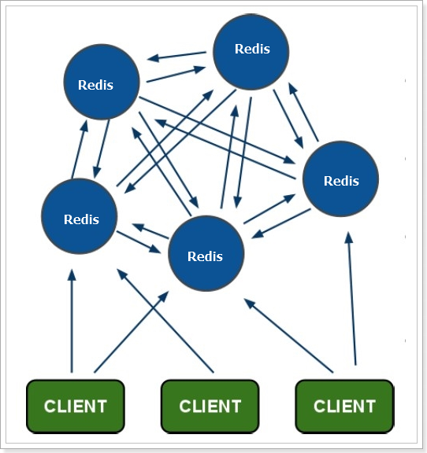

Redis

## Redis简介(了解)

### 关于NoSQL

NoSQL的全称是Not only SQL，在过去的几年中，NoSQL数据库一度成为高并发、海量数据存储解决方案的代名词。

- **BerkeleyDB**是一种极为流行的开源嵌入式数据库，在更多情况下可用于存储引擎，比如BerkeleyDB在被Oracle收购之前曾作为MySQL的存储引擎，由此可以预见，该产品拥有极好的并发伸缩性，支持事务及嵌套事务，海量数据存储等重要特征，在用于存储实时数据方面具有极高的可用价值。然而需要指出的是，该产品的Licence为GPL，这就意味着它并不是在所有情况下都是免费使用的。
- 对**MongoDB**的定义为Oriented­Document数据库服务器，和BerkeleyDB不同的是该数据库可以像其他关系型数据库服务器那样独立的运行并提供相关的数据服务。从该产品的官方文档中我们可以获悉，MongoDB主要适用于高并发的论坛或博客网站，这些网站具有的主要特征是并发访问量高、多读少写、数据量大、逻辑关系简单，以及文档数据作为主要数据源等。和BerkeleyDB一样，该产品的License同为GPL。
- **Redis**，典型的NoSQL数据库服务器，和BerkeleyDB相比，它可以作为服务程序独立运行于自己的服务器主机。在很多时候，人们只是将Redis视为Key/Value数据库服务器，然而事实并非如此，在目前的版本中，Redis除了Key/Value之外还支持List、Set、Hash和Ordered Set等数据结构，因此它的用途也更为宽泛。和以上两种产品不同的是，Redis的License是Apache License，就目前而言，它是完全免费。
- **memcached**，数据缓存服务器。它们之间的最大区别，memcached只是提供了数据缓存服务，一旦服务器宕机，之前在内存中缓存的数据也将全部消失，因此可以看出memcached没有提供任何形式的数据持久化功能，而Redis则提供了这样的功能。再有就是Redis提供了更为丰富的数据存储结构，如Hash和Set。至于它们的相同点，主要有两个，一是完全免费，再有就是它们的提供的命令形式极为接近。  

### Redis的优势

- 和其他NoSQL产品相比，Redis的易用性极高，因此对于那些有类似产品使用经验的开发者来说，一两天，甚至是几个小时之后就可以利用Redis来搭建自己的平台了。
- 在解决了很多通用性问题的同时，也为一些个性化问题提供了相关的解决方案，如索引引擎、统计排名、消息队列服务等。  

### 和关系型数据库的比较

在数据存储方面，Redis遵循了现有NoSQL数据库的主流思想，即Key作为数据检索的唯一标识，我们可以将其简单的理解为关系型数据库中索引的键，而Value则作为数据存储的主要对象，其中每一个Value都有一个Key与之关联，这就好比索引中物理数据在数据表中存储的位置。

在Redis中，Value将被视为二进制字节流用于存储任何格式的数据，如Json、XML和序列化对象的字节流等，因此我们也可以将其想象为关系型数据库中的BLOB类型字段。

### 如何持久化内存数据  

缺省情况下，Redis会参照当前数据库中数据被修改的数量，在达到一定的阈值后会将数据库的快照存储到磁盘上，这一点我们可以通过配置文件来设定该阈值。通常情况下，我们也可以将Redis设定为定时保存。如当有1000个以上的键数据被修改时，Redis将每隔60秒进行一次数据持久化操作。缺省设置为，如果有9个或9个以下数据修改时，Redis将每15分钟持久化一次。

从上面提到的方案中可以看出，如果采用该方式，Redis的运行效率将会是非常高效的，每当有新的数据修改发生时，仅仅是内存中的缓存数据发生改变，而这样的改变并不会被立即持久化到磁盘上，从而在绝大多数的修改操作中避免了磁盘IO的发生。然而事情往往是存在其两面性的，在该方法中我们确实得到了效率上的提升，但是却失去了数据可靠性。如果在内存快照被持久化到磁盘之前，Redis所在的服务器出现宕机，那么这些未写入到磁盘的已修改数据都将丢失。

为了保证数据的高可靠性，Redis还提供了另外一种数据持久化机制­­Append模式。如果Redis服务器被配置为该方式，那么每当有数据修改发生时，都会被立即持久化到磁盘。  

## 安装Redis  

### 安装  

**步骤：**

1. 解压redis­3.2.8.tar.gz  

   ```sh
   cd ~/software
   tar -zxf redis-3.2.8.tar.gz
   ```

2. 编译  

   ```sh
   cd redis-3.2.8
   make
   ```

3. 安装  

   ```sh
   mkdir ~/software/redis-bin
   make install PREFIX=~/software/redis-bin/ #PREFIX选项用来指定安装的位置
   ```

4. 启动redis  

   ```sh
   cd ~/software/redis-bin/bin/
   ./redis-server # 使用默认配置文件启动，默认配置文件所在目录redis-3.2.8/redis.conf
   或 
   cp ~/software/redis-3.2.8/redis.conf myredis.conf # 复制默认配置文件到当前目录，并改名
   ./redis-server myredis.conf # 使用指定的配置文件启动
   ```

   补充：可以将~/software/redis­bin/bin/添加到PATH变量中，便于执行命令

   ```sh
   vi ~/.bashrc
   	export PATH=$PATH:/Users/wangbo/software/redis-bin/bin
   	
   source ~/.bashrc
   ```

5. 连接redis  

   ```sh
   ./redis-cli # 默认连接本机的6379端口(redis默认使用的端口号)
   或 
   ./redis-cli -h IP地址 -p 端口号 # 连接指定主机、指定端口的redis，如./redis-cli -h localhost -p 6379
   ```

### 关闭  

两种方式

- 方式1：在服务器窗口中按 Ctrl+C
- 方式2：在客户端连接后输入 shutdown 或 直接输入 redis-­cli shutdown

查看redis进程  

```sh
ps aux | grep redis #查看redis的进程信息
或 
lsof -i:6379 #查看6379端口的进程信息
```

### 配置

编辑配置文件：  

```sh
$ vi myredis.conf
    daemonize yes #配置为守护进程，后台启动
    
    port 6379 #修改监听端口
    
    #让redis支持远程访问，默认只允许本地访问
    #bind 127.0.0.1 #注释掉该行，允许所有主机访问redis
    
    protected-mode no #关闭保护模式
    
    requirepass itany #配置redis密码，使用时需要输入:auth itany进行认证，认证后才能操作redis
```

## Redis数据类型

### 简介

Redis数据就是以key­-value形式来存储的，key只能是字符串类型，value可以是以下八种类型。

1. 字符串
2. 列表list
3. 无序集合set
4. 有序集合set(Sorted­-Sets)
5. 散列hash
6. 基数统计HyperLogLog    #2.9新增
7. 地理地图GEO    #3.2新增
8. 流Stream   #5.0新增

### String类型  

#### 简介

字符串类型是Redis中最为基础的数据存储类型，它在Redis中是**二进制安全**的，这便意味着该类型可以接受任何格式的数据，如JPEG图像数据或Json对象描述信息等。在Redis中字符串类型的Value最多可以容纳的数据长度是512M。  

参考笔记进制和编码中二进制安全详解

#### 内部编码

type命令实际返回的就是当前键的数据结构类型，它们分别是：string（字符串）、hash（哈希）、list（列表）、set（集合）、zset（有序集合），但这些只是Redis对外的数据结构。实际上每种数据结构都有自己底层的内部编码实现，而且是多种实现，这样Redis会在合适的场景选择合适的内部编码。内部编码即是外部数据结构的内部实现，也就是redis底层的内部数据结构。


我们可以通过object encoding命令查询内部编码，如：

```sh
>set  key  123
>object encoding key
“int”
```


参考：[Redis的五种数据结构的内部编码](https://www.cnblogs.com/yangmingxianshen/p/8054094.html)

#### 操作  

- `set/get/append/strlen`  

  设置/获取

  ```sh
  $ redis-cli
  
  127.0.0.1:6379> select 0 #切换到第1个数据库，默认共有16个数据库，索引从0开始
  OK
  
  127.0.0.1:6379> keys * #显示所有的键key
  (empty list or set)
  
  127.0.0.1:6379> set name tom #设置键
  OK
  
  127.0.0.1:6379> get name #获取键对应的值
  "tom"
  
  127.0.0.1:6379> exists mykey #判断该键是否存在，存在返回1，不存在返回0
  (integer) 0
  
  127.0.0.1:6379> append mykey "hello" #如果该键不存在，则创建，返回当前value的长度
  (integer) 5
  
  127.0.0.1:6379> append mykey " world" #如果该键已经存在，则追加，返回追加后value的长度
  (integer) 11
  
  127.0.0.1:6379> get mykey #获取mykey的值
  "hello world"
  
  127.0.0.1:6379> strlen mykey #获取mykey的长度
  (integer) 11
  
  #EX和PX表示失效时间，单位为秒和毫秒，两者不能同时使用；NX表示数据库中不存在时才能设置,XX表示存在时才能设置
  127.0.0.1:6379> set mykey "this is test" EX 5 NX
  OK
  
  127.0.0.1:6379> get mykey
  "this is test"
  ```

  注：命令不区分大小写，但key和value区分大小写

- `incr/decr/incrby/decrby  `

  ```sh
  127.0.0.1:6379> flushdb #清空数据库
  OK
  
  127.0.0.1:6379> set mykey 20
  OK
  
  127.0.0.1:6379> incr mykey #递增1
  (integer) 21
  
  127.0.0.1:6379> decr mykey #递减1
  (integer) 20
  
  127.0.0.1:6379> del mykey #删除该键
  (integer) 1
  
  127.0.0.1:6379> decr mykey
  (integer) -1
  
  127.0.0.1:6379> del mykey
  (integer) 1
  
  127.0.0.1:6379> INCR mykey
  (integer) 1
  
  127.0.0.1:6379> set mykey 'hello' #将该键的Value设置为不能转换为整型的普通字符串
  OK
  
  127.0.0.1:6379> incr mykey #在该键上再次执行递增操作时，Redis将报告错误信息
  (error) ERR value is not an integer or out of range
  
  127.0.0.1:6379> set mykey 10
  OK
  
  127.0.0.1:6379> incrby mykey 5 #递增5，即步长
  (integer) 15
  
  127.0.0.1:6379> decrby mykey 10 #递减10
  (integer) 5
  ```

- `getset/setex/setnx  `

  ```sh
  # getset 获取的同时并设置新的值
  127.0.0.1:6379> incr mycount #将计数器的值原子性的递增1
  (integer) 1
  
  127.0.0.1:6379> getset mycount 666 #在获取计数器原有值的同时，并将其设置为新值
  "1"
  
  127.0.0.1:6379> get mycount
  "666"
  
  # setex 设置过期时间
  127.0.0.1:6379> setex mykey 10 "hello" #设置指定Key的过期时间为10秒，等同于set mykey hello ex 10
  OK
  
  127.0.0.1:6379> ttl mykey #查看指定Key的过期时间(秒数)
  (integer) 8
  
  # setnx 当key不存在时才能设置
  127.0.0.1:6379> del mykey
  (integer) 0
  
  127.0.0.1:6379> setnx mykey "aaa" #key不存在，可以设置，等同于set mykey aaa nx
  (integer) 1
  
  127.0.0.1:6379> setnx mykey "bbb" #key存在，不能设置
  (integer) 0
  
  127.0.0.1:6379> get mykey
  "aaa"
  ```

- `setrange/getrange` 设置/获取指定索引位置的字符

  ```sh
  127.0.0.1:6379> set mykey "hello world"
  OK
  
  127.0.0.1:6379> get mykey
  "hello world"
  
  127.0.0.1:6379> setrange mykey 6 dd #从索引为6的位置开始替换(索引从0开始)
  (integer) 11
  
  127.0.0.1:6379> get mykey
  "hello ddrld"
  
  127.0.0.1:6379> setrange mykey 20 dd #超过的长度使用0代替
  (integer) 22
  
  127.0.0.1:6379> get mykey
  "hello ddrld\x00\x00\x00\x00\x00\x00\x00\x00\x00dd"
  
  127.0.0.1:6379> getrange mykey 3 12 #获取索引为[3,12]之间的内容
  "lo ddrld\x00\x00"
  ```

- `setbit/getbit` 设置/获取指定位的BIT值，应用场景：考勤打卡

  ```sh
  127.0.0.1:6379> del mykey
  (integer) 1
  
  127.0.0.1:6379> setbit mykey 7 1 #设置从0开始计算的第七位BIT值为1，返回原有BIT值0
  (integer) 0
  
  127.0.0.1:6379> get mykey #获取设置的结果，二进制的0000 0001的十六进制值为0x01
  "\x01"
  
  127.0.0.1:6379> setbit mykey 6 1 #设置从0开始计算的第六位BIT值为1，返回原有BIT值0
  (integer) 0
  
  127.0.0.1:6379> get mykey #获取设置的结果，二进制的0000 0011的十六进制值为0x03
  "\x03"
  
  127.0.0.1:6379> getbit mykey 6 #返回了指定Offset的BIT值
  (integer) 1
  
  127.0.0.1:6379> getbit mykey 10 #如果offset已经超出了value的长度，则返回0
  (integer) 0
  ```

- `mset/mget/msetnx`

  ```sh
  127.0.0.1:6379> mset key1 "hello" key2 "world" #批量设置了key1和key2两个键。
  OK
  
  127.0.0.1:6379> mget key1 key2 #批量获取了key1和key2两个键的值。
  1) "hello"
  2) "world"
  
  #批量设置了key3和key4两个键，因为之前他们并不存在，所以该命令执行成功并返回1
  127.0.0.1:6379> msetnx key3 "itany" key4 "liu"
  (integer) 1
  
  127.0.0.1:6379> mget key3 key4
  1) "itany"
  2) "liu"
  
  #批量设置了key3和key5两个键，但是key3已经存在，所以该命令执行失败并返回0
  127.0.0.1:6379> msetnx key3 "hello" key5 "world"
  (integer) 0
  
  #批量获取key3和key5，由于key5没有设置成功，所以返回nil
  127.0.0.1:6379> mget key3 key5
  1) "itany"
  2) (nil)
  ```

### List类型

#### 概述

在Redis中，List类型是**按照插入顺序排序的字符串链表**。和数据结构中的普通链表一样，我们可以在其头部(left)和尾部(right)添加新的元素。在插入时，如果该键并不存在，Redis将为该键创建一个新的链表。与此相反，如果链表中所有的元素均被移除，那么该键也将会被从数据库中删除。List中可以包含的最大元素数量是
4294967295。

从元素插入和删除的效率视角来看，如果我们是在链表的两头插入或删除元素，这将会是非常高效的操作，即使链表中已经存储了百万条记录，该操作也可以在常量时间内完成。然而需要说明的是，如果元素插入或删除操作是作用于链表中间，那将会是非常低效的。  

#### 操作

- `lpush/lpushx/lrange`  

  左插入/键存在再左插入/左查看

  ```sh
  127.0.0.1:6379> flushdb
  OK
  
  #创建键mykey及与其关联的List，然后将参数中的values从左到右依次插入，头部插入
  127.0.0.1:6379> lpush mykey a b c d
  (integer) 4
  
  #获取从位置0开始到位置2结束的3个元素
  127.0.0.1:6379> lrange mykey 0 2
  1) "d"
  2) "c"
  3) "b"
  
  #获取链表中的全部元素，其中0表示第一个元素，-1表示最后一个元素
  127.0.0.1:6379> lrange mykey 0 -1
  1) "d"
  2) "c"
  3) "b"
  4) "a"
  
  #获取从倒数第3个到倒数第2个的元素
  127.0.0.1:6379> lrange mykey -3 -2
  1) "c"
  2) "b"
  
  #lpushx表示键存在时才能插入，mykey2键此时并不存在，因此该命令将不会进行任何操作，其返回值为0
  127.0.0.1:6379> lpushx mykey2 e
  (integer) 0
  
  #可以看到mykey2没有关联任何List Value
  127.0.0.1:6379> lrange mykey2 0 -1
  (empty list or set)
  
  #mykey键此时已经存在，所以该命令插入成功，并返回链表中当前元素的数量
  127.0.0.1:6379> lpushx mykey e
  (integer) 5
  
  #获取该键的List中的第一个元素
  127.0.0.1:6379> lrange mykey 0 0
  1) "e"
  ```

- `lpop/llen`  

  ```sh
  127.0.0.1:6379> flushdb
  OK
  
  127.0.0.1:6379> lpush mykey a b c d
  (integer) 4
  
  #取出链表头部的元素，该元素在链表中就已经不存在了
  127.0.0.1:6379> lpop mykey
  "d"
  
  127.0.0.1:6379> lpop mykey
  "c"
  
  #在执行lpop命令两次后，链表头部的两个元素已经被弹出，此时链表中元素的数量是2
  127.0.0.1:6379> llen mykey
  (integer) 2
  ```

- `lrem/lindex/lset/ltrim`  

  ```sh
  127.0.0.1:6379> flushdb
  OK
  
  #准备测试数据
  127.0.0.1:6379> lpush mykey a b c d a c
  (integer) 6
  
  #从头部(left)向尾部(right)操作链表，删除2个值等于a的元素，返回值为实际删除的数量
  127.0.0.1:6379> lrem mykey 2 a
  (integer) 2
  
  #查看删除后链表中的全部元素
  127.0.0.1:6379> lrange mykey 0 -1
  1) "c"
  2) "d"
  3) "c"
  4) "b"
  
  #获取索引值为1(头部的第二个元素)的元素值
  127.0.0.1:6379> lindex mykey 1
  "d"
  
  #将索引值为1(头部的第二个元素)的元素值设置为新值e
  127.0.0.1:6379> lset mykey 1 e
  OK
  
  #查看是否设置成功
  127.0.0.1:6379> lindex mykey 1
  "e"
  
  #索引值6超过了链表中元素的数量，该命令返回nil
  127.0.0.1:6379> lindex mykey 6
  (nil)
  
  #设置的索引值6超过了链表中元素的数量，设置失败，该命令返回错误信息。
  127.0.0.1:6379> lset mykey 6 h
  (error) ERR index out of range
  
  #仅保留索引值0到2之间的3个元素，注意第0个和第2个元素均被保留。
  127.0.0.1:6379> ltrim mykey 0 2
  OK
  
  #查看trim后的结果
  127.0.0.1:6379> lrange mykey 0 -1
  1) "c"
  2) "e"
  3) "c"
  ```

- `linsert`

  ```sh
  127.0.0.1:6379> del mykey
  (integer) 1
  
  #准备测试数据
  127.0.0.1:6379> lpush mykey a b c d e
  (integer) 5
  
  #在a的前面插入新元素a1
  127.0.0.1:6379> linsert mykey before a a1
  (integer) 6
  
  #查看是否插入成功，从结果看已经插入
  127.0.0.1:6379> lrange mykey 0 -1
  1) "e"
  2) "d"
  3) "c"
  4) "b"
  5) "a1"
  6) "a"
  
  #在e的后面插入新元素e2，从返回结果看已经插入成功
  127.0.0.1:6379> linsert mykey after e e2
  (integer) 7
  
  #再次查看是否插入成功
  127.0.0.1:6379> lrange mykey 0 -1
  1) "e"
  2) "e2"
  3) "d"
  4) "c"
  5) "b"
  6) "a1"
  7) "a"
  
  #在不存在的元素之前或之后插入新元素，该命令操作失败，并返回-1
  127.0.0.1:6379> linsert mykey after k a
  (integer) -1
  
  #为不存在的Key插入新元素，该命令操作失败，返回0
  127.0.0.1:6379> linsert mykey1 after a a2
  (integer) 0
  ```

- `rpush/rpushx/rpop/rpoplpush`

  右插入/键存在再右插入/

  ```sh
  127.0.0.1:6379> del mykey
  (integer) 1
  
  #从链表的尾部插入参数中给出的values，插入顺序是从左到右依次插入
  127.0.0.1:6379> rpush mykey a b c d
  (integer) 4
  
  #查看链表中的元素，注意元素的顺序
  127.0.0.1:6379> lrange mykey 0 -1
  1) "a"
  2) "b"
  3) "c"
  4) "d"
  
  #该键已经存在并且包含4个元素，rpushx命令将执行成功，并将元素e插入到链表的尾部。
  127.0.0.1:6379> rpushx mykey e
  (integer) 5
  
  #由于mykey2键并不存在，因此该命令不会插入数据，其返回值为0。
  127.0.0.1:6379> rpushx mykey2 e
  (integer) 0
  
  #查看链表中所有的元素
  127.0.0.1:6379> lrange mykey 0 -1
  1) "a"
  2) "b"
  3) "c"
  4) "d"
  5) "e"
  
  #从尾部(right)弹出元素，即取出元素
  127.0.0.1:6379> rpop mykey
  "e"
  
  #查看链表中所有的元素
  127.0.0.1:6379> lrange mykey 0 -1
  1) "a"
  2) "b"
  3) "c"
  4) "d"
  
  #创建mykey2
  127.0.0.1:6379> lpush mykey2 m n
  (integer) 2
  
  #将mykey的尾部元素弹出，然后插入到mykey2的头部(原子性的完成这两步操作)
  127.0.0.1:6379> rpoplpush mykey mykey2
  "d"
  
  #通过lrange命令查看mykey在弹出尾部元素后的结果
  127.0.0.1:6379> lrange mykey 0 -1
  1) "a"
  2) "b"
  3) "c"
  
  #通过lrange命令查看mykey2在插入元素后的结果
  127.0.0.1:6379> lrange mykey2 0 -1
  1) "d"
  2) "n"
  3) "m"
  127.0.0.1:6379>
  
  #将source和destination设为同一键，将mykey中的尾部元素移到其头部
  127.0.0.1:6379> rpoplpush mykey mykey
  "c"
  
  #查看结果
  127.0.0.1:6379> lrange mykey 0 -1
  1) "c"
  2) "a"
  3) "b"
  ```

### Set类型

#### 概述

在Redis中，我们可以将Set类型看作为没有排序的字符集合，也可以在该类型的数据值上执行添加、删除或判断某一元素是否存在等操作。Set可包含的最大元素数量是4294967295。

和List类型不同的是，Set集合中不允许出现重复的元素，这一点和Java中的set容器是完全相同的。换句话说，如果多次添加相同元素，Set中将仅保留该元素的一份拷贝。

和List类型相比，Set类型在功能上还存在着一个非常重要的特性，即在服务器端完成多个Sets之间的聚合计算操作，如unions并、intersections交和differences差。由于这些操作均在服务端完成，因此效率极高，而且也节省了大量的网络IO开销。  

#### 操作

- `sadd/smembers/sismember/scard`  

  添加/查看/

  ```sh
  #由于该键myset之前并不存在，因此参数中的三个成员都被正常插入
  127.0.0.1:6379> sadd myset a b c
  (integer) 3
  
  #查看集合中的元素，从结果可以，输出的顺序和插入顺序无关(无序的)
  127.0.0.1:6379> smembers myset
  1) "a"
  2) "c"
  3) "b"
  
  #由于参数中的a在myset中已经存在，因此本次操作仅仅插入了d和e两个新成员（不允许重复）
  127.0.0.1:6379> sadd myset a d e
  (integer) 2
  
  #查看插入的结果
  127.0.0.1:6379> smembers myset
  1) "a"
  2) "c"
  3) "d"
  4) "b"
  5) "e"
  
  #判断a是否已经存在，返回值为1表示存在
  127.0.0.1:6379> sismember myset a
  (integer) 1
  
  #判断f是否已经存在，返回值为0表示不存在
  127.0.0.1:6379> sismember myset f
  (integer) 0
  
  #获取集合中元素的数量
  127.0.0.1:6379> scard myset
  (integer) 5
  ```

- `srandmember/spop/srem/smove`

  ```sh
  127.0.0.1:6379> del myset
  (integer) 1
  
  #准备测试数据
  127.0.0.1:6379> sadd myset a b c d
  (integer) 4
  
  #查看集合中的元素
  127.0.0.1:6379> smembers myset
  1) "c"
  2) "d"
  3) "a"
  4) "b"
  
  #随机返回一个成员，成员还在集合中
  127.0.0.1:6379> srandmember myset
  "c"
  
  #取出一个成员，成员会从集合中删除
  127.0.0.1:6379> spop myset
  "b"
  
  #查看移出后Set的成员信息
  127.0.0.1:6379> smembers myset
  1) "c"
  2) "d"
  3) "a"
  
  #从Set中移出a、d和f三个成员，其中f并不存在，因此只有a和d两个成员被移出，返回为2
  127.0.0.1:6379> srem myset a d f
  (integer) 2
  
  #查看移出后的输出结果
  127.0.0.1:6379> smembers myset
  1) "c"
  127.0.0.1:6379> del myset
  (integer) 1
  
  #为后面的smove命令准备数据
  127.0.0.1:6379> sadd myset a b
  (integer) 2
  127.0.0.1:6379> sadd myset2 c d
  (integer) 2
  
  #将a从myset移到myset2，从结果可以看出移动成功
  127.0.0.1:6379> smove myset myset2 a
  (integer) 1
  
  #再次将a从myset移到myset2，由于此时a已经不是myset的成员了，因此移动失败并返回0。
  127.0.0.1:6379> smove myset myset2 a
  (integer) 0
  
  #分别查看myset和myset2的成员，确认移动是否真的成功。
  127.0.0.1:6379> smembers myset
  1) "b"
  127.0.0.1:6379> smembers myset2
  1) "c"
  2) "d"
  3) "a"
  ```

- `sdiff/sdiffstore/sinter/sinterstore/sunion/sunionstore`  

  差异比较，以第一个为基准逐渐减少/

  差异比较存储/

  交集/

  交集存储/

  并集/

  并集存储

  ```sh
  127.0.0.1:6379> flushdb
  OK
  
  #准备测试数据
  127.0.0.1:6379> sadd myset a b c d
  (integer) 4
  127.0.0.1:6379> sadd myset2 c
  (integer) 1
  127.0.0.1:6379> sadd myset3 a c e
  (integer) 3
  
  #获取多个集合之间的不同成员，要注意匹配的规则
  #先将myset和myset2进行比较，a、b和d三个成员是两者之间的差异成员，然后再用这个结果继续和
  myset3进行差异比较，b和d是myset3不存在的成员
  127.0.0.1:6379> sdiff myset myset2 myset3
  1) "d"
  2) "b"
  127.0.0.1:6379> sdiff myset3 myset2 myset
  1) "e"
  
  #将3个集合的差异成员存储到与diffkey关联的Set中，并返回插入的成员数量
  127.0.0.1:6379> sdiffstore diffkey myset myset2 myset3
  (integer) 2
  
  #查看一下sdiffstore的操作结果
  127.0.0.1:6379> smembers diffkey
  1) "d"
  2) "b"
  
  #获取多个集合之间的交集，这三个Set的成员交集只有c
  127.0.0.1:6379> sinter myset myset2 myset3
  1) "c"
  
  #将3个集合中的交集成员存储到与interkey关联的Set中，并返回交集成员的数量
  127.0.0.1:6379> sinterstore interkey myset myset2 myset3
  (integer) 1
  
  #查看一下sinterstore的操作结果
  127.0.0.1:6379> smembers interkey
  1) "c"
  
  #获取多个集合之间的并集
  127.0.0.1:6379> sunion myset myset2 myset3
  1) "b"
  2) "c"
  3) "d"
  4) "e"
  5) "a"
  
  #将3个集合中成员的并集存储到unionkey关联的set中，并返回并集成员的数量
  127.0.0.1:6379> sunionstore unionkey myset myset2 myset3
  (integer) 5
  
  #查看一下sunionstore的操作结果
  127.0.0.1:6379> smembers unionkey
  1) "b"
  2) "c"
  3) "d"
  4) "e"
  5) "a"
  ```

#### 应用范围  

- 可以使用Redis的Set数据类型跟踪一些唯一性数据，比如访问某一博客的唯一IP地址信息。对于此场景，我们仅需在每次访问该博客时将访问者的IP存入Redis中，Set数据类型会自动保证IP地址的唯一性。
- 充分利用Set类型的服务端聚合操作方便、高效的特性，可以用于维护数据对象之间的关联关系。比如所有购买某一电子设备的客户ID被存储在一个指定的Set中，而购买另外一种电子产品的客户ID被存储在另外一个Set中，如果此时我们想获取有哪些客户同时购买了这两种商品时，Set的intersections命令就可以充分发挥它的方便和效率的优势了  

### Sorted­-Sets类型  

#### 概述

Sorted­-Sets和Sets类型极为相似，也称为Zset，它们都是字符串的集合，都不允许重复的成员出现在一个Set中。它们之间的主要差别是Sorted-­Sets中的每一个成员都会**有一个分数(score)与之关联**，Redis正是**通过分数从小到大来为集合中的成员进行排序**（默认）。然而需要额外指出的是，尽管Sorted-­Sets中的成员必须是唯一的，但是分数(score)却是可以重复的。

在Sorted­-Set中添加、删除或更新一个成员都是非常快速的操作。由于Sorted-­Sets中的成员在集合中的位置是有序的，因此，即便是访问位于集合中部的成员也仍然是非常高效的。事实上，Redis所具有的这一特征在很多其它类型的数据库中是很难实现的，换句话说，在该点上要想达到和Redis同样的高效，在其它数据库中进行建模是非常困难的。  

#### 操作  

- `zadd/zrange/zcard/zrank/zcount/zrem/zscore/zincrby`  

  添加/
  
  查看/
  
  计数/
  
  获取索引，从0开始/
  
  分数计数/
  
  删除成员/
  
  获取分数/
  
  增加分数/
  
  ```sh
  #添加一个分数为1的成员
  127.0.0.1:6379> zadd myzset 1 "one"
  (integer) 1
  
  #添加两个分数分别是2和3的两个成员
  127.0.0.1:6379> zadd myzset 2 "two" 3 "three"
  (integer) 2
  
  #通过索引获取元素，0表示第一个成员，-1表示最后一个成员。WITHSCORES选项表示返回的结果中包含每个成员及其分数，否则只返回成员
  127.0.0.1:6379> zrange myzset 0 -1 WITHSCORES
  1) "one"
  2) "1"
  3) "two"
  4) "2"
  5) "three"
  6) "3"
  
  #获取myzset键中成员的数量
  127.0.0.1:6379> zcard myzset
  (integer) 3
  
  #获取成员one在集合中的索引，0表示第一个位置
  127.0.0.1:6379> zrank myzset one
  (integer) 0
  
  #成员four并不存在，因此返回nil
  127.0.0.1:6379> zrank myzset four
  (nil)
  
  #获取符合指定条件的成员数量，分数满足表达式1 <= score <= 2的成员的数量
  127.0.0.1:6379> zcount myzset 1 2
  (integer) 2
  
  #删除成员one和two，返回实际删除成员的数量
  127.0.0.1:6379> zrem myzset one two
(integer) 2
  
  #查看是否删除成功
  127.0.0.1:6379> zcard myzset
  (integer) 1
  
  #获取成员three的分数。返回值是字符串形式
  127.0.0.1:6379> zscore myzset three
  "3"
  
  #由于成员two已经被删除，所以该命令返回nil
  127.0.0.1:6379> zscore myzset two
  (nil)
  
  #将成员three的分数增加2，并返回该成员更新后的分数
  127.0.0.1:6379> zincrby myzset 2 three
  "5"
  
  #将成员three的分数增加-1，并返回该成员更新后的分数
  127.0.0.1:6379> zincrby myzset -1 three
  "4"
  
  #查看在更新了成员的分数后是否正确
  127.0.0.1:6379> zrange myzset 0 -1 withscores
  1) "three"
  2) "4"
  ```

- `zrangebyscore/zremrangebyscore/zremrangebyrank`  

  ```sh
  127.0.0.1:6379> del myzset
  (integer) 1
  127.0.0.1:6379> zadd myzset 1 one 2 two 3 three 4 four
  (integer) 4
  
  #通过分数获取元素，获取分数满足表达式1 <= score <= 2的成员
  127.0.0.1:6379> zrangebyscore myzset 1 2
  1) "one"
  2) "two"
  
  #-inf表示第一个成员，+inf表示最后一个成员，limit后面的参数用于限制返回成员的数量，
  #2表示从位置索引(0-based)等于2的成员开始，取后面3个成员，类似于MySQL中的limit
  127.0.0.1:6379> zrangebyscore myzset -inf +inf withscores limit 2 3
  1) "three"
  2) "3"
  3) "four"
  4) "4"
  
  #根据分数删除成员，删除分数满足表达式1 <= score <= 2的成员，并返回实际删除的数量
  127.0.0.1:6379> zremrangebyscore myzset 1 2
  (integer) 2
  
  #看出一下上面的删除是否成功
  127.0.0.1:6379> zrange myzset 0 -1
  1) "three"
  2) "four"
  
  #根据索引删除成员，删除索引满足表达式0 <= rank <= 1的成员
  127.0.0.1:6379> zremrangebyrank myzset 0 1
  (integer) 2
  
  #查看上一条命令是否删除成功
  127.0.0.1:6379> zcard myzset
  (integer) 0
  ```

- `zrevrange/zrevrangebyscore/zrevrank`  

  ```sh
  127.0.0.1:6379> del myzset
  (integer) 0
  127.0.0.1:6379> zadd myzset 1 one 2 two 3 three 4 four
  (integer) 4
  
  #按索引从高到低的方式获取成员
  127.0.0.1:6379> zrevrange myzset 0 -1 WITHSCORES
  1) "four"
  2) "4"
  3) "three"
  4) "3"
  5) "two"
  6) "2"
  7) "one"
  8) "1"
  
  #由于是从高到低的排序，所以位置等于0的是four，1是three，并以此类推
  127.0.0.1:6379> zrevrange myzset 1 3
  1) "three"
  2) "two"
  3) "one"
  
  #按索引从高到低的方式根据分数获取成员，分数满足表达式3 >= score >= 0的成员
  127.0.0.1:6379> zrevrangebyscore myzset 3 0
  1) "three"
  2) "two"
  3) "one"
  
  #limit选项的含义等同于zrangebyscore中的该选项，只是在计算位置时按照相反的顺序计算和获取
  127.0.0.1:6379> zrevrangebyscore myzset 4 0 limit 1 2
  1) "three"
  2) "two"
  
  #获取成员one在集合中的索引，由于是从高到低的排序，所以one的位置是3
  127.0.0.1:6379> zrevrank myzset one
  (integer) 3
  
  #由于是从高到低的排序，所以four的位置是0
  127.0.0.1:6379> zrevrank myzset four
  (integer) 0
  ```

#### 应用范围  

- 可以用于大型在线游戏的积分排行榜。每当玩家的分数发生变化时，可以执行ZADD命令更新玩家的分数，此后再通过ZRANGE命令获取积分TOP 10的用户信息。当然我们也可以利用ZRANK命令通过username来获取玩家的排行信息。最后我们将组合使用ZRANGE和ZRANK命令快速的获取和某个玩家积分相近的其他用户的信息。

- Sorted­Sets类型还可用于构建索引数据。  

### Hash(哈希)类型  

#### 概述  

可以将Redis中的Hash类型看成具有String Key和String Value的map容器。所以该类型非常适合于存储值对象的信息。如Username、Password和Age等。如果Hash中包含很少的字段，那么该类型的数据也将仅占用很少的磁盘空间。每一个Hash可以存储4294967295个键值对。  

#### 操作  

- `hset/hget/hlen/hexists/hdel/hsetnx`  

  设置 redis键 map键 map值/

  获取 redis键 map键/

  获取长度 redis键/

  判断 redis键 map键

  删除redis键 map键/

  存在设置 redis键 map键 map值/

  ```sh
#给键值为myhash的键设置字段为field1，值为itany
  127.0.0.1:6379> hset myhash field1 "itany"
  (integer) 1
  
  #获取键值为myhash，字段为field1的值
  127.0.0.1:6379> hget myhash field1
  "itany"
  
  #myhash键中不存在field2字段，因此返回nil
  127.0.0.1:6379> hget myhash field2
  (nil)
  
  #给myhash关联的Hashes值添加一个新的字段field2，其值为liu
  127.0.0.1:6379> hset myhash field2 "liu"
  (integer) 1
  
  #获取myhash键的字段数量
  127.0.0.1:6379> hlen myhash
  (integer) 2
  
  #判断myhash键中是否存在字段名为field1的字段，由于存在，返回值为1
  127.0.0.1:6379> hexists myhash field1
  (integer) 1
  
  #删除myhash键中字段名为field1的字段，删除成功返回1
  127.0.0.1:6379> hdel myhash field1
  (integer) 1
  
  #再次删除myhash键中字段名为field1的字段，由于上一条命令已经将其删除，因为没有删除，返回0
  127.0.0.1:6379> hdel myhash field1
  (integer) 0
  
  #通过hsetnx命令给myhash添加新字段field1，其值为itany，因为该字段已经被删除，所以该命令添加成功并返回1
  127.0.0.1:6379> hsetnx myhash field1 "itany"
  (integer) 1
  
  #由于myhash的field1字段已经通过上一条命令添加成功，因为本条命令不做任何操作后返回0
  127.0.0.1:6379> hsetnx myhash field1 "itany"
  (integer) 0
  ```
  
- `hincrby`  

  ```sh
  127.0.0.1:6379> del myhash
  (integer) 1
  
  #准备测试数据
  127.0.0.1:6379> hset myhash field 5
  (integer) 1
  
  #给myhash的field字段的值加1，返回加后的结果
  127.0.0.1:6379> hincrby myhash field 1
  (integer) 6
  
  #给myhash的field字段的值加-1，返回加后的结果
  127.0.0.1:6379> hincrby myhash field -1
  (integer) 5
  
  #给myhash的field字段的值加-10，返回加后的结果
  127.0.0.1:6379> hincrby myhash field -10
  (integer) -5
  ```

- `hmset/hmget/hgetall/hkeys/hvals`

  ```sh
  127.0.0.1:6379> del myhash
  (integer) 1
  
  #为该键myhash，一次性设置多个字段，分别是field1 = "hello", field2 = "world"
  127.0.0.1:6379> hmset myhash field1 "hello" field2 "world"
  OK
  
  #获取myhash键的多个字段，其中field3并不存在，因为在返回结果中与该字段对应的值为nil
  127.0.0.1:6379> hmget myhash field1 field2 field3
  1) "hello"
  2) "world"
  3) (nil)
  
  #返回myhash键的所有字段及其值，从结果中可以看出，他们是逐对列出的
  127.0.0.1:6379> hgetall myhash
  1) "field1"
  2) "hello"
  3) "field2"
  4) "world"
  
  #仅获取myhash键中所有字段的名字
  127.0.0.1:6379> hkeys myhash
  1) "field1"
  2) "field2"
  
  #仅获取myhash键中所有字段的值
  127.0.0.1:6379> hvals myhash
  1) "hello"
  2) "world"
  ```

## Key操作命令    

### 命令列表  

| 命令用法               | 解释                                                         |
| ---------------------- | ------------------------------------------------------------ |
| dbsize                 | 查看redis中总共有多少条数据                                  |
| keys pattern           | 获取所有匹配pattern参数的Keys。需要说明的是，在我们的正常操作中应该尽量避免对该命令的调 用，因为对于大型数据库而言，该命令是非常耗时的，对Redis服务器的性能打击也是比较大的。 pattern支持glob-­style的通配符格式，如`*`表示任意一个或多个字符，`?`表示任意字符，`[abc]`表示方括号中任意一个字母。 |
| del key [key...]       | 从数据库删除中参数中指定的keys，如果指定键不存在，则直接忽略。 |
| exists key             | 判断指定键是否存在。                                         |
| move key db            | 将当前数据库中指定的键Key移动到参数中指定的数据库中。如果该Key在目标数据库中已经存在， 或者在当前数据库中并不存在，该命令将不做任何操作并返回0。 |
| rename key newkey      | 为指定的键重新命名，如果参数中的两个Keys的命令相同，或者是源Key不存在，该命令都会返 回相关的错误信息。如果newKey已经存在，则直接覆盖。 |
| renamenx key newkey    | 如果新值newKey不存在，才将参数中的原值修改为新值，否则不修改。其它条件和RENAME一致。 |
| randomkey              | 从当前打开的数据库中随机的返回一个Key。                      |
| type key               | 获取与参数中指定键关联值的类型，该命令将以字符串的格式返回。 |
| **过期时间**           |                                                              |
| expire key seconds     | 该命令为参数中指定的Key设定超时的秒数，在超过该时间后，Key被自动的删除。如果该Key在超时之前被修改，与该键关联的超时将被移除。 |
| expireat key timestamp | 该命令的逻辑功能和EXPIRE完全相同，唯一的差别是该命令指定的超时时间是绝对时间，而不是相 对时间。该时间参数是Unix timestamp格式的，即从1970年1月1日开始所流经的秒数。 |
| ttl key                | 获取该键所剩的超时描述。                                     |
| persist key            | 如果Key存在过期时间，该命令会将其过期时间消除，使该Key不再有超时，而是可以持久化存储。 |

### 操作

- `keys/del/exists/move/rename/renamenx`  

  ```sh
  127.0.0.1:6379> flushdb
  OK
  
  #添加String类型的数据
  127.0.0.1:6379> set mykey 2
  OK
  
  #添加List类型的数据
  127.0.0.1:6379> lpush mylist a b c
  (integer) 3
  
  #添加Set类型的数据
  127.0.0.1:6379> sadd myset 1 2 3
  (integer) 3
  
  #添加Sorted-Set类型的数据
  127.0.0.1:6379> zadd myzset 1 "one" 2 "two"
  (integer) 2
  
  #添加Hash类型的数据
  127.0.0.1:6379> hset myhash username "tom"
  (integer) 1
  
  #根据参数中的模式，获取当前数据库中符合该模式的所有key，从输出可以看出，该命令在执行时并不区分与Key关联的Value类型
  127.0.0.1:6379> keys my*
  1) "myset"
  2) "mykey"
  3) "myzset"
  4) "myhash"
  5) "mylist"
  
  #删除了两个Keys
  127.0.0.1:6379> del mykey mylist
  (integer) 2
  
  #查看刚刚删除的Key是否还存在，从返回结果看，mykey确实已经删除了
  127.0.0.1:6379> exists mykey
  (integer) 0
  
  #查看一下没有删除的Key，以和上面的命令结果进行比较
  127.0.0.1:6379> exists myset
  (integer) 1
  
  #将当前数据库中的myset键移入到ID为1的数据库中
  127.0.0.1:6379> move myset 1
  (integer) 1
  
  #切换到ID为1的数据库
  127.0.0.1:6379> select 1
  OK
  
  #查看当前数据库中的所有key
  127.0.0.1:6379[1]> keys *
  1) "myset"
  
  #在重新打开ID为0的缺省数据库
  127.0.0.1:6379[1]> select 0
  OK
  
  #清空数据库
  127.0.0.1:6379> flushdb
  OK
  
  #准备新的测试数据
  127.0.0.1:6379> set mykey "hello"
  OK
  
  #将mykey改名为mykey1
  127.0.0.1:6379> rename mykey mykey1
  OK
  
  #由于mykey已经被重新命名，再次获取将返回nil
  127.0.0.1:6379> get mykey
  (nil)
  
  #通过新的键名获取
  127.0.0.1:6379> get mykey1
  "hello"
  
  #为renamenx准备测试key
  127.0.0.1:6379> set oldkey "hello"
  OK
  127.0.0.1:6379> set newkey "world"
  OK
  
  #当新名称不存在时才会执行。由于newkey已经存在，因此该命令未能成功执行
  127.0.0.1:6379> renamenx oldkey newkey
  (integer) 0
  
  #查看newkey的值，发现它并没有被renamenx覆盖
  127.0.0.1:6379> get newkey
  "world"
  ```

- `ttl/persist/expire/expireat`

  ```sh
  127.0.0.1:6379> flushdb 
  OK
  
  #准备测试数据，将该键的超时设置为100秒 
  127.0.0.1:6379> set mykey "hello" ex 100 
  OK
  
  #通过ttl命令查看还剩多少秒 
  127.0.0.1:6379> ttl mykey 
  (integer) 97
  
  #立刻执行persist命令，该存在超时的键变成持久化的键，即将该Key的超时去掉 
  127.0.0.1:6379> persist mykey 
  (integer) 1
  
  #ttl的返回值告诉我们，该键已经没有超时了 
  127.0.0.1:6379> ttl mykey 
  (integer) -1
  
  #为后面的expire命令准备数据 
  127.0.0.1:6379> del mykey 
  (integer) 1 
  127.0.0.1:6379> set mykey "hello" 
  OK
  
  #设置该键的超时被100秒 
  127.0.0.1:6379> expire mykey 100 
  (integer) 1
  
  #用ttl命令看当前还剩下多少秒，从结果中可以看出还剩下96秒 
  127.0.0.1:6379> ttl mykey 
  (integer) 96
  
  #重新更新该键的超时时间为20秒，从返回值可以看出该命令执行成功 
  127.0.0.1:6379> expire mykey 20 
  (integer) 1
  
  #再用ttl确认一下，从结果中可以看出被更新了 
  127.0.0.1:6379> ttl mykey 
  (integer) 17
  
  #立刻更新该键的值，以使其超时无效。 
  127.0.0.1:6379> set mykey "world" 
  OK
  
  #从ttl的结果可以看出，在上一条修改该键的命令执行后，该键的超时也无效了 
  127.0.0.1:6379> ttl mykey 
  (integer) -1
  ```

- `type/randomkey`

  ```sh
  127.0.0.1:6379> del mykey 
  (integer) 1
  
  #添加不同类型的测试数据 
  127.0.0.1:6379> set mykey 2 
  OK
  127.0.0.1:6379> lpush mylist a b c 
  (integer) 3 
  127.0.0.1:6379> sadd myset 1 2 3 
  (integer) 3 
  127.0.0.1:6379> zadd myzset 1 "one" 2 "two" 
  (integer) 2 
  127.0.0.1:6379> hset myhash username "tom" 
  (integer) 1
  
  #分别查看数据的类型 
  127.0.0.1:6379> type mykey 
  string 
  127.0.0.1:6379> type mylist 
  list 
  127.0.0.1:6379> type myset 
  set 
  127.0.0.1:6379> type myzset 
  zset 
  127.0.0.1:6379> type myhash 
  hash
  
  #返回数据库中的任意键
  127.0.0.1:6379> randomkey 
  "oldkey"
  
  #清空当前打开的数据库 
  127.0.0.1:6379> flushdb 
  OK
  
  #由于没有数据了，因此返回nil 
  127.0.0.1:6379> randomkey 
  (nil)
  ```

### 排序

列表list和集合set都是无序保存的，有序set集合也只是对权重值进行排序，不是对元素本身

```sh
#对元素本身value进行排序
sort key [BY pattern] [LIMIT start count] [GET pattern] [ASC|DESC] [ALPHA] [STORE dstkey] 
```

#### 一般 SORT 用法

```sh
#对集合自身元素排序并返回排序结果，默认以value升序,sort默认的排序方式（asc）是从小到大排的，逆序可以加上desc选项;对原始数据无关
sort key [ASC|DESC] （list）
```

```sh
127.0.0.1:6379> lpush mimvp 12
(integer) 1
127.0.0.1:6379> lpush mimvp 11
(integer) 2
127.0.0.1:6379> lpush mimvp 13
(integer) 3
127.0.0.1:6379> lpush mimvp 10
(integer) 4
127.0.0.1:6379> lrange mimvp 0 -1
1) “10”
2) “13”
3) “11”
4) “12”
127.0.0.1:6379> sort mimvp
1) “10”
2) “11”
3) “12”
4) “13”
127.0.0.1:6379> sort mimvp desc
1) “13”
2) “12”
3) “11”
4) “10”
```

#### 使用 ALPHA 修饰符对字符串进行排序

```sh
[ALPHA]  （list）
```

想按字母顺序排可以加alpha选项，alpha可以和desc一起用。sort 默认以分数（数值）排序，字母使用默认的sort排序，会报错

```sh
127.0.0.1:6379> lpush mylist forum
(integer) 1
127.0.0.1:6379> lpush mylist proxy
(integer) 2
127.0.0.1:6379> lpush mylist blog
(integer) 3
127.0.0.1:6379> lpush mylist apptop
(integer) 4
127.0.0.1:6379> sort mylist
(error) ERR One or more scores can't be converted into double
127.0.0.1:6379> sort mylist alpha
1) “apptop”
2) “blog”
3) “forum”
4) “proxy”
127.0.0.1:6379> sort mylist alpha desc
1) “proxy”
2) “forum”
3) “blog”
4) “apptop”
127.0.0.1:6379> sort mylist desc alpha
1) “proxy”
2) “forum”
3) “blog”
4) “apptop”
```

#### 使用 LIMIT 修饰符限制返回结果

排序之后返回元素的数量可以通过 LIMIT 修饰符进行限制， 修饰符接受 offset 和 count 两个参数

```sh
# 添加测试数据，列表值为 1 指 10
redis 127.0.0.1:6379> RPUSH rank 1 3 5 7 9
(integer) 5
redis 127.0.0.1:6379> RPUSH rank 2 4 6 8 10
(integer) 10
# 返回列表中最小的 5 个值
redis 127.0.0.1:6379> SORT rank LIMIT 0 5
1) "1"
2) "2"
3) "3"
4) "4"
5) "5"
#可以组合使用多个修饰符。以下例子返回从大到小排序的前 5 个对象。
redis 127.0.0.1:6379> SORT rank LIMIT 0 5 DESC
1) "10"
2) "9"
3) "8"
4) "7"
5) "6"
```

#### 使用外部 key 进行排序

可以使用外部 key 的数据作为权重，代替默认的直接对比键值的方式来进行排序。

假设现在有用户数据如下：

将uid放入list中，使用外键user_name_{uid}与之一一对应


以下代码将数据输入到 Redis 中：

```sh
# admin
redis 127.0.0.1:6379> LPUSH uid 1
(integer) 1
redis 127.0.0.1:6379> SET user_name_1 admin
OK
redis 127.0.0.1:6379> SET user_level_1 9999
OK
# jack
redis 127.0.0.1:6379> LPUSH uid 2
(integer) 2
redis 127.0.0.1:6379> SET user_name_2 jack
OK
redis 127.0.0.1:6379> SET user_level_2 10
OK
# peter
redis 127.0.0.1:6379> LPUSH uid 3
(integer) 3
redis 127.0.0.1:6379> SET user_name_3 peter
OK
redis 127.0.0.1:6379> SET user_level_3 25
OK
# mary
redis 127.0.0.1:6379> LPUSH uid 4
(integer) 4
redis 127.0.0.1:6379> SET user_name_4 mary
OK
redis 127.0.0.1:6379> SET user_level_4 70
OK
```

##### BY 选项

```sh
#默认情况下， SORT uid 直接按 uid 中的值排序：
redis 127.0.0.1:6379> SORT uid
1) "1"      # admin
2) "2"      # jack
3) "3"      # peter
4) "4"      # mary

#通过使用 BY 选项，可以让 uid 按其他键的元素来排序。
#比如说， 以下代码让 uid 键按照 user_level_{uid} 的大小来排序,其中uid和user_level_{id}对应，比较user_level_{id}中存放的值进行排序
redis 127.0.0.1:6379> SORT uid BY user_level_*
1) "2"      # jack , level = 10
2) "3"      # peter, level = 25
3) "4"      # mary, level = 70
4) "1"      # admin, level = 9999
```

`user_level_*` 是一个占位符， 它先取出 uid 中的值， 然后再用这个值来查找相应的键。

比如在对 uid 列表进行排序时， 程序就会先取出 uid 的值 1 、 2 、 3 、 4 ， 然后使用 user_level_1 、 user_level_2 、 user_level_3 和 user_level_4 的值作为排序 uid 的权重。

##### GET 选项

```sh
#使用 GET 选项， 可以根据排序的结果来取出相应的键值。比如说,以下代码先排序 uid,再取出键 user_name_{uid} 的值：
redis 127.0.0.1:6379> SORT uid GET user_name_*
1) "admin"
2) "jack"
3) "peter"
4) "mary"
```

##### 组合使用 BY 和 GET

```sh
sort uid by user_level_* get user_level_* #先根据user_level_{i}排序再取出user_level_{i}的值
```

```sh
#可以同时使用多个 GET 选项， 获取多个外部键的值。
#以下代码就按 uid 分别获取 user_level_{uid} 和 user_name_{uid} ：
redis 127.0.0.1:6379> SORT uid GET user_level_*  GET user_name_*
1) "9999"       # level
2) "admin"      # name
3) "10"
4) "jack"
5) "25"
6) "peter"
7) "70"
8) "mary"

#GET 有一个额外的参数规则，那就是 —— 可以用 # 获取被排序键的值。
#以下代码就将 uid 的值、及其相应的 user_level_* 和 user_name_* 都返回为结果：
redis 127.0.0.1:6379> SORT uid GET # GET user_level_* GET user_name_*
1) "1"          # uid
2) "9999"       # level
3) "admin"      # name
4) "2"
5) "10"
6) "jack"
7) "3"
8) "25"
9) "peter"
10) "4"
11) "70"
12) "mary"
```


## Redis多数据库

Redis中的数据库是通过数字来进行命名的，缺省情况下打开的数据库为0。如果程序在运行过程中打算切换数据库，可以使用Redis的select命令来打开其他数据库，如select 1，如果此后还想再切换回缺省数据库，只需执行select 0即可。  

- Redis支持多个数据库，并且每个数据库的数据是隔离的不能共享，并且基于单机才有，如果是集群就没有数据库的概念。

- 每个数据库对外都是一个从0开始的递增数字命名，Redis默认支持16个数据库（可以通过配置文件支持更多，无上限），可以通过配置databases来修改这一数字。

- 客户端与Redis建立连接后会自动选择0号数据库，不过可以随时使用SELECT命令更换数据库，如要选择1号数据库：

  ```sh
  redis> SELECT 1
  OK
  redis [1] > GET foo
  (nil)
  ```

- Redis不支持自定义数据库的名字，每个数据库都以编号命名，Redis也不支持为每个数据库设置不同的访问密码，所以一个客户端要么可以访问全部数据库，要么连一个数据库也没有权限访问。

- 多个数据库之间并不是完全隔离的，比如FLUSHALL命令可以清空一个Redis实例中所有数据库中的数据，flushdb清空当前数据库。

- Redis非常轻量级，一个空Redis实例占用的内存只有1M左右。

- Redis数据库更像是一种命名空间，而不适宜存储不同应用程序的数据。比如可以使用0号数据库存储某个应用生产环境中的数据，使用1号数据库存储测试环境中的数据，但不适宜使用0号数据库存储A应用的数据而使用1号数据库B应用的数据，不同的应用应该使用不同的Redis实例存储数据。

## 数据特性

### 位图

- 位图（也叫位数组或位向量）是**由bit位组成的数组**，Redis中的bitmap不是一种新的数据类型，实际上它的底层仍然是字符串，因为字符串本质上是二进制大对象（底层存放的就是二进制）（BLOB, Binary Large Object），**所有字符串也可以视作位图**。

- Redis中的bitmap因为直接用bit位来保存数据，每一位所在的位置为**偏移量**（数组下标）(offset)，在bitmap上可执行`AND,OR,XOR`以及其它位操作。这样的处理方式在某些应用场景下，可以很大程度地节省内存空间。

#### 基本语法

##### SETBIT

```sh
> setbit KEY_NAME OFFSET VALUE  #该命令用于对 key 所储存的字符串值，设置或清除指定偏移量上的位(bit)。
```

在redis中，存储的字符串都是以二进制的形式存在的。比如：设置一个key-value，键的名字叫“andy” ，值为字符’a’，‘a’ 的ASCII码是97。转换为二进制是：01100001。offset的学名叫做“偏移” ，二进制中的每一位置就是offset值，比如在这里offset 0 等于 ‘0’ ，offset 1等于’1’ ，offset  2等于’1’，offset 7 等于’1’ ，没错，offset是从左往右计数的，也就是从高位往低位。

那如何通过SETBIT命令将 andy中的 ‘a’ 变成 ‘b’ 呢？即将 01100001 变成 01100010（b的ASCII码是98），其实就是将’a’中的offset 6从0变成1，将offset 7从1变成0。


每次SETBIT完毕之后，有一个（integer） 0或者（integer）1的返回值，这个是在你进行SETBIT 之前，该offset位的比特值。最后通过get andy得到的结果变成了 ‘b’ 。

##### BITCOUNT

```sh
# bitcount key (start end)   括号内为开始结束的字节，无表示所有
> bitcount andy   #该命令统计value字符串（字节）被设置为1的bit数
```

经过setbit操作之后，andy代表的01100010（b的ASCII码是98），共有3个1。


bitcount 统计的是1的个数， bitcount key 0 -1 就是统计所有的字节中1的个数， bitcount 0 0 那么就应该是第一个字节中1的数量的，第一个字节也就是 0 1 2 3 4 5 6 7 这八个bit位上。setbit单位是bit，bitcount是以byte字节为间隔统计的。

##### GETBIT

```sh
> getbit key offset值  	#返回key对应的value string在offset处的bit值
```

##### BITOP    

```sh
> bitop operation destkey key [key...]  # 对一个或多个保存二进制位的字符串key进行位元操作，并将结果保存到 destkey 上	
```

BITOP 命令支持AND 、 OR 、 NOT 、 XOR这四种操作中的任意一种参数：

- BITOP AND destkey srckey1 … srckeyN ，对一个或多个 key 求逻辑与，并将结果保存到 destkey
- BITOP OR destkey srckey1 … srckeyN，对一个或多个 key 求逻辑或，并将结果保存到 destkey
- BITOP XOR destkey srckey1 … srckeyN，对一个或多个 key 求逻辑异或，并将结果保存到 destkey
- BITOP NOT destkey srckey，对给定 key 求逻辑非，并将结果保存到 destkey

除了 NOT 操作之外，其他操作都可以接受一个或多个 key 作为输入，执行结果将始终保持到destkey里面。

当 BITOP 处理不同长度的字符串时，较短的那个字符串所缺少的部分会被看作 0。返回值是保存到 destkey，destkey 的字符串的长度（以字节byte为单位），和输入 key 中最长的字符串长度相等。

##### 应用场景

**使用 bitmap 实现用户上线次数统计、活跃用户统计**

计算用户 A 上线了多少天，用户 B 上线了多少天，诸如此类，以此作为数据，从而决定让哪些用户参加 beta 测试等活动 —— 这个模式可以使用 SETBIT 和 BITCOUNT 来实现。

通过将一个用户的id对应value上的一位，通过对活跃用户对应的位进行置位，就能够用一个value记录所有活跃用户的信息。

id对应下标，值为0表示今天未活跃，1表示活跃


因为日活跃用户每天都变化，所以需要每天创建一个新的bitmap。我们简单地把日期添加到key后面，实现了这个功能。例如，要统计某一天有多少个用户至少听了一个音乐app中的一首歌曲，可以把这个bitmap的redis key设计成：

`play:yyyy-mm-dd`即为key

`redis.setbit(play:yyyy-mm-dd, user_id, 1)`

在Redis中速度非常快。而我们通过每天换用一个不同的key来将每天的活跃用户状态记录分开存。比如我们通过对3天（周一周三周四）的活跃用户记录取AND操作，就能得出这3天都活跃的用户列表。

**内存使用情况：**

节约空间，统计一亿人每天的登录情况，用一亿bit，约1200WByte，约10M的字符就能表示。


## 事务

### 概述

Redis作为NoSQL数据库也同样提供了事务机制。

- Redis事务其实是把一系列Redis命令放入队列，然后批量执行，执行过程中不会有其它事务来打断。
- 在事务中的所有命令都将会被串行化的顺序执行，事务执行期间，Redis不会再为其它客户端的请求提供任何服务，从而保证了事物中的所有命令被原子的执行。 
- Redis 2.6.5 开始，服务器会对命令入队失败的情况进行记录，并在客户端调用 EXEC 命令时，拒绝执行并自动放弃这个事务。不过与关系型数据库的事务不同，Redis事务不支持回滚操作，事务中某个命令在 EXEC 调用之后执行失败，其它命令依然会执行。
- 在事务提交之前，如果客户端与服务器之间出现通讯故障并导致网络断开，其后所有待执行的语句都将不会被服务器执行。然而如果网络中断事件是发生在客户端执行`EXEC`命令之后，那么该事务中的所有命令都会被服务器执行。
- *当使用Append­Only模式时，Redis会通过调用系统函数write将该事务内的所有写操作在本次调用中全部写入磁盘。然而如果在写入的过程中出现系统崩溃，如电源故障导致的宕机，那么此时也许只有部分数据被写入到磁盘，而另外一部分数据却已经丢失。Redis服务器会在重新启动时执行一系列必要的一致性检测，一旦发现类似问题，就会立即退出并给出相应的错误提示。此时，我们就要充分利用Redis工具包中提供的redis­check­aof工具，该工具可以帮助我们定位到数据不一致的错误，并将已经写入的部分数据进行回滚。修复之后我们就可以再次重新启动Redis服务器了。*

### 命令列表

| 命令    | 解释                                                         |
| ------- | ------------------------------------------------------------ |
| MULTI   | 用于开启一个事务，它总是返回OK。 MULTI执行之后，客户端可以继续向服务器发送任意多条命令，这些命令不会立即被执行，而是被放到一个**待执行命令队列**中。 |
| EXEC    | 按顺序执行命令队列内的所有命令，返回所有命令的返回值，事务执行过程中，Redis不会执行其它事务的命令。<br>同时将当前连接的状态恢复为正常状态，即非事务状态（即客户端会从事务状态中退出）。<br/>如果在事务中执行了WATCH命令，那么只有当WATCH所监控的Keys没有被修改的前提下，EXEC命令才能执行事务队列中的所有命令，否则EXEC将放弃当前事务中的所有命令。 |
| DISCARD | 清空命令队列，并放弃执行事务。<br/>同时将当前连接的状态恢复为正常状态，即非事务状态（即客户端会从事务状态中退出）。<br/>如果WATCH命令被使用，该命令将UNWATCH所有的Keys。 |
| WATCH   | Redis的乐观锁机制，利用compare-and-set（CAS）原理，可以监控一个或多个键，一旦其中有一个键被修改，之后的事务就不会执行 |


### 操作

```sh
1. 事务被正常执行
#在当前连接上启动一个新的事务 
127.0.0.1:6379> multi 
OK
#执行事务中的第一条命令，从该命令的返回结果可以看出，该命令并没有立即执行，而是存于事务的命令队列 
127.0.0.1:6379> incr t1 
QUEUED
#又执行一个新的命令，从结果可以看出，该命令也被存于事务的命令队列 
127.0.0.1:6379> incr t2 
QUEUED
#执行事务命令队列中的所有命令，从结果可以看出，队列中命令的结果得到返回 
127.0.0.1:6379> exec 
1) (integer) 1 
2) (integer) 1 
#只有当提交事务后，在其他连接中才能看到变化

2. 事务中存在失败的命令
#开启一个新的事务 
127.0.0.1:6379> multi 
OK
#设置键a的值为string类型的3 
127.0.0.1:6379> set a 3 
QUEUED
#从键a所关联的值的头部弹出元素，由于该值是字符串类型，而lpop命令仅能用于List类型，因此在执行exec命令时，该命令将会失败 
127.0.0.1:6379> lpop a 
QUEUED
#再次设置键a的值为字符串4 
127.0.0.1:6379> set a 4 
QUEUED
#获取键a的值，以便确认该值是否被事务中的第二个set命令设置成功 
127.0.0.1:6379> get a 
QUEUED
#从结果中可以看出，事务中的第二条命令lpop执行失败，而其后的set和get命令均执行成功，这一点是Redis的事务与关系型数据库中的事务之间最为重要的差别 
127.0.0.1:6379> exec 
1) OK 
2) (error) ERR Operation against a key holding the wrong kind of value 
3) OK 
4) "4"

3. 回滚事务 
#为键t2设置一个事务执行前的值 
127.0.0.1:6379> set t2 tt 
OK
#开启一个事务 
127.0.0.1:6379> multi
OK
#在事务内为该键设置一个新值 
127.0.0.1:6379> set t2 ttnew 
QUEUED
#放弃事务 
127.0.0.1:6379> discard 
OK
#查看键t2的值，从结果中可以看出该键的值仍为事务开始之前的值 
127.0.0.1:6379> get t2 
"tt"
```

## 主从复制Replication

### 概述

在Redis中配置Master­Slave模式非常简单，Redis中主从复制的特点和优势： 

- 同一个Master可以同步多个Slaves。 Slave同样可以接受其它Slaves的连接和同步请求，可以有效的分载Master的同步压力，所以可以将Redis的Replication架构视为图结构。 

- Master Server是以非阻塞的方式为Slaves提供服务，所以在Master­Slave同步期间，客户端仍然可以提交查询或修改请求。 

  Slave Server同样是以非阻塞的方式完成数据同步，在同步期间，如果有客户端提交查询请求，Redis则返回同步之前的数据。 

- 为了分载Master的读操作压力，Slave服务器可以为客户端提供只读操作的服务，写服务仍然必须由Master来完成。即便如此，系统的伸缩性还是得到了很大的提高。 

- Master可以将数据保存操作交给Slaves完成，从而避免了在Master中要有独立的进程来完成此操作。 

### 配置

**步骤：**

1. 同时启动两个Redis服务器，可以考虑在同一台机器上启动两个Redis服务器，分别监听不同的端口，如6379和6380 

   将配置文件拷贝两份，并修改端口号 

   启动服务器：

   ```sh
   $ redis-server 6379.conf #master主服务器 
   $ redis-server 6380.conf #slave从服务器
   ```

2. 连接slave服务器，并执行如下命令：

   ```sh
   $ redis-cli -p 6380 #连接从服务器，slave端口号为6380 
   127.0.0.1:6380> slaveof 127.0.0.1 6379 #配置主从关系，指定master的主机地址和端口号 
   OK
   ```

   上面的方式只是保证了在执行slaveof命令之后，redis6380 成为了 redis6379 的slave，一旦服务(redis_6380)重新启动之后，他们之间的复制关系将终止。 

   如果希望长期保证这两个服务器之间的Replication关系，可以在redis_6380的配置文件中做如下修改：

   ```sh
   $ vi 6380.conf 
   slaveof 127.0.0.1 6379
   ```

   这样就可以保证Redis6380服务程序在每次启动后都会主动建立与Redis6379的Replication连接了。

## 持久化

### 概述

Redis提供的持久化方式： 

- RDB 

  该机制是指在指定的时间间隔内将内存中的数据集快照写入磁盘。 

- AOF 

  该机制将以日志的形式记录服务器所处理的每一个写操作，在Redis服务器启动之初会读取该文件来重新 构建数据库，以保证启动后数据库中的数据是完整的。 

### RDB

Redis Database：通过单文件的方式来持久化，将某一个时刻的内存数据，以二进制的方式写入磁盘。

RDB 是默认的持久化方式，默认存储在启动 redis 服务器时所在当前目录下的 dump.rdb 文件中，一般都会修改存储在一个固定的目录中


**RDB 快照详情：**

Redis 提供了两个命令来生成 RDB 快照文件，分别是 save 和 bgsave，bgsave 是 Redis RDB 的默认配置。

save 命令在主进程中执行，会导致阻塞，即save 是同步的会阻塞客户端命令。

bgsave 命令则会创建一个子进程，用于写入 RDB 文件的操作，避免了对主进程的阻塞，这时允许数据修改。

1. Redis 进程会 fork 出一个子进程（与父进程内存数据一致）。
2. 父进程继续处理客户端请求命令
3. 由子进程将内存中的所有数据写入到一个临时的 RDB 文件中。
4. 完成写入操作之后，旧的 RDB 文件会被新的 RDB 文件替换掉。


利用 bgsave 的子进程实现在 bgsave 做快照的时候允许数据修改，具体操作如下：

- 如果主进程执行读操作，则主线程和 bgsave 子进程互相不影响；
- 如果主进程执行写操作，则被修改的数据会复制一份副本，然后 bgsave 子进程会把该副本数据写入 RDB 文件，在这个过程中，主进程仍然可以直接修改原来的数据。即子进程fork时采用copy-on-write方式，如果Redis此时写操作较多，可能导致额外的内存占用，甚至内存溢出。

**编辑配置文件：** 

```sh
$ vi myredis.conf 

stop-writes-on-bgsave-error yes # 如果 Redis 执行 RDB 持久化失败（常见于操作系统内存不足），那么 Redis 将不再接受 client 写入数据的请求。当然在实践中，我们通常会将stop-writes-on-bgsave-error设置为false，同时让监控系统在 Redis 执行 RDB 持久化失败时发送告警，以便人工介入解决，而不是粗暴地拒绝 client 的写入请求。
rdbcompression yes # 当生成 RDB 文件时，同时进行压缩。
dbfilename dump.rdb # 将 RDB 文件命名为 dump.rdb。
dir /var/lib/redis # 将 RDB 文件保存在/var/lib/redis目录下。
```

**持久化的时机：** 

- 在数据库关闭时会持久化（需要注意的是在数据库宕机时不会生成，数据可能会丢失） 

- 满足特定条件时会持久化，编辑配置文件： 

  ```sh
  $ vi myredis.conf 
  save 900 1 # 在900秒内，只要有1个key发生变化，就会dump持久化 
  save 300 10 
  save 60 10000
  ```

**优缺点：**

RDB持久化的优点：

- RDB持久化文件小，Redis数据恢复时速度快
- 子进程不影响父进程，父进程可以持续处理客户端命令
- 子进程fork时采用copy-on-write方式，大多数情况下，没有太多的内存消耗，效率比较好。

 RDB 持久化的缺点：

- 子进程fork时采用copy-on-write方式，如果Redis此时写操作较多，可能导致额外的内存占用，甚至内存溢出
- RDB文件压缩会减小文件体积，但通过时会对CPU有额外的消耗
- 如果业务场景很看重数据的持久性 (durability)，那么不应该采用 RDB 持久化。譬如说，如果 Redis 每 5 分钟执行一次 RDB 持久化，要是 Redis 意外奔溃了，那么最多会丢失 5 分钟的数据。


### AOF

Append Only File：记录所有的操作命令，并以文本的形式追加到文件中。AOF 采用的是写后日志的方式，Redis 先执行命令把数据写入内存，然后再记录日志到文件中。AOF 日志记录的是操作命令，不是实际的数据，如果采用 AOF 方法做故障恢复时需要将全量日志都执行一遍。

- 在 AOF 模式下，Redis 每次接收到 client 的写命令，就会将命令`write()`到 AOF 文件末尾。然而，在 Linux 中，将数据`write()`到文件后，数据并不会立即刷新到磁盘，而会先暂存在 OS 的文件系统缓冲区。在合适的时机，OS 才会将缓冲区的数据刷新到磁盘（如果需要将文件内容刷新到磁盘，可以调用`fsync()`或`fdatasync()`）。通过`appendfsync`配置项，可以控制 Redis 将命令同步到磁盘的频率：
  - `always`：每次 Redis 将命令`write()`到 AOF 文件时，都会调用`fsync()`，将命令刷新到磁盘。这可以保证最好的数据持久性，但却会给系统带来极大的开销。
  - `no`：Redis 只将命令`write()`到 AOF 文件。这会让 OS 决定何时将命令刷新到磁盘。
  - `everysec`：除了将命令`write()`到 AOF 文件，Redis 还会每秒执行一次`fsync()`。在实践中，推荐使用这种设置，一定程度上可以保证数据持久性，又不会明显降低 Redis 性能。

- 在适当情况下，Redis 会对 AOF 文件进行重写，去除文件中冗余的命令，以减小 AOF 文件的体积。在重写 AOF 文件期间， Redis 会启动一个子进程，由子进程负责对 AOF 文件进行重写。
  　　可以通过下面两个配置项，控制 Redis 重写 AOF 文件的频率：

  - `auto-aof-rewrite-min-size 64mb`
  - `auto-aof-rewrite-percentage 100`

  　　上面两个配置的作用：当 AOF 文件的体积大于 64MB，并且 AOF 文件的体积比上一次重写之后的体积大了至少一倍，那么 Redis 就会执行 AOF 重写。

- 其他
  - `appendonly yes`  开启aof模式的持久化 
  - `appendfilename "appendonly.aof"`  aof的持久化文件 
  - `dir /home/soft01/software/dump/`  持久化文件的目录，与RDB相同


优缺点：

- 缺点：效率比较差 

- 优点：丢失数据量比较少

## Java访问Redis

### 使用Jedis 

Jedis是一个封装了redis的java客户端，集成了redis的一些命令操作，并提供了连接池管理功能 

**步骤：**

1. 添加依赖

   ```xml
   <dependency> 
       <groupId>redis.clients</groupId> 
       <artifactId>jedis</artifactId> 
       <version>2.9.0</version> 
   </dependency>
   ```

2. 基本用法 

   ```java
   
   ```

### 使用Spring Data Redis 

简称SDR，在Spring应用中读写Redis数据库更简单 

基于jedis 


## Redis和 Mysql数据一致性

**问题：**

- 如果删除了缓存Redis，还没有来得及写库MySQL，另一个线程就来读取，发现缓存为空，则去数据库中读取数据写入缓存，此时缓存中为脏数据。

- 如果先写了库，在删除缓存前，写库的线程宕机了，没有删除掉缓存，则也会出现数据不一致情况。

### 延时双删策略

在写库前后都进行redis.del(key)操作，并且设定合理的超时时间。具体步骤是：

1. 先删除缓存

2. 再写数据库

3. 休眠500毫秒（根据具体的业务时间来定）

4. 再次删除缓存。

​    **那么，这个500毫秒怎么确定的，具体该休眠多久呢？**

​    需要评估自己的项目的读数据业务逻辑的耗时。这么做的目的，就是确保读请求结束，写请求可以删除读请求造成的缓存脏数据。

​    当然，这种策略还要考虑 redis 和数据库主从同步的耗时。最后的写数据的休眠时间：则在读数据业务逻辑的耗时的基础上，加上几百ms即可。比如：休眠1秒。

参考：

[Redis 和 Mysql 数据库数据如何保持一致性](https://www.jianshu.com/p/2edbb48604bd)


## Redis实现分布式锁

### 原生方式

使用Java和Jedis库实现Redis分布式锁：

首先，确保你的项目中已经添加了Jedis依赖。如果使用Maven，可以在pom.xml文件中添加以下依赖：

```xml
<dependency>  
    <groupId>redis.clients</groupId>  
    <artifactId>jedis</artifactId>  
    <version>3.7.0</version>  
</dependency>
```

```java
import redis.clients.jedis.Jedis;  
  
public class RedisDistributedLock {  
    private Jedis jedis;  
    private String lockKey;  
    private long acquireTimeout;  
    private long lockTimeout;  
  
    public RedisDistributedLock(Jedis jedis, String lockKey, long acquireTimeout, long lockTimeout) {  
        this.jedis = jedis;  
        this.lockKey = lockKey;  
        this.acquireTimeout = acquireTimeout;  
        this.lockTimeout = lockTimeout;  
    }  
  
    public boolean acquireLock() {  
        long end = System.currentTimeMillis() + acquireTimeout;  
        String lockValue = String.valueOf(System.currentTimeMillis() + lockTimeout);  
  
        while (System.currentTimeMillis() < end) {  
            if (jedis.setnx(lockKey, lockValue) == 1) {  
                return true;  
            }  
  
            String currentValue = jedis.get(lockKey);  
            if (currentValue != null && Long.parseLong(currentValue) < System.currentTimeMillis()) {  
                String oldValue = jedis.getSet(lockKey, lockValue);  
                if (oldValue != null && oldValue.equals(currentValue)) {  
                    return true;  
                }  
            }  
            
            try {  
                Thread.sleep(100);  
            } catch (InterruptedException e) {  
                Thread.currentThread().interrupt();  
            }  
        }  
  
        return false;  
    }  
  
    public void releaseLock() {  
        String currentValue = jedis.get(lockKey);  
        if (currentValue != null && Long.parseLong(currentValue) > System.currentTimeMillis()) {  
            jedis.del(lockKey);  
        }  
    }  
}
```

在上面的代码中，`acquireLock`方法尝试获取锁，如果获取成功，则返回true；如果获取失败，则等待直到超时，然后检查锁是否过期，如果过期则尝试获取锁，如果获取成功则返回true，否则返回false。`releaseLock`方法释放锁。

### 使用Redisson 实现分布式锁

Redisson 是一个在 Redis 的基础上实现的 Java 驻留部分，它不仅提供了丰富的 Redis 操作接口，还提供了许多分布式相关的服务，包括但不限于 Redisson 分布式锁、Map、队列、分布式执行服务等。

下面是一个使用 Redisson 实现分布式锁的基本示例：

```java
import org.redisson.Redisson;  
import org.redisson.api.RLock;  
import org.redisson.api.RedissonClient;  
import org.redisson.config.Config;  
  
public class RedissonLockDemo {  
    public static void main(String[] args) throws InterruptedException {  
        // 1. 配置集群节点  
        Config config = new Config();  
        config.useClusterServers()  
                // 主节点  
                .addNodeAddress("redis://127.0.0.1:7001")  
                // 从节点  
                .addNodeAddress("redis://127.0.0.1:7002", "redis://127.0.0.1:7003");  
  
        // 2. 创建 RedissonClient 对象  
        RedissonClient redisson = Redisson.create(config);  
  
        // 3. 获取分布式锁  
        RLock lock = redisson.getLock("myLock");  
  
        // 4. 加锁，并且设置锁的释放时间为 10 秒  
        lock.lock(10, TimeUnit.SECONDS);  
          
        // 在锁释放之后再次尝试加锁  
        boolean res = lock.tryLock(3, 10, TimeUnit.SECONDS);  
        if(res) {  
            try {  
                // 在锁中执行的代码  
            } finally {  
                // 最后不要忘记释放锁  
                lock.unlock();  
            }  
        }  
  
        // 5. 关闭 Redisson 客户端连接  
        redisson.shutdown();  
    }  
}
```

在这个示例中，我们首先创建了一个 RedissonClient 对象，然后通过这个对象获取了一个名为 "myLock" 的分布式锁。我们尝试获取这个锁，并且设置它的超时时间。如果成功获取了锁，那么就可以在锁内执行需要执行的代码。最后，我们不要忘记在代码执行完毕后释放锁。在所有操作完成后，我们关闭了 Redisson 客户端连接。

### redis分布式锁常见问题及解决方案

- 锁需要具备唯一性
- 锁需要有超时时间,防止死锁
  - SETNX + EXPIRE
- 锁的创建和设置锁超时时间需要具备原子性
  - 使用Lua脚本(包含SETNX + EXPIRE两条指令)
  - SET的扩展命令（SET EX PX NX）
- 锁的超时的续期问题
- B的锁被A给释放了的问题
  - SET EX PX NX  + 校验唯一随机值,再删除
  - Redisson框架
- 锁的可重入问题
- 集群下分布式锁的问题
  - 多机实现的分布式锁Redlock+Redisson


[redis分布式锁常见问题及解决方案](https://blog.csdn.net/qq_39291929/article/details/129543126)


## Redis线程模型

Redis 使用单线程模型处理用户的请求，同时使用 I/O 多路复用机制并发处理来自客户端的多个连接，同时等待多个连接发送的请求。在 I/O 多路复用模型中，最重要的函数调用就是 select 以及类似函数，该方法的能够同时监控多个文件描述符（也就是客户端的连接）的可读可写情况，当其中的某些文件描述符可读或者可写时，select 方法就会返回可读以及可写的文件描述符个数。使用 I/O 多路复用技术能够极大地减少系统的开销，系统不再需要额外创建和维护进程和线程来监听来自客户端的大量连接，减少了服务器的开发成本和维护成本。

从 Redis 的 v1.0 到 v6.0 版本之前，Redis 的核心网络模型一直是一个典型的单 Reactor 模型：利用 epoll/select/kqueue 等多路复用技术，在单线程的事件循环中不断去处理事件（客户端请求），最后回写响应数据到客户端。

4.0 版本之后添加了多线程的支持，主要是体现在大数据的异步删除功能上，例如 unlink key、flushdb async、flushall async 等

6.0 版本之后，Redis 正式在核心网络模型中引入了多线程，也就是所谓的 I/O threading，至此 Redis 真正拥有了多线程模型。Redis 的核心网络模型在 6.0 版本之前，一直是单 Reactor 模式：所有事件的处理都在单个线程内完成，虽然在 4.0 版本中引入了多线程，但是那个更像是针对特定场景（删除超大 key 值等）而打的补丁，并不能被视作核心网络模型的多线程。通常来说，单 Reactor 模式，引入多线程之后会进化为 Multi-Reactors 模式。区别于单 Reactor 模式，这种模式不再是单线程的事件循环，而是有多个线程（Sub Reactors）各自维护一个独立的事件循环，由 Main Reactor 负责接收新连接并分发给 Sub Reactors 去独立处理，最后 Sub Reactors 回写响应给客户端。Multiple Reactors 模式通常也可以等同于 Master-Workers 模式，比如 Nginx 和 Memcached 等就是采用这种多线程模型，虽然不同的项目实现细节略有区别，但总体来说模式是一致的。

Redis 虽然也实现了多线程，但是却不是标准的 Multi-Reactors/Master-Workers 模式。**I/O 线程仅仅是读取和解析客户端命令而不会真正去执行命令，客户端命令的执行最终还是要在主线程上完成。**

### 单线程模型

1）IO多路复用机制

也称这种IO方式为event driven IO，事件驱动IO。一个进程监控多个文件描述符（套接字描述符），一旦某个描述符就绪（一般是读就绪或者写就绪），能够通知程序进行相应的读写操作，select()函数就可以返回。这种机制的使用需要 select 、 poll 、 epoll 来配合。基于一个阻塞对象，同时在多个描述符上等待就绪，而不是使用多个线程（每个文件描述符一个线程，每次new一个线程），这样可以大大节省系统资源。

BIO的主要问题就是Socket的accept方法和read方法的阻塞，使用多线程的方式解决了Socket的read方法引起的进程阻塞。但是可能存在线程开销大的弊端。NIO不需要阻塞，但是需要不断的主动询问内核数据准备好了没有。NIO使用多路复用快的原因在于，操作系统提供了这样的系统调用，只有一次系统调用+内核层遍历这些文件描述符。

在多路复用IO模型中，会有一个内核线程不断地去轮询多个 socket 的状态，只有当真正读写事件发送时，才真正调用实际的IO读写操作。因为在多路复用IO模型中，只需要使用一个线程就可以管理多个socket，系统不需要建立新的进程或者线程，也不必维护这些线程和进程，并且只有真正有读写事件进行时，才会使用IO资源，所以它大大减少来资源占用。多路I/O复用模型是利用 select、poll、epoll 可以同时监察多个流的 I/O 事件的能力，在空闲的时候，会把当前线程阻塞掉，当有一个或多个流有 I/O 事件时，就从阻塞态中唤醒，于是程序就会轮询一遍所有的流（epoll 是只轮询那些真正发出了事件的流），并且只依次顺序的处理就绪的流，这种做法就避免了大量的无用操作。 采用多路 I/O 复用技术可以让单个线程高效的处理多个连接请求（尽量减少网络 IO 的时间消耗），且 Redis 在内存中操作数据的速度非常快，也就是说内存内的操作不会成为影响Redis性能的瓶颈。

这里“多路”指的是多个网络连接，“复用”指的是复用同一个线程。

- 一个socket的生命周期中只有一次从用户态拷贝到内核态的过程，开销小
- 使用event事件通知机制，每次socket中有数据会主动通知内核，并加入到就绪链表中，不需要遍历所有的socket


2）完整的Redis单线程工作模型如下图所示：


Redis利用epoll函数来实现IO的多路复用，将**连接信息和事件**放在队列中，**一次性**放到文件事件分派器，事件分派器将事件分派给事件处理器。

Redis 服务采用 Reactor 的方式来实现文件事件处理器（每一个网络连接其实都对应一个文件描述符）Redis基于Reactor模式开发了网络事件处理器，这个处理器被称为文件事件处理器。它的组成结构为4部分：多个套接字、IO多路复用程序、文件事件分派器、事件处理器。因为文件事件分派器队列的消费是单线程的，所以Redis才叫单线程模型

epoll是现在最先进的IO多路复用器，Redis、Nginx，linux中的Java NIO都使用的是epoll。


### 多线程模型

在Redis6.0中新增了多线程的功能来提高I/O的读写性能，它的主要实现思路是将主线程的IO读写任务拆分给一组独立的线程去执行，这样就可以使多个socket的读写可以并行化了，采用IO多路复用程序可以让单个线程高效的处理多个连接请求（尽量减少网络IO的消耗），将最耗时的Socket读取，请求解析、写入单独外包出去，剩下的命令执行仍然由主线程串行执行并和内存的数据交互。


Redis6.0将网络数据的读写、请求协议解析过程由多个IO线程处理，对于真正的命令执行来说，仍然使用主线程操作。

参考：

[Redis之IO多路复用模型](https://blog.csdn.net/qq_62592925/article/details/134858616)

[REDIS-单线程模型与IO多路复用](https://www.cnblogs.com/mtjb1dd/p/16405602.html)

[Redis——单线程与多线程模型原理](https://blog.51cto.com/u_13643065/6310111)


**面试题：Redis为什么选择单线程？**

选择单线程主要是使用简单，不存在锁竞争，可以在无锁的情况下完成所有操作，不存在死锁和线程切换带来的性能和时间上的开销，但同时单线程也不能完全发挥出多核 CPU 的性能。

为什么单线程那么快主要有以下几个原因：

- Redis 的大部分操作都在内存中完成，内存中的执行效率本身就很快，并且采用了高效的数据结构，比如哈希表和跳表。
- 使用单线程避免了多线程的竞争，省去了多线程切换带来的时间和性能开销，并且不会出现死锁。
- 采用 I/O 多路复用机制处理大量客户端的 Socket 请求，因为这是基于非阻塞的 I/O 模型，这就让 Redis 可以高效地进行网络通信，I/O 的读写流程也不再阻塞。


## Redis集群

Redis集群可以分为**主从集群**和**分片集群**两类。

- **主从集群**一般一主多从，主库用来写数据，从库用来读数据。结合哨兵，可以再主库宕机时从新选主，**目的是保证Redis的高可用**。

- **分片集群**是数据分片，将 Redis 集群分成了 16384 个插槽，多个Redis节点组成集群，并将16383个插槽分到不同的节点上。存储数据时利用对key做hash运算，得到插槽值后映射到一个哈希槽中，存储到对应的节点即可。因为存储数据面向的是插槽而非节点本身，因此可以做到集群动态伸缩。**目的是让Redis能存储更多数据。**

### 主从集群

主从集群，也是读写分离集群。一般都是一主多从方式。

**主从复制：**Redis 的复制（replication）功能允许用户根据一个 Redis 服务器来创建任意多个该服务器的复制品，其中被复制的服务器为主服务器（master），而通过复制创建出来的服务器复制品则为从服务器（slave）。只要主从服务器之间的网络连接正常，主从服务器两者会具有相同的数据，主服务器就会一直将发生在自己身上的数据更新同步 给从服务器，从而一直保证主从服务器的数据相同。

- 写数据时只能通过主节点完成
- 读数据可以从任何节点完成
- 如果配置了`哨兵节点`，当master宕机时，哨兵会从salve节点选出一个新的主。

主从集群分两种：


  

带有哨兵的集群：


### 分片集群

主从集群中，每个节点都要保存所有信息，容易形成木桶效应。并且当数据量较大时，单个机器无法满足需求。此时我们就要使用分片集群了。

分片集群是一种分布式去中心化的运行模式，是在 Redis 3.0 版本中推出的 Redis 集群方案，它将数据分布在不同的服务器上，以此来降低系统对单主节点的依赖，从而提高 Redis 服务的读写性能。

 


**节点选择：**

分片集群采用的是类一致性哈希算法实现**节点选择**的，Redis Cluster 将自己分成了 16384 个 Slot（槽位），哈希槽类似于数据分区，每个键值对都会根据它的 key，被映射到一个哈希槽中，具体执行过程分为两大步。

1）根据键值对的 key，按照 CRC16 算法计算一个 16 bit 的值。

2）再用 16bit 值对 16384 取模，得到 0~16383 范围内的模数，每个模数代表一个相应编号的哈希槽。

每个 Redis 节点负责处理一部分槽位，假如你有三个 master 节点 ABC，每个节点负责的槽位如下：

| 节点 | 处理槽位      |
| ---- | ------------- |
| A    | 0-5000        |
| B    | 5001 - 10000  |
| C    | 10001 - 16383 |

这样就实现了 cluster 节点的选择。

**主从切换：**

为了保证Redis中每个节点的高可用，我们还可以给每个节点创建replication（slave节点），如图：


出现故障时，主从可以及时切换：


**集群特征：**

- 每个节点都保存不同数据
- 所有的redis节点彼此互联(PING-PONG机制)，内部使用二进制协议优化传输速度和带宽.

- 节点的fail是通过集群中超过半数的节点检测失效时才生效.

- 客户端与redis节点直连,不需要中间proxy层连接集群中任何一个可用节点都可以访问到数据

- redis-cluster把所有的物理节点映射到[0-16383]slot（插槽）上，实现动态伸缩

## 缓存

### 缓存雪崩

即缓存同一时间大面积的失效，这个时候来了一大波请求，都怼到数据库上，最后数据库处理不过来崩了。

#### 业务场景举例

APP 首页有大量热点数据，在某大型活动期间，针对不同时间段需要展示不同的首页数据。

比如在 0 点时需要替换新的首页数据，此时旧首页数据过期，新首页数据刚开始加载。

而 0 点正在有个小活动开始，大批请求涌入。因为新数据刚开始加载，请求多数没有命中缓存，请求到了数据库，最后就把数据库打挂了。

#### 解决方案

**再强调一下，所谓的解决方案是需要根据实际业务调整，不同业务的处理不完全相同**

**方法一**

常见方式就是给过期时间加个随机时间。

注意这个随机时间不是几秒哈，可以长达几分钟。因为如果数据量很大，按照上述例子，加上 Redis 是单线程处理数据的。那么几秒的缓冲不一定能够保证新数据都被加载完成。

所以过期时间宁愿设置长一点，也好过短一点。反正最后都是会过期掉，最终效果是一样的。

而且过期时间范围加大，key 会更加分散，这样也是一定程度缩短 Redis 在过期 key 时候的阻塞时间。

而至于文章开头说的：「如果访问时间刚好就是加了随机时间后的数据，这样岂不是白加了随机时间」。

现在你结合上例活动的例子，它还会是一个问题吗？结合业务，一定要结合业务。

**方法二**

加互斥锁，但这个方案会导致吞吐量明显下降。所以还是要看实际业务，像上述例子就不合适用

**方法三**

热点数据不设置过期。不过期的话，正常业务请求自然就不会打到数据库了。

那新的问题又来了，不过期有脏数据，怎么办？

很简单，活动整体结束后再删除嘛。

那像上述例子，可以怎么处理呢？—— 选择方法一；或者提前把 0 点需要的新数据加载进 Redis，不必等到 0 点才去加载，这样也是可以的

### 缓存击穿

缓存击穿是指一个热点 key 过期或被删除后，导致线上原本能命中该热点 key 的请求，瞬间大量地打到数据库上，最终导致数据库被击垮。

有种千里之堤，溃于蚁穴的感觉。

#### 业务场景举例

出现情况一般是误操作，比如设置错了过期时间、误删除导致的。

#### 解决方案

**方法一**

代码问题，该 review 的 review。

热点数据到底要不要过期，什么时候过期要明确

既然是热点数据，大概率是核心流程。那么该保证的核心功能还是需要保证的，减少犯错机会。万一出问题，那就是用户的一波输出了。

**方法二**

线上误操作的事情，该加强权限管理的加强，特别是线上权限，一定需要审核，以防手抖。

### 缓存穿透

缓存穿透是指：客户端请求缓存和数据库中不存在的数据，导致所有的请求都打到数据库上。如果请求很多，数据库依旧会挂得明明白白。

#### 业务场景举例

- 数据库主键 id 都是正数，然后客户端发起了 `id = -1` 的查询
- 一个查询接口，有一个状态字段 status，其实 0 表示开始、1 表示结束。结果有请求一直发 `status=3` 的请求过来

#### 解决方案

**方法一**

做好参数校验，对于不合理的参数要及时 return 结束

这点非常重点，做任何业务都一样，对于后端来说，要有**互不信任原则**。

简单来说，就是不要信任来自前端、客户端和上游服务的请求数据，该做的校验还是要做。

因为我们永远都不知道用户会写什么奇奇怪怪的数据；又或者即使你和对接的开发约定好了要怎么传参数，但你保不准他就没遵守呢；退一步来说，万一接口被破解呢。

**方法二**

对于查不到数据的 key，也将其短暂缓存起来。

比如 30s。这样能避免大量相同请求瞬间打到数据库上，减轻压力。

但是后面肯定要去看为什么会有这样的数据，从根本上解决问题，该方法只是缓解问题而已。

如果发现就是某些 ip 在请求，并且这些数据非法，那可以在网关层限制这些 ip 访问

**方法三**

提供一个能迅速判断请求是否有效的拦截机制，比如布隆过滤器，Redis 本身就具有这个功能。

让它维护所有合法的 key，如果请求参数不合法，则直接返回。否则就从缓存或数据库中获取。

### 业务可靠性处理

如开头所说，缓存指 Redis。

- 提高 Redis 可用性：Redis 要么用集群架构，要么用主从 + 哨兵。保证 Redis 的可用性。

没有哨兵的主从不能自动故障转移，所以只有主从，万一高峰期或者在关键的活动时间节点挂了。

那么等出现线上告警、定位问题、沟通信息、等运维解决，一套操作下来，估计黄花菜都凉了。

- 减少对缓存的依赖

对于热点数据，是不是可以考虑加上本地缓存，比如：Guava、Ehcache，更简单点，hashMap、List 什么也可以。

减少对 Redis 压力的同时，还能提高性能，一举两得。

- 业务降级

从保护下游（接口或数据库）的角度考虑，针对大流量场景是不是可以做下限流。这样即使缓存崩了，也不至于把下游全部拖垮。

以及该降级的功能是不是可以降级，提前写好降级开关和降级逻辑，关键时候全靠它稳住。


### 布隆过滤器

Redis的布隆过滤器是一种概率型数据结构，它可以用于查询一个元素是否存在于一个集合中。布隆过滤器在查询时会有一定的误识别率，即可能会判断元素存在于集合中，但实际上并不存在。同时，它也无法删除元素。

布隆过滤器利用哈希表这个数据结构，通过多个哈希函数将元素映射到一个二进制位数组中的某个位置。如果这个位置的值为1，说明元素可能存在于集合中；如果值为0，则说明元素一定不存在于集合中。

在Redis中，布隆过滤器可以用于提高查询效率，例如在处理大规模的集合时，可以使用布隆过滤器来判断元素是否存在于集合中，从而减少不必要的查询操作。同时，由于布隆过滤器的误识别率较高，因此也需要注意它的使用场景和精度要求。

```java
import redis.clients.jedis.Jedis;  
import redis.clients.jedis.params.SetParams;  
import redis.clients.jedis.BitOP;  
  
public class BloomFilter {  
    private Jedis jedis;  
    private String filterName;  
    private int filterSize;  
    private double falsePositiveRate;  
  
    public BloomFilter(Jedis jedis, String filterName, int filterSize, double falsePositiveRate) {  
        this.jedis = jedis;  
        this.filterName = filterName;  
        this.filterSize = filterSize;  
        this.falsePositiveRate = falsePositiveRate;  
    }  
  
    public void add(String element) {  
        String hexElement = toHexString(element);  
        int bitIndex = getBitIndex(hexElement);  
        jedis.bitset(filterName, bitIndex, 1);  
    }  
  
    public boolean contains(String element) {  
        String hexElement = toHexString(element);  
        int bitIndex = getBitIndex(hexElement);  
        return jedis.bitget(filterName, bitIndex) == 1;  
    }  
  
    private String toHexString(String element) {  
        return String.format("%" + filterSize * 2 + "x", Integer.parseInt(element));  
    }  
  
    private int getBitIndex(String hexElement) {  
        int index = Integer.parseInt(hexElement, 16);  
        return index % filterSize;  
    }  
}
```

BloomFilter类封装了Redis布隆过滤器的逻辑。构造函数接受一个Jedis客户端实例、布隆过滤器的名称、大小和误识别率作为参数。add()方法用于向布隆过滤器中添加元素，contains()方法用于检查元素是否存在于集合中。toHexString()方法将元素转换为十六进制字符串，getBitIndex()方法将元素映射到布隆过滤器的位数组中的位置。最后，使用jedis客户端实例执行bitset和bitget命令来设置和获取位数组的值。


