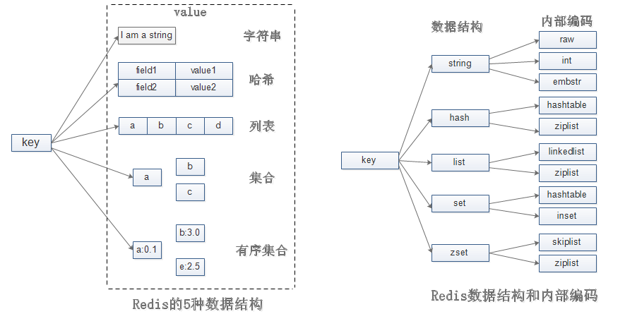

# Redis

## Redis简介(了解)

### 关于NoSQL

NoSQL的全称是Not only SQL，在过去的几年中，NoSQL数据库一度成为高并发、海量数据存储解决方案的代名词。

- **BerkeleyDB**是一种极为流行的开源嵌入式数据库，在更多情况下可用于存储引擎，比如BerkeleyDB在被Oracle收购之前曾作为MySQL的存储引擎，由此可以预见，该产品拥有极好的并发伸缩性，支持事务及嵌套事务，海量数据存储等重要特征，在用于存储实时数据方面具有极高的可用价值。然而需要指出的是，该产品的Licence为GPL，这就意味着它并不是在所有情况下都是免费使用的。
- 对**MongoDB**的定义为Oriented­Document数据库服务器，和BerkeleyDB不同的是该数据库可以像其他关系型数据库服务器那样独立的运行并提供相关的数据服务。从该产品的官方文档中我们可以获悉，MongoDB主要适用于高并发的论坛或博客网站，这些网站具有的主要特征是并发访问量高、多读少写、数据量大、逻辑关系简单，以及文档数据作为主要数据源等。和BerkeleyDB一样，该产品的License同为GPL。
- **Redis**，典型的NoSQL数据库服务器，和BerkeleyDB相比，它可以作为服务程序独立运行于自己的服务器主机。在很多时候，人们只是将Redis视为Key/Value数据库服务器，然而事实并非如此，在目前的版本中，Redis除了Key/Value之外还支持List、Set、Hash和Ordered Set等数据结构，因此它的用途也更为宽泛。和以上两种产品不同的是，Redis的License是Apache License，就目前而言，它是完全免费。
- **memcached**，数据缓存服务器。它们之间的最大区别，memcached只是提供了数据缓存服务，一旦服务器宕机，之前在内存中缓存的数据也将全部消失，因此可以看出memcached没有提供任何形式的数据持久化功能，而Redis则提供了这样的功能。再有就是Redis提供了更为丰富的数据存储结构，如Hash和Set。至于它们的相同点，主要有两个，一是完全免费，再有就是它们的提供的命令形式极为接近。  

### Redis的优势

- 和其他NoSQL产品相比，Redis的易用性极高，因此对于那些有类似产品使用经验的开发者来说，一两天，甚至是几个小时之后就可以利用Redis来搭建自己的平台了。
- 在解决了很多通用性问题的同时，也为一些个性化问题提供了相关的解决方案，如索引引擎、统计排名、消息队列服务等。  

### 和关系型数据库的比较

在目前版本的Redis中，提供了对五种不同数据类型的支持，其中只有String类型可以被视为Key-­Value结构，而其他的数据类型均有适用于各自特征的应用场景。

相比于关系型数据库，由于其存储结构相对简单，因此Redis并不能对复杂的逻辑关系提供很好的支持，然而在适用于Redis的场景中，我们却可以由此而获得效率上的显著提升。即便如此，Redis还是为我们提供了一些数据库应该具有的基础概念，如：在同一连接中可以选择打开不同的数据库，然而不同的是，Redis中的数据库是通过数字来进行命名的，缺省情况下打开的数据库为0。如果程序在运行过程中打算切换数据库，可以使用Redis的select命令来打开其他数据库，如select 1，如果此后还想再切换回缺省数据库，只需执行select 0即可。  

在数据存储方面，Redis遵循了现有NoSQL数据库的主流思想，即Key作为数据检索的唯一标识，我们可以将其简单的理解为关系型数据库中索引的键，而Value则作为数据存储的主要对象，其中每一个Value都有一个Key与之关联，这就好比索引中物理数据在数据表中存储的位置。在Redis中，Value将被视为二进制字节流用于存储任何格式的数据，如Json、XML和序列化对象的字节流等，因此我们也可以将其想象为关系型数据库中的BLOB类型字段。由此可见，在进行数据查询时，我们只能基于Key作为我们查询的条件，当然我们也可以应用Redis中提供的一些技巧将Value作为其他数据的Key。  

### 如何持久化内存数据  

缺省情况下，Redis会参照当前数据库中数据被修改的数量，在达到一定的阈值后会将数据库的快照存储到磁盘上，这一点我们可以通过配置文件来设定该阈值。通常情况下，我们也可以将Redis设定为定时保存。如当有1000个以上的键数据被修改时，Redis将每隔60秒进行一次数据持久化操作。缺省设置为，如果有9个或9个以下数据修改时，Redis将每15分钟持久化一次。

从上面提到的方案中可以看出，如果采用该方式，Redis的运行效率将会是非常高效的，每当有新的数据修改发生时，仅仅是内存中的缓存数据发生改变，而这样的改变并不会被立即持久化到磁盘上，从而在绝大多数的修改操作中避免了磁盘IO的发生。然而事情往往是存在其两面性的，在该方法中我们确实得到了效率上的提升，但是却失去了数据可靠性。如果在内存快照被持久化到磁盘之前，Redis所在的服务器出现宕机，那么这些未写入到磁盘的已修改数据都将丢失。为了保证数据的高可靠性，Redis还提供了另外一种数据持久化机制­­Append模式。如果Redis服务器被配置为该方式，那么每当有数据修改发生时，都会被立即持久化到磁盘。  

## 安装Redis  

### 安装  

**步骤：**

1. 解压redis­3.2.8.tar.gz  

   ```sh
   cd ~/software
   tar -zxf redis-3.2.8.tar.gz
   ```

2. 编译  

   ```sh
   cd redis-3.2.8
   make
   ```

3. 安装  

   ```sh
   mkdir ~/software/redis-bin
   make install PREFIX=~/software/redis-bin/ #PREFIX选项用来指定安装的位置
   ```

4. 启动redis  

   ```sh
   cd ~/software/redis-bin/bin/
   ./redis-server #使用默认配置文件启动，默认配置文件所在目录redis-3.2.8/redis.conf
   或 
   cp ~/software/redis-3.2.8/redis.conf myredis.conf #复制默认配置文件到当前目录，并改名
   ./redis-server myredis.conf #使用指定的配置文件启动
   ```

   补充：可以将~/software/redis­bin/bin/添加到PATH变量中，便于执行命令  

   ```sh
   vi ~/.bashrc
   	export PATH=$PATH:/Users/wangbo/software/redis-bin/bin
   	
   source ~/.bashrc
   ```

5. 连接redis  

   ```sh
   ./redis-cli #默认连接本机的6379端口(redis默认使用的端口号)
   或 
   ./redis-cli -h IP地址 -p 端口号 #连接指定主机、指定端口的redis，如./redis-cli -h localhost -p 6379
   ```

### 关闭  

两种方式

- 方式1：在服务器窗口中按 Ctrl+C
- 方式2：在客户端连接后输入 shutdown 或 直接输入 redis-­cli shutdown

查看redis进程  

```sh
ps aux | grep redis #查看redis的进程信息
或 
lsof -i:6379 #查看6379端口的进程信息
```

### 配置

编辑配置文件：  

```sh
$ vi myredis.conf
    daemonize yes #配置为守护进程，后台启动
    
    port 6379 #修改监听端口
    
    #让redis支持远程访问，默认只允许本地访问
    #bind 127.0.0.1 #注释掉该行，允许所有主机访问redis
    
    protected-mode no #关闭保护模式
    
    requirepass itany #配置redis密码，使用时需要输入:auth itany进行认证，认证后才能操作redis
```

## Redis数据类型

### 简介

Redis数据就是以key­-value形式来存储的，key只能是字符串类型，value可以是以下八种类型。

1. 字符串
2. 列表list
3. 无序集合set
4. 有序集合set(Sorted­-Sets)
5. 散列hash
6. 基数统计HyperLogLog    #2.9新增
7. 地理地图GEO    #3.2新增
8. 流Stream   #5.0新增

### String类型  

#### 简介

字符串类型是Redis中最为基础的数据存储类型，它在Redis中是**二进制安全**的，这便意味着该类型可以接受任何格式的数据，如JPEG图像数据或Json对象描述信息等。在Redis中字符串类型的Value最多可以容纳的数据长度是512M。  

参考笔记进制和编码中二进制安全详解

#### 内部编码

type命令实际返回的就是当前键的数据结构类型，它们分别是：string（字符串）、hash（哈希）、list（列表）、set（集合）、zset（有序集合），但这些只是Redis对外的数据结构。实际上每种数据结构都有自己底层的内部编码实现，而且是多种实现，这样Redis会在合适的场景选择合适的内部编码。内部编码即是外部数据结构的内部实现，也就是redis底层的内部数据结构。



我们可以通过object encoding命令查询内部编码，如：

```sh
>set  key  123
>object encoding key
“int”
```


参考：[Redis的五种数据结构的内部编码](https://www.cnblogs.com/yangmingxianshen/p/8054094.html)

#### 操作  

- `set/get/append/strlen`  

  设置/获取

  ```sh
  $ redis-cli
  
  127.0.0.1:6379> select 0 #切换到第1个数据库，默认共有16个数据库，索引从0开始
  OK
  
  127.0.0.1:6379> keys * #显示所有的键key
  (empty list or set)
  
  127.0.0.1:6379> set name tom #设置键
  OK
  
  127.0.0.1:6379> get name #获取键对应的值
  "tom"
  
  127.0.0.1:6379> exists mykey #判断该键是否存在，存在返回1，不存在返回0
  (integer) 0
  
  127.0.0.1:6379> append mykey "hello" #如果该键不存在，则创建，返回当前value的长度
  (integer) 5
  
  127.0.0.1:6379> append mykey " world" #如果该键已经存在，则追加，返回追加后value的长度
  (integer) 11
  
  127.0.0.1:6379> get mykey #获取mykey的值
  "hello world"
  
  127.0.0.1:6379> strlen mykey #获取mykey的长度
  (integer) 11
  
  #EX和PX表示失效时间，单位为秒和毫秒，两者不能同时使用；NX表示数据库中不存在时才能设置,XX表示存在时才能设置
  127.0.0.1:6379> set mykey "this is test" EX 5 NX
  OK
  
  127.0.0.1:6379> get mykey
  "this is test"
  ```

  注：命令不区分大小写，但key和value区分大小写  

- `incr/decr/incrby/decrby  `

  ```sh
  127.0.0.1:6379> flushdb #清空数据库
  OK
  
  127.0.0.1:6379> set mykey 20
  OK
  
  127.0.0.1:6379> incr mykey #递增1
  (integer) 21
  
  127.0.0.1:6379> decr mykey #递减1
  (integer) 20
  
  127.0.0.1:6379> del mykey #删除该键
  (integer) 1
  
  127.0.0.1:6379> decr mykey
  (integer) -1
  
  127.0.0.1:6379> del mykey
  (integer) 1
  
  127.0.0.1:6379> INCR mykey
  (integer) 1
  
  127.0.0.1:6379> set mykey 'hello' #将该键的Value设置为不能转换为整型的普通字符串
  OK
  
  127.0.0.1:6379> incr mykey #在该键上再次执行递增操作时，Redis将报告错误信息
  (error) ERR value is not an integer or out of range
  
  127.0.0.1:6379> set mykey 10
  OK
  
  127.0.0.1:6379> incrby mykey 5 #递增5，即步长
  (integer) 15
  
  127.0.0.1:6379> decrby mykey 10 #递减10
  (integer) 5
  ```

- `getset/setex/setnx  `

  ```sh
  # getset 获取的同时并设置新的值
  127.0.0.1:6379> incr mycount #将计数器的值原子性的递增1
  (integer) 1
  
  127.0.0.1:6379> getset mycount 666 #在获取计数器原有值的同时，并将其设置为新值
  "1"
  
  127.0.0.1:6379> get mycount
  "666"
  
  # setex 设置过期时间
  127.0.0.1:6379> setex mykey 10 "hello" #设置指定Key的过期时间为10秒，等同于set mykey hello ex 10
  OK
  
  127.0.0.1:6379> ttl mykey #查看指定Key的过期时间(秒数)
  (integer) 8
  
  # setnx 当key不存在时才能设置
  127.0.0.1:6379> del mykey
  (integer) 0
  
  127.0.0.1:6379> setnx mykey "aaa" #key不存在，可以设置，等同于set mykey aaa nx
  (integer) 1
  
  127.0.0.1:6379> setnx mykey "bbb" #key存在，不能设置
  (integer) 0
  
  127.0.0.1:6379> get mykey
  "aaa"
  ```

- `setrange/getrange` 设置/获取指定索引位置的字符

  ```sh
  127.0.0.1:6379> set mykey "hello world"
  OK
  
  127.0.0.1:6379> get mykey
  "hello world"
  
  127.0.0.1:6379> setrange mykey 6 dd #从索引为6的位置开始替换(索引从0开始)
  (integer) 11
  
  127.0.0.1:6379> get mykey
  "hello ddrld"
  
  127.0.0.1:6379> setrange mykey 20 dd #超过的长度使用0代替
  (integer) 22
  
  127.0.0.1:6379> get mykey
  "hello ddrld\x00\x00\x00\x00\x00\x00\x00\x00\x00dd"
  
  127.0.0.1:6379> getrange mykey 3 12 #获取索引为[3,12]之间的内容
  "lo ddrld\x00\x00"
  ```

- `setbit/getbit` 设置/获取指定位的BIT值，应用场景：考勤打卡

  ```sh
  127.0.0.1:6379> del mykey
  (integer) 1
  
  127.0.0.1:6379> setbit mykey 7 1 #设置从0开始计算的第七位BIT值为1，返回原有BIT值0
  (integer) 0
  
  127.0.0.1:6379> get mykey #获取设置的结果，二进制的0000 0001的十六进制值为0x01
  "\x01"
  
  127.0.0.1:6379> setbit mykey 6 1 #设置从0开始计算的第六位BIT值为1，返回原有BIT值0
  (integer) 0
  
  127.0.0.1:6379> get mykey #获取设置的结果，二进制的0000 0011的十六进制值为0x03
  "\x03"
  
  127.0.0.1:6379> getbit mykey 6 #返回了指定Offset的BIT值
  (integer) 1
  
  127.0.0.1:6379> getbit mykey 10 #如果offset已经超出了value的长度，则返回0
  (integer) 0
  ```

- `mset/mget/msetnx`

  ```sh
  127.0.0.1:6379> mset key1 "hello" key2 "world" #批量设置了key1和key2两个键。
  OK
  
  127.0.0.1:6379> mget key1 key2 #批量获取了key1和key2两个键的值。
  1) "hello"
  2) "world"
  
  #批量设置了key3和key4两个键，因为之前他们并不存在，所以该命令执行成功并返回1
  127.0.0.1:6379> msetnx key3 "itany" key4 "liu"
  (integer) 1
  
  127.0.0.1:6379> mget key3 key4
  1) "itany"
  2) "liu"
  
  #批量设置了key3和key5两个键，但是key3已经存在，所以该命令执行失败并返回0
  127.0.0.1:6379> msetnx key3 "hello" key5 "world"
  (integer) 0
  
  #批量获取key3和key5，由于key5没有设置成功，所以返回nil
  127.0.0.1:6379> mget key3 key5
  1) "itany"
  2) (nil)
  ```

### List类型

#### 概述

在Redis中，List类型是**按照插入顺序排序的字符串链表**。和数据结构中的普通链表一样，我们可以在其头部(left)和尾部(right)添加新的元素。在插入时，如果该键并不存在，Redis将为该键创建一个新的链表。与此相反，如果链表中所有的元素均被移除，那么该键也将会被从数据库中删除。List中可以包含的最大元素数量是
4294967295。

从元素插入和删除的效率视角来看，如果我们是在链表的两头插入或删除元素，这将会是非常高效的操作，即使链表中已经存储了百万条记录，该操作也可以在常量时间内完成。然而需要说明的是，如果元素插入或删除操作是作用于链表中间，那将会是非常低效的。  

#### 操作

- `lpush/lpushx/lrange`  

  左插入/键存在再左插入/左查看

  ```sh
  127.0.0.1:6379> flushdb
  OK
  
  #创建键mykey及与其关联的List，然后将参数中的values从左到右依次插入，头部插入
  127.0.0.1:6379> lpush mykey a b c d
  (integer) 4
  
  #获取从位置0开始到位置2结束的3个元素
  127.0.0.1:6379> lrange mykey 0 2
  1) "d"
  2) "c"
  3) "b"
  
  #获取链表中的全部元素，其中0表示第一个元素，-1表示最后一个元素
  127.0.0.1:6379> lrange mykey 0 -1
  1) "d"
  2) "c"
  3) "b"
  4) "a"
  
  #获取从倒数第3个到倒数第2个的元素
  127.0.0.1:6379> lrange mykey -3 -2
  1) "c"
  2) "b"
  
  #lpushx表示键存在时才能插入，mykey2键此时并不存在，因此该命令将不会进行任何操作，其返回值为0
  127.0.0.1:6379> lpushx mykey2 e
  (integer) 0
  
  #可以看到mykey2没有关联任何List Value
  127.0.0.1:6379> lrange mykey2 0 -1
  (empty list or set)
  
  #mykey键此时已经存在，所以该命令插入成功，并返回链表中当前元素的数量
  127.0.0.1:6379> lpushx mykey e
  (integer) 5
  
  #获取该键的List中的第一个元素
  127.0.0.1:6379> lrange mykey 0 0
  1) "e"
  ```

- `lpop/llen`  

  ```sh
  127.0.0.1:6379> flushdb
  OK
  
  127.0.0.1:6379> lpush mykey a b c d
  (integer) 4
  
  #取出链表头部的元素，该元素在链表中就已经不存在了
  127.0.0.1:6379> lpop mykey
  "d"
  
  127.0.0.1:6379> lpop mykey
  "c"
  
  #在执行lpop命令两次后，链表头部的两个元素已经被弹出，此时链表中元素的数量是2
  127.0.0.1:6379> llen mykey
  (integer) 2
  ```

- `lrem/lindex/lset/ltrim`  

  ```sh
  127.0.0.1:6379> flushdb
  OK
  
  #准备测试数据
  127.0.0.1:6379> lpush mykey a b c d a c
  (integer) 6
  
  #从头部(left)向尾部(right)操作链表，删除2个值等于a的元素，返回值为实际删除的数量
  127.0.0.1:6379> lrem mykey 2 a
  (integer) 2
  
  #查看删除后链表中的全部元素
  127.0.0.1:6379> lrange mykey 0 -1
  1) "c"
  2) "d"
  3) "c"
  4) "b"
  
  #获取索引值为1(头部的第二个元素)的元素值
  127.0.0.1:6379> lindex mykey 1
  "d"
  
  #将索引值为1(头部的第二个元素)的元素值设置为新值e
  127.0.0.1:6379> lset mykey 1 e
  OK
  
  #查看是否设置成功
  127.0.0.1:6379> lindex mykey 1
  "e"
  
  #索引值6超过了链表中元素的数量，该命令返回nil
  127.0.0.1:6379> lindex mykey 6
  (nil)
  
  #设置的索引值6超过了链表中元素的数量，设置失败，该命令返回错误信息。
  127.0.0.1:6379> lset mykey 6 h
  (error) ERR index out of range
  
  #仅保留索引值0到2之间的3个元素，注意第0个和第2个元素均被保留。
  127.0.0.1:6379> ltrim mykey 0 2
  OK
  
  #查看trim后的结果
  127.0.0.1:6379> lrange mykey 0 -1
  1) "c"
  2) "e"
  3) "c"
  ```

- `linsert`

  ```sh
  127.0.0.1:6379> del mykey
  (integer) 1
  
  #准备测试数据
  127.0.0.1:6379> lpush mykey a b c d e
  (integer) 5
  
  #在a的前面插入新元素a1
  127.0.0.1:6379> linsert mykey before a a1
  (integer) 6
  
  #查看是否插入成功，从结果看已经插入
  127.0.0.1:6379> lrange mykey 0 -1
  1) "e"
  2) "d"
  3) "c"
  4) "b"
  5) "a1"
  6) "a"
  
  #在e的后面插入新元素e2，从返回结果看已经插入成功
  127.0.0.1:6379> linsert mykey after e e2
  (integer) 7
  
  #再次查看是否插入成功
  127.0.0.1:6379> lrange mykey 0 -1
  1) "e"
  2) "e2"
  3) "d"
  4) "c"
  5) "b"
  6) "a1"
  7) "a"
  
  #在不存在的元素之前或之后插入新元素，该命令操作失败，并返回-1
  127.0.0.1:6379> linsert mykey after k a
  (integer) -1
  
  #为不存在的Key插入新元素，该命令操作失败，返回0
  127.0.0.1:6379> linsert mykey1 after a a2
  (integer) 0
  ```

- `rpush/rpushx/rpop/rpoplpush`

  右插入/键存在再右插入/

  ```sh
  127.0.0.1:6379> del mykey
  (integer) 1
  
  #从链表的尾部插入参数中给出的values，插入顺序是从左到右依次插入
  127.0.0.1:6379> rpush mykey a b c d
  (integer) 4
  
  #查看链表中的元素，注意元素的顺序
  127.0.0.1:6379> lrange mykey 0 -1
  1) "a"
  2) "b"
  3) "c"
  4) "d"
  
  #该键已经存在并且包含4个元素，rpushx命令将执行成功，并将元素e插入到链表的尾部。
  127.0.0.1:6379> rpushx mykey e
  (integer) 5
  
  #由于mykey2键并不存在，因此该命令不会插入数据，其返回值为0。
  127.0.0.1:6379> rpushx mykey2 e
  (integer) 0
  
  #查看链表中所有的元素
  127.0.0.1:6379> lrange mykey 0 -1
  1) "a"
  2) "b"
  3) "c"
  4) "d"
  5) "e"
  
  #从尾部(right)弹出元素，即取出元素
  127.0.0.1:6379> rpop mykey
  "e"
  
  #查看链表中所有的元素
  127.0.0.1:6379> lrange mykey 0 -1
  1) "a"
  2) "b"
  3) "c"
  4) "d"
  
  #创建mykey2
  127.0.0.1:6379> lpush mykey2 m n
  (integer) 2
  
  #将mykey的尾部元素弹出，然后插入到mykey2的头部(原子性的完成这两步操作)
  127.0.0.1:6379> rpoplpush mykey mykey2
  "d"
  
  #通过lrange命令查看mykey在弹出尾部元素后的结果
  127.0.0.1:6379> lrange mykey 0 -1
  1) "a"
  2) "b"
  3) "c"
  
  #通过lrange命令查看mykey2在插入元素后的结果
  127.0.0.1:6379> lrange mykey2 0 -1
  1) "d"
  2) "n"
  3) "m"
  127.0.0.1:6379>
  
  #将source和destination设为同一键，将mykey中的尾部元素移到其头部
  127.0.0.1:6379> rpoplpush mykey mykey
  "c"
  
  #查看结果
  127.0.0.1:6379> lrange mykey 0 -1
  1) "c"
  2) "a"
  3) "b"
  ```

### Set类型

#### 概述

在Redis中，我们可以将Set类型看作为没有排序的字符集合，也可以在该类型的数据值上执行添加、删除或判断某一元素是否存在等操作。Set可包含的最大元素数量是4294967295。

和List类型不同的是，Set集合中不允许出现重复的元素，这一点和Java中的set容器是完全相同的。换句话说，如果多次添加相同元素，Set中将仅保留该元素的一份拷贝。

和List类型相比，Set类型在功能上还存在着一个非常重要的特性，即在服务器端完成多个Sets之间的聚合计算操作，如unions并、intersections交和differences差。由于这些操作均在服务端完成，因此效率极高，而且也节省了大量的网络IO开销。  

#### 操作

- `sadd/smembers/sismember/scard`  

  添加/查看/

  ```sh
  #由于该键myset之前并不存在，因此参数中的三个成员都被正常插入
  127.0.0.1:6379> sadd myset a b c
  (integer) 3
  
  #查看集合中的元素，从结果可以，输出的顺序和插入顺序无关(无序的)
  127.0.0.1:6379> smembers myset
  1) "a"
  2) "c"
  3) "b"
  
  #由于参数中的a在myset中已经存在，因此本次操作仅仅插入了d和e两个新成员（不允许重复）
  127.0.0.1:6379> sadd myset a d e
  (integer) 2
  
  #查看插入的结果
  127.0.0.1:6379> smembers myset
  1) "a"
  2) "c"
  3) "d"
  4) "b"
  5) "e"
  
  #判断a是否已经存在，返回值为1表示存在
  127.0.0.1:6379> sismember myset a
  (integer) 1
  
  #判断f是否已经存在，返回值为0表示不存在
  127.0.0.1:6379> sismember myset f
  (integer) 0
  
  #获取集合中元素的数量
  127.0.0.1:6379> scard myset
  (integer) 5
  ```

- `srandmember/spop/srem/smove`

  ```sh
  127.0.0.1:6379> del myset
  (integer) 1
  
  #准备测试数据
  127.0.0.1:6379> sadd myset a b c d
  (integer) 4
  
  #查看集合中的元素
  127.0.0.1:6379> smembers myset
  1) "c"
  2) "d"
  3) "a"
  4) "b"
  
  #随机返回一个成员，成员还在集合中
  127.0.0.1:6379> srandmember myset
  "c"
  
  #取出一个成员，成员会从集合中删除
  127.0.0.1:6379> spop myset
  "b"
  
  #查看移出后Set的成员信息
  127.0.0.1:6379> smembers myset
  1) "c"
  2) "d"
  3) "a"
  
  #从Set中移出a、d和f三个成员，其中f并不存在，因此只有a和d两个成员被移出，返回为2
  127.0.0.1:6379> srem myset a d f
  (integer) 2
  
  #查看移出后的输出结果
  127.0.0.1:6379> smembers myset
  1) "c"
  127.0.0.1:6379> del myset
  (integer) 1
  
  #为后面的smove命令准备数据
  127.0.0.1:6379> sadd myset a b
  (integer) 2
  127.0.0.1:6379> sadd myset2 c d
  (integer) 2
  
  #将a从myset移到myset2，从结果可以看出移动成功
  127.0.0.1:6379> smove myset myset2 a
  (integer) 1
  
  #再次将a从myset移到myset2，由于此时a已经不是myset的成员了，因此移动失败并返回0。
  127.0.0.1:6379> smove myset myset2 a
  (integer) 0
  
  #分别查看myset和myset2的成员，确认移动是否真的成功。
  127.0.0.1:6379> smembers myset
  1) "b"
  127.0.0.1:6379> smembers myset2
  1) "c"
  2) "d"
  3) "a"
  ```

- `sdiff/sdiffstore/sinter/sinterstore/sunion/sunionstore`  

  差异比较，以第一个为基准逐渐减少/

  差异比较存储/

  交集/

  交集存储/

  并集/

  并集存储

  ```sh
  127.0.0.1:6379> flushdb
  OK
  
  #准备测试数据
  127.0.0.1:6379> sadd myset a b c d
  (integer) 4
  127.0.0.1:6379> sadd myset2 c
  (integer) 1
  127.0.0.1:6379> sadd myset3 a c e
  (integer) 3
  
  #获取多个集合之间的不同成员，要注意匹配的规则
  #先将myset和myset2进行比较，a、b和d三个成员是两者之间的差异成员，然后再用这个结果继续和
  myset3进行差异比较，b和d是myset3不存在的成员
  127.0.0.1:6379> sdiff myset myset2 myset3
  1) "d"
  2) "b"
  127.0.0.1:6379> sdiff myset3 myset2 myset
  1) "e"
  
  #将3个集合的差异成员存储到与diffkey关联的Set中，并返回插入的成员数量
  127.0.0.1:6379> sdiffstore diffkey myset myset2 myset3
  (integer) 2
  
  #查看一下sdiffstore的操作结果
  127.0.0.1:6379> smembers diffkey
  1) "d"
  2) "b"
  
  #获取多个集合之间的交集，这三个Set的成员交集只有c
  127.0.0.1:6379> sinter myset myset2 myset3
  1) "c"
  
  #将3个集合中的交集成员存储到与interkey关联的Set中，并返回交集成员的数量
  127.0.0.1:6379> sinterstore interkey myset myset2 myset3
  (integer) 1
  
  #查看一下sinterstore的操作结果
  127.0.0.1:6379> smembers interkey
  1) "c"
  
  #获取多个集合之间的并集
  127.0.0.1:6379> sunion myset myset2 myset3
  1) "b"
  2) "c"
  3) "d"
  4) "e"
  5) "a"
  
  #将3个集合中成员的并集存储到unionkey关联的set中，并返回并集成员的数量
  127.0.0.1:6379> sunionstore unionkey myset myset2 myset3
  (integer) 5
  
  #查看一下sunionstore的操作结果
  127.0.0.1:6379> smembers unionkey
  1) "b"
  2) "c"
  3) "d"
  4) "e"
  5) "a"
  ```

#### 应用范围  

- 可以使用Redis的Set数据类型跟踪一些唯一性数据，比如访问某一博客的唯一IP地址信息。对于此场景，我们仅需在每次访问该博客时将访问者的IP存入Redis中，Set数据类型会自动保证IP地址的唯一性。
- 充分利用Set类型的服务端聚合操作方便、高效的特性，可以用于维护数据对象之间的关联关系。比如所有购买某一电子设备的客户ID被存储在一个指定的Set中，而购买另外一种电子产品的客户ID被存储在另外一个Set中，如果此时我们想获取有哪些客户同时购买了这两种商品时，Set的intersections命令就可以充分发挥它的方便和效率的优势了  

### Sorted­-Sets类型  

#### 概述

Sorted­-Sets和Sets类型极为相似，也称为Zset，它们都是字符串的集合，都不允许重复的成员出现在一个Set中。它们之间的主要差别是Sorted-­Sets中的每一个成员都会**有一个分数(score)与之关联**，Redis正是通过分数来**为集合中的成员进行从小到大的排序**（默认）。然而需要额外指出的是，尽管Sorted-­Sets中的成员必须是唯一的，但是分数(score)却是可以重复的。

在Sorted­-Set中添加、删除或更新一个成员都是非常快速的操作。由于Sorted-­Sets中的成员在集合中的位置是有序的，因此，即便是访问位于集合中部的成员也仍然是非常高效的。事实上，Redis所具有的这一特征在很多其它类型的数据库中是很难实现的，换句话说，在该点上要想达到和Redis同样的高效，在其它数据库中进行建模是非常困难的。  

#### 操作  

- `zadd/zrange/zcard/zrank/zcount/zrem/zscore/zincrby`  

  添加/
  
  查看/
  
  计数/
  
  获取索引，从0开始/
  
  分数计数/
  
  删除成员/
  
  获取分数/
  
  增加分数/
  
  ```sh
  #添加一个分数为1的成员
  127.0.0.1:6379> zadd myzset 1 "one"
  (integer) 1
  
  #添加两个分数分别是2和3的两个成员
  127.0.0.1:6379> zadd myzset 2 "two" 3 "three"
  (integer) 2
  
  #通过索引获取元素，0表示第一个成员，-1表示最后一个成员。WITHSCORES选项表示返回的结果中包含每个成员及其分数，否则只返回成员
  127.0.0.1:6379> zrange myzset 0 -1 WITHSCORES
  1) "one"
  2) "1"
  3) "two"
  4) "2"
  5) "three"
  6) "3"
  
  #获取myzset键中成员的数量
  127.0.0.1:6379> zcard myzset
  (integer) 3
  
  #获取成员one在集合中的索引，0表示第一个位置
  127.0.0.1:6379> zrank myzset one
  (integer) 0
  
  #成员four并不存在，因此返回nil
  127.0.0.1:6379> zrank myzset four
  (nil)
  
  #获取符合指定条件的成员数量，分数满足表达式1 <= score <= 2的成员的数量
  127.0.0.1:6379> zcount myzset 1 2
  (integer) 2
  
  #删除成员one和two，返回实际删除成员的数量
  127.0.0.1:6379> zrem myzset one two
(integer) 2
  
  #查看是否删除成功
  127.0.0.1:6379> zcard myzset
  (integer) 1
  
  #获取成员three的分数。返回值是字符串形式
  127.0.0.1:6379> zscore myzset three
  "3"
  
  #由于成员two已经被删除，所以该命令返回nil
  127.0.0.1:6379> zscore myzset two
  (nil)
  
  #将成员three的分数增加2，并返回该成员更新后的分数
  127.0.0.1:6379> zincrby myzset 2 three
  "5"
  
  #将成员three的分数增加-1，并返回该成员更新后的分数
  127.0.0.1:6379> zincrby myzset -1 three
  "4"
  
  #查看在更新了成员的分数后是否正确
  127.0.0.1:6379> zrange myzset 0 -1 withscores
  1) "three"
  2) "4"
  ```

- `zrangebyscore/zremrangebyscore/zremrangebyrank`  

  ```sh
  127.0.0.1:6379> del myzset
  (integer) 1
  127.0.0.1:6379> zadd myzset 1 one 2 two 3 three 4 four
  (integer) 4
  
  #通过分数获取元素，获取分数满足表达式1 <= score <= 2的成员
  127.0.0.1:6379> zrangebyscore myzset 1 2
  1) "one"
  2) "two"
  
  #-inf表示第一个成员，+inf表示最后一个成员，limit后面的参数用于限制返回成员的数量，
  #2表示从位置索引(0-based)等于2的成员开始，取后面3个成员，类似于MySQL中的limit
  127.0.0.1:6379> zrangebyscore myzset -inf +inf withscores limit 2 3
  1) "three"
  2) "3"
  3) "four"
  4) "4"
  
  #根据分数删除成员，删除分数满足表达式1 <= score <= 2的成员，并返回实际删除的数量
  127.0.0.1:6379> zremrangebyscore myzset 1 2
  (integer) 2
  
  #看出一下上面的删除是否成功
  127.0.0.1:6379> zrange myzset 0 -1
  1) "three"
  2) "four"
  
  #根据索引删除成员，删除索引满足表达式0 <= rank <= 1的成员
  127.0.0.1:6379> zremrangebyrank myzset 0 1
  (integer) 2
  
  #查看上一条命令是否删除成功
  127.0.0.1:6379> zcard myzset
  (integer) 0
  ```

- `zrevrange/zrevrangebyscore/zrevrank`  

  ```sh
  127.0.0.1:6379> del myzset
  (integer) 0
  127.0.0.1:6379> zadd myzset 1 one 2 two 3 three 4 four
  (integer) 4
  
  #按索引从高到低的方式获取成员
  127.0.0.1:6379> zrevrange myzset 0 -1 WITHSCORES
  1) "four"
  2) "4"
  3) "three"
  4) "3"
  5) "two"
  6) "2"
  7) "one"
  8) "1"
  
  #由于是从高到低的排序，所以位置等于0的是four，1是three，并以此类推
  127.0.0.1:6379> zrevrange myzset 1 3
  1) "three"
  2) "two"
  3) "one"
  
  #按索引从高到低的方式根据分数获取成员，分数满足表达式3 >= score >= 0的成员
  127.0.0.1:6379> zrevrangebyscore myzset 3 0
  1) "three"
  2) "two"
  3) "one"
  
  #limit选项的含义等同于zrangebyscore中的该选项，只是在计算位置时按照相反的顺序计算和获取
  127.0.0.1:6379> zrevrangebyscore myzset 4 0 limit 1 2
  1) "three"
  2) "two"
  
  #获取成员one在集合中的索引，由于是从高到低的排序，所以one的位置是3
  127.0.0.1:6379> zrevrank myzset one
  (integer) 3
  
  #由于是从高到低的排序，所以four的位置是0
  127.0.0.1:6379> zrevrank myzset four
  (integer) 0
  ```

#### 应用范围  

- 可以用于大型在线游戏的积分排行榜。每当玩家的分数发生变化时，可以执行ZADD命令更新玩家的分数，此后再通过ZRANGE命令获取积分TOP 10的用户信息。当然我们也可以利用ZRANK命令通过username来获取玩家的排行信息。最后我们将组合使用ZRANGE和ZRANK命令快速的获取和某个玩家积分相近的其他用户的信息。

- Sorted­Sets类型还可用于构建索引数据。  

### Hash(哈希)类型  

#### 概述  

可以将Redis中的Hash类型看成具有String Key和String Value的map容器。所以该类型非常适合于存储值对象的信息。如Username、Password和Age等。如果Hash中包含很少的字段，那么该类型的数据也将仅占用很少的磁盘空间。每一个Hash可以存储4294967295个键值对。  

#### 操作  

- `hset/hget/hlen/hexists/hdel/hsetnx`  

  设置 redis键 map键 map值/

  获取 redis键 map键/

  获取长度 redis键/

  /

  删除redis键 map键/

  

  

  ```sh
  #给键值为myhash的键设置字段为field1，值为itany
  127.0.0.1:6379> hset myhash field1 "itany"
  (integer) 1
  
  #获取键值为myhash，字段为field1的值
  127.0.0.1:6379> hget myhash field1
  "itany"
  
  #myhash键中不存在field2字段，因此返回nil
  127.0.0.1:6379> hget myhash field2
  (nil)
  
  #给myhash关联的Hashes值添加一个新的字段field2，其值为liu
  127.0.0.1:6379> hset myhash field2 "liu"
  (integer) 1
  
  #获取myhash键的字段数量
  127.0.0.1:6379> hlen myhash
  (integer) 2
  
  #判断myhash键中是否存在字段名为field1的字段，由于存在，返回值为1
  127.0.0.1:6379> hexists myhash field1
  (integer) 1
  
  #删除myhash键中字段名为field1的字段，删除成功返回1
  127.0.0.1:6379> hdel myhash field1
  (integer) 1
  
  #再次删除myhash键中字段名为field1的字段，由于上一条命令已经将其删除，因为没有删除，返回0
  127.0.0.1:6379> hdel myhash field1
  (integer) 0
  
  #通过hsetnx命令给myhash添加新字段field1，其值为itany，因为该字段已经被删除，所以该命令添加成功并返回1
  127.0.0.1:6379> hsetnx myhash field1 "itany"
  (integer) 1
  
  #由于myhash的field1字段已经通过上一条命令添加成功，因为本条命令不做任何操作后返回0
  127.0.0.1:6379> hsetnx myhash field1 "itany"
  (integer) 0
  ```

- `hincrby`  

  ```sh
  127.0.0.1:6379> del myhash
  (integer) 1
  
  #准备测试数据
  127.0.0.1:6379> hset myhash field 5
  (integer) 1
  
  #给myhash的field字段的值加1，返回加后的结果
  127.0.0.1:6379> hincrby myhash field 1
  (integer) 6
  
  #给myhash的field字段的值加-1，返回加后的结果
  127.0.0.1:6379> hincrby myhash field -1
  (integer) 5
  
  #给myhash的field字段的值加-10，返回加后的结果
  127.0.0.1:6379> hincrby myhash field -10
  (integer) -5
  ```

- `hmset/hmget/hgetall/hkeys/hvals`

  ```sh
  127.0.0.1:6379> del myhash
  (integer) 1
  
  #为该键myhash，一次性设置多个字段，分别是field1 = "hello", field2 = "world"
  127.0.0.1:6379> hmset myhash field1 "hello" field2 "world"
  OK
  
  #获取myhash键的多个字段，其中field3并不存在，因为在返回结果中与该字段对应的值为nil
  127.0.0.1:6379> hmget myhash field1 field2 field3
  1) "hello"
  2) "world"
  3) (nil)
  
  #返回myhash键的所有字段及其值，从结果中可以看出，他们是逐对列出的
  127.0.0.1:6379> hgetall myhash
  1) "field1"
  2) "hello"
  3) "field2"
  4) "world"
  
  #仅获取myhash键中所有字段的名字
  127.0.0.1:6379> hkeys myhash
  1) "field1"
  2) "field2"
  
  #仅获取myhash键中所有字段的值
  127.0.0.1:6379> hvals myhash
  1) "hello"
  2) "world"
  ```

## Key操作命令    

### 命令列表  

| 命令用法               | 解释                                                         |
| ---------------------- | ------------------------------------------------------------ |
| keys pattern           | 获取所有匹配pattern参数的Keys。需要说明的是，在我们的正常操作中应该尽量避免对该命令的调 用，因为对于大型数据库而言，该命令是非常耗时的，对Redis服务器的性能打击也是比较大的。 pattern支持glob-­style的通配符格式，如`*`表示任意一个或多个字符，`?`表示任意字符，`[abc]`表示方括号中任意一个字母。 |
| del key [key...]       | 从数据库删除中参数中指定的keys，如果指定键不存在，则直接忽略。 |
| exists key             | 判断指定键是否存在。                                         |
| move key db            | 将当前数据库中指定的键Key移动到参数中指定的数据库中。如果该Key在目标数据库中已经存在， 或者在当前数据库中并不存在，该命令将不做任何操作并返回0。 |
| rename key newkey      | 为指定的键重新命名，如果参数中的两个Keys的命令相同，或者是源Key不存在，该命令都会返 回相关的错误信息。如果newKey已经存在，则直接覆盖。 |
| renamenx key newkey    | 如果新值newKey不存在，才将参数中的原值修改为新值，否则不修改。其它条件和RENAME一致。 |
| persist key            | 如果Key存在过期时间，该命令会将其过期时间消除，使该Key不再有超时，而是可以持久化存储。 |
| expire key seconds     | 该命令为参数中指定的Key设定超时的秒数，在超过该时间后，Key被自动的删除。如果该Key在超时之前被修改，与该键关联的超时将被移除。 |
| expireat key timestamp | 该命令的逻辑功能和EXPIRE完全相同，唯一的差别是该命令指定的超时时间是绝对时间，而不是相 对时间。该时间参数是Unix timestamp格式的，即从1970年1月1日开始所流经的秒数。 |
| ttl key                | 获取该键所剩的超时描述。                                     |
| randomkey              | 从当前打开的数据库中随机的返回一个Key。                      |
| type key               | 获取与参数中指定键关联值的类型，该命令将以字符串的格式返回。 |

### 操作

- `keys/del/exists/move/rename/renamenx`  

  ```sh
  127.0.0.1:6379> flushdb
  OK
  
  #添加String类型的数据
  127.0.0.1:6379> set mykey 2
  OK
  
  #添加List类型的数据
  127.0.0.1:6379> lpush mylist a b c
  (integer) 3
  
  #添加Set类型的数据
  127.0.0.1:6379> sadd myset 1 2 3
  (integer) 3
  
  #添加Sorted-Set类型的数据
  127.0.0.1:6379> zadd myzset 1 "one" 2 "two"
  (integer) 2
  
  #添加Hash类型的数据
  127.0.0.1:6379> hset myhash username "tom"
  (integer) 1
  
  #根据参数中的模式，获取当前数据库中符合该模式的所有key，从输出可以看出，该命令在执行时并不区分与Key关联的Value类型
  127.0.0.1:6379> keys my*
  1) "myset"
  2) "mykey"
  3) "myzset"
  4) "myhash"
  5) "mylist"
  
  #删除了两个Keys
  127.0.0.1:6379> del mykey mylist
  (integer) 2
  
  #查看刚刚删除的Key是否还存在，从返回结果看，mykey确实已经删除了
  127.0.0.1:6379> exists mykey
  (integer) 0
  
  #查看一下没有删除的Key，以和上面的命令结果进行比较
  127.0.0.1:6379> exists myset
  (integer) 1
  
  #将当前数据库中的myset键移入到ID为1的数据库中
  127.0.0.1:6379> move myset 1
  (integer) 1
  
  #切换到ID为1的数据库
  127.0.0.1:6379> select 1
  OK
  
  #查看当前数据库中的所有key
  127.0.0.1:6379[1]> keys *
  1) "myset"
  
  #在重新打开ID为0的缺省数据库
  127.0.0.1:6379[1]> select 0
  OK
  
  #清空数据库
  127.0.0.1:6379> flushdb
  OK
  
  #准备新的测试数据
  127.0.0.1:6379> set mykey "hello"
  OK
  
  #将mykey改名为mykey1
  127.0.0.1:6379> rename mykey mykey1
  OK
  
  #由于mykey已经被重新命名，再次获取将返回nil
  127.0.0.1:6379> get mykey
  (nil)
  
  #通过新的键名获取
  127.0.0.1:6379> get mykey1
  "hello"
  
  #为renamenx准备测试key
  127.0.0.1:6379> set oldkey "hello"
  OK
  127.0.0.1:6379> set newkey "world"
  OK
  
  #当新名称不存在时才会执行。由于newkey已经存在，因此该命令未能成功执行
  127.0.0.1:6379> renamenx oldkey newkey
  (integer) 0
  
  #查看newkey的值，发现它并没有被renamenx覆盖
  127.0.0.1:6379> get newkey
  "world"
  ```

- `ttl/persist/expire/expireat`

  ```sh
  127.0.0.1:6379> flushdb 
  OK
  
  #准备测试数据，将该键的超时设置为100秒 
  127.0.0.1:6379> set mykey "hello" ex 100 
  OK
  
  #通过ttl命令查看还剩多少秒 
  127.0.0.1:6379> ttl mykey 
  (integer) 97
  
  #立刻执行persist命令，该存在超时的键变成持久化的键，即将该Key的超时去掉 
  127.0.0.1:6379> persist mykey 
  (integer) 1
  
  #ttl的返回值告诉我们，该键已经没有超时了 
  127.0.0.1:6379> ttl mykey 
  (integer) -1
  
  #为后面的expire命令准备数据 
  127.0.0.1:6379> del mykey 
  (integer) 1 
  127.0.0.1:6379> set mykey "hello" 
  OK
  
  #设置该键的超时被100秒 
  127.0.0.1:6379> expire mykey 100 
  (integer) 1
  
  #用ttl命令看当前还剩下多少秒，从结果中可以看出还剩下96秒 
  127.0.0.1:6379> ttl mykey 
  (integer) 96
  
  #重新更新该键的超时时间为20秒，从返回值可以看出该命令执行成功 
  127.0.0.1:6379> expire mykey 20 
  (integer) 1
  
  #再用ttl确认一下，从结果中可以看出被更新了 
  127.0.0.1:6379> ttl mykey 
  (integer) 17
  
  #立刻更新该键的值，以使其超时无效。 
  127.0.0.1:6379> set mykey "world" 
  OK
  
  #从ttl的结果可以看出，在上一条修改该键的命令执行后，该键的超时也无效了 
  127.0.0.1:6379> ttl mykey 
  (integer) -1
  ```

- `type/randomkey`

  ```sh
  127.0.0.1:6379> del mykey 
  (integer) 1
  
  #添加不同类型的测试数据 
  127.0.0.1:6379> set mykey 2 
  OK
  127.0.0.1:6379> lpush mylist a b c 
  (integer) 3 
  127.0.0.1:6379> sadd myset 1 2 3 
  (integer) 3 
  127.0.0.1:6379> zadd myzset 1 "one" 2 "two" 
  (integer) 2 
  127.0.0.1:6379> hset myhash username "tom" 
  (integer) 1
  
  #分别查看数据的类型 
  127.0.0.1:6379> type mykey 
  string 
  127.0.0.1:6379> type mylist 
  list 
  127.0.0.1:6379> type myset 
  set 
  127.0.0.1:6379> type myzset 
  zset 
  127.0.0.1:6379> type myhash 
  hash
  
  #返回数据库中的任意键
  127.0.0.1:6379> randomkey 
  "oldkey"
  
  #清空当前打开的数据库 
  127.0.0.1:6379> flushdb 
  OK
  
  #由于没有数据了，因此返回nil 
  127.0.0.1:6379> randomkey 
  (nil)
  ```


## 事务

### 概述

Redis作为NoSQL数据库也同样提供了事务机制。

- 通过`MULTI`命令开启一个事务，通过执行`EXEC/DISCARD`命令来提交/回滚该事务内的所有操作。
- 在事务中的所有命令都将会被串行化的顺序执行，事务执行期间，Redis不会再为其它客户端的请求提供任何服务，从而保证了事物中的所有命令被原子的执行。 

- 和关系型数据库中的事务相比，在Redis事务中如果有某一条命令执行失败，其后的命令仍然会被继续执行。

- 在事务提交之前，如果客户端与服务器之间出现通讯故障并导致网络断开，其后所有待执行的语句都将不会被服务器执行。然而如果网络中断事件是发生在客户端执行`EXEC`命令之后，那么该事务中的所有命令都会被服务器执行。
- *当使用Append­Only模式时，Redis会通过调用系统函数write将该事务内的所有写操作在本次调用中全部写入磁盘。然而如果在写入的过程中出现系统崩溃，如电源故障导致的宕机，那么此时也许只有部分数据被写入到磁盘，而另外一部分数据却已经丢失。Redis服务器会在重新启动时执行一系列必要的一致性检测，一旦发现类似问题，就会立即退出并给出相应的错误提示。此时，我们就要充分利用Redis工具包中提供的redis­check­aof工具，该工具可以帮助我们定位到数据不一致的错误，并将已经写入的部分数据进行回滚。修复之后我们就可以再次重新启动Redis服务器了。*

### 命令列表

| 命令    | 解释                                                         |
| ------- | ------------------------------------------------------------ |
| multi   | 用于标记事务的开始，其后执行的命令都将被存入命令队列，直到执行EXEC时，这些命令才会被原子的执行。 |
| exec    | 执行在一个事务内命令队列中的所有命令，同时将当前连接的状态恢复为正常状态，即非事务状态。如果在事务中执行了WATCH命令，那么只有当WATCH所监控的Keys没有被修改的前提下，EXEC命令才能执行事务队列中的所有命令，否则EXEC将放弃当前事务中的所有命令。 |
| discard | 回滚事务队列中的所有命令，同时再将当前连接的状态恢复为正常状态，即非事务状态。如果WATCH命令被使用，该命令将UNWATCH所有的Keys。 |

### 操作

```sh
1. 事务被正常执行
#在当前连接上启动一个新的事务 
127.0.0.1:6379> multi 
OK
#执行事务中的第一条命令，从该命令的返回结果可以看出，该命令并没有立即执行，而是存于事务的命令队列 
127.0.0.1:6379> incr t1 
QUEUED
#又执行一个新的命令，从结果可以看出，该命令也被存于事务的命令队列 
127.0.0.1:6379> incr t2 
QUEUED
#执行事务命令队列中的所有命令，从结果可以看出，队列中命令的结果得到返回 
127.0.0.1:6379> exec 
1) (integer) 1 
2) (integer) 1 
#只有当提交事务后，在其他连接中才能看到变化

2. 事务中存在失败的命令
#开启一个新的事务 
127.0.0.1:6379> multi 
OK
#设置键a的值为string类型的3 
127.0.0.1:6379> set a 3 
QUEUED
#从键a所关联的值的头部弹出元素，由于该值是字符串类型，而lpop命令仅能用于List类型，因此在执行exec命令时，该命令将会失败 
127.0.0.1:6379> lpop a 
QUEUED
#再次设置键a的值为字符串4 
127.0.0.1:6379> set a 4 
QUEUED
#获取键a的值，以便确认该值是否被事务中的第二个set命令设置成功 
127.0.0.1:6379> get a 
QUEUED
#从结果中可以看出，事务中的第二条命令lpop执行失败，而其后的set和get命令均执行成功，这一点是Redis的事务与关系型数据库中的事务之间最为重要的差别 
127.0.0.1:6379> exec 
1) OK 
2) (error) ERR Operation against a key holding the wrong kind of value 
3) OK 
4) "4"

3. 回滚事务 
#为键t2设置一个事务执行前的值 
127.0.0.1:6379> set t2 tt 
OK
#开启一个事务 
127.0.0.1:6379> multi
OK
#在事务内为该键设置一个新值 
127.0.0.1:6379> set t2 ttnew 
QUEUED
#放弃事务 
127.0.0.1:6379> discard 
OK
#查看键t2的值，从结果中可以看出该键的值仍为事务开始之前的值 
127.0.0.1:6379> get t2 
"tt"
```

## 主从复制Replication

### 概述

在Redis中配置Master­Slave模式非常简单，Redis中主从复制的特点和优势： 

- 同一个Master可以同步多个Slaves。 Slave同样可以接受其它Slaves的连接和同步请求，可以有效的分载Master的同步压力，所以可以将Redis的Replication架构视为图结构。 

- Master Server是以非阻塞的方式为Slaves提供服务，所以在Master­Slave同步期间，客户端仍然可以提交查询或修改请求。 

  Slave Server同样是以非阻塞的方式完成数据同步，在同步期间，如果有客户端提交查询请求，Redis则返回同步之前的数据。 

- 为了分载Master的读操作压力，Slave服务器可以为客户端提供只读操作的服务，写服务仍然必须由Master来完成。即便如此，系统的伸缩性还是得到了很大的提高。 

- Master可以将数据保存操作交给Slaves完成，从而避免了在Master中要有独立的进程来完成此操作。 

### 配置

**步骤：**

1. 同时启动两个Redis服务器，可以考虑在同一台机器上启动两个Redis服务器，分别监听不同的端口，如6379和6380 

   将配置文件拷贝两份，并修改端口号 

   启动服务器：

   ```sh
   $ redis-server 6379.conf #master主服务器 
   $ redis-server 6380.conf #slave从服务器
   ```

2. 连接slave服务器，并执行如下命令：

   ```sh
   $ redis-cli -p 6380 #连接从服务器，slave端口号为6380 
   127.0.0.1:6380> slaveof 127.0.0.1 6379 #配置主从关系，指定master的主机地址和端口号 
   OK
   ```

   上面的方式只是保证了在执行slaveof命令之后，redis*6380*成为了*redis*6379的slave，一旦服务(redis_6380)重新启动之后，他们之间的复制关系将终止。 

   如果希望长期保证这两个服务器之间的Replication关系，可以在redis_6380的配置文件中做如下修改：

   ```sh
   $ vi 6380.conf 
   slaveof 127.0.0.1 6379
   ```

   这样就可以保证Redis6380服务程序在每次启动后都会主动建立与Redis6379的Replication连接了。

## 持久化

### 概述

Redis提供的持久化方式： 

- RDB 

  该机制是指在指定的时间间隔内将内存中的数据集快照写入磁盘。 

- AOF 

  该机制将以日志的形式记录服务器所处理的每一个写操作，在Redis服务器启动之初会读取该文件来重新 构建数据库，以保证启动后数据库中的数据是完整的。 

### RDB

Redis Database：通过单文件的方式来持久化 

RDB是默认的持久化方式，默认存储在启动redis服务器时所在当前目录下的dump.rdb文件中，一般都会修改存储在一个固定的目录中 

编辑配置文件： 

```sh
$ vi myredis.conf 
dbfilename dump.rdb #持久化文件的名称 
#dir ./ #持久化文件的目录,默认为执行redis-server命令时所在的当前目录
dir /home/soft01/software/dump/ #修改存储位置为一个固定的目录
```

持久化的时机： 

- 在数据库关闭时会持久化（需要注意的是在数据库宕机时不会生成，数据可能会丢失） 

- 满足特定条件时会持久化，编辑配置文件： 

  ```sh
  $ vi myredis.conf 
  save 900 1 #在900秒内，只要有1个key发生变化，就会dump持久化 
  save 300 10 
  save 60 10000
  ```

优缺点：

- 缺点：可能会丢失数据 

- 优点：效率比较高

### AOF

Append Only File：通过操作日志的方式来持久化

编辑配置文件：

```sh
$ vi myredis.conf 
appendonly yes #开启aof模式的持久化 
appendfilename "appendonly.aof" #aof的持久化文件 
appendfsync everysec #每一秒进行一次持久化操作，可取值：always、everysec、no 
dir /home/soft01/software/dump/ #持久化文件的目录，与RDB相同
```

注：可以直接查看生成的appendonly.aof文件，可以认为是一个日志文件 

优缺点：

- 缺点：效率比较差 

- 优点：丢失数据量比较少

## Java访问Redis

### 使用Jedis 

Jedis是一个封装了redis的java客户端，集成了redis的一些命令操作，并提供了连接池管理功能 

**步骤：**

1. 添加依赖

   ```xml
   <dependency> 
       <groupId>redis.clients</groupId> 
       <artifactId>jedis</artifactId> 
       <version>2.9.0</version> 
   </dependency>
   ```

2. 基本用法 

   ```java
   
   ```

### 使用Spring Data Redis 

简称SDR，在Spring应用中读写Redis数据库更简单 

基于jedis 


## Redis和 Mysql数据一致性

**问题：**

- 如果删除了缓存Redis，还没有来得及写库MySQL，另一个线程就来读取，发现缓存为空，则去数据库中读取数据写入缓存，此时缓存中为脏数据。

- 如果先写了库，在删除缓存前，写库的线程宕机了，没有删除掉缓存，则也会出现数据不一致情况。

### 延时双删策略

在写库前后都进行redis.del(key)操作，并且设定合理的超时时间。具体步骤是：

1. 先删除缓存

2. 再写数据库

3. 休眠500毫秒（根据具体的业务时间来定）

4. 再次删除缓存。

​    **那么，这个500毫秒怎么确定的，具体该休眠多久呢？**

​    需要评估自己的项目的读数据业务逻辑的耗时。这么做的目的，就是确保读请求结束，写请求可以删除读请求造成的缓存脏数据。

​    当然，这种策略还要考虑 redis 和数据库主从同步的耗时。最后的写数据的休眠时间：则在读数据业务逻辑的耗时的基础上，加上几百ms即可。比如：休眠1秒。

参考：

[Redis 和 Mysql 数据库数据如何保持一致性](https://www.jianshu.com/p/2edbb48604bd)


