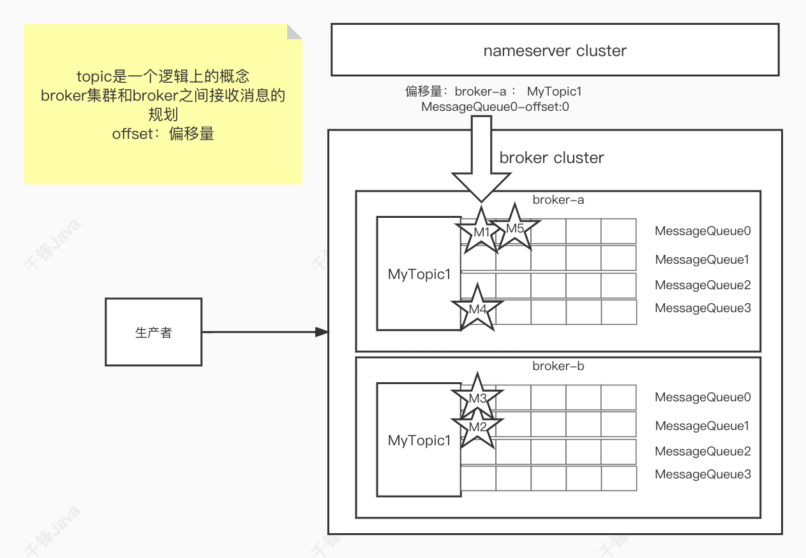
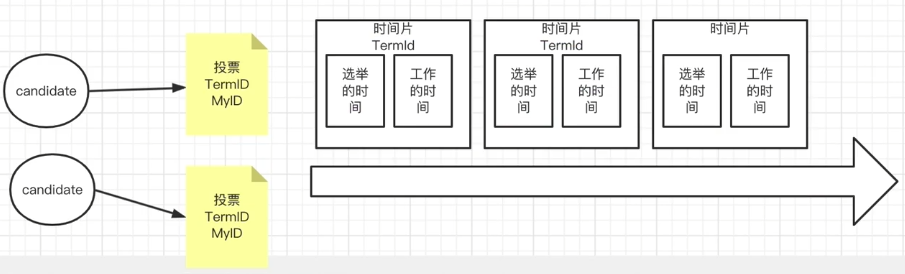
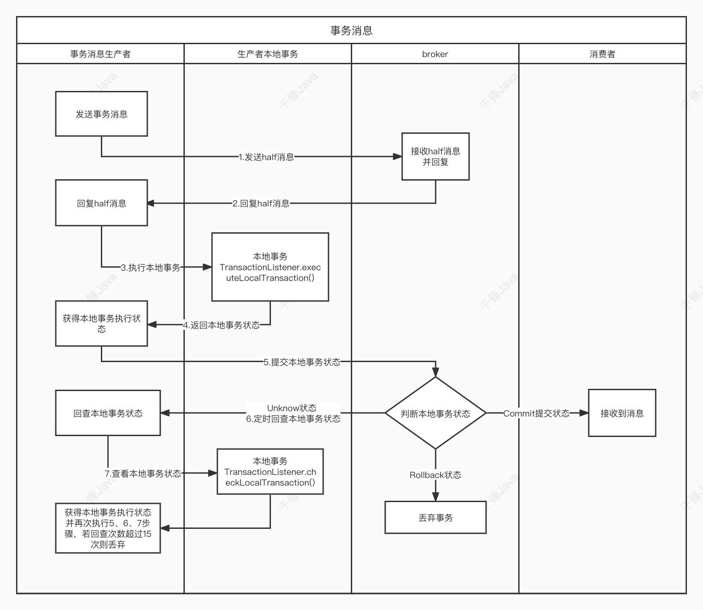
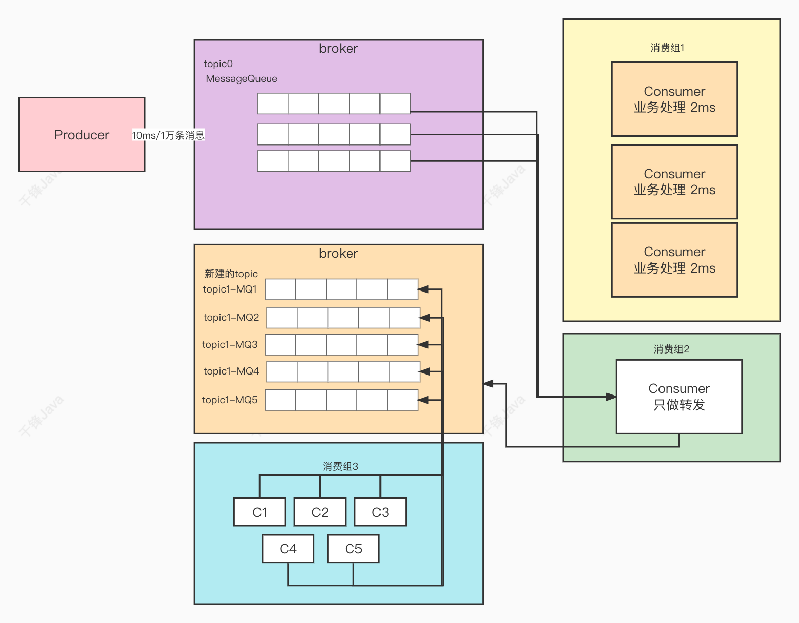
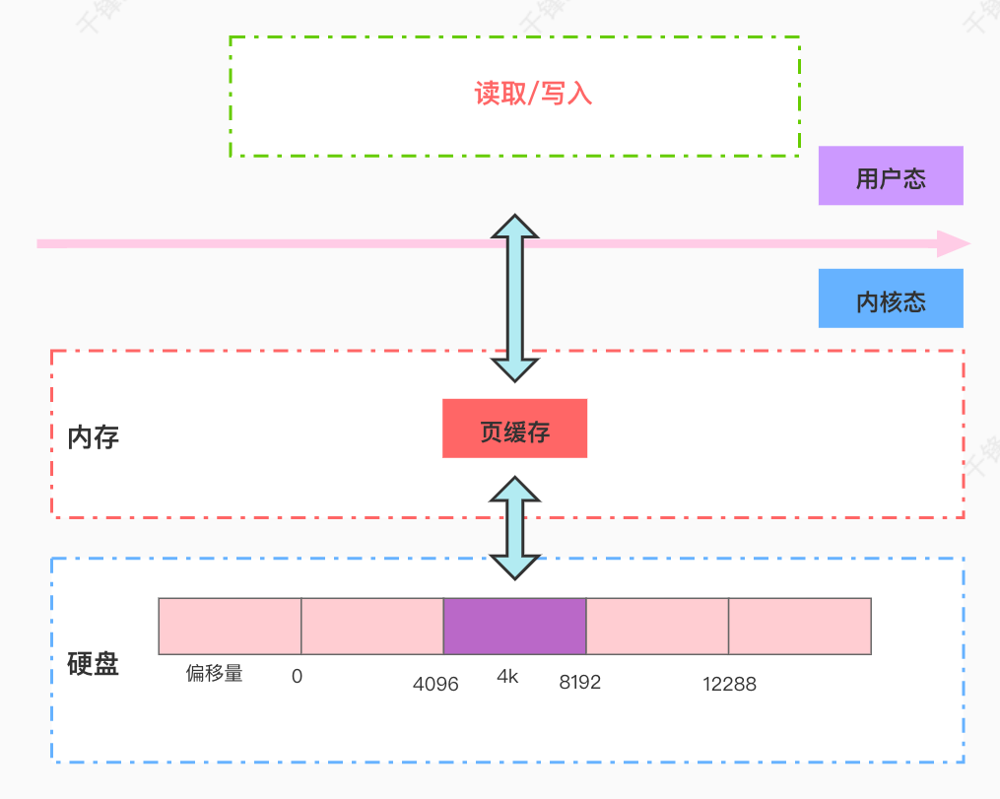
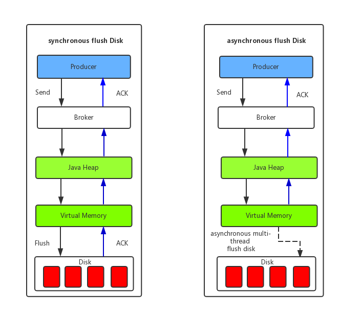

## 选型


| 特性对比         | RocketMQ                                                     | ActiveMQ                                             | RabbitMQ                                                 | Kafka                                                |
| :--------------- | :----------------------------------------------------------- | :--------------------------------------------------- | :------------------------------------------------------- | :--------------------------------------------------- |
| **单机吞吐量**   | **10万级**，高吞吐                                           | **万级**，相对较低                                   | **万级**，但优于ActiveMQ                                 | **10万级至百万级**，吞吐量最高                       |
| **消息可靠性**   | **高**，经阿里双十一考验，可配置接近0丢失                    | **一般**，高并发下有丢失风险                         | **非常高**，数据一致性和可靠性表现最佳                   | **高**，但为高吞吐可能在可靠性上有权衡               |
| **主要特点**     | 分布式、低延迟、支持**事务消息**、顺序消息                   | 老牌产品，与Java生态（如Spring）整合好，协议支持丰富 | **路由机制灵活**（Exchange），管理界面优秀，社区活跃     | 为**实时日志流和大数据**设计，吞吐量极高，扩展性好   |
| **典型应用场景** | 电商交易、金融支付等对**一致性和顺序性**要求高的**在线业务** | 中小型项目、传统企业应用，场景相对简单               | 需要复杂路由规则、企业级应用集成、对可靠性要求极高的业务 | 日志采集、流式数据处理、监控数据聚合等**大数据领域** |

- 追求极致的吞吐量，处理海量日志和数据流：Kafka 是业界标准
- 业务核心是在线交易（如订单系统），需要高可靠、低延迟和事务支持：RocketMQ 是更合适的选择 
- 需要灵活的消息路由规则，且团队希望有友好的管理工具和活跃社区：RabbitMQ 非常适合 
- 项目较为传统或简单，主要用于轻量级的异步解耦：可以考虑 ActiveMQ，但在新项目中其优势不明显 


| 消息队列     | 主要编程语言          | 所属公司/社区     | 关键语言特性影响                                             |
| :----------- | :-------------------- | :---------------- | :----------------------------------------------------------- |
| **RocketMQ** | **Java**              | 阿里巴巴 / Apache | 得益于Java生态，与Spring Cloud Alibaba等微服务框架整合性好，在国内互联网企业中被广泛使用且易于进行二次开发和定制。 |
| **ActiveMQ** | **Java**              | Apache            | 完全遵循JMS（Java Message Service）规范，是Java消息服务的标准实现，与Java EE/Spring等框架集成非常方便。 |
| **RabbitMQ** | **Erlang**            | Pivotal           | Erlang是一门为构建高并发、分布式和容错系统而设计的语言，这使得RabbitMQ天生就具备**极强的并发能力**和**很低的延迟**（微秒级）。 |
| **Kafka**    | **Scala** 和 **Java** | Apache / LinkedIn | Scala运行在JVM上，Kafka充分利用了JVM平台的成熟生态和高效性能，使其在**吞吐量**上达到了极高的水准，尤其适合大数据场景 。 |


## 架构

RocketMQ架构上主要分为四部分：

- Producer：消息发布的⻆⾊，⽀持分布式集群⽅式部署。生产者消息发送
- Consumer：消息消费的⻆⾊，⽀持分布式集群⽅式部署。支持推模式和拉模式，拉模式常用于回溯消息
- NameServer：NameServer是⼀个⾮常简单的Topic路由注册中⼼，其⻆⾊类似Dubbo中的zookeeper，⽀持Broker的动态注册与发现。
- BrokerServer：Broker主要负责消息的存储、投递和查询以及服务⾼可⽤保证


RocketMQ ⽹络部署特点：

- NameServer是⼀个⼏乎⽆状态节点，可集群部署，节点之间⽆任何信息同步。
- Broker部署相对复杂，Broker分为Master与Slave，⼀个Master可以对应多个Slave，但是⼀个Slave只能对应⼀个Master，Master与Slave 的对应关系通过指定相同的BrokerName，不同的BrokerId 来定义，BrokerId为0表示Master，⾮0表示Slave。Master也可以部署多个。每个Broker与NameServer集群中的所有节点建⽴⻓连接，定时注册Topic信息到所有NameServer。 注意：当前RocketMQ版本在部署架构上⽀持⼀Master多Slave，但只有BrokerId=1的从服务器才会参与消息的读负载。
- Producer与NameServer集群中的其中⼀个节点（随机选择）建⽴⻓连接，定期从NameServer获取Topic路由信息，并向提供Topic 服务的Master建⽴⻓连接，且定时向Master发送⼼跳。Producer完全⽆状态，可集群部署。
- Consumer与NameServer集群中的其中⼀个节点（随机选择）建⽴⻓连接，定期从NameServer获取Topic路由信息，并向提供Topic服务的Master、Slave建⽴⻓连接，且定时向Master、Slave发送⼼跳。Consumer既可以从Master订阅消息，也可以从Slave订阅消息，消费者在向Master拉取消息时，Master服务器会根据拉取偏移量与最⼤偏移量的距离（判断是否读⽼消息，产⽣读I/O），以及从服务器是否可读等因素建议下⼀次是从Master还是Slave拉取。




## 部署

### Dledger⾼可⽤集群

**DLedger 解决的核心问题：**
在传统的 RocketMQ 主从模式 (Master-Slave) 下，如果 Master 节点宕机，虽然数据在 Slave 节点上有备份，不会丢失，但 Slave 无法自动升级为新的 Master 来继续提供写服务。这意味着在此期间，对应 Topic 的消息无法被写入，只能等待人工介入恢复原 Master 或进行手动切换，无法实现真正的高可用。

DLedger 的引入，正是为了通过自动选主和故障恢复机制来解决这个问题，从而实现服务的高可用性。

**DLedger 的高可用实现机制：**
DLedger 的高可用性主要建立在 Raft 一致性协议之上，其核心机制包括：

- 基于 Raft 协议的 Leader 自动选举

  - 角色转换：集群启动时，所有 Broker 节点初始状态为 Follower。它们会监听 Leader 的心跳。如果在随机超时时间（例如 150-300ms）内未收到心跳，Follower 会转换为 Candidate 状态并开始发起投票。

  - 选举过程：Candidate 会向集群中的其他节点请求投票。Raft 协议采用多数派原则（N/2 + 1），只有获得超过半数节点投票的 Candidate 才能成为Leader。

  - 任期机制：Raft 协议引入了任期号 来标识领导周期，确保在同一任期内只有一个 Leader，有效避免了脑裂问题。

    

- 基于 Raft 日志复制的数据一致性

  - 两阶段数据同步：当 Leader 接收到消息后，其数据同步过程分为两个阶段：
    - **Uncommitted 阶段（日志复制）**：当 Leader Broker 接收到一条消息后（无论生产者是同步还是异步发送），会先将其标记为 `uncommitted`状态，然后立即将消息转发给所有 Follower Broker。
    - **Committed 阶段（提交确认）**：Leader 会等待 Follower 的响应。一旦收到**超过半数节点**（包括 Leader 自身）的成功确认，Leader 就会将消息标记为 `committed`，这标志着消息已在集群中达成共识之后，Leader 才会向生产者返回发送成功的响应，并通知 Follower 节点也提交该消息。
  - 强一致性保证：这种机制确保了即使 Leader 节点在消息提交后立即宕机，只要消息在超过半数的节点上存在，新选举出的 Leader 也必然拥有这条消息，从而保证了数据的强一致性和不丢失。


### 负载均衡

- Producer的负载均衡 策略是轮询
- Consumer的负载均衡
  - AllocateMachineRoomNearby 基于机房近侧优先级的代理分配策略
  - AllocateMessageQueueAveragely 平均哈希队列算法 **默认**
  - AllocateMessageQueueAveragelyByCircle 循环平均哈希队列算法
  - AllocateMessageQueueByConfig 不分配，通过指定MessageQueue列表来消费
  - AllocateMessageQueueByMachineRoom 机房哈希队列算法，如⽀付宝逻辑机房
  - AllocateMessageQueueConsistentHash ⼀致哈希队列算法，带有虚拟节点的⼀致性哈希环。


## 消息

- 简单消息
  - 同步消息 ⽣产者发送消息后，必须等待broker返回信息后（等待Broker的Master和Slave节点消息同步）才继续之后的业务逻辑，在broker返回信息之前，⽣产者阻塞等待。
  - 异步消息 ⽣产者发完消息后，不需要等待broker的回信（不等待Broker的Master和Slave节点消息同步），可以直接执⾏之后的业务逻辑。⽣产者提供⼀个回调函数供broker调⽤，体现了异步的⽅式。
  - 单向消息 ⽣产者发送完消息后不需要等待任何回复，直接进⾏之后的业务逻辑，单向传输⽤于需要中等可靠性的情况，例如⽇志收集。

- 顺序消息 消费者消费消息的顺序按照发送者发送消息的顺序执⾏。
  - 局部顺序 消费者消费某个topic的某个队列中的消息是顺序的。消费者使⽤ **MessageListenerOrderly** 类做消息监听，实现局部顺序。
  - 全局顺序 消费者消费全部消息都是顺序的，只能通过⼀个某个topic只有一个broker和⼀个队列才能实现，这种应⽤场景较少，且性能较差。
  - 乱序消费 消费者消费消息不需要关注消息的顺序。消费者使⽤ **MessageListenerConcurrently** 类做消息监听。

- ⼴播消息 ⼴播是向主题（topic）的所有订阅者发送消息。订阅同⼀个topic的多个消费者，能全量收到⽣产者发送的所有消息。
- 延迟消息 消息要等到指定的时间之后才会被传递。延迟消费而不是延迟发送。

- 批量消息 
  
- 超出限制的批量消息 官⽅建议批量消息的总⼤⼩不应超过1m，实际不应超过4m。如果超过4m的批量消息需要进⾏分批处理，同时设置broker的配置参数为4m（在broker的配置⽂件中修改： maxMessageSize=4194304 ）
  
- 过滤消息 

  - tag过滤

  - 使⽤SQL过滤 

    - 只有推模式的消费者可以使⽤SQL过滤。拉模式是⽤不了的。

    - 语法

      ```java
      1. 数值⽐较，如`>`, `>=`, `<`, `<=`, `BETWEEN`, `=`;
      2. 字符⽐较，如`=`, `<>`, `IN`;
      3. `IS NULL`或`IS NOT NULL`；
      4. 逻辑`AND`, `OR`, `NOT`；
      
      常量类型有
      1. 数字，如 123、3.1415；
      2. 字符，如'abc'，必须⽤单引号；
      3. `NULL`，特殊常数；
      4. 布尔值，`TRUE`或`FALSE`；
      
      Message msg = new Message("SqlFilterTest",
      tags[i % tags.length], ("Hello RocketMQ " + i).getBytes(RemotingHelper.DEFAULT_CHARSET));
      msg.putUserProperty("a", String.valueOf(i));
      
      // Don't forget to set enablePropertyFilter=true in broker
      consumer.subscribe("SqlFilterTest",MessageSelector.bySql("(TAGS is not null and TAGSin ('TagA', 'TagB'))" +
      "and (a is not null and a between 0 and 3)"));
      ```

- 事务消息 是⼀个两阶段的提交消息实现，以确保分布式系统的最终⼀致性。事务性消息确保本地事务的执⾏和消息的发送可以原⼦地执⾏。

  - 事务消息有三种状态：

    - TransactionStatus.CommitTransaction：提交事务，表示允许消费者消费该消息。
    - TransactionStatus.RollbackTransaction：回滚事务，表示该消息将被删除，不允许消费。
    - TransactionStatus.Unknown：中间状态，表示需要MQ回查才能确定状态。

  - 实现流程

    

### 消息同步异步发送和同步异步刷盘


### 消息重试

⾮⼴播模式下，Consumer消费消息失败后，要提供⼀种重试机制，令消息再消费⼀次。

消费者返回 null，或者返回 ConsumeConcurrentlyStatus.RECONSUME_LATER ，或者抛出异常，都会触发重试。

**重试机制：**

RocketMQ会为每个消费组都设置⼀个Topic名称为 **%RETRY%+consumerGroup** 的重试队列（这⾥需要注意的是，这个**Topic的重试队列是针对消费组**，⽽不是针对每个Topic设置的），⽤于暂时保存因为各种异常⽽导致Consumer端⽆法消费的消息。

与延迟队列的设置相同，消息默认会重试16次，重试超过指定次数的消息，将会进⼊到死信队列中 **%DLQ%my-consumer-group1** 。

### 死信队列

死信队列⽤于处理⽆法被正常消费的消息。RocketMQ将这种正常情况下⽆法被消费的消息称为死信消息（Dead-Letter Message），将存储死信消息的特殊队列称为死信队列（Dead-Letter Queue）。

死信队列具备以下特点：

- RocketMQ会⾃动为需要死信队列的ConsumerGroup创建死信队列。
- **死信队列与ConsumerGroup对应**，死信队列中包含该ConsumerGroup所有相关topic的死信消息。
- 死信队列中消息的有效期与正常消息相同，默认48⼩时。
- 若要消费死信队列中的消息，需在控制台将死信队列的权限设置为6，即可读可写。

### 幂等消息

幂等性：多次操作造成的结果是⼀致的。对于⾮幂等的操作，幂等性如何保证？

- 在请求⽅式中的幂等性的体现
  - get：多次get 结果是⼀致的
  - post：添加，⾮幂等
  - put：修改：幂等，根据id修改
  - delete：根据id删除，幂等

  对于⾮幂等的请求，我们在业务⾥要做幂等性保证。

- 在消息队列中的幂等性体现

  消息队列中，很可能⼀条消息被冗余部署的多个消费者收到，对于⾮幂等的操作，⽐如⽤户的注册，就需要做幂等性保证，否则消息将会被重复消费。可以将情况概括为以下⼏种：

  - ⽣产者重复发送：由于⽹络抖动，导致⽣产者没有收到broker的ack⽽再次重发消息，实际上broker收到了多条重复的消息，造成消息重复
  - 消费者重复消费：由于⽹络抖动，消费者没有返回ack给broker，导致消费者重试消费。
  - rebalance时的重复消费：由于⽹络抖动，在rebalance重分配时也可能出现消费者重复消费某条消息。

- 如何保证幂等性消费

  - mysql 插⼊业务id作为主键，主键是唯⼀的，所以⼀次只能插⼊⼀条
  - 使⽤redis或zk的分布式锁（主流的⽅案）


### 消息积压

在rocketmq中，如果消费者消费速度过慢，⽽⽣产者⽣产消息的速度⼜远超于消费者消费消息的速度，那么就会造成⼤量消息积压在mq中。

单个消费者中，使⽤多线程、优化数据库sql、使用缓存数据库等方式优化业务处理。

消息已积压解决方案：

创建⼀个消费组2，该消费组2在RocketMQ上另建⼀个主题topic1，新建的主题topic1配上更多的MessageQueue，消费组2将poll下来的消息，不进⾏消费，直接转发到新建的主题topic1上。新建消费组3，多个MessageQueue使用消费组3配上的多个消费者消费。此时，新的主题的多个分区的多个消费者就开始⼀起消费了。




## 使用

### SpringBoot整合RocketMQ

```java
@RocketMQMessageListener(consumerGroup = "my-boot-consumer-group",topic = "MyBootTopic")

@RocketMQTransactionListener(rocketMQTemplateBeanName ="rocketMQTemplate")
```

### Spring Cloud Stream整合RocketMQ


## 核心概念

- 消息模型

  RocketMQ主要由 Producer、Broker、Consumer 三部分组成，其中Producer 负责⽣产消息，Consumer 负责消费消息，Broker 负责存储消息。Broker 在实际部署过程中对应⼀台服务器，每个 Broker 可以存储多个Topic的消息，每个Topic的消息也可以分⽚存储于不同的 Broker。Message Queue ⽤于存储消息的物理地址，每个Topic中的消息地址存储于多个 Message Queue 中。ConsumerGroup 由多个Consumer 实例构成。

- ⽣产者组（Producer Group）

  同⼀类Producer的集合，这类Producer发送同⼀类消息且发送逻辑⼀致。如果发送的是事务消息且原始⽣产者在发送之后崩溃，则Broker服务器会联系同⼀⽣产者组的其他⽣产者实例以提交或回溯消费。

- 消费者组（Consumer Group）

  同⼀类Consumer的集合，这类Consumer通常消费同⼀类消息且消费逻辑⼀致。消费者组使得在消息消费⽅⾯，实现负载均衡和容错的⽬标变得⾮常容易。要注意的是，消费者组的消费者实例必须订阅完全相同的Topic。RocketMQ ⽀持两种消息模式：集群消费（Clustering）和⼴播消费（Broadcasting）。

  - 集群消费（Clustering）集群消费模式下，相同Consumer Group的每个Consumer实例平均分摊消息。一个消息队列只能被消费者组中的一个消费者消费。
  - ⼴播消费（Broadcasting）⼴播消费模式下，相同Consumer Group的每个Consumer实例都接收全量的消息。

- 消息（Message）

  消息系统所传输信息的物理载体，⽣产和消费数据的最⼩单位，每条消息必须属于⼀个主题。RocketMQ中每个消息拥有唯⼀的Message ID，且可以携带具有业务标识的Key。系统提供了通过Message ID和Key查询消息的功能。


### ACK

在消息队列（Message Queue, MQ）中，ACK（Acknowledgement）即确认机制，是保证消息可靠传递的核心机制。它指的是消费者在成功处理消息后，向消息队列服务器发送一个确认信号，服务器收到该确认后，才会将消息从队列中删除或标记为已处理。如果服务器没有收到ACK，则会认为消息处理失败，从而将消息重新投递给其他消费者（或在重试机制下再次投递）。

ACK机制的作用：

- 确保消息被成功消费：防止消息在消费过程中因各种原因（如消费者崩溃、处理异常等）而丢失。
- 实现负载均衡：当多个消费者同时订阅一个队列时，消息队列服务器通过ACK机制来管理消息的投递和重试，实现负载均衡和故障转移。

常见的ACK机制类型：

- 自动ACK：消费者接收到消息后，消息队列服务器立即将消息标记为已送达或删除。这种方式性能高，但如果消费者处理消息失败，消息就会丢失。
- 手动ACK：消费者在处理完消息后，必须显式地发送ACK给服务器。如果处理过程中发生异常，消费者可以发送NACK（Negative Acknowledgement）或拒绝消息，让服务器重新投递消息。

不同消息队列的ACK机制实现：

- RabbitMQ：

  - 自动ACK：当消息被发送给消费者后，服务器立即标记消息为已交付。
  - 手动ACK：消费者需要调用`basicAck`方法显式确认。如果消费者在未发送ACK的情况下断开连接，RabbitMQ会将消息重新入队，投递给其他消费者。

- RocketMQ：

  默认情况下，消费者在消费消息后，会返回一个消费状态（CONSUME_SUCCESS 或 RECONSUME_LATER）。如果返回 RECONSUME_LATER，消息将会在延迟一段时间后重新投递。RocketMQ的ACK机制是隐式的，通过消费状态来告知服务器。

- Kafka：

  Kafka使用偏移量（offset）来管理消息的消费。消费者通过提交偏移量来确认已经处理了之前的消息。可以配置自动提交偏移量（定期提交）或手动提交偏移量（在处理完消息后提交）。如果处理消息失败，消费者可以重置偏移量来重新消费消息。


## 消息存储机制

**消息存储整体架构**

RocketMQ采⽤的是混合型的存储结构，即为Broker单个实例下所有的队列共⽤⼀个⽇志数据⽂件（即为CommitLog）来存储。RocketMQ的混合型存储结构(多个Topic的消息实体内容都存储于⼀个CommitLog中)针对Producer和Consumer分别采⽤了数据和索引部分相分离的存储结构，Producer发送消息⾄Broker端，然后Broker端使⽤同步或者异步的⽅式对消息刷盘持久化，保存⾄CommitLog中。只要消息被刷盘持久化⾄磁盘⽂件CommitLog中，那么Producer发送的消息就不会丢失。

- **CommitLog** 消息主体以及元数据的存储主体，存储Producer端写⼊的消息主体内容，消息内容不是定⻓的。

- **ConsumeQueue** 消息消费队列

  每个topic下的消息队列，建立了一个ConsumeQueue，记录了消息在CommitLog中的物理偏移量offset等信息。

  ConsumeQueue（逻辑消费队列）作为消费消息的索引，保存了指定Topic下的队列消息在CommitLog中的起始物理偏移量offset，消息⼤⼩size和消息Tag的HashCode值。

- **IndexFile** 索引⽂件，提供了⼀种可以通过key或时间区间来查询消息的⽅法。


**⻚缓存与内存映射**

⻚缓存（PageCache)是OS对⽂件的缓存，⽤于加速对⽂件的读写。

⼀般来说，程序对⽂件进⾏顺序读写的速度⼏乎接近于内存的读写速度，主要原因就是由于OS使⽤PageCache机制对读写访问操作进⾏了性能优化，将⼀部分的内存⽤作PageCache。对于数据的写⼊，OS会先写⼊⾄Cache内，随后通过异步的⽅式由pdflush内核线程将Cache内的数据刷盘⾄物理磁盘上。



**消息刷盘**



- 同步刷盘
  如上图所示，只有在消息真正持久化⾄磁盘后RocketMQ的Broker端才会真正返回给Producer端⼀个成功的ACK响应。同步刷盘对MQ消息可靠性来说是⼀种不错的保障，但是性能上会有较⼤影响，⼀般适⽤于⾦融业务应⽤该模式较多。
- 异步刷盘
  能够充分利⽤OS的PageCache的优势，只要消息写⼊PageCache即可将成功的ACK返回给Producer端。消息刷盘采⽤后台异步线程提交的⽅式进⾏，降低了读写延迟，提⾼了MQ的性能和吞吐量。


## 可靠性

同步消息解决的是"消息是否成功送达Broker"的问题；事务消息解决的是"本地业务操作和消息发送的原子性"问题；DLedger解决的是"Broker集群自身数据不丢失和高可用"的问题。它们属于消息传递路径上的不同环节。

| 特性                 | 生产者同步消息 (发送方式)                                    | 事务消息 (分布式事务方案)                                    | DLedger 集群数据同步 (存储高可用)                            |
| :------------------- | :----------------------------------------------------------- | :----------------------------------------------------------- | :----------------------------------------------------------- |
| **作用层面/目标**    | **生产者应用程序层面** 确保生产者知晓消息是否成功送达 Broker | **业务逻辑与消息发送的一致性层面** 保证本地事务执行与消息发送的原子性（同生共死） | **Broker 服务器节点层面** 确保消息在集群内多个节点间达成一致，实现数据强一致和高可用 |
| **要解决的核心问题** | 网络抖动、Broker 短暂不可用等导致的发送失败                  | 生产者先执行本地事务成功，后发送消息失败；或先发送消息成功，后执行本地事务失败 | Master 节点宕机，导致已存储在其上的消息丢失（未同步到 Slave） |
| **核心机制**         | 发送消息后，**当前线程阻塞等待** Broker 返回发送结果（成功或失败），失败时自动重试 | **二阶段提交**： 1. **半消息（Half Message）**：发送一个对消费者不可见的预备消息，试探 Broker 服务是否正常。 2. **本地事务执行与状态回查**：根据本地事务结果提交（Commit）或回滚（Rollback）消息；若发生超时或未知状态，Broker 会主动回查生产者。 | **基于 Raft 协议的两阶段复制** ： 1. **Uncommitted 阶段**：Leader Broker 将消息复制给 Follower。 2. **Committed 阶段**：收到**超过半数节点**的成功确认后，才确认消息提交成功，并向生产者返回响应 。 |
| **数据可靠性保证**   | 保证发送方能感知到消息是否成功到达 Broker。                  | **极高**。从业务层面保证了消息发送与本地事务的最终一致性，是解决消息零丢失的关键方案之一 。 | **极高**（强一致性）。只要集群中超过半数的节点存活，即使 Leader 节点宕机，消息也不会丢失 。 |
| **性能影响**         | 会增加生产者的请求延迟（需等待网络往返）。                   | 引入二阶段和回查机制，性能开销相对较大，延迟高于普通消息 。  | 因需等待多数节点网络确认和磁盘写入，**写入延迟和吞吐量通常低于单节点或主从异步复制** 。 |

消费者使用消息重试和死信队列；消费者使⽤同步的⽅式，在消费完后返回ack。

使⽤基于缓存中间件的MQ降级⽅案：当MQ整个服务不可⽤时，为了防⽌服务雪崩，消息可以暂存于缓存中间件中，⽐如redis。待MQ恢复后，将redis中的数据重新刷进MQ中。

