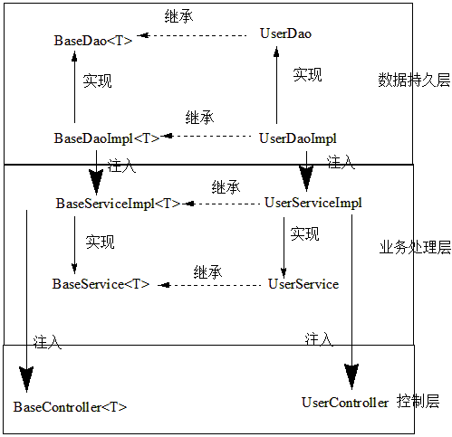
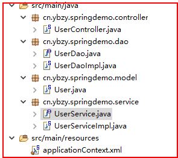

# Spring

轻量级的Java开发框架

## IOC控制反转

将对象的创建和管理交给Spring容器处理

```java
1、创建spring的ioc容器对象，实例化所有配置的bean(springioc容器有ApplicationContext和BeanFactory,BeanFactory不常用)
//默认查找classpath路径下的文件
ApplicationContext ctx=new ClassPathXmlApplicationContext("applicationContext.xml");
//默认为项目的根目录
ApplicationContext ctx=new FileSystemXmlApplicationContext("src/main/resources/applicationContext.xml");
//也可以读取classpath下的文件
ApplicationContext ctx=new FileSystemXmlApplicationContext("classpath:applicationContext.xml");
//前缀file表示绝对路径
ApplicationContext ctx=new FileSystemXmlApplicationContext("file:D:/applicationContext.xml");

2、从ioc容器中获取对象
//使用id获取
User user=(User)ctx.getBean("user");
//容器中只有一个User对象实例
User user=ctx.getBean(User.class);
```

spring配置文件applicationContext.xml

```java
<bean id="user" class="cn.ydzy.springdemo.model.User">
    <property name="username" value="admin"></property>
    <property name="password" value="123456"></property>
</bean>   
```

## 依赖注入DI

在运行期，由外部容器动态的创建依赖对象实例并传递到另一个对象中。

注入方式有三种:

- 属性注入
- 构造器注入

### 属性注入(setter注入)

```java
<bean id="account" class="cn.ydzy.springdemo.model.Account">
    <property name="user" ref="user"></property>
    <property name="friend" value="zhangsan"></property>
</bean>    

public class Account{
    //只存在引用
    private User user;
    private String friend;
    public void setUser(User user){
        this.user=user;
   }
   public void setFriend(String friend){
       this.friend=friend;
   }
}
```

### 构造函数注入

```java
<bean id="account" class="cn.ydzy.springdemo.model.Account">
    <constructor-arg ref="user"/>
</bean>    
<bean id="account" class="cn.ydzy.springdemo.model.Account">
    <constructor-arg type="java.lang.String" value="Jack"/>
    <constructor-arg type="int" value="25"/>
</bean>    
<bean id="account" class="cn.ydzy.springdemo.model.Account">
    <constructor-arg index="0" value="Jack"/>
   <constructor-arg index="1" value="25"/>
</bean>    

public class Account{
    private User user;
    private String friend;
    private int age;
    public Account(User user){
        this.user=user;
   }
   public Account(String friend,int age){
       this.friend=friend;
       this.age=age;
   }
}
```

1、xml文件中定义一个bean新建实例就是控制反转；bean中使用property等就是依赖注入的数据；最后在实例里面声明变量，使用set或构造方法等依赖注入；

2、bean;自动装配；set或构造

3、@Component等；@Autowired等

## Bean的生命周期

BeanFactoryPostProcessor——>代码块——>**实例化**——>**数据装配**——>初始化之前——> **初始化方法**——>初始化之后——>就绪——>使用——>销毁方法——>从容器销毁

## Bean实例化

默认在容器启动的时候实例化bean，也可以在bean标签中设置`lazy-­init="true"`,即懒实例化，即在第一次使用bean时实例化。


**可以使用xml配置文件或annotation注解方式两种配置bean实例**

### 使用xml配置文件配置bean实例

利用 xml配置文件方式中， 还包括如下三小类

- 反射模式（前面的所有配置都是这种模式）
- 工厂方法模式
- Factory Bean模式

#### 工厂方法模式

##### 静态工厂

```xml
<!-- 通过静态工厂实例化bean -->
<!-- 无参：class中虽然是SpringBeanFactory，但这个bean是SpringBean的实例 -->
<bean id="springBean" class="ioc10.SpringBeanFactory" factory-method="getSpringBean">
    <property name="name" value="jack"/>
</bean>
<!-- 带参：factory-method静态工厂方法的名字，constructor-arg给静态工厂方法传递参数 -->
<bean id="springBean2" class="ioc10.SpringBeanFactory" factory-method="getSpringBean">
    <constructor-arg name="name" value="lucy"/>
</bean>
```

```java
public class SpringBeanFactory {
    //无参
    public static SpringBean getSpringBean(){
        return new SpringBean();
    }
    //带参
    public static SpringBean getSpringBean(String name){
        SpringBean springBean = new SpringBean();
        springBean.setName(name);
        return springBean;
    }
}

public static void main(String[] args){
    ApplicationContext ac=new ClassPathXmlApplicationContext("ioc10/spring.xml");
    SpringBean springBean = (SpringBean) ac.getBean("springBean");
}
```

##### 实例工厂

```xml
<!-- 实例工厂：先实例工厂bean -->
<bean id="springBeanFactory" class="ioc12.SpringBeanFactory"/>
<!-- 无参 -->
<bean id="springBean" factory-bean="springBeanFactory"  factory-method="getSpringBean">
    <property name="name" value="tom"/>
</bean>
<!-- 带参 -->
<bean id="springBean2" factory-bean="springBeanFactory" factory-method="getSpringBean">
    <constructor-arg name="name" value="alice"/>
</bean>
```

```java
public class SpringBeanFactory {
    //无参
    public SpringBean getSpringBean(){
        return new SpringBean();
    }
    //带参
    public SpringBean getSpringBean(String name){
        SpringBean springBean = new SpringBean();
        springBean.setName(name);
        return springBean;
    }
}
```

#### FactoryBean

```java
//FactoryBean(工厂bean)实例化Bean
//自定义的FactoryBean需要实现FactoryBean接口
public class CarFactoryBean implements FactoryBean<Car>{
    private String name;
    public void setName(String name){
        this.name=name;
    }
    //返回bean对象
    @Override
    public Car getObject() throws Exception {
    	return new Car(1,"奔驰");
    }
    //返回bean类型
    @Override
    public Class<?> getObjectType() {
    	return Car.class;
    }
    //是否单例
    @Override
    public boolean isSingleton() {
    	return true;
    }
}
```

```xml
<!-- class:指向FactoryBean的全类名	property:配置Factory的属性
	实际返回的实例是FactoryBean的getObject()方法返回的实例 -->
<bean id="car" class="cn.ybzy.spring.CarFactoryBean">
    <property name="name" value="baoma"></property>
</bean>
```

## 数据装配

### 自动装配

- spring容器会基于反射查看Person类，根据类中属性的类型或名字找到对应的其他bean注入其中，这里是setter注入。
- constructor模式会找到Person类，根据类中的构造函数参数进行匹配其他bean，此模式会同时根据参数byName和byType自动装配，先按byName，再按byType。

自动装配只适用于其他Bean的引用，同时需要在需要注入的类中添加set或构造方法。自动装配可以根据：

- byType(根据类型)
- byName(根据名称)
- constructor(根据构造函数)

```java
<bean id="person" class="cn.ybzy.springdemo.model.Person" autowire="byType"></bean>
```

可以通过＜bean＞标签的autowire-candidate设置为false来去掉不需要注入的实例Bean

### 外部属性文件

```xml
<!-- 在spring中配置数据源Datasource -->
<bean id="c3p0" class="com.mchange.v2.c3p0.ComboPooledDataSource">
    <!-- 使用类似EL标签的写法 -->
    <property name="user" value="${user}"></property>
    <property name="password" value="${password}"></property>
    <property name="driverClass" value="${driverClass}"></property>
    <property name="jdbcUrl" value="${jdbcUrl}"></property>
</bean>

<!-- 使用context的命名空间 -->
<context:property-placeholder location="classpath:jdbc.properties"/>
```

```properties
#jdbc.properties
user=root
password=root
jdbcUrl=jdbc:mysql://localhost:3306/test?serverTimezone=UTC
driverClass=com.mysql.cj.jdbc.Driver
```

### spEL表达式

Spring的表达式语言spEl(语法类似EL表达式)，使用#{}作为定界符，为bean的属性进行了动态赋值。

spEl可以引用bean，并且调用它的属性和方法：

- 引用其他对象:#{car}，可以使用value="#{car}"代替ref="car"
- 引用其他对象的属性:#{car.price}
- 调用其他对象的方法:#{car.toString()}
- 调用静态方法静态属性:#{T(java.lang.Math).PI}
- 操作List、Map集合取值:#{car.alist[0]},#{car.amap["dazhong"]}
- 支持常用的运算符和正则表达式:#{car.price>100?’贵‘:’便宜‘}，#{'adaa' maches '[0-9]+'}

```properties
<bean id="person" class="cn.ybzy.springdemo.model.Person">
    <property name="id" value="#{1}"></property>
    <property name="name" value="#{zhangsan}"></property>
    <property name="friend" value="#{friend}"></property>
    <property name="friendName" value="#{friend.name}"></property>
    <property name="friendPet" value="#{friend.petList[0]}"></property>
</bean>
```

#### java中${}和#{}区别

`#{}`

- `#{name}` mybatis中使用它相当于占位符的用法，可以自动进行jdbc类型的属性转换，如果name的值是 mark 则转换之后就是 "mark"，它可以防止sql注入
- `#{dataSource.userName}` 属于SPEL语法,给某个属性赋值时，dataSource是程序中已经注入存在的Bean容器， 则可以通过 @value(#{dataSource.userName}) 获取属性的值

`${}`

- `${name}` mybatis中使用它相当于不做单引号任何处理，如果name的值是 create_time，则转换之后就是 order by create_time ,不做处理直接拼接，不能防止sql注入，另外的场景也有模糊查询 like '%${name}%'
- `${server.port}` 如果有一个server.properties配置文件里面属性 server.port=80 则可以通过 @value(${server.port}) 来获取属性的值

## 初始化方法/销毁方法 

```xml
<bean id="springBean" class="ioc.SpringBean" init-method="init" destroy-method="destroy"> 
    <property name="name" value="alice"/> 
    <property name="sex" value="female"/> 
</bean>
```

## Bean后处理器

对IoC容器中的所有bean都有效，执行初始化方法init之前和之后，需要实现BeanPostProcessor接口

```xml
<bean id="springBean" class="ioc22.SpringBean" init-method="init"/>
<bean class="ioc22.SpringBeanPostProcessor"/>
```

```java
public class SpringBeanPostProcessor implements BeanPostProcessor {
    //在bean初始化之前执行
    @Override
    public Object postProcessBeforeInitialization(Object bean, String beanName) throws BeansException {
        System.out.println("SpringBeanPostProcessor.postProcessBeforeInitialization");
        return bean; //返回处理后bean
    }
    //在bean初始化之后执行
    @Override
    public Object postProcessAfterInitialization(Object bean, String beanName) throws BeansException {
        System.out.println("SpringBeanPostProcessor.postProcessAfterInitialization");
        return bean;
    }
}

public class SpringBean {
    public void init(){
        System.out.println("SpringBean.init");
    }
}
```

## BeanFactory后处理器

也称为容器后处理器，容器后处理器在容器创建之后，bean实例化之前，修改bean的定义属性，需要实现BeanFactoryPostProcessor接口

```java
//将转换器注册到容器后处理器中，在数据装配中使用转换器转换属性类型

//自定义一个容器后处理器，作用：通过注册属性编辑器，完成属性的转换和装配
public class SpringBeanFactoryPostProcessor implements BeanFactoryPostProcessor {
    private Map<Class,Class<? extends PropertyEditor>> customEditors;
    @Override
    public void postProcessBeanFactory(ConfigurableListableBeanFactory beanFactory) throws BeansException {
        //向容器中注册属性编辑器，第1个参数表示要转换的属性类型，第2个参数表示要使用的属性编辑器
        //beanFactory.registerCustomEditor(Address.class, AddressEditor.class);
        //beanFactory.registerCustomEditor(Date.class, DateEditor.class);
        for (Entry<Class,Class<? extends PropertyEditor>> entry:customEditors.entrySet()){
            beanFactory.registerCustomEditor(entry.getKey(),entry.getValue());
        }
    }
    public Map<Class, Class<? extends PropertyEditor>> getCustomEditors() {
        return customEditors;
    }
    public void setCustomEditors(Map<Class, Class<? extends PropertyEditor>> customEditors) {
        this.customEditors = customEditors;
    }
}

//定义一个属性编辑器,PropertyEditor（转换器），实现PropertyEditor接口或继承PropertyEditorSupport父类
public class AddressEditor extends PropertyEditorSupport {
    //将Address转换为String
    @Override
    public String getAsText() {
        Address address = (Address) getValue();
        return "["+address.getCity()+"-"+address.getProvince()+"]";
    }
    //将String转换为Address
    @Override
    public void setAsText(String text) throws IllegalArgumentException {
        Pattern pattern = Pattern.compile("\\[(.*)-(.*)\\]");
        Matcher matcher = pattern.matcher(text);
        if(matcher.matches()){
            String city = matcher.group(1);
            String province = matcher.group(2);
            Address address = new Address();
            address.setCity(city);
            address.setProvince(province);
            //调用setValue()设置值
            setValue(address);
        }
    }
}

public class SpringBean {
    private Address address;
    private Date birthday;
    private String username;
    private Boolean sex; //true表示男，false表示女
    private Integer age;
    ...
}
```

```xml
<bean id="springBean" class="ioc24.SpringBean">
    <property name="address" value="[南京-江苏]"/>
    <property name="birthday" value="1990-12-4"/>
    <property name="username" value="${username}"/>
    <property name="sex" value="${sex}"/>
    <property name="age" value="${age}"/>
</bean>

<bean class="ioc24.SpringBeanFactoryPostProcessor">
    <property name="customEditors">
        <map>
            <entry key="ioc24.Address" value="ioc24.editor.AddressEditor"/>
            <entry key="java.util.Date" value="ioc24.editor.DateEditor"/>
            <entry key="java.lang.String" value="ioc24.editor.StringEditor"/>
            <entry key="java.lang.Boolean" value="ioc24.editor.BooleanEditor"/>
        </map>
    </property>
</bean>
```

### Spring提供配置

```xml
<!-- 使用Spring提供的CustomEditorConfigurer,用来注册自定义的属性编辑器,上面的容器后处理器就不用了 -->
<bean class="org.springframework.beans.factory.config.CustomEditorConfigurer">
    <property name="customEditors">
        <map>
            <entry key="ioc24.Address" value="ioc24.editor.AddressEditor"/>	
            <entry key="java.util.Date" value="ioc24.editor.DateEditor"/>
            <entry key="java.lang.String" value="ioc24.editor.StringEditor"/>
            <entry key="java.lang.Boolean" value="ioc24.editor.BooleanEditor"/>
        </map>
    </property>
</bean>
```

```xml
<!-- 使用Spring提供的PropertyPlaceholderConfigurer，用来读取属性文件，同时内置了常用的属性编辑器，上面的StringEditor、BooleanEditor就不用了 -->
<bean class="org.springframework.beans.factory.config.PropertyPlaceholderConfigurer">
    <property name="location" value="classpath:ioc24/info.properties"/>
</bean>
```

```xml
<!-- 使用context命名空间代替上述配置，读取属性文件，同时内置了常用的属性编辑器 -->
<context:property-placeholder location="classpath:ioc/info.properties"/>
```

### 属性编辑器

```java
public class StringEditor extends PropertyEditorSupport {
    @Override
    public String getAsText() { //admin——>${username}
        return super.getAsText();
    }
    @Override
    public void setAsText(String text) throws IllegalArgumentException { //${username}——>admin
        if(PropertiesUtils.matcher(text)){
            String key = PropertiesUtils.getKey(text);
      PropertiesUtils.load(StringEditor.class.getClassLoader().getResourceAsStream("ioc24/info.properties"));
            String value = PropertiesUtils.get(key).toString();
            setValue(value);
        }
    }
}

public class BooleanEditor extends PropertyEditorSupport {
    @Override
    public String getAsText() {
        return super.getAsText();
    }
    @Override
    public void setAsText(String text) throws IllegalArgumentException {
        if(PropertiesUtils.matcher(text)){
            String key = PropertiesUtils.getKey(text);
            PropertiesUtils.load(StringEditor.class.getClassLoader().getResourceAsStream("ioc24/info.properties"));
            String s = PropertiesUtils.get(key).toString();
            System.out.println(s);
            Boolean b = Boolean.parseBoolean(s);
            setValue(b);
        }
    }
}
```

#### PropertiesUtils

```java
//读取properties文件的工具类
public class PropertiesUtils {
    private static Properties properties;
    /**
     * 读取属性文件
     */
    public static void load(InputStream inputStream){
        if(properties==null){
            properties=new Properties();
        }
        try {
            properties.load(inputStream);
        } catch (IOException e) {
            e.printStackTrace();
        }
    }
    /**
     * 获取属性值
     */
    public static Object get(String key){
        if(!properties.containsKey(key)){
            throw new RuntimeException("在properties文件中找不到值，key:"+key);
        }
        return properties.get(key);
    }
    /**
     * 判断是否符合格式
     */
    public static boolean matcher(String string){
        Pattern pattern = Pattern.compile("\\$\\{(.*)\\}");
        Matcher matcher = pattern.matcher(string);
        return matcher.matches();
    }
    /**
     * 处理字符串
     */
    public static String getKey(String string){
        Pattern pattern = Pattern.compile("\\$\\{(.*)\\}");
        Matcher matcher = pattern.matcher(string);
        if(matcher.matches()){
            return matcher.group(1);
        }
        throw new RuntimeException("格式不正确，string:"+string);
    }
}
```

```properties
#info.properties
username=admin
sex=true
age=18
```

## Bean作用域

在IoC容器中bean默认是单例的，但是单例bean中的属性是线程不安全的，可以在bean标签中设置scope="prototype"属性指定作用域，配置为非单例的

scope作用域，取值：

- singleton：单例
- prototype：非单例
- request：同一个请求中单例
- session：同一个会话中单例

### spring单例bean和多线程

在单例的bean中使用了成员变量，并对它进行了写操作。

变量分为成员变量(全局变量)和局部变量，成员变量分为静态变量和实例变量。

#### 无状态bean和有状态bean

- 有状态就是有数据存储功能。有状态对象(Stateful Bean)，就是有实例变量的对象，可以保存数据，是非线程安全的。在不同方法调用间不保留任何状态。
- 无状态就是一次操作，不能保存数据。无状态对象(Stateless Bean)，就是没有实例变量的对象 .不能保存数据，是不变类，是线程安全的。

```java
@Service
//有状态bean,有i,user等属性，并且user,i有存偖功能，是可变的。
public class ExampleService {
    private User user;
	private int i;
	public void addi() {
		i++;
	}
	public int getI() {
		return i;
	} 
}
@Service
//无状态bean,不能存偖数据。dao是没有状态信息的。只有一系统的方法操作。 
public class ExampleService {
   @Autowired
   private ExampleDao dao;
   public List<String> getAll(){
       return dao.selectList();
   }
}
```

解决多线程安全问题可以采用ThreadLocal 实现线程隔离，如果多个线程并发访问的对象实例只允许，也只能创建一个，那就只能采取同步措施 synchronized 或 lock。

参考：

[SpringBoot 单例Bean中实例变量线程安全研究](https://blog.csdn.net/lililuni/article/details/92376523)

## Bean之间的继承和依赖

```xml
<!-- abstract表示父bean只用来被继承，不被实例化(不加也可) -->
<bean abstract="true" id="pet1" class="cn.ybzy.springdemo.model.Pet" p:id="1" p:name="xiaogou"></bean>
<!-- parent表示子bean继承父bean -->
<bean id="pet2" p:id="2" p:name="xiaoheo" parent="pet2"></bean>
<!-- depends-on表示必须依赖另一个bean，另一个不存在会报错 -->
<bean id="pet3" class="cn.ybzy.springdemo.model.Pet" p:id="3" p:name="xiaobai" depends-on="pet2"></bean>
```

### 泛型的依赖注入



将service的常用方法放在BaseService中，继承时指定泛型类型，将泛型类型传入到BaseDao中方便数据库查询，实际使用是BaseDaoImpl和UserDaoImpl，框架往往自动生成对象实例，注入时声明父类变量自动装配。

图片解析：

第一列添加了base类添加增删改查的常规方法(MyBatis-Plus)，第二列是正常controller-service-dao层次，只写业务代码

## Bean中获取IOC容器

```java
//IoC容器的工具类，用于获取并操作IoC容器，实现ApplicationContextAware接口
public class ApplicationContextHolder implements ApplicationContextAware {
    private static ApplicationContext ac;
    @Override
    public void setApplicationContext(ApplicationContextapplicationContext) throws BeansException {
        ac=applicationContext;
    }
    //一般不直接提供获取ApplicationContext的方法，不安全
    public static Object getBean(String beanName){
        return ac.getBean(beanName);
    } 
    public static <T> T getBean(Class<T> clazz){
        return ac.getBean(clazz);
    }
}
```

```xml
<!-- IoC容器工具类 -->
<bean class="com.ioc.util.ApplicationContextHolder"/>
```

## Resource

Spring的资源抽象Resource实体类，本质上就是java.io.File的封装，根据资源位置不的同，提供了不同的实现类，用来快速获取文件资源

- FileSystemResource
- ClassPathResource
- UrlResource
- InputStreamResource

```java
//Resource resource=new FileSystemResource("e:/create.sql");
Resource resource=new ClassPathResource("ioc21/spring.xml");
System.out.println(resource.getFilename());
System.out.println(resource.contentLength());
System.out.println(resource.exists());
InputStream inputStream = resource.getInputStream();
StreamUtils.copy(inputStream,new FileOutputStream("e:/itany.xml"));
```

```xml
<bean id="springBean" class="ioc21.SpringBean">
    <!--<property name="resource" value="file:e:/create.sql"/>-->
    <property name="resource" value="classpath:ioc21/spring.xml"/>
</bean>
```

## 注解

使用注解配置bean实例、自动装配、注入属性值等



### 配置注解的类的位置

```xml
<!-- 使用context的命名空间，base-package：指定spring扫描注解的类所在的包。当需要扫描多个包的时候，可以使用逗号分隔 -->
<context:component-scan  base-package="cn.ybzy.springdemo"/>

<!-- resource-pattern指定扫描包里特定的类,这里只能扫描model里的User类 -->
<context:component-scan  base-package="cn.ybzy.springdemo" resource-pattern="model/*.class"/>

<!-- 排除子节点,这里排除了@controller注解的类的对象，子节点可以有多个 -->
<context:component-scan  base-package="cn.ybzy.springdemo">
	<context:exclude-filter type="annotation" expression="org.springframework.stereotype.Controller">
</context:component-scan>

<!-- 配置要扫描的类,这里只能扫描到@Controller注解的类，其他类都扫描不到了，子节点可以有多个 -->
<context:component-scan  base-package="cn.ybzy.springdemo" use-default-filters="false">
	<context:include-filter type="annotation" expression="org.springframework.stereotype.Controller">
</context:component-scan>

<!-- 排除了UseDao接口和接口的实现类 -->
<context:component-scan  base-package="cn.ybzy.springdemo" use-default-filters="false">
	<context:exclude-filter type="assignable" expression="cn.ybzy.springdemo.dao.UseDao">
</context:component-scan>
```

### 常用注解

这四个等价于xml文件中的标签并且id=user

- `@Component("user")` 给类注解
- `@Service("user")` service层
- `@Controller("user")` web业务层
- `@Repository("user")` dao层

```java
//后面不写名字，对象名默认为首字母小写
@Component("zoo")
public class Zoo{
    ...
}
```

- `@Scope(scopeName="singleton")` 等同于标签的scope属性
- `@Lazy` 指定类的实例化时机，等同于标签的lazy-­init属性

注解方式的**数据装配**是直接使用属性进行注入，不是使用setter方法，所以可以没有setter方法

- `@Value(value="188")` 给值属性赋值，可以用在方法上或者属性上

```java
@Component("zoo")
public class Zoo{
    @Value(value="aaa")
    private String zooName;
    
    //和上面一样都是给属性赋值
    @Value("bbb")
    public void setZooName(String zooName){
    	this.zooName=zooName;
    }
    
    //需要配置<context:property-placeholder location="classpath:ioc/info.properties"/>读取属性文件
    @Value("${jdbc.username}") 
    private String username; 
        
    @Value("classpath:ioc/spring.xml") 
    private Resource resource;
}
```

- `@Resource(name="tiger")` 给对象赋值
  - 该对象tiger必须要已经注入容器中（在配置文件中已经配置，或者在类对应中已经注解）
  - @Resource后面加name表示根据name属性匹配bean，加class表示根据type匹配，如果没有任何内容，默认按照name属性去匹配bean，找不到再按照type

```java
@Component("zoo")
public class Zoo{
    //等价于配置的ref="tiger"
    @Resource(name="tiger")
    private Tiger tiger;
    //通过类型匹配
    @Resource(type=Tiger.class)
    private Tiger tiger;
}
```

- `@Autowired` 自动装配，给对象赋值，和`@Qualifier("car2") `一起使用，告诉spring容器自动装配哪个对象；
  - 用后置处理器机制，调用对象的无参构造，来创建对象的实例，然后再利用反射机制，将实例化好的对象实例，赋值给声明的变量，这就是Autowired的原理。
  - 自动装配，默认按byType，如果有多个同类型的bean，则按byName
  - `@Autowired(required=false)`表示容器中可以找不到bean，显示为null

```java
@Component("zoo")
public class Zoo{
    @Autowired
    @Qualifier("tiger1")
    private Tiger tiger1;
}
```

- `@PostConstruct` //指定该方法在对象被创建后马上调用，相当于配置文件中的init-method属性
- `@PreDestroy` //指定该方法在对象销毁之前调用，相当于配置文件中的destory-method属性


## AOP

面向切面编程，将程序中的交叉业务逻辑封装成切面，由AOP容器在适当位置将切面动态织入到具体业务逻辑中。交叉业务逻辑如事务、日志等。

### AOP术语

将增强织入目标对象的切点上，产生代理类，切点和增强称为切面。

- 增强 Advice 也称为通知，在切点上执行的一段程序代码，用来实现某些功能 ；
- 切点Pointcut，定位查找到需要的连接点，连接点Joinpoint，程序执行的某个特定位置，如方法调用前、方法调用后、方法抛出异常时、方法调用前后等 ；
- 切面 Aspect，切点和增强的组合 ；
- 目标对象Target，将执行增强处理的目标类 ；
- 织入Weaving，将增强添加到目标类具体切入点上的过程； 
- 代理 Proxy，一个类被织入增强后，会产生一个代理类 ；
- 引介 Introduction，也称为引入；

### AOP原理

- Spring中AOP代理由Spring的IOC容器负责生成、管理，其依赖关系也由IOC容器负责管理。
- SpringAOP使用的动态代理，对于实现接口的目标类，使用的是jdk动态代理，对于没有实现任何接口的目标类，使用的是cglib的动态代理

### Spring AOP的配置方式

- Spring AOP 1.x，使用ProxyFactoryBean手动代理 
- Spring AOP 2.x，基本命名空间的配置 
- Annotation，基于注解的配置

#### 增强类型

- 前置通知(增强) 		实现了MethodBeforeAdvice接口，在方法执行前添加功能；
- 后置通知 			实现了AfterReturningAdvice接口，在方法执行后添加功能；
- 环绕通知 			实现了MethodInterceptor接口，在方法执行前后添加功能；
- 异常通知			实现了ThrowsAdvice接口，在方法抛出异常后添加功能；
- 引入通知(了解) 		实现了IntroductionInterceptor接口，在目标类中添加新方法和属性；

#### Spring AOP 1.x

```xml
<!-- Spring AOP 1.x -->

//spring.xml配置

<!-- 配置目标类实例 -->
<bean id="userServiceTarget" class="aop04.service.impl.UserServiceImpl"/>

<!-- 配置Advice -->
<bean id="timerAdvice" class="aop04.advice.TimerAdvice">
    <property name="time" value="5000"/>
</bean>


<!-- 配置Advisor，将Advice注入到Pointcut位置，织入的过程,Advisor是Pointcut和Advice的配置器，Pointcut+Advice=Advisor  -->

<bean id="timerAdvisor" class="org.springframework.aop.support.NameMatchMethodPointcutAdvisor">
    <!-- 指定Advice -->
    <property name="advice" ref="timerAdvice"/>
    <!-- 配置Pointcut，指定匹配目标类哪些方法 -->
    <property name="mappedNames">
        <list>
            <value>log*</value>
        </list>
    </property>
</bean>


<!-- 配置代理 -->
<bean id="userService" class="org.springframework.aop.framework.ProxyFactoryBean">
    <property name="target" ref="userServiceTarget"/>  <!-- 目标类的实例 -->
    <property name="interfaces"> <!-- 目标类的接口列表 -->
        <list>
            <value>aop04.service.UserService</value>
        </list>
    </property>
    <property name="interceptorNames"> <!-- 交叉业务逻辑 -->
        <list>
            <value>timerAdvisor</value>
        </list>
    </property>
</bean>
```

```java

 //环绕通知
 public class TimerAdvice implements MethodInterceptor {
    private long time;
    public long getTime() {
        return time;
    }
    public void setTime(long time) {
        this.time = time;
    }
    @Override
    public Object invoke(MethodInvocation invocation) throws Throwable {
        Method method = invocation.getMethod(); //方法
        Object[] args = invocation.getArguments(); //参数
        Object target = invocation.getThis(); //目标对象
        //方法执行前
        long startTime = System.currentTimeMillis();
        System.out.println("方法执行前。。。。");
        
        Object proceed = invocation.proceed();//执行业务逻辑，其实就是调用业务方法，返回值表示执行业务方法后返回的结果
        
        //方法执行后
        long endTime = System.currentTimeMillis();
        System.out.println("方法执行后。。。。，执行"+method.getName()+"花费："+(endTime-startTime)+"ms");
        if(endTime-startTime>time){
            //发送短信通知
            System.out.println("！！！警报：发送信息！");
        }
        return proceed;
    }
}
 
public static void main(String[] args) throws ClassNotFoundException {
    ApplicationContext ac=new ClassPathXmlApplicationContext("spring.xml");
    UserService userService = (UserService) ac.getBean("userService");
    System.out.println(userService.getClass()); //class com.sun.proxy.$Proxy2 表示使用的是jdk动态代理
    
    userService.login("admin","123");
    System.out.println("--------------------------------------------");
    System.out.println(userService.logout());
}
```

#### Spring AOP 2.x 

基于命名空间的配置，原理是使用后处理器

配置Advice

编写通知时不需要实现任何接口 

- 前置通知	public void 方法名(JoinPoint) 
- 后置通知	public void 方法名(JoinPoint,Object) 
- 异常通知	public void 方法名(JoinPoint,Exception) 
- 环绕通知	public Object 方法名(ProceedingJoinPoint) 

```xml
<!-- Spring AOP 2.x-->

<!-- 配置目标类实例 -->
<bean id="userService" class="aop06.service.impl.UserServiceImpl"/>
<bean id="productService" class="aop06.service.impl.ProductServiceImpl"/>

<!-- 配置Advice -->
<bean id="logAdvice" class="aop06.advice.LogAdvice"/>

<!-- 配置Pointcut并织入-->
<aop:config>
    <!--  配置Pointcut,使用AspectJ表达式定义切点   -->
    <aop:pointcut id="pc" expression="within(aop06.service.impl.*ServiceImpl)"/>
    <aop:pointcut id="pc2" expression="execution(void aop06.service.impl.ProductServiceImpl.deleteByName(String))"/>
    <aop:pointcut id="pc3" expression="execution(* aop06.service.impl.*.*(..))"/>
    <!-- 织入 -->
    <aop:aspect ref="logAdvice">
        <!-- 将logAdvice中的log方法以前置通知的方式织入到pc对应的切入点-->
        <aop:before method="log" pointcut-ref="pc3"/>
        <!--<aop:after-returning method="log2" pointcut-ref="pc" returning="returnValue"/>-->
        <!--<aop:after-throwing method="log3" pointcut-ref="pc" throwing="e" />-->
        <!--<aop:around method="log4" pointcut-ref="pc"/>-->
    </aop:aspect>
</aop:config>
```

```java
//增强类
public class LogAdvice {
    //前置通知
    public void log(JoinPoint joinPoint){
        Signature signature = joinPoint.getSignature(); //签名
        String methodName = signature.getName(); //方法名
        MethodSignature methodSignature = (MethodSignature) signature; //转换为方法签名，本质上是方法签名
        Method method = methodSignature.getMethod();
        Object[] args = joinPoint.getArgs(); //方法参数
        //Object target = joinPoint.getThis(); //目标对象
        Object target = joinPoint.getTarget();
    
        System.out.println("LogAdvice.log，methodName:"+methodName+",args:"+ Arrays.toString(args)+",target:"+target);
    }
    //后置通知
    public void log2(JoinPoint joinPoint,Object returnValue){
        System.out.println("LogAdvice.log2,returnValue:"+returnValue);
    }
    //异常通知
    public void log3(JoinPoint joinPoint,Exception e){
        System.out.println("LogAdvice.log3,e:"+e);
    }
    //环绕通知
    public Object log4(ProceedingJoinPoint joinPoint) throws Throwable {
        long startTime = System.currentTimeMillis();
        System.out.println("方法执行前。。。。");
    
        Object proceed = joinPoint.proceed();
    
        long endTime = System.currentTimeMillis();
        System.out.println("方法执行后。。。。，执行"+joinPoint.getSignature().getName()+"花费"+(endTime-startTime)+"ms");
    
        return proceed;
    }
}
```

### AspectJ表达式

切点表达式，一种表达式，用来定义切点位置 

`within `

匹配该类中的所有方法 

语法：within(包名.类名) 

`execution `

匹配特定包中的特定类中特定返回值类型的特定参数的特定方法 

语法：execution(表达式) 	表达式：返回值类型 包名.类名.方法名(参数类型) 

通配符：`* 和 ..`其中参数类型是..其他都是*

### AOP注解

```xml
<context:component-scan base-package="aop.service.impl"/>
<context:component-scan base-package="aop.advice"/>
<!-- 自动创建代理并织入切面，proxy-target-class，取值：
        false：使用jdk动态代理，默认值
        true：使用cglib
-->
<aop:aspectj-autoproxy proxy-target-class="true"/>
```

```java
//加入到IOC容器中
@Component
//切面类
@Aspect
//当同一个目标方法有多个切面的时候，哪个切面先执行，取决于在切面类上的注解@order(值小的先执行)
@order(1)
public class LogAdvice {
    //@Pointcut(切点表达式) 
    @Pointcut("execution(* aop.service.impl.*ServiceImpl.*(..))")
    public void pc() {}
    @Pointcut("execution(* aop.service.impl.*.*(..))")
    public void pc2() {}
    
    //排除某些类
    @Pointcut("execution(* aop.service.impl.*.*(..)) && !execution(* aop.service.impl.*ServiceImpl.*(..))") 
    public void pc3(){}
    //或者
    @Pointcut("!pc() && pc2()")
    public void pc4(){}
    
    //多个类
    @Pointcut("execution(* aop.service.impl.*.*(..)) || execution(* aop.config.*.*.*(..))") 
    public void pc5(){}
    
    //切面方法
    //@Before(切点方法())
    @Before("pc()") //后面的小括号不能省略
    public void before(JoinPoint joinPoint) {
        System.out.println("LogAdvice，name:" + joinPoint.getSignature().getName() + ",args:" + joinPoint.getArgs() + ",target:" + joinPoint.getThis());
    }
    @AfterReturning(value = "pc()", returning = "returnValue")
    public void afterReturning(JoinPoint joinPoint, Object returnValue) {
        System.out.println("LogAdvice.afterReturning,returnValue:" + returnValue);
    }
    @AfterThrowing(value = "pc2()", throwing = "e")
    public void afterThrowing(JoinPoint joinPoint, Exception e) {
        System.out.println("LogAdvice.afterThrowing,e:" + e);
    }
    @Around("pc()")
    public Object around(ProceedingJoinPoint joinPoint) throws Throwable {
        System.out.println("开启事务。。。。。");
        Object proceed = null;
        try {
            proceed = joinPoint.proceed();
            System.out.println("提交事务。。。。");
        } catch (Throwable e) {
            System.out.println("回滚事务。。。。");
            throw e;
        }
        //需要返回目标方法的返回值
        return proceed;
    }
}
```

```java
//目标类
package aop.service.impl;
//必须将目标类注入容器中，否则AOP不生效
@Service
public class TestServiceImpl {
    public void transfer() {
        System.out.println("执行方法");
    }
}
```

```java
//单元测试
@RunWith(SpringRunner.class)
@SpringBootTest(classes = ApplicationRunner.class, webEnvironment = SpringBootTest.WebEnvironment.RANDOM_PORT)

public class SpringAopApplicationTests {
    //此时AOP不生效
	@Test
	public void contextLoads() {
		TestServiceImpl test  = new TestServiceImpl;
		test.transfer();
	}
    
    //从容器中获取对象使用才会有通知
    @Autowired
    private TestServiceImpl testServiceImpl;
    @Test
	public void contextLoads2() {
		testServiceImpl.transfer();
	}
}
```


## Spring整合web

```xml
//web.xml
<!-- 初始化Spring容器,将IoC容器的初始化交给Web容器管理--> 
<context-param> 
    <!-- 当未指定contextConfigLocation参数时，默认会自动读取/WEB-INF/applicationContext.xml文件-->
    <param-name>contextConfigLocation</param-name> 
    <param-value>classpath:spring.xml</param-value> 
</context-param> 
<listener> 
    <!-- 将Ioc容器放到Web的ServletContext域中，以供Web应用里的类调用，这里底层是servletContextListener-->
    <listener-class>org.springframework.web.context.ContextLoaderListener</listener-class> 
</listener>

<!-- 解决POST请求中文乱码 -->
<filter>
    <filter-name>encodingFilter</filter-name>
    <filter-class>org.springframework.web.filter.CharacterEncodingFilter</filter-class>
    <init-param>
        <param-name>encoding</param-name>
        <param-value>utf-8</param-value>
    </init-param>
</filter>
<filter-mapping>
    <filter-name>encodingFilter</filter-name>
    <url-pattern>/*</url-pattern>
</filter-mapping>
 
//spring.xml
<!-- 配置依赖注入-->
<!-- 扫描包 -->
<context:component-scan base-package="com.itany.service.impl,com.itany.controller"/>
```

## Spring整合JDBC

配置流程：DataSource——>JdbcTemplate——>Dao——>Service——>Action

```xml
//spring.xml
<!-- 配置DataSource，Spring提供的数据源，没有连接池的功能 -->
<bean id="dataSource1" class="org.springframework.jdbc.datasource.DriverManagerDataSource">
      <property name="driverClassName" value="${jdbc.driverClassName}"/>
      <property name="url" value="${jdbc.url}" />
      <property name="username" value="${jdbc.username}"/>
      <property name="password" value="${jdbc.password}"/>
</bean>
<!-- 使用第三方数据源dbcp -->
<bean id="dataSource2" class="org.apache.commons.dbcp.BasicDataSource">
      <property name="driverClassName" value="${jdbc.driverClassName}"/>
      <property name="url" value="${jdbc.url}" />
      <property name="username" value="${jdbc.username}"/>
      <property name="password" value="${jdbc.password}"/>
      <property name="initialSize" value="${jdbc.initialSize}"/>
      <property name="maxActive" value="100"/>
      <property name="minIdle" value="3"/>
      <property name="maxIdle" value="20"/>
      <property name="maxWait" value="5000"/>
</bean>
<!-- 使用第三方数据源druid -->
<bean id="dataSource" class="com.alibaba.druid.pool.DruidDataSource">
      <property name="driverClassName" value="${jdbc.driverClassName}"/>
      <property name="url" value="${jdbc.url}" />
      <property name="username" value="${jdbc.username}"/>
      <property name="password" value="${jdbc.password}"/>
      <property name="initialSize" value="${jdbc.initialSize}"/>
      <property name="maxActive" value="100"/>
      <property name="minIdle" value="3"/>
      <property name="maxIdle" value="20"/>
      <property name="maxWait" value="5000"/>
</bean>

<!-- 配置JdbcTemplate -->
<bean id="jdbcTemplate" class="org.springframework.jdbc.core.JdbcTemplate">
      <property name="dataSource" ref="dataSource"/>
</bean>
```

```java
@Service("userService")
@Transactional(propagation =Propagation.REQUIRED,rollbackFor = Exception.class)
public class UserServiceImpl implements UserService {
    @Autowired
    private UserDao userDao;

    @Override
    @Transactional(propagation = Propagation.SUPPORTS,readOnly = true)
    public User login(String username, String password) {
       User user = userDao.selectByUsername(username);
       if(user!=null){
           if(user.getPassword().equals(password)){
               return user;
           }

       }

       return null;
    }
    
    @Override
    @Transactional(propagation = Propagation.REQUIRED,isolation = Isolation.READ_COMMITTED,
    					rollbackFor = Exception.class,timeout = 5000)
    public void regist(UserVo userVo) {
        //将传递过来的VO转换为entity，可能涉及多张表
        User user=new User();
        user.setUsername(userVo.getUsername());
        user.setPassword(userVo.getPassword());
        userDao.insert(user);
        System.out.println("id:"+user.getId());
    }     
}    
 
@Repository("userDao")
public class UserDaoImpl implements UserDao{
    @Autowired
    private JdbcTemplate jdbcTemplate;
    @Override
    public User selectByUsername(String username) {
        String sql="select id,username,password from t_user where username=?";
        List<User> users = jdbcTemplate.query(sql, new Object[]{username}, new UserMapper());
        if(users!=null&&users.size()>0){
            return users.get(0);
        }
        return null;
    }
    @Override
    public Integer insert(final User user) {
        KeyHolder keyHolder=new GeneratedKeyHolder();
        jdbcTemplate.update(new PreparedStatementCreator() {
            @Override
            public PreparedStatement createPreparedStatement(Connection connection) throws SQLException {
                String sql="insert into t_user(username,password) values (?,?)";
                PreparedStatement ps = connection.prepareStatement(sql, PreparedStatement.RETURN_GENERATED_KEYS);
                ps.setString(1,user.getUsername());
                ps.setString(2,user.getPassword());
                return ps;
            }
        },keyHolder);
        return keyHolder.getKey().intValue();
    }
}
```

## Spring事务操作

事务：把一系列的sql语句，组合成一个整体，要么所有的sql都执行成功，要么一句sql都不能被执行，这就是事务。

```xml
//spring.xml
<!-- 配置事务管理器,相当于事务的通知增强 -->
<bean id="transactionManager" class="org.springframework.jdbc.datasource.DataSourceTransactionManager">
      <property name="dataSource" ref="dataSource"/>
</bean>

<!-- 方式1：基于命名空间 -->
<!-- 配置Advice-->
<tx:advice id="txAdvice" transaction-manager="transactionManager">-->
      <!-- 配置事务属性-->
      <tx:attributes>
             <tx:method name="login" propagation="SUPPORTS" read-only="true" />
             <tx:method name="regist" propagation="REQUIRED" isolation="READ_COMMITTED" no-rollback-for="java.lang.ArithmeticException" timeout="5000"/>
      </tx:attributes>
</tx:advice>

<!-- 配置Pointcut并织入-->
<aop:config>
      <aop:pointcut id="pc" expression="execution(* com.itany.service.impl.*.*(..))"/>
      <aop:advisor advice-ref="txAdvice" pointcut-ref="pc"/>
</aop:config>

<!-- 方式2：注解驱动,代码在整合JDBC中 -->
<tx:annotation-driven transaction-manager="transactionManager"/>
```

### 事务属性

- 传播属性 
  propagation：定义事务的边界，用来定义当前方法是否需要事务，常用取值： 

  - REQUIRED 必须添加事务，如果当前没有事务，则创建一个新的事务，一般用于增删改操作 
  - SUPPORTS 可以没有事务，如果当前有事务则运行，如果没有事务也可以运行，一般用于查询操作 

- 隔离级别 
  isolation：用来解决事务并发时会出现的一些问题，四种隔离级别： 

  - READ_UNCOMMITTED 未提交读——>可能会发生脏读、不可重复读或幻读 
  - READ_COMMITTED 已提交读——>避免脏读，但可能发生不可重复读或幻读 
  - REPEATABLE_READ 可重复读——>避免脏读和不可重复读，但可能会发生幻读
  - SERIALIZABLE 串行化——>避免脏读、不可重复读或幻读，相当于单并发，没意义

  事务并发时可能会出现的三个问题： 

  - 脏读：一个事务读取到另一个事务没有提交的数据，一般不会发生，如MySQL、Oracle底层默认都只读取提交的数据 
  - 不可重复读：一个事务已经读取数据，另一个事务在修改数据再提交，可能导致使用的数据与数据库不同步 
  - 幻读或虚读：一个事务已经读取数据，另一个事务在添加或删除数据再提交，可能导致使用的数据量与数据库不同步 

  注：不可重复读和幻读是小概率事件，可以通过版本检查来解决，如Hibernate中悲观锁和乐观锁就是通过版本检查来实现的，但太麻烦且效率低，实际开发中一般不需要配置隔离级别，大多是通过定时任务+人工审核 

- 回滚条件 

  默认抛出RuntimeException时才会回滚 
  - rollbackFor：表示发生该异常时回滚 
  - noRollbackFor：表示发生该异常时不回滚 

- 只读优化 

  readOnly：在该事务中只能读取，一般用于查询 

- 超时处理 

  timeout：配置事务的超时时间，一般不配置，超过这个超时时间就强制事务回滚，单位秒

### 事务特性

四个事务特性：ACID 原子性、一致性、隔离性、永久性


