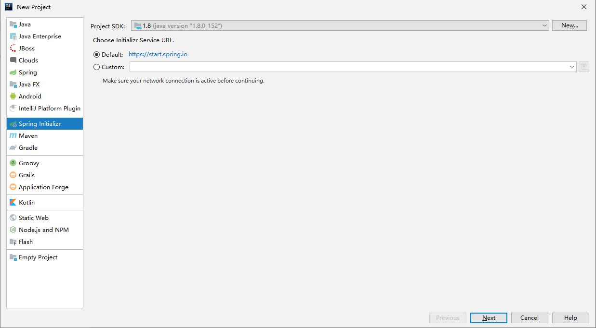
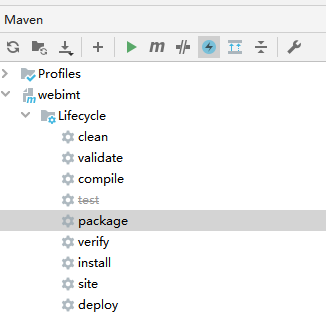

# **SpringBoot**

## 概念

SpringBoot是一个用来简化Spring应用的初始化创建和开发的框架

- 快速创建独立运行的Spring应用并与主流框架集成
- 内置Servlet容器，应用无需打包war包
- 使用starter（启动器）管理依赖并进行版本控制
- 大量的自动配置，简化开发
- 提供了准生产环境的运行时监控，如指标、 健康检查、外部配置等
- 无需配置XML，没有生成冗余代码，开箱即用

## **IDEA新建SpringBoot工程**



.png)

.png)

项目名和所在路径

.png)

## SpringBoot应用

### pom.xml解析

```java
/* 
    父项目spring-boot-starter-parent.pom的父项目是spring-boot-dependencies.pom，用来管理SpringBoot应用中依赖的版本
    <parent>
        <groupId>org.springframework.boot</groupId>
        <artifactId>spring-boot-dependencies</artifactId>
        <version>2.0.3.RELEASE</version>
        <relativePath>../../spring-boot-dependencies</relativePath>
    </parent>
    
    spring-boot-dependencies.pom中配置了多个依赖版本
    <properties>
      <activemq.version>5.16.2</activemq.version>
      <antlr2.version>2.7.7</antlr2.version>
      <appengine-sdk.version>1.9.89</appengine-sdk.version>
      <artemis.version>2.17.0</artemis.version>
      <aspectj.version>1.9.6</aspectj.version>
      <assertj.version>3.19.0</assertj.version>
      <atomikos.version>4.0.6</atomikos.version>
      ...
    </properties>
*/
<parent>
    <groupId>org.springframework.boot</groupId>
    <artifactId>spring-boot-starter-parent</artifactId>
    <version>新版本</version>
</parent>

<dependencies>

    /* 通过启动器starter添加依赖，这里是web应用场景下的依赖包*/
    <dependency>
        <groupId>org.springframework.boot</groupId>
        <artifactId>spring-boot-starter-web</artifactId>
    </dependency>
</dependencies>
```

### 主程序类

```java
//标注在类上，表示这个类是一个SpringBoot应用
@SpringBootApplication

//SpringbootDemoApplication.class参数表示Spring扫描组件范围是主程序类所在的包及其子包
//也可以使用@ComponentScan标注在类上，指定要扫描的包
@ComponentScan
public class SpringbootDemoApplication {
    public static void main(String[] args) {
        SpringApplication.run(SpringbootDemoApplication.class, args);
    }
}
```

### @SpringBootApplication源码

```java
//@SpringBootConfiguration标注在类上，表示这个SpringBoot的配置类，相当于xml配置文件
@SpringBootConfiguration
//开启自动配置功能，SpringBoot会自动完成许多配置，简化了以前的繁琐的配置
@EnableAutoConfiguration
@ComponentScan(excludeFilters = { @Filter(type = FilterType.CUSTOM, classes = TypeExcludeFilter.class),
      @Filter(type = FilterType.CUSTOM, classes = AutoConfigurationExcludeFilter.class) })
public @interface SpringBootApplication {...}
```

#### @SpringBootConfiguration源码

```java
//@Configuration标注在类上，表示这个类是Spring的配置类
@Configuration
public @interface SpringBootConfiguration {...}

@Component
public @interface Configuration {...}
```

#### @EnableAutoConfiguration自动配置源码

```java
@AutoConfigurationPackage
@Import(AutoConfigurationImportSelector.class)
public @interface EnableAutoConfiguration {...}

public class AutoConfigurationImportSelector implements DeferredImportSelector, 
                                        BeanClassLoaderAware,ResourceLoaderAware, BeanFactoryAware, EnvironmentAware, Ordered {
    @Override
    public String[] selectImports(AnnotationMetadata annotationMetadata) {
       ...
       AutoConfigurationEntry autoConfigurationEntry = getAutoConfigurationEntry(annotationMetadata);
       ...
    }
    protected AutoConfigurationEntry getAutoConfigurationEntry(AnnotationMetadata annotationMetadata) {
       ...
       List<String> configurations = getCandidateConfigurations(annotationMetadata, attributes);
       ...
    }
    protected List<String> getCandidateConfigurations(AnnotationMetadata metadata, AnnotationAttributes attributes) {
       List<String> configurations = SpringFactoriesLoader.loadFactoryNames(getSpringFactoriesLoaderFactoryClass(),
             getBeanClassLoader());
       ...
    }
}

public final class SpringFactoriesLoader {
    public static List<String> loadFactoryNames(Class<?> factoryType, @Nullable ClassLoader classLoader) {
        ...
        return (List)loadSpringFactories(classLoaderToUse).getOrDefault(factoryTypeName, Collections.emptyList());
    }
    private static Map<String, List<String>> loadSpringFactories(ClassLoader classLoader) {
        ...
        //扫描类路径下所有Jar包，加载spring-boot-autoconfigure.jar包中META-INF/spring.factories文件，获取EnableAutoConfiguration对应的值
        Enumeration urls = classLoader.getResources("META-INF/spring.factories");
        ...
    }
}


//spring.factories
//将这些自动配置类(xxxAutoConfiguration)添加到容器中
org.springframework.boot.autoconfigure.EnableAutoConfiguration=\
org.springframework.boot.autoconfigure.admin.SpringApplicationAdminJmxAutoConfiguration,\
org.springframework.boot.autoconfigure.aop.AopAutoConfiguration,\
org.springframework.boot.autoconfigure.web.servlet.DispatcherServletAutoConfiguration,\
org.springframework.boot.autoconfigure.web.servlet.HttpEncodingAutoConfiguration,\
org.springframework.boot.autoconfigure.web.servlet.MultipartAutoConfiguration,\
org.springframework.boot.autoconfigure.web.client.RestTemplateAutoConfiguration,\
...
```

#### HttpEncodingAutoConfiguration源码(2.5.1版本)

```java
@Configuration(proxyBeanMethods = false)
//启用ServerProperties类的ConfigurationProperties功能，并将ServerProperties添加到容器中
@EnableConfigurationProperties(ServerProperties.class)
//根据当前不同条件判断(@Conditional)，决定自动配置类是否生效
//如果当前应用是Web应用，则该配置类生效，否则不生效
@ConditionalOnWebApplication(type = ConditionalOnWebApplication.Type.SERVLET)
//如果当前应用中有CharacterEncodingFilter类，则该配置类生效，否则不生效
@ConditionalOnClass(CharacterEncodingFilter.class)
//如果配置文件中有server.servlet.encoding.enabled选项，则该配置项生效，否则不生效，默认设置为True，所以默认生效
@ConditionalOnProperty(prefix = "server.servlet.encoding", value = "enabled", matchIfMissing = true)
public class HttpEncodingAutoConfiguration {
    ...
}

//从全局配置文件中获取指定的属性值，然后绑定到当前类的属性中
@ConfigurationProperties(prefix = "server", ignoreUnknownFields = true)
public class ServerProperties {
    private Integer port;
    private InetAddress address;
    @NestedConfigurationProperty
    private final ErrorProperties error = new ErrorProperties();
    @NestedConfigurationProperty
    private Ssl ssl;
    @NestedConfigurationProperty
    private final Servlet servlet = new Servlet();
    private final Tomcat tomcat = new Tomcat();
    private final Netty netty = new Netty();
    public static class Servlet {
       @NestedConfigurationProperty
       private final Encoding encoding = new Encoding();
       @NestedConfigurationProperty
       private final Session session = new Session();
       ...
    }
    ...
}

public class Encoding {
    public static final Charset DEFAULT_CHARSET;
    private Charset charset;
    private Boolean force;
    private Boolean forceRequest;
    private Boolean forceResponse;
    private Map<Locale, Charset> mapping;
    ...
}
    
//自动配置类xxxAutoConfiguration的属性是从对应的xxxProperties类中获取，这些属性是通过全局配置文件注入绑定的，可以在配置文件中指定属性值
//application.properties
server.address=
server.port=
server.error.include-exception=false
server.ssl.ciphers=
server.servlet.encoding.charset=GBK
server.servlet.encoding.force=true
...
 
 
总结：SpringBoot启动时会加载大量的自动配置类，通过这些自动配置类向容器中添加组件，来实现自动配置功能 
```

### Web开发的自动配置类：WebMvcAutoConfiguration源码

```java
@Configuration
@ConditionalOnWebApplication(
    type = Type.SERVLET
)
@ConditionalOnClass({Servlet.class, DispatcherServlet.class, WebMvcConfigurer.class})
@ConditionalOnMissingBean({WebMvcConfigurationSupport.class})
@AutoConfigureOrder(-2147483638)
@AutoConfigureAfter({DispatcherServletAutoConfiguration.class, TaskExecutionAutoConfiguration.class, ValidationAutoConfiguration.class})
public class WebMvcAutoConfiguration {
    ...
    public static class WebMvcAutoConfigurationAdapter implements WebMvcConfigurer, ResourceLoaderAware {
        public void addResourceHandlers(ResourceHandlerRegistry registry) {
            ...
            this.customizeResourceHandlerRegistration(registry
                .addResourceHandler(new String[]{staticPathPattern})
                //加载静态资源
                .addResourceLocations(getResourceLocations(this.resourceProperties.getStaticLocations()))
                .setCachePeriod(this.getSeconds(cachePeriod))
                .setCacheControl(cacheControl));
            ...
        }    
    }
    
    //内置的内部类WebMvcAutoConfigurationAdapter
    @Configuration(proxyBeanMethods = false)
    @Import(EnableWebMvcConfiguration.class)
    @EnableConfigurationProperties({ WebMvcProperties.class, ResourceProperties.class })
    @Order(0)
    public static class WebMvcAutoConfigurationAdapter implements WebMvcConfigurer {
    	 //自动添加格式转换器
        @Override
        public void addFormatters(FormatterRegistry registry) {
           ApplicationConversionService.addBeans(registry, this.beanFactory);
        }
    }
    ...
}
```

#### 加载静态资源源码

```java
@ConfigurationProperties(prefix = "spring.mvc")
public class WebMvcProperties {
	//Path pattern used for static resources.
    private String staticPathPattern = "/**";
    ...
}


    
    

@ConfigurationProperties(prefix = "spring.resources",ignoreUnknownFields = false)
public class ResourceProperties {
    private static final String[] CLASSPATH_RESOURCE_LOCATIONS = new String[]
    		//静态资源默认加载位置
    		{"classpath:/META-INF/resources/", "classpath:/resources/", "classpath:/static/", "classpath:/public/"};
    private String[] staticLocations;

    public ResourceProperties() {
        this.staticLocations = CLASSPATH_RESOURCE_LOCATIONS;
    }

    public String[] getStaticLocations() {
        return this.staticLocations;
    }
    ...
} 
```

```properties
#静态资源访问路径，默认通过/**直接访问下面静态资源加载位置
spring.mvc.static-path-pattern= /static/**

#当访问静态资源时会到所有静态资源文件夹中查找
#配置文件指定静态资源的位置,修改后，除配置的目录以外其他目录就不可以再访问静态资源了
spring.resources.static-locations=classpath:/static,classpath:/public 
```


#### 自动添加格式转换器源码

```java
//SpringBoot初始化时，会将自定义的convert，GenericConvert, Formatter接口实现类自动注册到ConversionService对象中
public class ApplicationConversionService extends FormattingConversionService {
    ...
    public static void addBeans(FormatterRegistry registry, ListableBeanFactory beanFactory) {
       Set<Object> beans = new LinkedHashSet<>();
       beans.addAll(beanFactory.getBeansOfType(GenericConverter.class).values());
       beans.addAll(beanFactory.getBeansOfType(Converter.class).values());
       beans.addAll(beanFactory.getBeansOfType(Printer.class).values());
       beans.addAll(beanFactory.getBeansOfType(Parser.class).values());
       //注册各类转换器
       for (Object bean : beans) {
          //将IOC容器中GenericConverter类型的Bean注册到服务类中
          if (bean instanceof GenericConverter) {
             registry.addConverter((GenericConverter) bean);
          }
          //将IOC容器中Converter类型的Bean注册到服务类中
          else if (bean instanceof Converter) {
             registry.addConverter((Converter<?, ?>) bean);
          }
          //将IOC容器中Formatter类型的Bean注册到服务类中
          else if (bean instanceof Formatter) {
             registry.addFormatter((Formatter<?>) bean);
          }
          else if (bean instanceof Printer) {
             registry.addPrinter((Printer<?>) bean);
          }
          else if (bean instanceof Parser) {
             registry.addParser((Parser<?>) bean);
          }
       }
    }
}
```

## 配置文件

### 源码

```java
public class ConfigFileApplicationListener implements EnvironmentPostProcessor, SmartApplicationListener, Ordered {

	private static final String DEFAULT_PROPERTIES = "defaultProperties";
	private static final String DEFAULT_SEARCH_LOCATIONS = "classpath:/,classpath:/config/,file:./,file:./config/*/,file:./config/";
	private static final String DEFAULT_NAMES = "application";
    
	public static final String ACTIVE_PROFILES_PROPERTY = "spring.profiles.active";
	public static final String INCLUDE_PROFILES_PROPERTY = "spring.profiles.include";
	public static final String CONFIG_NAME_PROPERTY = "spring.config.name";
	public static final String CONFIG_LOCATION_PROPERTY = "spring.config.location";
	public static final String CONFIG_ADDITIONAL_LOCATION_PROPERTY = "spring.config.additional-location";
    ...
        
    private Set<String> getSearchNames() {
        if (this.environment.containsProperty(CONFIG_NAME_PROPERTY)) {
            String property = this.environment.getProperty(CONFIG_NAME_PROPERTY);
            Set<String> names = asResolvedSet(property, null);
            names.forEach(this::assertValidConfigName);
            return names;
        }
        return asResolvedSet(ConfigFileApplicationListener.this.names, DEFAULT_NAMES);
    }
    
    private Set<String> getSearchLocations() {
        Set<String> locations = getSearchLocations(CONFIG_ADDITIONAL_LOCATION_PROPERTY);
        if (this.environment.containsProperty(CONFIG_LOCATION_PROPERTY)) {
            locations.addAll(getSearchLocations(CONFIG_LOCATION_PROPERTY));
        }else {
            locations.addAll(asResolvedSet(ConfigFileApplicationListener.this.searchLocations, DEFAULT_SEARCH_LOCATIONS));
        }
        return locations;
    }
    ...
}
```

### 默认配置文件

#### 加载顺序

springboot 读取配置文件的优先级：

1. `file:./config/`：读取jar包的同一目录下的config文件夹下的配置文件
2. `file:./config/*/`：读取jar包的同一目录下的config文件夹子目录下的配置文件
3. `file:./`：读取jar包同级目录下的配置文件
4. `classpath:config/`：读取classpath下config文件夹中的配置文件
5. `classpath:`：读取classpath下的配置文件

我们通常在`src/main/resources` 文件夹下创建的`application.properties` 文件的优先级是最低的，相同的配置项优先级高的会覆盖优先级低的，不同的配置项所有配置文件时累加互补的。

在properties和yml/yaml配置文件同时存在的情况下, 在同一目录下，properties配置优先级 > YAML(YML)配置优先级。

#### 加载名称

springboot 读取配置文件默认名称：

- application.properties
- application.yml

#### Profile配置文件

application-{profile}.properties或者application-{profile}.yml

```properties
#启用，优先级最高
spring.profiles.active=profile
#引入多个
spring.profiles.include=profile1,profile2,...
```

#### 自定义配置

```properties
#参考源码，和默认冲突
spring.config.name=applicationName
#和默认冲突
spring.config.location=path1,path2,...
#和默认累加
spring.config.additional-location=path1,path2,...
```

除了可以在配置文件里面配置们还可以在运行jar命令后面跟上 --spring.config.location=xxx等，如：

```sh
# java -jar xx.jar --spring.config.location=./application.properties
```

### properties文件

```java
//使用引用变量
user.username=张三
user.map.k=${user.username}

//当user.username2没定义时可以用:后面加上默认值
user.map.k2=${user.username2:李四} 
 
//使用随机值 
user.userid=${random.uuid} 
user.username=张三${random.value} 
user.password=qwp${random.int}
user.age=${random.int(10)}
```

### YAML文件用法

YAML是专门用来写配置文件的语言，文件的后缀是.yml或.yaml。

#### **语法**

- 大小写敏感
- 使用缩进表示层级关系

缩进时不允许使用Tag键，只允许使用空格

缩进的空格数目不重要，只要相同层级的元素左侧对齐即可

- \# 表示注释

```java
server:
 port: 8882 # 写法key: value，冒号后面必须有空格
 servlet:
  context-path: /springboot_demo
```

#### **数据结构**

- 字面量：单个值
- 对象：键值对
- 数组或集合：一组数据的集合

```java
#字面量：普通的值，字符串、数字、布尔等
number: 25
str: 'hello world'
flag: true

#对象或Map，也称为Map映射，包含属性和值
# 写法1：换行写，使用缩进
user:
  name: tom
  age: 21
# 写法2：行内写法
user: {name: tom,age: 21}

#数组或集合，如List、Set等
# 写法1：换行写，使用短横线
names:
 -tom
 -jack
 -alice
# 写法2：行内写法
names: [tom,jack,alice]
```

### **多环境配置**

使用Profile配置文件可以为不同环境提供不同中的配置信息，如开发环境、测试环境、生产环境

两种方式：

- 创建多个properties文件
- 使用yml配置文件

#### **创建多个properties文件**

步骤：

1. 创建不同环境的properties文件 ，文件命名要必须application-­xxx.properties

   `application.properties`

   `application-dev.properties`

   `application-test.properties`

   `application-pro.properties`

2. 在application.properties文件中指定要激活的配置

```java
# 指定激活的配置
spring.profiles.active=pro
```

#### **使用yml配置文件**

- 单个yml中编写多个配置

```java
#单个yml配置文件
spring:
  profiles:
    active: dev 
---

# 注意：文档块以---分隔，这个是第一个文档块
server:
  port: 8085
  
spring:
  profiles: test # 指定test，代表测试环境

---
# 这个代表第二个文档块
server:
  port: 8086

spring:
  profiles: dev # 指定dev，代表开发环境
  
---
# 这个代表第三个文档块
server:
  port: 8087

spring:
  profiles: pro # 指定pro，代表生产环境
```

- 编写多个yml文件，分别代表不同的配置

```java
//多个yml配置文件
//application.yml
spring:
  profiles:
    active: dev
    
//application-test.yml
server:
  port: 8085
  
//application-dev.yml
server:
  port: 8086
  
//application-prod.yml
server:
  port: 8087
```

### 从配置文件获取值

**@Value和@ConfigurationProperties**

和配置文件绑定，可以从配置文件中为属性注入值

- @Value只能一个个为属性注入值，而@ConfigurationProperties可以整体为属性注入值
- @Value不支持复杂类型封装，而@ConfigurationProperties支持
- @Value支持Sqel表达式写法，如：@Value("#{12+56}")
- @Value不支持JSR303数据校验，而@ConfigurationProperties支持
- @Value不支持松散绑定(驼峰命名(userName)、横干拼接(user-name)、下划线（user_name）之间可以互相识别的绑定)，而@ConfigurationProperties支持

#### 默认配置文件

```java
//yml配置文件
user:
 username: admin
 age: 18
 status: true
 birthday: 2018/2/14
 address:
   province: 江苏省
   city: 南京市
 lists:
   -list1
   -list2
   -list3
 maps: {k1: v1,k2: v2}
 
//properties配置文件
user.username=tom
user.age=21
user.status=false
user.birthday=2017/7/12
user.address.province=山东省
user.address.city=威海市
user.lists=list1,list2,list2
user.maps.k1=v1
user.maps.k2=v2
```

```java
// 将当前Bean添加到容器中
@Component
// 默认读取全局配置文件获取值，将当前类中的属性与配置文件中的user前缀进行绑定
@ConfigurationProperties(prefix = "user")
public class User implements Serializable {
    private String username;
    private Integer age;
    private Boolean status;
    ...
}
 
// 使用@Value从配置文件中获取值
// 将当前Bean添加到容器中
@Component
public class User implements Serializable {
    @Value("${user.username}")
    private String username;
    @Value("${user.age}")
    private Integer age;
    @Value("${user.status}")
    private Boolean status;
    @Value("${user.birthday}")
    private Date birthday;
    //@Value不支持复杂类型封装
    private Address address;
    @Value("${user.lists}")
    private List<String> lists; 
}
```

#### 自定义配置文件

```java
// 标注在程序入口主类上且一般加载spring的xml配置文件
@ImportResource({"classpath:spring.xml"})
@SpringBootApplication
public class SpringbootConfigApplication {...}
```

```java
//user.properties放在上述默认配置文件->加载顺序中的路径
user.username=zhangsan
user.password=123456

---------------------------------------------------
@Component
@ConfigurationProperties(prefix = "user")
//加载自定义的属性文件
@PropertySource({"classpath:config.properties","classpath:user.properties"})
public class User implements Serializable {...}    
    
---------------------------------------------------
@Component
@PropertySource({"file:user.properties"})
public class User implements Serializable {
    @Value("${user.username}")
    private String username;
}
```

参考：[SpringBoot读取外部配置文件的方法](https://blog.csdn.net/u012811805/article/details/106515386)

### 使用注解方式添加配置类

```java
// 标注在类上，表示这是一个配置类，相当于以前的spring配置文件
@Configuration
public class SpringConfig {
    //标注在方法上，向容器中添加组件，方法的返回值就是放入到SpringIOC容器中的对象，将方法名作为组件id
    @Bean
    public Address address(){
        Address address = new Address();
        address.setProvince("江苏");
        address.setCity("苏州");
        return address;
    }
}
```

## 常用

### 热部署

```java
//使用SpringBoot提供的devtools实现热部署
//原理：实现监控classpath下文件的变化，如果发生变化则自动重启
/* 只需要添加devtools依赖*/
<dependency>
    <groupId>org.springframework.boot</groupId>
    <artifactId>spring-boot-devtools</artifactId>
    /* 该依赖不传递*/
    <optional>true</optional>
</dependency>
```

### SpringBoot启动初始化

```java
@Component
@Order(1)//注解基于spring容器，数字越小优先级越高
public class RunnerLoadOne implements CommandLineRunner {
    @Override
    public void run(String... args) throws Exception {
        ClassDo classDo = SpringContextUtil.getBean(ClassDo.class);
        classDo.setClassName("Java");
        System.out.println("------------容器初始化bean之后,加载资源结束-----------");
    }
}
```

### SpringBoot获取jar包所在目录路径

```java
ApplicationHome h = new ApplicationHome(getClass());
File jarF = h.getSource();
System.out.println(jarF.getParentFile().toString());
```

### springboot实现转发和重定向

#### 转发

方式一：使用 "forward" 关键字(不是指java关键字)，注意：类的注解不能使用@RestController 要用@Controller

```java
@RequestMapping(value="/test/test01/{name}" , method = RequestMethod.GET)
public String test(@PathVariable String name) {
	return "forward:/ceng/hello.html";
}
```

方式二：使用servlet 提供的API，注意：类的注解可以使用@RestController,也可以使用@Controller

```java
@RequestMapping(value="/test/test01/{name}" , method = RequestMethod.GET)
public void test(@PathVariable String name, HttpServletRequest request, HttpServletResponse response) throws Exception {
	request.getRequestDispatcher("/ceng/hello.html").forward(request,response);
}
```

#### 重定向

方式一：使用 "redirect" 关键字(不是指java关键字)，注意：类的注解不能使用@RestController，要用@Controller

```java
@RequestMapping(value="/test/test01/{name}" , method = RequestMethod.GET)
public String test(@PathVariable String name) {
	return "redirect:/ceng/hello.html";
}
```

方式二：使用servlet 提供的API，注意：类的注解可以使用@RestController，也可以使用@Controller

```java
@RequestMapping(value="/test/test01/{name}" , method = RequestMethod.GET)
public void test(@PathVariable String name, HttpServletResponse response) throws IOException {
	response.sendRedirect("/ceng/hello.html");
}
```

使用API进行重定向时，一般会在url之前加上：request.getContextPath()


## SpringBoot Web

可以通过实现WebMvcConfigurer接口重写其中方法实现web的一些配置，注意，这个接口中的方法都添加了Jdk1.8中的default方法修饰，不强制实现所有的方法（jdk1.8新特性）。

在SpringBoot1.0中是继承WebMvcConfigurerAdapter类，在SpringBoot2.0中已过时。在SpringBoot2.0中也可以继承WebMvcConfigurationSupport，但是这样会导致自动配置类WebMvcAutoConfiguration不生效。

参考：

[WebMvcConfigurer 与 WebMvcConfigurationSupport避坑指南](https://www.cnblogs.com/sueyyyy/p/11611676.html)

```java
public class UrlInterceptor implements HandlerInterceptor {
    ...
}


@Configuration
public class MvcConfig implements WebMvcConfigurer {
    @Autowired
    private HandlerInterceptor urlInterceptor;

    private static List<String> myPathPatterns = new ArrayList<>();

    //在初始化Servlet服务时（在Servlet构造函数执行之后、init()之前执行），@PostConstruct注解的方法被调用
    @PostConstruct
    void init() {
        System.out.println("Servlet init ... ");
        // 添加匹配的规则， /** 表示匹配所有规则，任意路径
        myPathPatterns.add("/**");
    }

    //在卸载Servlet服务时（在Servlet的destroy()方法之前执行），@PreDestroy注解的方法被调用
    @PreDestroy
    void destroy() {
        System.out.println("Servlet destory ... ");
    }

    //注册拦截器
    @Override
    public void addInterceptors(InterceptorRegistry registry) {
    	//addPathPatterns 用于添加拦截的规则，excludePathPatterns 用于排除拦截的规则
       registry.addInterceptor(urlInterceptor).addPathPatterns("/**").excludePathPatterns("/login","/emp/login"); 
    	registry.addInterceptor(urlInterceptor).addPathPatterns(myPathPatterns).excludePathPatterns("/user/login");
    }
    
    //视图跳转控制器，这里的配置可实现直接访问http://localhost:8080/toLogin就跳转到login.jsp页面了
    @Override
    public void addViewControllers(ViewControllerRegistry registry) {
        registry.addViewController("/toLogin").setViewName("login");
    }

    //静态资源处理--过滤swagger-api
    @Override
    public void addResourceHandlers(ResourceHandlerRegistry registry) {
        //addResoureHandler指的是对外暴露的访问路径，addResourceLocations指的是文件放置的目录。
        //过滤swagger
        registry.addResourceHandler("swagger-ui.html")
                .addResourceLocations("classpath:/META-INF/resources/");

        registry.addResourceHandler("/webjars/**")
                .addResourceLocations("classpath:/META-INF/resources/webjars/");

        registry.addResourceHandler("/swagger-resources/**")
                .addResourceLocations("classpath:/META-INF/resources/swagger-resources/");

        registry.addResourceHandler("/swagger/**")
                .addResourceLocations("classpath:/META-INF/resources/swagger*");

        registry.addResourceHandler("/v2/api-docs/**")
                .addResourceLocations("classpath:/META-INF/resources/v2/api-docs/");

        //指定外部的目录
        registry.addResourceHandler("/my/**").addResourceLocations("file:E:/my/");
    }
    
    //默认静态资源处理器
    //解决了DispatcherServlet拦截静态资源问题，可以直接访问web根目录（webroot）下的静态资源
    @Override
    public void configureDefaultServletHandling(DefaultServletHandlerConfigurer configurer) {
        //开启默认拦截器可用
        configurer.enable();
        //指定一个默认拦截器DefaultServletHttpRequestHandler
        configurer.enable("DefaultServletHttpRequestHandler");
    }
        
     

    //格式和类型转换
    @Override
    public void addFormatters(FormatterRegistry registry) {
    	registry.addFormatterForFieldType(LocalDate.class, new USLocalDateFormatter());
    }
    
    
    //配置消息转换器--这里用的是ali的FastJson
    @Override
    public void configureMessageConverters(List<HttpMessageConverter<?>> converters) {
        //1. 定义一个convert转换消息的对象;
        FastJsonHttpMessageConverter fastJsonHttpMessageConverter = new FastJsonHttpMessageConverter();
        //2. 添加fastJson的配置信息，比如：是否要格式化返回的json数据;
        FastJsonConfig fastJsonConfig = new FastJsonConfig();
        fastJsonConfig.setSerializerFeatures(SerializerFeature.PrettyFormat,
                SerializerFeature.WriteMapNullValue,
                SerializerFeature.WriteNullStringAsEmpty,
                SerializerFeature.DisableCircularReferenceDetect,
                SerializerFeature.WriteNullListAsEmpty,
                SerializerFeature.WriteDateUseDateFormat);
        //3.处理中文乱码问题
        List<MediaType> fastMediaTypes = new ArrayList<>();
        fastMediaTypes.add(MediaType.APPLICATION_JSON_UTF8);
        //4.在convert中添加配置信息.
        fastJsonHttpMessageConverter.setSupportedMediaTypes(fastMediaTypes);
        fastJsonHttpMessageConverter.setFastJsonConfig(fastJsonConfig);
        //5.将convert添加到converters当中.
        converters.add(fastJsonHttpMessageConverter);
    }

    //启用内容裁决解析器，configureContentNegotiation()方法是专门用来配置内容裁决参数的 
    @Override
    public void configureContentNegotiation(ContentNegotiationConfigurer configurer) {
        // 表示是否通过请求的Url的扩展名来决定media type
        configurer.favorPathExtension(true)
                // 忽略Accept请求头
                .ignoreAcceptHeader(true)
                .parameterName("mediaType")
                // 设置默认的mediaType
                .defaultContentType(MediaType.TEXT_HTML)
                // 以.html结尾的请求会被当成MediaType.TEXT_HTML
                .mediaType("html", MediaType.TEXT_HTML)
                // 以.json结尾的请求会被当成MediaType.APPLICATION_JSON
                .mediaType("json", MediaType.APPLICATION_JSON);
    }
    
    //跨域支持 
    @Override
    public void addCorsMappings(CorsRegistry registry) {
        registry.addMapping("/**")
                .allowedOrigins("*")
                .allowCredentials(true)
                .allowedMethods("GET", "POST", "DELETE", "PUT")
                .maxAge(3600 * 24);
    }
    
    //配置视图解析器
    @Override
    public void configureViewResolvers(ViewResolverRegistry registry) {
    	super.configureViewResolvers(registry);
    	registry.viewResolver(resourceViewResolver());
    	//registry.jsp("/WEB-INF/jsp/",".jsp");
    }
    //配置请求视图映射
    @Bean
    public InternalResourceViewResolver resourceViewResolver(){
    	InternalResourceViewResolver internalResourceViewResolver = new InternalResourceViewResolver();
    	//请求视图文件的前缀地址
    	internalResourceViewResolver.setPrefix("/WEB-INF/jsp/");
    	//请求视图文件的后缀
    	internalResourceViewResolver.setSuffix(".jsp");
    	return internalResourceViewResolver;
    }
    
    //自定义参数解析器
    @Override
    public void addArgumentResolvers(List<HandlerMethodArgumentResolver> argumentResolvers) {
        argumentResolvers.add(currentUserMethodArgumentResolver());
    }
    @Bean
    public CurrentUserMethodArgumentResolver currentUserMethodArgumentResolver() {
        return new CurrentUserMethodArgumentResolver();
    }
}
```

参考：

[Spring Boot配置接口 WebMvcConfigurer](https://blog.csdn.net/fmwind/article/details/81235401)

### 参数解析器

```java
//RequestMappingHandlerAdapter会调用addArgumentResolvers方法，将相应的参数解析器添加到RequestMappingHandlerAdapter的customArgumentResolvers属性中
public class CurrentUserMethodArgumentResolver implements HandlerMethodArgumentResolver {
    //用于判定是否需要对该参数解析，返回true为需要，并会去调用下面的方法resolveArgument。
    @Override
    public boolean supportsParameter(MethodParameter parameter) {
        return parameter.getParameterType().isAssignableFrom(CurrentUser.class)
                && parameter.hasParameterAnnotation(User.class);
    }
    //参数解析的方法，返回的Object就是controller方法上的形参对象。
    @Override
    public Object resolveArgument(MethodParameter parameter, ModelAndViewContainer mavContainer, 
    					NativeWebRequest webRequest, WebDataBinderFactory binderFactory) throws Exception {
        CurrentUser user = (CurrentUser) webRequest.getAttribute("currentUser", RequestAttributes.SCOPE_REQUEST);
        if (user == null) {
            log.info("获取用户信息失败");
        }
        return user;
    }
}
 
 
@Target(ElementType.PARAMETER)          // 可用在方法的参数上
@Retention(RetentionPolicy.RUNTIME)     // 运行时有效
public @interface User {
} 
 
//在Controller的方法参数中使用@User，该方法在映射时会注入当前登录的User对象
@RestController
public class KpiController {
	public Result getInfo(@User CurrentUser user){
		System.out.println(user);
		return new Result;
	}
}
```

参考：

[WebMvcConfigurer.addArgumentResolvers自定义参数处理器不生效的原理与解决方案(通过BeanPostProcessor实现)](https://blog.csdn.net/weixin_42213903/article/details/101211873)

[SpringBoot中过滤器的使用](https://blog.csdn.net/jacksonary/article/details/84572701)

### 类型和格式转换器

```java
//日期格式化
/*
	public interface Formatter<T> extends Printer<T>, Parser<T> {...}
 	只能将String转换为T
   Converter<S,T>可以将任何源类型S转换为目标类型T
*/
@Override
public void addFormatters(FormatterRegistry registry) {
    registry.addFormatter(new Formatter<Date>() {
        @Override
        public Date parse(String date, Locale locale) {
            return new Date(Long.parseLong(date));
        }
        @Override
        public String print(Date date, Locale locale) {
            return Long.valueOf(date.getTime()).toString();
        }
    });
    
    registry.addConverter(new Converter<String, Date>(){
        @Override
        public Date convert(String source) {
            String[] dateFormatPatterns = {
            		"yyyy-MM-dd HH:mm:ss", 
            		"yyyy-MM-dd HH:mm", 
            		"yyyy-MM-dd HH", 
            		"yyyy-MM-dd"};
            try {
            	return DateUtils.parseDate(source, dateFormatPatterns);
            } catch (ParseException ex) {
            	throw new IllegalArgumentException("Could not parse date: " + ex.getMessage(), ex);
            }
        }
    });
}

//也可以直接定义Converter<S,T>,Formatter<T>类型的bean注入容器中，详解见webmvcautoconfiguration源码
@Bean
public Converter<String, Date> createConverter() {
    return new Converter<String, Date>(){
        @Override
        public Date convert(String source) {
            String[] dateFormatPatterns = {
            		"yyyy-MM-dd HH:mm:ss", 
            		"yyyy-MM-dd HH:mm", 
            		"yyyy-MM-dd HH", 
            		"yyyy-MM-dd"};
            try {
            	return DateUtils.parseDate(source, dateFormatPatterns);
            } catch (ParseException ex) {
            	throw new IllegalArgumentException("Could not parse date: " + ex.getMessage(), ex);
            }
        }
    };
}
```

### 自定义Servlet配置

注册Servlet三大组件：Servlet、Filter、Listener

#### 使用内置的servlet容器

##### 使用配置

```java
@Configuration
public class CustomServletConfig {

    // 注册Servlet
    @Bean
    public ServletRegistrationBean myServlet() {
        ServletRegistrationBean<MyServlet> registrationBean = new
 ServletRegistrationBean<>();
        registrationBean.setServlet(new MyServlet());
        registrationBean.addUrlMappings("/myServlet");
        return registrationBean;
    }
    
    // 注册Filter
    @Bean
    public FilterRegistrationBean myFilter(){
        FilterRegistrationBean<MyFilter> registrationBean = new
 FilterRegistrationBean<>();
        registrationBean.setFilter(new MyFilter());
        registrationBean.addUrlPatterns("/showLogin","/test1");
        return registrationBean;
    }
    
    // 注册Listener
    @Bean
    public ServletListenerRegistrationBean myListener(){
        ServletListenerRegistrationBean<MyListener> registrationBean = new
 ServletListenerRegistrationBean<>();
        registrationBean.setListener(new MyListener());
        return registrationBean;
    }
}
```

##### 使用注解

```java
//整合servlet
@WebServlet(name="HelloServlet",urlPatterns="/helloServlet")
public class HelloServlet extends HttpServlet{...}

@SpringBootApplication
//启动扫描@WebServlet注解并初始化它
@ServletComponentScan
public class SpringBootDemoApplication{...} 
 
 
 
//整合Filter 
@WebFilter(name="myFilter",urlPatterns="/first")
public class MyFilter extends Filter{...}
 
@SpringBootApplication
@ServletComponentScan
public class SpringBootDemoApplication{...}  


/*
常用的Web事件的监听接口如下：
ServletContextListener：用于监听Web的启动及关闭
ServletContextAttributeListener：用于监听ServletContext范围内属性的改变
ServletRequestListener：用于监听用户请求
ServletRequestAttributeListener：用于监听ServletRequest范围属性的改变
HttpSessionListener：用于监听用户session的开始及结束
HttpSessionAttributeListener：用于监听HttpSession范围内的属性改变
*/
//整合Listener
@WebListener
public class MyListener extends ServletContextListener{...}

@SpringBootApplication
@ServletComponentScan
public class SpringBootDemoApplication{...}  
```

#### 使用外部的servlet容器

```java
//创建一个Maven的war工程
//将内置Tomcat的scope配置为provided
<dependency>
    <groupId>org.springframework.boot</groupId>
    <artifactId>spring-boot-starter-tomcat</artifactId>
    <scope>provided</scope>
</dependency>

 
public class ServletInitializer extends SpringBootServletInitializer {
    @Override
    protected SpringApplicationBuilder configure(SpringApplicationBuilder application) {
        // 传入SpringBoot应用的主程序类
        return application.sources(SpringbootWarApplication.class);
    }
}
```

```properties
spring.mvc.view.prefix=/WEB-INF/views/
spring.mvc.view.suffix=.jsp
```

最后手动创建web目录，并配置tomcat

## 全局异常处理

### 定义错误码页面

创建 错误状态码.html 页面，放在templates/error目录中，当发生错误时会自动到该目录下查找对应的错误页面可以创建如 4xx.html 或 5xx.html 页面，用来匹配所有该类型的错误（会先进行精确匹配）

```html
<h2>5xx错误</h2>
<h3>状态码：[[${status}]]</h3>
<h3>错误提示：[[${error}]]</h3>
<h3>异常消息：[[${message}]]</h3>
<h3>时间戳：[[${timestamp}]]</h3>
```

### 定义异常通知

参考笔记SpringMVC

## SpringBoot JDBC

```xml
<dependency>
    <groupId>org.springframework.boot</groupId>
    <artifactId>spring-boot-starter-jdbc</artifactId>
</dependency>
<dependency>
    <groupId>mysql</groupId>
    <artifactId>mysql-connector-java</artifactId>
    <scope>runtime</scope>
</dependency>
```

```properties
spring.datasource.driver-class-name=com.mysql.jdbc.Driver
spring.datasource.url=jdbc:mysql://localhost:3306/springboot?useUnicode=true&characterEncoding=utf-8
spring.datasource.username=root
spring.datasource.password=
spring.datasource.type=org.apache.commons.dbcp.BasicDataSource

spring.datasource.initialSize=10
spring.datasource.maxActive=100
spring.datasource.minIdle=5
spring.datasource.maxWait=50000
```

```java
@Configuration
public class DataSourceConfig {
    @Bean
    // 从配置文件中读取spring.datasource属性，并注入给数据源的属性
    @ConfigurationProperties(prefix = "spring.datasource")
    public DataSource dataSource(){
    	 //使用的dbcp连接池
        return new BasicDataSource();
    }
}
```

```java
@Controller
@RequestMapping("/user")
public class UserController {
    @Autowired
    private JdbcTemplate jdbcTemplate;
        
    @RequestMapping("/findAll")
    @ResponseBody
    public List<Map<String, Object>> findAll(){
        List<Map<String, Object>> list = jdbcTemplate.queryForList("select * from t_user");
        return list;
    }
}
```


## SpringBoot MyBatis

```yml
# 配置DataSource
spring:
 datasource:
  driver-class-name: com.mysql.jdbc.Driver
  url: jdbc:mysql://localhost:3306/springboot?useUnicode=true&characterEncoding=utf-8
  username: root
  password:
  initialSize: 5
  maxActive: 100
  minIdle: 3
  maxWait: 50000
# 配置MyBatis
mybatis:
 type-aliases-package: com.itany.pojo
 mapper-locations: classpath:mapper/*.xml
 #mybatis主配置文件可写可不写
 config-location: classpath:mybatis-config.xml
```

```java
@Configuration
//扫描MyBatis的Mapper接口所在的包
@MapperScan("com.itany.mapper")
public class MyBatisConfig {
    @Bean
    @ConfigurationProperties(prefix = "spring.datasource")
    public DataSource dataSource(){
    	return new DruidDataSource();
    }
}
```

## SpringBoot 数据库连接池

参考笔记MySQL中数据库连接池详解

## SpringBoot PageHelper

参考笔记MyBatis中pagehelper详解


## SpringBoot Test

```java
/* 单元测试依赖 */
<dependency>
    <groupId>org.springframework.boot</groupId>
    <artifactId>spring-boot-starter-test</artifactId>
    <version>2.0.3.RELEASE</version>
    <scope>test</scope>
</dependency>
```

```java
import org.junit.Test;
import org.junit.runner.RunWith;
import org.springframework.beans.factory.annotation.Autowired;
import org.springframework.boot.autoconfigure.EnableAutoConfiguration;
import org.springframework.boot.test.context.SpringBootTest;
import org.springframework.test.context.junit4.SpringJUnit4ClassRunner;
import cn.yunpay.account.WebimtApplicationRunner;

//@RunWith是Junit4提供的注解，将Spring和Junit链接了起来。
@RunWith(SpringJUnit4ClassRunner.class)

/*
	@SpringBootTest替代了spring-test中的@ContextConfiguration注解，目的是加载ApplicationContext，启动spring容器。
    
	可以不指定classes启动程序类或locations配置文件的值，因为@SpringBootTest注解会自动检索程序，检索顺序是从当前包开始，逐级向上查找被@SpringBootApplication或@SpringBootConfiguration注解的类。
    
	使用webEnvironment参数指定了web服务环境，也可以不指定,该参数的值一共有四个可选值：
        MOCK：此值为默认值，该类型提供一个mock环境，可以和@AutoConfigureMockMvc或@AutoConfigureWebTestClient搭配使用，开启Mock相关的功能。注意此时内嵌的服务（servlet容器）并没有真正启动，也不会监听web服务端口。
        RANDOM_PORT：启动一个真实的web服务，监听一个随机端口。
        DEFINED_PORT：启动一个真实的web服务，监听一个定义好的端口（从application.properties读取）。
        NONE：启动一个非web的ApplicationContext，既不提供mock环境，也不提供真实的web服务。
*/
    
@SpringBootTest(classes=WebimtApplicationRunner.class,locations={"classpath:application.yml"},webEnvironment = SpringBootTest.WebEnvironment.RANDOM_PORT)
@EnableAutoConfiguration
public class AccountBasicServiceImplTest {
 
	@Autowired
	AccountBasicServiceImpl accountBasicServiceImpl;
	
    //本Test单元测试同类中的其他测试方法都不能添加带返回值的方法，方法类型也必须是void
	@Test
	public void testAddBaseAccount() {
		accountBasicServiceImpl.addBaseAccount("", "");
	}
}
```

参考：[SpringBoot Test及注解详解](https://www.cnblogs.com/myitnews/p/12330297.html)

### 打包跳过Test

可以在pom.xml 里面增加插件跳过测试的插件

```java
<plugin>
	<artifactId>maven-surefire-plugin</artifactId>
	<configuration>
		<skipTests>true</skipTests>
	</configuration>
</plugin>
```

还可以在idea界面点击右上角的⚡️，如下图，test生命周期就被跳过去了，灰色。



## SpringBoot Vue部署

linux服务器环境，打成一个jar包

1. 把vue的项目用`npm run build`命令打包，打包完成后，会生成dist文件夹。

   将vue源码放在SpringBoot中一起编译打包可参考：[SpringBoot和VUE源码直接整合打包成jar](https://blog.csdn.net/chen15369337607/article/details/101680861)

2. 打开springboot项目，在src/resources目录下新建一个public文件夹，将dist文件夹中的所有文件放到public下。

3. 配置静态资源访问

```java
@Configuration
public class MvcConfig implements WebMvcConfigurer {
    //配置静态访问资源
    @Override
    public void addResourceHandlers(ResourceHandlerRegistry registry) {
        registry.addResourceHandler( "/" ).addResourceLocations( "classpath:/public/index.html" );
        registry.addResourceHandler( "/index.html" ).addResourceLocations( "classpath:/public/index.html" );
        registry.addResourceHandler("/static/**").addResourceLocations( "classpath:/public/static/" );
        registry.addResourceHandler("/parameterExcel/**").addResourceLocations( "file:./parameterExcel/" );
        WebMvcConfigurer.super.addResourceHandlers( registry );
    }
}

//shiro配置静态资源访问
@Configuration
public class ShiroConfig {
    @Bean("shiroFilter")
    public ShiroFilterFactoryBean factory(DefaultWebSecurityManager securityManager) {
        ShiroFilterFactoryBean factoryBean = new ShiroFilterFactoryBean();

        // 添加自己的过滤器并且取名为jwt
        Map<String, Filter> filterMap = new HashMap<>();
        filterMap.put("jwt", new JWTFilter());
        factoryBean.setFilters(filterMap);
        factoryBean.setSecurityManager(securityManager);
    
        //自定义url规则
        Map<String, String> filterRuleMap = new LinkedHashMap<>();
        
        //通过http://ip:port/contextPath/ 访问
        filterRuleMap.put("/", "anon");
        filterRuleMap.put("/static/**", "anon");
        filterRuleMap.put("/parameterExcel/**", "anon");
        // 所有请求通过我们自己的JWT Filter
        filterRuleMap.put("/**", "jwt");
        factoryBean.setFilterChainDefinitionMap(filterRuleMap);
        return factoryBean;
    }
}
```

3. 使用Maven的clean和package命令清理打包jar。

4. `nohup java -jar xxx.jar &`命令后台启动。


## 常见问题

### 文件上传Stream closed

文件上传时，tomcat报错`org.springframework.web.multipart.MultipartException: Failed to parse multipart servlet request; nested exception is java.io.IOException: org.apache.tomcat.util.http.fileupload.FileUploadException: Stream closed`

几经查询发现是由于logback过滤器导致的，解决方案：

配置文件里，增加如下配置。

```properties
Spring.mvc.hiddenmethod.filter.enabled=true
```

参考：[文件上传org.apache.tomcat.util.http.fileupload.FileUploadException: Stream closed](https://www.cnblogs.com/siroinfo/p/13045008.html)


