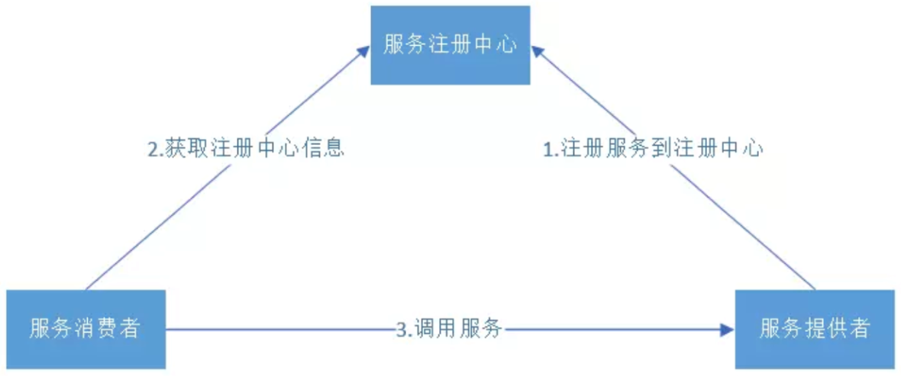

# SpringCloud

## CAP

分布式CAP是指在一个分布式系统中，一致性（Consistency）、可用性（Availability）、分区容错性（Partition tolerance）这三个原则的取舍问题。根据CAP定理，在一个分布式系统中，最多只能同时满足一致性、可用性和分区容错性中的两项，不能同时满足这三项。因此，可以根据实际情况在这三个原则中进行取舍。

其中，一致性（C）指在分布式系统中的所有数据备份，在同一时刻是否同样的值，即写操作之后的读操作，必须返回该值。可用性（A）指在集群中一部分节点故障后，集群整体是否还能响应客户端的读写请求。分区容错性（P）以实际效果而言，分区相当于对通信的时限要求。

在分布式系统中，这三个原则的取舍取决于系统的需求和设计。例如，对于一些需要高一致性和可用性的系统，可能会选择CP方案，即牺牲分区容错性来保证一致性和可用性。而对于一些需要高分区容错性的系统，可能会选择AP方案，即牺牲一致性和可用性来保证分区容错性。

总之，分布式CAP是一个非常重要的概念，它反映了在分布式系统中设计和取舍的一致性、可用性和分区容错性的权衡问题。

## 微服务

### 简介

将单一应用程序划分成多个微小的服务， 每个服务完成单一功能，这样的每个服务叫做一个微服务

### 架构

是一种架构模式

- 将应用的每个功能放到一个独立的服务中，每个服务对应一个进程
- 使用一组小型服务来开发单个应用，每个服务运行在独立的进程中，服务与服务之间通过HTTP的方式进行互相通信
- 每个服务都是一个可独立替换和独立升级的软件单元， 并且能够被独立的部署到生产环境

优点：

- 分而治之：单个服务功能内聚，复杂性低，方便团队的拆分和管理
- 可伸缩：能够单独的对指定的服务进行伸缩
- 迭代周期短：支持快速的迭代开发
- 独立部署，独立开发

缺点：

- 运维要求高：应用流程通常跨多个微服务，不易进行问题的定位
- 分布式的复杂性：微服务需要使用分布式，而由于分布式本身的复杂性，导致微服务架构也变得复杂起来

## SpringCloud

### 简介

- SpringCloud是一套完整的微服务解决方案，基于SpringBoot框架

- SpringCloud是一系列框架的有序集合，它利用SpringBoot的开发便利性简化了分布式系统的开发

- SpringCloud为开发人员提供了快速构建分布式系统的一些工具，如服务发现注册、配置中心、消息总线、负
  载均衡、断路器、数据监控等

### 技术栈

| 微服务内容       | 技术实现           |
| ---------------- | ------------------ |
| 服务的注册与发现 | Eureka             |
| 服务的接口调用   | Feign              |
| 服务的熔断器     | Hystrix            |
| 服务网关         | Zuul               |
| 负载均衡         | Ribbon             |
| 服务监控         | Zabbix             |
| 全链路跟踪       | ZipKin             |
| 配置管理         | Archaius           |
| 服务的配置中心   | SpringCloud Config |
| 数据流操作       | SpringCloud Stream |
| 事件、消息总线   | SpringCloud Bus    |

微服务之间通过HTTP的方式进行互相通信，此时Web API的设计就显得非常重要，会使用Restful API设计方式

## Eureka

Eureka是一个基于REST的服务，主要用于服务的注册和发现，以达到负载均衡和中间层服务故障转移的目的。作用与zookeeper类似，都可以作为服务注册中心。



**执行流程：**

1. 服务提供者在启动时，向注册中心注册自己提供的服务
2. 服务消费者在启动时，向注册中心订阅自己所需的服务
3. 注册中心返回服务提供者地址给消费者
4. 服务消费者从提供者地址中访问提供者

**两个组件：**

- Eureka Server 服务端
  指的是服务注册中心，提供服务的注册和发现
  **注册中心会存储所有可用服务节点的信息**，服务节点的信息可以在界面中直观的看到
- Euraka Client 客户端
  指的是服务提供者和消费者，在应用程序启动时会和服务端进行交互，注册或订阅服务

### EurekaServer

搭建服务注册中心

**步骤：**

1. 创建项目，勾选Eureka Server

2. 编辑pom.xml文件，配置依赖

   ```xml
   <parent>
       <groupId>org.springframework.boot</groupId>
       <artifactId>spring-boot-starter-parent</artifactId>
       <!-- 修改springboot版本为2.0.6.RELEASE -->
       <version>2.0.6.RELEASE</version>
   	<relativePath/>
   </parent>
   
   <properties>
       <!-- 修改springcloud版本为Finchley.SR1 -->
       <spring-cloud.version>Finchley.SR1</spring-cloud.version>
   </properties>
   ```

3. 编辑application.yml文件，配置eureka

   ```yml
   server:
     port: 7001
   eureka:
     client:
       # 是否将自己注册到Eureka-Server中，默认的为true
       register-with-eureka: false
       # 是否从Eureka-Server中获取服务提供者的注册信息，默认为true
       fetch-registry: false
       # 设置服务注册中心的地址
       service-url:
         defaultZone: http://localhost:${server.port}/eureka/
   ```

4. 编辑启动类，启用Eureka服务器

   ```java
   @SpringBootApplication
   @EnableEurekaServer // 启用Eureka服务器
   public class CloudEureka7001Application {
       public static void main(String[] args) {
       	SpringApplication.run(CloudEureka7001Application.class, args);
       }
   }
   ```

5. 访问Eureka­Server服务管理平台
通过浏览器访问 localhost:7001

### Eureka­Client

注册一个user-provider服务

**步骤：**

1. 编辑pom.xml文件，配置Eureka­Client依赖

   ```xml
   <dependency>
       <groupId>org.springframework.cloud</groupId>
       <artifactId>spring-cloud-starter-netflix-eureka-client</artifactId>
   </dependency>
   ```

   注：如果是新建项目，可以勾选Eureka Discovery Client

2. 编辑application.yml文件，配置eureka

   ```yml
   server:
     port: 8001
   spring:
     application:
       # 应用名，在注册中心显示的服务名
       name: user-provider
   eureka:
     client:
       # 指定服务注册中心的地址
       service-url:
         defaultZone: http://localhost:7001/eureka/
   ```

3. 编辑启动类，启用Eureka客户端

   ```java
   @SpringBootApplication
   @EnableEurekaClient // 启用Eureka客户端
   public class CloudProvider8001Application {
       public static void main(String[] args) {
       	SpringApplication.run(CloudProvider8001Application.class, args);
       }
   }
   ```

### 自我保护机制

在某个时刻，如果某个服务不可用了，Eureka不会立即的清理该服务， 依旧会对该服务的信息进行保存。

默认情况下，微服务在Eureka上注册后，会每30秒发送心跳包，Eureka通过心跳来判断服务是否健康，如果Eureka的Server在一定时间内（默认90s），没有接收到某个微服务实例的心跳，将会注销该实例。

但是当网络发生故障时，通常会导致Eureka Server在短时间内无法收到微服务的心跳，但微服务自身是正常的，只是网络通信出现了故障。

考虑到这种情况，Eureka设置了一个阀值，当心跳失败的比例在15分钟之内低于85%时，Eureka Server认为很大程度上出现了网络故障，将不再删除心跳过期的微服务，尽可能的保护这些注册信息，自动进入自我保护模式。

当网络故障被解决时，服务将自动退出 自我保护模式。

可以关闭自我保护机制 `eureka.server.enable­-self-­preservation=false`

## Feign

### 简介

Feign是一个HTTP客户端，可以更快捷、优雅地调用HTTP服务，使编写HTTPClient变得更简单。

在Spring Cloud中使用Feign非常简单，只需要创建一个接口，然后在接口上添加一些注解就可以了。

### 用法

**步骤：**

1. 编辑pom.xml文件，配置Feign和Eureka­Client依赖

   ```xml
   <dependency>
       <groupId>org.springframework.cloud</groupId>
       <artifactId>spring-cloud-starter-openfeign</artifactId>
   </dependency>
   <dependency>
       <groupId>org.springframework.cloud</groupId>
       <artifactId>spring-cloud-starter-netflix-eureka-client</artifactId>
   </dependency>
   ```

2. 编辑application.yml文件，配置eureka  

   ```yml
   eureka:
     client:
       # 是否将自己注册到Eureka-Server中，默认的为true
       register-with-eureka: false
       # 指定服务注册中心的地址
       service-url:
         defaultZone: http://localhost:7001/eureka/
   ```

3. 编辑启动类，启用Eureka客户端  

   ```java
   @SpringBootApplication
   @EnableEurekaClient
   // 启用Feign客户端，扫描指定包下所有的feign注解
   @EnableFeignClients(basePackages = "com.itany.service")
   public class CloudConsumer8080Application {
       public static void main(String[] args) {
       	SpringApplication.run(CloudConsumer8080Application.class, args);
       }
   }
   ```

4. 创建接口并配置  

   ```java
   // 调用的服务名，到Eureka中寻找对应的微服务
   @FeignClient("user-provider")
   public interface UserService {
       
       @GetMapping("/users")
       public ResponseResult getUserList();
           
       @GetMapping("/users/{id}")
       public ResponseResult getUser(@PathVariable(value = "id") Integer id);
           
       @PostMapping("/users")
       public ResponseResult postUser(@RequestParam("username") String username,@RequestParam("password") String password);
           
       @DeleteMapping("/users/{id}")
       public ResponseResult deleteUser(@PathVariable(value = "id") Integer id);
           
       @PutMapping("/users")
       public ResponseResult putUser(@RequestParam Map<String,Object> map);
   }
   ```

### 传参

feign传递对象参数的解决方式：

- 方式一：将对象参数拆为多个简单类型参数，且必须添加@RequestParam注解
- 方式二：使用Map替代对象参数，且必须添加@RequestParam注解  

## Hystrix  

### 服务熔断和服务降级

服务雪崩：在微服务架构中服务之间会相互调用和依赖，如果某个服务发生故障，可能会导致多个服务故障，从而导致整个系统故障  

**解决服务雪崩的方式：**

- 服务熔断

  当服务出现不可用或响应超时时，为了防止整个系统出现雪崩， 暂时停止对该服务的调用，直接返回一个结果，快速释放资源。

  如果检测到目标服务情况好转，则恢复对目标服务的调用。

- 服务降级

  为了防止核心业务功能出现负荷过载或者响应慢的问题，将非核心服务进行降级，暂时性的关闭或延迟使用，保证核心服务的正常运行

### 简介

Hystrix就是用来实现服务熔断的，其实就是一种机制，当某个服务不可用时，可以阻断故障的传播，称为断路器或熔断器。

- Hystrix负责监控服务之间的调用情况，当出现连续多次调用失败的情况时会进行熔断保护
- 该服务的断路器就会打开，直接返回一个由开发者设置的fallback（退路）信息
- Hystrix会定期再次检查故障的服务，如果故障服务恢复，将继续使用服务  

### 用法

断路器是安装在服务消费者上的，我们需要做的是在服务消费者上开启断路器并配置。

在Feign中使用Hystrix是非常简单的，已经包含了整合Hystrix的依赖

**步骤：**

1. 编辑application.yml文件，启用断路器  

   ```yml
   # 启用断路器
   feign:
     hystrix:
       enabled: true
   ```

2. 设置fallback信息

   在@FeignClient注解中指定fallback参数  

   ```java
   // 调用的服务名，到Eureka中寻找对应的微服务，找到的是：微服务的ip:port
   @FeignClient(value = "user-provider",fallback = UserServiceFallback.class)
   public interface UserService {
       ...
   }
   ```

   创建UserService接口的实现类，并配置返回的信息  

   ```java
   @Service
   public class UserServiceFallback implements UserService {
       @Override
       public ResponseResult getUserList() {
           System.out.println("断路器开启。。。。。。UserServiceFallback.getUserList");
           return ResponseResult.fail("获取用户列表失败");
       } 
                            
       @Override
       public ResponseResult getUser(Integer id) {
       	return ResponseResult.fail("获取指定用户失败");
       } 
                              
       @Override
       public ResponseResult postUser(String username, String password) {
       	return ResponseResult.fail("添加用户失败");
       }
   }
   ```

   3. 测试

      当服务提供者不可用或出现异常时，会暂时停止对该服务的调用  

## Zuul

### 简介

Zuul是一个路由网关Gateway，包含两大功能：

- 对请求的路由
  将外部的请求转发到具体的微服务实例上，是实现外部访问统一入口的基础
- 对请求的过滤
  对请求的处理过程进行干预，是实现请求校验、服务聚合等功能的基础

将Zuul和Eureka进行整合，把Zuul自身注册为Eureka服务治理下的应用，同时从Eureka中获得其他微服务的信息，对于微服务的访问都要通过Zuul进行跳转。  

### 用法

Zuul本身也是一个项目，一个最终也会注册到Eureka中的微服务

**步骤：**

1. 创建项目，勾选Zuul和Eureka Discovery Client  

2. 编辑pom.xml文件，配置依赖  

   ```xml
   <dependency>
       <groupId>org.springframework.cloud</groupId>
       <artifactId>spring-cloud-starter-netflix-eureka-client</artifactId>
   </dependency>
   <dependency>
       <groupId>org.springframework.cloud</groupId>
       <artifactId>spring-cloud-starter-netflix-zuul</artifactId>
   </dependency>
   ```

3. 编辑application.yml文件，配置eureka和zuul

   ```yml
   server:
     port: 6001
     
   spring:
     application:
       name: zuul-gateway
       
   eureka:
     client:
       service-url:
         defaultZone: http://localhost:7001/eureka/
         
   # 路由相关配置
   zuul:
     # 请求前缀
     prefix: /v2
     # 配置路由表
     routes:
       # 对于每个微服务，可以指定一个唯一的key值，该值可以任意指定
       user:
         # 将/user-service/开头的请求映射到user-provider这个微服务上
         path: /user-service/**
         serviceId: user-provider
   ```

4. 编辑启动类，启用Zuul  

   ```java
   @SpringBootApplication
   @EnableZuulProxy // 启用Zuul
   public class CloudZuul6001Application {
       public static void main(String[] args) {
       	SpringApplication.run(CloudZuul6001Application.class, args);
       }
   }
   ```

5. 修改cloud­-consumer的UserService，通过Zuul访问微服务，相当于是代理

   ```java
   // 调用的服务名，到Eureka中寻找对应的微服务，找到的是：微服务的ip:port
   // @FeignClient(value = "user-provider",fallback = UserServiceFallback.class)
   // 所有微服务的访问都要通过Zuul进行路由跳转
   @FeignClient(value = "zuul-gateway",fallback = UserServiceFallback.class)
   // 避免idea提示找不到该组件
   @Service
   public interface UserService {
       // @GetMapping("/users")
       @GetMapping("/v2/user-service/users")
       public ResponseResult getUserList();
   ```

6. 测试  

## Ribbon

### 简介

Ribbon是一套客户端负载均衡的工具，用于实现微服务的负载均衡 Load Balance。

Ribbon不需要独立部署，Feign集成了Ribbon，自动的实现了负载均衡。  

### 用法

**步骤：**

1. 搭建Provider集群

   拷贝 cloud-­provider-­8001 为 cloud­-provider-­8002 和 cloud­-provider-­8003

   - 修改pom.xml中名称

   - 修改主启动类的类名

   - 修改application.yml配置：端口号和instance-­id不相同  

   ```yml
   server:
     port: 8002 # 不同的端口
     
   spring:
     application:
       name: user-provider # 相同的服务名
       
   eureka:
     client:
       service-url:
         defaultZone: http://localhost:7001/eureka/
     instance:
       instance-id: user-provider8002 # 不同的实例id
   ```

2. 测试负载均衡

   默认使用的是轮询的策略

   常见的策略：

   - 轮询 (RoundRobinRule) 
   - 随机 (RandomRule)
   - 响应时间权重（WeightedResponseTimeRule）响应时间越短的服务器被选中的可能性大
   - 并发量最小可用（BestAvailableRule）选取最少并发量请求的服务器

3. 改变负载均衡策略

   在Zuul服务中，通过配置类指定要应用的负载均衡策略

   ```java
   @Configuration
   public class RibbonConfig {
       @Bean
       public IRule ribbonRule(){
       	return new RandomRule();
       }
   }
   ```

   


