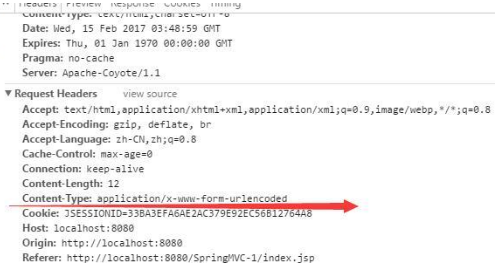
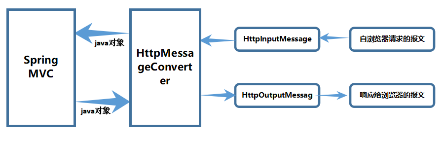

# SpringMVC

## MVC

Web应用架构，思想是将所有客户端请求全部交由控制器，由控制器将其分发处理并将结果响应给客户端。

## SpringMVC原理


- DispatcherServlet

  SpringMVC核心控制器：前端控制器，主要作用是用来分发

- HandlerMapping

  映射处理器：根据请求url映射到具体的处理Handler

- HandlerAdapter

  适配处理器：用来适配不同的处理器Handler

  处理器有两种实现方式：实现接口、基于注解，所以执行之前需要先适配

- Handler

  处理器：执行处理具体业务，并产生数据模型Model和视图名View

  Handler就是Controller层的实现类，也称为Action或Controller

  Handler会将数据模型Model和视图名View封装成ModelAndView对象并返回

- ViewResolver

  视图解析器：根据视图名解析为具体的视图，一般多为jsp页面，然后封装为View对象

- View

  视图：使用具体的视图技术进行渲染，将Model模型数据渲染到页面上

  视图有很多种形式：jsp、freemarker、velocity、excel、pdf等

## SpringMVC程序

```xml
//依赖整合包
<dependency>
    <groupId>org.springframework</groupId>
    <artifactId>spring-webmvc</artifactId>
</dependency>
```

### web.xml

```xml
<!-- 1.配置DispatherServlet，核心控制器 -->
<servlet>
    <servlet-name>springMVC</servlet-name>
    <servlet-class>org.springframework.web.servlet.DispatcherServlet</servlet-class>
    <load-on-startup>1</load-on-startup>
    <init-param>
        <param-name>contextConfigLocation</param-name>
        <param-value>classpath:springmvc.xml</param-value>
    </init-param>
</servlet>
<servlet-mapping>
    <servlet-name>springMVC</servlet-name>
    <url-pattern>/</url-pattern>
</servlet-mapping>
```

### springmvc.xml

核心配置文件

位置命名：

1. 使用默认位置，默认在WEB-­INF/目录下，名称为： 核心Servlet名称­-servlet.xml(如上述servlet-name为springMVC，默认为springMVC-servlet.xml)
2. 自定义位置，名称自定义springmvc.xml

配置方式：

根据Controller实现方式的不同，有两种方式定义Controller:

1. 实现接口
2. 基于注解

#### 实现接口

```java
//实现接口的Controller
//访问路径http://ip:port/hello
public class HelloController implements Controller {
    @Override
    public ModelAndView handleRequest(HttpServletRequest req,HttpServletResponse resp) throws Exception {
        String name = req.getParameter("name");
        ModelAndView mav=new ModelAndView();
        mav.addObject("msg","Hello "+name);
        mav.setViewName("hello");
        return mav;
    }
}
```

```xml
<!-- 2.配置HandlerMapping -->
<bean class="org.springframework.web.servlet.handler.BeanNameUrlHandlerMapping"/>
<!-- 3.配置HandlerAdapter -->
<bean class="org.springframework.web.servlet.mvc.SimpleControllerHandlerAdapter"/>
<!-- 4.配置Handler -->
<bean name="/hello" class="controller.HelloController"/>
<!-- 5.配置ViewResolver -->
<bean class="org.springframework.web.servlet.view.InternalResourceViewResolver">
    <property name="prefix" value="/WEB-INF/view/"/>
    <property name="suffix" value=".jsp"/>
    <!-- 6.配置View，使用jsp视图技术渲染页面 -->
    <property name="viewClass" value="org.springframework.web.servlet.view.JstlView"/>
</bean>
```

#### 基于注解

```java
//基于注解的Controller
@Controller
public class HelloAnnotationController {
    @RequestMapping("/hello")
    public ModelAndView sayHello(String name){
        ModelAndView mav=new ModelAndView();
        mav.addObject("msg","您好 "+name);
        mav.setViewName("hello");
        return mav;
    }
}
```

```xml
<!-- 2.配置HandlerMapping -->
<!-- <bean class="org.springframework.web.servlet.mvc.method.annotation.RequestMappingHandlerMapping"/> -->
<!-- 3.配置HandlerAdapter -->
<!-- <bean class="org.springframework.web.servlet.mvc.method.annotation.RequestMappingHandlerAdapter"/> -->

<!-- mvc的注解驱动，用来简化配置 -->
<mvc:annotation-driven/>

<!-- 4.配置Handler -->
<context:component-scan base-package="controller"/>
<!-- 5.配置ViewResolver -->
<bean class="org.springframework.web.servlet.view.InternalResourceViewResolver">
    <property name="prefix" value="/WEB-INF/view/"/>
    <property name="suffix" value=".jsp"/>
    <!-- 6.配置View,如果是jsp视图技术，可以省略不写 -->
    <!-- <property name="viewClass" value="org.springframework.web.servlet.view.JstlView" /> -->
</bean>
```

#### 其他常用配置

```xml
//springMVC.xml
<!-- 静态资源处理:当配置DispatcherServlet为 <url-pattern>/</url-pattern> 时，会拦截所有请求（包括静态资源），导致所有静态资源都无法访问 -->
    <!--使用tomcat提供的默认Servlet来处理静态资源
        1.如果使用的不是tomcat，则可能不生效，与tomcat耦合
        2.只能读取webapp下的资源，无法读取/WEB-INF/下的资源 -->
    <mvc:default-servlet-handler/>
    
    <!-- 使用SpringMVC提供的处理方式-->
    <mvc:resources mapping="/image/**" location="/WEB-INF/img/"/>
    <mvc:resources mapping="/css/**" location="/WEB-INF/css/"/>
    <mvc:resources mapping="/js/**" location="/WEB-INF/js/"/>


<!-- 直接访问jsp页面:默认不能直接访问WEB-INF目录下的jsp页面，一般都是在Controller中做转发映射，也可以直接配置 -->
<mvc:view-controller path="/userLogin" view-name="login"/>
```

## Controller详解

1. 方法返回值
2. 方法请求URL
3. 方法请求参数

### 方法返回值

有四种类型：

- ModelAndView 表示返回的为数据模型和视图

- String 表示返回的是视图

  三种写法(形式)：

  - 普通字符串——>表示视图名称
  - "forward:"+url——>转发
  - "redirect:"+url——>重定向

- void 将请求的url作为视图名称，很少使用

- Object 表示返回的是数据模型（一般返回的是json数据）

### 方法请求URL

#### URL写法

请求映射路径有三种写法：

- Ant风格（较少使用）
  - `/*`表示单层目录，匹配任意字符，可以没有字符，但正斜杠必须有
  - `**` 表示多层或单层目录，可以没有字符，正斜杠也可以没有
  - `?` 表示单个字符，必须有一个字符

- Rest风格
  - `{变量}`表示URL中的占位符，可以结合@PathVariable获取值
  - `{变量:正则}`表示使用正则表达式来限定值的格式

- 固定写法

  value和path互为别名，值为数组，可以指定多个值

```JAVA
//http://localhost:8080/test/s/aa/qwe/bvc/d
@RequestMapping("test/?/aa/*/b?c/**/d")
public String test(){
    return "hello";
}

@RequestMapping("test/{id:\\d+}/{name}")
public String test(@PathVariable String id,@PathVariable("name") String username){
    return "hello";
}

@RequestMapping(value={"/test","t"})
public String test(){
    return "hello";
}
```

#### @RequestMapping

将 HTTP 请求映射到控制器（controller类）的处理方法上，如果请求URL有后缀，如请求/rest.do、/rest.action、/rest先精确匹配，如果找不到，那么@RequestMapping("/rest")就会生效

##### 配置请求映射路径URL(value)

配置URL时以/开头和不以/开头的请求没什么区别，在转发中有区别：

- 添加时表示从项目根路径开始查找
- 不添加时表示从当前方法所在层级开始查找

```java
@Controller
@RequestMapping("/path")
public class Path1Controller{
    @RequestMapping("/showLogin")
    public String showLogin(){
        return "login";
    }
    
    @RequestMapping("/forwardLogin")
    public String showLogin(){
        //转发相对于/path下的Path1Controller的showlogin
        return "forward:showLogin";
        //转发Path2Controller的showlogin
        return "forward:/showLogin";
        //转发Path1Controller的showlogin
        return "forward:/path/showLogin";
    }
}

@Controller
public class Path2Controller{
    @RequestMapping("/showLogin")
    public String showLogin(){
        return "login";
    }
}
```

##### 根据请求方式访问(method)

限定请求方式：GET、POST、PUT、DELETE等

```java
//@RequestMapping(path = "/user/{id}",method = RequestMethod.GET)
@GetMapping("/user/{id}")
public String deleteUser(@PathVariable Integer id){
    return "hello";
} 

//@RequestMapping(path = "/user/{id}",method = RequestMethod.POST)
@PostMapping("/user/{id}")
public String selectUser(@PathVariable Integer id){
    return "hello";
}
```

##### 限定请求参数(params)

```java
//请求参数中必须包括id，且username必须等于admin,password不等于123
@RequestMapping(path="/test",params={"id","username=admin","password!=123"})
```

##### 限定请求的头部(headers)

```java
@RequestMapping(path="/test",headers={"Cookie","Accept-Language=zh-CN,zh;q=0.8"})
```

##### 指定请求的提交内容类型(consumes)

指定Content-Type的值

```java
@PostMapping(path="/test",consumes="application/json")
```

##### 指定返回的内容类型(produces)

 仅当request请求头中的(Accept)类型中包含该指定类型才返回

```java
@PostMapping(path="/test",produces="application/json")
```

###### 浏览器请求头Accept

其中Accept中 ：`application/xml;q=0.9, */*;q=0.8`

`*/*`该项表明可以接收任何MIME类型的;`application/json` 几种主流浏览器都可以自动解析。`q`是相对品质因子，范围 `0 =< q <= 1`，权重系数 q 值越大，请求越倾向于获得其`;`之前的类型表示的内容，若没有指定 q 值，则默认为1，若被赋值为0，则用于提醒服务器哪些是浏览器不接受的内容类型。



### 方法请求参数

#### JavaEE组件

- HttpServletRequest
- HttpServletResponse
- HttpSession

#### IO流

- InputStream/OutputStream
- Reader/Writer

#### 向界面传递数据

Model、Map、ModelMap

可以通过request.setAttribute(name, value)方法将数据存储到Request作用域中返回

```java
@RequestMapping("/test")
public String test(Model model,Map map,ModelMap modelMap){
    model.addAttribute("name","tom");
    map.put("age",20);
    modelMap.put("address","nanjing");
    modelMap.addAttribute("sex","male");
    return "result";
}
```

#### String和基本类型

- @RequestParam 表示参数来源于请求参数，默认所有参数都添加该注解，参数值来源于同名的请求参数
- @PathVariable 表示参数来源于URL
- @RequestHeader 表示参数来源于请求头
- @CookieValue 表示参数来源于Cookie
- @RequestBody 表示参数来源于请求体（只有post请求才会有）

```java
//形参前无配置默认省略@RequestParam,此时可以不传值，但是添加了@RequestParam则必须传值
//或者@RequestParam配置属性required=false可以不传，这时可以同时配置defaultVlaue当不传值的时候为默认值
@RequestMapping("/test")
public String test(@Requestparam(name="name",required=false,defaultValue="admin") String username,int age){
    return "result";
}

//默认情况下如果url结尾有后缀，会被自动截取掉,比如{filename}为传值/123.jpg,参数只接收123
@RequestMapping("/test/{name}/{age}/{filename}")
public String test(@PathVariable("name") String username,int age,String filename){
    return "result";
}

//cookie值为cookie:username=admin;JSESSIONID=dhbaisbdihasbashbda454
@RequestMapping("/test")
public String test(@RequestHeader("User-Agent") String userAgent,@RequestHeader("Cookie") String cookie){
    return "result";
}

@RequestMapping("/test")
public String test(@CookieValue String username,@CookieValue("JSESSIONID") String sessionId){
    return "result";
}

//post请求，rebo值为username=lisi&password=123
@RequestMapping("/test")
public String test(@RequestBody String rebo){
    return "result";
}
```

#### 自定义类型

@ModelAttribute 将请求数据转换为对象

条件：对象的属性名必须与请求中元素的名称相同

@ModelAttribute注解有两种用法：

- 在方法参数的前面添加该注解，可省略		

  作用：将请求参数转换为对象

- 在方法的上面添加该注解

  作用：在调用所有目标方法前都会调用添加@ModelAttribute注解的方法，并向模型中添加数据

```java
//userVo值为userVo{username='aaa',password='123',phone='12345678912',email='aaa@163.com',age=21}
@RequestMapping("/regist")
public String regist(@ModelAttribute UserVo userVo){
    return "success";
}


//执行此controller中其他任何一个方法都会先调用@ModelAttribute注解的方法，并以注解中的字段作为key，将方法返回值作为value添加到request作用域中
@Controller
@RequestMapping("/user")
public class UserController{
    @RequestMapping("/regist")
    public String regist(@ModelAttribute UserVo userVo){
        return "success";
    }
    
    @ModelAttribute("types")
    public List<String> getTypes(){
        List<String> list=Arrays.asList("服装","数码","商品");
        return list;
    }
}
```

#### 错误参数

Errors、BindingResult

用来接受错误信息，实现服务端的数据校验

实际开发中，既要做客户端表单校验，又要做服务端数据校验

```java
@Controller
@RequestMapping("/user")
public class UserController {
    @RequestMapping("/regist")
    public String regist(ModelAttribute UserVo userVo,Errors errors){
        //手动进行服务端数据校验
        if(userVo.getAge()<0|| userVo.getAge()>120){
            errors.reject("年龄只能在0-120之间"); //手动添加错误消息
        }

        //判断是否有错误
        if(errors.hasErrors()){
            System.out.println(errors);//服务端校验的错误消息一般只在后台处理
            return "regist";
        }
        System.out.println("UserController.regist,userVo:"+userVo);
        return "success";
    }

    @ModelAttribute("types")
    public List<String> getTypes(){
        System.out.println("UserController.getTypes");
        List<String> list = Arrays.asList("服装", "数码", "食品");
        return list;
    }
}
```

#### @SessionAttributes

作用：将模型中指定名称的数据存储到session中,并且该注解只能放在类的上面，而不能修饰方法。

`@SessionAttributes(value={"xxx"}, types={xxxx.class})`

- value：是通过键来指定放入HttpSession 的域中的值；
- types：是通过类型指定放入HttpSession 的域中的值；这个注解会将类中所有放入Request域中的对象同时放进HttpSession的域空间中

```java
@Controller
@RequestMapping("/session")
//分步页面将数据依次存储到session域的userVo对象中
@SessionAttributes("userVo")
public class SessionController {
    @RequestMapping("/step1")
    public String step1(){
        return "step1";
    }
    @RequestMapping("/step2")
    public String step2(UserVo userVo){
        System.out.println("SessionController.step2,"+userVo);
        return "step2";
    }
    @RequestMapping("/step3")
    public String step3(UserVo userVo){
        System.out.println("SessionController.step3,"+userVo);
        return "step3";
    }
    @RequestMapping("/regist")
    public String regist(UserVo userVo,HttpSession session){
        System.out.println(session.getAttribute("userVo"));
        System.out.println("SessionController.regist,"+userVo);
        return "success";
    }
}
```

```jsp
//step1.jsp
<%@ page contentType="text/html;charset=UTF-8" language="java" %>
<html>
<head>
    <title></title>
</head>
<body>
    <h2>用户注册</h2>
    <form action="${pageContext.request.contextPath}/session/step2" method="post">
        用户名：<input type="text" name="username"> <br>
        密码：<input type="password" name="password"> <br>
        <input type="submit" value="下一步">
    </form>
</body>
</html>

//step2.jsp
<%@ page contentType="text/html;charset=UTF-8" language="java" %>
<html>
<head>
    <title></title>
</head>
<body>
    <h2>用户注册</h2>
    <form action="${pageContext.request.contextPath}/session/step3" method="post">
        手机号：<input type="text" name="phone"> <br>
        邮箱：<input type="text" name="email"> <br>
        <input type="submit" value="下一步">
    </form>
</body>
</html>


//step3.jsp
<%@ page contentType="text/html;charset=UTF-8" language="java" %>
<html>
<head>
    <title></title>
</head>
<body>
    <h2>用户注册</h2>
    <form action="${pageContext.request.contextPath}/session/regist" method="post">
        年龄：<input type="text" name="age"> <br>
        地址：<input type="text" name="address"> <br>
        <input type="submit" value="注册">
    </form>
</body>
</html>
```

## 服务端数据校验

### JSR303校验

JSR303是一个数据验证的标准规范，用于对Java Bean中的属性进行校验，称为Bean Validation，提供了常用的校验注解

### Hibernate Validator

是JSR303的一个参考实现，并提供了扩展注解

### 依赖包

```xml
<dependency>
    <groupId>org.hibernate</groupId>
    <artifactId>hibernate-validator</artifactId>
</dependency>
<dependency>
    <groupId>org.hibernate</groupId>
    <artifactId>hibernate-validator-annotation-processor</artifactId>
</dependency>
 
//SpringBoot依赖 
<dependency>
    <groupId>org.springframework.boot</groupId>
    <artifactId>spring-boot-starter-validation</artifactId>
</dependency>
```

### 验证注解

当不符合要求时就会在方法中返回message 的错误提示信息

```java
public class UserVo {
    @NotEmpty(message = "用户名不能为空")
    @Pattern(regexp = "\\w{6,10}",message = "用户名只能包含数字、字母、下划线，且长度为6-10位")
    private String username;
    
    @Length(min = 4,max = 10,message = "密码必须为4-10位")
    private String password;

    @Pattern(regexp = "(139|133|131)\\d{8}",message = "手机号码格式不正确")
    private String phone;

    @Email(message = "邮箱格式不正确")
    private String email;

    @Range(min = 1,max = 120,message = "年龄必须在1-120之间")
    private Integer age;

    private Address address;
}
```

**空检查**

- @Null	限制只能为null
- @NotNull	限制必须不为null
- @NotEmpty	验证注解的元素值不为null且不为空（字符串长度不为0、集合大小不为0）
- @NotBlank	验证注解的元素值不为空(不为null、去除首位空格后长度为0),不同于@NotEmpty，@NotBlank只应用于字符串且在比较时会去除字符串的空格

**Boolean检查**

- @AssertFalse	限制Boolean 对象必须为false
- @AssertTrue	限制Boolean 对象必须为true

**数值检查**

- @DecimalMax(value)	限制必须为一个不大于指定值的数字， 这个约束的参数是一个通过BigDecimal定义的最大值的字符串表示.小数存在精度 
- @DecimalMin(value)	限制必须为一个不小于指定值的数字， 这个约束的参数是一个通过BigDecimal定义的最小值的字符串表示.小数存在精度 

- @Max(value)，标注数字，限制必须为一个不大于指定值的数字
- @Min(value)，标注数字，限制必须为一个不小于指定值的数字

**日期检查**

- @Future 限制必须是一个将来的日期
- @Past	限制必须是一个过去的日期

**长度检查**

- @Length(min=, max=)，标注属性（String），检查字符串长度是否符合范围
- @Size(max,min)	限制字符长度必须在min到max之间

**其他**

- @Pattern(regex="regexp", flag=)	限制必须符合指定的正则表达式
- @Email	验证注解的元素值是Email，也可以通过正则表达式和flag指定自定义的email格式


### 错误处理

1. 使用ValidatorFactory 进行手动参数校验，具体参考[Java @Valid 注解详解 校验实体属性（Java Bean Validation）](https://blog.csdn.net/weixin_43740223/article/details/100889250)
2. 使用@Valid+errors/bindingResult，无需手动配置，需要处理报错信息
3. 使用@Valid+@ControllerAdvice，对报错信息进行统一处理

#### 使用@Valid+errors/bindingResult

```java
//使用errors
@RequestMapping("/regist")
public String regist(@Valid UserVo userVo,Errors errors){
    //判断是否有错误
    if(errors.hasErrors()){
        System.out.println(errors);//服务端校验的错误消息一般只在后台处理
        return "regist";
    }
    return "success";
}
 
//使用bindingResult
@PostMapping("/bindingResult")
public Object addUserVo(@RequestBody @Valid UserVo UserVo, BindingResult bindingResult){
    if (bindingResult.hasErrors()){
        //校验结果以集合的形式返回，当然也可以获取单个
        List<FieldError> fieldErrorList = bindingResult.getFieldErrors();
        //StringBuilder组装异常信息
        StringBuilder builder = new StringBuilder();
        //遍历拼装
        fieldErrorList.forEach(error -> {
            builder.append(error.getDefaultMessage() + lineSeparator);
        });
        builder.insert(0,"use @Valid n BingdingResult :" +lineSeparator);
        return builder.toString();
    }
    return "success";
}
```

.png)


#### @Valid和 @Validated的统一异常处理

```java
public class User {
    @NotBlank(message = "昵称不能为空")
    private String nickName;
    @NotBlank(message = "密码不能为空")
    private String password;
}
 
@PostMapping(value="/updateUser")
public Object updateUser(@RequestBody @Valid User user){
    user.setUserId(getLoginUser().getUserId());
    userService.updateUser(user);
    return SUCCESS;
}
 
/**
 * bean验证异常 requestParam参数
 */
@ExceptionHandler(BindException.class)
@ResponseBody
public Object validatedMethodArgumentNotValidException(BindException e)
{
    boolean flag=false;
    StringBuilder message=new StringBuilder();
    List<FieldError> fieldErrors = e.getBindingResult().getFieldErrors();
    for(FieldError fieldError:fieldErrors){
        message.append(flag?",":"").append(fieldError.getDefaultMessage());
        flag=true;
    }
    return dealHandle(message);
}

 /**
 * bean验证异常 requestbody参数
 */
@ExceptionHandler(MethodArgumentNotValidException.class)
@ResponseBody
public Object validatedMethodArgumentNotValidException(MethodArgumentNotValidException e)
{
    boolean flag=false;
    StringBuilder message=new StringBuilder();
    List<FieldError> fieldErrors = e.getBindingResult().getFieldErrors();
    for(FieldError fieldError:fieldErrors){
        message.append(flag?",":"").append(fieldError.getDefaultMessage());
        flag=true;
    }
    return dealHandle(message);
}
```

```java
@Validated
public class UserController{
  @GetMapping(value="/sendCode")
  public Object sendCode(@NotBlank(message="手机号不能为空") String phone){
    userService.sendCode(phone);
    return SUCCESS;
  }
}
 
/**
 * 非bean参数验证异常 requestParam参数
 */
@ExceptionHandler(ConstraintViolationException.class)
@ResponseBody
public Object validatedConstraintViolationExceptionException(ConstraintViolationException e)
{
    boolean flag=false;
    StringBuilder message=new StringBuilder();
    Set<ConstraintViolation<?>> constraintViolations = e.getConstraintViolations();
    for(ConstraintViolation constraintViolation:constraintViolations){
        message.append(flag?",":"").append(constraintViolation.getMessage());
        flag=true;
    }
    return dealHandle(message);
}
```

## 类型转换

数据绑定流程：获取值——>查找转换器——>转换——>后台校验——>数据绑定

两种解决方式：

- 使用PropertyEditor
- 使用Converter（推荐）

### 使用PropertyEditor

步骤：

1. 定义属性编辑器
2. 注册属性编辑器

@InitBinder

缺点：

- 代码嵌套在Controller层中
- 只能从字符串转换

```java
@RequestMapping("/regist")
public String regist(@Valid UserVo userVo,Errors errors){
    ...
}

public class Address {
    private String city;
    private String province;
}

//Spring提供了大量的编辑器实现类，诸如CustomDateEditor ，CustomBooleanEditor，CustomNumberEditor等
//自定义的属性编辑器
public class AddressEditor extends PropertyEditorSupport {
    @Override
    public String getAsText() {
        Address address = (Address) getValue();
        return "["+address.getCity()+"-"+address.getProvince()+"]";
    }
    
    //[南京-江苏]
    @Override
    public void setAsText(String text) throws IllegalArgumentException {
        Pattern pattern = Pattern.compile("\\[(.*)-(.*)\\]");
        Matcher matcher = pattern.matcher(text);
        if(matcher.matches()){
            String city = matcher.group(1);
            String province = matcher.group(2);
            Address address=new Address();
            address.setCity(city);
            address.setProvince(province);
            setValue(address);
        }
    }
}

//注册属性编辑器，
/*
    下面放在标注了@Controller的类中对这一个Controller下的所有Request都会起作用
    放在标注了@ControllerAdvice的类中对所有Controller都起作用
*/
@InitBinder
public void initBinder(WebDataBinder binder){
    SimpleDateFormat dateFormat=new SimpleDateFormat("yyyy-MM-dd");
    binder.registerCustomEditor(Date.class,new CustomDateEditor(dateFormat,true));
    binder.registerCustomEditor(Date.class,new CustomNumberEditor(Double.class,true));
    binder.registerCustomEditor(Address.class,new AddressEditor());
}

//springmvc.xml
<mvc:annotation-driven/>
```

```java
//使用注解代替@initBinder注解及注册方法
public class User{
    //此注解还可以直接标注在controller中方法接收参数前
    @DateTimeFormat(pattern="yyyy-MM-dd")
    private Date birthday;
}

//springmvc.xml
<bean id="conversionService" class="org.springframework.format.support.FormattingConversionServiceFactoryBean"/>
```

### 使用Converter

步骤：

1. 定义转换器，实现Converter接口

```java
public class String2AddressConverter implements Converter<String, Address>{
    @Override
    public Address convert(String source) {
        Pattern pattern = Pattern.compile("\\[(.*)-(.*)\\]");
        Matcher matcher = pattern.matcher(source);
        if(matcher.matches()){
            String city = matcher.group(1);
            String province = matcher.group(2);
            Address address=new Address();
            address.setCity(city);
            address.setProvince(province);
           return address;
        }else{
            throw new RuntimeException("地址转换失败");
        }
    }
}

public class Address2StringConverter implements Converter<Address,String> {
    @Override
    public String convert(Address address) {
        return "["+address.getCity()+"-"+address.getProvince()+"]";
    }
}
```

2. 管理自定义转换器

```xml
//springmvc.xml
<!-- 管理自定义转换器 -->
<bean id="conversionService" class="org.springframework.format.support.FormattingConversionServiceFactoryBean">
      <property name="converters">
             <set>
                    <bean class="converter.String2AddressConverter"/>
                    <bean class="converter.Address2StringConverter"/>
             </set>
      </property>
</bean>
```

3. 加载应用自定义管理器

```xml
<!-- mvc的注解驱动，用来简化配置，默认会加载许多内置的类型转换器，如果要使用自定义的类型转换器，需要自己指定-->
<mvc:annotation-driven conversion-service="conversionService"/>
```

### HttpMessageConverter

@RequestBody和@ResponseBody：通过这两个注解，可以在Controller中直接使用Java对象作为请求参数和返回内容，@RequestBody直接从请求体中获取对象参数，@ResponseBody将返回内容直接写入到Response对象的body数据区，从而绕过视图解析器，直接将数据响应给浏览器。其中完成**请求体、响应体中的数据和Java对象之间相应的数据格式转换**的就是HttpMessageConverter。



#### 原理

在使用`<mvc:annotation-driven/>`标签配置时，默认配置了RequestMappingHandlerAdapter，并内置了默认的HttpMessageConverter，默认HttpMessageConverter会加载7个实现的转换器，导入Jackson包后，自动加载第8个实现。当使用@RequestBody和@ResponseBody注解时，RequestMappingHandlerAdapter就使用它们来进行读取或者写入相应格式的数据。

**HttpMessageConverter常用实现类：**

1. `StringHttpMessageConverter`：支持的MediaType：`text/plain,*/*`，将请求信息转换为字符串；
2. `ByteArrayHttpMessageConverter`：支持的MediaType：`application/octet-stream,*/*`读写二进制数据；
3. `SourceHttpMessageConverter`：支持的MediaType：`application/xml,text/xml,application/*+xml`,读写javax.xml.transform.Source类型的数据；
4. `FormHttpMessageConverter` :支持的MediaType：`application/x-www-form-urlencoded,multipart/form-data`将表单数据读取到MultiValueMap中；
5. `ResourceHttpMessageConverter`：支持的MediaType：`*/*`,读写org.springframework.core.io.Resource对象；
6. `BufferedImageHttpMessageConverter`：读写BufferedImage对象；
7. `MappingJackson2HttpMessageConverter`：支持的MediaType：`application/json,application/*+json`,利用jackson开源包的objectMapper读写JSON数据。
8. `Jaxb2RootElementHttpMessageConverter`：支持的MediaType：`application/xml,text/xml,application/*+xml`

- 使用@RequestBody注解时根据Request对象header部分的Content-Type类型，逐一匹配合适的HttpMessageConverter来读取数据；
- 使用@ResponseBody注解时会根据Request对象header部分的Accept属性，逐一按accept中的类型，去遍历找到能处理的HttpMessageConverter实现类；

请求进来的时候的Accept属性：

.png)


## 统一异常处理

### 简介

对异常进行统一处理

两种方式：

- 使用web技术提供的统一异常处理
- 使用SpringMVC提供的统一异常处理

### 使用web技术的异常处理

```xml
//web.xml
<!-- 404异常 -->
<error-page>
    <error-code>404</error-code>
    <location>/404.jsp</location>
</error-page>
<!-- 500异常 -->
<error-page>
    <error-code>500</error-code>
    <location>/500.jsp</location>
</error-page>
```

### 使用SpringMVC的异常处理

步骤：

1. 定义一个异常处理类（通知），添加@ControllerAdvice
2. 定义异常处理方法，添加@ExceptionHandler

```java
//@ControllerAdvice注解作用在controller中所有配置了请求的方法中
@ControllerAdvice
public class ExceptionAdvice {
    @ExceptionHandler(ArithmeticException.class)
    public String arithmetic(Exception e){
        System.out.println("警报，程序出现异常："+e);
        return "error/arithmetic";
    }
    @ExceptionHandler(NullPointerException.class)
    public String nullpoint(Exception e){
        System.out.println("警报，程序出现异常："+e);
        return "error/nullpoint";
    }
    @ExceptionHandler(Exception.class)
    public String exception(Exception e){
        System.out.println("警报，程序出现异常："+e.getMessage());
        return "error/exception";
    }
}

@Controller
@RequestMapping("/exception")
public class ExceptionController {
    @RequestMapping("/test1")
    public String test1() throws Exception{
        int i=5/0;
        return "success";
    }
    @RequestMapping("/test2")
    public String test2() throws Exception{
        String str=null;
        str.toString();
        return "success";
    }
}
```

spring和springmvc容器中，相对路径都是相对于web应用的根目录`http://ip:port/contextpath`

## 拦截器

- 过滤器(Filter)：

  依赖于servlet容器，只在Servlet前后起作用。在实现上基于函数回调，可以对几乎所有请求进行过滤，但是缺点是一个过滤器实例只能在容器初始化时调用一次。使用过滤器的目的是用来做一些过滤操作，比如：在过滤器中修改字符编码；在过滤器中修改HttpServletRequest的一些参数，包括：过滤低俗文字、危险字符等。

- 拦截器(Interceptor)：

  Spring的一个组件，在实现上基于Java的反射机制，属于面向切面编程（AOP）的一种运用。归Spring管理配置在Spring的文件中，可以使用Spring内的任何资源、对象（可以粗浅的认为是IOC容器中的Bean对象），而Filter则不能使用访问这些资源；

```java
public class HelloInterceptor implements HandlerInterceptor {
    //调用目标处理方法之前执行，可以权限、日志等
    @Override
    public boolean preHandle(HttpServletRequest httpServletRequest, HttpServletResponse httpServletResponse, Object handler) throws Exception {
        if(handler instanceof  HandlerMethod){
            HandlerMethod handlerMethod = (HandlerMethod) handler; //参数hander本质上就是HandlerMethod实例，为响应的处理器返回值
            Object bean = handlerMethod.getBean();
            Method method = handlerMethod.getMethod();
            System.out.println("HelloInterceptor.preHandle,bean:" + bean.getClass() + ",method:" + method.getName() + ",args:" + Arrays.toString(method.getParameterTypes()));
        }
        return true; //true表示继续调用后续的拦截器或目标处理方法，false表示不再调用
    }

    //调用目标处理方法之后执行，渲染视图之前，可以对数据模型或视图进行修改
    @Override
    public void postHandle(HttpServletRequest httpServletRequest, HttpServletResponse httpServletResponse, Object o, ModelAndView modelAndView) throws Exception {
        System.out.println("HelloInterceptor.postHandle");
    }

    //渲染视图之后，返回响应前，可以用来释放资源
    @Override
    public void afterCompletion(HttpServletRequest httpServletRequest, HttpServletResponse httpServletResponse, Object o, Exception e) throws Exception {
        System.out.println("HelloInterceptor.afterCompletion");
    }
}
```

```xml
//springmvc.xml
<!-- 配置拦截器 -->
<mvc:interceptors>
      <!-- 拦截所有请求 -->
      <bean class="interceptor.HelloInterceptor"/>
      <!-- 拦截指定请求：先写拦截路径，然后排除路径，最后bean -->
      <mvc:interceptor>
             <mvc:mapping path="/user/regist"/>
             <mvc:mapping path="/login"/>
             <mvc:mapping path="/path/*"/>
             <mvc:exclude-mapping path="/path/test7"/>
             <bean class="interceptor.TimerInterceptor"/>
      </mvc:interceptor>
</mvc:interceptors>
```

HandlerInterceptorAdapter适配器，通过继承HandlerInterceptorAdapter抽象类，允许我们只实现三个方法中需要的回调方法


## 返回值封装

### @ResponseBody

为方法添加该注解后，将返回值写到响应体中

```java
@RequestMapping("/test1")
public void test1(HttpServletResponse resp) throws IOException {
    //@ResponseBody本质上就是response.getOutputStream()或response.getWriter()，直接输出到响应体
    resp.getWriter().write("success");
}

@RequestMapping("/test2")
@ResponseBody //将返回值写到响应体中，并不是跳转视图
public String test2(){
    return "success";
}

@RequestMapping("/getUser")
@ResponseBody
public User getUser(){
    User user = new User(1001, "汤姆", "123", 18);
    return user;
}
```

### 返回JSON

三种方式：

- jackson，SpringMVC默认支持
- gson，SpringMVC默认支持，google开发
- fastjson，SpringMVC默认不支持，alibaba开发

#### 使用jackson

```xml
<dependency>
    <groupId>com.fasterxml.jackson.core</groupId>
    <artifactId>jackson-databind</artifactId>
</dependency>

//springmvc.xml
<mvc:annotation-driven conversion-service="conversionService">
    <mvc:message-converters>
        <!-- 配置消息转换器,可以省略 -->
        <bean class="org.springframework.http.converter.json.MappingJackson2HttpMessageConverter"/>
    </mvc:message-converters>
</mvc:annotation-driven>
```

#### 使用gson

```xml
<dependency>
    <groupId>com.google.code.gson</groupId>
    <artifactId>gson</artifactId>
</dependency>

<mvc:annotation-driven conversion-service="conversionService">
    <mvc:message-converters>
        <!-- 配置消息转换器,可以省略 -->
        <bean class="org.springframework.http.converter.json.GsonHttpMessageConverter"/>
    </mvc:message-converters>
</mvc:annotation-driven>
```

#### 使用fastjson

```xml
<dependency>
    <groupId>com.alibaba</groupId>
    <artifactId>fastjson</artifactId>
</dependency>

<mvc:annotation-driven conversion-service="conversionService">
    <mvc:message-converters>
        <bean class="com.alibaba.fastjson.support.spring.FastJsonHttpMessageConverter">
            <property name="supportedMediaTypes" value="application/json"/>
        </bean>
    </mvc:message-converters>
</mvc:annotation-driven>
```

## 文件上传

### 依赖

```xml
<dependency>
    <groupId>commons-fileupload</groupId>
    <artifactId>commons-fileupload</artifactId>
</dependency>
```

### 表单

```html
//文件上传表单，必须用post请求
<form action="${pageContext.request.contextPath}/file/uploads" method="post" enctype="multipart/form-data">
    用户名：<input type="text" name="username"> <br>
    文件：<input type="file" name="files">
          <input type="file" name="files">
          <input type="file" name="files"><br>
    <input type="submit" value="上传">
</form>
```

enctype：规定了form表单在发送到服务器时候编码方式。他有如下的三个值

- application/x-www-form-urlencoded。默认的编码方式。但是在用文本的传输,大型文件的时候，使用这种编码就显得 效率低下。
- multipart/form-data 。 指定传输数据为二进制类型，比如图片、mp3、文件。
- text/plain。纯文体的传输。空格转换为 “+” 加号，但不对特殊字符编码。

### 配置

```xml
<!-- 配置文件解析器，将二进制数据文件解析为MultipartFile对象，id名称必须为multipartResolver -->
<bean id="multipartResolver" class="org.springframework.web.multipart.commons.CommonsMultipartResolver">
        <!-- 上传文件大小上限，单位为字节-->
        <property name="maxUploadSizePerFile" value="xxx"/>
        <!-- 文件保存的编码格式,默认为ISO-8859-1-->
        <property name="defaultEncoding" value="UTF-8"/>
        <!-- 上传文件的临时路径，可以不配置-->
        <property name="uploadTempDir" value="fileUpload/temp"/>
</bean>
```

### 使用

```java
@PostMapping("/upload")
public String upload(String username,@RequestParam CommonsMultipartFile file,HttpSession session){ 
    //获取上传目录的物理路径
    String path = session.getServletContext().getRealPath("/WEB-INF/upload/");
    try {
        file.transferTo(new File(path, StringUtils.renameFileName(file.getOriginalFilename())));
    } catch (IOException e) {
        e.printStackTrace();
    }
    return "success";
}

@PostMapping("/uploads")
public String uploads(String username,@RequestParam CommonsMultipartFile[] files,HttpSession session){
    //获取上传目录的物理路径
    String path = session.getServletContext().getRealPath("/WEB-INF/upload/");
    for (CommonsMultipartFile file:files){
        try {
            file.transferTo(new File(path, StringUtils.renameFileName(file.getOriginalFilename())));
        } catch (IOException e) {
            e.printStackTrace();
        }
    }
    return "success";
}

@PostMapping("/upload")
public String upload(String username,@RequestParam CommonsMultipartFile file,HttpSession session){ 
    //获取上传目录的物理路径
    String path = session.getServletContext().getRealPath("/WEB-INF/upload/");
    try {
        //使用流的方式保存文件
        InputStream in = file.getInputStream();
        OutputStream os = new FileOutputStream(path);
        int readBytes = false;
        byte[] buffer = new byte[8192];
        int readBytes;
        while((readBytes = in.read(buffer, 0, 8192)) != -1) {
            os.write(buffer, 0, readBytes);
        }
        os.close();
        in.close();
        
        //或者使用工具类FileUtils
        //InputStream in = file.getInputStream();
        //FileUtils.copyInputStreamToFile(in, new File(path));
    } catch (IOException e) {
        e.printStackTrace();
    }
    return "success";
}
```

MultipartFile对象中的常用方法如下：

- byte[] getBytes()：获取文件数据
- String getContentType[]：获取文件MIME类型，如image/jpeg等
- InputStream getInputStream()：获取文件流
- String getName()：获取表单中文件组件的名字
- String getOriginalFilename()：获取上传文件的原名
- Long getSize()：获取文件的字节大小，单位为byte
- boolean isEmpty()：是否有上传文件
- void transferTo(File dest)：将上传文件保存到一个目录文件中

## 文件下载

两种方式：

- 使用OutputStream
- 使用ResponseEntity

### 使用OutputStream

```java
@RequestMapping("/download")
public void download(String filename,HttpSession session,HttpServletResponse response){
    String path = session.getServletContext().getRealPath("/WEB-INF/upload/");
    OutputStream out = null;
    try {
        response.reset();
        response.setContentType("application/octet-stream; charset=utf-8");
        response.setHeader("Content-Disposition", "attachment; filename=" + file.getName());
        out = new BufferedOutputStream(response.getOutputStream());
        
        File file = new File(path + filename);//文件路径
        out.write(FileUtils.readFileToByteArray(file));
        out.flush();            
    } catch (IOException e) {
        e.printStackTrace();
    } finally {
        if (out != null) {
            try {
                out.close();
            } catch (IOException e) {
                e.printStackTrace();
            }
        }
    }
}
```

### 使用ResponseEntity

```java
@RequestMapping("/download2")
public ResponseEntity<byte[]> download2(String filename,HttpSession session) throws IOException {
    String path = session.getServletContext().getRealPath("/WEB-INF/upload/");
    File file=new File(path,filename);
    byte[] bytes = FileUtils.readFileToByteArray(file);

    HttpHeaders httpHeaders = new HttpHeaders();
    headers.setContentType(MediaType.APPLICATION_OCTET_STREAM);
    headers.setContentDispositionFormData("attachment", URLEncoder.encode(fileName,"UTF-8")); 
    
    return new ResponseEntity<byte[]>(bytes,httpHeaders, HttpStatus.OK); //包含：文件数据、响应头、状态码
}
```

### 解析

```java
headers.setContentType(MediaType.APPLICATION_OCTET_STREAM);
//相当于
response.setContentType("application/octet-stream; charset=utf-8");
```

指定contentType为`application/octet-stream`，contentType的作用就是用于定义文件的类型和数据的编码格式，告诉浏览器返回的是二进制流数据文件。


```java
headers.setContentDispositionFormData("attachment", URLEncoder.encode(fileName,"UTF-8")); 
//相当于
response.setHeader("Content-Disposition", "attachment; filename="+file.getName());
```

Content-disposition可以控制文件直接在浏览器上显示或者在访问时弹出文件下载对话框，attachment为以附件方式下载，filename就是显示的下载框中下载文件名，为了让建议的文件名支持中文，使用了`URLEncoder.encode(fileName,”UTF-8”)`或者`new String(filename.getBytes("UTF-8"),"iso-8859-1")`，表示将代码中的UTF-8编码的文件名转换为浏览器使用的iso-8859-1编码


## REST(Representational State Transfer)

### 表现层状态转化

- 资源 Resources：指的是网络上的某个数据， 如一个文件、一种服务等

- 表现层 Representational：资源的表现层，指的是资源的具体呈现形式，如HTML、JSON等

- 状态转化 State Transfer：指的是状态变化

REST 指的是一组架构约束条件和原则。满足这些约束条件和原则的应用程序或设计就是RESTful。	

### REST关键原则

- 为所有“事物”定义ID：使用唯一的URI标识所有资源，资源代表单一数据项、数据项集合、虚拟亦或实际的对象还是计算结构等。
- 将所有事物链接在一起：使用链接指引被标识的事物（资源）
- 使用标准方法：使用标准的GET、PUT、POST、和DELETE方法来实现默认的应用协议（HTTP），使客户端能与你的资源相互写作
- 资源多重表示：提供资源多重表述，比如HTTP响应 Content-type头中包含着数据类型
- 无状态通信：通信状态要么被放入资源状态中，要么保存在客户端上，不能放在服务端

### RESTful HTTP

HTTP方法：

- GET 获取资源
- POST 新建资源
- PUT 更新资源
- DELETE 删除资源

HTTP请求URL中不要使用动词，应使用资源名词，且使用名词的复数形式，如:

| 功能说明       | 请求类型 | URL                                  |
| -------------- | -------- | ------------------------------------ |
| 获取用户列表   | GET      | `http://api.itany.com/v2/users`      |
| 根据id获取用户 | GET      | `http://api.itany.com/v2/users/{id}` |
| 添加用户       | POST     | `http://api.itany.com/v2/users`      |
| 根据id删除用户 | DELETE   | `http://api.itany.com/v2/users/{id}` |
| 修改用户       | PUT      | `http://api.itany.com/v2/users`      |

简单来说，可以使用同一个 URL ，通过约定不同的 HTTP 方法来实施不同的业务

注：现在的浏览器只支持GET和POST请求，不支持PUT、DELETE请求，所以要在web.xml上配置拦截器把POST请求转PUT、DELETE请求

```xml
<!-- 将POST请求转PUT DELETE的拦截器 -->
<filter>
    <filter-name>HiddenHttpMethodFilter</filter-name>
    <filter-class>org.springframework.web.filter.HiddenHttpMethodFilter</filter-class>
</filter>
<filter-mapping>
    <filter-name>HiddenHttpMethodFilter</filter-name>
    <url-pattern>/*</url-pattern>
</filter-mapping>
```

## Spring集成SpringMVC

1. 在web.xml中配置contextLoaderListener,并且加入spring的配置文件applicationContext.xml，把service、dao、事务、缓存、以及和其它框架的整合放到spring的配置文件里面
2. 在web.xml中配置SpringMVC的Servlet和加入springmvc.xml

```xml
//两个配置文件中扫描的包有重合会出现某些bean被初始化2次
//SpringMVC只扫描Controller和ControllerAdvice:
<!-- 配置包扫描 -->
<context:component-scan base-package="com.hy.springmvc" use-default-filters="false">
    <context:include-filter type="annotation" expression="org.springframework.stereotype.Controller"/>
    <context:include-filter type="annotation" expression="org.springframework.web.bind.annotation.ControllerAdvice"/>
</context:component-scan>
//Spring排除扫描Controller和ControllerAdvice:
<!-- 配置包扫描 -->
<context:component-scan base-package="com.hy.springmvc">
    <context:exclude-filter type="annotation" expression="org.springframework.stereotype.Controller"/>
    <context:exclude-filter type="annotation" expression="org.springframework.web.bind.annotation.ControllerAdvice"/>
</context:component-scan>
```

Spring和SpringMVC都有一个IOC容器，并且Controller类的bean在springmvc的IOC容器中，但是它可以引用spring的ioc容器中的bean如service和dao层的bean，反之则不行，因为spring ioc容器和springmvc ioc容器是父子关系，相当于全局变量和局部变量的关系


