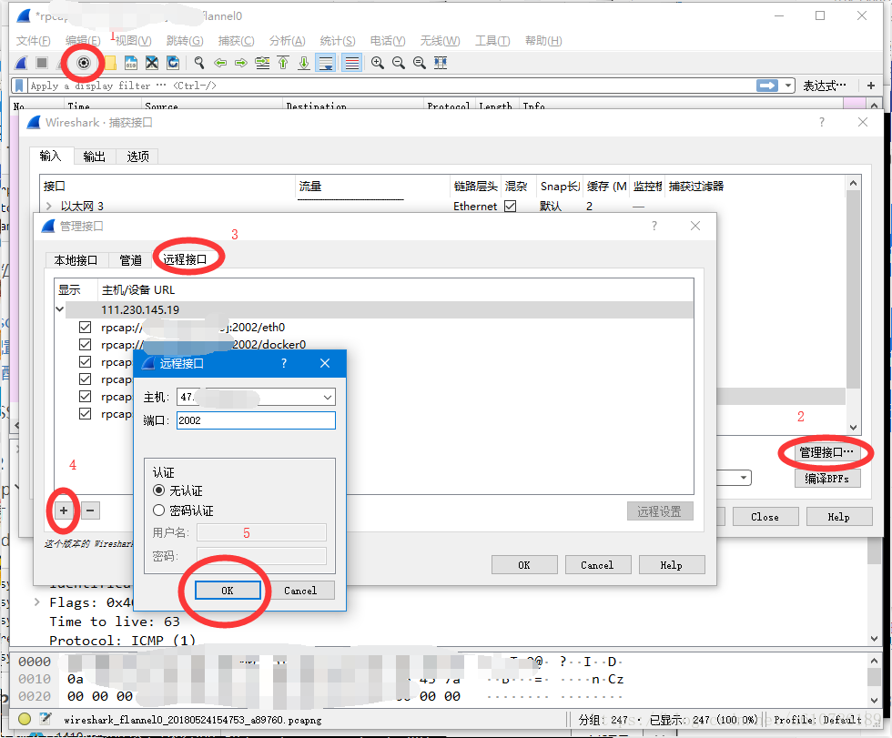
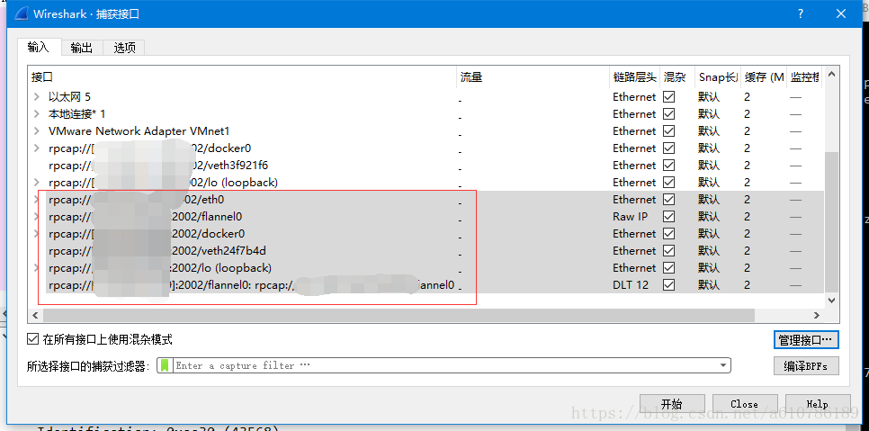
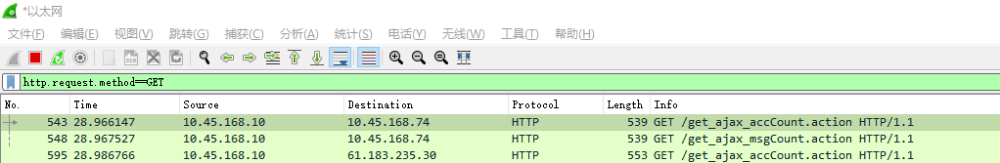

# Wireshark

## Linux抓包

### Linux上监听端口抓包

```sh
#监听9000端口并输出到文件9000.pcap中
$tcpdump -i any -s0 port 9000 -w 9000.pcap
#监听10.10.10.10的9000端口并输出到文件9000.pcap中
$tcpdump -i any port 9000 and host 10.10.10.10 -w 9000.pcap
```


### 实时远程访问linux服务器

Wireshark支持`remote packet capture protocol`协议远程抓包，只要在远程主机上安装相应的`rpcapd`服务例程，就可以远程抓包。首先在windows下安装wireshark，然后再在linux下安装rpcapd服务，然后在windows中远程连接即可。

#### Linux rpcapd服务

##### 安装

```sh
yum install glibc-static gcc flex byacc -y
#下载到当前目录下
wget http://www.winpcap.org/install/bin/WpcapSrc_4_1_2.zip
unzip WpcapSrc_4_1_2.zip
cd winpcap/wpcap/libpcap
chmod +x configure runlex.sh
CFLAGS=-static ./configure
make
cd rpcapd
make
```

##### 启动

```sh
$./rpcapd -n
Press CTRL + C to stop the server...
bind(): Address already in use (code 98)

$./rpcapd -n -d
#将以dameon模式在后台运行
```

#### 在本地Wireshark配置远程抓包接口





最终远程主机的所有网络接口都将显示出来，选择并启动监听

## 筛选命令

### MAC地址过滤

命令汇总：

```java
//筛选出MAC地址是20:dc:e6:f3:78:cc的数据包，包括源MAC地址或者目的MAC地址使用的是20:dc:e6:f3:78:cc的全部数据包
eth.addr==20:dc:e6:f3:78:cc

//筛选出源MAC地址是20:dc:e6:f3:78:cc的数据包
eth.src==20:dc:e6:f3:78:cc

//筛选出目的MAC地址是20:dc:e6:f3:78:cc的数据包
eth.dst==20:dc:e6:f3:78:cc
```

###  IP地址过滤

```java
ip.addr==192.168.1.122         //根据IP地址筛选，包括源ip或者目的IP

ip.src==192.168.1.122         //根据源IP地址筛选

ip.dst==192.168.1.122         //根据目的IP地址筛选
```

### 端口过滤

端口过滤。如过滤80端口，在Filter中输入，`tcp.port==80`，这条规则是把源端口和目的端口为80的都过滤出来。使用`tcp.dstport==80`只过滤目的端口为80的，`tcp.srcport==80`只过滤源端口为80的包；

```sh
tcp.port==80                  //根据TCP端口筛选数据包，包括源端口或者目的端口

tcp.dstport==80               //根据目的TCP端口筛选数据包。

tcp.srcport==80               //根据源TCP端口筛选数据包。

udp.port==4010              //根据UDP端口筛选数据包，包括源端口或者目的端口

udp.srcport==4010            //根据源UDP端口筛选数据包。

udp.dstport==4010           //根据目的UDP端口筛选数据包。
```

### 协议筛选

根据通讯协议进行筛选数据包，例如http协议、ftp协议等等。常用协议有下：

`udp、tcp、arp、icmp、smtp、pop、dns、ip、ssl、http、ftp、telnet、ssh、rdp、rip、ospf`

协议筛选相对来说比较简单，直接在过滤窗口（filter）输入协议即可。

**注意：在进行协议筛选的时候，协议名称一定要写成小写，否则会出错的。**


例如筛选出http协议的数据如下图：



```java
//筛选出http协议采用get方式的数据包。注意GET一定要写成大写，否则筛选不出来的。
http.request.method==GET

//筛选出采用http协议的post方式的数据包，注意POST参数一定要写成大写的，否则筛选不出来数据。
http.request.method==POST
```


**portal协议**：Portal为厂商之间约定协议，非RFC，需要插件才能解析，插件下载：[CMCC Portal Wireshark 插件](https://download.csdn.net/download/illina/9905049)


### 逻辑条件组合筛选

逻辑表达式汇总：

```java
||                 //逻辑或

&&                //逻辑与

!                  //逻辑非
```

如：`ip.src==192.168.1.122&&ip.dst==121.114.244.119`


