# Zookeeper 

**ZooKeeper是一个分布式数据管理框架，注册中心，客户端注册监听它关心的目录节点，当目录节点发生变化时，ZooKeeper会通知客户端 。**

Apache ZooKeeper是一个开源的分布式服务框架(发布/订阅模式的分布式数据管理与协调框架)，为分布式应用提供协调服务，用来解决分布式应用中的数据管理问题，如：配置管理、域名服务、分布式同步、集群管理等 

**分布式** 

将一个大型应用的不同业务部署在不同的服务器上，解决高并发的问题 。

**集群**

将同一个业务部署在多台服务器上，提高系统的高可用性 。

**事务说明在如下目录**

数据存储 -> 事务日志

集群 -> 集群特性 -> 分布式事务

集群 -> 集群特性 -> 选举机制 -> 流程 -> 选举过程

ZAB协议 -> 消息广播

## 基础操作

### 安装

ZooKeeper一般都运行在Linux平台

#### 步骤

1. 解压zookeeper­3.4.13.tar.gz

   ```sh
   cd ~/software 
   tar -zxf zookeeper-3.4.13.tar.gz
   ```

2. 配置

   ```sh
   # 创建存放数据文件的目录 
   cd zookeeper-3.4.13/ 
   mkdir data 
   # 创建配置文件 
   cd conf 
   cp zoo_sample.cfg zoo.cfg # 默认使用的是zoo.cfg，名称固定 
   # 修改配置文件 
   vi zoo.cfg 
   	dataDir=../data # 指定数据存放目录
   ```

3. 启动zookeeper 

   ```sh
   cd bin 
   ./zkServer.sh start | stop | status | restart # 启动|停止|查看状态|重启
   ```

4. 客户端连接zookeeper 

   Zookeeper 的 java 客户端：自带的 zkclient

   ```sh
   ./zkCli.sh # 启动客户端，默认连接本机的2181端口 
   或
   ./zkCli.sh -server 服务器地址:端口 # 连接指定主机、指定端口的zookeeper 
   quit # 退出客户端
   ```

#### 配置文件

| 配置项                      | 含义                             | 说明                                                         |
| --------------------------- | -------------------------------- | ------------------------------------------------------------ |
| tickTime=2000               | 心跳时间                         | 维持心跳的时间间隔，单位是毫秒；在zookeeper中所有的时间都是以这个时间为基础单元，进行整数倍配置 |
| initLimit=10                | 初始通信时限                     | 用于zookeeper集群，此时有多台zookeeper服务器，其中一个为Leader，其他都为Follower |
| syncLimit=5                 | 同步通信时限                     | 在运行时Leader通过心跳检测与Follower进行通信，如果超过syncLimit*tickTime时间还未收到响应，则认为该Follower已经宕机 |
| dataDir=../data             | 存储数据的目录                   | 数据文件也称为snapshot快照文件                               |
| clientPort=2181             | 端口号                           | 默认为2181                                                   |
| maxClientCnxns=60           | 单个客户端的最大连接数限制       | 默认为60，可以设置为0，表示没有限制                          |
| autopurge.snapRetainCount=3 | 保留文件的数量                   | 默认3个                                                      |
| autopurge.purgeInterval=1   | 自动清理快照文件和事务日志的频率 | 默认为0，表示不开启自动清理，单位是小时                      |
| dataLogDir=                 | 存储日志的目录                   | 未指定时日志文件也存放在dataDir中，为了性能最大化，一般建议把dataDir和dataLogDir分别放到不同的磁盘上 |

### 客户端操作

#### 常用命令

| 命令                     | 作用                   | 说明                                       |
| ------------------------ | ---------------------- | ------------------------------------------ |
| help                     | 查看帮助               | 查看所有操作命令                           |
| ls 节点路径              | 查看指定节点下的内容   |                                            |
| ls2 节点路径             | 查看指定节点的详细信息 | 查看所有子节点和当前节点的状态             |
| get 节点路径             | 获取节点中的值         |                                            |
| create 节点路径 内容     | 创建普通节点           | 如果内容中有空格，则需要使用对双引号引起来 |
| create ­-e 节点路径 内容 | 创建临时节点           | 当连接断开后，节点会被自动删除             |
| create ­-s 节点路径 内容 | 创建顺序编号节点       | 即带序号的节点                             |
| delete 节点路径          | 删除节点               | 只能删除空节点，即不能有子节点             |
| rmr 节点路径             | 递归删除节点           | remove recursion                           |
| stat 节点路径            | 查看节点状态           |                                            |
| set 节点路径 新值        | 修改节点内容           |                                            |

#### 详解

查看指定节点的详细信息：` ls2 / `

```sh
# 子节点名称数组 
[zookeeper]

# -------------节点的状态信息，也称为stat结构体------------------

# 创建该znode的事务的zxid(ZooKeeper Transaction ID)
# 事务ID是ZooKeeper为每次更新操作/事务操作分配一个全局唯一的id，表示zxid，值越小，表示越先执行
cZxid = 0x0 # 0x0表示十六进制数0

# 创建时间
ctime = Thu Jan 01 08:00:00 CST 1970

# 最后一次更新的zxid
mZxid = 0x0

# 最后一次更新的时间
mtime = Thu Jan 01 08:00:00 CST 1970

# 最后更新的子节点的zxid
pZxid = 0x0

# 子节点的变化号，表示子节点被修改的次数，-1表示从未被修改过
cversion = -1

# 当前节点的变化号，0表示从未被修改过
dataVersion = 0

# 访问控制列表的变化号 access control list
aclVersion = 0

# 如果临时节点，表示当前节点的拥有者的sessionId
# 如果不是临时节点，则值为0
ephemeralOwner = 0x0

# 数据长度
dataLength = 0

# 子节点数据
numChildren = 1
```

## 应用场景

### 配置管理

场景：集群环境、服务器的许多配置都是相同的，如：数据库连接信息，当需要修改这些配置时必须同时修改每台服务器，很麻烦

解决：把这些配置全部放到ZooKeeper上，保存在ZooKeeper的某个目录节点中，然后所有的应用程序(客户端)对这个目录节点进行监视Watch，一旦配置信息发生变化，ZooKeeper会通知每个客户端，然后从ZooKeeper获取新的配置信息，并应用到系统中。 

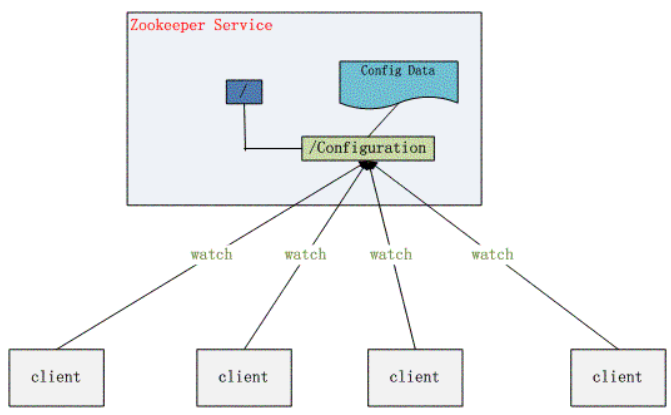

### 集群管理

场景：集群环境下，如何知道有多少台机器在工作？是否有机器退出或加入？需要选举一个总管master，让总管来管理集群 

解决：在父目录GroupMembers下为所有机器创建临时目录节点，然后监听父目录节点的子节点变化，一旦有机器挂掉，该机器与ZooKeeper的连接断开，其所创建的临时目录节点被删除，所有其他机器都会收到通知。当有新机器加入时也是同样的道理。 

选举master：为所有机器创建临时顺序编号目录节点，给每台机器编号，然后每次选取编号最小的机器作为master

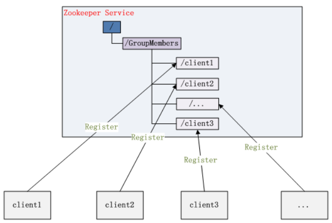

### 负载均衡

ZooKeeper本身是不提供负载均衡策略的，需要自己实现，所以准确的说，是在负载均衡中使用ZooKeeper来做集群的协调（也称为软负载均衡） 

实现思路： 

1. 将ZooKeeper作为服务的注册中心，所有服务器在启动时向注册中心登陆自己能够提供的服务 

2. 服务的调用者到注册中心获取能够提供所需要服务的服务器列表，然后自己根据负载均衡算法，从中选取一台服务器进行连接 

3. 当服务器列表发生变化时，如：某台服务器宕机下线，或新机器加入，ZooKeeper会自动通知调用者重新获取服务列表 

实际上利用了ZooKeeper的特性，将ZooKeeper用为服务的注册和变更通知中心

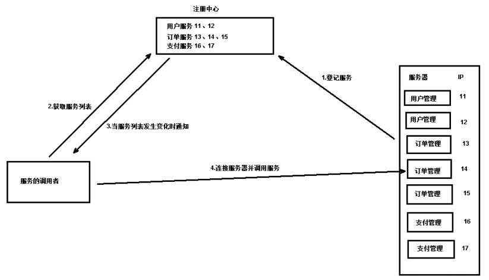

### 常用功能

- 集群管理：监控节点存活状态、运行请求等；

- 主节点选举：主节点挂掉了之后可以从备用的节点开始新一轮选主，主节点选举说的就是这个选举的过程，使用 Zookeeper 可以协助完成这个过程；

- 分布式锁：Zookeeper 提供两种锁：独占锁、共享锁。独占锁即一次只能有一个线程使用资源，共享锁是读锁共享，读写互斥，即可以有多线线程同时读同一个资源，如果要使用写锁也只能有一个线程使用。Zookeeper 可以对分布式锁进行控制。

- 命名服务：在分布式系统中，通过使用命名服务，客户端应用能够根据指定名字来获取资源或服务的地址，提供者等信息。

#### 分布式锁

有了 zookeeper 的一致性文件系统，锁的问题变得容易。锁服务可以分为两类，一个是保持独占，另一个是控制时序。

对于第一类，我们将 zookeeper 上的一个 znode 看作是一把锁，通过 createznode的方式来实现。所有客户端都去创建 /distribute_lock 节点，最终成功创建的那个客户端也即拥有了这把锁。用完删除掉自己创建的 distribute_lock 节点就释放出锁。

对于第二类， /distribute_lock 已经预先存在，所有客户端在它下面创建临时顺序编号目录节点，和选 master 一样，编号最小的获得锁，用完删除，依次方便。

## 数据模型

### 文件系统

ZooKeeper维护一个类似Linux文件系统的数据结构(多层级的节点命名空间)，用于存储数据。与linux文件系统不同的是，这些节点都可以设置关联的数据，而linux文件系统中只有文件节点可以存放数据而目录节点不行。

- 数据模型结构是一种树形结构，由许多节点构成，每个节点叫做ZNode（ZooKeeper Node） 
- 每个节点对应一个唯一路径，通过该路径来标识节点，如 /app1/p_2，每个节点只能存储大约1M的数据

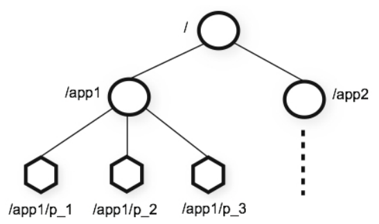

节点类型有四种： 

- 持久化目录节点 persistent 

  客户端与服务器断开连接，该节点仍然存在 

- 持久化顺序编号目录节点 persistent_sequential

  基本特性同持久节点，只是增加了顺序属性，节点名后边会追加一个由父节点维护的自增整型数字，如：000001、000002..... 

- 临时目录节点 ephemeral 

  临时节点的生命周期与客户端会话绑定，一旦客户端会话失效（客户端与zookeeper 连接断开不一定会话失效），那么这个客户端创建的所有临时节点都会被移除。

- 临时顺序编号目录节点 ephemeral_sequential 

  基本特性同临时节点，增加了顺序属性，节点名后边会追加一个由父节点维护的自增整型数字，如：000001、000002..... 

顺序编号节点： 

- 顺序编号会紧跟在节点名称后面，节点最终名称为：节点名+序号，如/test0000000005 
- 顺序编号是一个递增的计数器 
- 顺序编号是由父节点维护，从已有的子节点个数开始（包括临时节点和被删除的节点） 
- 如果子节点为空，则从0000000000开始，依次递增1 
- 在分布式系统中，顺序编号可以被用于为所有的事件进行全局排序，这样客户端就可以根据序号推断事件的顺序 

### 节点详情

ZooKeeper 中的每个节点都维护有这些内容：一个二进制数组`（byte data[]）`，用来存储节点的数据、ACL 访问控制信息、子节点数据（因为临时节点不允许有子节点，所以其子节点字段为 null），除此之外每个数据节点还有一个记录自身状态信息的字段 stat。

**节点的状态结构**

执行`stat /zk_test`，可以看到控制台输出了一些信息，这些就是节点状态信息。

每一个节点都有一个自己的状态属性，记录了节点本身的一些信息：

| **「状态属性」** | **「说明」**                                                 |
| ---------------- | ------------------------------------------------------------ |
| czxid            | 数据节点创建时的事务 ID                                      |
| ctime            | 数据节点创建时的时间                                         |
| mzxid            | 数据节点最后一次更新时的事务 ID                              |
| mtime            | 数据节点最后一次更新时的时间                                 |
| pzxid            | 数据节点的子节点最后一次被修改时的事务 ID                    |
| **「cversion」** | **「子节点的版本」**                                         |
| **「version」**  | **「当前节点数据的版本」**                                   |
| **「aversion」** | **「节点的 ACL 的版本」**                                    |
| ephemeralOwner   | 如果节点是临时节点，则表示创建该节点的会话的 SessionID；如果节点是持久节点，则该属性值为 0 |
| dataLength       | 数据内容的长度                                               |
| numChildren      | 数据节点当前的子节点个数                                     |

**数据节点的版本**

在 ZooKeeper 中为数据节点引入了版本的概念，每个数据节点有 3 种类型的版本信息，对数据节点的任何更新操作都会引起版本号的变化。

ZooKeeper 的版本信息表示的是对节点数据内容、子节点信息或者是 ACL 信息的修改次数。

## 数据存储

### 内存数据

ZooKeeper 的数据模型是存储在内存中的，不但存储数据的节点信息，还存储每个数据节点的 ACL 权限信息以及 stat 状态信息等；

在底层实现中，ZooKeeper 数据模型是通过 DataTree 类来定义的。DataTree 的内部定义类 nodes 节点类型、root 根节点信息、子节点的 WatchManager 监控信息等数据模型中的相关信息。

### 事务日志

为了整个 ZooKeeper 集群中数据的一致性，Leader 服务器会向 ZooKeeper 集群中的其他角色服务发送数据同步信息，在接收到数据同步信息后， ZooKeeper 集群中的 Follow 和 Observer 服务器就会进行数据同步。而这两种角色服务器所接收到的信息就是 Leader 服务器的事务日志，在接收到事务日志后，并在本地服务器上执行。

**事务日志**和**数据快照**一样，都存储在本地磁盘上；事务日志数据主要用于记录本地事务性会话操作，用于 ZooKeeper 集群服务器之间的数据同步。

事务快照则是将内存数据持久化到本地磁盘，快照是每间隔一段时间才把内存数据存储到本地磁盘，因此数据并不会一直与内存数据保持一致。


## ACL 权限控制

ACL全称为Access Control List 即访问控制列表，用于控制资源的访问权限。zookeeper利用ACL策略控制节点的访问权限，如节点数据读写、节点创建、节点删除、读取子节点列表、设置节点权限等。

在Zookeeper中，znode的ACL是没有继承关系的，每个znode的权限都是独立控制的，只有客户端满足znode设置的权限要求时，才能完成相应的操作。

Zookeeper的ACL，分为三个维度：scheme、id、permission，通常表示为：`scheme:id:permission`，schema代表授权策略，id代表授权对象，permission代表权限。

### scheme

scheme对应于采用哪种方案来进行权限管理，zookeeper的scheme的分类如下：

- **world**: 它下面只有一个id, 叫anyone, `world:anyone`代表任何人，zookeeper中对所有人有权限的结点就是属于`world:anyone`的

- **digest**:是最常用的权限控制模式，也更符合我们对权限控制的认识，其类似于`username:password`形式的权限标识进行权限配置。它对应的id为`username:BASE64(SHA1(password))`，即对密码先做SHA1加密然后再进行BASE64摘要。

- **ip**: 它对应的id为客户机的IP地址，设置的时候可以设置一个ip段，比如`ip:192.168.1.0/16`, 表示匹配前16个bit的IP段，也可以设置为某一个具体的ip

- **auth**: 它不需要id, 只要是通过authentication的user都有权限（zookeeper支持通过kerberos来进行authencation, 也支持`username/password`形式的authentication)

- **super**: 在这种scheme情况下，对应的id拥有超级权限，可以做任何事情(cdrwa)，具有 Super 权限的客户端可以对 ZooKeeper 上的任意数据节点进行任意操作。
  其实这几种scheme中最常用的也就是world，digest和ip，其他的都很少使用，了解一下就行了。
  
  [zookeeper配置super超级用户](https://blog.csdn.net/succing/article/details/121793494) 

### id

id是验证模式，不同的scheme，id的值也不一样。scheme为ip时，id的值为客户端的ip地址。scheme为world时，id的值为anyone。scheme为digest时，id的值为：username:BASE64(SHA1(password))。

### permission

zookeeper目前支持下面一些权限：

- **CREATE(c)**: 创建权限，可以在在当前node下创建child node，即对子节点Create操作
- **DELETE(d)**: 删除权限，可以删除当前的node，即对子节点Delete操作
- **READ(r)**: 读权限，可以获取当前node的数据，可以list当前node所有的child nodes，即对本节点GetChildren和GetData操作
- **WRITE(w)**: 写权限，可以向当前node写数据，即对本节点SetData操作
- **ADMIN(a)**: 管理权限，可以设置当前node的permission，即对本节点setAcl操作

### 通过命令行操作ACL

#### 获取ACL

```sh
#创建节点没有设置ACL的时候，默认使用的是world这种scheme，任何客户端都可以访问。
[zk: localhost:2181(CONNECTED) 2] create /test aaa
Created /test
[zk: localhost:2181(CONNECTED) 3] getAcl /test
'world,'anyone
: cdrwa
[zk: localhost:2181(CONNECTED) 4] 
```

#### 设置digest

Zookeeper的java api中有一个类可以先对密码做SHA1加密然后再做Base64加密操作：

```java
String str = DigestAuthenticationProvider.generateDigest("wkp:135791"); 
```

这个方法会对冒号后面的密码做加密操作，通过运行得到返回值为`wkp:NrLAZ6FuRnaPGI93r1uPKD67MLw=`。我们可以看下这个方法的源码：

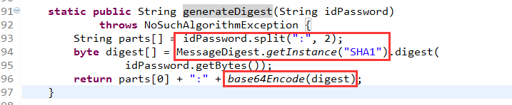

然后使用此加密密码进行设置操作

```sh
#用户名:加密密码:权限
setAcl /node digest:[username]:[Encrypted password]:[perms]

#digest的认证方式，注意这里的密码为明文
addauth digest [username]:[password plain]
```

```sh
[zk: localhost:2181(CONNECTED) 44] setAcl /test digest:wkp:NrLAZ6FuRnaPGI93r1uPKD67MLw=:cdrwa
cZxid = 0x620000001a
ctime = Wed Oct 31 23:03:51 CST 2018
mZxid = 0x620000001a
mtime = Wed Oct 31 23:03:51 CST 2018
pZxid = 0x620000001a
cversion = 0
dataVersion = 0
aclVersion = 1
ephemeralOwner = 0x0
dataLength = 3
numChildren = 0
[zk: localhost:2181(CONNECTED) 45] getAcl /test
'digest,'wkp:NrLAZ6FuRnaPGI93r1uPKD67MLw=
: cdrwa
[zk: localhost:2181(CONNECTED) 46] create /test/aaa 111
Authentication is not valid : /test/aaa
[zk: localhost:2181(CONNECTED) 50] addauth digest wkp:135791
[zk: localhost:2181(CONNECTED) 51] create /test/aaa 111     
Created /test/aaa
[zk: localhost:2181(CONNECTED) 52] 
```

#### 设置ip认证

我们创建一个/ipTest节点并且设置scheme为ip形式，限制连接ip为127.0.0.1，然后我们本机是可以访问的

```sh
[zk: localhost:2181(CONNECTED) 1] create /ipTest 111
Created /ipTest
[zk: localhost:2181(CONNECTED) 2] setAcl /ipTest ip:127.0.0.1:crwda
cZxid = 0x620000002a
ctime = Wed Oct 31 23:40:20 CST 2018
mZxid = 0x620000002a
mtime = Wed Oct 31 23:40:20 CST 2018
pZxid = 0x620000002a
cversion = 0
dataVersion = 0
aclVersion = 1
ephemeralOwner = 0x0
dataLength = 3
numChildren = 0
[zk: localhost:2181(CONNECTED) 3] getAcl /ipTest
'ip,'127.0.0.1
: cdrwa
[zk: localhost:2181(CONNECTED) 4] ls /ipTest
[]
```

下面我们切换到集群的另一台机器上进行操作，发现认证不通过

```sh
[zk: localhost:2181(CONNECTED) 0] ls /
[testRoot, dubbo, bhz, test, zookeeper, activemq2, switch, ipTest]
[zk: localhost:2181(CONNECTED) 1] ls /ipTest
Authentication is not valid : /ipTest
[zk: localhost:2181(CONNECTED) 2] 
```

### 通过java api操作ACL


参考：

[zookeeper的ACL权限控制机制介绍](https://blog.csdn.net/u012988901/article/details/83388419)

### 权限扩展

提供权限扩展机制来让用户实现自己的权限控制方式，机制的定义是Pluggable ZooKeeper Authenication，意思是可插拔的授权机制。

要想实现自定义的权限控制机制，最核心的一点是实现 ZooKeeper 提供的权限控制器接口 AuthenticationProvider，将自定义的权限控制注册到 ZooKeeper 服务器中，而注册的方式通常有两种。

- 第一种是通过设置系统属性来注册自定义的权限控制器：

  ```
  -Dzookeeper.authProvider.x=CustomAuthenticationProvider
  ```

- 另一种是在配置文件zoo.cfg中进行配置：

  ```
  authProvider.x=CustomAuthenticationProvider
  ```

**实现原理**

首先是封装该请求的类型，之后将权限信息封装到 request 中并发送给服务端。而服务器的实现比较复杂，首先分析请求类型是否是权限相关操作，之后根据不同的权限模式（scheme）调用不同的实现类验证权限最后存储权限信息。

在授权接口中，值得注意的是会话的授权信息存储在 ZooKeeper 服务端的内存中，如果客户端会话关闭，授权信息会被删除。

下次连接服务器后，需要重新调用授权接口进行授权


## 序列化方式

ZooKeeper 一直采用 Jute 作为序列化解决方案，但是性能不好，主要是新老版本的兼容等问题。

**如何 使用 Jute 实现序列化**

如果我们要想将某个定义的类进行序列化，首先需要该类实现 Record 接口的 serilize 和 deserialize 方法，这两个方法分别是序列化和反序列化方法。

```java
class test_jute implements Record{
    private long ids；
    private String name;
    ...
        
    // 在序列化方法 serialize 中，我们要实现的逻辑是，首先通过字符类型参数 tag 传递标记序列化标识符，之后使用 writeLong 和 writeString 等方法分别将对象属性字段进行序列化。
    public void serialize(OutpurArchive a_,String tag){
        a_.startRecord(this.tag);
        a_.writeLong(ids,"ids");
        a_.writeString(type,"name");
        a_.endRecord(this,tag);
    }
    public void deserialize(INputArchive a_,String tag){
        a_.startRecord(tag);
        ids = a_.readLong("ids");
        name = a_.readString("name");
        a_.endRecord(tag);
    }
}
```

序列化和反序列化的实现逻辑编码方式相对固定，首先通过 startRecord 开启一段序列化操作，之后通过 writeLong、writeString 或 readLong、 readString 等方法执行序列化或反序列化。

本例中只是实现了长整型和字符型的序列化和反序列化操作，除此之外 ZooKeeper 中的 Jute 框架还支持整数类型（Int）、布尔类型（Bool）、双精度类型（Double）以及 Byte/Buffer 类型。


## 集群

### 配置集群

**步骤：**

1. 准备多台ZooKeeper服务器 

2. 配置ZooKeeper服务器 

   在每台服务器的conf/zoo.cfg文件中添加如下内容：

```cfg
server.20=192.168.4.20:2888:3888 
server.21=192.168.4.21:2888:3888 
server.22=192.168.4.22:2888:3888
```

​		格式： `server.A=B:C:D`

- A表示这台服务器的编号ID，是一个数字 

- B表示服务器的IP地址或域名 

- C表示这台服务器与集群中的Leader交换信息时使用的端口 

- D表示执行选举Leader服务器时互相通信的端口

3. 创建myid配置文件 

   在集群环境下，需要在 dataDir 目录中创建一个名为 myid 的文件，文件内容是当前服务器的编号ID，即上面配置的A 

```sh
cd data 
echo A的值 > myid
```

​		ZooKeeper启动时会读取这个文件，将里面的数字与zoo.cfg中配置的server.A进行比较，从而判断这台服务器是哪个 

4. 测试集群环境 

   启动所有ZooKeeper服务器，查看状态。此时在某台服务器上执行更新操作时，其他服务器也会同步 。

#### 部署模式

- 单机部署：一台集群上运行；

- 集群部署：多台集群运行；

- 伪集群部署：一台集群启动多个 Zookeeper 实例运行；

#### 动态扩容

其实就是水平扩容了，Zookeeper 在这方面不太好。两种方式：

- 全部重启：关闭所有 Zookeeper 服务，修改配置之后启动。不影响之前客户端的会话。

- 逐个重启：在过半存活即可用的原则下，一台机器重启不影响整个集群对外提供服务。这是比较常用的方式。

3.5 版本开始支持动态扩容。

### 集群特性

#### 概述

- 在 ZooKeeper 集群中将服务器分成 「Leader 、Follow 、Observer 」三种角色服务器，在集群运行期间这三种服务器所负责的工作各不相同：

  |          | 支持服务                         | 事务请求                                                     | 投票                                                   | 个数 | 其他                                                   |
  | -------- | -------------------------------- | ------------------------------------------------------------ | ------------------------------------------------------ | ---- | ------------------------------------------------------ |
  | Leader   | 为客户端提供写服务又能提供读服务 | 事务请求的唯一调度和处理者，保证集群事务处理的顺序性         | 负责进行投票的发起和决议                               | 一个 | 负责管理集群中其他的服务器，是集群中工作的分配和调度者 |
  | Follow   | 只能提供读服务                   | 处理客户端的获取数据等非事务请求，转发事务请求给 Leader 服务器 | 参与 Leader 选举投票，参与事务请求Proposal(提议)的投票 | 多个 |                                                        |
  | Observer | 只能提供读服务                   | 处理客户端的获取数据等非事务请求，转发事务请求给 Leader 服务器 | 不参与任何形式的投票                                   | 多个 | 不会作为候选者被选举为 Leader 服务器                   |

- 半数机制：集群中只要有半数以上节点存活，集群就能够正常工作，所以一般集群中的服务器个数都为奇数

- 全局数据一致：集群中每台服务器保存一份相同的数据副本，不论客户端连接到哪个服务器，数据都是一致的 

- 数据更新请求
  - 顺序执行：来自同一个客户端的更新请求，按其发送顺序依次执行 
  - 原子性：一次数据更新，要么成功，要么失败 
  - 实时性：在一定的时间范围内，客户端能读取到最新数据

客户端的读请求可以被集群中的任意一台机器处理。写请求，这些请求会同时发给其他 zookeeper 机器并且达成一致后，请求才会返回成功。因此，随着 zookeeper 的集群机器增多，读请求的吞吐会提高但是写请求的吞吐会下降。

#### Observer

当 ZooKeeper 集群的规模变大，集群中 Follow 服务器数量逐渐增多的时候，ZooKeeper 处理创建数据节点等事务性请求操作的性能就会逐渐下降。这是因为 ZooKeeper 集群在处理事务性请求操作时，要在 ZooKeeper 集群中对该事务性的请求发起投票，只有超过半数的 Follow 服务器投票一致，才会执行该条写入操作。正因如此，随着集群中 Follow 服务器的数量越来越多，一次写入等相关操作的投票也就变得越来越复杂，并且 Follow 服务器之间彼此的网络通信也变得越来越耗时，导致随着 Follow 服务器数量的逐步增加，事务性的处理性能反而变得越来越低。

为了解决这一问题，在 ZooKeeper 3.6 版本后，ZooKeeper 集群中创建了一种新的服务器角色，即 Observer——观察者角色服务器。 Observer 可以处理 ZooKeeper 集群中的非事务性请求，并且不参与 Leader 节点等投票相关的操作，也不会被选举为 Leader 服务器。这样既保证了 ZooKeeper 集群性能的扩展性，又避免了因为过多的服务器参与投票相关的操作而影响 ZooKeeper 集群处理事务性会话请求的能力。

在实际部署的时候，因为 Observer 不参与 Leader 节点等操作，并不会像 Follow 服务器那样频繁的与 Leader 服务器进行通信。 因此，可以将 Observer 服务器部署在不同的网络区间中，这样也不会影响整个 ZooKeeper 集群的性能，也就是所谓的**跨域部署**。

#### 请求处理详情

1. 在 ZooKeeper 集群接收到来自客户端的会话请求操作后，首先会判断该条请求是否是事务性的会话请求。

   ❝ 对于事务性的会话请求，ZooKeeper 集群服务端会将该请求统一转发给 Leader 服务器进行操作。 **所谓事务性请求，是指 ZooKeeper 服务器执行完该条会话请求后，是否会导致执行该条会话请求的服务器的数据或状态发生改变，进而导致与其他集群中的服务器出现数据不一致的情况。** ❞ 

   Leader 服务器内部执行该条事务性的会话请求后，再将数据同步给其他角色服务器，从而保证事务性会话请求的执行顺序，进而保证整个 ZooKeeper 集群的数据一致性。

   ❝ 在 ZooKeeper 集群的内部实现中，是通过什么方法保证所有 ZooKeeper 集群接收到的事务性会话请求都能交给 Leader 服务器进行处理的呢？ ❞ 在 ZooKeeper 集群内部，集群中除 Leader 服务器外的其他角色服务器接收到来自客户端的事务性会话请求后，必须将该条会话请求转发给 Leader 服务器进行处理。

   ZooKeeper 集群中的 Follow 和 Observer 服务器，都会检查当前接收到的会话请求是否是事务性的请求，如果是事务性的请求，那么就将该请求以 REQUEST 消息类型转发给 Leader 服务器。

2. 在 ZooKeeper集群中的服务器接收到该条消息后，会对该条消息进行解析。

   分析出该条消息所包含的原始客户端会话请求。

3. 之后将该条消息提交到自己的 Leader 服务器请求处理链中，开始进行事务性的会话请求操作。

   如果不是事务性请求，ZooKeeper 集群则交由 Follow 和 Observer 角色服务器处理该条会话请求，如查询数据节点信息。

**ZooKeeper 集群的性能**

当一个业务场景在查询操作多而创建删除等事务性操作少的情况下，ZooKeeper 集群的性能表现的就会很好。

❝ 如果是在极端情况下，ZooKeeper 集群只有事务性的会话请求而没有查询操作，那么 Follow 和 Observer 服务器就只能充当一个请求转发服务器的角色， 所有的会话的处理压力都在 Leader 服务器。 ❞ 在处理性能上整个集群服务器的瓶颈取决于 Leader 服务器的性能。

❝ ZooKeeper 集群的作用只能保证在 Leader 节点崩溃的时候，重新选举出 Leader 服务器保证系统的稳定性。 ❞ 这也是 ZooKeeper 设计的一个缺点。

#### 分布式事务

分布式事务就是指事务的参与者、支持事务的服务器、资源服务器以及事务管理器分别位于不同的分布式系统的不同节点之上。简单的说，就是一次大的操作由不同的小操作组成，这些小的操作分布在不同的服务器上，且属于不同的应用，分布式事务需要保证这些小操作要么全部成功，要么全部失败。本质上来说，分布式事务就是为了保证不同数据库的数据一致性。

集群处理请求分两种：事务和非事务，对于非事务，请求处理和单机类似，节点本地就可以完成数据的请求；事务请求需要提交给Leader处理，Leader以投票的形式，等待半数的Follower的投票，完成同步后才将操作结果返回。

zookeeper采用了全局递增的事务Id来标识，**从而保证事务的顺序一致性**，所有的事务请求proposal(提议)都在被提出的时候加上了zxid，zxid 实际上是一个 64 位的数字，高32位是 epoch（ 时期; 纪元; 世; 新时代）用来标识 leader 周期，如果有新的 leader 产生出来，epoch会自增，低 32 位用来递增计数。当新产生 proposal 的时候，会依据数据库的两阶段过程，首先会向其他的 server 发出事务执行请求，如果超过半数的机器都能执行并且能够成功，那么就会开始执行。

Zookeeper的状态变化，都会由一个Zookeeper事务ID（ZXID）标识。❝ 写入Zookeeper，会导致状态变化，每次写入都会导致ZXID发生变化。 ❞ ZXID由Leader统一分配，全局唯一，长度64位，递增。ZXID展示了所有的Zookeeper状态变更顺序，每次变更都有一个唯一ZXID，如果zxid1小于zxid2，则说明zxid1的事务在zxid2的事务之前发生。

### 选举机制

#### 概述

Leader 服务器的选举操作主要发生在两种情况下。

第一种就是 ZooKeeper 集群服务启动的时候，第二种就是在 ZooKeeper 集群中旧的 Leader 服务器失效时，这时 ZooKeeper 集群需要选举出新的 Leader 服务器。

❝ ZooKeeper 集群重新选举 Leader 的过程只有 Follow 服务器参与工作。 ❞

#### 服务器状态

服务器具有四种状态，分别是LOOKING、FOLLOWING、LEADING、OBSERVING。

「LOOKING」：寻找Leader状态。当服务器处于该状态时，它会认为当前集群中没有Leader，因此需要进入Leader选举状态。

「FOLLOWING」：跟随者状态。表明当前服务器角色是Follower。

「LEADING」：领导者状态。表明当前服务器角色是Leader。

「OBSERVING」：观察者状态。表明当前服务器角色是Observer。

#### 流程

##### 选举过程

在 ZooKeeper 集群重新选举 Leader 节点的过程中，主要可以分为 Leader 失效发现、重新选举 Leader 、Follow 服务器角色变更、集群同步这几个步骤。

1. ❝ Leader 失效发现 ❞ 在 ZooKeeper 集群中，当 Leader 服务器失效时，ZooKeeper 集群会重新选举出新的 Leader 服务器。

   在 ZooKeeper 集群中，探测 Leader 服务器是否存活的方式与保持客户端活跃性的方法非常相似。 首先，Follow 服务器会定期向 Leader 服务器发送 网络请求在接收到请求后，Leader 服务器会返回响应数据包给 Follow 服务器，而在 Follow 服务器接收到 Leader 服务器的响应后，如果判断 Leader 服务器运行正常，则继续进行数据同步和服务转发等工作，反之，则进行 Leader 服务器的重新选举操作。

2. ❝ Leader重新选举 ❞ 当 Follow 服务器向 Leader 服务器发送状态请求包后，如果没有得到 Leader 服务器的返回信息，这时，如果是集群中个别的 Follow 服务器发现返回错误，并不会导致 ZooKeeper 集群立刻重新选举 Leader 服务器，而是将该 Follow 服务器的状态变更为 LOOKING 状态，并向网络中发起投票，当 ZooKeeper 集群中有更多的机器发起投票，最后当投票结果满足多数原则的情况下。

   ZooKeeper 会重新选举出 Leader 服务器。

3. ❝ Follow 角色变更 ❞ 在 ZooKeeper 集群中，Follow 服务器作为 Leader 服务器的候选者，当被选举为 Leader 服务器之后，其在 ZooKeeper 集群中的 Follow 角色，也随之发生改变。也就是要转变为 Leader 服务器，并作为 ZooKeeper 集群中的 Leader 角色服务器对外提供服务。

4. ❝ 集群同步数据 ❞ 在 ZooKeeper 集群成功选举 Leader 服务器，并且候选 Follow 服务器的角色变更后。

   为避免在这期间导致的数据不一致问题，ZooKeeper 集群在对外提供服务之前，会通过 Leader 角色服务器管理同步其他角色服务器。

##### 示例

ZooKeeper在提供服务时会自动选举一个节点服务器作为Leader，其他都是Follower 

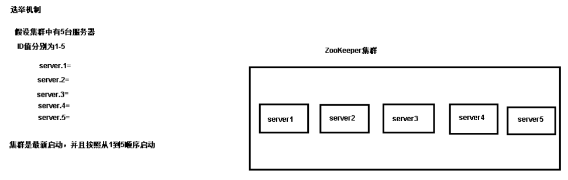

1. Server1启动，给自己投票，然后发送投票信息，由于其它服务器都还没启动，所以它发现的消息收不到任何反馈，此时Server1为`Looking`状态 

2. Server2启动，给自己投票，同时与Server1通信交换选举结果，由于Server2的id值较大，所以Server2胜出，但由于投票数没有过半，此时Server1和Server2都为`Looking`状态 

3. Server3启动，给自己投票，同时与Server1和Server2通信交换选举结果，由于Server3的id值较大，所以Server3胜出，此时票数已经过半，所以Server3为Leader，Server1和Server2为Follower 

4. Server4启动，给自己投票，同时与Server1、Server2、Server3通信交换选举结果，尽管Server4的id较大，但由于集群中已经存在Leader，所以Server4只能为Follower 

5. Server5启动，同Server4类似，只能为Follower 

总结：

- 每个服务器在启动时都会选择自己，然后将投票信息发送出去 
- 服务器编号ID越大，在选择算法中的权重越大 
- 投票数必须过半，才能选出Leader 
- 谁是Leader：启动顺序的前集群数/2+1 个服务器中，id值最大的会成为Leader 

#### 节点宕机


ZK 集群的机制是只要超过半数的节点正常，集群就能正常提供服务。只有在 ZK节点挂得太多，只剩一半或不到一半节点能工作，集群才失效。

如：3 个节点的 cluster 可以挂掉 1 个节点(leader 可以得到 2 票>1.5)；2 个节点的 cluster 就不能挂掉任何 1 个节点了(leader 可以得到 1 票<=1)；

**使用 ZooKeeper 集群服务器的时候，集群中的机器个数应该选择奇数个**

两个原因：

- ❝ 在容错能力相同的情况下，奇数台更节省资源 ❞ 

  Zookeeper中 Leader 选举算法采用了Zab协议。Zab核心思想是当多数 Server 写成功，则写成功。

  举两个例子：

  假如zookeeper集群1 ，有3个节点，3/2=1.5 , 即zookeeper想要正常对外提供服务（即leader选举成功），至少需要2个节点是正常的。换句话说，3个节点的zookeeper集群，允许有一个节点宕机。

  假如zookeeper集群2，有4个节点，4/2=2 , 即zookeeper想要正常对外提供服务（即leader选举成功），至少需要3个节点是正常的。换句话说，4个节点的zookeeper集群，也允许有一个节点宕机。

  集群1与集群2都有 允许1个节点宕机 的容错能力，但是集群2比集群1多了1个节点。在相同容错能力的情况下，本着节约资源的原则，zookeeper集群的节点数维持奇数个更好一些。

- ❝ 防止由脑裂造成的集群不可用。 ❞ 集群的脑裂通常是发生在节点之间通信不可达的情况下，集群会分裂成不同的小集群，小集群各自选出自己的master节点，导致原有的集群出现多个master节点的情况，这就是脑裂。

  下面举例说一下为什么采用奇数台节点，就可以防止由于脑裂造成的服务不可用：

  假如zookeeper集群有 5 个节点，发生了脑裂，脑裂成了A、B两个小集群：

  A ：1个节点 ，B ：4个节点

  A ：2个节点， B ：3个节点

  可以看出，上面这两种情况下，A、B中总会有一个小集群满足 可用节点数量 > 总节点数量/2 。

  所以zookeeper集群仍然能够选举出leader ， 仍然能对外提供服务，只不过是有一部分节点失效了而已。

  假如zookeeper集群有4个节点，同样发生脑裂，脑裂成了A、B两个小集群：

  A：1个节点 ， B：3个节点

  A：2个节点 ， B：2个节点

  因为A和B都是2个节点，都不满足 可用节点数量 > 总节点数量/2 的选举条件， 所以此时zookeeper就彻底不能提供服务了

#### 底层实现

- 首先，ZooKeeper 集群会先判断 Leader 服务器是否失效，而判断的方式就是 Follow 服务器向 Leader 服务器发送请求包，之后 Follow 服务器接收到响应数据后，进行解析，Follow 服务器会根据返回的数据，判断 Leader 服务器的运行状态，如果返回的是 LOOKING 关键字，表明与集群中 Leader 服务器无法正常通信。

- 之后，在 ZooKeeper 集群选举 Leader 服务器时，是通过 「FastLeaderElection」 类实现的。 该类实现了 TCP 方式的通信连接，用于在 ZooKeeper 集群中与其他 Follow 服务器进行协调沟通。

  FastLeaderElection 类继承了 Election 接口，定义其是用来进行选举的实现类。

  而在其内部，又定义了选举通信相关的一些配置参数，比如 finalizeWait 最终等待时间、最大通知间隔时间 maxNotificationInterval 等。 在选举的过程中，首先调用 ToSend 函数向 ZooKeeper 集群中的其他角色服务器发送本机的投票信息，其他服务器在接收投票信息后，会对投票信息进行有效性验证等操作，之后 ZooKeeper 集群统计投票信息，如果过半数的机器投票信息一致，则集群就重新选出新的 Leader 服务器。

- ❝ 这里我们要注意一个问题，那就是在重新选举 Leader 服务器的过程中，ZooKeeper 集群理论上是无法进行事务性的请求处理的。 ❞ 因此，发送到 ZooKeeper 集群中的事务性会话会被挂起，暂时不执行，等到选举出新的 Leader 服务器后再进行操作。

### 会话机制

ZooKeeper 的工作方式一般是通过客户端向服务端发送请求而实现的，而在一个请求的发送过程中，首先，客户端要与服务端进行连接，而一个连接就是一个会话。

会话由三个部分组成：分别是会话 ID（sessionID）、会话超时时间（TimeOut）、会话关闭状态（isClosing）

**会话状态**

正在连接（CONNECTING）、已经连接（CONNECTIED）、正在重新连接（RECONNECTING）、已经重新连接（RECONNECTED）、会话关闭（CLOSE）等。

**会话异常**

会话的超时异常包括客户端 readtimeout 异常和服务器端 sessionTimeout 异常。

 ZooKeeper 实际起作用的超时时间是通过客户端和服务端协商决定。ZooKeeper 客户端在和服务端建立连接的时候，会提交一个客户端设置的会话超时时间，而该超时时间会和服务端设置的最大超时时间和最小超时时间进行比对，如果正好在其允许的范围内，则采用客户端的超时时间管理会话。如果大于或者小于服务端设置的超时时间，则采用服务端设置的值管理会话。

**分桶策略**

 ZooKeeper 中为了保证一个会话的存活状态，客户端需要向服务器周期性地发送心跳信息。ZooKeeper 服务端接收请求后，会更新会话的过期时间，来保证会话的存活状态。

在 ZooKeeper 中，会话将按照不同的时间间隔进行划分，超时时间相近的会话将被放在同一个间隔区间中，这种方式避免了 ZooKeeper 对每一个会话进行检查，而是采用**分批次的方式管理会话**。

**底层实现**

ZooKeeper 底层实现的是过期队列，**一个会话过期队列是由若干个 bucket 组成的。**bucket 是一个按照时间划分的区间，每个 bucket 中存放了在某一时间内过期的会话。ZooKeeper 服务会开启一个线程专门用来检索过期队列，找出要过期的 bucket，而 ZooKeeper 每次只会让一个 bucket 中的会话过期。

## 通知机制

ZooKeeper是一个基于**观察者模式**设计的分布式服务管理框架

1. ZooKeeper负责管理和维护项目的公共数据，并授受观察者的注册(订阅)；

2. 一旦这些数据发生变化，ZooKeeper就会通知已注册的观察者；

3. 此时观察者就可以做出相应的反应；

简单来说，客户端注册监听它关心的目录节点，当目录节点发生变化时，ZooKeeper会通知客户端 。

ZooKeeper是一个订阅中心(注册中心)。

## 监听机制

ZooKeeper 的客户端可以通过 Watch 机制来订阅当服务器上某一节点的数据或状态发生变化时收到相应的通知；

### 监听命令

**监听节点值的变化**

```sh
# 在集群的A服务器，监听某个节点值的变化 
get /yyy watch 

# 在集群的B服务器，修改对应节点的值 
set /yyy myyyy 

# 此时A服务器会收到事件NodeDataChanged 
WATCHER:: 
WatchedEvent state:SyncConnected type:NodeDataChanged path:/yyy
```

监听Watch事件是一个一次性的触发器，当数据改变时只会触发一次，如果以后这个数据再发生改变，则不会再次触发 

**监听节点的子节点变化**

```sh
# 在集群的A服务器，监听某个节点的子节点的变化 
ls /yyy watch 

# 在集群的B服务器，创建/修改/删除对应节点的子节点 
create /yyy/hello hello 

# 此时A服务器会收到事件NodeChildrenChanged 
WATCHER:: 
WatchedEvent state:SyncConnected type:NodeChildrenChanged path:/yyy
```

### 触发通知

**「当服务端某一节点发生数据变更操作时，所有曾经设置了该节点监控事件的客户端都会收到服务器的通知吗？」**

答案是否定的，Watch 事件的触发机制取决于会话的连接状态和客户端注册事件的类型，所以当客户端会话状态或数据节点发生改变时，都会触发对应的 Watch 事件。

客户端在不同**会话状态**下，相应的在服务器节点所能支持的**事件类型**：

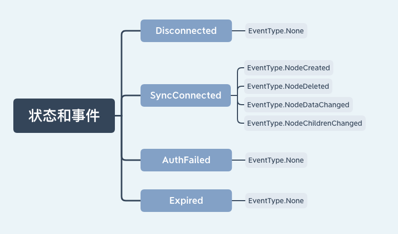

### 具体实现

向 ZooKeeper 客户端的构造方法中传递 Watcher 参数的方式实现：

```java
new ZooKeeper(String connectString, int sessionTimeout, Watcher watcher)
```

定义了一个了 ZooKeeper 客户端对象实例，并传入三个参数：

- connectString 服务端地址
- sessionTimeout：超时时间
- Watcher：监控事件

这个 Watcher 将作为整个 ZooKeeper 会话期间的上下文 ，一直被保存在客户端 ZKWatchManager 的 defaultWatcher 中。


ZooKeeper 客户端也可以通过 getData、exists 和 getChildren 三个接口来向 ZooKeeper 服务器注册 Watcher，从而方便地在不同的情况下添加 Watch 事件：

```java
getData(String path, Watcher watcher, Stat stat)
```

### 工作机制

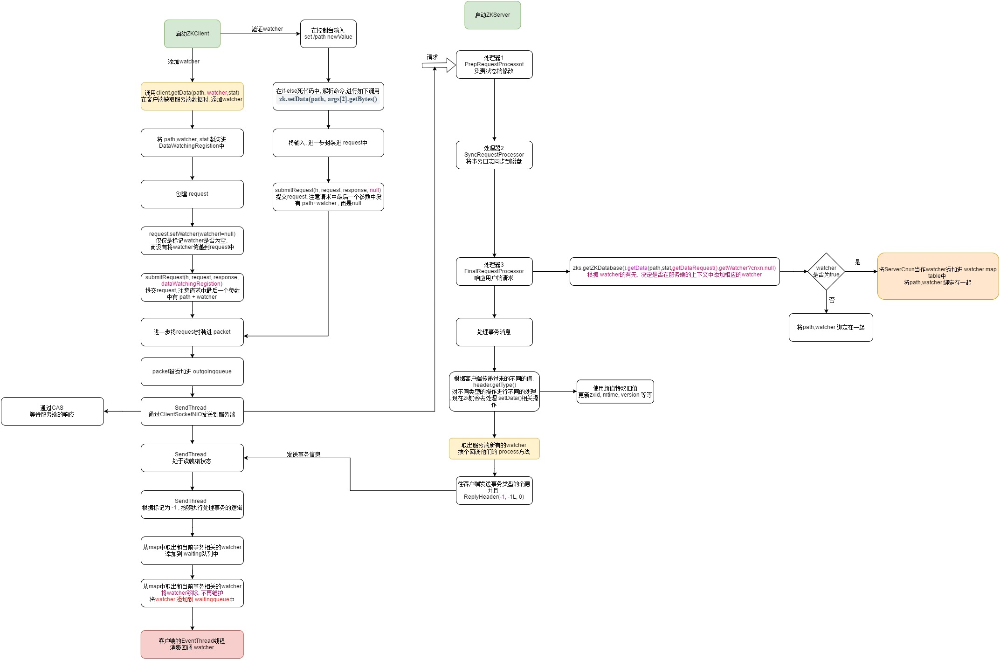

Zookeeper允许客户端向服务端的某个Znode注册一个 Watcher 监听，当服务端的一些指定事件触发了这个 Watcher，服务端会向指定客户端发送一个事件通知来实现分布式的通知功能，然后客户端根据 Watcher 通知状态和事件类型做出业务上的改变。

1. 客户端注册 watcher

2. 服务端处理 watcher

3. 客户端回调 watcher

#### Watcher 特性

- 一次性

  **Watch 具有一次性，所以当我们获得服务器通知后要再次添加 Watch 事件。**

  无论是服务端还是客户端，一旦一个 Watcher 被 触 发 ，Zookeeper 都会将其从相应的存储中移除。原因是如果服务端变动频繁，而监听的客户端很多情况下，每次变动都要通知到所有的客户端，给网络和服务器造成很大压力

- 轻量
  - Watcher 通知非常简单，只会告诉客户端发生了事件，而不会说明事件的具体内容。
  - 客户端向服务端注册 Watcher 的时候，并不会把客户端真实的 Watcher 对象实体传递到服务端，仅仅是在客户端请求中使用 boolean 类型属性进行了标记。

- watcher event 异步发送

  watcher 的通知事件从 server 发送到 client 是异步的，这就存在一个问题，不同的客户端和服务器之间通过 socket 进行通信，由于网络延迟或其他因素导致客户端在不通的时刻监听到事件，由于 Zookeeper 本身提供了 ordering guarantee，即客户端监听事件后，才会感知它所监视 znode发生了变化。所以我们使用 Zookeeper 不能期望能够监控到节点每次的变化。Zookeeper 只能保证最终的一致性，而无法保证强一致性。

- 客户端串行执行

  客户端 Watcher 回调的过程是一个串行同步的过程。

- 当一个客户端连接到一个新的服务器上时，watch 将会被以任意会话事件触发。当与一个服务器失去连接的时候，是无法接收到 watch 的。而当 client 重新连接时，如果需要的话，所有先前注册过的 watch，都会被重新注册。通常这是完全透明的。只有在一个特殊情况下，watch 可能会丢失：对于一个未创建的 znode的 exist watch，如果在客户端断开连接期间被创建了，并且随后在客户端连接上之前又删除了，这种情况下，这个 watch 事件可能会被丢失。
  

#### 客户端注册 Watcher

1. 调用 getData()/getChildren()/exist()三个 API，传入 Watcher 对象

2. 标记请求 request，封装 Watcher 到 WatchRegistration

3. 封装成 Packet 对象，向服务端发送 request

4. 收到服务端响应后，将 Watcher 注册到 ZKWatcherManager 中进行管理

5. 请求返回，完成注册。

#### 服务端处理 Watcher

1. 服务端接收 Watcher 并存储

   接收到客户端请求，处理请求判断是否需要注册 Watcher，需要的话将数据节点的节点路径和 ServerCnxn（ServerCnxn 代表一个客户端和服务端的连接，实现了 Watcher 的 process 接口，此时可以看成一个 Watcher 对象）存储在WatcherManager 的 WatchTable 和 watch2Paths 中去。

2. Watcher 触发

   以服务端接收到 setData() 事务请求触发 NodeDataChanged 事件为例：

   2.1 封装 WatchedEvent

   将通知状态（SyncConnected）、事件类型（NodeDataChanged）以及节点路径封装成一个 WatchedEvent 对象

   2.2 查询 Watcher

   从 WatchTable 中根据节点路径查找 Watcher

   2.3 没找到；说明没有客户端在该数据节点上注册过 Watcher

   2.4 找到；提取并从 WatchTable 和 Watch2Paths 中删除对应 Watcher（从这里可以看出 Watcher 在服务端是一次性的，触发一次就失效了）

3. 调用 process 方法来触发 Watcher

   这里 process 主要就是通过 ServerCnxn 对应的 TCP 连接发送 Watcher 事件通知。

#### 客户端回调 Watcher

客户端 SendThread 线程接收事件通知，交由 EventThread 线程回调 Watcher。

客户端的 Watcher 机制同样是一次性的，一旦被触发后，该 Watcher 就失效了。


参考：[深入理解 ZooKeeper客户端与服务端的watcher回调](https://www.cnblogs.com/ZhuChangwu/p/11593642.html)


## ZAB协议

### ZAB 协议算法

ZooKeeper 最核心的作用就是保证分布式系统的**数据一致性**，而无论是处理来自客户端的会话请求时，还是集群 Leader 节点发生重新选举时，都会产生数据不一致的情况。为了解决这个问题，ZooKeeper 采用了 ZAB 协议算法。

ZAB 协议算法（Zookeeper Atomic Broadcast ，Zookeeper 原子广播协议）是 ZooKeeper 专门设计用来解决集群最终一致性问题的算法，**它的两个核心功能点是崩溃恢复和原子广播协议**。

在整个 ZAB 协议的底层实现中，ZooKeeper 集群主要采用主从模式的系统架构方式来保证 ZooKeeper 集群系统的一致性。当接收到来自客户端的事务性会话请求后，系统集群采用主服务器来处理该条会话请求，经过主服务器处理的结果会通过网络发送给集群中其他从节点服务器进行数据同步操作。

以 ZooKeeper 集群为例，这个操作过程可以概括为：

1. 当 ZooKeeper 集群接收到来自客户端的事务性的会话请求后，集群中的其他 Follow 角色服务器会将该请求转发给 Leader 角色服务器进行处理。
2. 当 Leader 节点服务器在处理完该条会话请求后，会将结果通过操作日志的方式同步给集群中的 Follow 角色服务器。
3. 然后 Follow 角色服务器根据接收到的操作日志，在本地执行相关的数据处理操作，最终完成整个 ZooKeeper 集群对客户端会话的处理工作。

### 崩溃恢复

当集群中的 Leader 发生故障的时候，整个集群就会因为缺少 Leader 服务器而无法处理来自客户端的事务性的会话请求。因此，为了解决这个问题。在 ZAB 协议中也设置了处理该问题的崩溃恢复机制。

崩溃恢复机制是保证 ZooKeeper 集群服务高可用的关键。触发 ZooKeeper 集群执行崩溃恢复的事件是集群中的 Leader 节点服务器发生了异常而无法工作，于是 Follow 服务器会通过投票来决定是否选出新的 Leader 节点服务器。

**投票过程如下：**

1. 当崩溃恢复机制开始的时候，整个 ZooKeeper 集群的每台 Follow 服务器会发起投票，并同步给集群中的其他 Follow 服务器。
2. 在接收到来自集群中的其他 Follow 服务器的投票信息后，集群中的每个 Follow 服务器都会与自身的投票信息进行对比，如果判断新的投票信息更合适，则采用新的投票信息作为自己的投票信息。在集群中的投票信息还没有达到超过半数原则的情况下，再进行新一轮的投票，最终当整个 ZooKeeper 集群中的 Follow 服务器超过半数投出的结果相同的时候，就会产生新的 Leader 服务器。

**选票结构：**

以 Fast Leader Election 选举的实现方式来讲，如下图所示，一个选票的整体结果可以分为一下六个部分：

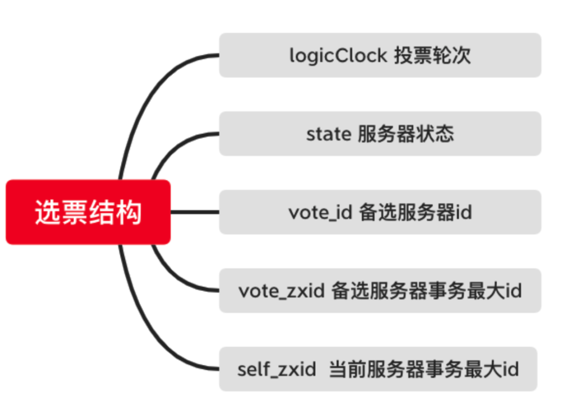

- logicClock：用来记录服务器的投票轮次。logicClock 会从 1 开始计数，每当该台服务经过一轮投票后，logicClock 的数值就会加 1 。
- state：用来标记当前服务器的状态。在 ZooKeeper 集群中一台服务器具有 LOOKING、FOLLOWING、LEADERING、OBSERVING 这四种状态。
- `self_id`：用来表示当前服务器的 ID 信息，该字段在 ZooKeeper 集群中主要用来作为服务器的身份标识符。
- `self_zxid`：当前服务器上所保存的数据的最大事务 ID ，从 0 开始计数。
- `vote_id`：投票要被推举的服务器的唯一 ID 。
- `vote_zxid`：被推举的服务器上所保存的数据的最大事务 ID ，从 0 开始计数。

当 ZooKeeper 集群需要重新选举出新的 Leader 服务器的时候，就会根据上面介绍的投票信息内容进行对比，以找出最适合的服务器。

**选票筛选**

当一台 Follow 服务器接收到网络中的其他 Follow 服务器的投票信息后，是如何进行对比来更新自己的投票信息的。

Follow 服务器进行选票对比的过程，如下图所示。

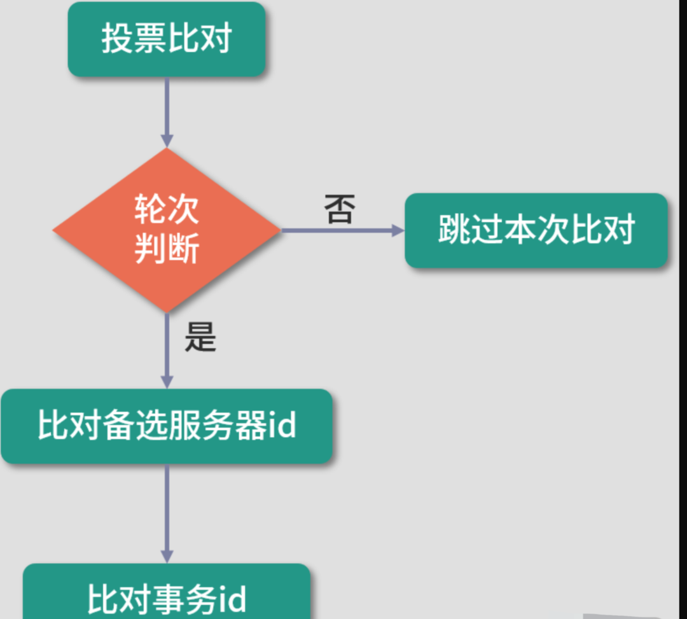

首先，会对比 logicClock 服务器的**投票轮次**，当 logicClock 相同时，表明两张选票处于相同的投票阶段，并进入下一阶段，否则跳过。

接下来再对比`vote_zxid`被选举的**服务器 ID 信息**，若接收到的外部投票信息中的 `vote_zxid`字段较大，则将自己的票中的`vote_zxid`与`vote_myid`更新为收到的票中的`vote_zxid`与`vote_myid`，并广播出去。

要是对比的结果相同，则继续对比`vote_myid`被选举服务器上所保存的**最大事务 ID** ，若外部投票的`vote_myid` 比较大，则将自己的票中的 `vote_myid`更新为收到的票中的`vote_myid` 。

经过这些对比和替换后，最终该台 Follow 服务器会产生新的投票信息，并在下一轮的投票中发送到 ZooKeeper 集群中。

### 消息广播

在 Leader 节点服务器处理请求后，需要通知集群中的其他角色服务器进行**数据同步**。ZooKeeper 集群采用消息广播的方式发送通知。

ZooKeeper 集群使用原子广播协议进行消息发送，该协议的底层实现过程与二阶段提交过程非常相似，如下图所示。

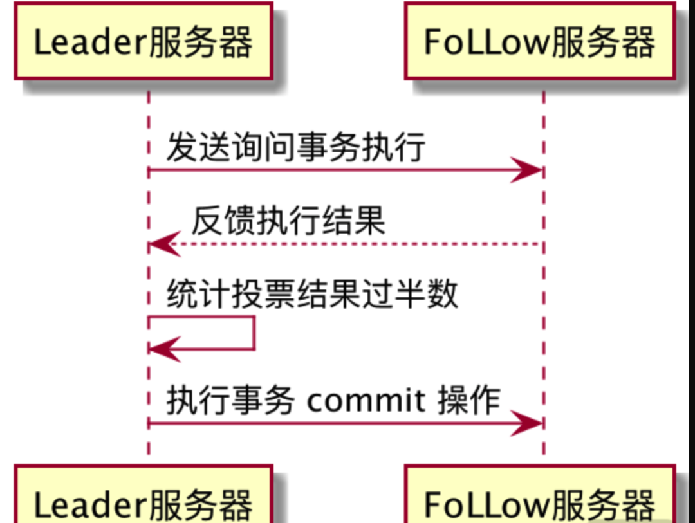

当要在集群中的其他角色服务器进行数据同步的时候，Leader 服务器将该操作过程封装成一个 Proposal 提交事务，并将其发送给集群中其他需要进行数据同步的服务器。

当这些服务器接收到 Leader 服务器的数据同步事务后，会将该条事务能否在本地正常执行的结果反馈给 Leader 服务器，Leader 服务器在接收到其他 Follow 服务器的反馈信息后进行统计，判断是否在集群中执行本次事务操作。

这里请注意 ，与二阶段提交过程不同（即需要集群中所有服务器都反馈可以执行事务操作后，主服务器再次发送 commit 提交请求执行数据变更） ，ZAB 协议算法省去了中断的逻辑，当 ZooKeeper 集群中有超过一半的 Follow 服务器能够正常执行事务操作后，整个 ZooKeeper 集群就可以提交 Proposal 事务了。

#### 数据同步

**Zookeeper 的数据同步通常分为四类：**

- 直接差异化同步（DIFF 同步）

- 先回滚再差异化同步（TRUNC+DIFF 同步）

- 仅回滚同步（TRUNC 同步）

- 全量同步（SNAP 同步）

**在进行数据同步前，Leader 服务器会完成数据同步初始化：**

- peerLastZxid
- minCommittedLog

### ZAB 和 Paxos 算法

**相同点：**

- 两者都存在一个类似于 Leader 进程的角色，由其负责协调多个 Follower 进程的运行

- Leader 进程都会等待超过半数的 Follower 做出正确的反馈后，才会将一个提案进行提交

- ZAB 协议中，每个 Proposal 中都包含一个 epoch 值来代表当前的 Leader周期，Paxos 中名字为 Ballot

**不同点：**

ZAB 用来构建高可用的分布式数据主备系统（Zookeeper），Paxos 是用来构建分布式一致性状态机系统。

## 日志清理

ZooKeeper 自身提供了 PurgeTxnLog 工具类，用来清理 snapshot 数据快照文件和系统日志。

PurgeTxnLog 清理方式通过定时脚本执行任务，使用 PurgeTxnLog 则可以在编写清除脚本的时候调用 ZooKeeper 为我们提供的工具类完成日志清理工作。

如下面的代码所示，首先，我们在/usr/bin目录下创建一个 PurgeLogsClean 脚本。注意这里的脚本也是一个 shell 文件。

在脚本中我们只需要编写 PurgeTxnLog 类的调用程序，系统就会自动通过 PurgeTxnLog 工具类为我们完成对应日志文件的清理工作。

```sh
#!/bin/sh  
java -cp "$CLASSPATH" org.apache.zookeeper.server.PurgeTxnLog 
echo "清理完成" 
```


## Java访问ZooKeeper

### 依赖

```xml
<!--ZooKeeper客户端--> 
<dependency> 
    <groupId>org.apache.zookeeper</groupId> 
    <artifactId>zookeeper</artifactId> 
    <version>3.4.13</version> 
</dependency>
```

### 操作

```java
public static void main(String[] args) throws IOException, KeeperException, InterruptedException {
    //获取ZooKeeper的连接，即创建ZooKeeper的客户端
    String connectString = "127.0.0.1:2181"; 	//服务器地址 
    int sessionTimeout = 3000; 					//超时时间，单位为毫秒
    Watcher watcher = new MyWatcher(); 
    ZooKeeper zkClient = new ZooKeeper(connectString, sessionTimeout, watcher);

    //Thread.sleep(2000); 
    //System.out.println(zkClient.getState());
    /** 
    * 操作ZooKeeper 
    */   
    // 查看指定节点下的内容 
    // List<String> children = zkClient.getChildren("/", true);//第二个参数表示是 否监视该节点    
    // System.out.println(children);
        
    // 创建节点，OPEN_ACL_UNSAFE表示acl权限列表为完全开放，PERSISTENT表示节点类型为持久化节点
	// zkClient.create("/world", "世界".getBytes(), ZooDefs.Ids.OPEN_ACL_UNSAFE, CreateMode.PERSISTENT);

	// 获取节点的数据（节点的值和节点状态Stat） 
    // byte[] data = zkClient.getData("/world", true, null); 
   	// System.out.println(new String(data));

    // Stat stat = new Stat(); 
    // byte[] data = zkClient.getData("/hello", true, stat); 
    // byte[] data = zkClient.getData("/hello", new DataWatcher(), stat); 
    // System.out.println(new String(data)); 
    // System.out.println(stat); 
    // System.out.println(stat.getCtime()); 
    // System.out.println(stat.getVersion()); 
    // System.out.println(stat.getDataLength());
        
    //修改节点的数据 
    // zkClient.setData("/hello","aaa".getBytes(),stat.getVersion()); //第三个参数表示当前节点的数据版本，一般先获取数据stat，然后指定数据版本 
    // zkClient.setData("/hello", "bbb".getBytes(), -1); //也可以设置为-1，表示不检测版本

	//删除节点 
    // zkClient.delete("/hello", -1);

	//判断节点是否存在 
    System.out.println(zkClient.exists("/hello",false)); //存在时返回节点状态，不 存在则返回null 
        
    //休眠 
    // Thread.sleep(1000000); 
        
    //关闭连接 
    zkClient.close();

}
```


参考：

[ZooKeeper面试题（2020最新版）](https://thinkwon.blog.csdn.net/article/details/104397719)


