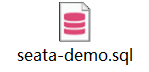
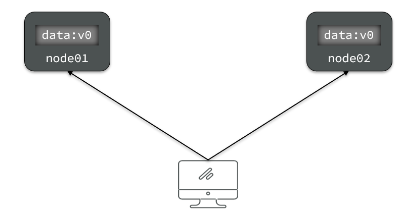
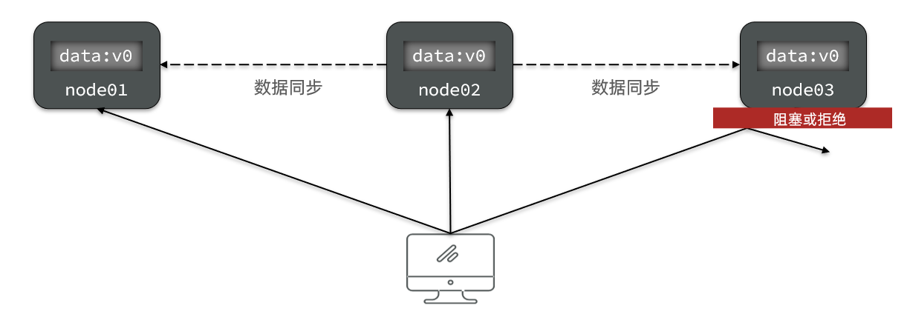
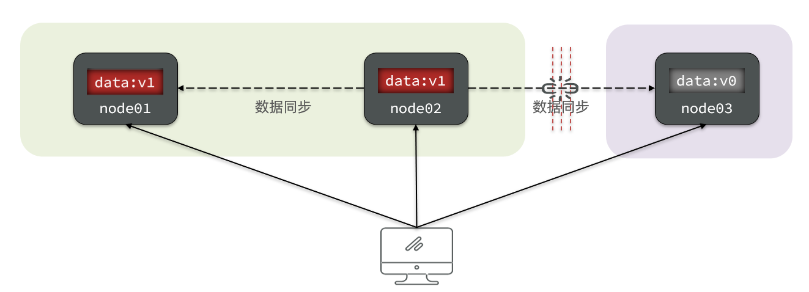
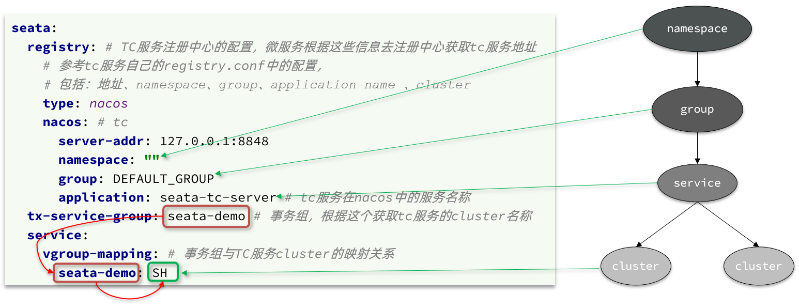
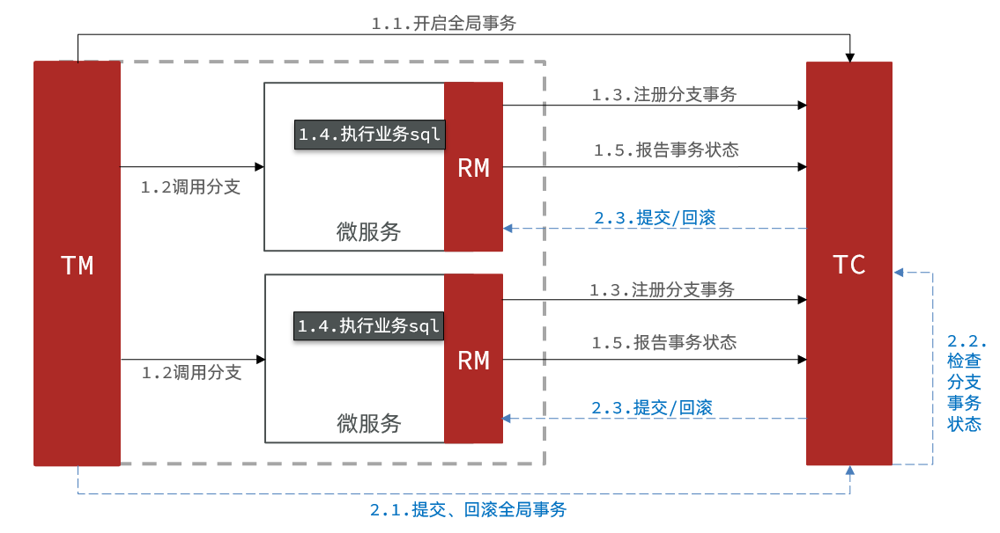

# 分布式事务


# 0.学习目标


# 1.分布式事务问题


## 1.1.本地事务

本地事务，也就是传统的**单机事务**。在传统数据库事务中，必须要满足四个原则：


## 1.2.分布式事务

**分布式事务**，就是指不是在单个服务或单个数据库架构下，产生的事务，例如：

- 跨数据源的分布式事务
- 跨服务的分布式事务
- 综合情况


在数据库水平拆分、服务垂直拆分之后，一个业务操作通常要跨多个数据库、服务才能完成。例如电商行业中比较常见的下单付款案例，包括下面几个行为：

- 创建新订单
- 扣减商品库存
- 从用户账户余额扣除金额


完成上面的操作需要访问三个不同的微服务和三个不同的数据库。


订单的创建、库存的扣减、账户扣款在每一个服务和数据库内是一个本地事务，可以保证ACID原则。

但是当我们把三件事情看做一个"业务"，要满足保证“业务”的原子性，要么所有操作全部成功，要么全部失败，不允许出现部分成功部分失败的现象，这就是**分布式系统下的事务**了。

此时ACID难以满足，这是分布式事务要解决的问题


## 1.3.演示分布式事务问题

我们通过一个案例来演示分布式事务的问题：

1）**创建数据库，名为seata_demo，然后导入课前资料提供的SQL文件：**

 

2）**导入课前资料提供的微服务：**

 

微服务结构如下：

 

其中：

seata-demo：父工程，负责管理项目依赖

- account-service：账户服务，负责管理用户的资金账户。提供扣减余额的接口
- storage-service：库存服务，负责管理商品库存。提供扣减库存的接口
- order-service：订单服务，负责管理订单。创建订单时，需要调用account-service和storage-service


**3）启动nacos、所有微服务**

**4）测试下单功能，发出Post请求：**

请求如下：

```sh
curl --location --request POST 'http://localhost:8082/order?userId=user202103032042012&commodityCode=100202003032041&count=20&money=200'
```

如图：


测试发现，当库存不足时，如果余额已经扣减，并不会回滚，出现了分布式事务问题。


# 2.理论基础

解决分布式事务问题，需要一些分布式系统的基础知识作为理论指导。

## 2.1.CAP定理

1998年，加州大学的计算机科学家 Eric Brewer 提出，分布式系统有三个指标。

> - Consistency（一致性）
> - Availability（可用性）
> - Partition tolerance （分区容错性）


它们的第一个字母分别是 C、A、P。

Eric Brewer 说，这三个指标不可能同时做到。这个结论就叫做 CAP 定理。


### 2.1.1.一致性

Consistency（一致性）：用户访问分布式系统中的任意节点，得到的数据必须一致。

比如现在包含两个节点，其中的初始数据是一致的：



当我们修改其中一个节点的数据时，两者的数据产生了差异：


要想保住一致性，就必须实现node01 到 node02的数据 同步：


### 2.1.2.可用性

Availability （可用性）：用户访问集群中的任意健康节点，必须能得到响应，而不是超时或拒绝。

如图，有三个节点的集群，访问任何一个都可以及时得到响应：


当有部分节点因为网络故障或其它原因无法访问时，代表节点不可用：




### 2.1.3.分区容错

**Partition（分区）**：因为网络故障或其它原因导致分布式系统中的部分节点与其它节点失去连接，形成独立分区。


**Tolerance（容错）**：在集群出现分区时，整个系统也要持续对外提供服务


### 2.1.4.矛盾

在分布式系统中，系统间的网络不能100%保证健康，一定会有故障的时候，而服务有必须对外保证服务。因此Partition Tolerance不可避免。

当节点接收到新的数据变更时，就会出现问题了：



如果此时要保证**一致性**，就必须等待网络恢复，完成数据同步后，整个集群才对外提供服务，服务处于阻塞状态，不可用。

如果此时要保证**可用性**，就不能等待网络恢复，那node01、node02与node03之间就会出现数据不一致。


也就是说，在P一定会出现的情况下，A和C之间只能实现一个。


## 2.2.BASE理论

BASE理论是对CAP的一种解决思路，包含三个思想：

- **Basically Available** **（基本可用）**：分布式系统在出现故障时，允许损失部分可用性，即保证核心可用。
- **Soft State（软状态）：**在一定时间内，允许出现中间状态，比如临时的不一致状态。
- **Eventually Consistent（最终一致性）**：虽然无法保证强一致性，但是在软状态结束后，最终达到数据一致。


## 2.3.解决分布式事务的思路

分布式事务最大的问题是各个子事务的一致性问题，因此可以借鉴CAP定理和BASE理论，有两种解决思路：

- AP模式：各子事务分别执行和提交，允许出现结果不一致，然后采用弥补措施恢复数据即可，实现**最终一致**。

- CP模式：各个子事务执行后互相等待，同时提交，同时回滚，达成**强一致**。但事务等待过程中，处于弱可用状态。


但不管是哪一种模式，都需要在子系统事务之间互相通讯，协调事务状态，也就是需要一个**事务协调者(TC)**：


这里的子系统事务，称为**分支事务**；有关联的各个分支事务在一起称为**全局事务**。


# 3.初识Seata

Seata是 2019 年 1 月份蚂蚁金服和阿里巴巴共同开源的分布式事务解决方案。致力于提供高性能和简单易用的分布式事务服务，为用户打造一站式的分布式解决方案。

官网地址：http://seata.io/，其中的文档、播客中提供了大量的使用说明、源码分析。


## 3.1.Seata的架构

Seata事务管理中有三个重要的角色：

- **TC (Transaction Coordinator) -** **事务协调者：**维护全局和分支事务的状态，协调全局事务提交或回滚。

- **TM (Transaction Manager) -** **事务管理器：**定义全局事务的范围、开始全局事务、提交或回滚全局事务。

- **RM (Resource Manager) -** **资源管理器：**管理分支事务处理的资源，与TC交谈以注册分支事务和报告分支事务的状态，并驱动分支事务提交或回滚。


整体的架构如图：


Seata基于上述架构提供了四种不同的分布式事务解决方案：

- XA模式：强一致性分阶段事务模式，牺牲了一定的可用性，无业务侵入
- TCC模式：最终一致的分阶段事务模式，有业务侵入
- AT模式：最终一致的分阶段事务模式，无业务侵入，也是Seata的默认模式
- SAGA模式：长事务模式，有业务侵入

无论哪种方案，都离不开TC，也就是事务的协调者。


## 3.2.部署TC服务

参考课前资料提供的文档《 seata的部署和集成.md 》：


## 3.3.微服务集成Seata

我们以order-service为例来演示。

### 3.3.1.引入依赖

首先，在order-service中引入依赖：

```xml
<!--seata-->
<dependency>
    <groupId>com.alibaba.cloud</groupId>
    <artifactId>spring-cloud-starter-alibaba-seata</artifactId>
    <exclusions>
        <!--版本较低，1.3.0，因此排除--> 
        <exclusion>
            <artifactId>seata-spring-boot-starter</artifactId>
            <groupId>io.seata</groupId>
        </exclusion>
    </exclusions>
</dependency>
<dependency>
    <groupId>io.seata</groupId>
    <artifactId>seata-spring-boot-starter</artifactId>
    <!--seata starter 采用1.4.2版本-->
    <version>${seata.version}</version>
</dependency>
```


### 3.3.2.配置TC地址

在order-service中的application.yml中，配置TC服务信息，通过注册中心nacos，结合服务名称获取TC地址：

```yaml
seata:
  registry: # TC服务注册中心的配置，微服务根据这些信息去注册中心获取tc服务地址
    type: nacos # 注册中心类型 nacos
    nacos:
      server-addr: 127.0.0.1:8848 # nacos地址
      namespace: "" # namespace，默认为空
      group: DEFAULT_GROUP # 分组，默认是DEFAULT_GROUP
      application: seata-tc-server # seata服务名称
      username: nacos
      password: nacos
  tx-service-group: seata-demo # 事务组名称
  service:
    vgroup-mapping: # 事务组与cluster的映射关系
      seata-demo: SH
```


微服务如何根据这些配置寻找TC的地址呢？

我们知道注册到Nacos中的微服务，确定一个具体实例需要四个信息：

- namespace：命名空间
- group：分组
- application：服务名
- cluster：集群名


以上四个信息，在刚才的yaml文件中都能找到：



namespace为空，就是默认的public

结合起来，TC服务的信息就是：public@DEFAULT_GROUP@seata-tc-server@SH，这样就能确定TC服务集群了。然后就可以去Nacos拉取对应的实例信息了。


### 3.3.3.其它服务

其它两个微服务也都参考order-service的步骤来做，完全一样。


# 4.动手实践

下面我们就一起学习下Seata中的四种不同的事务模式。


## 4.1.XA模式

XA 规范 是 X/Open 组织定义的分布式事务处理（DTP，Distributed Transaction Processing）标准，XA 规范 描述了全局的TM与局部的RM之间的接口，几乎所有主流的数据库都对 XA 规范 提供了支持。


### 4.1.1.两阶段提交

XA是规范，目前主流数据库都实现了这种规范，实现的原理都是基于两阶段提交。

正常情况：


异常情况：


一阶段：

- 事务协调者通知每个事物参与者执行本地事务
- 本地事务执行完成后报告事务执行状态给事务协调者，此时事务不提交，继续持有数据库锁

二阶段：

- 事务协调者基于一阶段的报告来判断下一步操作
  - 如果一阶段都成功，则通知所有事务参与者，提交事务
  - 如果一阶段任意一个参与者失败，则通知所有事务参与者回滚事务


### 4.1.2.Seata的XA模型


**第一阶段 RM执行sql，第二阶段 TC提交或回滚全局事务**


Seata对原始的XA模式做了简单的封装和改造，以适应自己的事务模型，基本架构如图：




RM一阶段的工作：

​	① 注册分支事务到TC

​	② 执行分支业务sql但不提交

​	③ 报告执行状态到TC

TC二阶段的工作：

- TC检测各分支事务执行状态

  a.如果都成功，通知所有RM提交事务

  b.如果有失败，通知所有RM回滚事务

RM二阶段的工作：

- 接收TC指令，提交或回滚事务


### 4.1.3.优缺点

XA模式的优点是什么？

- 事务的强一致性，满足ACID原则。
- 常用数据库都支持，实现简单，并且没有代码侵入

XA模式的缺点是什么？

- 因为一阶段需要锁定数据库资源，等待二阶段结束才释放，性能较差
- 依赖关系型数据库实现事务


### 4.1.4.实现XA模式

Seata的starter已经完成了XA模式的自动装配，实现非常简单，步骤如下：

1）修改application.yml文件（每个参与事务的微服务），开启XA模式：

```yaml
seata:
  data-source-proxy-mode: XA
```


2）给发起全局事务的入口方法添加@GlobalTransactional注解:

本例中是OrderServiceImpl中的create方法.


3）重启服务并测试

重启order-service，再次测试，发现无论怎样，三个微服务都能成功回滚。


### 实现多数据源事务同步

```xml
<dependency>
    <groupId>org.springframework.boot</groupId>
    <artifactId>spring-boot-starter-jta-atomikos</artifactId>
</dependency>
```

```java
import com.atomikos.jdbc.AtomikosDataSourceBean;
import com.mysql.cj.jdbc.MysqlXADataSource;
import org.springframework.context.annotation.Bean;
import org.springframework.context.annotation.Configuration;
import org.springframework.context.annotation.Primary;
import javax.sql.DataSource;

// 使用 MysqlXADataSource 作为 XA 数据源，AtomikosDataSourceBean 作为 XA 数据源的包装器，它能与 Spring 集成并管理 XA 事务。
@Configuration
public class DataSourceConfig {

    @Bean(name = "dataSource1", initMethod = "init", destroyMethod = "close")
    @Primary
    public DataSource dataSource1() {
        MysqlXADataSource mysqlXaDataSource = new MysqlXADataSource();
        mysqlXaDataSource.setUrl("jdbc:mysql://localhost:3306/db1");
        mysqlXaDataSource.setUser("root");
        mysqlXaDataSource.setPassword("root");

        AtomikosDataSourceBean xaDataSource = new AtomikosDataSourceBean();
        xaDataSource.setXaDataSource(mysqlXaDataSource);
        xaDataSource.setUniqueResourceName("dataSource1");
        return xaDataSource;
    }

    @Bean(name = "dataSource2", initMethod = "init", destroyMethod = "close")
    public DataSource dataSource2() {
        MysqlXADataSource mysqlXaDataSource = new MysqlXADataSource();
        mysqlXaDataSource.setUrl("jdbc:mysql://localhost:3306/db2");
        mysqlXaDataSource.setUser("root");
        mysqlXaDataSource.setPassword("root");

        AtomikosDataSourceBean xaDataSource = new AtomikosDataSourceBean();
        xaDataSource.setXaDataSource(mysqlXaDataSource);
        xaDataSource.setUniqueResourceName("dataSource2");
        return xaDataSource;
    }
}
```

```java
import com.atomikos.icatch.jta.UserTransactionImp;
import com.atomikos.icatch.jta.UserTransactionManager;
import org.springframework.context.annotation.Bean;
import org.springframework.context.annotation.Configuration;
import org.springframework.transaction.PlatformTransactionManager;
import org.springframework.transaction.jta.JtaTransactionManager;
import javax.transaction.UserTransaction;

// 创建一个基于 Atomikos 的 XA 事务管理器，用于协调多个数据源的事务。
@Configuration
public class TransactionManagerConfig {

    @Bean(name = "userTransaction")
    public UserTransaction userTransaction() throws Throwable {
        UserTransactionImp userTransactionImp = new UserTransactionImp();
        userTransactionImp.setTransactionTimeout(10000);
        return userTransactionImp;
    }

    @Bean(name = "atomikosTransactionManager", initMethod = "init", destroyMethod = "close")
    public UserTransactionManager atomikosTransactionManager() throws Throwable {
        UserTransactionManager userTransactionManager = new UserTransactionManager();
        userTransactionManager.setForceShutdown(false);
        return userTransactionManager;
    }

    @Bean(name = "transactionManager")
    public PlatformTransactionManager transactionManager() throws Throwable {
        UserTransaction userTransaction = userTransaction();
        UserTransactionManager userTransactionManager = atomikosTransactionManager();
        return new JtaTransactionManager(userTransaction, userTransactionManager);
    }
}
```


## 4.2.AT模式

AT模式同样是分阶段提交的事务模型，不过缺弥补了XA模型中资源锁定周期过长的缺陷。

### 4.2.1.Seata的AT模型


**第一阶段执行SQL后直接释放DB锁，记录更新前后的数据快照，但是在释放DB锁之前会添加全局锁，锁定该事务操作的具体字段（防止同样被Seata管理的事务修改同一个字段，事务回滚覆盖），同时会比较当前数据库数据和更新后的数据快照（防止未被Seata管理的事务修改同一个字段）**

**第二阶段是对undo log（数据快照的恢复或删除）**


基本流程图：


阶段一RM的工作：

- 注册分支事务
- 记录undo-log（数据快照）
- 执行业务sql并提交
- 报告事务状态

阶段二提交时RM的工作：

- 删除undo-log即可

阶段二回滚时RM的工作：

- 根据undo-log恢复数据到更新前


### 4.2.2.流程梳理

我们用一个真实的业务来梳理下AT模式的原理。

比如，现在又一个数据库表，记录用户余额：

| **id** | **money** |
| ------ | --------- |
| 1      | 100       |

其中一个分支业务要执行的SQL为：

```sql
update tb_account set money = money - 10 where id = 1
```


AT模式下，当前分支事务执行流程如下：

一阶段：

1）TM发起并注册全局事务到TC

2）TM调用分支事务

3）分支事务准备执行业务SQL

4）RM拦截业务SQL，根据where条件查询原始数据，形成快照。

```json
{
    "id": 1, "money": 100
}
```

5）RM执行业务SQL，提交本地事务，释放数据库锁。此时 `money = 90`

6）RM报告本地事务状态给TC


二阶段：

1）TM通知TC事务结束

2）TC检查分支事务状态

​	 a）如果都成功，则立即删除快照

​	 b）如果有分支事务失败，需要回滚。读取快照数据（`{"id": 1, "money": 100}`），将快照恢复到数据库。此时数据库再次恢复为100


流程图：


### 4.2.3.AT与XA的区别

简述AT模式与XA模式最大的区别是什么？

- XA模式一阶段不提交事务，锁定资源；AT模式一阶段直接提交，不锁定资源。
- XA模式依赖数据库机制实现回滚；AT模式利用数据快照实现数据回滚。
- XA模式强一致；AT模式最终一致


### 4.2.4.脏写问题

在多线程并发访问AT模式的分布式事务时，有可能出现脏写问题，如图：


解决思路就是引入了全局锁的概念。在释放DB锁之前，先拿到全局锁。避免同一时刻有另外一个事务来操作当前数据。


### 4.2.5.优缺点

AT模式的优点：

- 一阶段完成直接提交事务，释放数据库资源，性能比较好
- 利用全局锁实现读写隔离
- 没有代码侵入，框架自动完成回滚和提交

AT模式的缺点：

- 两阶段之间属于软状态，属于最终一致
- 框架的快照功能会影响性能，但比XA模式要好很多


### 4.2.6.实现AT模式

AT模式中的快照生成、回滚等动作都是由框架自动完成，没有任何代码侵入，因此实现非常简单。

只不过，AT模式需要一个表来记录全局锁、另一张表来记录数据快照undo_log。


1）导入数据库表，记录全局锁

导入课前资料提供的Sql文件：seata-at.sql，其中lock_table导入到TC服务关联的数据库，undo_log表导入到微服务关联的数据库：


2）修改application.yml文件，将事务模式修改为AT模式即可：

```yaml
seata:
  data-source-proxy-mode: AT # 默认就是AT
```


3）重启服务并测试


### 实现多数据源事务同步

```java
import com.alibaba.druid.pool.DruidDataSource;
import com.alibaba.druid.spring.boot.autoconfigure.DruidDataSourceBuilder;
import io.seata.rm.datasource.DataSourceProxy;
import org.springframework.beans.factory.annotation.Qualifier;
import org.springframework.boot.context.properties.ConfigurationProperties;
import org.springframework.context.annotation.Bean;
import org.springframework.context.annotation.Configuration;
import org.springframework.context.annotation.Primary;

import javax.sql.DataSource;

// 创建两个数据源配置类，使用 Seata 的DataSourceProxy代理数据源。
@Configuration
public class DataSourceConfig {

    @Bean(name = "dataSource1")
    @ConfigurationProperties(prefix = "spring.datasource.datasource1")
    public DataSource dataSource1() {
        return DruidDataSourceBuilder.create().build();
    }

    @Bean(name = "dataSourceProxy1")
    public DataSourceProxy dataSourceProxy1(@Qualifier("dataSource1") DataSource dataSource) {
        return new DataSourceProxy(dataSource);
    }

    @Bean(name = "dataSource2")
    @ConfigurationProperties(prefix = "spring.datasource.datasource2")
    public DataSource dataSource2() {
        return DruidDataSourceBuilder.create().build();
    }

    @Bean(name = "dataSourceProxy2")
    public DataSourceProxy dataSourceProxy2(@Qualifier("dataSource2") DataSource dataSource) {
        return new DataSourceProxy(dataSource);
    }
}
```

在 Seata 的 AT 模式下，识别分支事务是由 Seata 框架自动完成的，其底层依赖于数据源代理（`DataSourceProxy`）和 SQL 解析等机制。

- `DataSourceProxy`是 Seata 实现分布式事务的关键组件之一。
  - **SQL 执行拦截**：当应用程序通过被代理的数据源执行 SQL 操作时，`DataSourceProxy`会拦截这些操作，将其标记为分支事务的一部分。具体来说，`DataSourceProxy`会在执行 SQL 之前和之后进行一系列操作，包括记录数据的前置镜像（修改前的数据快照）和后置镜像（修改后的数据快照）。这些镜像数据会存储在数据库的回滚日志表中。
  - **分支事务注册**：`DataSourceProxy`会将每个分支事务的相关信息（如 XID、分支事务 ID、执行的 SQL 语句等）注册到 Seata Server。Seata Server 会根据这些信息来管理和协调全局事务和分支事务。
  - **分支事务 ID 生成**：每个分支事务都会被分配一个唯一的分支事务 ID。这个 ID 是由 Seata 框架自动生成的，用于标识每个分支事务。
- 当调用使用了`@GlobalTransactional`注解方法时，Seata 会自动开启一个全局事务，并生成一个全局事务 ID（XID）。这个 XID 会被传递到各个分支事务中，用于标识这些分支事务属于同一个全局事务。


```mysql
CREATE TABLE `undo_log` (
  `id` bigint(20) NOT NULL AUTO_INCREMENT,
  `branch_id` bigint(20) NOT NULL,
  `xid` varchar(100) NOT NULL,
  `context` varchar(128) NOT NULL,
  `rollback_info` longblob NOT NULL,
  `log_status` int(11) NOT NULL,
  `log_created` datetime NOT NULL,
  `log_modified` datetime NOT NULL,
  `ext` varchar(100) DEFAULT NULL,
  PRIMARY KEY (`id`),
  UNIQUE KEY `ux_undo_log` (`xid`,`branch_id`)
) ENGINE=InnoDB AUTO_INCREMENT=1 DEFAULT CHARSET=utf8mb4;
```

在 Seata 的 AT 模式下，需要开发者手动在每个参与分布式事务的数据库中创建 `undo_log` 表来记录数据快照等信息。AT 模式采用两阶段提交的思想，在第一阶段业务 SQL 执行时，Seata 的数据源代理（`DataSourceProxy`）会自动记录数据的前置镜像（修改前的数据快照）和后置镜像（修改后的数据快照），这些镜像数据以及其他事务相关的元数据需要存储在 `undo_log` 表中。当全局事务需要回滚时，Seata 会根据 `undo_log` 表中的前置镜像将数据恢复到修改前的状态，以此保证数据的一致性。由于 Seata 不会自动在数据库中创建该表，所以需要开发者手动创建。

**每个数据源都要创建**：如果项目中有多个数据源参与分布式事务，需要在每个数据源对应的数据库中都创建 `undo_log` 表，以确保 Seata 能够正确记录和管理每个数据源上的事务回滚信息。


**XA和AT实现比较**

- **数据源配置**：AT 模式使用 `DataSourceProxy` 代理数据源，XA 模式使用 XA 数据源和 XA 数据源包装器（如 `AtomikosDataSourceBean`）。
- **事务管理**：AT 模式依靠 Seata 自身的事务协调机制，XA 模式需要配置 XA 事务管理器（如基于 Atomikos 的）。
- **业务代码**：整体结构基本相同，都使用 `@GlobalTransactional` 注解开启全局事务，但底层事务管理机制不同。

## 4.3.TCC模式

TCC模式与AT模式非常相似，每阶段都是独立事务，不同的是TCC通过人工编码来实现数据恢复。需要实现三个方法：

- Try：资源的检测和预留； 

- Confirm：完成资源操作业务；要求 Try 成功 Confirm 一定要能成功。

- Cancel：预留资源释放，可以理解为try的反向操作。


### 4.3.1.流程分析

举例，一个扣减用户余额的业务。假设账户A原来余额是100，需要余额扣减30元。

- **阶段一（ Try ）**：检查余额是否充足，如果充足则冻结金额增加30元，可用余额扣除30

初识余额：


余额充足，可以冻结：


此时，总金额 = 冻结金额 + 可用金额，数量依然是100不变。事务直接提交无需等待其它事务。


- **阶段二（Confirm)**：假如要提交（Confirm），则冻结金额扣减30

确认可以提交，不过之前可用金额已经扣减过了，这里只要清除冻结金额就好了：


此时，总金额 = 冻结金额 + 可用金额 = 0 + 70  = 70元


- **阶段二(Canncel)**：如果要回滚（Cancel），则冻结金额扣减30，可用余额增加30

需要回滚，那么就要释放冻结金额，恢复可用金额：


### 4.3.2.Seata的TCC模型

Seata中的TCC模型依然延续之前的事务架构，如图：


### 4.3.3.优缺点

TCC模式的每个阶段是做什么的？

- Try：资源检查和预留
- Confirm：业务执行和提交
- Cancel：预留资源的释放

TCC的优点是什么？

- 一阶段完成直接提交事务，释放数据库资源，性能好
- 相比AT模型，无需生成快照，无需使用全局锁，性能最强
- 不依赖数据库事务，而是依赖补偿操作，可以用于非事务型数据库

TCC的缺点是什么？

- 有代码侵入，需要人为编写try、Confirm和Cancel接口，太麻烦
- 软状态，事务是最终一致
- 需要考虑Confirm和Cancel的失败情况，做好幂等处理


### 4.3.4.事务悬挂和空回滚

#### 1）空回滚

当某分支事务的try阶段**阻塞**时，可能导致全局事务超时而触发二阶段的cancel操作。在未执行try操作时先执行了cancel操作，这时cancel不能做回滚，就是**空回滚**。

如图：


执行cancel操作时，应当判断try是否已经执行，如果尚未执行，则应该空回滚。


#### 2）业务悬挂

对于已经空回滚的业务，之前被阻塞的try操作恢复，继续执行try，就永远不可能confirm或cancel ，事务一直处于中间状态，这就是**业务悬挂**。

执行try操作时，应当判断cancel是否已经执行过了，如果已经执行，应当阻止空回滚后的try操作，避免悬挂


### 4.3.5.实现TCC模式

解决空回滚和业务悬挂问题，必须要记录当前事务状态，是在try、还是cancel？


#### 1）思路分析

这里我们定义一张表：

```sql
CREATE TABLE `account_freeze_tbl` (
  `xid` varchar(128) NOT NULL,
  `user_id` varchar(255) DEFAULT NULL COMMENT '用户id',
  `freeze_money` int(11) unsigned DEFAULT '0' COMMENT '冻结金额',
  `state` int(1) DEFAULT NULL COMMENT '事务状态，0:try，1:confirm，2:cancel',
  PRIMARY KEY (`xid`) USING BTREE
) ENGINE=InnoDB DEFAULT CHARSET=utf8 ROW_FORMAT=COMPACT;

```

其中：

- xid：是全局事务id
- freeze_money：用来记录用户冻结金额
- state：用来记录事务状态


那此时，我们的业务开怎么做呢？

- Try业务：
  - 记录冻结金额和事务状态到account_freeze表
  - 扣减account表可用金额
- Confirm业务
  - 根据xid删除account_freeze表的冻结记录
- Cancel业务
  - 修改account_freeze表，冻结金额为0，state为2
  - 修改account表，恢复可用金额
- 如何判断是否空回滚？
  - cancel业务中，根据xid查询account_freeze，如果为null则说明try还没做，需要空回滚
- 如何避免业务悬挂？
  - try业务中，根据xid查询account_freeze ，如果已经存在则证明Cancel已经执行，拒绝执行try业务


接下来，我们改造account-service，利用TCC实现余额扣减功能。


#### 2）声明TCC接口

TCC的Try、Confirm、Cancel方法都需要在接口中基于注解来声明，

我们在account-service项目中的`cn.itcast.account.service`包中新建一个接口，声明TCC三个接口：

```java
package cn.itcast.account.service;

import io.seata.rm.tcc.api.BusinessActionContext;
import io.seata.rm.tcc.api.BusinessActionContextParameter;
import io.seata.rm.tcc.api.LocalTCC;
import io.seata.rm.tcc.api.TwoPhaseBusinessAction;

@LocalTCC
public interface AccountTCCService {

    @TwoPhaseBusinessAction(name = "deduct", commitMethod = "confirm", rollbackMethod = "cancel")
    void deduct(@BusinessActionContextParameter(paramName = "userId") String userId,
                @BusinessActionContextParameter(paramName = "money")int money);

    boolean confirm(BusinessActionContext ctx);

    boolean cancel(BusinessActionContext ctx);
}
```


#### 3）编写实现类

在account-service服务中的`cn.itcast.account.service.impl`包下新建一个类，实现TCC业务：

```java
package cn.itcast.account.service.impl;

import cn.itcast.account.entity.AccountFreeze;
import cn.itcast.account.mapper.AccountFreezeMapper;
import cn.itcast.account.mapper.AccountMapper;
import cn.itcast.account.service.AccountTCCService;
import io.seata.core.context.RootContext;
import io.seata.rm.tcc.api.BusinessActionContext;
import lombok.extern.slf4j.Slf4j;
import org.springframework.beans.factory.annotation.Autowired;
import org.springframework.stereotype.Service;
import org.springframework.transaction.annotation.Transactional;

@Service
@Slf4j
public class AccountTCCServiceImpl implements AccountTCCService {

    @Autowired
    private AccountMapper accountMapper;
    @Autowired
    private AccountFreezeMapper freezeMapper;

    @Override
    @Transactional
    public void deduct(String userId, int money) {
        // 0.获取事务id
        String xid = RootContext.getXID();
        // 1.扣减可用余额
        accountMapper.deduct(userId, money);
        // 2.记录冻结金额，事务状态
        AccountFreeze freeze = new AccountFreeze();
        freeze.setUserId(userId);
        freeze.setFreezeMoney(money);
        freeze.setState(AccountFreeze.State.TRY);
        freeze.setXid(xid);
        freezeMapper.insert(freeze);
    }

    @Override
    public boolean confirm(BusinessActionContext ctx) {
        // 1.获取事务id
        String xid = ctx.getXid();
        // 2.根据id删除冻结记录
        int count = freezeMapper.deleteById(xid);
        return count == 1;
    }

    @Override
    public boolean cancel(BusinessActionContext ctx) {
        // 0.查询冻结记录
        String xid = ctx.getXid();
        AccountFreeze freeze = freezeMapper.selectById(xid);

        // 1.恢复可用余额
        accountMapper.refund(freeze.getUserId(), freeze.getFreezeMoney());
        // 2.将冻结金额清零，状态改为CANCEL
        freeze.setFreezeMoney(0);
        freeze.setState(AccountFreeze.State.CANCEL);
        int count = freezeMapper.updateById(freeze);
        return count == 1;
    }
}
```


## 4.4.SAGA模式

Saga 模式是 Seata 即将开源的长事务解决方案，将由蚂蚁金服主要贡献。

其理论基础是Hector & Kenneth  在1987年发表的论文[Sagas](https://microservices.io/patterns/data/saga.html)。

Seata官网对于Saga的指南：https://seata.io/zh-cn/docs/user/saga.html

### 4.4.1.原理

在 Saga 模式下，分布式事务内有多个参与者，每一个参与者都是一个冲正补偿服务，需要用户根据业务场景实现其正向操作和逆向回滚操作。

分布式事务执行过程中，依次执行各参与者的正向操作，如果所有正向操作均执行成功，那么分布式事务提交。如果任何一个正向操作执行失败，那么分布式事务会去退回去执行前面各参与者的逆向回滚操作，回滚已提交的参与者，使分布式事务回到初始状态。


Saga也分为两个阶段：

- 一阶段：直接提交本地事务
- 二阶段：成功则什么都不做；失败则通过编写补偿业务来回滚


### 4.4.2.优缺点


优点：

- 事务参与者可以基于事件驱动实现异步调用，吞吐高
- 一阶段直接提交事务，无锁，性能好
- 不用编写TCC中的三个阶段，实现简单

缺点：

- 软状态持续时间不确定，时效性差
- 没有锁，没有事务隔离，会有脏写

## 4.5.四种模式对比

我们从以下几个方面来对比四种实现：

- 一致性：能否保证事务的一致性？强一致还是最终一致？
- 隔离性：事务之间的隔离性如何？
- 代码侵入：是否需要对业务代码改造？
- 性能：有无性能损耗？
- 场景：常见的业务场景


如图：


# 5.高可用

Seata的TC服务作为分布式事务核心，一定要保证集群的高可用性。

## 5.1.高可用架构模型

搭建TC服务集群非常简单，启动多个TC服务，注册到nacos即可。


但集群并不能确保100%安全，万一集群所在机房故障怎么办？所以如果要求较高，一般都会做异地多机房容灾。


比如一个TC集群在上海，另一个TC集群在杭州：


微服务基于事务组（tx-service-group)与TC集群的映射关系，来查找当前应该使用哪个TC集群。当SH集群故障时，只需要将vgroup-mapping中的映射关系改成HZ。则所有微服务就会切换到HZ的TC集群了。


## 5.2.实现高可用

具体实现请参考课前资料提供的文档《seata的部署和集成.md》：


第三章节：


